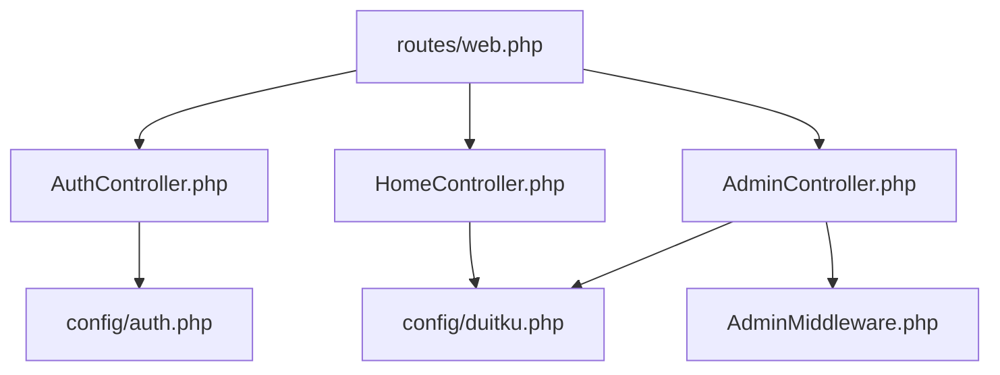
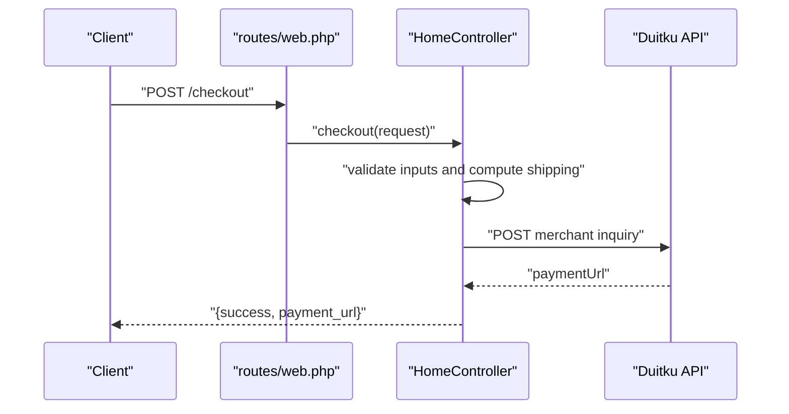
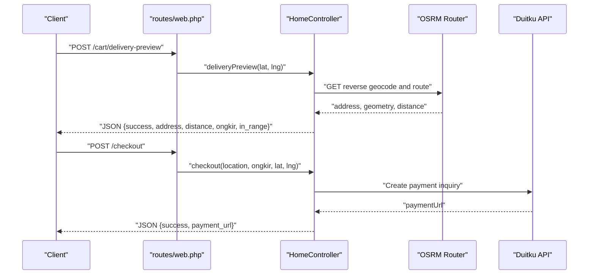
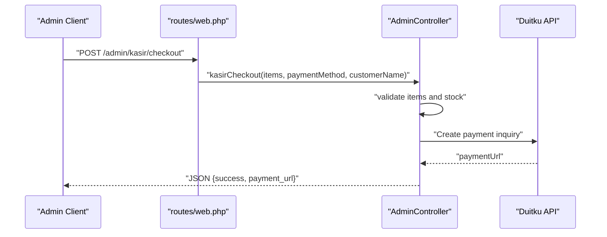
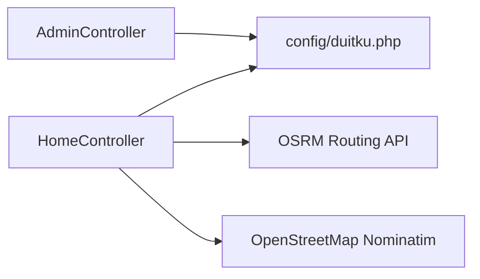
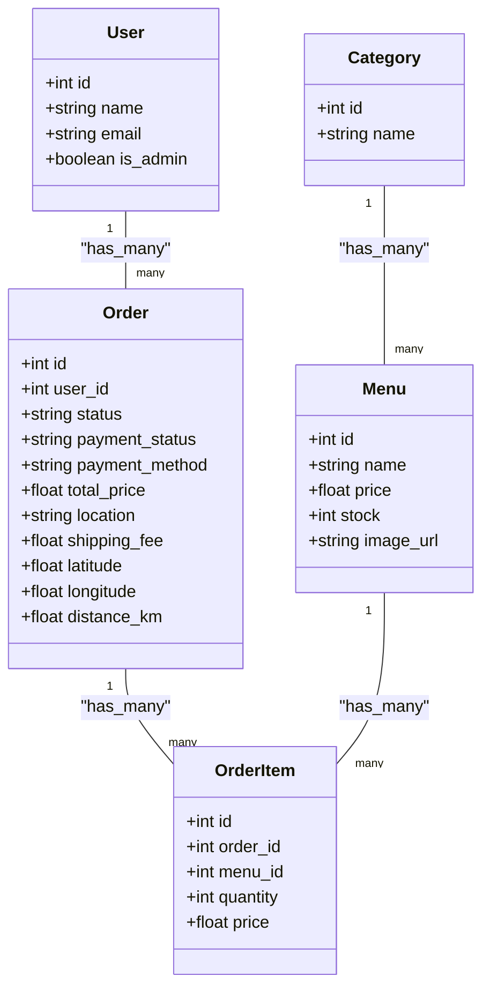

# API Reference

<cite>
**Referenced Files in This Document**
- [routes/web.php](file://routes/web.php)
- [AuthController.php](file://app/Http/Controllers/AuthController.php)
- [HomeController.php](file://app/Http/Controllers/HomeController.php)
- [AdminController.php](file://app/Http/Controllers/AdminController.php)
- [AdminMiddleware.php](file://app/Http/Middleware/AdminMiddleware.php)
- [auth.php](file://config/auth.php)
- [duitku.php](file://config/duitku.php)
- [User.php](file://app/Models/User.php)
- [Menu.php](file://app/Models/Menu.php)
- [Order.php](file://app/Models/Order.php)
- [OrderItem.php](file://app/Models/OrderItem.php)
- [Category.php](file://app/Models/Category.php)
</cite>

## Table of Contents
1. [Introduction](#introduction)
2. [Project Structure](#project-structure)
3. [Core Components](#core-components)
4. [Architecture Overview](#architecture-overview)
5. [Detailed Component Analysis](#detailed-component-analysis)
6. [Dependency Analysis](#dependency-analysis)
7. [Performance Considerations](#performance-considerations)
8. [Troubleshooting Guide](#troubleshooting-guide)
9. [Conclusion](#conclusion)
10. [Appendices](#appendices)

## Introduction
This document describes the public REST-like API surface of the Kantin Ibu Ida system. It covers HTTP methods, URL patterns, request/response schemas, authentication, and operational behavior for user authentication, menu browsing, cart/order management, payment processing, and administrative operations. The backend is implemented in Laravel; while many routes render views, several endpoints expose JSON responses suitable for client integrations.

## Project Structure
The API surface is primarily defined in routes and controllers. Routes are declared in the web router and grouped by authentication and role. Controllers implement business logic for authentication, ordering, cart updates, payment callbacks, and admin operations.

**Diagram sources**
- [routes/web.php:1-71](file://routes/web.php#L1-L71)
- [AuthController.php:1-78](file://app/Http/Controllers/AuthController.php#L1-L78)
- [HomeController.php:1-568](file://app/Http/Controllers/HomeController.php#L1-L568)
- [AdminController.php:1-257](file://app/Http/Controllers/AdminController.php#L1-L257)
- [AdminMiddleware.php:1-26](file://app/Http/Middleware/AdminMiddleware.php#L1-L26)
- [auth.php:1-116](file://config/auth.php#L1-L116)
- [duitku.php:1-12](file://config/duitku.php#L1-L12)

**Section sources**
- [routes/web.php:1-71](file://routes/web.php#L1-L71)

## Core Components
- Authentication: Session-based authentication via form submissions and redirects. Admin-only endpoints require admin middleware.
- Ordering: Cart management, delivery preview, checkout, and payment via Duitku.
- Administration: CRUD for menus/users/orders and POS checkout with stock management.

Key implementation references:
- Authentication endpoints: [routes/web.php:27-31](file://routes/web.php#L27-L31), [AuthController.php:17-76](file://app/Http/Controllers/AuthController.php#L17-L76)
- Customer cart/order lifecycle: [routes/web.php:33-48](file://routes/web.php#L33-L48), [HomeController.php:57-408](file://app/Http/Controllers/HomeController.php#L57-L408)
- Payment callback: [routes/web.php:50](file://routes/web.php#L50), [HomeController.php:410-452](file://app/Http/Controllers/HomeController.php#L410-L452)
- Admin operations: [routes/web.php:52-70](file://routes/web.php#L52-L70), [AdminController.php:12-256](file://app/Http/Controllers/AdminController.php#L12-L256)

**Section sources**
- [routes/web.php:27-70](file://routes/web.php#L27-L70)
- [AuthController.php:17-76](file://app/Http/Controllers/AuthController.php#L17-L76)
- [HomeController.php:57-408](file://app/Http/Controllers/HomeController.php#L57-L408)
- [AdminController.php:12-256](file://app/Http/Controllers/AdminController.php#L12-L256)

## Architecture Overview
The system uses Laravel’s routing and controllers. Authentication is handled by the session guard. Payment processing integrates with Duitku using configuration-driven endpoints. Admin operations are protected by middleware.

**Diagram sources**
- [routes/web.php:42](file://routes/web.php#L42)
- [HomeController.php:275-408](file://app/Http/Controllers/HomeController.php#L275-L408)
- [duitku.php:1-12](file://config/duitku.php#L1-L12)

## Detailed Component Analysis

### Authentication Endpoints
- POST /login
  - Purpose: Authenticate user by email or username and password.
  - Request body: email (string), password (string).
  - Responses:
    - 200 OK: Redirects to home or admin dashboard depending on role.
    - 422 Unprocessable Entity: Validation errors.
    - 401 Unauthorized: Credentials invalid.
  - Notes: Accepts either email or username for login type detection.

- POST /register
  - Purpose: Register a new user.
  - Request body: name (string), email (string), password (string, min 8, confirmed).
  - Responses: 302 Found to home after successful creation.

- POST /logout
  - Purpose: Invalidate current session and regenerate CSRF token.
  - Responses: 302 Found to home.

Security and behavior:
- Guard: session (web).
- Admin-only access enforced by middleware on admin routes.

**Section sources**
- [routes/web.php:27-31](file://routes/web.php#L27-L31)
- [AuthController.php:17-76](file://app/Http/Controllers/AuthController.php#L17-L76)
- [auth.php:38-43](file://config/auth.php#L38-L43)

### Customer Cart and Orders
- GET /menu
  - Purpose: List all available menus.
  - Responses: HTML view; intended for browser.

- GET /menu/{menu}
  - Purpose: View a single menu item.
  - Responses: HTML view.

- POST /order
  - Purpose: Add or update quantity of a menu item in the pending order.
  - Request body: menu_id (integer, exists in menus), quantity (integer ≥ 1).
  - Responses:
    - JSON on success: {success: true, cartCount: integer}.
    - JSON on failure: {success: false, message: string}.
  - Behavior: Creates a pending order if none exists for the user.

- GET /cart
  - Purpose: View current pending order/cart.
  - Responses: HTML view.

- POST /cart/update/{id}
  - Purpose: Increase or decrease item quantity.
  - Request body: action (string, "increase" or "decrease").
  - Responses:
    - JSON on success: {success: true, cartCount, totalPrice, itemQuantity, itemId}.
    - JSON on failure: {success: false, message}.

- DELETE /cart/remove/{id}
  - Purpose: Remove an item from the cart.
  - Responses:
    - JSON on success: {success: true, cartCount, totalPrice}.

- POST /cart/delivery-preview
  - Purpose: Estimate delivery feasibility and cost.
  - Request body: lat (number), lng (number).
  - Responses:
    - JSON: {success, address, distance, ongkir, in_range, route_geometry, message, geocode_error}.

- POST /checkout
  - Purpose: Prepare order for payment and obtain payment URL.
  - Request body: location (string), ongkir (integer ≥ 1), distance (optional number), lat (number), lng (number), paymentMethod (optional).
  - Responses:
    - 422 Unprocessable Entity: Route calculation failed or outside delivery range.
    - 500 Internal Server Error: Duitku configuration missing.
    - JSON: {success, payment_url}.

- POST /payment/success
  - Purpose: Redirect confirmation after payment.
  - Responses: 302 Found to home with success message.

- GET /orders
  - Purpose: View past orders (non-pending).
  - Responses: HTML view.

- POST /orders/{id}/confirm
  - Purpose: Confirm receipt of an order to mark as finished.
  - Responses: Redirect with success or error.

- GET /invoice/{order}
  - Purpose: View order invoice; accessible only to owner or admin.
  - Responses: HTML view.

Payment callback:
- POST /callback
  - Purpose: Receive Duitku webhook to finalize payment.
  - Request body: Duitku-provided fields including signature verification.
  - Behavior: On success, sets order status to “dibuat”, payment_status to “paid”, decrements menu stock.

**Diagram sources**
- [routes/web.php:39-47](file://routes/web.php#L39-L47)
- [HomeController.php:127-190](file://app/Http/Controllers/HomeController.php#L127-L190)
- [HomeController.php:275-408](file://app/Http/Controllers/HomeController.php#L275-L408)

**Section sources**
- [routes/web.php:10-48](file://routes/web.php#L10-L48)
- [HomeController.php:57-408](file://app/Http/Controllers/HomeController.php#L57-L408)

### Administrative Operations
- GET /admin
  - Purpose: Admin dashboard summary.
  - Access: Requires admin middleware.

- GET /admin/menus
  - Purpose: List menus.

- POST /admin/menus
  - Purpose: Create a new menu.
  - Request body: name (string), price (number), stock (integer ≥ 0), image (file, optional).
  - Responses: Redirect with success message.

- GET /admin/menus/{id}/edit
  - Purpose: Edit a menu.

- POST /admin/menus/{id}
  - Purpose: Update a menu.
  - Request body: same as create.
  - Responses: Redirect with success message.

- DELETE /admin/menus/{id}
  - Purpose: Delete a menu.
  - Responses: Redirect with success message.

- GET /admin/users
  - Purpose: List users.

- POST /admin/users/{id}
  - Purpose: Toggle admin flag.
  - Responses: Redirect with success message.

- DELETE /admin/users/{id}
  - Purpose: Delete a user.
  - Responses: Redirect with success message.

- GET /admin/orders
  - Purpose: View orders; auto-completes “sampai” orders older than 24h.

- POST /admin/orders/{id}/status
  - Purpose: Update order status.
  - Request body: status (string).
  - Responses: Redirect with success message.

- GET /admin/kasir
  - Purpose: POS cashier interface (menus with stock).

- POST /admin/kasir/checkout
  - Purpose: Process POS checkout and payment.
  - Request body: items (array of {id, quantity}), paymentMethod (string), customerName (string).
  - Responses:
    - 500 Internal Server Error: Duitku configuration missing.
    - JSON: {success, payment_url} on success.

**Diagram sources**
- [routes/web.php:67-69](file://routes/web.php#L67-L69)
- [AdminController.php:129-246](file://app/Http/Controllers/AdminController.php#L129-L246)
- [duitku.php:1-12](file://config/duitku.php#L1-L12)

**Section sources**
- [routes/web.php:52-70](file://routes/web.php#L52-L70)
- [AdminController.php:12-256](file://app/Http/Controllers/AdminController.php#L12-L256)

## Dependency Analysis
- Authentication guard: session (web).
- Payment gateway: Duitku, configured via environment variables.
- External services: OpenStreetMap Nominatim for reverse geocoding; OSRM for driving distance.

**Diagram sources**
- [HomeController.php:140-159](file://app/Http/Controllers/HomeController.php#L140-L159)
- [HomeController.php:514-544](file://app/Http/Controllers/HomeController.php#L514-L544)
- [duitku.php:1-12](file://config/duitku.php#L1-L12)

**Section sources**
- [auth.php:38-43](file://config/auth.php#L38-L43)
- [HomeController.php:140-159](file://app/Http/Controllers/HomeController.php#L140-L159)
- [HomeController.php:514-544](file://app/Http/Controllers/HomeController.php#L514-L544)
- [duitku.php:1-12](file://config/duitku.php#L1-L12)

## Performance Considerations
- Delivery preview and checkout rely on external APIs with timeouts; failures should be retried gracefully.
- Stock updates during POS checkout occur per item; ensure idempotency and atomicity.
- Admin auto-completion of orders reduces manual work but iterates all orders—monitor for large datasets.

## Troubleshooting Guide
Common issues and resolutions:
- Duitku configuration errors:
  - Symptom: 500 Internal Server Error with configuration message on checkout or POS checkout.
  - Resolution: Set DUITKU_MERCHANT_CODE and DUITKU_API_KEY; clear config cache.

- Outside delivery range:
  - Symptom: 422 Unprocessable Entity with distance and message.
  - Resolution: Adjust delivery coordinates or pickup location.

- Invalid signature in callback:
  - Symptom: 400 Bad Request in /callback.
  - Resolution: Verify DUITKU_API_KEY and signature calculation alignment.

- Admin access denied:
  - Symptom: 403 Forbidden when accessing admin routes.
  - Resolution: Ensure user is admin.

**Section sources**
- [HomeController.php:316-321](file://app/Http/Controllers/HomeController.php#L316-L321)
- [HomeController.php:295-301](file://app/Http/Controllers/HomeController.php#L295-L301)
- [HomeController.php:424-451](file://app/Http/Controllers/HomeController.php#L424-L451)
- [AdminMiddleware.php:17-24](file://app/Http/Middleware/AdminMiddleware.php#L17-L24)
- [AdminController.php:139-144](file://app/Http/Controllers/AdminController.php#L139-L144)

## Conclusion
The system exposes a cohesive set of endpoints for authentication, cart/order management, and payments, with admin-specific controls and POS capabilities. Integrators should focus on session-based flows for browser clients and JSON responses for programmatic clients. Ensure proper Duitku configuration and handle external API failures gracefully.

## Appendices

### Endpoint Specifications

- Authentication
  - POST /login
    - Body: email (string), password (string)
    - Responses: 200 (redirect), 422, 401
  - POST /register
    - Body: name (string), email (string), password (string, min 8, confirmed)
    - Responses: 302
  - POST /logout
    - Responses: 302

- Customer
  - GET /menu
    - Responses: 200 HTML
  - GET /menu/{menu}
    - Responses: 200 HTML
  - POST /order
    - Body: menu_id (integer), quantity (integer ≥ 1)
    - Responses: JSON {success, cartCount} or error
  - GET /cart
    - Responses: 200 HTML
  - POST /cart/update/{id}
    - Body: action (string: increase|decrease)
    - Responses: JSON {success, cartCount, totalPrice, itemQuantity, itemId} or error
  - DELETE /cart/remove/{id}
    - Responses: JSON {success, cartCount, totalPrice}
  - POST /cart/delivery-preview
    - Body: lat (number), lng (number)
    - Responses: JSON {success, address, distance, ongkir, in_range, route_geometry, message, geocode_error}
  - POST /checkout
    - Body: location (string), ongkir (integer ≥ 1), distance (optional), lat (number), lng (number), paymentMethod (optional)
    - Responses: 422, 500, JSON {success, payment_url}
  - POST /payment/success
    - Responses: 302
  - GET /orders
    - Responses: 200 HTML
  - POST /orders/{id}/confirm
    - Responses: Redirect
  - GET /invoice/{order}
    - Responses: 200 HTML

- Admin
  - GET /admin
    - Responses: 200 HTML
  - GET /admin/menus
    - Responses: 200 HTML
  - POST /admin/menus
    - Body: name (string), price (number), stock (integer ≥ 0), image (file, optional)
    - Responses: Redirect
  - GET /admin/menus/{id}/edit
    - Responses: 200 HTML
  - POST /admin/menus/{id}
    - Body: same as create
    - Responses: Redirect
  - DELETE /admin/menus/{id}
    - Responses: Redirect
  - GET /admin/users
    - Responses: 200 HTML
  - POST /admin/users/{id}
    - Responses: Redirect
  - DELETE /admin/users/{id}
    - Responses: Redirect
  - GET /admin/orders
    - Responses: 200 HTML
  - POST /admin/orders/{id}/status
    - Body: status (string)
    - Responses: Redirect
  - GET /admin/kasir
    - Responses: 200 HTML
  - POST /admin/kasir/checkout
    - Body: items (array), paymentMethod (string), customerName (string)
    - Responses: 500, JSON {success, payment_url}
  - POST /callback
    - Responses: 200, 400

### Authentication and Security
- Authentication method: Session-based (web guard).
- Admin protection: Middleware checks admin flag; returns 403 for unauthorized access.
- CSRF: Laravel handles session and CSRF automatically for form submissions.
- Rate limiting: Not implemented in the provided code; consider adding rate limiting for login/register endpoints.

**Section sources**
- [auth.php:38-43](file://config/auth.php#L38-L43)
- [AdminMiddleware.php:17-24](file://app/Http/Middleware/AdminMiddleware.php#L17-L24)

### Payment Processing Details
- Duitku configuration keys: DUITKU_MERCHANT_CODE, DUITKU_API_KEY, DUITKU_ENV, DUITKU_CALLBACK_URL, DUITKU_RETURN_URL.
- Environments: sandbox and production endpoints configured.
- Signature verification: Implemented in callback handler.
- Stock adjustments: Occur upon successful payment callback.

**Section sources**
- [duitku.php:1-12](file://config/duitku.php#L1-L12)
- [HomeController.php:410-452](file://app/Http/Controllers/HomeController.php#L410-L452)

### Data Models Overview

**Diagram sources**
- [User.php:19-25](file://app/Models/User.php#L19-L25)
- [Menu.php:12-20](file://app/Models/Menu.php#L12-L20)
- [Order.php:12-24](file://app/Models/Order.php#L12-L24)
- [OrderItem.php:12-17](file://app/Models/OrderItem.php#L12-L17)
- [Category.php:9](file://app/Models/Category.php#L9)

### Integration Guidelines
- Clients: Use session cookies for browser-based flows; parse JSON responses for programmatic clients.
- Mobile apps: Prefer server-side session handling; ensure proper redirect URLs for Duitku return/callback.
- Third-party systems: Integrate via /admin/kasir/checkout for POS scenarios and /callback for asynchronous notifications.
- CORS: Not configured in the provided code; ensure appropriate headers if integrating cross-origin.

### API Versioning and Compatibility
- No explicit versioning scheme observed in routes or controllers.
- Recommendations:
  - Prefix routes with /api/v1 for future-proofing.
  - Maintain backward compatibility by deprecating endpoints with clear timelines and transitional support.