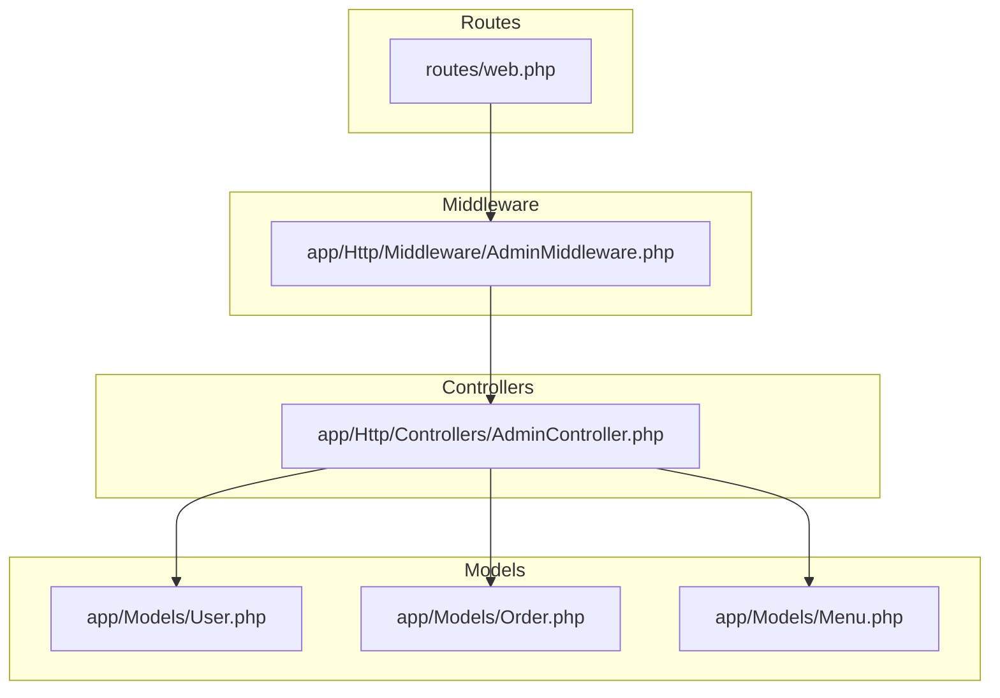
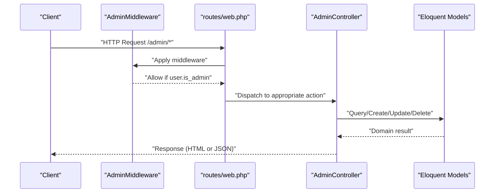
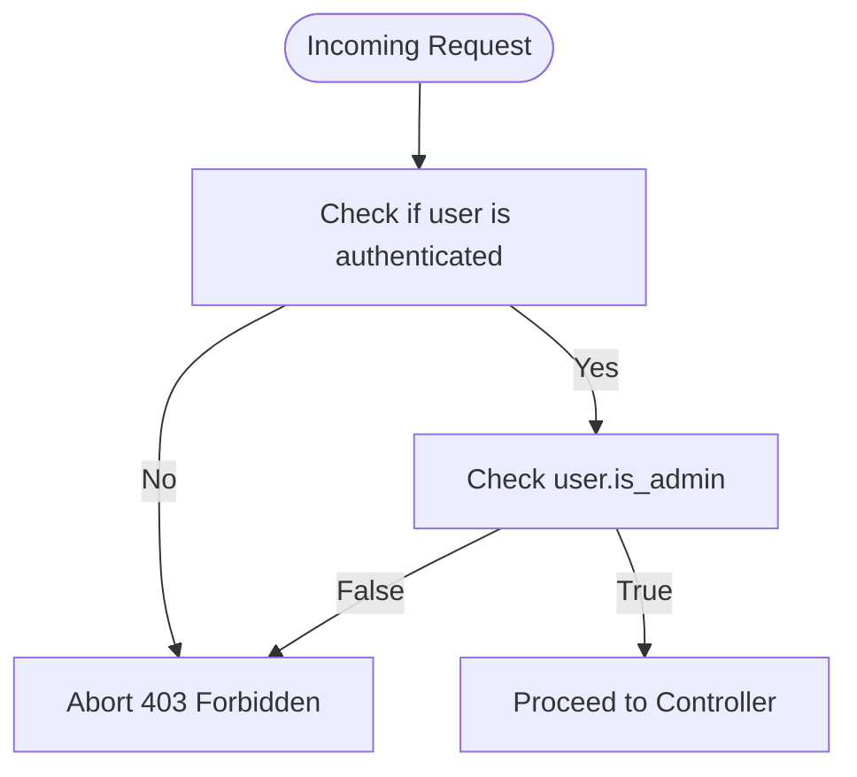
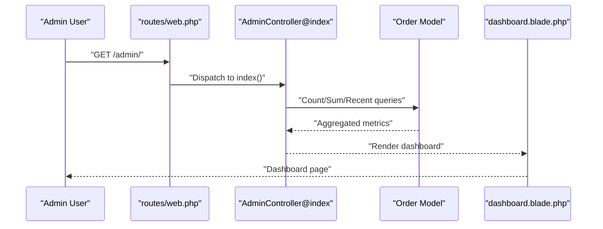
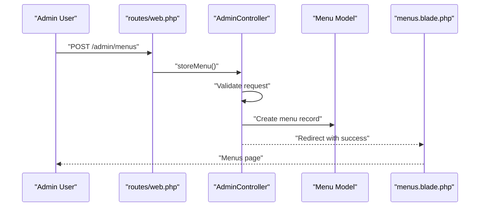
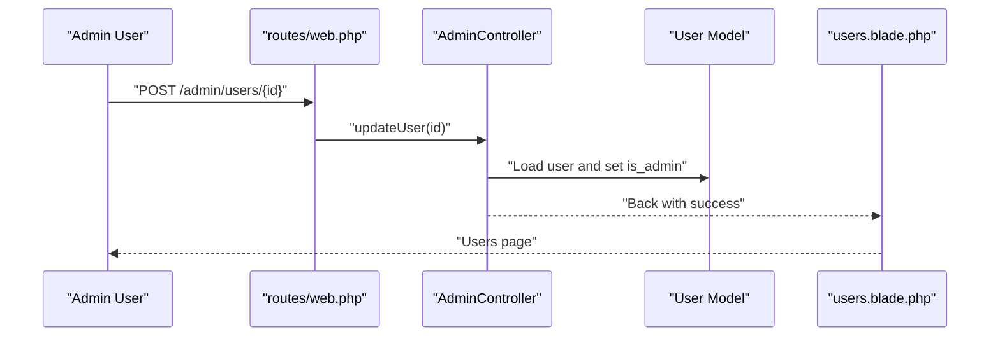
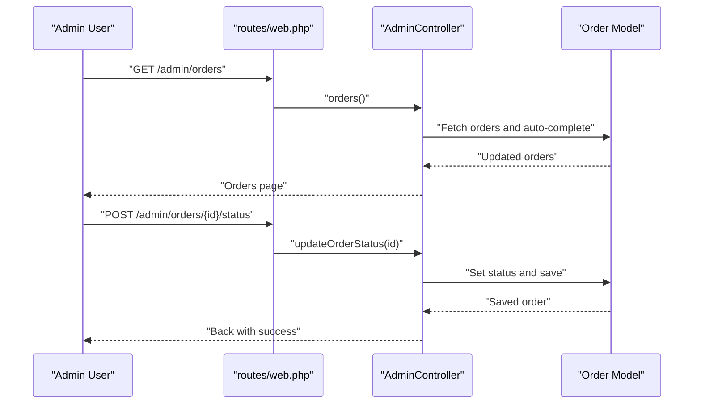
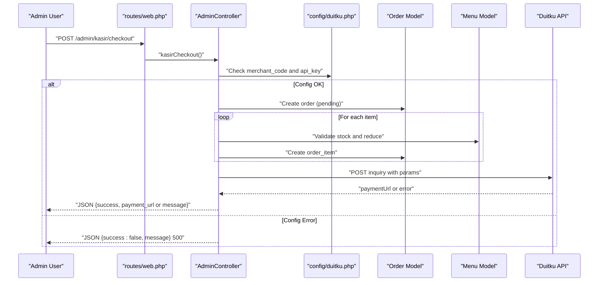
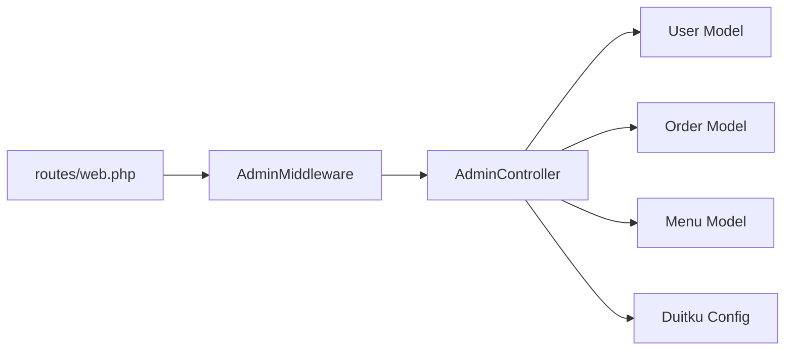

# Administrator API

<cite>
**Referenced Files in This Document**
- [web.php](file://routes/web.php)
- [AdminController.php](file://app/Http/Controllers/AdminController.php)
- [AdminMiddleware.php](file://app/Http/Middleware/AdminMiddleware.php)
- [User.php](file://app/Models/User.php)
- [Order.php](file://app/Models/Order.php)
- [Menu.php](file://app/Models/Menu.php)
- [2026_04_21_011703_create_menus_table.php](file://database/migrations/2026_04_21_011703_create_menus_table.php)
- [2026_04_21_011703_create_orders_table.php](file://database/migrations/2026_04_21_011703_create_orders_table.php)
- [0001_01_01_000000_create_users_table.php](file://database/migrations/0001_01_01_000000_create_users_table.php)
- [duitku.php](file://config/duitku.php)
- [dashboard.blade.php](file://resources/views/admin/dashboard.blade.php)
- [menus.blade.php](file://resources/views/admin/menus.blade.php)
- [users.blade.php](file://resources/views/admin/users.blade.php)
</cite>

## Table of Contents
1. [Introduction](#introduction)
2. [Project Structure](#project-structure)
3. [Core Components](#core-components)
4. [Architecture Overview](#architecture-overview)
5. [Detailed Component Analysis](#detailed-component-analysis)
6. [Dependency Analysis](#dependency-analysis)
7. [Performance Considerations](#performance-considerations)
8. [Troubleshooting Guide](#troubleshooting-guide)
9. [Conclusion](#conclusion)

## Introduction
This document describes the administrator API and administrative workflows for managing menus, users, orders, and cashier operations. It consolidates HTTP endpoints under the /admin prefix, documents request/response schemas, and explains role-based access control and payment integration via Duitku.

## Project Structure
Administrative routes are grouped under the /admin prefix and protected by an admin middleware requiring authenticated users with the is_admin flag set to true. Controllers implement dashboard summaries, CRUD for menus, user role management, order status updates, and POS checkout flows.

**Diagram sources**
- [web.php:52-70](file://routes/web.php#L52-L70)
- [AdminMiddleware.php:17-24](file://app/Http/Middleware/AdminMiddleware.php#L17-L24)
- [AdminController.php:10-13](file://app/Http/Controllers/AdminController.php#L10-L13)

**Section sources**
- [web.php:52-70](file://routes/web.php#L52-L70)
- [AdminMiddleware.php:17-24](file://app/Http/Middleware/AdminMiddleware.php#L17-L24)

## Core Components
- Admin routes: grouped under /admin with auth and admin middleware.
- Admin controller: orchestrates dashboard, menus, users, orders, and cashier checkout.
- Models: User, Order, Menu define domain and relationships.
- Payment integration: Duitku configuration and checkout flow.

Key endpoint groups:
- Dashboard: GET /admin/
- Menus: GET /admin/menus, POST /admin/menus, GET /admin/menus/{id}/edit, POST /admin/menus/{id}, DELETE /admin/menus/{id}
- Users: GET /admin/users, POST /admin/users/{id}, DELETE /admin/users/{id}
- Orders: GET /admin/orders, POST /admin/orders/{id}/status
- Cashier: GET /admin/kasir, POST /admin/kasir/checkout

**Section sources**
- [web.php:52-70](file://routes/web.php#L52-L70)
- [AdminController.php:12-13, 21-25, 46-49, 77-81, 97-113, 123-127, 129-246](file://app/Http/Controllers/AdminController.php#L12-L25, L46-L49, L77-L81, L97-L113, L123-L127, L129-L246)

## Architecture Overview
The admin area follows a layered MVC pattern:
- Routes define the HTTP surface and apply middleware.
- Middleware enforces admin-only access.
- Controller handles business logic and interacts with models.
- Models encapsulate persistence and relationships.
- Views render administrative pages; cashier checkout returns JSON.

**Diagram sources**
- [web.php:52-70](file://routes/web.php#L52-L70)
- [AdminMiddleware.php:17-24](file://app/Http/Middleware/AdminMiddleware.php#L17-L24)
- [AdminController.php:10-13, 27-44, 52-69, 71-75, 83-89, 91-95, 115-121, 129-246](file://app/Http/Controllers/AdminController.php#L10-L13, L27-L44, L52-L69, L71-L75, L83-L89, L91-L95, L115-L121, L129-L246)

## Detailed Component Analysis

### Role-Based Access Control
- Authentication: Requires a logged-in session.
- Authorization: Only users where is_admin is true can access admin routes.
- Enforcement: Middleware checks auth state and admin flag, returning 403 otherwise.

**Diagram sources**
- [AdminMiddleware.php:17-24](file://app/Http/Middleware/AdminMiddleware.php#L17-L24)

**Section sources**
- [AdminMiddleware.php:17-24](file://app/Http/Middleware/AdminMiddleware.php#L17-L24)
- [web.php:52-70](file://routes/web.php#L52-L70)

### Dashboard Operations
- Endpoint: GET /admin/
- Purpose: Summarize total orders, revenue, customer count, and recent orders.
- Data sources: Order and User models; auto-completes certain orders after elapsed time.

**Diagram sources**
- [web.php:53](file://routes/web.php#L53)
- [AdminController.php:12-19](file://app/Http/Controllers/AdminController.php#L12-L19)
- [dashboard.blade.php:6-72](file://resources/views/admin/dashboard.blade.php#L6-L72)

**Section sources**
- [web.php:53](file://routes/web.php#L53)
- [AdminController.php:12-19](file://app/Http/Controllers/AdminController.php#L12-L19)
- [dashboard.blade.php:6-72](file://resources/views/admin/dashboard.blade.php#L6-L72)

### Menu Administration
Endpoints:
- GET /admin/menus: List all menus.
- POST /admin/menus: Create a new menu (supports image upload or URL).
- GET /admin/menus/{id}/edit: Edit a menu.
- POST /admin/menus/{id}: Update a menu (supports image upload or URL).
- DELETE /admin/menus/{id}: Delete a menu.

Validation and behavior:
- Validation ensures name, price, and stock presence and types.
- Image handling supports either URL or uploaded file; stored under storage with a URL rewrite.
- Redirects with success messages after create/update/delete.

**Diagram sources**
- [web.php:55, 57](file://routes/web.php#L55, L57)
- [AdminController.php:27-44, 52-69](file://app/Http/Controllers/AdminController.php#L27-L44, L52-L69)
- [menus.blade.php:15-50](file://resources/views/admin/menus.blade.php#L15-L50)

**Section sources**
- [web.php:54-58](file://routes/web.php#L54-L58)
- [AdminController.php:27-44, 52-69](file://app/Http/Controllers/AdminController.php#L27-L44, L52-L69)
- [menus.blade.php:15-50](file://resources/views/admin/menus.blade.php#L15-L50)

### User Management
Endpoints:
- GET /admin/users: List all users.
- POST /admin/users/{id}: Toggle admin role for a user.
- DELETE /admin/users/{id}: Delete a user.

Behavior:
- Role toggle uses a checkbox flag mapped to is_admin.
- Deletion removes the user account.
- UI prevents self-deletion.

**Diagram sources**
- [web.php:60-62](file://routes/web.php#L60-L62)
- [AdminController.php:83-89](file://app/Http/Controllers/AdminController.php#L83-L89)
- [users.blade.php:34-48](file://resources/views/admin/users.blade.php#L34-L48)

**Section sources**
- [web.php:60-62](file://routes/web.php#L60-L62)
- [AdminController.php:77-95](file://app/Http/Controllers/AdminController.php#L77-L95)
- [users.blade.php:34-48](file://resources/views/admin/users.blade.php#L34-L48)

### Order Processing
Endpoints:
- GET /admin/orders: View all orders with auto-completion for "sampai" orders older than 24 hours.
- POST /admin/orders/{id}/status: Update order status.

Behavior:
- Status transitions are immediate upon request.
- Auto-completion logic runs during listing to finalize old "arrived" orders.

**Diagram sources**
- [web.php:64-65](file://routes/web.php#L64-L65)
- [AdminController.php:97-113, 115-121](file://app/Http/Controllers/AdminController.php#L97-L113, L115-L121)

**Section sources**
- [web.php:64-65](file://routes/web.php#L64-L65)
- [AdminController.php:97-121](file://app/Http/Controllers/AdminController.php#L97-L121)

### Cashier Operations
Endpoints:
- GET /admin/kasir: Load available menu items for POS.
- POST /admin/kasir/checkout: Process a cash transaction via Duitku.

Request schema (JSON):
- items: array of objects
  - id: integer, exists in menus
  - quantity: integer, min 1
- paymentMethod: string
- customerName: string

Response schema (JSON):
- success: boolean
- payment_url: string (on success)
- message: string (on failure)

Validation and flow:
- Validates items, quantities, payment method, and customer name.
- Checks Duitku configuration; returns 500 if missing keys.
- Creates an order with pending status and payment metadata.
- Verifies stock availability per item and reduces inventory.
- Builds order items and computes total price.
- Calls Duitku inquiry endpoint to obtain a payment URL.
- Returns JSON with payment URL or error message.

**Diagram sources**
- [web.php:67-68](file://routes/web.php#L67-L68)
- [AdminController.php:129-246](file://app/Http/Controllers/AdminController.php#L129-L246)
- [duitku.php:4-11](file://config/duitku.php#L4-L11)

**Section sources**
- [web.php:67-68](file://routes/web.php#L67-L68)
- [AdminController.php:129-246](file://app/Http/Controllers/AdminController.php#L129-L246)
- [duitku.php:4-11](file://config/duitku.php#L4-L11)

### Request/Response Schemas

- Menus (create/update)
  - Required fields: name, price (numeric), stock (integer ≥ 0)
  - Optional fields: description, category, image_url, image (file)
  - Validation applies to both creation and update actions.

- Users (role update)
  - Body: checkbox field is_admin (mapped to boolean)
  - No additional fields required.

- Orders (status update)
  - Path: /admin/orders/{id}/status
  - Body: status (string)

- Cashier checkout (JSON)
  - items: array of { id, quantity }
  - paymentMethod: string
  - customerName: string
  - Response: { success: boolean, payment_url?: string, message?: string }

Note: Responses are primarily HTML redirects for form submissions; cashier checkout returns JSON.

**Section sources**
- [AdminController.php:29-33, 55-59, 131-137, 146-153, 156-172, 225-245](file://app/Http/Controllers/AdminController.php#L29-L33, L55-L59, L131-L137, L146-L153, L156-L172, L225-L245)

### Workflows

- Order status update
  - Navigate to /admin/orders
  - Select desired order and choose new status
  - Submit; system persists change and returns to list

- User management
  - Navigate to /admin/users
  - Toggle admin role or delete user
  - Confirm action; system persists change

- Cash transaction
  - Navigate to /admin/kasir
  - Add items and quantities
  - Choose payment method and enter customer name
  - Submit; receive payment URL from Duitku

**Section sources**
- [web.php:64-65, 60-62, 67-68](file://routes/web.php#L64-L65, L60-L62, L67-L68)
- [AdminController.php:97-121, 83-89, 129-246](file://app/Http/Controllers/AdminController.php#L97-L121, L83-L89, L129-L246)

## Dependency Analysis
- Routes depend on AdminMiddleware and AdminController actions.
- AdminController depends on Eloquent models for persistence.
- Cashier checkout depends on Duitku configuration and external API.

**Diagram sources**
- [web.php:52-70](file://routes/web.php#L52-L70)
- [AdminMiddleware.php:17-24](file://app/Http/Middleware/AdminMiddleware.php#L17-L24)
- [AdminController.php:10-13, 129-246](file://app/Http/Controllers/AdminController.php#L10-L13, L129-L246)

**Section sources**
- [web.php:52-70](file://routes/web.php#L52-L70)
- [AdminController.php:10-13, 129-246](file://app/Http/Controllers/AdminController.php#L10-L13, L129-L246)

## Performance Considerations
- Dashboard aggregates rely on simple counts and sums; ensure indexes on frequently filtered columns if traffic grows.
- Auto-completion of orders runs on list retrieval; consider offloading to a scheduled job for heavy workloads.
- Stock updates occur per item during checkout; batch validations and early exits prevent unnecessary writes.
- Duitku API calls are synchronous; consider async callbacks and idempotent order updates to avoid race conditions.

## Troubleshooting Guide
- 403 Forbidden: Ensure the current user is authenticated and has is_admin=true.
- Duitku configuration errors: Verify DUITKU_MERCHANT_CODE and DUITKU_API_KEY are set; clear config cache after changes.
- Insufficient stock: Checkout rejects transactions when requested quantity exceeds available stock.
- Payment failures: Review Duitku response messages and callback configurations.

**Section sources**
- [AdminMiddleware.php:17-24](file://app/Http/Middleware/AdminMiddleware.php#L17-L24)
- [AdminController.php:248-255, 131-137, 158-160, 225-245](file://app/Http/Controllers/AdminController.php#L248-L255, L131-L137, L158-L160, L225-L245)
- [duitku.php:4-11](file://config/duitku.php#L4-L11)

## Conclusion
The administrator API provides a cohesive set of endpoints for managing menus, users, orders, and POS checkout. RBAC ensures only administrators can access these endpoints, while Duitku integration enables secure payment initiation. Adhering to the documented schemas and workflows will streamline administrative tasks and maintain system reliability.