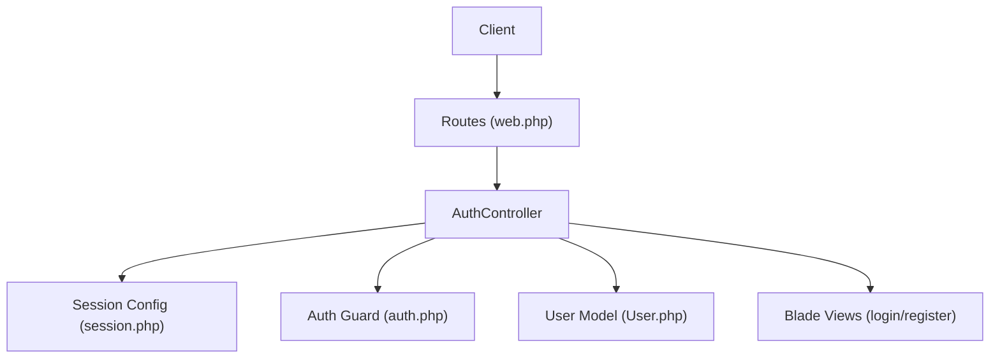
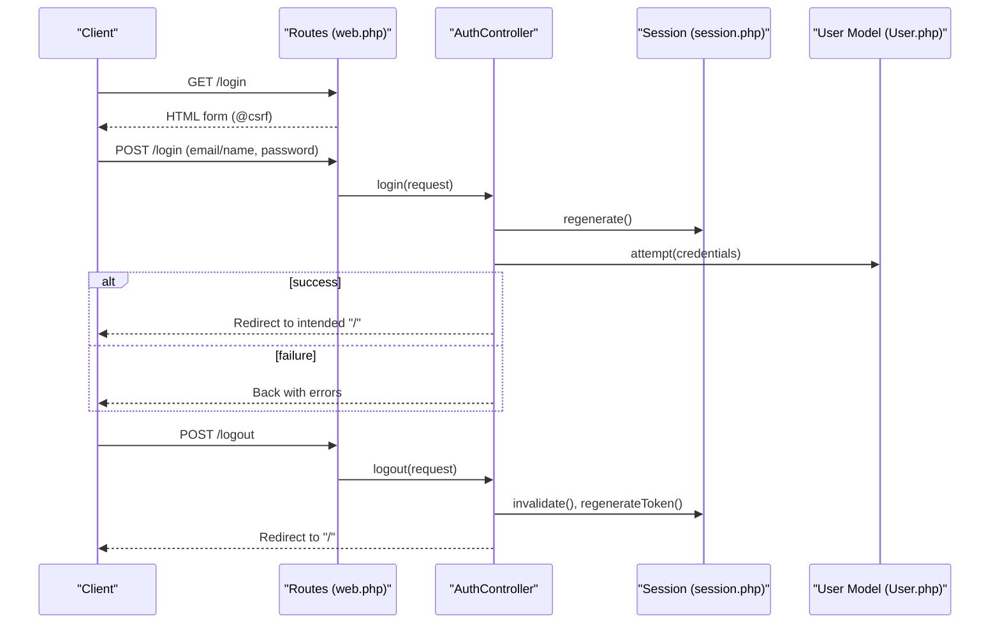
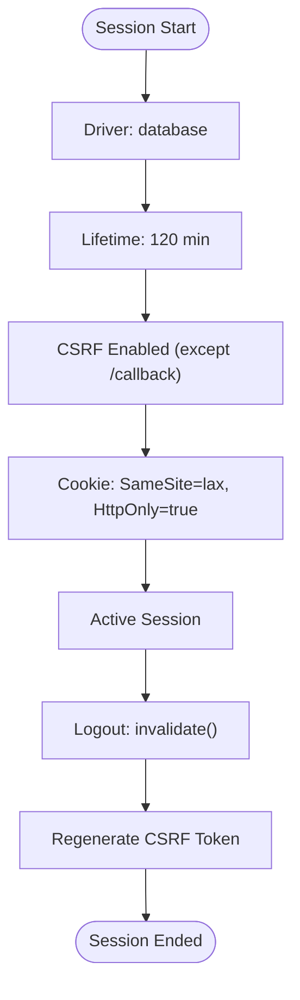
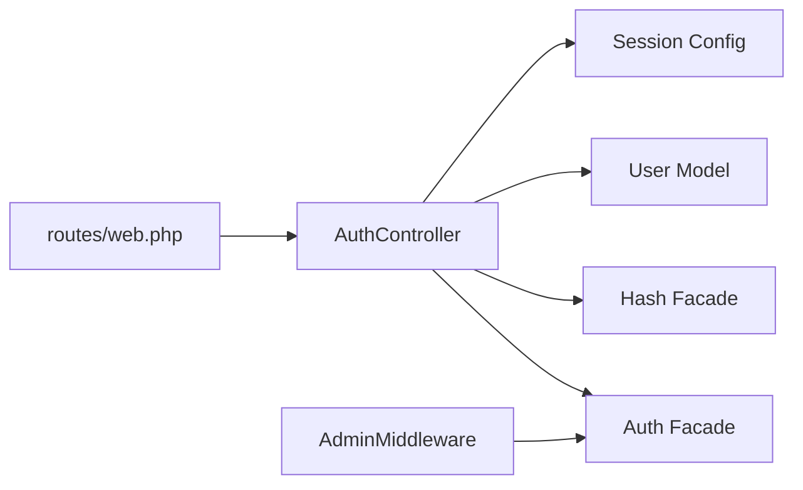

# Authentication API

<cite>
**Referenced Files in This Document**
- [AuthController.php](file://app/Http/Controllers/AuthController.php)
- [web.php](file://routes/web.php)
- [auth.php](file://config/auth.php)
- [session.php](file://config/session.php)
- [login.blade.php](file://resources/views/auth/login.blade.php)
- [register.blade.php](file://resources/views/auth/register.blade.php)
- [User.php](file://app/Models/User.php)
- [AdminMiddleware.php](file://app/Http/Middleware/AdminMiddleware.php)
- [0001_01_01_000000_create_users_table.php](file://database/migrations/0001_01_01_000000_create_users_table.php)
- [app.php](file://bootstrap/app.php)
- [validation.php (en)](file://lang/en/validation.php)
- [validation.php (id)](file://lang/id/validation.php)
</cite>

## Table of Contents
1. [Introduction](#introduction)
2. [Project Structure](#project-structure)
3. [Core Components](#core-components)
4. [Architecture Overview](#architecture-overview)
5. [Detailed Component Analysis](#detailed-component-analysis)
6. [Dependency Analysis](#dependency-analysis)
7. [Performance Considerations](#performance-considerations)
8. [Troubleshooting Guide](#troubleshooting-guide)
9. [Conclusion](#conclusion)
10. [Appendices](#appendices)

## Introduction
This document specifies the authentication API for the application, focusing on login, registration, and logout endpoints. It describes HTTP methods, URL patterns, request/response schemas, session-based authentication, CSRF protection, and error handling. Practical examples using curl are included, along with security considerations such as CSRF protection, password policies, and session timeout handling.

## Project Structure
Authentication endpoints are defined in the web routes and handled by the AuthController. Views render forms with CSRF tokens. Session and authentication guards are configured in dedicated configuration files. The User model defines the authentication schema and hidden attributes.



**Diagram sources**
- [web.php:27-31](file://routes/web.php#L27-L31)
- [AuthController.php:10-78](file://app/Http/Controllers/AuthController.php#L10-L78)
- [session.php:21-35](file://config/session.php#L21-L35)
- [auth.php:38-43](file://config/auth.php#L38-L43)
- [User.php:10-55](file://app/Models/User.php#L10-L55)
- [login.blade.php:40-41](file://resources/views/auth/login.blade.php#L40-L41)
- [register.blade.php:40-41](file://resources/views/auth/register.blade.php#L40-L41)

**Section sources**
- [web.php:27-31](file://routes/web.php#L27-L31)
- [AuthController.php:10-78](file://app/Http/Controllers/AuthController.php#L10-L78)
- [session.php:21-35](file://config/session.php#L21-L35)
- [auth.php:38-43](file://config/auth.php#L38-L43)
- [User.php:10-55](file://app/Models/User.php#L10-L55)
- [login.blade.php:40-41](file://resources/views/auth/login.blade.php#L40-L41)
- [register.blade.php:40-41](file://resources/views/auth/register.blade.php#L40-L41)

## Core Components
- Authentication endpoints
  - Login: GET /login (form), POST /login (submit)
  - Register: GET /register (form), POST /register (submit)
  - Logout: POST /logout
- Session-based authentication using the "web" guard
- CSRF protection via @csrf in forms and global CSRF validation except for /callback
- Password hashing via Hash facade and Eloquent model casting
- Admin-only access guarded by AdminMiddleware

**Section sources**
- [web.php:27-31](file://routes/web.php#L27-L31)
- [AuthController.php:17-76](file://app/Http/Controllers/AuthController.php#L17-L76)
- [auth.php:38-43](file://config/auth.php#L38-L43)
- [session.php:21-35](file://config/session.php#L21-L35)
- [login.blade.php:40-41](file://resources/views/auth/login.blade.php#L40-L41)
- [register.blade.php:40-41](file://resources/views/auth/register.blade.php#L40-L41)
- [AdminMiddleware.php:17-24](file://app/Http/Middleware/AdminMiddleware.php#L17-L24)

## Architecture Overview
The authentication flow uses Laravel’s session-based guard. On successful login, a session is regenerated and the user is redirected to intended destinations. Registration creates a hashed password and logs the user in. Logout clears the session and regenerates the CSRF token.



**Diagram sources**
- [web.php:27-31](file://routes/web.php#L27-L31)
- [AuthController.php:17-76](file://app/Http/Controllers/AuthController.php#L17-L76)
- [session.php:35](file://config/session.php#L35)
- [User.php:10-55](file://app/Models/User.php#L10-L55)

## Detailed Component Analysis

### Endpoint Specifications

#### Login
- Method: POST
- URL: /login
- Purpose: Authenticate user with email or username and password
- Request body (form fields):
  - email: string (required). Accepts either email or username depending on input
  - password: string (required)
- Response:
  - On success: 302 Redirect to intended destination ("/" or "/admin")
  - On failure: 302 Redirect back with error message under "email" key
- CSRF: Required via @csrf in the login form

Example curl:
- Submit login form:
  - curl -X POST http://localhost/login -F "email=user@example.com" -F "password=secret"

Notes:
- The controller attempts authentication using either "email" or "name" based on input validation
- Successful login redirects to intended path; admin users are redirected to "/admin"

**Section sources**
- [web.php:27-28](file://routes/web.php#L27-L28)
- [AuthController.php:17-44](file://app/Http/Controllers/AuthController.php#L17-L44)
- [login.blade.php:40-62](file://resources/views/auth/login.blade.php#L40-L62)
- [validation.php (en):139](file://lang/en/validation.php#L139)
- [validation.php (id):141](file://lang/id/validation.php#L141)

#### Register
- Method: POST
- URL: /register
- Purpose: Create a new user account
- Request body (form fields):
  - name: string (required, max length 255)
  - email: string (required, email, unique)
  - password: string (required, min length 8, confirmed)
  - password_confirmation: string (required, matches password)
- Response:
  - On success: 302 Redirect to "/"
  - On validation errors: 302 Redirect back with validation errors
- CSRF: Required via @csrf in the registration form

Example curl:
- Submit registration form:
  - curl -X POST http://localhost/register -F "name=John Doe" -F "email=john@example.com" -F "password=password123" -F "password_confirmation=password123"

Notes:
- Password is hashed before persistence
- On success, the user is logged in automatically

**Section sources**
- [web.php:29-30](file://routes/web.php#L29-L30)
- [AuthController.php:51-68](file://app/Http/Controllers/AuthController.php#L51-L68)
- [register.blade.php:40-78](file://resources/views/auth/register.blade.php#L40-L78)
- [validation.php (en):139](file://lang/en/validation.php#L139)
- [validation.php (id):141](file://lang/id/validation.php#L141)

#### Logout
- Method: POST
- URL: /logout
- Purpose: End current session and invalidate CSRF token
- Request body: none (form submission required for CSRF)
- Response: 302 Redirect to "/"

Example curl:
- Submit logout form:
  - curl -X POST http://localhost/logout --cookie-jar cookies.txt --cookie cookies.txt

Notes:
- Session is invalidated and CSRF token is regenerated
- Intended for browser sessions; not applicable to token-based APIs

**Section sources**
- [web.php:31](file://routes/web.php#L31)
- [AuthController.php:70-76](file://app/Http/Controllers/AuthController.php#L70-L76)
- [session.php:35](file://config/session.php#L35)

### Authentication Requirements
- Guard: "web" session-based guard
- Provider: Eloquent "users" provider
- Credentials: Supports login via email or username
- Admin access: Requires is_admin flag; enforced by AdminMiddleware

**Section sources**
- [auth.php:38-43](file://config/auth.php#L38-L43)
- [auth.php:62-66](file://config/auth.php#L62-L66)
- [AuthController.php:34-36](file://app/Http/Controllers/AuthController.php#L34-L36)
- [AdminMiddleware.php:17-24](file://app/Http/Middleware/AdminMiddleware.php#L17-L24)
- [User.php:20-24](file://app/Models/User.php#L20-L24)

### Session Management
- Driver: database (default)
- Lifetime: 120 minutes (configurable)
- CSRF protection: enabled globally except /callback
- Cookie attributes: SameSite "lax", HttpOnly true, optional Secure and Domain



**Diagram sources**
- [session.php:21-35](file://config/session.php#L21-L35)
- [session.php:203](file://config/session.php#L203)
- [session.php:186](file://config/session.php#L186)
- [session.php:173](file://config/session.php#L173)
- [app.php:17-19](file://bootstrap/app.php#L17-L19)

**Section sources**
- [session.php:21-35](file://config/session.php#L21-L35)
- [session.php:203](file://config/session.php#L203)
- [session.php:186](file://config/session.php#L186)
- [session.php:173](file://config/session.php#L173)
- [app.php:17-19](file://bootstrap/app.php#L17-L19)

### Token-Based Authentication
- Not implemented. Authentication relies on session cookies and CSRF tokens.
- No JWT or API token endpoints are present in the routes.

**Section sources**
- [web.php:27-31](file://routes/web.php#L27-L31)

### Error Responses
Common error scenarios:
- Invalid credentials during login: Redirect back with error under "email"
- Validation errors during registration: Redirect back with validation messages
- CSRF failures: Handled by CSRF middleware (enabled globally except /callback)
- Admin access denied: 403 response from AdminMiddleware

**Section sources**
- [AuthController.php:41-43](file://app/Http/Controllers/AuthController.php#L41-L43)
- [validation.php (en):139](file://lang/en/validation.php#L139)
- [validation.php (id):141](file://lang/id/validation.php#L141)
- [AdminMiddleware.php:19-21](file://app/Http/Middleware/AdminMiddleware.php#L19-L21)
- [app.php:17-19](file://bootstrap/app.php#L17-L19)

## Dependency Analysis
- Routes depend on AuthController actions
- AuthController depends on Auth facade, Hash facade, and User model
- Session and CSRF behavior configured centrally
- AdminMiddleware depends on Auth facade and user.is_admin



**Diagram sources**
- [web.php:27-31](file://routes/web.php#L27-L31)
- [AuthController.php:5-8](file://app/Http/Controllers/AuthController.php#L5-L8)
- [session.php:21-35](file://config/session.php#L21-L35)
- [AdminMiddleware.php:8](file://app/Http/Middleware/AdminMiddleware.php#L8)

**Section sources**
- [web.php:27-31](file://routes/web.php#L27-L31)
- [AuthController.php:5-8](file://app/Http/Controllers/AuthController.php#L5-L8)
- [session.php:21-35](file://config/session.php#L21-L35)
- [AdminMiddleware.php:8](file://app/Http/Middleware/AdminMiddleware.php#L8)

## Performance Considerations
- Session driver selection impacts scalability; database driver is durable but may require indexing
- Session lifetime affects resource usage; adjust SESSION_LIFETIME accordingly
- CSRF validation overhead is minimal and enabled globally except for /callback

[No sources needed since this section provides general guidance]

## Troubleshooting Guide
- Login fails with invalid credentials:
  - Verify email or username and password
  - Check validation messages under "email"
- Registration fails with validation errors:
  - Ensure name, email, password, and confirmation meet requirements
  - Confirm unique email constraint
- CSRF token errors:
  - Ensure @csrf is present in forms
  - CSRF is disabled only for /callback per configuration
- Admin access denied:
  - Confirm user.is_admin is true
  - Check AdminMiddleware logic

**Section sources**
- [AuthController.php:41-43](file://app/Http/Controllers/AuthController.php#L41-L43)
- [validation.php (en):139](file://lang/en/validation.php#L139)
- [validation.php (id):141](file://lang/id/validation.php#L141)
- [app.php:17-19](file://bootstrap/app.php#L17-L19)
- [AdminMiddleware.php:19-21](file://app/Http/Middleware/AdminMiddleware.php#L19-L21)

## Conclusion
The application implements a straightforward session-based authentication system with clear endpoints for login, registration, and logout. CSRF protection is enforced globally except for the payment callback endpoint. Passwords are validated and hashed, and admin access is controlled via middleware. There is no token-based authentication implemented.

[No sources needed since this section summarizes without analyzing specific files]

## Appendices

### Security Considerations
- CSRF Protection
  - Forms include @csrf; CSRF validation is enabled globally except for /callback
- Password Policies
  - Minimum length 8 characters
  - Confirmation required
  - Passwords are hashed on creation and stored securely
- Session Timeout Handling
  - Session lifetime configurable (default 120 minutes)
  - Logout invalidates session and regenerates CSRF token

**Section sources**
- [login.blade.php:40-41](file://resources/views/auth/login.blade.php#L40-L41)
- [register.blade.php:40-41](file://resources/views/auth/register.blade.php#L40-L41)
- [app.php:17-19](file://bootstrap/app.php#L17-L19)
- [AuthController.php:56](file://app/Http/Controllers/AuthController.php#L56)
- [session.php:35](file://config/session.php#L35)

### Data Model Overview
```mermaid
erDiagram
USERS {
bigint id PK
string name
string email UK
string phone
timestamp email_verified_at
string password
boolean is_admin
int points
string remember_token
timestamps created_at, updated_at
}
SESSIONS {
string id PK
bigint user_id FK
string ip_address
text user_agent
longtext payload
int last_activity
}
PASSWORD_RESET_TOKENS {
string email PK
string token
timestamp created_at
}
```

**Diagram sources**
- [0001_01_01_000000_create_users_table.php:14-40](file://database/migrations/0001_01_01_000000_create_users_table.php#L14-L40)