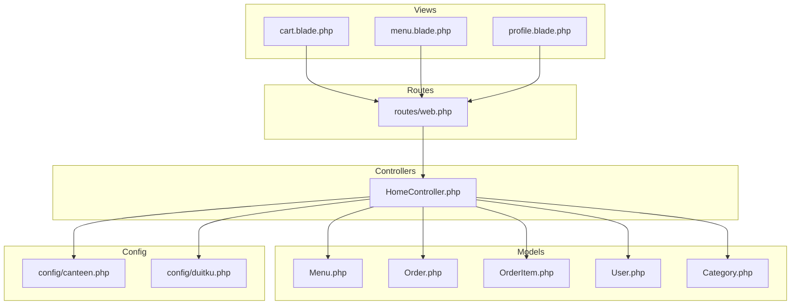
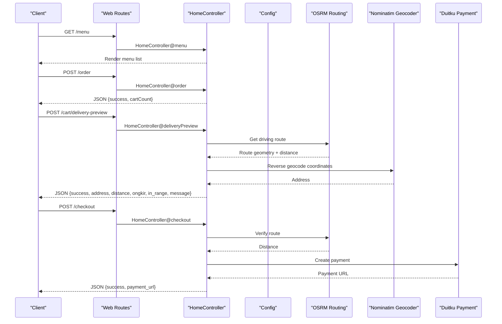
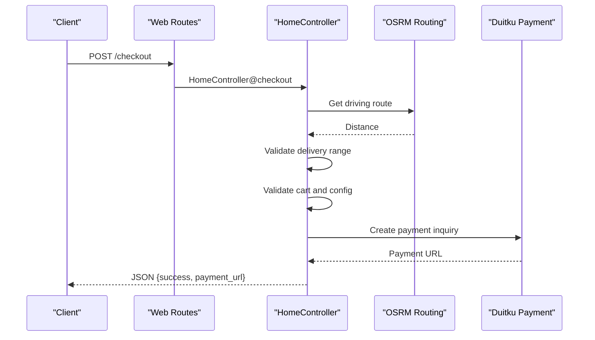
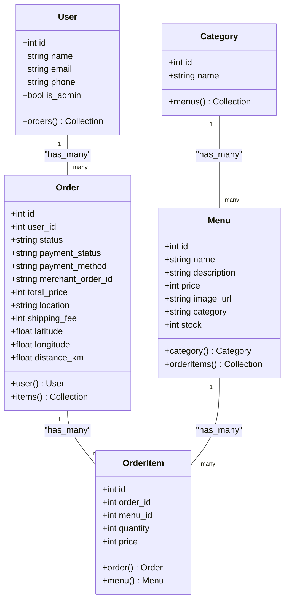
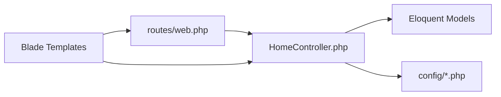

# Customer API

<cite>
**Referenced Files in This Document**
- [web.php](file://routes/web.php)
- [HomeController.php](file://app/Http/Controllers/HomeController.php)
- [Menu.php](file://app/Models/Menu.php)
- [Order.php](file://app/Models/Order.php)
- [OrderItem.php](file://app/Models/OrderItem.php)
- [User.php](file://app/Models/User.php)
- [Category.php](file://app/Models/Category.php)
- [cart.blade.php](file://resources/views/cart.blade.php)
- [menu.blade.php](file://resources/views/menu.blade.php)
- [profile.blade.php](file://resources/views/profile.blade.php)
- [canteen.php](file://config/canteen.php)
- [duitku.php](file://config/duitku.php)
</cite>

## Table of Contents
1. [Introduction](#introduction)
2. [Project Structure](#project-structure)
3. [Core Components](#core-components)
4. [Architecture Overview](#architecture-overview)
5. [Detailed Component Analysis](#detailed-component-analysis)
6. [Dependency Analysis](#dependency-analysis)
7. [Performance Considerations](#performance-considerations)
8. [Troubleshooting Guide](#troubleshooting-guide)
9. [Conclusion](#conclusion)
10. [Appendices](#appendices)

## Introduction
This document provides API documentation for customer-facing endpoints in the canteen ordering system. It covers menu browsing, cart management, checkout, and profile management. The backend is implemented in Laravel and exposes REST-like endpoints via web routes. The frontend uses Blade templates and JavaScript to integrate with these endpoints for a seamless customer experience.

## Project Structure
The customer API surface is primarily defined in the web routes and implemented by the HomeController. Supporting models define the data structures for menus, orders, order items, categories, and users. Configuration files provide runtime settings for delivery limits and payment gateway integration.

**Diagram sources**
- [web.php:1-71](file://routes/web.php#L1-L71)
- [HomeController.php:12-568](file://app/Http/Controllers/HomeController.php#L12-L568)
- [Menu.php:8-31](file://app/Models/Menu.php#L8-L31)
- [Order.php:8-35](file://app/Models/Order.php#L8-L35)
- [OrderItem.php:8-28](file://app/Models/OrderItem.php#L8-L28)
- [User.php:10-54](file://app/Models/User.php#L10-L54)
- [Category.php:7-14](file://app/Models/Category.php#L7-L14)
- [cart.blade.php:1-452](file://resources/views/cart.blade.php#L1-L452)
- [menu.blade.php:1-105](file://resources/views/menu.blade.php#L1-L105)
- [profile.blade.php:1-161](file://resources/views/profile.blade.php#L1-L161)
- [canteen.php:3-8](file://config/canteen.php#L3-L8)
- [duitku.php:3-11](file://config/duitku.php#L3-L11)

**Section sources**
- [web.php:1-71](file://routes/web.php#L1-L71)
- [HomeController.php:12-568](file://app/Http/Controllers/HomeController.php#L12-L568)

## Core Components
- Menu browsing: Retrieve all menus and individual menu details.
- Cart management: Add items, adjust quantities, remove items, preview delivery cost, and initiate checkout.
- Checkout: Calculate shipping fee, validate delivery range, and process payment via Duitku.
- Profile management: View and update user profile information.

Key endpoints:
- GET /menu
- GET /menu/{menu}
- POST /order (add to cart)
- POST /cart/delivery-preview (delivery cost preview)
- POST /cart/update/{id} (increase/decrease quantity)
- DELETE /cart/remove/{id} (remove item)
- POST /checkout (place order and start payment)
- GET /profile
- POST /profile (update profile)

**Section sources**
- [web.php:9-48](file://routes/web.php#L9-L48)
- [HomeController.php:20-30](file://app/Http/Controllers/HomeController.php#L20-L30)
- [HomeController.php:57-114](file://app/Http/Controllers/HomeController.php#L57-L114)
- [HomeController.php:127-190](file://app/Http/Controllers/HomeController.php#L127-L190)
- [HomeController.php:192-263](file://app/Http/Controllers/HomeController.php#L192-L263)
- [HomeController.php:275-408](file://app/Http/Controllers/HomeController.php#L275-L408)
- [HomeController.php:31-55](file://app/Http/Controllers/HomeController.php#L31-L55)

## Architecture Overview
The customer API follows a MVC pattern:
- Routes define endpoint URLs and HTTP methods.
- Controllers implement business logic and orchestrate model interactions.
- Models encapsulate data and relationships.
- Views render HTML and drive client-side interactions.

**Diagram sources**
- [web.php:9-48](file://routes/web.php#L9-L48)
- [HomeController.php:20-30](file://app/Http/Controllers/HomeController.php#L20-L30)
- [HomeController.php:57-114](file://app/Http/Controllers/HomeController.php#L57-L114)
- [HomeController.php:127-190](file://app/Http/Controllers/HomeController.php#L127-L190)
- [HomeController.php:275-408](file://app/Http/Controllers/HomeController.php#L275-L408)
- [canteen.php:3-8](file://config/canteen.php#L3-L8)
- [duitku.php:3-11](file://config/duitku.php#L3-L11)

## Detailed Component Analysis

### Menu Endpoints
- GET /menu
  - Purpose: List all available menus.
  - Response: HTML page rendering menu cards.
  - Notes: Stock levels are visible to authenticated users.

- GET /menu/{menu}
  - Purpose: Show detailed view of a single menu item.
  - Response: HTML page with menu details.

**Section sources**
- [web.php:10-11](file://routes/web.php#L10-L11)
- [HomeController.php:20-29](file://app/Http/Controllers/HomeController.php#L20-L29)

### Cart Management Endpoints
- POST /order
  - Purpose: Add a menu item to the customer's pending order (cart).
  - Request JSON:
    - menu_id: integer (required, must exist in menus)
    - quantity: integer (required, min 1)
  - Response JSON:
    - success: boolean
    - cartCount: integer (total items in cart)
  - Validation:
    - Out-of-stock scenario: Returns error with guidance on remaining capacity.
  - Behavior:
    - Creates or reuses a pending order for the authenticated user.
    - Updates existing order item quantity or creates a new order item.
    - Recalculates total price.

- POST /cart/update/{id}
  - Purpose: Increase or decrease quantity of an item in the cart.
  - Request JSON:
    - action: string (required, "increase" or "decrease")
  - Response JSON:
    - success: boolean
    - cartCount: integer
    - totalPrice: formatted string
    - itemQuantity: integer
    - itemId: integer
  - Validation:
    - Cannot exceed stock.
    - Minimum quantity is 1 (decrease action removes item when reducing below 1).

- DELETE /cart/remove/{id}
  - Purpose: Remove an item from the cart.
  - Response JSON:
    - success: boolean
    - cartCount: integer
    - totalPrice: formatted string
  - Behavior:
    - Removes item and recalculates order total.

- POST /cart/delivery-preview
  - Purpose: Preview delivery cost and distance for given coordinates.
  - Request JSON:
    - lat: number (required, numeric, valid latitude)
    - lng: number (required, numeric, valid longitude)
  - Response JSON:
    - success: boolean
    - address: string (reverse geocoded address)
    - distance: number (km)
    - ongkir: integer (calculated shipping fee)
    - in_range: boolean (within max delivery km)
    - route_geometry: object (optional, GeoJSON)
    - message: string (status message)
    - geocode_error: string (optional, error details)
  - Validation:
    - Coordinates must be valid.
  - Calculation:
    - Uses OSRM routing service for driving distance.
    - Uses Nominatim reverse geocoding for address.
    - Compares against configured max delivery distance.

**Section sources**
- [web.php:37-42](file://routes/web.php#L37-L42)
- [HomeController.php:57-114](file://app/Http/Controllers/HomeController.php#L57-L114)
- [HomeController.php:127-190](file://app/Http/Controllers/HomeController.php#L127-L190)
- [HomeController.php:192-263](file://app/Http/Controllers/HomeController.php#L192-L263)
- [canteen.php:3-8](file://config/canteen.php#L3-L8)

### Checkout Endpoint
- POST /checkout
  - Purpose: Finalize the order, calculate shipping, and initiate payment.
  - Request JSON:
    - location: string (required, delivery address)
    - ongkir: integer (required, shipping fee)
    - distance: number (optional, km)
    - lat: number (required, delivery latitude)
    - lng: number (required, delivery longitude)
    - paymentMethod: string (optional, defaults to SP)
  - Response JSON:
    - success: boolean
    - payment_url: string (when successful)
    - message: string (when unsuccessful)
  - Validation and behavior:
    - Verifies route availability and distance against max delivery limit.
    - Ensures cart is not empty.
    - Validates Duitku configuration.
    - Calculates shipping fee based on distance.
    - Sets order metadata (location, shipping fee, coordinates, totals).
    - Creates Duitku payment inquiry and returns payment URL.
  - Payment callback:
    - POST /callback handles Duitku webhook to update order status and reduce stock.

**Diagram sources**
- [web.php:42-50](file://routes/web.php#L42-L50)
- [HomeController.php:275-408](file://app/Http/Controllers/HomeController.php#L275-L408)
- [canteen.php:3-8](file://config/canteen.php#L3-L8)
- [duitku.php:3-11](file://config/duitku.php#L3-L11)

**Section sources**
- [web.php:42](file://routes/web.php#L42)
- [HomeController.php:275-408](file://app/Http/Controllers/HomeController.php#L275-L408)

### Profile Management Endpoints
- GET /profile
  - Purpose: View profile page with account info and order history.
  - Response: HTML page.

- POST /profile
  - Purpose: Update profile information.
  - Request Form Fields:
    - name: string (required)
    - phone: string (optional)
    - password: string (optional, requires confirmation)
    - password_confirmation: string (if password provided)
  - Response: Redirects back with success message.

**Section sources**
- [web.php:33-35](file://routes/web.php#L33-L35)
- [HomeController.php:31-55](file://app/Http/Controllers/HomeController.php#L31-L55)

### Data Models

**Diagram sources**
- [User.php:10-54](file://app/Models/User.php#L10-L54)
- [Menu.php:8-31](file://app/Models/Menu.php#L8-L31)
- [Category.php:7-14](file://app/Models/Category.php#L7-L14)
- [Order.php:8-35](file://app/Models/Order.php#L8-L35)
- [OrderItem.php:8-28](file://app/Models/OrderItem.php#L8-L28)

## Dependency Analysis
- Routes depend on HomeController actions.
- HomeController depends on Eloquent models for persistence and configuration for runtime settings.
- Frontend views (Blade) call endpoints via AJAX and form submissions.

**Diagram sources**
- [web.php:1-71](file://routes/web.php#L1-L71)
- [HomeController.php:12-568](file://app/Http/Controllers/HomeController.php#L12-L568)
- [canteen.php:3-8](file://config/canteen.php#L3-L8)
- [duitku.php:3-11](file://config/duitku.php#L3-L11)

**Section sources**
- [web.php:1-71](file://routes/web.php#L1-L71)
- [HomeController.php:12-568](file://app/Http/Controllers/HomeController.php#L12-L568)

## Performance Considerations
- Cart recalculation: Total price is recalculated per item change; keep cart sizes reasonable.
- Delivery preview: Reverse geocoding and routing calls are asynchronous; avoid excessive polling.
- Payment initiation: Duitku endpoint calls may have latency; present loading states to users.
- Distance calculation: Haversine formula is used for internal calculations; OSRM provides accurate driving distances.

[No sources needed since this section provides general guidance]

## Troubleshooting Guide
Common errors and resolutions:
- Out-of-stock items:
  - Symptom: Adding items exceeds available stock.
  - Resolution: Server responds with a message indicating remaining capacity or maximum allowed. Reduce quantity or choose another item.
  - Reference: [HomeController.php:82-92](file://app/Http/Controllers/HomeController.php#L82-L92)

- Invalid quantities:
  - Symptom: Quantity less than 1 or invalid type.
  - Resolution: Server validates minimum quantity. Adjust quantity accordingly.
  - Reference: [HomeController.php:59-62](file://app/Http/Controllers/HomeController.php#L59-L62)

- Delivery restrictions:
  - Symptom: Location outside configured max delivery distance.
  - Resolution: Server rejects checkout if distance exceeds limit. Move closer to the canteen or choose pickup.
  - Reference: [HomeController.php:295-301](file://app/Http/Controllers/HomeController.php#L295-L301), [canteen.php:7](file://config/canteen.php#L7)

- Payment configuration issues:
  - Symptom: Internal server error when initiating payment.
  - Resolution: Ensure Duitku merchant code and API key are configured. Clear config cache after changes.
  - Reference: [HomeController.php:316-321](file://app/Http/Controllers/HomeController.php#L316-L321), [duitku.php:3-11](file://config/duitku.php#L3-L11)

- Route calculation failures:
  - Symptom: Unable to compute driving distance.
  - Resolution: Move the delivery pin closer to a road. Retry after adjusting position.
  - Reference: [HomeController.php:285-291](file://app/Http/Controllers/HomeController.php#L285-L291)

**Section sources**
- [HomeController.php:59-62](file://app/Http/Controllers/HomeController.php#L59-L62)
- [HomeController.php:82-92](file://app/Http/Controllers/HomeController.php#L82-L92)
- [HomeController.php:295-301](file://app/Http/Controllers/HomeController.php#L295-L301)
- [HomeController.php:316-321](file://app/Http/Controllers/HomeController.php#L316-L321)
- [HomeController.php:285-291](file://app/Http/Controllers/HomeController.php#L285-L291)
- [canteen.php:7](file://config/canteen.php#L7)
- [duitku.php:3-11](file://config/duitku.php#L3-L11)

## Conclusion
The customer API provides a cohesive set of endpoints for browsing menus, managing carts, previewing delivery costs, and completing payments through Duitku. The implementation emphasizes user feedback with clear error messages and integrates external services for geocoding and routing. Following the documented request/response schemas and validation rules ensures reliable operation across workflows.

[No sources needed since this section summarizes without analyzing specific files]

## Appendices

### Complete Customer Workflows

#### Workflow 1: Browse Menus and Add Items to Cart
- Steps:
  1. GET /menu to view available items.
  2. POST /order with menu_id and quantity.
  3. Observe success response with updated cartCount.
- References:
  - [web.php:10](file://routes/web.php#L10)
  - [HomeController.php:57-114](file://app/Http/Controllers/HomeController.php#L57-L114)

#### Workflow 2: Calculate Delivery Costs and Place Order
- Steps:
  1. POST /cart/delivery-preview with lat/lng to estimate ongkir and distance.
  2. POST /checkout with location, ongkir, distance, lat, lng, and paymentMethod.
  3. Receive payment_url to complete transaction.
- References:
  - [web.php:39](file://routes/web.php#L39)
  - [HomeController.php:127-190](file://app/Http/Controllers/HomeController.php#L127-L190)
  - [web.php:42](file://routes/web.php#L42)
  - [HomeController.php:275-408](file://app/Http/Controllers/HomeController.php#L275-L408)

#### Workflow 3: Manage Cart Items
- Steps:
  1. POST /cart/update/{id} with action "increase" or "decrease".
  2. DELETE /cart/remove/{id} to remove an item.
  3. Observe updated cartCount and totalPrice.
- References:
  - [web.php:40-41](file://routes/web.php#L40-L41)
  - [HomeController.php:192-263](file://app/Http/Controllers/HomeController.php#L192-L263)

### Request/Response Schemas

- Add to Cart (POST /order)
  - Request JSON:
    - menu_id: integer
    - quantity: integer
  - Response JSON:
    - success: boolean
    - cartCount: integer

- Delivery Preview (POST /cart/delivery-preview)
  - Request JSON:
    - lat: number
    - lng: number
  - Response JSON:
    - success: boolean
    - address: string
    - distance: number
    - ongkir: integer
    - in_range: boolean
    - route_geometry: object
    - message: string
    - geocode_error: string

- Update Cart Item (POST /cart/update/{id})
  - Request JSON:
    - action: string ("increase" | "decrease")
  - Response JSON:
    - success: boolean
    - cartCount: integer
    - totalPrice: string
    - itemQuantity: integer
    - itemId: integer

- Remove Cart Item (DELETE /cart/remove/{id})
  - Response JSON:
    - success: boolean
    - cartCount: integer
    - totalPrice: string

- Checkout (POST /checkout)
  - Request JSON:
    - location: string
    - ongkir: integer
    - distance: number
    - lat: number
    - lng: number
    - paymentMethod: string
  - Response JSON:
    - success: boolean
    - payment_url: string
    - message: string

- Profile Update (POST /profile)
  - Form Fields:
    - name: string
    - phone: string
    - password: string
    - password_confirmation: string

**Section sources**
- [HomeController.php:57-114](file://app/Http/Controllers/HomeController.php#L57-L114)
- [HomeController.php:127-190](file://app/Http/Controllers/HomeController.php#L127-L190)
- [HomeController.php:192-263](file://app/Http/Controllers/HomeController.php#L192-L263)
- [HomeController.php:275-408](file://app/Http/Controllers/HomeController.php#L275-L408)
- [HomeController.php:38-55](file://app/Http/Controllers/HomeController.php#L38-L55)