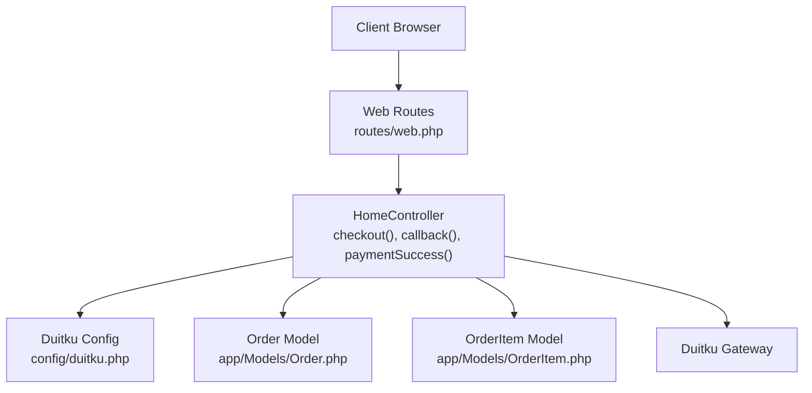
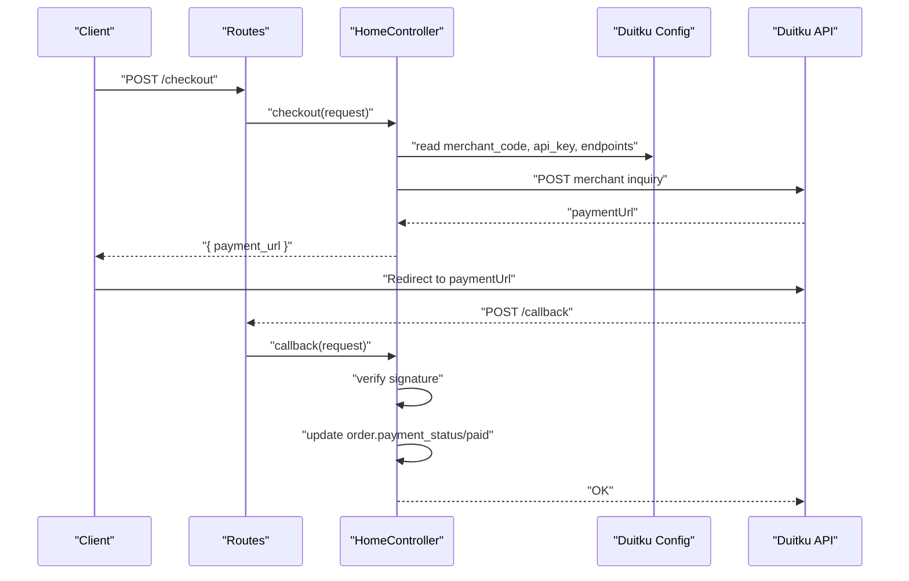
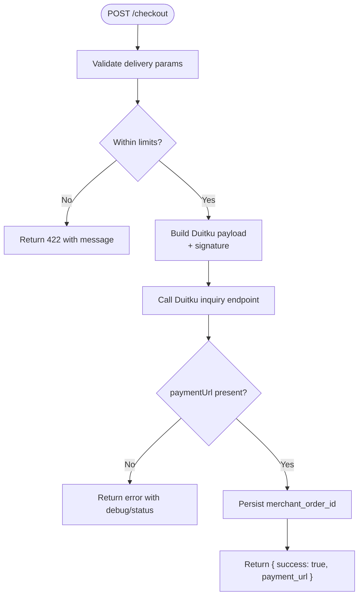
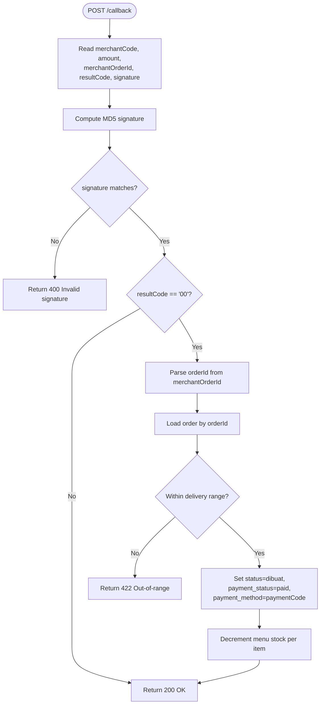
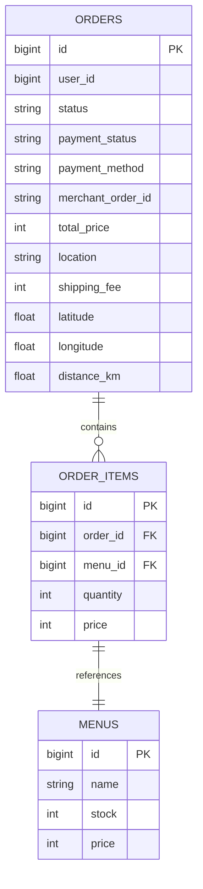
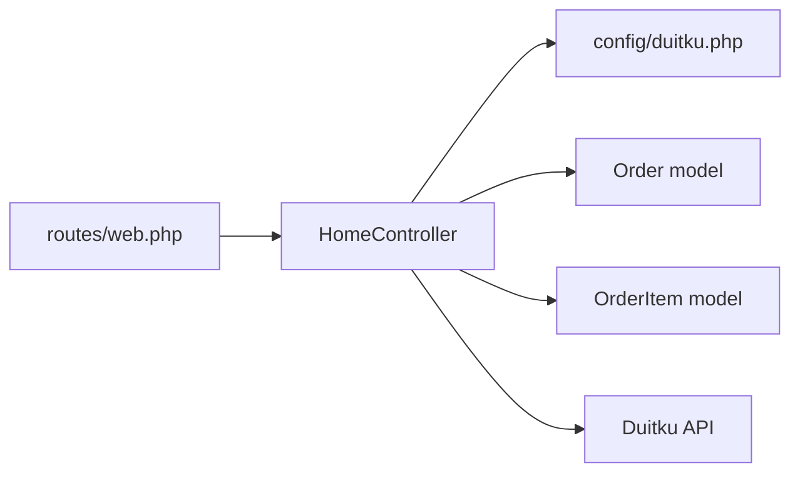

# Payment API

<cite>
**Referenced Files in This Document**
- [web.php](file://routes/web.php)
- [HomeController.php](file://app/Http/Controllers/HomeController.php)
- [duitku.php](file://config/duitku.php)
- [Order.php](file://app/Models/Order.php)
- [OrderItem.php](file://app/Models/OrderItem.php)
- [2026_05_15_072246_create_payments_table.php](file://database/migrations/2026_05_15_072246_create_payments_table.php)
- [2026_05_24_000000_add_payment_fields_to_orders_table.php](file://database/migrations/2026_05_24_000000_add_payment_fields_to_orders_table.php)
- [cart.blade.php](file://resources/views/cart.blade.php)
</cite>

## Table of Contents
1. [Introduction](#introduction)
2. [Project Structure](#project-structure)
3. [Core Components](#core-components)
4. [Architecture Overview](#architecture-overview)
5. [Detailed Component Analysis](#detailed-component-analysis)
6. [Dependency Analysis](#dependency-analysis)
7. [Performance Considerations](#performance-considerations)
8. [Troubleshooting Guide](#troubleshooting-guide)
9. [Conclusion](#conclusion)
10. [Appendices](#appendices)

## Introduction
This document describes the payment processing API integrated with the Duitku payment gateway. It covers payment initiation, callback handling, and success confirmation endpoints, along with request/response schemas, security measures, and typical payment workflows such as redirects, callback verification, partial fulfillment, failed transactions, and refund processing.

## Project Structure
The payment flow is implemented in the web routes and the HomeController. Duitku configuration is centralized in the duitku config file. The Order and OrderItem models define the persisted state of orders and their items. A dedicated payments table migration exists for historical reference, while the current payment state is tracked on the orders table.

**Diagram sources**
- [web.php:42-50](file://routes/web.php#L42-L50)
- [HomeController.php:275-408](file://app/Http/Controllers/HomeController.php#L275-L408)
- [duitku.php:3-11](file://config/duitku.php#L3-L11)
- [Order.php:8-35](file://app/Models/Order.php#L8-L35)
- [OrderItem.php:8-28](file://app/Models/OrderItem.php#L8-L28)

**Section sources**
- [web.php:42-50](file://routes/web.php#L42-L50)
- [HomeController.php:275-408](file://app/Http/Controllers/HomeController.php#L275-L408)
- [duitku.php:3-11](file://config/duitku.php#L3-L11)
- [Order.php:8-35](file://app/Models/Order.php#L8-L35)
- [OrderItem.php:8-28](file://app/Models/OrderItem.php#L8-L28)

## Core Components
- Payment Initiation Endpoint
  - Method: POST
  - Path: /checkout
  - Purpose: Create a Duitku payment request and return a payment URL for redirection
- Callback Endpoint
  - Method: POST
  - Path: /callback
  - Purpose: Receive Duitku notifications, verify signatures, and update order/payment state
- Success Confirmation Endpoint
  - Method: POST
  - Path: /payment/success
  - Purpose: Redirect confirmation after successful payment completion
- Duitku Configuration
  - Merchant code, API key, environment, endpoints, callback and return URLs
- Order and OrderItem Models
  - Persist order state, payment metadata, and ordered items

**Section sources**
- [web.php:42-50](file://routes/web.php#L42-L50)
- [HomeController.php:275-408](file://app/Http/Controllers/HomeController.php#L275-L408)
- [Order.php:12-24](file://app/Models/Order.php#L12-L24)
- [OrderItem.php:12-17](file://app/Models/OrderItem.php#L12-L17)
- [duitku.php:3-11](file://config/duitku.php#L3-L11)

## Architecture Overview
The payment lifecycle integrates client actions with server-side processing and Duitku’s external API.

**Diagram sources**
- [web.php:42-50](file://routes/web.php#L42-L50)
- [HomeController.php:275-408](file://app/Http/Controllers/HomeController.php#L275-L408)
- [HomeController.php:410-452](file://app/Http/Controllers/HomeController.php#L410-L452)
- [duitku.php:3-11](file://config/duitku.php#L3-L11)

## Detailed Component Analysis

### Payment Initiation: POST /checkout
- Request
  - Content-Type: application/x-www-form-urlencoded or JSON
  - Body fields:
    - location: string, required
    - ongkir: integer, required
    - distance: numeric, optional
    - lat: numeric, required
    - lng: numeric, required
    - paymentMethod: string, optional (SP for QRIS, M1 for Virtual Account)
- Response (JSON)
  - success: boolean
  - payment_url: string (when success=true)
  - message: string (when success=false)
  - debug_data: object (when applicable)
  - status_code: integer (when applicable)
- Behavior
  - Validates delivery route and distance against configured limits
  - Builds Duitku payload with merchant code, amount, merchant order ID, product details, customer info, callback and return URLs, expiry period, and signature
  - Calls Duitku endpoint based on environment (sandbox/production)
  - Persists merchant order ID on the order record
  - Returns payment URL for client redirection

**Diagram sources**
- [HomeController.php:275-408](file://app/Http/Controllers/HomeController.php#L275-L408)
- [HomeController.php:552-557](file://app/Http/Controllers/HomeController.php#L552-L557)
- [duitku.php:3-11](file://config/duitku.php#L3-L11)

**Section sources**
- [web.php:42](file://routes/web.php#L42)
- [HomeController.php:275-408](file://app/Http/Controllers/HomeController.php#L275-L408)
- [cart.blade.php:408-427](file://resources/views/cart.blade.php#L408-L427)

### Callback Handling: POST /callback
- Request (from Duitku)
  - Form-encoded body fields:
    - merchantCode: string
    - amount: string/number
    - merchantOrderId: string
    - productDetail: string
    - additionalParam: string
    - paymentCode: string
    - resultCode: string
    - signature: string
- Signature Verification
  - Computed signature: MD5(merchantCode + amount + merchantOrderId + apiKey)
  - Accepted if equals incoming signature
- Behavior
  - On valid signature and resultCode=00:
    - Parse orderId from merchantOrderId prefix
    - Verify order still pending and within delivery range
    - Set order status to “dibuat”, payment_status to “paid”
    - Store paymentCode as payment_method if provided
    - Decrement stock for each ordered menu item
  - Always responds OK for valid signature; otherwise returns invalid signature error

**Diagram sources**
- [HomeController.php:410-452](file://app/Http/Controllers/HomeController.php#L410-L452)
- [Order.php:12-24](file://app/Models/Order.php#L12-L24)
- [OrderItem.php:19-27](file://app/Models/OrderItem.php#L19-L27)

**Section sources**
- [web.php:50](file://routes/web.php#L50)
- [HomeController.php:410-452](file://app/Http/Controllers/HomeController.php#L410-L452)

### Success Confirmation: POST /payment/success
- Request
  - Content-Type: application/x-www-form-urlencoded
  - CSRF token included
- Behavior
  - Redirects to home page with a success message indicating payment was processed

**Section sources**
- [web.php:43](file://routes/web.php#L43)
- [HomeController.php:454-457](file://app/Http/Controllers/HomeController.php#L454-L457)
- [cart.blade.php:434-436](file://resources/views/cart.blade.php#L434-L436)

### Data Models and Persistence
- Orders
  - Fields used for payment:
    - payment_status: pending/paid
    - payment_method: e.g., SP (QRIS), M1 (VA), or gateway-specific codes
    - merchant_order_id: stores Duitku merchantOrderId
    - total_price, shipping_fee, location, latitude, longitude, distance_km
- OrderItems
  - Link to menus and quantities/prices for stock adjustments
- Payments Table (migration)
  - Historical payments table with amount, method, status; currently superseded by order-level payment tracking

**Diagram sources**
- [Order.php:12-24](file://app/Models/Order.php#L12-L24)
- [OrderItem.php:12-17](file://app/Models/OrderItem.php#L12-L17)
- [2026_05_15_072246_create_payments_table.php:14-21](file://database/migrations/2026_05_15_072246_create_payments_table.php#L14-L21)
- [2026_05_24_000000_add_payment_fields_to_orders_table.php:11-14](file://database/migrations/2026_05_24_000000_add_payment_fields_to_orders_table.php#L11-L14)

**Section sources**
- [Order.php:12-24](file://app/Models/Order.php#L12-L24)
- [OrderItem.php:12-17](file://app/Models/OrderItem.php#L12-L17)
- [2026_05_15_072246_create_payments_table.php:14-21](file://database/migrations/2026_05_15_072246_create_payments_table.php#L14-L21)
- [2026_05_24_000000_add_payment_fields_to_orders_table.php:11-14](file://database/migrations/2026_05_24_000000_add_payment_fields_to_orders_table.php#L11-L14)

## Dependency Analysis
- Routes depend on HomeController methods for payment operations
- HomeController depends on:
  - Duitku configuration for credentials and endpoints
  - HTTP client to call Duitku
  - Order and OrderItem models to persist state and adjust inventory
- Duitku configuration supports sandbox and production environments

**Diagram sources**
- [web.php:42-50](file://routes/web.php#L42-L50)
- [HomeController.php:275-408](file://app/Http/Controllers/HomeController.php#L275-L408)
- [Order.php:8-35](file://app/Models/Order.php#L8-L35)
- [OrderItem.php:8-28](file://app/Models/OrderItem.php#L8-L28)
- [duitku.php:3-11](file://config/duitku.php#L3-L11)

**Section sources**
- [web.php:42-50](file://routes/web.php#L42-L50)
- [HomeController.php:275-408](file://app/Http/Controllers/HomeController.php#L275-L408)
- [Order.php:8-35](file://app/Models/Order.php#L8-L35)
- [OrderItem.php:8-28](file://app/Models/OrderItem.php#L8-L28)
- [duitku.php:3-11](file://config/duitku.php#L3-L11)

## Performance Considerations
- Network latency to Duitku and reverse geocoding services can impact checkout responsiveness; consider caching frequently accessed route distances and limiting geocoding retries.
- Signature computation is lightweight; avoid repeated computations by reusing validated parameters.
- Stock decrements occur synchronously during callback; ensure database writes are efficient and consider batching if needed.

## Troubleshooting Guide
- Duitku configuration errors
  - Symptom: Immediate failure with a configuration message
  - Cause: Missing merchant code or API key
  - Resolution: Set DUITKU_MERCHANT_CODE and DUITKU_API_KEY in environment and clear config cache
- Delivery range exceeded
  - Symptom: 422 error indicating out-of-range location
  - Cause: Distance exceeds configured maximum delivery radius
  - Resolution: Adjust delivery location or reduce order distance
- Invalid signature
  - Symptom: 400 error on callback
  - Cause: Signature mismatch between received and computed values
  - Resolution: Verify API key and ensure identical parameter ordering in signature calculation
- Payment URL creation failures
  - Symptom: JSON error response with debug data and status code
  - Cause: Duitku API error or network issue
  - Resolution: Inspect returned debug data and retry; confirm endpoint availability

**Section sources**
- [HomeController.php:316-321](file://app/Http/Controllers/HomeController.php#L316-L321)
- [HomeController.php:286-301](file://app/Http/Controllers/HomeController.php#L286-L301)
- [HomeController.php:424-451](file://app/Http/Controllers/HomeController.php#L424-L451)
- [HomeController.php:397-407](file://app/Http/Controllers/HomeController.php#L397-L407)

## Conclusion
The payment API integrates seamlessly with Duitku using straightforward endpoints and robust signature verification. Orders are tracked centrally with payment metadata, and stock is adjusted upon successful callback processing. The design supports both online checkout and POS checkout modes, with clear separation of concerns between routing, controller logic, and persistence.

## Appendices

### API Reference

- POST /checkout
  - Description: Initiates a Duitku payment and returns a payment URL
  - Request body fields:
    - location: string
    - ongkir: integer
    - distance: number (optional)
    - lat: number
    - lng: number
    - paymentMethod: string (SP or M1)
  - Success response:
    - payment_url: string
  - Error responses:
    - 422: Out-of-range or invalid delivery parameters
    - 500: Duitku configuration missing

- POST /callback
  - Description: Handles Duitku notifications and updates order state
  - Request body fields:
    - merchantCode, amount, merchantOrderId, productDetail, additionalParam, paymentCode, resultCode, signature
  - Responses:
    - 200 OK on valid signature (regardless of payment result)
    - 400 Invalid signature on mismatch
    - 422 Out-of-range for orders outside delivery limits

- POST /payment/success
  - Description: Confirmation endpoint after successful payment completion
  - Response: Redirect to home with success message

**Section sources**
- [web.php:42-50](file://routes/web.php#L42-L50)
- [HomeController.php:275-408](file://app/Http/Controllers/HomeController.php#L275-L408)
- [HomeController.php:410-452](file://app/Http/Controllers/HomeController.php#L410-L452)
- [HomeController.php:454-457](file://app/Http/Controllers/HomeController.php#L454-L457)

### Security Measures
- Signature verification
  - Implemented using MD5 over merchantCode + amount + merchantOrderId + apiKey
  - Ensures authenticity of callbacks from Duitku
- Environment-aware endpoints
  - Sandbox vs production endpoints selected via configuration
- Minimal PII exposure
  - Customer name and phone are optional; email is used for notifications

**Section sources**
- [HomeController.php:422-424](file://app/Http/Controllers/HomeController.php#L422-L424)
- [HomeController.php:552-557](file://app/Http/Controllers/HomeController.php#L552-L557)

### Transaction Logging
- Recommended logging targets:
  - Duitku API request/response bodies (excluding sensitive fields)
  - Signature verification outcomes
  - Order state transitions (payment_status, payment_method)
  - Stock adjustment events
- Storage
  - Use Laravel’s logging facilities; keep logs rotated and secure

[No sources needed since this section provides general guidance]

### Common Scenarios

- Partial payments
  - Not supported by current implementation; Duitku inquiry expects a single fixed amount per merchantOrderId
  - Workaround: Split orders into separate merchantOrderId values

- Failed transactions
  - If resultCode != 00, the order remains unpaid; no stock adjustments occur
  - Client receives a failure indication via Duitku; server responds OK to callback

- Refund processing
  - Not implemented in the current codebase
  - To support refunds, add a refund endpoint and call Duitku’s refund API with appropriate parameters and signature

[No sources needed since this section provides general guidance]