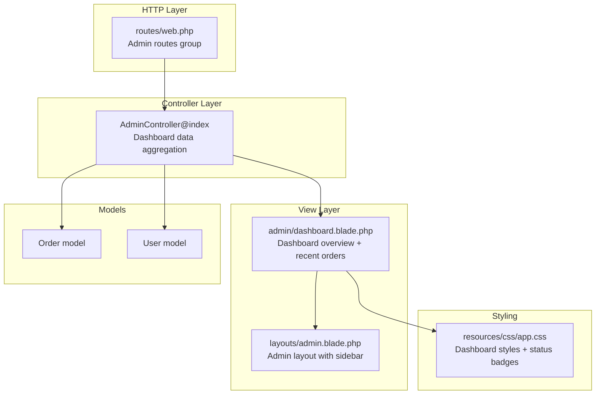
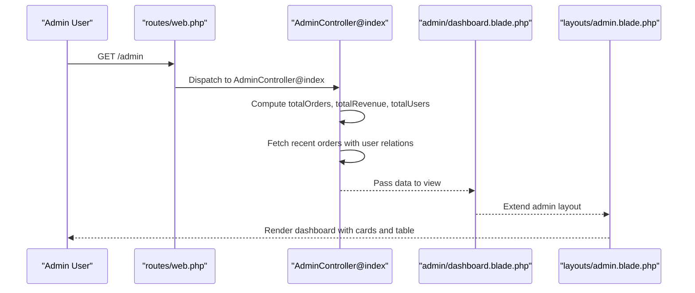
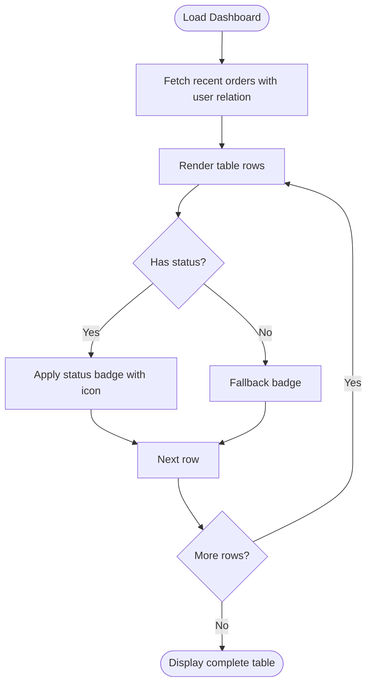
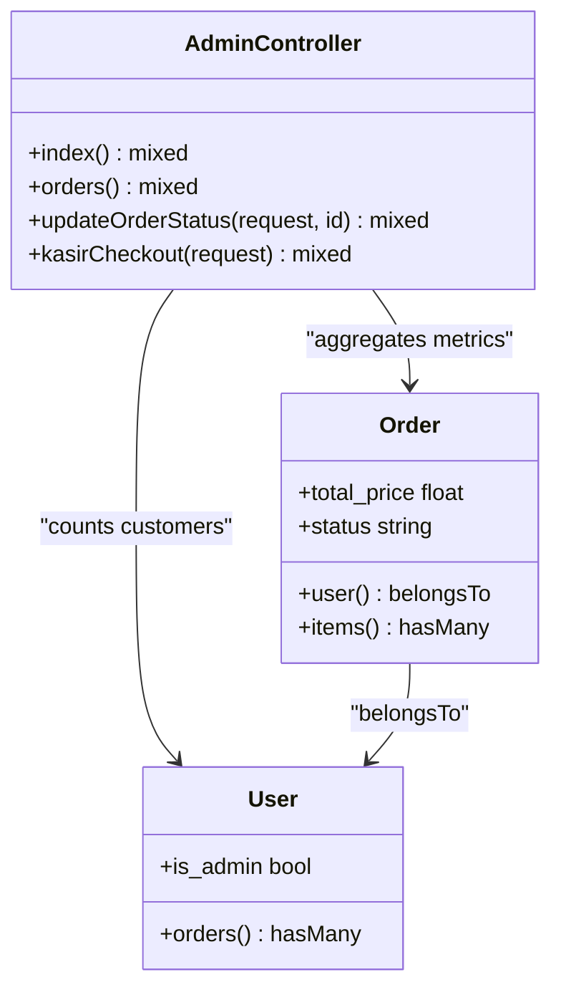

# Admin Dashboard

<cite>
**Referenced Files in This Document**
- [dashboard.blade.php](file://resources/views/admin/dashboard.blade.php)
- [AdminController.php](file://app/Http/Controllers/AdminController.php)
- [web.php](file://routes/web.php)
- [admin.blade.php](file://resources/views/layouts/admin.blade.php)
- [Order.php](file://app/Models/Order.php)
- [User.php](file://app/Models/User.php)
- [AdminMiddleware.php](file://app/Http/Middleware/AdminMiddleware.php)
- [app.css](file://resources/css/app.css)
</cite>

## Table of Contents
1. [Introduction](#introduction)
2. [Project Structure](#project-structure)
3. [Core Components](#core-components)
4. [Architecture Overview](#architecture-overview)
5. [Detailed Component Analysis](#detailed-component-analysis)
6. [Dependency Analysis](#dependency-analysis)
7. [Performance Considerations](#performance-considerations)
8. [Troubleshooting Guide](#troubleshooting-guide)
9. [Conclusion](#conclusion)

## Introduction
This document explains the admin dashboard functionality for the canteen management system. It covers the dashboard overview screen displaying total orders, revenue statistics, user counts, and recent order listings. It documents analytics widgets, performance metrics display, quick access controls, navigation examples, data visualization components, administrative shortcuts, customization options, real-time data behavior, and integration with other admin modules. Guidance is also provided on interpreting dashboard metrics and identifying operational trends.

## Project Structure
The admin dashboard is implemented as a Blade view layered within the admin layout and controlled by the AdminController. Routes are defined under the admin middleware group, ensuring only administrators can access the dashboard and related admin pages. Styling leverages shared CSS variables and dashboard-specific styles for cards, tables, and status indicators.

**Diagram sources**
- [web.php:52-53](file://routes/web.php#L52-L53)
- [AdminController.php:12-19](file://app/Http/Controllers/AdminController.php#L12-L19)
- [admin.blade.php:22-51](file://resources/views/layouts/admin.blade.php#L22-L51)
- [dashboard.blade.php:5-72](file://resources/views/admin/dashboard.blade.php#L5-L72)
- [Order.php:8-35](file://app/Models/Order.php#L8-L35)
- [User.php:10-54](file://app/Models/User.php#L10-L54)
- [app.css:890-1031](file://resources/css/app.css#L890-L1031)

**Section sources**
- [web.php:52-53](file://routes/web.php#L52-L53)
- [admin.blade.php:22-51](file://resources/views/layouts/admin.blade.php#L22-L51)
- [dashboard.blade.php:5-72](file://resources/views/admin/dashboard.blade.php#L5-L72)
- [app.css:890-1031](file://resources/css/app.css#L890-L1031)

## Core Components
- Dashboard overview cards: display total orders, total revenue, and total customers.
- Recent orders table: shows latest orders with customer, totals, status badges, and timestamps.
- Navigation sidebar: quick access to Menus, Orders, Users, and Cashier modules.
- Status badges: color-coded indicators for order lifecycle stages.
- Styling system: CSS variables and dashboard-specific classes for responsive cards and tables.

Key implementation references:
- Dashboard rendering and data binding: [dashboard.blade.php:5-72](file://resources/views/admin/dashboard.blade.php#L5-L72)
- Controller data aggregation: [AdminController.php:12-19](file://app/Http/Controllers/AdminController.php#L12-L19)
- Layout and navigation: [admin.blade.php:22-51](file://resources/views/layouts/admin.blade.php#L22-L51)
- Status badge styles: [app.css:1264-1279](file://resources/css/app.css#L1264-L1279), [app.css:1023-1031](file://resources/css/app.css#L1023-L1031)

**Section sources**
- [dashboard.blade.php:5-72](file://resources/views/admin/dashboard.blade.php#L5-L72)
- [AdminController.php:12-19](file://app/Http/Controllers/AdminController.php#L12-L19)
- [admin.blade.php:22-51](file://resources/views/layouts/admin.blade.php#L22-L51)
- [app.css:1264-1279](file://resources/css/app.css#L1264-L1279)
- [app.css:1023-1031](file://resources/css/app.css#L1023-L1031)

## Architecture Overview
The admin dashboard follows a standard MVC pattern:
- Routes define the admin group and bind the dashboard controller action.
- The AdminController aggregates metrics and recent orders.
- The dashboard view renders cards and a recent orders table.
- The admin layout provides navigation and applies shared styling.

**Diagram sources**
- [web.php:52-53](file://routes/web.php#L52-L53)
- [AdminController.php:12-19](file://app/Http/Controllers/AdminController.php#L12-L19)
- [dashboard.blade.php:5-72](file://resources/views/admin/dashboard.blade.php#L5-L72)
- [admin.blade.php:22-51](file://resources/views/layouts/admin.blade.php#L22-L51)

## Detailed Component Analysis

### Dashboard Overview Cards
The dashboard presents three summary cards:
- Total Orders: count of all orders.
- Total Revenue: sum of total prices for orders with statuses indicating paid/shipped/completed.
- Total Customers: count of non-admin users.

Rendering logic and styling:
- View template binds computed values and formats currency and counts.
- Card layout and typography are styled via shared CSS variables and card classes.

References:
- Data computation: [AdminController.php:14-16](file://app/Http/Controllers/AdminController.php#L14-L16)
- View rendering: [dashboard.blade.php:6-19](file://resources/views/admin/dashboard.blade.php#L6-L19)
- Card styles: [app.css:86-99](file://resources/css/app.css#L86-L99)

**Section sources**
- [AdminController.php:14-16](file://app/Http/Controllers/AdminController.php#L14-L16)
- [dashboard.blade.php:6-19](file://resources/views/admin/dashboard.blade.php#L6-L19)
- [app.css:86-99](file://resources/css/app.css#L86-L99)

### Recent Orders Listing
The recent orders table displays:
- Order ID, customer name, total price, status badge, and relative creation time.
- A "View All" link navigates to the admin orders page.
- Empty state handling when no recent orders exist.

Status badge logic and styling:
- Status values drive icon and color-coded badges.
- Badge styles are defined in the shared stylesheet.

References:
- Data retrieval and ordering: [AdminController.php:17](file://app/Http/Controllers/AdminController.php#L17)
- View loop and status rendering: [dashboard.blade.php:42-68](file://resources/views/admin/dashboard.blade.php#L42-L68)
- Status badge styles: [app.css:1264-1279](file://resources/css/app.css#L1264-L1279), [app.css:1023-1031](file://resources/css/app.css#L1023-L1031)

**Diagram sources**
- [AdminController.php:17](file://app/Http/Controllers/AdminController.php#L17)
- [dashboard.blade.php:42-68](file://resources/views/admin/dashboard.blade.php#L42-L68)
- [app.css:1264-1279](file://resources/css/app.css#L1264-L1279)

**Section sources**
- [AdminController.php:17](file://app/Http/Controllers/AdminController.php#L17)
- [dashboard.blade.php:42-68](file://resources/views/admin/dashboard.blade.php#L42-L68)
- [app.css:1264-1279](file://resources/css/app.css#L1264-L1279)

### Analytics Widgets and Metrics Display
- Summary cards act as analytics widgets for high-level KPIs.
- Status badges provide a compact visual indicator of order lifecycle progress.
- Relative timestamps help assess recency and throughput.

References:
- Widget rendering: [dashboard.blade.php:6-19](file://resources/views/admin/dashboard.blade.php#L6-L19)
- Status indicators: [dashboard.blade.php:47-62](file://resources/views/admin/dashboard.blade.php#L47-L62)
- Badge styles: [app.css:1264-1279](file://resources/css/app.css#L1264-L1279)

**Section sources**
- [dashboard.blade.php:6-19](file://resources/views/admin/dashboard.blade.php#L6-L19)
- [dashboard.blade.php:47-62](file://resources/views/admin/dashboard.blade.php#L47-L62)
- [app.css:1264-1279](file://resources/css/app.css#L1264-L1279)

### Quick Access Controls and Navigation
- Sidebar links navigate to Menus, Orders, Users, and Cashier modules.
- Active state highlighting improves orientation.
- Logout form integrated in the sidebar.

References:
- Sidebar navigation: [admin.blade.php:26-42](file://resources/views/layouts/admin.blade.php#L26-L42)
- Active link styling: [admin.blade.php:922-925](file://resources/views/layouts/admin.blade.php#L922-L925)

**Section sources**
- [admin.blade.php:26-42](file://resources/views/layouts/admin.blade.php#L26-L42)
- [admin.blade.php:922-925](file://resources/views/layouts/admin.blade.php#L922-L925)

### Practical Examples and Administrative Shortcuts
- Dashboard to Orders: Click "View All" in the recent orders card to go to the admin orders page.
- Menus shortcut: Navigate from the sidebar to manage menu items.
- Users shortcut: Navigate from the sidebar to manage users.
- Cashier shortcut: Navigate from the sidebar to process POS payments.

References:
- View All link: [dashboard.blade.php:27](file://resources/views/admin/dashboard.blade.php#L27)
- Sidebar links: [admin.blade.php:26-42](file://resources/views/layouts/admin.blade.php#L26-L42)

**Section sources**
- [dashboard.blade.php:27](file://resources/views/admin/dashboard.blade.php#L27)
- [admin.blade.php:26-42](file://resources/views/layouts/admin.blade.php#L26-L42)

### Dashboard Customization Options
- Color scheme and typography are centralized via CSS variables.
- Card and table styles can be adjusted by modifying shared classes.
- Status badge colors and icons can be customized in the stylesheet.

References:
- CSS variables: [app.css:1-18](file://resources/css/app.css#L1-L18)
- Card styles: [app.css:86-99](file://resources/css/app.css#L86-L99)
- Table and dashboard overrides: [app.css:971-1031](file://resources/css/app.css#L971-L1031)

**Section sources**
- [app.css:1-18](file://resources/css/app.css#L1-L18)
- [app.css:86-99](file://resources/css/app.css#L86-L99)
- [app.css:971-1031](file://resources/css/app.css#L971-L1031)

### Real-Time Data Updates
- The dashboard computes metrics on each request.
- There is no client-side polling or WebSocket integration for live updates.
- Manual refresh is required to reflect new data.

References:
- Request-driven computation: [AdminController.php:12-19](file://app/Http/Controllers/AdminController.php#L12-L19)

**Section sources**
- [AdminController.php:12-19](file://app/Http/Controllers/AdminController.php#L12-L19)

### Integration with Other Admin Modules
- The dashboard links to Menus, Orders, Users, and Cashier modules.
- The orders module includes automatic status completion after 24 hours when an order reaches "arrived".

References:
- Route bindings: [web.php:54-68](file://routes/web.php#L54-L68)
- Automatic status completion: [AdminController.php:97-113](file://app/Http/Controllers/AdminController.php#L97-L113)

**Section sources**
- [web.php:54-68](file://routes/web.php#L54-L68)
- [AdminController.php:97-113](file://app/Http/Controllers/AdminController.php#L97-L113)

## Dependency Analysis
The dashboard depends on:
- AdminController for data aggregation.
- Order and User models for metrics and relations.
- AdminMiddleware to secure access.
- Blade layout for navigation and styling.

**Diagram sources**
- [AdminController.php:12-19](file://app/Http/Controllers/AdminController.php#L12-L19)
- [Order.php:26-34](file://app/Models/Order.php#L26-L34)
- [User.php:50-53](file://app/Models/User.php#L50-L53)

**Section sources**
- [AdminController.php:12-19](file://app/Http/Controllers/AdminController.php#L12-L19)
- [Order.php:26-34](file://app/Models/Order.php#L26-L34)
- [User.php:50-53](file://app/Models/User.php#L50-L53)

## Performance Considerations
- Dashboard queries: The controller performs lightweight aggregations and a small paginated fetch for recent orders. These are efficient for typical canteen workloads.
- Rendering: Blade loops iterate over a small dataset (recent orders), minimizing rendering overhead.
- Styling: Shared CSS variables and minimal customizations reduce bundle size and improve maintainability.

Recommendations:
- For very high traffic, consider caching dashboard metrics for short intervals.
- Ensure database indexes exist on frequently filtered columns (e.g., created_at, status).

[No sources needed since this section provides general guidance]

## Troubleshooting Guide
- Access denied: Non-admin users are blocked by AdminMiddleware.
- Missing revenue data: Verify order statuses included in revenue calculation match expected values.
- Empty recent orders: Confirm orders exist and recent orders query returns results.
- Status badge missing icons: Ensure Font Awesome is loaded in the layout.

References:
- Admin middleware enforcement: [AdminMiddleware.php:17-24](file://app/Http/Middleware/AdminMiddleware.php#L17-L24)
- Revenue aggregation logic: [AdminController.php:14-16](file://app/Http/Controllers/AdminController.php#L14-L16)
- Recent orders query: [AdminController.php:17](file://app/Http/Controllers/AdminController.php#L17)
- Icon library inclusion: [admin.blade.php:14](file://resources/views/layouts/admin.blade.php#L14)

**Section sources**
- [AdminMiddleware.php:17-24](file://app/Http/Middleware/AdminMiddleware.php#L17-L24)
- [AdminController.php:14-16](file://app/Http/Controllers/AdminController.php#L14-L16)
- [AdminController.php:17](file://app/Http/Controllers/AdminController.php#L17)
- [admin.blade.php:14](file://resources/views/layouts/admin.blade.php#L14)

## Conclusion
The admin dashboard provides a concise overview of canteen operations with actionable navigation and clear visual indicators. Its modular design integrates seamlessly with other admin modules, while the styling system supports easy customization. For larger deployments, consider implementing lightweight caching or periodic refresh mechanisms to keep metrics current without impacting performance.