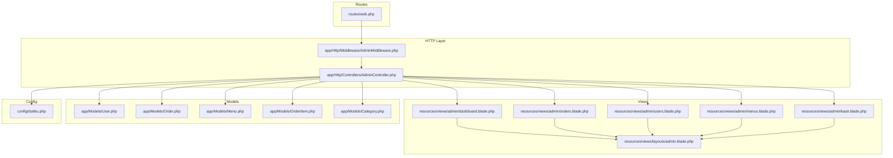
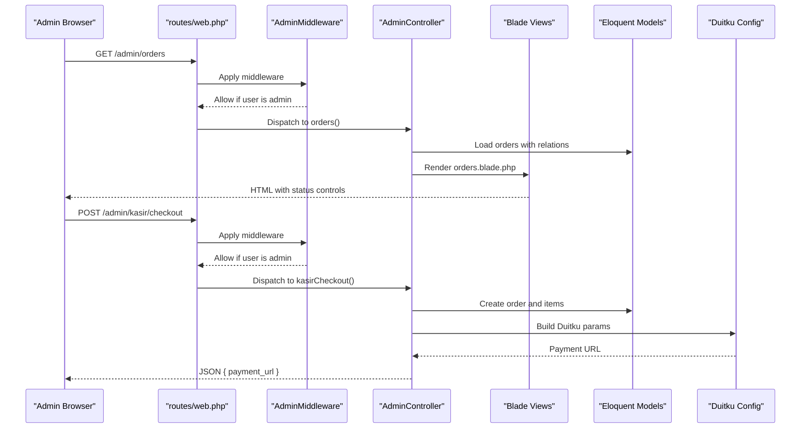
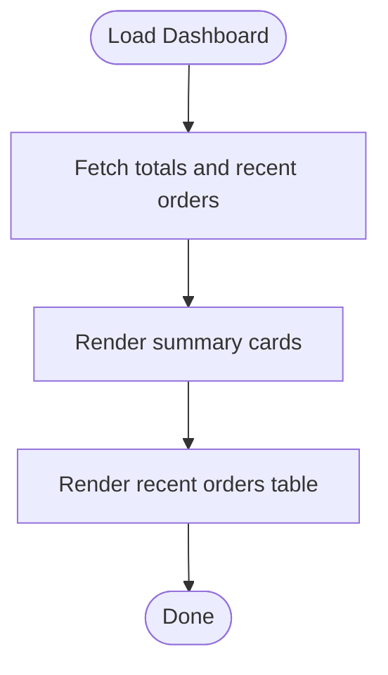
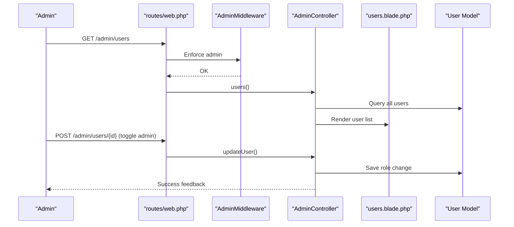
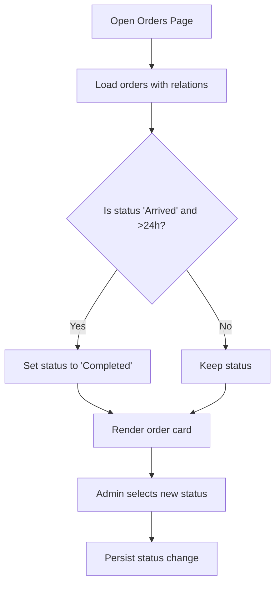
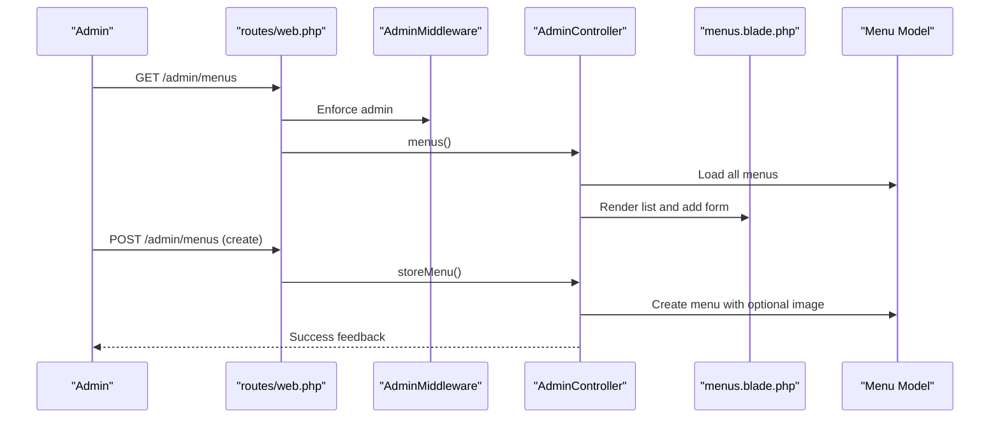
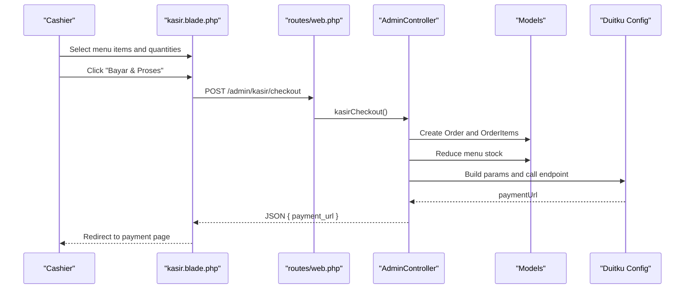
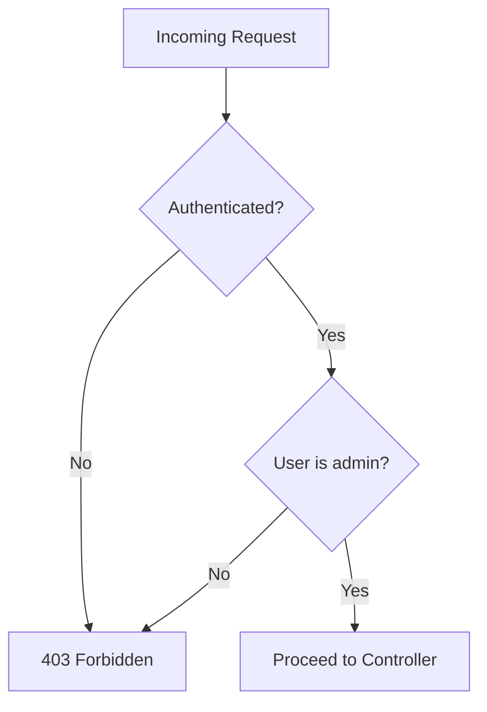
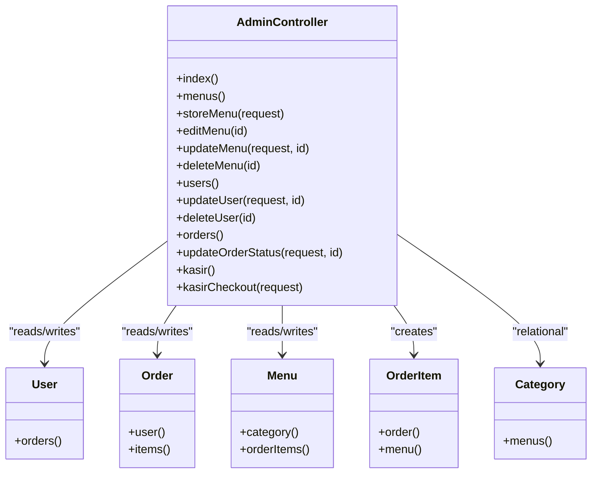

# Administrator Guide

<cite>
**Referenced Files in This Document**
- [AdminController.php](file://app/Http/Controllers/AdminController.php)
- [AdminMiddleware.php](file://app/Http/Middleware/AdminMiddleware.php)
- [web.php](file://routes/web.php)
- [dashboard.blade.php](file://resources/views/admin/dashboard.blade.php)
- [orders.blade.php](file://resources/views/admin/orders.blade.php)
- [users.blade.php](file://resources/views/admin/users.blade.php)
- [menus.blade.php](file://resources/views/admin/menus.blade.php)
- [kasir.blade.php](file://resources/views/admin/kasir.blade.php)
- [admin.blade.php](file://resources/views/layouts/admin.blade.php)
- [User.php](file://app/Models/User.php)
- [Order.php](file://app/Models/Order.php)
- [Menu.php](file://app/Models/Menu.php)
- [OrderItem.php](file://app/Models/OrderItem.php)
- [Category.php](file://app/Models/Category.php)
- [duitku.php](file://config/duitku.php)
</cite>

## Table of Contents
1. [Introduction](#introduction)
2. [Project Structure](#project-structure)
3. [Core Components](#core-components)
4. [Architecture Overview](#architecture-overview)
5. [Detailed Component Analysis](#detailed-component-analysis)
6. [Dependency Analysis](#dependency-analysis)
7. [Performance Considerations](#performance-considerations)
8. [Troubleshooting Guide](#troubleshooting-guide)
9. [Conclusion](#conclusion)
10. [Appendices](#appendices)

## Introduction
This Administrator Guide documents the administrative functionality and management operations in the Kantin Ibu Ida system. It covers the admin dashboard overview, user management, order monitoring and processing, menu administration, and cashier operations. It also explains role-based access control, administrative permissions, security considerations, data visualization, bulk operations, reporting features, integration with the payment system, order fulfillment workflows, and inventory management. Practical examples demonstrate common administrative tasks such as updating order status, managing menu items, administering user accounts, and operating the cash register. Finally, it outlines admin training requirements and best practices for system maintenance.

## Project Structure
Administrative features are organized around a dedicated admin controller, middleware for access control, Blade templates for admin pages, and Laravel routes grouped under an admin prefix. Payment integration uses the Duitku configuration and endpoints.

**Diagram sources**
- [web.php:52-70](file://routes/web.php#L52-L70)
- [AdminMiddleware.php:17-24](file://app/Http/Middleware/AdminMiddleware.php#L17-L24)
- [AdminController.php:12-127](file://app/Http/Controllers/AdminController.php#L12-L127)
- [dashboard.blade.php:1-74](file://resources/views/admin/dashboard.blade.php#L1-L74)
- [orders.blade.php:1-118](file://resources/views/admin/orders.blade.php#L1-L118)
- [users.blade.php:1-57](file://resources/views/admin/users.blade.php#L1-L57)
- [menus.blade.php:1-95](file://resources/views/admin/menus.blade.php#L1-L95)
- [kasir.blade.php:1-163](file://resources/views/admin/kasir.blade.php#L1-L163)
- [admin.blade.php:22-51](file://resources/views/layouts/admin.blade.php#L22-L51)
- [User.php:10-54](file://app/Models/User.php#L10-L54)
- [Order.php:8-35](file://app/Models/Order.php#L8-L35)
- [Menu.php:8-31](file://app/Models/Menu.php#L8-L31)
- [OrderItem.php:8-28](file://app/Models/OrderItem.php#L8-L28)
- [Category.php:7-15](file://app/Models/Category.php#L7-L15)
- [duitku.php:1-12](file://config/duitku.php#L1-L12)

**Section sources**
- [web.php:52-70](file://routes/web.php#L52-L70)
- [admin.blade.php:22-51](file://resources/views/layouts/admin.blade.php#L22-L51)

## Core Components
- Admin Dashboard: Provides summary cards for total orders, revenue, and total users, plus a recent orders table.
- User Management: Lists users, toggles admin roles, and deletes users.
- Order Management: Displays orders with status steps, allows status updates, and auto-completes late “arrived” orders.
- Menu Administration: Adds, edits, and deletes menu items with image upload or URL support.
- Cashier (POS): Point-of-sale interface to build orders, manage quantities, select payment method, and integrate with Duitku payments.
- Access Control: Admin-only routes enforced via middleware.
- Payment Integration: Duitku configuration and API invocation for payment initiation.

**Section sources**
- [AdminController.php:12-127](file://app/Http/Controllers/AdminController.php#L12-L127)
- [dashboard.blade.php:6-19](file://resources/views/admin/dashboard.blade.php#L6-L19)
- [users.blade.php:12-54](file://resources/views/admin/users.blade.php#L12-L54)
- [orders.blade.php:24-116](file://resources/views/admin/orders.blade.php#L24-L116)
- [menus.blade.php:15-91](file://resources/views/admin/menus.blade.php#L15-L91)
- [kasir.blade.php:6-72](file://resources/views/admin/kasir.blade.php#L6-L72)
- [AdminMiddleware.php:17-24](file://app/Http/Middleware/AdminMiddleware.php#L17-L24)
- [duitku.php:1-12](file://config/duitku.php#L1-L12)

## Architecture Overview
The admin subsystem follows MVC with explicit middleware enforcement. Routes under the admin prefix delegate to the AdminController, which interacts with Eloquent models and external payment APIs.

**Diagram sources**
- [web.php:52-70](file://routes/web.php#L52-L70)
- [AdminMiddleware.php:17-24](file://app/Http/Middleware/AdminMiddleware.php#L17-L24)
- [AdminController.php:97-127](file://app/Http/Controllers/AdminController.php#L97-L127)
- [AdminController.php:129-246](file://app/Http/Controllers/AdminController.php#L129-L246)
- [orders.blade.php:98-110](file://resources/views/admin/orders.blade.php#L98-L110)
- [kasir.blade.php:131-158](file://resources/views/admin/kasir.blade.php#L131-L158)
- [Order.php:26-34](file://app/Models/Order.php#L26-L34)
- [OrderItem.php:19-27](file://app/Models/OrderItem.php#L19-L27)
- [duitku.php:1-12](file://config/duitku.php#L1-L12)

## Detailed Component Analysis

### Admin Dashboard
- Purpose: Summarize key metrics and recent activity.
- Metrics:
  - Total Orders: Count of all orders.
  - Revenue: Sum of selected statuses.
  - Total Users: Count excluding admins.
- Recent Orders: Top 5 latest orders with status badges and timestamps.
- Navigation: Quick link to full orders list.

**Diagram sources**
- [AdminController.php:12-19](file://app/Http/Controllers/AdminController.php#L12-L19)
- [dashboard.blade.php:6-72](file://resources/views/admin/dashboard.blade.php#L6-L72)

**Section sources**
- [AdminController.php:12-19](file://app/Http/Controllers/AdminController.php#L12-L19)
- [dashboard.blade.php:6-72](file://resources/views/admin/dashboard.blade.php#L6-L72)

### User Management
- Features:
  - List users with role badges.
  - Toggle admin role via checkbox form submission.
  - Delete users with confirmation.
- Security: Self-delete is prevented for safety.

**Diagram sources**
- [web.php:60-62](file://routes/web.php#L60-L62)
- [AdminMiddleware.php:17-24](file://app/Http/Middleware/AdminMiddleware.php#L17-L24)
- [AdminController.php:77-95](file://app/Http/Controllers/AdminController.php#L77-L95)
- [users.blade.php:34-48](file://resources/views/admin/users.blade.php#L34-L48)
- [User.php:50-53](file://app/Models/User.php#L50-L53)

**Section sources**
- [AdminController.php:77-95](file://app/Http/Controllers/AdminController.php#L77-L95)
- [users.blade.php:12-54](file://resources/views/admin/users.blade.php#L12-L54)
- [User.php:19-25](file://app/Models/User.php#L19-L25)

### Order Monitoring and Processing
- Order Listing:
  - Full list with collapsible details, itemized breakdown, shipping fee, and payment info.
  - Status steps visualization for non-pending orders.
- Status Updates:
  - Selectable dropdown to move orders through “Created”, “On Delivery”, “Arrived”, “Completed”.
- Auto-Completion:
  - Orders marked “Arrived” older than 24 hours are automatically set to “Completed”.

**Diagram sources**
- [AdminController.php:97-121](file://app/Http/Controllers/AdminController.php#L97-L121)
- [orders.blade.php:24-116](file://resources/views/admin/orders.blade.php#L24-L116)
- [Order.php:26-34](file://app/Models/Order.php#L26-L34)

**Section sources**
- [AdminController.php:97-121](file://app/Http/Controllers/AdminController.php#L97-L121)
- [orders.blade.php:24-116](file://resources/views/admin/orders.blade.php#L24-L116)

### Menu Administration
- Add Menu:
  - Form collects name, description, price, stock, category, and image (upload or URL).
  - Validates numeric and integer fields; stores image to storage and sets URL.
- Edit/Delete:
  - Edit page preloads current values.
  - Delete removes the menu.
- Inventory:
  - Stock field supports integer min-zero validation.

**Diagram sources**
- [web.php:54-58](file://routes/web.php#L54-L58)
- [AdminMiddleware.php:17-24](file://app/Http/Middleware/AdminMiddleware.php#L17-L24)
- [AdminController.php:21-75](file://app/Http/Controllers/AdminController.php#L21-L75)
- [menus.blade.php:15-91](file://resources/views/admin/menus.blade.php#L15-L91)
- [Menu.php:22-30](file://app/Models/Menu.php#L22-L30)

**Section sources**
- [AdminController.php:21-75](file://app/Http/Controllers/AdminController.php#L21-L75)
- [menus.blade.php:15-91](file://resources/views/admin/menus.blade.php#L15-L91)
- [Menu.php:12-20](file://app/Models/Menu.php#L12-L20)

### Cashier Operations (POS)
- Menu Selection:
  - Grid of menu cards with image, name, price, and remaining stock.
- Cart Management:
  - Click to add; adjust quantities; remove items.
  - Real-time total calculation.
- Checkout:
  - Customer name and payment method selection.
  - Validates stock availability and constructs order items.
  - Deducts stock immediately upon successful checkout.
  - Integrates with Duitku to obtain a payment URL.
- Payment Flow:
  - Builds merchant order ID, signature, and endpoint based on environment.
  - Returns payment URL to browser for redirection.

**Diagram sources**
- [kasir.blade.php:6-72](file://resources/views/admin/kasir.blade.php#L6-L72)
- [kasir.blade.php:131-158](file://resources/views/admin/kasir.blade.php#L131-L158)
- [web.php:67-68](file://routes/web.php#L67-L68)
- [AdminController.php:129-246](file://app/Http/Controllers/AdminController.php#L129-L246)
- [Order.php:26-34](file://app/Models/Order.php#L26-L34)
- [OrderItem.php:19-27](file://app/Models/OrderItem.php#L19-L27)
- [Menu.php:22-30](file://app/Models/Menu.php#L22-L30)
- [duitku.php:1-12](file://config/duitku.php#L1-L12)

**Section sources**
- [kasir.blade.php:6-72](file://resources/views/admin/kasir.blade.php#L6-L72)
- [AdminController.php:129-246](file://app/Http/Controllers/AdminController.php#L129-L246)
- [Order.php:12-24](file://app/Models/Order.php#L12-L24)
- [OrderItem.php:12-17](file://app/Models/OrderItem.php#L12-L17)
- [Menu.php:12-20](file://app/Models/Menu.php#L12-L20)
- [duitku.php:1-12](file://config/duitku.php#L1-L12)

### Role-Based Access Control and Permissions
- Access Control:
  - Admin-only routes are guarded by AdminMiddleware.
  - Middleware checks authentication and admin flag; denies unauthorized access.
- Administrative Permissions:
  - Admins can manage users, menus, orders, and operate the cashier.
  - Non-admin users are redirected or blocked from admin routes.

**Diagram sources**
- [AdminMiddleware.php:17-24](file://app/Http/Middleware/AdminMiddleware.php#L17-L24)
- [web.php:52-70](file://routes/web.php#L52-L70)

**Section sources**
- [AdminMiddleware.php:17-24](file://app/Http/Middleware/AdminMiddleware.php#L17-L24)
- [web.php:52-70](file://routes/web.php#L52-L70)

### Security Considerations
- Authentication: Admin routes require login.
- Authorization: AdminMiddleware ensures only admin users can access admin routes.
- CSRF Protection: Forms use CSRF tokens.
- Input Validation: Controllers validate menu creation/edit and cashier checkout requests.
- Environment Configuration: Duitku credentials are loaded from environment variables; missing values trigger configuration errors.

**Section sources**
- [web.php:33-48](file://routes/web.php#L33-L48)
- [web.php:52-70](file://routes/web.php#L52-L70)
- [AdminMiddleware.php:17-24](file://app/Http/Middleware/AdminMiddleware.php#L17-L24)
- [AdminController.php:29-43](file://app/Http/Controllers/AdminController.php#L29-L43)
- [AdminController.php:131-137](file://app/Http/Controllers/AdminController.php#L131-L137)
- [AdminController.php:248-255](file://app/Http/Controllers/AdminController.php#L248-L255)
- [duitku.php:4-5](file://config/duitku.php#L4-L5)

### Data Visualization and Reporting
- Dashboard Cards: Display total orders, formatted revenue, and total users.
- Orders List: Accordion-style cards with status steps, itemization, and totals.
- Users List: Role badges and inline toggle controls.
- Menus List: Thumbnail previews, pricing, and stock indicators.

**Section sources**
- [dashboard.blade.php:6-19](file://resources/views/admin/dashboard.blade.php#L6-L19)
- [orders.blade.php:66-91](file://resources/views/admin/orders.blade.php#L66-L91)
- [users.blade.php:28-32](file://resources/views/admin/users.blade.php#L28-L32)
- [menus.blade.php:69-75](file://resources/views/admin/menus.blade.php#L69-L75)

### Bulk Operations and Workflows
- Bulk Status Updates: Admin selects new status per order; persisted via POST.
- Bulk Deletions: Delete users and menus via DELETE forms.
- Auto-Completion: Automatic status advancement after 24 hours for “Arrived” orders.

**Section sources**
- [orders.blade.php:98-110](file://resources/views/admin/orders.blade.php#L98-L110)
- [users.blade.php:43-48](file://resources/views/admin/users.blade.php#L43-L48)
- [menus.blade.php:79-84](file://resources/views/admin/menus.blade.php#L79-L84)
- [AdminController.php:101-110](file://app/Http/Controllers/AdminController.php#L101-L110)

### Payment System Integration
- Configuration:
  - Merchant code and API key loaded from environment variables.
  - Sandbox vs production endpoints configurable.
- POS Payments:
  - Builds signature and parameters.
  - Calls Duitku inquiry endpoint and returns payment URL.
- Callback Handling:
  - Shared callback logic exists in the home controller for general payments; admin POS redirects to payment URL and returns to cashier.

**Section sources**
- [duitku.php:1-12](file://config/duitku.php#L1-L12)
- [AdminController.php:180-246](file://app/Http/Controllers/AdminController.php#L180-L246)
- [HomeController.php:340-408](file://app/Http/Controllers/HomeController.php#L340-L408)

### Order Fulfillment and Inventory Management
- Fulfillment:
  - Admin moves orders through stages: Created, On Delivery, Arrived, Completed.
  - Auto-completion reduces manual work for late arrivals.
- Inventory:
  - Stock reduction occurs during cashier checkout.
  - Stock validation prevents overselling.

**Section sources**
- [orders.blade.php:66-74](file://resources/views/admin/orders.blade.php#L66-L74)
- [AdminController.php:101-110](file://app/Http/Controllers/AdminController.php#L101-L110)
- [AdminController.php:158-163](file://app/Http/Controllers/AdminController.php#L158-L163)

### Practical Examples
- Update Order Status:
  - Open orders list, choose desired status from dropdown, submit.
- Manage Menu Items:
  - Add new menu with image upload or URL; edit existing entries; delete when discontinued.
- Administer User Accounts:
  - Toggle admin role for staff; delete inactive accounts.
- Cash Register Operations:
  - Select items, adjust quantities, enter customer name, choose payment method, confirm checkout, and redirect to payment.

**Section sources**
- [orders.blade.php:98-110](file://resources/views/admin/orders.blade.php#L98-L110)
- [menus.blade.php:15-51](file://resources/views/admin/menus.blade.php#L15-L51)
- [users.blade.php:34-48](file://resources/views/admin/users.blade.php#L34-L48)
- [kasir.blade.php:125-158](file://resources/views/admin/kasir.blade.php#L125-L158)

## Dependency Analysis
The admin controller depends on models for data access and uses configuration for payment integration. Middleware enforces access control at the route level.

**Diagram sources**
- [AdminController.php:10-127](file://app/Http/Controllers/AdminController.php#L10-L127)
- [User.php:50-53](file://app/Models/User.php#L50-L53)
- [Order.php:26-34](file://app/Models/Order.php#L26-L34)
- [Menu.php:22-30](file://app/Models/Menu.php#L22-L30)
- [OrderItem.php:19-27](file://app/Models/OrderItem.php#L19-L27)
- [Category.php:11-14](file://app/Models/Category.php#L11-L14)

**Section sources**
- [AdminController.php:10-127](file://app/Http/Controllers/AdminController.php#L10-L127)
- [User.php:50-53](file://app/Models/User.php#L50-L53)
- [Order.php:26-34](file://app/Models/Order.php#L26-L34)
- [Menu.php:22-30](file://app/Models/Menu.php#L22-L30)
- [OrderItem.php:19-27](file://app/Models/OrderItem.php#L19-L27)
- [Category.php:11-14](file://app/Models/Category.php#L11-L14)

## Performance Considerations
- Eager Loading: Admin orders view uses eager loading for user and items to reduce N+1 queries.
- Auto-Completion Loop: Iterating all orders on each load may impact performance with large datasets; consider background job scheduling for periodic completion.
- Image Storage: Storing images increases storage usage; ensure appropriate retention and cleanup policies.
- Payment API Calls: Duitku requests occur synchronously during checkout; consider asynchronous callbacks and caching for frequently accessed menu lists.

[No sources needed since this section provides general guidance]

## Troubleshooting Guide
- Access Denied:
  - Symptom: 403 error when visiting admin routes.
  - Cause: Non-admin user or unauthenticated.
  - Resolution: Log in as admin or ensure user has admin flag.
- Missing Duitku Credentials:
  - Symptom: JSON error indicating incomplete configuration.
  - Cause: Missing merchant code or API key.
  - Resolution: Set environment variables and clear config cache.
- Insufficient Stock:
  - Symptom: Checkout fails with stock message.
  - Cause: Selected quantity exceeds available stock.
  - Resolution: Adjust quantities or restock items.
- Payment URL Missing:
  - Symptom: JSON indicates failure to obtain payment URL.
  - Cause: Duitku endpoint error or invalid parameters.
  - Resolution: Verify configuration and retry; check callback/return URLs.

**Section sources**
- [AdminMiddleware.php:19-21](file://app/Http/Middleware/AdminMiddleware.php#L19-L21)
- [AdminController.php:248-255](file://app/Http/Controllers/AdminController.php#L248-L255)
- [AdminController.php:158-160](file://app/Http/Controllers/AdminController.php#L158-L160)
- [AdminController.php:233-242](file://app/Http/Controllers/AdminController.php#L233-L242)

## Conclusion
The Kantin Ibu Ida admin system provides a comprehensive toolkit for managing users, menus, orders, and cash register operations. With role-based access control, robust data visualization, and integrated payment processing, administrators can efficiently monitor and operate the canteen. Following the best practices and troubleshooting guidance outlined here will help maintain system reliability and streamline daily administrative tasks.

[No sources needed since this section summarizes without analyzing specific files]

## Appendices
- Admin Layout Navigation: Sidebar links to dashboard, menus, orders, users, and cashier.
- Training Checklist:
  - Understand admin roles and access control.
  - Learn dashboard metrics interpretation.
  - Practice user role toggling and deletion.
  - Master order status updates and auto-completion behavior.
  - Operate POS: selecting items, managing quantities, validating stock, initiating payments.
  - Configure Duitku credentials and environments.
  - Perform routine maintenance: clearing caches, reviewing logs, and backing up configurations.

**Section sources**
- [admin.blade.php:26-41](file://resources/views/layouts/admin.blade.php#L26-L41)