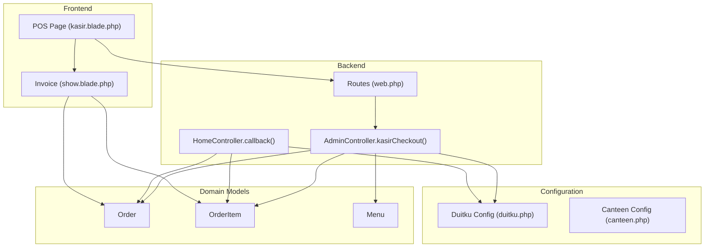
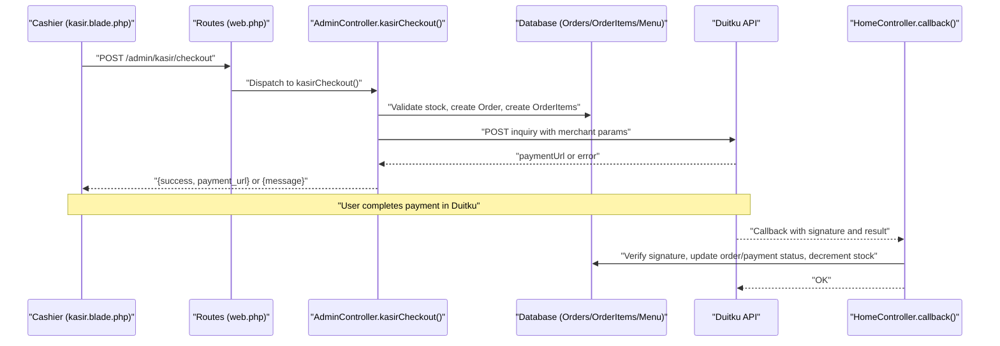
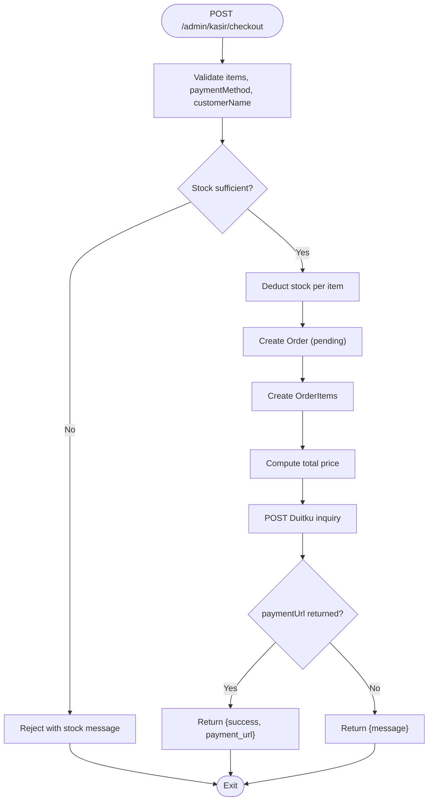
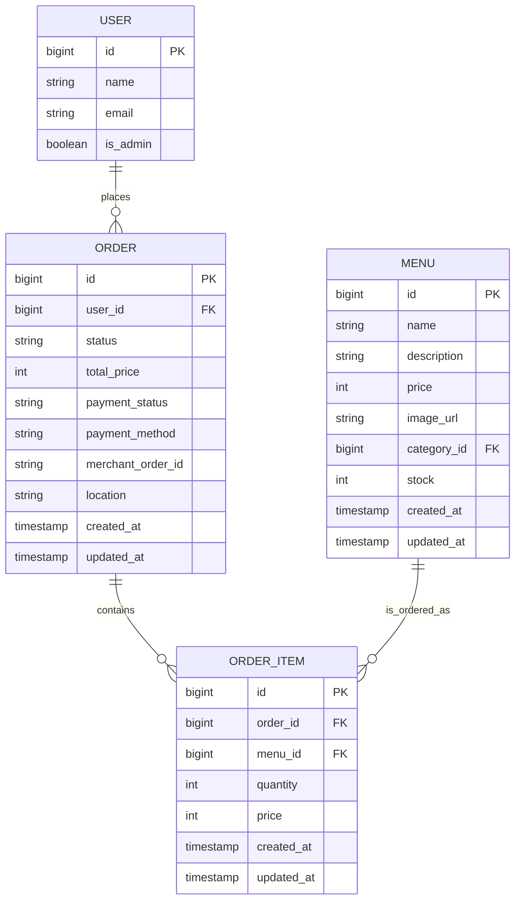
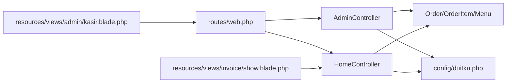

# Cashier System

<cite>
**Referenced Files in This Document**
- [web.php](file://routes/web.php)
- [AdminController.php](file://app/Http/Controllers/AdminController.php)
- [HomeController.php](file://app/Http/Controllers/HomeController.php)
- [kasir.blade.php](file://resources/views/admin/kasir.blade.php)
- [show.blade.php](file://resources/views/invoice/show.blade.php)
- [duitku.php](file://config/duitku.php)
- [canteen.php](file://config/canteen.php)
- [Order.php](file://app/Models/Order.php)
- [OrderItem.php](file://app/Models/OrderItem.php)
- [Menu.php](file://app/Models/Menu.php)
- [create_orders_table.php](file://database/migrations/2026_04_21_011703_create_orders_table.php)
- [create_order_items_table.php](file://database/migrations/2026_04_21_011704_create_order_items_table.php)
- [create_payments_table.php](file://database/migrations/2026_05_15_072246_create_payments_table.php)
</cite>

## Table of Contents
1. [Introduction](#introduction)
2. [Project Structure](#project-structure)
3. [Core Components](#core-components)
4. [Architecture Overview](#architecture-overview)
5. [Detailed Component Analysis](#detailed-component-analysis)
6. [Dependency Analysis](#dependency-analysis)
7. [Performance Considerations](#performance-considerations)
8. [Troubleshooting Guide](#troubleshooting-guide)
9. [Conclusion](#conclusion)
10. [Appendices](#appendices)

## Introduction
This document explains the cashier system functionality for walk-in customers. It covers the POS (Point of Sale) interface, cash transaction processing, and receipt generation. It documents the cashier checkout workflow including item selection, quantity management, payment method processing, and inventory deduction. Practical examples demonstrate processing walk-in orders, handling payments via the integrated Duitku payment system for card/QRIS payments, managing customer names, and generating receipts. Guidance is also provided on cashier session management, transaction logging, and integration with the main order management system.

## Project Structure
The cashier system spans frontend templates, backend controllers, models, routes, configuration, and database migrations:
- Frontend: POS page for walk-in sales and invoice/receipt rendering
- Backend: Admin controller for cashier checkout and payment initiation; home controller for payment callbacks and invoice rendering
- Models: Order, OrderItem, Menu
- Routes: Admin routes for POS and checkout endpoint
- Configurations: Duitku merchant settings and canteen delivery limits
- Migrations: Orders, Order Items, Payments tables

**Diagram sources**
- [kasir.blade.php:1-163](file://resources/views/admin/kasir.blade.php#L1-L163)
- [web.php:67-68](file://routes/web.php#L67-L68)
- [AdminController.php:129-246](file://app/Http/Controllers/AdminController.php#L129-L246)
- [HomeController.php:410-452](file://app/Http/Controllers/HomeController.php#L410-L452)
- [Order.php:8-35](file://app/Models/Order.php#L8-L35)
- [OrderItem.php:8-28](file://app/Models/OrderItem.php#L8-L28)
- [Menu.php:8-31](file://app/Models/Menu.php#L8-L31)
- [duitku.php:1-12](file://config/duitku.php#L1-L12)
- [canteen.php:1-9](file://config/canteen.php#L1-L9)

**Section sources**
- [web.php:67-68](file://routes/web.php#L67-L68)
- [AdminController.php:123-127](file://app/Http/Controllers/AdminController.php#L123-L127)
- [kasir.blade.php:1-163](file://resources/views/admin/kasir.blade.php#L1-L163)
- [Order.php:8-35](file://app/Models/Order.php#L8-L35)
- [OrderItem.php:8-28](file://app/Models/OrderItem.php#L8-L28)
- [Menu.php:8-31](file://app/Models/Menu.php#L8-L31)
- [create_orders_table.php:14-21](file://database/migrations/2026_04_21_011703_create_orders_table.php#L14-L21)
- [create_order_items_table.php:14-21](file://database/migrations/2026_04_21_011704_create_order_items_table.php#L14-L21)
- [create_payments_table.php:14-21](file://database/migrations/2026_05_15_072246_create_payments_table.php#L14-L21)

## Core Components
- POS Interface (walk-in sales): A Vue-like AlpineJS-driven page for selecting menu items, adjusting quantities, entering customer name, choosing payment method, and initiating checkout.
- Checkout Controller: Validates items, checks stock availability, deducts inventory, creates order and order items, and initiates Duitku payment.
- Payment Callback Handler: Verifies signatures, updates order/payment status, and decrements stock for delivered orders.
- Receipt/Invoice: Renders printable invoices with order details, totals, and payment metadata.

Key implementation references:
- POS page and client-side logic: [kasir.blade.php:1-163](file://resources/views/admin/kasir.blade.php#L1-L163)
- Cashier checkout endpoint: [web.php:67-68](file://routes/web.php#L67-L68), [AdminController.php:129-246](file://app/Http/Controllers/AdminController.php#L129-L246)
- Payment callback and stock handling: [HomeController.php:410-452](file://app/Http/Controllers/HomeController.php#L410-L452)
- Invoice rendering: [show.blade.php:1-125](file://resources/views/invoice/show.blade.php#L1-L125)

**Section sources**
- [kasir.blade.php:1-163](file://resources/views/admin/kasir.blade.php#L1-L163)
- [web.php:67-68](file://routes/web.php#L67-L68)
- [AdminController.php:129-246](file://app/Http/Controllers/AdminController.php#L129-L246)
- [HomeController.php:410-452](file://app/Http/Controllers/HomeController.php#L410-L452)
- [show.blade.php:1-125](file://resources/views/invoice/show.blade.php#L1-L125)

## Architecture Overview
The cashier system integrates the frontend POS with backend controllers and external payment processing via Duitku. The flow begins on the POS page, proceeds to the cashier checkout endpoint, and concludes with either a payment URL redirect or an error response. The payment callback updates order states and inventory.

**Diagram sources**
- [kasir.blade.php:125-158](file://resources/views/admin/kasir.blade.php#L125-L158)
- [web.php:67-68](file://routes/web.php#L67-L68)
- [AdminController.php:129-246](file://app/Http/Controllers/AdminController.php#L129-L246)
- [HomeController.php:410-452](file://app/Http/Controllers/HomeController.php#L410-L452)

## Detailed Component Analysis

### POS Interface (Walk-in Sales)
The POS page provides:
- Menu browsing with images, names, prices, and remaining stock
- Add-to-cart actions with stock validation
- Quantity adjustment (+/-) and removal
- Customer name input
- Payment method selection (QRIS/Virtual Account)
- Checkout button with CSRF protection and AJAX submission

Behavior highlights:
- Stock cap enforced per item during add and quantity increase
- Total computed dynamically
- Checkout validates presence of items and customer name, then posts to the cashier checkout endpoint

References:
- [kasir.blade.php:8-72](file://resources/views/admin/kasir.blade.php#L8-L72)
- [kasir.blade.php:74-161](file://resources/views/admin/kasir.blade.php#L74-L161)

**Section sources**
- [kasir.blade.php:8-72](file://resources/views/admin/kasir.blade.php#L8-L72)
- [kasir.blade.php:74-161](file://resources/views/admin/kasir.blade.php#L74-L161)

### Cashier Checkout Workflow
End-to-end checkout process:
1. Validation: items array, each item’s id exists, quantity is integer ≥ 1, payment method and customer name present
2. Stock check: reject if insufficient stock
3. Inventory deduction: reduce menu stock for each ordered item
4. Order creation: pending status, payment pending, location includes customer name
5. Order items creation: quantity and price recorded
6. Recalculate total price
7. Initiate Duitku inquiry with merchant parameters and signature
8. Return payment URL or error message

**Diagram sources**
- [AdminController.php:129-175](file://app/Http/Controllers/AdminController.php#L129-L175)
- [AdminController.php:180-246](file://app/Http/Controllers/AdminController.php#L180-L246)

**Section sources**
- [web.php:67-68](file://routes/web.php#L67-L68)
- [AdminController.php:129-175](file://app/Http/Controllers/AdminController.php#L129-L175)
- [AdminController.php:180-246](file://app/Http/Controllers/AdminController.php#L180-L246)

### Payment Method Processing and Duitku Integration
- Merchant configuration loaded from environment via config file
- Signature computed using merchant code, order ID, amount, and API key
- Inquiry endpoint selected based on environment (sandbox/production)
- On success, order receives merchant order ID and client is redirected to payment URL
- On failure, structured error messages are returned

References:
- [duitku.php:1-12](file://config/duitku.php#L1-L12)
- [AdminController.php:180-246](file://app/Http/Controllers/AdminController.php#L180-L246)

**Section sources**
- [duitku.php:1-12](file://config/duitku.php#L1-L12)
- [AdminController.php:180-246](file://app/Http/Controllers/AdminController.php#L180-L246)

### Payment Callback and Transaction Completion
- Signature verification against incoming parameters
- Successful payment sets order status to created, payment status to paid, and captures payment method
- Stock is decremented for each ordered item
- Delivery distance validation is performed for regular orders (outside POS scope), while POS orders rely on merchant order ID and return flow

References:
- [HomeController.php:410-452](file://app/Http/Controllers/HomeController.php#L410-L452)

**Section sources**
- [HomeController.php:410-452](file://app/Http/Controllers/HomeController.php#L410-L452)

### Receipt Generation
- Accessible via invoice route and rendered by the invoice template
- Displays order items, quantities, unit prices, totals, shipping fee, payment method, and merchant order ID
- Includes print action for PDF generation

References:
- [show.blade.php:1-125](file://resources/views/invoice/show.blade.php#L1-L125)

**Section sources**
- [show.blade.php:1-125](file://resources/views/invoice/show.blade.php#L1-L125)

### Data Models and Persistence
- Order: holds user association, status, payment status, payment method, total price, location, and timestamps
- OrderItem: links order to menu, stores quantity and price
- Menu: product catalog with stock and category relationship

**Diagram sources**
- [Order.php:12-24](file://app/Models/Order.php#L12-L24)
- [OrderItem.php:12-17](file://app/Models/OrderItem.php#L12-L17)
- [Menu.php:12-20](file://app/Models/Menu.php#L12-L20)
- [create_orders_table.php:14-21](file://database/migrations/2026_04_21_011703_create_orders_table.php#L14-L21)
- [create_order_items_table.php:14-21](file://database/migrations/2026_04_21_011704_create_order_items_table.php#L14-L21)

**Section sources**
- [Order.php:8-35](file://app/Models/Order.php#L8-L35)
- [OrderItem.php:8-28](file://app/Models/OrderItem.php#L8-L28)
- [Menu.php:8-31](file://app/Models/Menu.php#L8-L31)
- [create_orders_table.php:14-21](file://database/migrations/2026_04_21_011703_create_orders_table.php#L14-L21)
- [create_order_items_table.php:14-21](file://database/migrations/2026_04_21_011704_create_order_items_table.php#L14-L21)

## Dependency Analysis
- Routes define the cashier checkout endpoint and POS page
- Admin controller orchestrates cashier checkout, stock management, and Duitku integration
- Home controller handles payment callbacks and invoice rendering
- Models encapsulate domain logic and persistence
- Config files supply Duitku and canteen parameters

**Diagram sources**
- [web.php:67-68](file://routes/web.php#L67-L68)
- [AdminController.php:129-246](file://app/Http/Controllers/AdminController.php#L129-L246)
- [HomeController.php:410-452](file://app/Http/Controllers/HomeController.php#L410-L452)
- [kasir.blade.php:1-163](file://resources/views/admin/kasir.blade.php#L1-L163)
- [show.blade.php:1-125](file://resources/views/invoice/show.blade.php#L1-L125)
- [duitku.php:1-12](file://config/duitku.php#L1-L12)

**Section sources**
- [web.php:67-68](file://routes/web.php#L67-L68)
- [AdminController.php:129-246](file://app/Http/Controllers/AdminController.php#L129-L246)
- [HomeController.php:410-452](file://app/Http/Controllers/HomeController.php#L410-L452)
- [kasir.blade.php:1-163](file://resources/views/admin/kasir.blade.php#L1-L163)
- [show.blade.php:1-125](file://resources/views/invoice/show.blade.php#L1-L125)
- [duitku.php:1-12](file://config/duitku.php#L1-L12)

## Performance Considerations
- Minimize database round-trips by batching stock updates and order item creation after validation
- Use eager loading for order items and menus when rendering invoices to avoid N+1 queries
- Cache frequently accessed menu lists for the POS page to reduce load
- Validate payment method and customer name early to fail fast and reduce unnecessary work
- Keep item details off Duitku requests to avoid signature mismatches and improve reliability

## Troubleshooting Guide
Common issues and resolutions:
- Insufficient stock: The cashier checkout endpoint rejects transactions when requested quantities exceed available stock. Ensure stock is refreshed before checkout.
- Missing configuration: Duitku requires merchant code and API key. If missing, the endpoint returns a structured error advising to configure environment variables and clear config cache.
- Payment failures: Review returned messages and debug data from Duitku. Confirm endpoint environment matches sandbox/production settings.
- Callback signature mismatch: The payment callback verifies signatures; mismatches indicate tampering or misconfiguration. Verify API key and endpoint URLs.
- Inventory not updating: Stock is decremented upon successful payment callback. Confirm callback is reachable and properly configured.

Operational references:
- Stock validation and rejection: [AdminController.php:158-160](file://app/Http/Controllers/AdminController.php#L158-L160)
- Duitku configuration check: [AdminController.php:139-144](file://app/Http/Controllers/AdminController.php#L139-L144)
- Duitku error handling: [AdminController.php:237-242](file://app/Http/Controllers/AdminController.php#L237-L242)
- Signature verification and stock decrement: [HomeController.php:424-446](file://app/Http/Controllers/HomeController.php#L424-L446)

**Section sources**
- [AdminController.php:158-160](file://app/Http/Controllers/AdminController.php#L158-L160)
- [AdminController.php:139-144](file://app/Http/Controllers/AdminController.php#L139-L144)
- [AdminController.php:237-242](file://app/Http/Controllers/AdminController.php#L237-L242)
- [HomeController.php:424-446](file://app/Http/Controllers/HomeController.php#L424-L446)

## Conclusion
The cashier system provides a streamlined walk-in sales experience with robust inventory management, secure payment initiation via Duitku, and printable receipts. The POS interface enables efficient item selection and quantity adjustments, while backend controllers enforce stock checks, create orders, and integrate with the payment provider. The invoice template ensures transparency and compliance with transaction records.

## Appendices

### Practical Examples

- Processing a walk-in order:
  - Open the POS page, select items, adjust quantities, enter customer name, choose payment method, and click “Bayar & Proses.”
  - The system validates stock, deducts inventory, creates the order, and redirects to Duitku for payment.
  - References: [kasir.blade.php:125-158](file://resources/views/admin/kasir.blade.php#L125-L158), [AdminController.php:129-175](file://app/Http/Controllers/AdminController.php#L129-L175)

- Handling cash payments:
  - The current implementation integrates with Duitku for QRIS and Virtual Account. For cash payments, record the transaction manually in the admin panel and mark the order as paid if supported by your internal workflow.

- Managing customer names:
  - The POS requires a customer name. Use “Walk-in” or the actual customer name as appropriate. The location field includes the customer name for cashier orders.
  - Reference: [AdminController.php:152](file://app/Http/Controllers/AdminController.php#L152)

- Integrating with Duitku for card payments:
  - Ensure merchant code and API key are configured. The system computes signatures and selects the correct endpoint based on environment.
  - Reference: [duitku.php:1-12](file://config/duitku.php#L1-L12), [AdminController.php:221-223](file://app/Http/Controllers/AdminController.php#L221-L223)

- Receipt generation:
  - After payment completion, access the invoice page to print or save as PDF.
  - Reference: [show.blade.php:1-125](file://resources/views/invoice/show.blade.php#L1-L125)

- Cashier session management:
  - The POS page is accessible to authenticated users. Ensure proper authentication middleware is applied to admin routes.
  - Reference: [web.php:52-70](file://routes/web.php#L52-L70)

- Transaction logging:
  - Orders capture merchant order IDs and statuses. Use the admin order list to track transactions.
  - References: [Order.php:12-24](file://app/Models/Order.php#L12-L24), [web.php:64-65](file://routes/web.php#L64-L65)

- Transaction security:
  - Validate inputs rigorously, compute signatures for Duitku requests, and verify callback signatures to prevent fraud.
  - References: [AdminController.php:129-137](file://app/Http/Controllers/AdminController.php#L129-L137), [HomeController.php:422-424](file://app/Http/Controllers/HomeController.php#L422-L424)