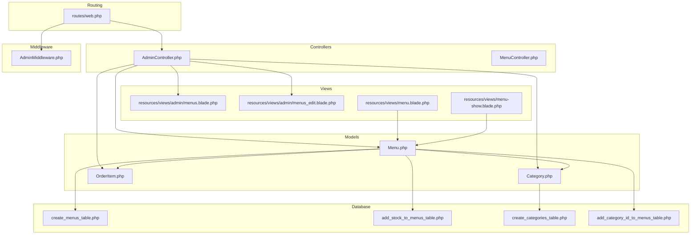
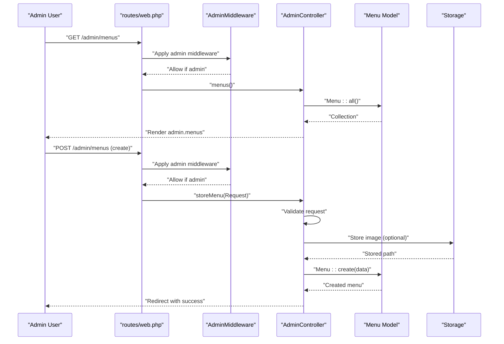
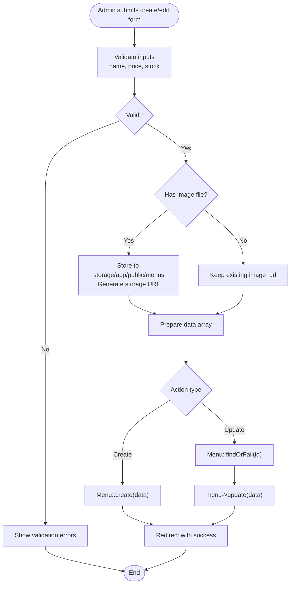
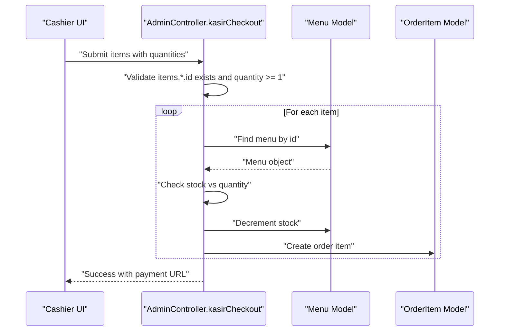
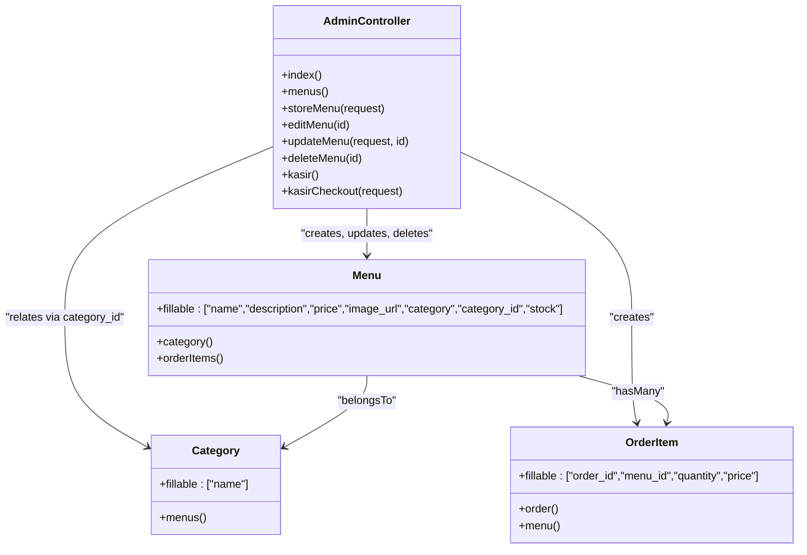

# Menu Administration

<cite>
**Referenced Files in This Document**
- [web.php](file://routes/web.php)
- [AdminController.php](file://app/Http/Controllers/AdminController.php)
- [MenuController.php](file://app/Http/Controllers/MenuController.php)
- [AdminMiddleware.php](file://app/Http/Middleware/AdminMiddleware.php)
- [Menu.php](file://app/Models/Menu.php)
- [Category.php](file://app/Models/Category.php)
- [OrderItem.php](file://app/Models/OrderItem.php)
- [create_menus_table.php](file://database/migrations/2026_04_21_011703_create_menus_table.php)
- [add_stock_to_menus_table.php](file://database/migrations/2026_04_27_021524_add_stock_to_menus_table.php)
- [create_categories_table.php](file://database/migrations/2026_05_15_072236_create_categories_table.php)
- [add_category_id_to_menus_table.php](file://database/migrations/2026_05_15_072320_add_category_id_to_menus_table.php)
- [menus.blade.php](file://resources/views/admin/menus.blade.php)
- [menus_edit.blade.php](file://resources/views/admin/menus_edit.blade.php)
- [menu.blade.php](file://resources/views/menu.blade.php)
- [menu-show.blade.php](file://resources/views/menu-show.blade.php)
</cite>

## Table of Contents
1. [Introduction](#introduction)
2. [Project Structure](#project-structure)
3. [Core Components](#core-components)
4. [Architecture Overview](#architecture-overview)
5. [Detailed Component Analysis](#detailed-component-analysis)
6. [Dependency Analysis](#dependency-analysis)
7. [Performance Considerations](#performance-considerations)
8. [Troubleshooting Guide](#troubleshooting-guide)
9. [Conclusion](#conclusion)
10. [Appendices](#appendices)

## Introduction
This document explains the menu administration functionality of the canteen management system. It covers menu item CRUD operations, stock management, image handling, pricing adjustments, categorization, visibility controls, seasonal management, bulk operations, optimization tips, popular item tracking, and inventory integration with menu stock levels. Practical examples demonstrate validation rules, image uploads, stock tracking, and menu organization.

## Project Structure
The menu administration feature spans routing, controller actions, middleware enforcement, Eloquent models, database migrations, and Blade templates for admin and customer-facing views.

**Diagram sources**
- [web.php:52-70](file://routes/web.php#L52-L70)
- [AdminController.php:10-257](file://app/Http/Controllers/AdminController.php#L10-L257)
- [AdminMiddleware.php:10-25](file://app/Http/Middleware/AdminMiddleware.php#L10-L25)
- [Menu.php:8-31](file://app/Models/Menu.php#L8-L31)
- [Category.php:7-15](file://app/Models/Category.php#L7-L15)
- [OrderItem.php:8-28](file://app/Models/OrderItem.php#L8-L28)
- [create_menus_table.php:12-24](file://database/migrations/2026_04_21_011703_create_menus_table.php#L12-L24)
- [add_stock_to_menus_table.php:12-16](file://database/migrations/2026_04_27_021524_add_stock_to_menus_table.php#L12-L16)
- [create_categories_table.php:12-18](file://database/migrations/2026_05_15_072236_create_categories_table.php#L12-L18)
- [add_category_id_to_menus_table.php:12-16](file://database/migrations/2026_05_15_072320_add_category_id_to_menus_table.php#L12-L16)
- [menus.blade.php:1-95](file://resources/views/admin/menus.blade.php#L1-L95)
- [menus_edit.blade.php:1-65](file://resources/views/admin/menus_edit.blade.php#L1-L65)
- [menu.blade.php:1-52](file://resources/views/menu.blade.php#L1-L52)
- [menu-show.blade.php:59-86](file://resources/views/menu-show.blade.php#L59-L86)

**Section sources**
- [web.php:52-70](file://routes/web.php#L52-L70)
- [AdminController.php:21-75](file://app/Http/Controllers/AdminController.php#L21-L75)
- [Menu.php:12-31](file://app/Models/Menu.php#L12-L31)
- [Category.php:9-15](file://app/Models/Category.php#L9-L15)
- [OrderItem.php:12-28](file://app/Models/OrderItem.php#L12-L28)
- [create_menus_table.php:14-22](file://database/migrations/2026_04_21_011703_create_menus_table.php#L14-L22)
- [add_stock_to_menus_table.php:14-16](file://database/migrations/2026_04_27_021524_add_stock_to_menus_table.php#L14-L16)
- [create_categories_table.php:14-16](file://database/migrations/2026_05_15_072236_create_categories_table.php#L14-L16)
- [add_category_id_to_menus_table.php:14-16](file://database/migrations/2026_05_15_072320_add_category_id_to_menus_table.php#L14-L16)
- [menus.blade.php:15-50](file://resources/views/admin/menus.blade.php#L15-L50)
- [menus_edit.blade.php:20-62](file://resources/views/admin/menus_edit.blade.php#L20-L62)
- [menu.blade.php:32-52](file://resources/views/menu.blade.php#L32-L52)
- [menu-show.blade.php:59-86](file://resources/views/menu-show.blade.php#L59-L86)

## Core Components
- Admin routes for menu CRUD under the admin prefix with admin middleware protection.
- AdminController implements listing, creation, editing, updating, and deletion of menu items.
- Menu model defines fillable attributes, category relationship, and order items relationship.
- Category model defines category-name relationship with menus.
- OrderItem model links orders to menu selections.
- Database migrations define the menus table (including stock and category_id), categories table, and relationships.
- Blade templates provide admin forms for creating/editing menus and customer-facing menu listings and details.

Key capabilities:
- Add new menu items with validation for name, price, and stock.
- Edit existing items and replace images via URL or local upload.
- Delete menu entries.
- Stock management integrated with cashier checkout.
- Image upload to storage with URL generation.
- Menu categorization via category field and foreign key relationship.
- Customer-facing filtering and display of menus and stock.

**Section sources**
- [web.php:52-70](file://routes/web.php#L52-L70)
- [AdminController.php:27-75](file://app/Http/Controllers/AdminController.php#L27-L75)
- [Menu.php:12-31](file://app/Models/Menu.php#L12-L31)
- [Category.php:9-15](file://app/Models/Category.php#L9-L15)
- [OrderItem.php:12-28](file://app/Models/OrderItem.php#L12-L28)
- [create_menus_table.php:14-22](file://database/migrations/2026_04_21_011703_create_menus_table.php#L14-L22)
- [add_stock_to_menus_table.php:14-16](file://database/migrations/2026_04_27_021524_add_stock_to_menus_table.php#L14-L16)
- [create_categories_table.php:14-16](file://database/migrations/2026_05_15_072236_create_categories_table.php#L14-L16)
- [add_category_id_to_menus_table.php:14-16](file://database/migrations/2026_05_15_072320_add_category_id_to_menus_table.php#L14-L16)
- [menus.blade.php:15-50](file://resources/views/admin/menus.blade.php#L15-L50)
- [menus_edit.blade.php:20-62](file://resources/views/admin/menus_edit.blade.php#L20-L62)
- [menu.blade.php:32-52](file://resources/views/menu.blade.php#L32-L52)
- [menu-show.blade.php:59-86](file://resources/views/menu-show.blade.php#L59-L86)

## Architecture Overview
The menu administration follows MVC with explicit admin-only routes and middleware enforcement. Requests flow from web routes to AdminController actions, validated and persisted via Eloquent models. Images are stored in storage and URLs are generated for rendering. Stock updates occur during checkout and are reflected in customer views.

**Diagram sources**
- [web.php:52-58](file://routes/web.php#L52-L58)
- [AdminMiddleware.php:17-24](file://app/Http/Middleware/AdminMiddleware.php#L17-L24)
- [AdminController.php:21-44](file://app/Http/Controllers/AdminController.php#L21-L44)
- [Menu.php:8-31](file://app/Models/Menu.php#L8-L31)

## Detailed Component Analysis

### Menu CRUD Operations
- Listing: AdminController menus action fetches all menus and renders the admin menu list.
- Creation: AdminController storeMenu validates required fields, optionally stores uploaded image to storage, sets image_url, and creates the menu.
- Editing: AdminController editMenu loads a menu by ID for editing; template provides form fields for name, description, price, stock, category, and image URL/local upload.
- Updating: AdminController updateMenu validates inputs, replaces image if provided, and persists changes.
- Deletion: AdminController deleteMenu removes a menu by ID.

Validation rules enforced:
- Name: required
- Price: required and numeric
- Stock: required, integer, min 0

Image handling:
- Accepts either image URL or local file upload.
- Local uploads are stored under storage/app/public/menus with a generated storage URL.

Stock integration:
- Stock is part of the menus table and is decremented during cashier checkout.

**Diagram sources**
- [AdminController.php:27-75](file://app/Http/Controllers/AdminController.php#L27-L75)
- [menus.blade.php:15-50](file://resources/views/admin/menus.blade.php#L15-L50)
- [menus_edit.blade.php:20-62](file://resources/views/admin/menus_edit.blade.php#L20-L62)

**Section sources**
- [web.php:54-58](file://routes/web.php#L54-L58)
- [AdminController.php:27-75](file://app/Http/Controllers/AdminController.php#L27-L75)
- [menus.blade.php:15-50](file://resources/views/admin/menus.blade.php#L15-L50)
- [menus_edit.blade.php:20-62](file://resources/views/admin/menus_edit.blade.php#L20-L62)

### Stock Management and Inventory Integration
Stock is tracked per menu item and is decremented during cashier checkout. The cashier view filters menus to only those with stock > 0. During checkout, the system validates requested quantities against available stock and updates inventory accordingly.

**Diagram sources**
- [AdminController.php:129-176](file://app/Http/Controllers/AdminController.php#L129-L176)
- [Menu.php:27-30](file://app/Models/Menu.php#L27-L30)
- [OrderItem.php:19-27](file://app/Models/OrderItem.php#L19-L27)

**Section sources**
- [AdminController.php:123-176](file://app/Http/Controllers/AdminController.php#L123-L176)
- [Menu.php:12-31](file://app/Models/Menu.php#L12-L31)
- [OrderItem.php:12-28](file://app/Models/OrderItem.php#L12-L28)

### Image Upload Functionality
- Admin forms accept either an image URL or a local file upload.
- When a file is present, it is stored in storage/app/public/menus and the stored path is transformed to a storage URL for persistence.
- Customer-facing views render images from image_url with fallback placeholders.

Best practices:
- Prefer storing images in storage/app/public and serving via storage URLs.
- Validate file types and sizes if extending functionality.

**Section sources**
- [menus.blade.php:42-47](file://resources/views/admin/menus.blade.php#L42-L47)
- [menus_edit.blade.php:48-59](file://resources/views/admin/menus_edit.blade.php#L48-L59)
- [AdminController.php:37-40](file://app/Http/Controllers/AdminController.php#L37-L40)
- [menu.blade.php:39-40](file://resources/views/menu.blade.php#L39-L40)
- [menu-show.blade.php:59-86](file://resources/views/menu-show.blade.php#L59-L86)

### Pricing Adjustments
- Prices are integers stored in the menus table.
- Validation ensures numeric price input during create/update.
- Customer views format prices for display.

Recommendations:
- Consider currency normalization and decimal handling if needed.
- Use consistent units (rupiah) and avoid floating-point arithmetic.

**Section sources**
- [create_menus_table.php:18-19](file://database/migrations/2026_04_21_011703_create_menus_table.php#L18-L19)
- [AdminController.php:29-33](file://app/Http/Controllers/AdminController.php#L29-L33)
- [menu.blade.php:45-46](file://resources/views/menu.blade.php#L45-L46)

### Menu Categorization
- Menus have a category field and a category_id foreign key referencing categories.
- Category model defines a hasMany relationship with menus.
- Menu model defines belongsTo Category relationship.
- Customer views filter and display menus by category.

Implementation highlights:
- Category field is editable in admin forms.
- Foreign key constraint allows setting category_id for structured categorization.

**Section sources**
- [create_menus_table.php](file://database/migrations/2026_04_21_011703_create_menus_table.php#L21)
- [add_category_id_to_menus_table.php](file://database/migrations/2026_05_15_072320_add_category_id_to_menus_table.php#L15)
- [create_categories_table.php:14-16](file://database/migrations/2026_05_15_072236_create_categories_table.php#L14-L16)
- [Menu.php:22-25](file://app/Models/Menu.php#L22-L25)
- [Category.php:11-14](file://app/Models/Category.php#L11-L14)
- [menu.blade.php:20-24](file://resources/views/menu.blade.php#L20-L24)

### Menu Visibility Controls
- Admin-only routes under /admin require admin middleware.
- Customer-facing menu lists and details are publicly accessible.
- Stock visibility: menus with zero stock are excluded from cashier view; customer views show remaining stock.

**Section sources**
- [web.php:52-70](file://routes/web.php#L52-L70)
- [AdminMiddleware.php:17-24](file://app/Http/Middleware/AdminMiddleware.php#L17-L24)
- [AdminController.php](file://app/Http/Controllers/AdminController.php#L125)

### Seasonal Menu Management
- No dedicated seasonal flag exists in the current schema.
- Recommendation: Add a nullable season field or date range fields to menus for seasonal availability. Combine with admin filters and customer-side visibility logic.

[No sources needed since this section provides general guidance]

### Bulk Menu Operations
- Current implementation supports individual create/update/delete.
- Recommendation: Add batch actions (bulk delete, mass stock updates, category reassignment) via controller endpoints and admin UI.

[No sources needed since this section provides general guidance]

### Popular Item Tracking
- No dedicated popularity metric exists.
- Recommendation: Track order item counts per menu and expose top-N items in admin dashboard and customer views.

[No sources needed since this section provides general guidance]

## Dependency Analysis
Menu administration depends on:
- Routes grouped under admin prefix with admin middleware.
- AdminController orchestrating CRUD operations.
- Menu model with category and order items relationships.
- Category model for categorization.
- OrderItem model for sales linkage.
- Storage for image persistence.
- Blade templates for admin and customer interfaces.

**Diagram sources**
- [AdminController.php:10-257](file://app/Http/Controllers/AdminController.php#L10-L257)
- [Menu.php:8-31](file://app/Models/Menu.php#L8-L31)
- [Category.php:7-15](file://app/Models/Category.php#L7-L15)
- [OrderItem.php:8-28](file://app/Models/OrderItem.php#L8-L28)

**Section sources**
- [web.php:52-70](file://routes/web.php#L52-L70)
- [AdminController.php:21-75](file://app/Http/Controllers/AdminController.php#L21-L75)
- [Menu.php:12-31](file://app/Models/Menu.php#L12-L31)
- [Category.php:9-15](file://app/Models/Category.php#L9-L15)
- [OrderItem.php:12-28](file://app/Models/OrderItem.php#L12-L28)

## Performance Considerations
- Use eager loading for related data in admin listings to reduce N+1 queries.
- Paginate large menu lists in admin views.
- Optimize image storage and consider CDN for customer-facing image delivery.
- Index category_id for faster categorization queries.
- Cache frequently accessed menu data if traffic is high.

[No sources needed since this section provides general guidance]

## Troubleshooting Guide
Common issues and resolutions:
- Access denied: Ensure the user is authenticated and has admin role; admin middleware blocks non-admins.
- Validation failures: Verify required fields (name, price, stock) meet validation rules.
- Image upload errors: Confirm file upload handling and storage permissions; ensure storage symlink is configured.
- Stock insufficient: During checkout, the system checks available stock and rejects orders exceeding stock.
- Missing images: Customer views fall back to placeholder images when image_url is empty.

**Section sources**
- [AdminMiddleware.php:17-24](file://app/Http/Middleware/AdminMiddleware.php#L17-L24)
- [AdminController.php:29-33](file://app/Http/Controllers/AdminController.php#L29-L33)
- [AdminController.php:55-59](file://app/Http/Controllers/AdminController.php#L55-L59)
- [AdminController.php:158-160](file://app/Http/Controllers/AdminController.php#L158-L160)
- [menu.blade.php:39-40](file://resources/views/menu.blade.php#L39-L40)

## Conclusion
The menu administration system provides robust CRUD operations, stock management, image handling, and categorization. Admin routes and middleware ensure secure access, while customer-facing views enable discovery and ordering. Extending the system with seasonal controls, bulk operations, popularity tracking, and enhanced visibility controls will further improve usability and operational efficiency.

## Appendices

### Practical Examples

- Creating a new menu item
  - Steps: Fill name, price, stock; optionally provide category and image URL or upload a file; submit form.
  - Validation: Required name, numeric price, non-negative integer stock.
  - Image: Optional URL or file upload; file stored in storage and URL saved.
  - Outcome: New menu created and listed in admin.

- Editing an existing menu item
  - Steps: Open edit page, update fields, optionally change image; submit.
  - Validation: Same as create.
  - Outcome: Changes persisted; success message shown.

- Deleting a menu item
  - Steps: Click delete button on admin menu list.
  - Outcome: Menu removed; success message shown.

- Managing stock and inventory
  - Steps: Set initial stock during creation; stock decremented during checkout; cashier view filters out zero-stock items.
  - Outcome: Accurate inventory tracking and customer visibility.

- Organizing menus by category
  - Steps: Set category field or category_id during creation; customer views filter by category.
  - Outcome: Structured menu browsing.

- Image handling
  - Steps: Provide image URL or upload file; system stores and generates storage URL.
  - Outcome: Reliable image rendering across admin and customer views.

**Section sources**
- [menus.blade.php:15-50](file://resources/views/admin/menus.blade.php#L15-L50)
- [menus_edit.blade.php:20-62](file://resources/views/admin/menus_edit.blade.php#L20-L62)
- [AdminController.php:27-75](file://app/Http/Controllers/AdminController.php#L27-L75)
- [AdminController.php:125-176](file://app/Http/Controllers/AdminController.php#L125-L176)
- [menu.blade.php:20-24](file://resources/views/menu.blade.php#L20-L24)
- [menu-show.blade.php:59-86](file://resources/views/menu-show.blade.php#L59-L86)