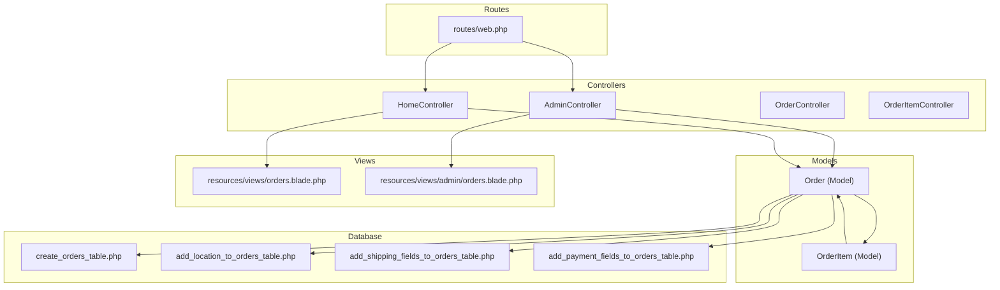
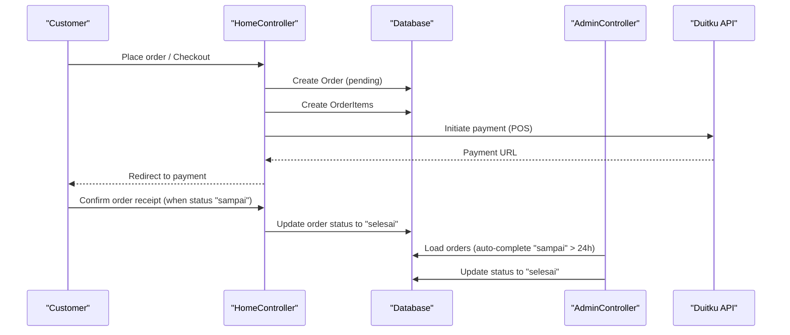
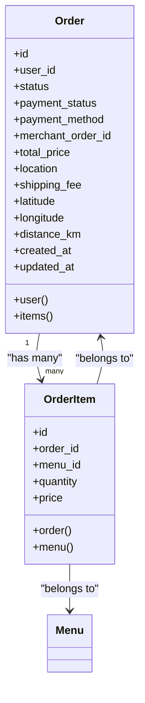
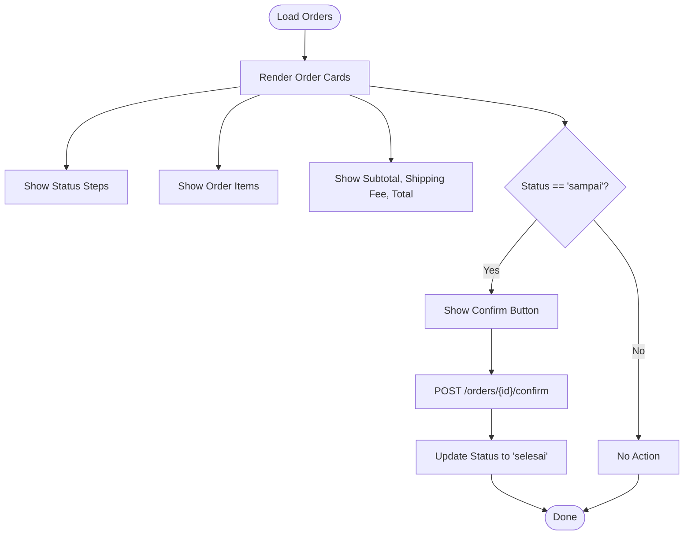
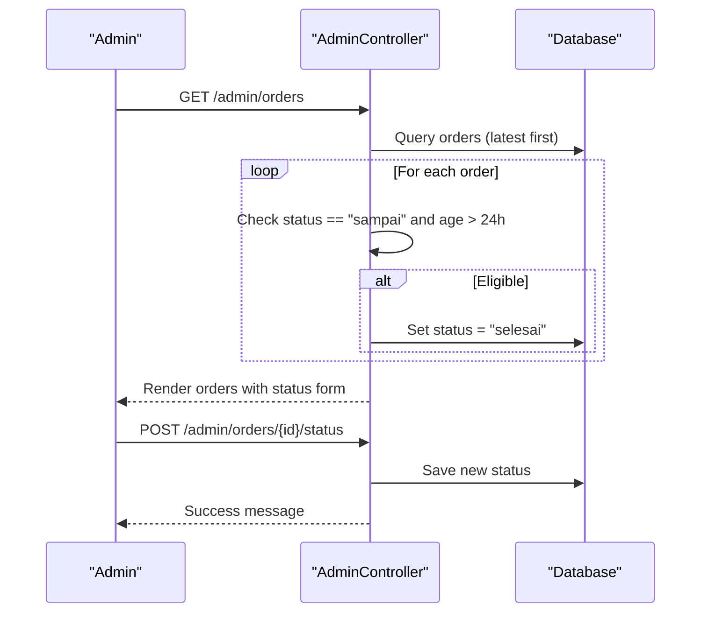
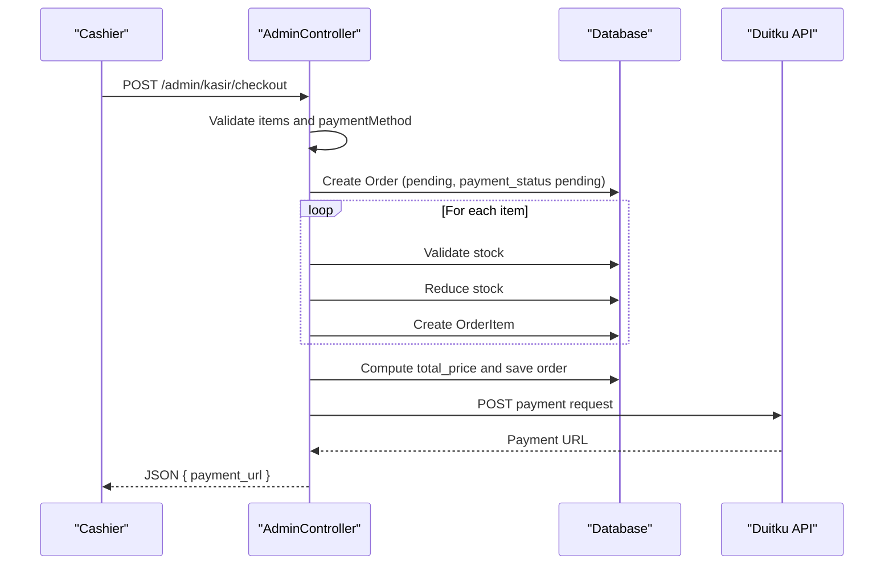
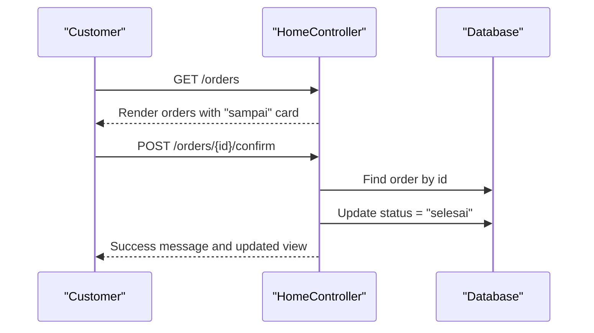
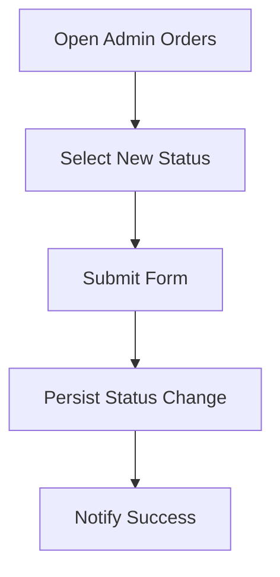
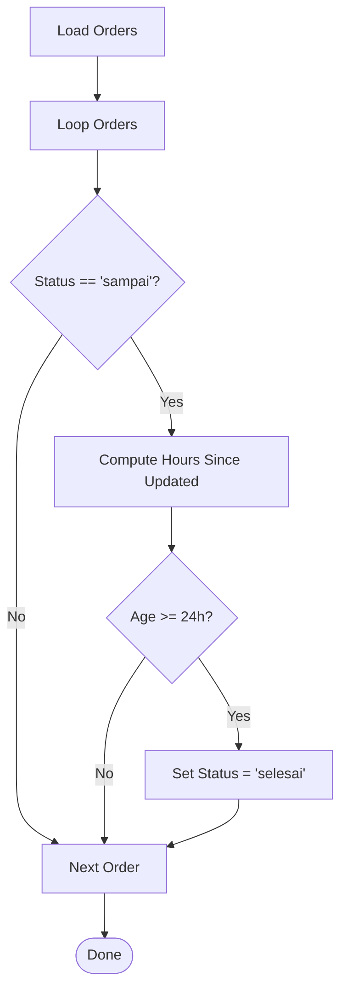
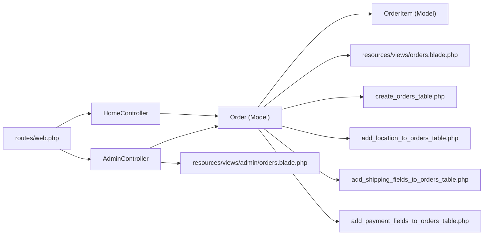

# Order Processing

<cite>
**Referenced Files in This Document**
- [OrderController.php](file://app/Http/Controllers/OrderController.php)
- [OrderItemController.php](file://app/Http/Controllers/OrderItemController.php)
- [AdminController.php](file://app/Http/Controllers/AdminController.php)
- [HomeController.php](file://app/Http/Controllers/HomeController.php)
- [Order.php](file://app/Models/Order.php)
- [OrderItem.php](file://app/Models/OrderItem.php)
- [web.php](file://routes/web.php)
- [orders.blade.php](file://resources/views/orders.blade.php)
- [orders.blade.php (admin)](file://resources/views/admin/orders.blade.php)
- [create_orders_table.php](file://database/migrations/2026_04_21_011703_create_orders_table.php)
- [add_location_to_orders_table.php](file://database/migrations/2026_04_27_022651_add_location_to_orders_table.php)
- [add_shipping_fields_to_orders_table.php](file://database/migrations/2026_05_18_020058_add_shipping_fields_to_orders_table.php)
- [add_payment_fields_to_orders_table.php](file://database/migrations/2026_05_24_000000_add_payment_fields_to_orders_table.php)
</cite>

## Table of Contents
1. [Introduction](#introduction)
2. [Project Structure](#project-structure)
3. [Core Components](#core-components)
4. [Architecture Overview](#architecture-overview)
5. [Detailed Component Analysis](#detailed-component-analysis)
6. [Dependency Analysis](#dependency-analysis)
7. [Performance Considerations](#performance-considerations)
8. [Troubleshooting Guide](#troubleshooting-guide)
9. [Conclusion](#conclusion)
10. [Appendices](#appendices)

## Introduction
This document explains the order processing and management functionality implemented in the application. It covers order listing, status tracking, order modification workflows, automatic completion for orders marked as "sampai" after 24 hours, manual status updates, order detail viewing, and the fulfillment pipeline. It also provides guidance for handling order exceptions, cancellation and refund procedures, order history management, managing peak order periods, prioritization, and customer communication during order processing.

## Project Structure
The order processing system spans controllers, models, Blade templates, and database migrations. Routes define endpoints for order creation, confirmation, invoice generation, and administrative order status updates.

**Diagram sources**
- [web.php](file://routes/web.php)
- [HomeController.php](file://app/Http/Controllers/HomeController.php)
- [AdminController.php](file://app/Http/Controllers/AdminController.php)
- [Order.php](file://app/Models/Order.php)
- [OrderItem.php](file://app/Models/OrderItem.php)
- [orders.blade.php](file://resources/views/orders.blade.php)
- [orders.blade.php (admin)](file://resources/views/admin/orders.blade.php)
- [create_orders_table.php](file://database/migrations/2026_04_21_011703_create_orders_table.php)
- [add_location_to_orders_table.php](file://database/migrations/2026_04_27_022651_add_location_to_orders_table.php)
- [add_shipping_fields_to_orders_table.php](file://database/migrations/2026_05_18_020058_add_shipping_fields_to_orders_table.php)
- [add_payment_fields_to_orders_table.php](file://database/migrations/2026_05_24_000000_add_payment_fields_to_orders_table.php)

**Section sources**
- [web.php](file://routes/web.php)
- [Order.php](file://app/Models/Order.php)
- [OrderItem.php](file://app/Models/OrderItem.php)
- [orders.blade.php](file://resources/views/orders.blade.php)
- [orders.blade.php (admin)](file://resources/views/admin/orders.blade.php)
- [create_orders_table.php](file://database/migrations/2026_04_21_011703_create_orders_table.php)
- [add_location_to_orders_table.php](file://database/migrations/2026_04_27_022651_add_location_to_orders_table.php)
- [add_shipping_fields_to_orders_table.php](file://database/migrations/2026_05_18_020058_add_shipping_fields_to_orders_table.php)
- [add_payment_fields_to_orders_table.php](file://database/migrations/2026_05_24_000000_add_payment_fields_to_orders_table.php)

## Core Components
- Order model encapsulates order metadata, payment fields, location, shipping fee, and geographic coordinates. It defines relationships to User and OrderItem.
- OrderItem model stores per-item details linked to a specific menu and order.
- HomeController handles customer-facing order workflows: placing orders, checkout, delivery preview, payment callbacks, order confirmation, and invoice display.
- AdminController manages administrative order listing, auto-completion of "sampai" orders older than 24 hours, and manual status updates.
- Blade templates render order lists and status tracking for customers and administrators, including interactive status forms and confirm actions.

Key capabilities:
- Order listing and status tracking for customers and admins
- Manual status transitions ("dibuat", "diantar", "sampai", "selesai")
- Automatic completion after 24 hours when status is "sampai"
- Order detail viewing with items, subtotal, shipping fee, and payment summary
- POS checkout flow with stock validation and payment initiation

**Section sources**
- [Order.php](file://app/Models/Order.php)
- [OrderItem.php](file://app/Models/OrderItem.php)
- [HomeController.php](file://app/Http/Controllers/HomeController.php)
- [AdminController.php](file://app/Http/Controllers/AdminController.php)
- [orders.blade.php](file://resources/views/orders.blade.php)
- [orders.blade.php (admin)](file://resources/views/admin/orders.blade.php)

## Architecture Overview
The order lifecycle is driven by user actions (place order, confirm receipt) and administrative actions (status updates). Payment integration is handled via Duitku for POS transactions.

**Diagram sources**
- [HomeController.php](file://app/Http/Controllers/HomeController.php)
- [AdminController.php](file://app/Http/Controllers/AdminController.php)
- [web.php](file://routes/web.php)

## Detailed Component Analysis

### Order Model and Relationships
The Order model defines fillable attributes for order metadata, payment, and delivery fields, and establishes relationships to User and OrderItem. The OrderItem model links to Menu and Order.

**Diagram sources**
- [Order.php](file://app/Models/Order.php)
- [OrderItem.php](file://app/Models/OrderItem.php)

**Section sources**
- [Order.php](file://app/Models/Order.php)
- [OrderItem.php](file://app/Models/OrderItem.php)

### Customer Order Tracking View
The customer view renders order history with progress steps, payment summary, shipping fee, and a confirmation action when appropriate. It displays order items, subtotal, and total price, and includes an invoice link.

**Diagram sources**
- [orders.blade.php](file://resources/views/orders.blade.php)
- [web.php](file://routes/web.php)

**Section sources**
- [orders.blade.php](file://resources/views/orders.blade.php)
- [web.php](file://routes/web.php)

### Administrative Order Management
Administrators can view all orders, manually update statuses, and trigger automatic completion for orders marked as "sampai" that are older than 24 hours.

**Diagram sources**
- [AdminController.php](file://app/Http/Controllers/AdminController.php)
- [orders.blade.php (admin)](file://resources/views/admin/orders.blade.php)
- [web.php](file://routes/web.php)

**Section sources**
- [AdminController.php](file://app/Http/Controllers/AdminController.php)
- [orders.blade.php (admin)](file://resources/views/admin/orders.blade.php)
- [web.php](file://routes/web.php)

### POS Checkout and Payment Workflow
The POS checkout endpoint validates items, checks stock availability, creates the order and order items, computes totals, and initiates payment via Duitku. It returns a payment URL for redirection.

**Diagram sources**
- [AdminController.php](file://app/Http/Controllers/AdminController.php)
- [web.php](file://routes/web.php)

**Section sources**
- [AdminController.php](file://app/Http/Controllers/AdminController.php)
- [web.php](file://routes/web.php)

### Order Confirmation Flow
When an order reaches "sampai", the customer can confirm receipt, which transitions the order to "selesai".

**Diagram sources**
- [HomeController.php](file://app/Http/Controllers/HomeController.php)
- [web.php](file://routes/web.php)

**Section sources**
- [HomeController.php](file://app/Http/Controllers/HomeController.php)
- [web.php](file://routes/web.php)

### Order Modification Workflows
Manual status updates are supported for non-pending orders. The admin view exposes a dropdown to change status among ("dibuat", "diantar", "sampai", "selesai").

**Diagram sources**
- [orders.blade.php (admin)](file://resources/views/admin/orders.blade.php)
- [web.php](file://routes/web.php)

**Section sources**
- [orders.blade.php (admin)](file://resources/views/admin/orders.blade.php)
- [web.php](file://routes/web.php)

### Automatic Completion After 24 Hours
Orders with status "sampai" are automatically set to "selesai" if the time elapsed since last update exceeds 24 hours.

**Diagram sources**
- [AdminController.php](file://app/Http/Controllers/AdminController.php)

**Section sources**
- [AdminController.php](file://app/Http/Controllers/AdminController.php)

### Order Detail Viewing
Both customer and admin views present order details including items, quantities, prices, subtotal, shipping fee, and payment summary. The admin view additionally shows a status progression and editable status form.

**Section sources**
- [orders.blade.php](file://resources/views/orders.blade.php)
- [orders.blade.php (admin)](file://resources/views/admin/orders.blade.php)

### Practical Examples

- Processing a customer order via POS:
  - Use the POS checkout endpoint to validate items, reduce stock, create order and items, compute total, and initiate payment via Duitku. The response provides a payment URL for redirection.
  - Reference: [AdminController.php](file://app/Http/Controllers/AdminController.php), [web.php](file://routes/web.php)

- Updating order states through the fulfillment pipeline:
  - Transition order status from "dibuat" to "diantar" to "sampai" to "selesai". Administrators can manually update status; "sampai" orders older than 24 hours auto-complete to "selesai".
  - References: [orders.blade.php (admin)](file://resources/views/admin/orders.blade.php), [AdminController.php](file://app/Http/Controllers/AdminController.php), [web.php](file://routes/web.php)

- Handling order exceptions:
  - Stock validation failures during POS checkout return an error indicating insufficient stock and remaining quantity.
  - References: [AdminController.php](file://app/Http/Controllers/AdminController.php)

- Managing order cancellation and refunds:
  - The current implementation does not expose explicit cancellation or refund endpoints. To support cancellations, add a cancellation endpoint and refund logic aligned with payment provider capabilities (e.g., Duitku). Define cancellation states and refund workflows in controllers and views.
  - References: [web.php](file://routes/web.php), [HomeController.php](file://app/Http/Controllers/HomeController.php), [AdminController.php](file://app/Http/Controllers/AdminController.php)

- Order history management:
  - Customers can view historical orders with status progression and payment summaries. Administrators can review all orders and apply bulk status updates.
  - References: [orders.blade.php](file://resources/views/orders.blade.php), [orders.blade.php (admin)](file://resources/views/admin/orders.blade.php)

- Managing peak order periods and prioritization:
  - Use the admin order list to prioritize "dibuat" orders first, then "diantar", and finally "sampai" for completion. Monitor ETA and distance metrics to optimize delivery routes.
  - References: [orders.blade.php (admin)](file://resources/views/admin/orders.blade.php), [Order.php](file://app/Models/Order.php)

- Customer communication during order processing:
  - Display contextual messages based on status (preparation, in transit, arrival, completion). Encourage confirmation upon arrival to finalize the process.
  - References: [orders.blade.php](file://resources/views/orders.blade.php)

## Dependency Analysis
The order system depends on:
- Controllers for request handling and orchestration
- Models for persistence and relationships
- Views for rendering order lists and details
- Routes for endpoint exposure
- Database migrations for schema evolution

**Diagram sources**
- [web.php](file://routes/web.php)
- [HomeController.php](file://app/Http/Controllers/HomeController.php)
- [AdminController.php](file://app/Http/Controllers/AdminController.php)
- [Order.php](file://app/Models/Order.php)
- [OrderItem.php](file://app/Models/OrderItem.php)
- [orders.blade.php](file://resources/views/orders.blade.php)
- [orders.blade.php (admin)](file://resources/views/admin/orders.blade.php)
- [create_orders_table.php](file://database/migrations/2026_04_21_011703_create_orders_table.php)
- [add_location_to_orders_table.php](file://database/migrations/2026_04_27_022651_add_location_to_orders_table.php)
- [add_shipping_fields_to_orders_table.php](file://database/migrations/2026_05_18_020058_add_shipping_fields_to_orders_table.php)
- [add_payment_fields_to_orders_table.php](file://database/migrations/2026_05_24_000000_add_payment_fields_to_orders_table.php)

**Section sources**
- [web.php](file://routes/web.php)
- [Order.php](file://app/Models/Order.php)
- [OrderItem.php](file://app/Models/OrderItem.php)
- [orders.blade.php](file://resources/views/orders.blade.php)
- [orders.blade.php (admin)](file://resources/views/admin/orders.blade.php)
- [create_orders_table.php](file://database/migrations/2026_04_21_011703_create_orders_table.php)
- [add_location_to_orders_table.php](file://database/migrations/2026_04_27_022651_add_location_to_orders_table.php)
- [add_shipping_fields_to_orders_table.php](file://database/migrations/2026_05_18_020058_add_shipping_fields_to_orders_table.php)
- [add_payment_fields_to_orders_table.php](file://database/migrations/2026_05_24_000000_add_payment_fields_to_orders_table.php)

## Performance Considerations
- Minimize N+1 queries by eager-loading relationships (already using with('user','items.menu') in admin orders).
- Batch updates for auto-completion to avoid excessive writes.
- Cache frequently accessed order counts and revenue aggregates for dashboards.
- Optimize frontend rendering by limiting visible order cards and deferring heavy computations.

## Troubleshooting Guide
- POS checkout fails due to missing Duitku configuration:
  - Ensure merchant code and API key are configured; otherwise, the system returns a configuration error message.
  - Reference: [AdminController.php](file://app/Http/Controllers/AdminController.php)

- Insufficient stock during POS checkout:
  - The system validates stock and returns an error with the remaining available quantity.
  - Reference: [AdminController.php](file://app/Http/Controllers/AdminController.php)

- Order confirmation not working:
  - Verify the route exists and the order ID is valid; ensure the order status is "sampai" before confirming.
  - References: [web.php](file://routes/web.php), [orders.blade.php](file://resources/views/orders.blade.php)

- Automatic completion not triggering:
  - Confirm that orders remain in "sampai" status and that sufficient time has passed (>24h); the admin orders page performs the auto-completion on load.
  - Reference: [AdminController.php](file://app/Http/Controllers/AdminController.php)

**Section sources**
- [AdminController.php](file://app/Http/Controllers/AdminController.php)
- [web.php](file://routes/web.php)
- [orders.blade.php](file://resources/views/orders.blade.php)

## Conclusion
The order processing system provides a clear customer and administrative experience with status tracking, manual updates, and automatic completion for late arrivals. Enhancements such as explicit cancellation and refund endpoints would further strengthen the system’s robustness and customer service capabilities.

## Appendices

### Order Status Lifecycle
- pending: Cart or initial state
- dibuat: Received and being prepared
- diantar: In transit
- sampai: Arrived; awaiting customer confirmation
- selesai: Completed

### Database Schema Highlights
- Orders table includes user foreign key, status, total price, earned points, timestamps, and optional location and shipping fields.
- Additional columns for payment status, payment method, and merchant order ID were added later.
- Geographic coordinates and distance are stored for delivery tracking.

**Section sources**
- [create_orders_table.php](file://database/migrations/2026_04_21_011703_create_orders_table.php)
- [add_location_to_orders_table.php](file://database/migrations/2026_04_27_022651_add_location_to_orders_table.php)
- [add_shipping_fields_to_orders_table.php](file://database/migrations/2026_05_18_020058_add_shipping_fields_to_orders_table.php)
- [add_payment_fields_to_orders_table.php](file://database/migrations/2026_05_24_000000_add_payment_fields_to_orders_table.php)