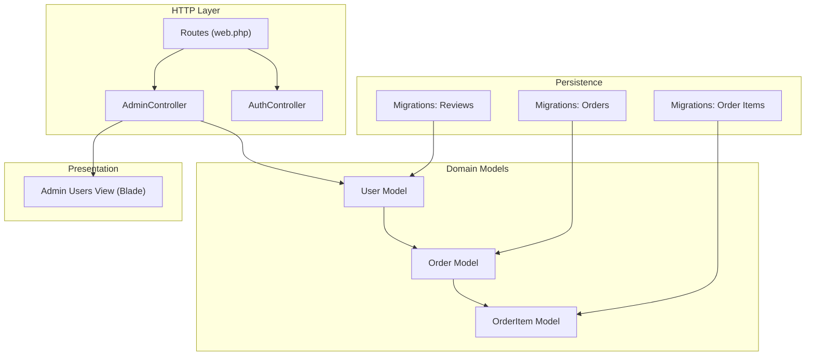
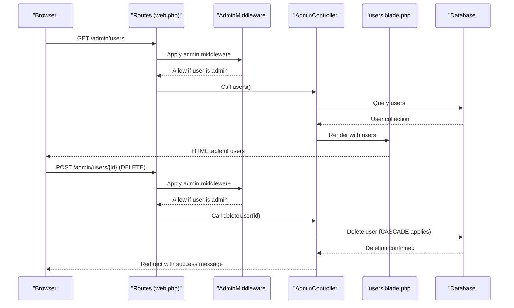
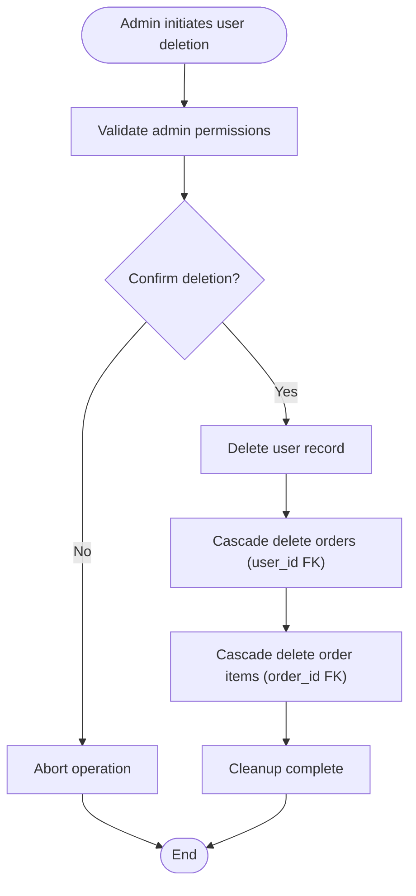
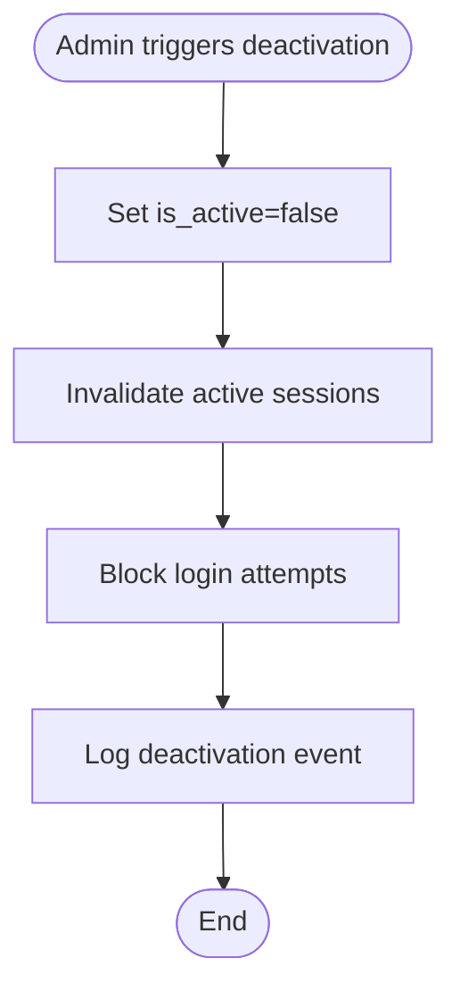
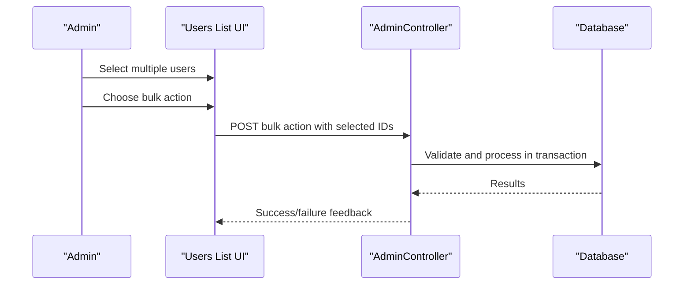
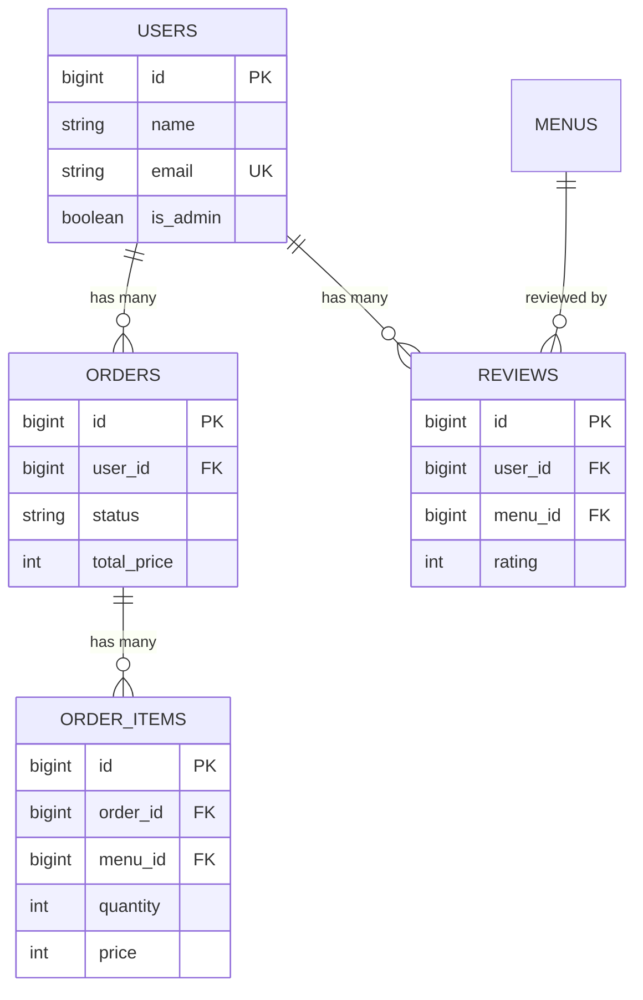
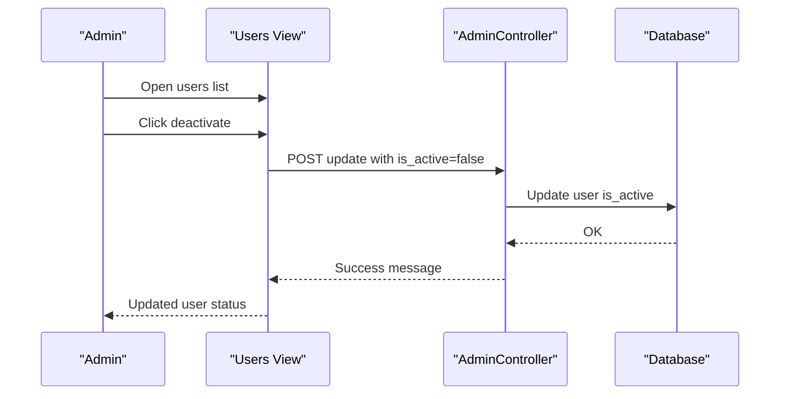
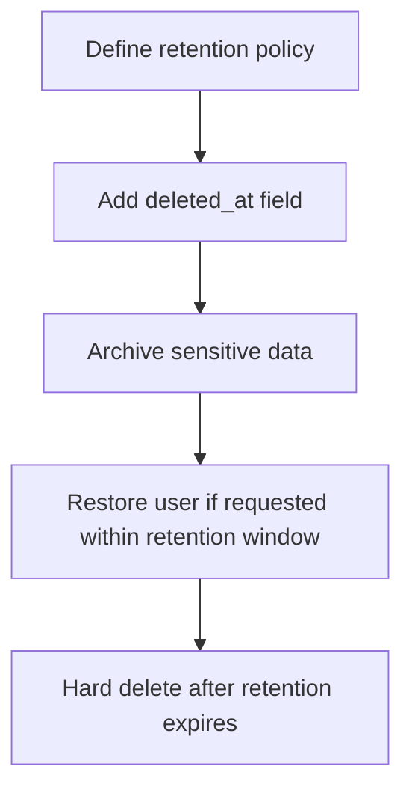
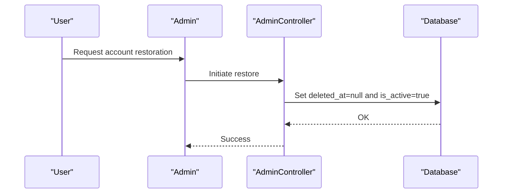
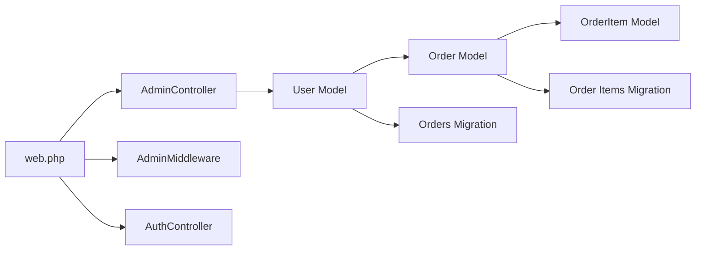

# Account Administration

<cite>
**Referenced Files in This Document**
- [AdminController.php](file://app/Http/Controllers/AdminController.php)
- [web.php](file://routes/web.php)
- [users.blade.php](file://resources/views/admin/users.blade.php)
- [User.php](file://app/Models/User.php)
- [Order.php](file://app/Models/Order.php)
- [OrderItem.php](file://app/Models/OrderItem.php)
- [create_orders_table.php](file://database/migrations/2026_04_21_011703_create_orders_table.php)
- [create_order_items_table.php](file://database/migrations/2026_04_21_011704_create_order_items_table.php)
- [create_reviews_table.php](file://database/migrations/2026_05_15_072240_create_reviews_table.php)
- [cleanup_unused_columns.php](file://database/migrations/2026_05_15_073354_cleanup_unused_columns.php)
- [AdminMiddleware.php](file://app/Http/Middleware/AdminMiddleware.php)
- [AuthController.php](file://app/Http/Controllers/AuthController.php)
</cite>

## Table of Contents
1. [Introduction](#introduction)
2. [Project Structure](#project-structure)
3. [Core Components](#core-components)
4. [Architecture Overview](#architecture-overview)
5. [Detailed Component Analysis](#detailed-component-analysis)
6. [Dependency Analysis](#dependency-analysis)
7. [Performance Considerations](#performance-considerations)
8. [Troubleshooting Guide](#troubleshooting-guide)
9. [Conclusion](#conclusion)
10. [Appendices](#appendices)

## Introduction
This document provides comprehensive guidance for user account administration operations within the application. It covers user deletion, account deactivation, bulk management capabilities, and the data handling implications during user deletion, including cascade effects on orders, order items, and associated records. It also outlines practical workflows for account termination, data retention considerations, user record cleanup, recovery options, soft deletion considerations, compliance with data protection regulations, handling user complaints and disputes, and emergency access scenarios.

## Project Structure
The account administration functionality is centered around the AdminController, which exposes administrative routes for managing users, orders, menus, and cashier operations. The User model defines the user entity and its relationship to orders. Database migrations define the schema and cascade behaviors for orders and order items. Blade templates render the administrative user management interface.

**Diagram sources**
- [web.php:52-70](file://routes/web.php#L52-L70)
- [AdminController.php:10-95](file://app/Http/Controllers/AdminController.php#L10-L95)
- [User.php:50-54](file://app/Models/User.php#L50-L54)
- [Order.php:26-34](file://app/Models/Order.php#L26-L34)
- [OrderItem.php:19-27](file://app/Models/OrderItem.php#L19-L27)
- [create_orders_table.php:14-21](file://database/migrations/2026_04_21_011703_create_orders_table.php#L14-L21)
- [create_order_items_table.php:14-21](file://database/migrations/2026_04_21_011704_create_order_items_table.php#L14-L21)
- [create_reviews_table.php:14-21](file://database/migrations/2026_05_15_072240_create_reviews_table.php#L14-L21)
- [users.blade.php:1-57](file://resources/views/admin/users.blade.php#L1-L57)

**Section sources**
- [web.php:52-70](file://routes/web.php#L52-L70)
- [AdminController.php:77-95](file://app/Http/Controllers/AdminController.php#L77-L95)
- [users.blade.php:1-57](file://resources/views/admin/users.blade.php#L1-L57)

## Core Components
- AdminController: Provides administrative endpoints for listing users, updating roles, and deleting users. It also manages orders and cashier checkout.
- User Model: Defines the user entity and its relationship to orders.
- Order and OrderItem Models: Define order records and their items, with foreign keys and cascade behaviors.
- Migrations: Establish schema and cascade rules for orders and order items.
- Admin Middleware: Enforces admin-only access to administrative routes.
- Authentication Controller: Handles login/logout flows; supports admin redirection post-login.

Key responsibilities:
- User management: Listing, role updates, and deletion via administrative routes.
- Data integrity: Cascade deletion ensures orders and order items are removed when a user is deleted.
- Access control: Admin middleware restricts access to administrative areas.

**Section sources**
- [AdminController.php:77-95](file://app/Http/Controllers/AdminController.php#L77-L95)
- [User.php:50-54](file://app/Models/User.php#L50-L54)
- [Order.php:26-34](file://app/Models/Order.php#L26-L34)
- [OrderItem.php:19-27](file://app/Models/OrderItem.php#L19-L27)
- [create_orders_table.php:16](file://database/migrations/2026_04_21_011703_create_orders_table.php#L16)
- [create_order_items_table.php:16](file://database/migrations/2026_04_21_011704_create_order_items_table.php#L16)
- [AdminMiddleware.php:17-24](file://app/Http/Middleware/AdminMiddleware.php#L17-L24)
- [AuthController.php:31-39](file://app/Http/Controllers/AuthController.php#L31-L39)

## Architecture Overview
The administrative user management flow integrates routing, controller actions, middleware enforcement, model relationships, and database cascade rules.

**Diagram sources**
- [web.php:60-62](file://routes/web.php#L60-L62)
- [AdminMiddleware.php:17-24](file://app/Http/Middleware/AdminMiddleware.php#L17-L24)
- [AdminController.php:77-95](file://app/Http/Controllers/AdminController.php#L77-L95)
- [users.blade.php:33-48](file://resources/views/admin/users.blade.php#L33-L48)

## Detailed Component Analysis

### User Deletion Process
- Endpoint: DELETE /admin/users/{id}
- Controller action: AdminController@deleteUser
- Behavior: Deletes the user record immediately. Due to the cascade rule on the user_id foreign key in the orders table, all orders associated with the user are automatically deleted. Order items referencing those orders are also deleted due to the cascade rule on order_id in the order_items table.
- UI trigger: The administrative users page includes a delete form per user row.

**Diagram sources**
- [web.php:62](file://routes/web.php#L62)
- [AdminController.php:91-95](file://app/Http/Controllers/AdminController.php#L91-L95)
- [create_orders_table.php:16](file://database/migrations/2026_04_21_011703_create_orders_table.php#L16)
- [create_order_items_table.php:16](file://database/migrations/2026_04_21_011704_create_order_items_table.php#L16)

**Section sources**
- [web.php:62](file://routes/web.php#L62)
- [AdminController.php:91-95](file://app/Http/Controllers/AdminController.php#L91-L95)
- [users.blade.php:42-48](file://resources/views/admin/users.blade.php#L42-L48)
- [create_orders_table.php:16](file://database/migrations/2026_04_21_011703_create_orders_table.php#L16)
- [create_order_items_table.php:16](file://database/migrations/2026_04_21_011704_create_order_items_table.php#L16)

### Account Deactivation Procedures
- Current implementation: There is no dedicated deactivation endpoint or toggle in the provided code. The existing user update action toggles the is_admin flag but does not deactivate regular users.
- Recommended approach: Add a boolean field (e.g., is_active) to the users table and expose an update endpoint to toggle it. On deactivation, invalidate active sessions and prevent login attempts. Ensure deactivation is logged for audit trails.

[No sources needed since this diagram shows conceptual workflow, not actual code structure]

**Section sources**
- [AdminController.php:83-89](file://app/Http/Controllers/AdminController.php#L83-L89)
- [User.php:19-25](file://app/Models/User.php#L19-L25)

### Bulk Account Management Features
- Current implementation: No bulk operations are present in the provided code. The administrative user listing allows individual updates and deletions.
- Recommended approach: Introduce bulk actions (select multiple users, choose action: activate/deactivate/delete) with server-side validation and transactional processing to maintain data consistency.

[No sources needed since this diagram shows conceptual workflow, not actual code structure]

### Data Handling During User Deletion
- Orders: Deleted due to cascade on user_id in the orders table.
- Order Items: Deleted due to cascade on order_id in the order_items table.
- Reviews: Previously existed with cascade rules on user_id and menu_id; the cleanup migration removed the reviews table, so no review records remain to be cleaned up.

**Diagram sources**
- [create_orders_table.php:14-21](file://database/migrations/2026_04_21_011703_create_orders_table.php#L14-L21)
- [create_order_items_table.php:14-21](file://database/migrations/2026_04_21_011704_create_order_items_table.php#L14-L21)
- [create_reviews_table.php:14-21](file://database/migrations/2026_05_15_072240_create_reviews_table.php#L14-L21)
- [cleanup_unused_columns.php:27](file://database/migrations/2026_05_15_073354_cleanup_unused_columns.php#L27)

**Section sources**
- [create_orders_table.php:16](file://database/migrations/2026_04_21_011703_create_orders_table.php#L16)
- [create_order_items_table.php:16](file://database/migrations/2026_04_21_011704_create_order_items_table.php#L16)
- [cleanup_unused_columns.php:27](file://database/migrations/2026_05_15_073354_cleanup_unused_columns.php#L27)

### Practical Examples of Account Termination Workflows
- Immediate termination (hard delete):
  - Admin navigates to the users list, selects the target user, and submits the delete action. The user and all related orders and order items are removed from the database.
- Deactivation (recommended future enhancement):
  - Admin toggles the is_active flag for the user. The system invalidates sessions and blocks login attempts while retaining user data for potential restoration.

[No sources needed since this diagram shows conceptual workflow, not actual code structure]

### Data Retention Policies and User Record Cleanup
- Retention policy: The current schema does not include a retention period or soft-deleted timestamps. After deletion, user data is permanently removed along with orders and order items due to cascade rules.
- Cleanup recommendation: Implement a soft-delete pattern with a deleted_at timestamp and a restore endpoint. Archive sensitive data (e.g., personal identifiers) separately according to privacy requirements.

[No sources needed since this diagram shows conceptual workflow, not actual code structure]

### Account Recovery Options and Soft Deletion Considerations
- Recovery: With soft deletion, admins can restore users within the retention period. Logs should track who performed the action and when.
- Compliance: Ensure GDPR-style rights (access, rectification, erasure, portability) are supported. Provide mechanisms for users to request data export or erasure.

[No sources needed since this diagram shows conceptual workflow, not actual code structure]

### Compliance with Data Protection Regulations
- Consent and transparency: Maintain logs of user data processing and deletions.
- Right to erasure: Provide a mechanism to fully remove user data upon request, including cascaded records.
- Data minimization: Avoid storing unnecessary personal data beyond operational needs.

[No sources needed since this section provides general guidance]

### Handling User Complaints, Disputes, and Emergency Access Scenarios
- Complaints/disputes: Maintain audit logs of administrative actions. Provide a process for users to escalate concerns and for admins to review and justify actions.
- Emergency access: Implement a two-factor approval process for emergency restores or data access requests. Limit emergency access to a predefined group with strict logging.

[No sources needed since this section provides general guidance]

## Dependency Analysis
Administrative user management depends on routing, middleware, controller actions, models, and database cascade rules.

**Diagram sources**
- [web.php:52-70](file://routes/web.php#L52-L70)
- [AdminController.php:10-95](file://app/Http/Controllers/AdminController.php#L10-L95)
- [User.php:50-54](file://app/Models/User.php#L50-L54)
- [Order.php:26-34](file://app/Models/Order.php#L26-L34)
- [OrderItem.php:19-27](file://app/Models/OrderItem.php#L19-L27)
- [create_orders_table.php:14-21](file://database/migrations/2026_04_21_011703_create_orders_table.php#L14-L21)
- [create_order_items_table.php:14-21](file://database/migrations/2026_04_21_011704_create_order_items_table.php#L14-L21)
- [AdminMiddleware.php:17-24](file://app/Http/Middleware/AdminMiddleware.php#L17-L24)
- [AuthController.php:31-39](file://app/Http/Controllers/AuthController.php#L31-L39)

**Section sources**
- [web.php:52-70](file://routes/web.php#L52-L70)
- [AdminController.php:10-95](file://app/Http/Controllers/AdminController.php#L10-L95)
- [User.php:50-54](file://app/Models/User.php#L50-L54)
- [Order.php:26-34](file://app/Models/Order.php#L26-L34)
- [OrderItem.php:19-27](file://app/Models/OrderItem.php#L19-L27)
- [create_orders_table.php:14-21](file://database/migrations/2026_04_21_011703_create_orders_table.php#L14-L21)
- [create_order_items_table.php:14-21](file://database/migrations/2026_04_21_011704_create_order_items_table.php#L14-L21)
- [AdminMiddleware.php:17-24](file://app/Http/Middleware/AdminMiddleware.php#L17-L24)
- [AuthController.php:31-39](file://app/Http/Controllers/AuthController.php#L31-L39)

## Performance Considerations
- Cascading deletes: Deleting a user triggers cascade deletions on orders and order items. For users with substantial history, consider batching or background jobs to avoid long-running transactions.
- Indexes: Ensure foreign key columns (user_id, order_id) are indexed to optimize cascade operations.
- Audit logging: Store administrative actions in a separate audit table to minimize impact on primary user/order tables.

[No sources needed since this section provides general guidance]

## Troubleshooting Guide
- Access denied: If a non-admin attempts to access administrative routes, the AdminMiddleware returns a 403 error. Verify the user’s is_admin flag and session state.
- Login redirects: Successful admin login redirects to the admin dashboard; otherwise, credentials are rejected.
- Deletion confirmation: Ensure the delete form is submitted with the proper CSRF token and method override.

**Section sources**
- [AdminMiddleware.php:19-21](file://app/Http/Middleware/AdminMiddleware.php#L19-L21)
- [AuthController.php:31-43](file://app/Http/Controllers/AuthController.php#L31-L43)
- [users.blade.php:42-48](file://resources/views/admin/users.blade.php#L42-L48)

## Conclusion
The current implementation supports immediate user deletion with automatic cascade removal of orders and order items. To enhance compliance and operational flexibility, introduce deactivation toggles, soft deletion with retention windows, bulk management features, and robust audit logging. These improvements will support data protection requirements, enable recovery options, and streamline administrative workflows.

## Appendices
- Administrative routes for users:
  - GET /admin/users
  - POST /admin/users/{id} (role update)
  - DELETE /admin/users/{id} (deletion)
- Middleware enforcement: AdminMiddleware restricts access to administrative routes.

**Section sources**
- [web.php:60-62](file://routes/web.php#L60-L62)
- [AdminMiddleware.php:17-24](file://app/Http/Middleware/AdminMiddleware.php#L17-L24)