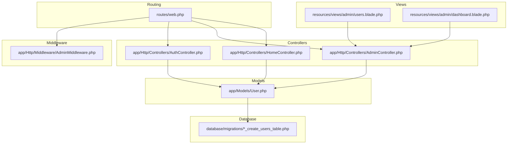
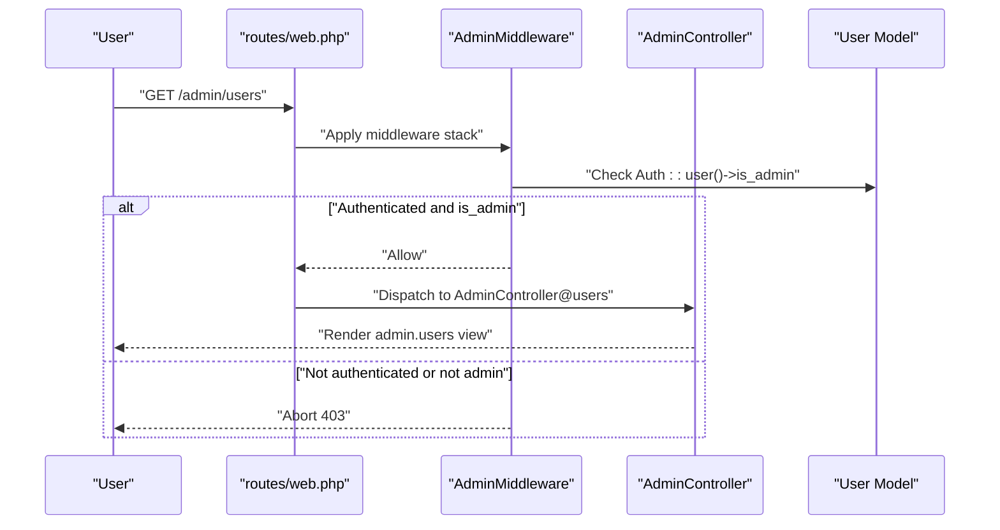
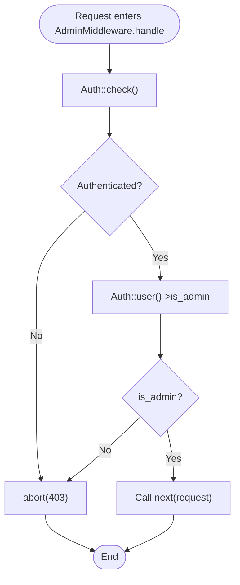
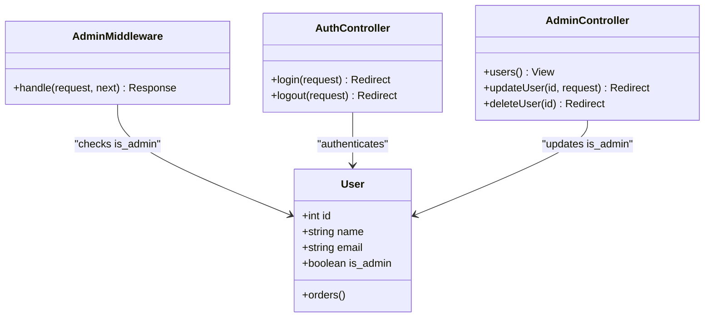
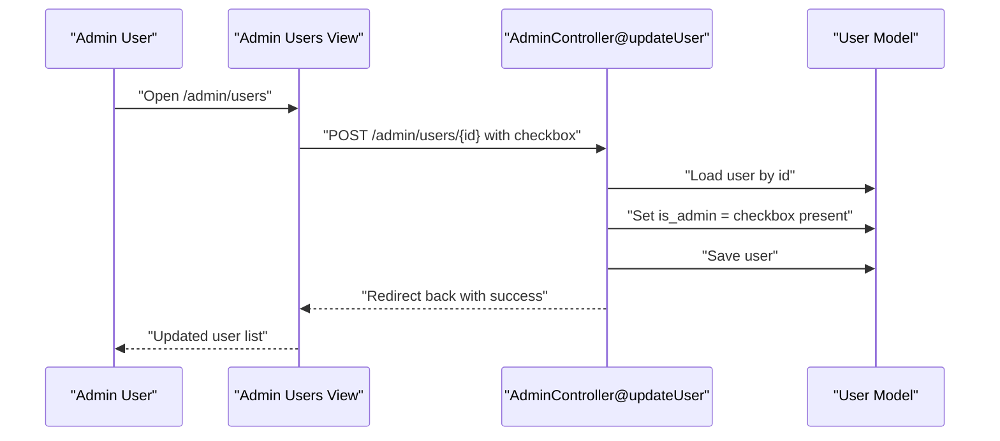
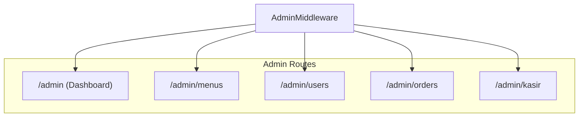
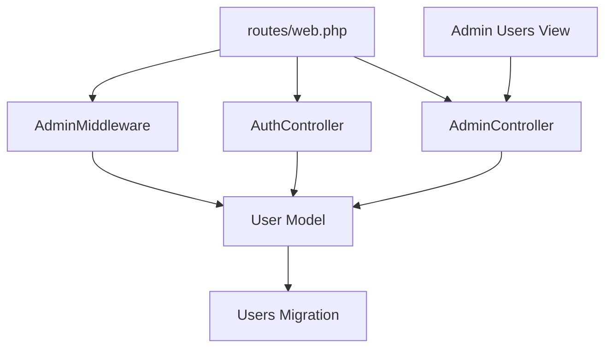

# Role Assignment & Permissions

<cite>
**Referenced Files in This Document**
- [User.php](file://app/Models/User.php)
- [AdminMiddleware.php](file://app/Http/Middleware/AdminMiddleware.php)
- [AdminController.php](file://app/Http/Controllers/AdminController.php)
- [AuthController.php](file://app/Http/Controllers/AuthController.php)
- [HomeController.php](file://app/Http/Controllers/HomeController.php)
- [web.php](file://routes/web.php)
- [create_users_table.php](file://database/migrations/0001_01_01_000000_create_users_table.php)
- [users.blade.php](file://resources/views/admin/users.blade.php)
- [dashboard.blade.php](file://resources/views/admin/dashboard.blade.php)
- [auth.php](file://config/auth.php)
</cite>

## Table of Contents
1. [Introduction](#introduction)
2. [Project Structure](#project-structure)
3. [Core Components](#core-components)
4. [Architecture Overview](#architecture-overview)
5. [Detailed Component Analysis](#detailed-component-analysis)
6. [Dependency Analysis](#dependency-analysis)
7. [Performance Considerations](#performance-considerations)
8. [Troubleshooting Guide](#troubleshooting-guide)
9. [Conclusion](#conclusion)

## Introduction
This document explains the role assignment and permission management system in the application. It focuses on the admin privilege toggle functionality, role-based access control (RBAC), and the AdminMiddleware protection mechanism. It also covers how to convert regular users to administrators and vice versa, the security implications of role changes, and best practices for managing roles securely.

## Project Structure
The role and permission system spans several layers:
- Model layer: User model with an `is_admin` flag persisted in the database
- Middleware layer: AdminMiddleware enforcing admin-only access
- Controller layer: AdminController exposing admin-only routes and actions
- Routing layer: Routes grouped under a middleware stack that requires both authentication and admin privileges
- View layer: Admin UI for viewing users and toggling admin roles
- Authentication layer: Login flow that redirects admins to the admin dashboard

**Diagram sources**
- [web.php:52-70](file://routes/web.php#L52-L70)
- [AuthController.php:17-44](file://app/Http/Controllers/AuthController.php#L17-L44)
- [AdminController.php:77-89](file://app/Http/Controllers/AdminController.php#L77-L89)
- [HomeController.php:459-468](file://app/Http/Controllers/HomeController.php#L459-L468)
- [AdminMiddleware.php:17-24](file://app/Http/Middleware/AdminMiddleware.php#L17-L24)
- [User.php:19-25](file://app/Models/User.php#L19-L25)
- [users.blade.php:34-41](file://resources/views/admin/users.blade.php#L34-L41)
- [dashboard.blade.php:1-74](file://resources/views/admin/dashboard.blade.php#L1-L74)
- [create_users_table.php:21](file://database/migrations/0001_01_01_000000_create_users_table.php#L21)

**Section sources**
- [web.php:52-70](file://routes/web.php#L52-L70)
- [User.php:19-25](file://app/Models/User.php#L19-L25)
- [create_users_table.php:21](file://database/migrations/0001_01_01_000000_create_users_table.php#L21)

## Core Components
- User model: Defines the `is_admin` attribute and its presence among fillable fields, enabling role assignment persistence.
- AdminMiddleware: Enforces admin-only access by checking authentication and the `is_admin` flag.
- AdminController: Provides admin-only routes and actions, including user management and role toggling.
- AuthController: Handles login/logout and redirects authenticated users to appropriate dashboards, including admins.
- Routes: Group admin routes under the `auth` and `AdminMiddleware` middleware stacks.
- Views: Admin UI for listing users and toggling admin privileges.

Key implementation references:
- User model fillable fields include `is_admin`: [User.php:19-25](file://app/Models/User.php#L19-L25)
- AdminMiddleware checks `Auth::check()` and `Auth::user()->is_admin`: [AdminMiddleware.php:17-24](file://app/Http/Middleware/AdminMiddleware.php#L17-L24)
- AdminController user update toggles `is_admin`: [AdminController.php:83-89](file://app/Http/Controllers/AdminController.php#L83-L89)
- Routes group admin routes with middleware stack: [web.php:52-70](file://routes/web.php#L52-L70)
- Login redirect logic considers admin status: [AuthController.php:31-38](file://app/Http/Controllers/AuthController.php#L31-L38)

**Section sources**
- [User.php:19-25](file://app/Models/User.php#L19-L25)
- [AdminMiddleware.php:17-24](file://app/Http/Middleware/AdminMiddleware.php#L17-L24)
- [AdminController.php:83-89](file://app/Http/Controllers/AdminController.php#L83-L89)
- [web.php:52-70](file://routes/web.php#L52-L70)
- [AuthController.php:31-38](file://app/Http/Controllers/AuthController.php#L31-L38)

## Architecture Overview
The RBAC architecture is enforced through middleware and route grouping. Requests to admin routes pass through the `auth` guard and `AdminMiddleware`. The middleware checks if the current user is authenticated and has the `is_admin` flag set. If not, the request is aborted with a 403 error. Successful requests reach the AdminController actions.

**Diagram sources**
- [web.php:52-70](file://routes/web.php#L52-L70)
- [AdminMiddleware.php:17-24](file://app/Http/Middleware/AdminMiddleware.php#L17-L24)
- [AdminController.php:77-81](file://app/Http/Controllers/AdminController.php#L77-L81)
- [User.php:19-25](file://app/Models/User.php#L19-L25)

## Detailed Component Analysis

### AdminMiddleware Implementation
AdminMiddleware ensures that only authenticated users with `is_admin` set can access admin routes. It performs two checks:
- Authentication: `Auth::check()`
- Authorization: `Auth::user()->is_admin`

If either fails, the request is aborted with a 403 error and a localized message.

Security implications:
- Prevents unauthorized access to admin panels and sensitive operations.
- Centralized enforcement reduces risk of bypassing admin-only logic.

**Diagram sources**
- [AdminMiddleware.php:17-24](file://app/Http/Middleware/AdminMiddleware.php#L17-L24)

**Section sources**
- [AdminMiddleware.php:17-24](file://app/Http/Middleware/AdminMiddleware.php#L17-L24)

### Role-Based Access Control and Permission Hierarchy
The application implements a minimal RBAC model:
- Role: `is_admin` boolean flag on the User model
- Permission: Implicitly derived from role membership
- Hierarchy: Single-tier admin role; no granular permissions beyond admin/non-admin

Operational behavior:
- Users with `is_admin = true` gain access to admin routes.
- Admins can manage users, including toggling admin privileges.
- Non-admin users are redirected away from admin routes.

**Diagram sources**
- [User.php:19-25](file://app/Models/User.php#L19-L25)
- [AdminMiddleware.php:17-24](file://app/Http/Middleware/AdminMiddleware.php#L17-L24)
- [AuthController.php:31-38](file://app/Http/Controllers/AuthController.php#L31-L38)
- [AdminController.php:77-89](file://app/Http/Controllers/AdminController.php#L77-L89)

**Section sources**
- [User.php:19-25](file://app/Models/User.php#L19-L25)
- [AdminController.php:77-89](file://app/Http/Controllers/AdminController.php#L77-L89)
- [AuthController.php:31-38](file://app/Http/Controllers/AuthController.php#L31-L38)

### Converting Users to Administrators and Vice Versa
The process is handled through the admin UI and controller:
- Admin UI lists users with a checkbox to toggle admin privileges
- Submitting the form posts to `AdminUserController@updateUser`
- The controller updates the target user’s `is_admin` field and persists the change

Security considerations:
- Prevent self-degradation: The UI conditionally disables deletion of the current authenticated user to avoid accidental self-removal of admin privileges
- Audit trail: No explicit audit log is implemented in the provided code; consider adding logging for admin privilege changes

**Diagram sources**
- [users.blade.php:34-41](file://resources/views/admin/users.blade.php#L34-L41)
- [AdminController.php:83-89](file://app/Http/Controllers/AdminController.php#L83-L89)
- [User.php:19-25](file://app/Models/User.php#L19-L25)

**Section sources**
- [users.blade.php:34-41](file://resources/views/admin/users.blade.php#L34-L41)
- [AdminController.php:83-89](file://app/Http/Controllers/AdminController.php#L83-L89)

### Admin Dashboard and Admin-Only Routes
Admin routes are grouped under the `auth` and `AdminMiddleware` middleware stacks. They include:
- Dashboard summary
- Menu management
- User management (view, update, delete)
- Orders management
- Cashier interface

Access control:
- Only authenticated users whose `is_admin` is true can access these routes
- Login flow redirects admins to `/admin` automatically

**Diagram sources**
- [web.php:52-70](file://routes/web.php#L52-L70)
- [AuthController.php:31-38](file://app/Http/Controllers/AuthController.php#L31-L38)

**Section sources**
- [web.php:52-70](file://routes/web.php#L52-L70)
- [AuthController.php:31-38](file://app/Http/Controllers/AuthController.php#L31-L38)

### Permission Checking Mechanisms
Permission checks are centralized in AdminMiddleware:
- Request passes through middleware before reaching controllers
- Middleware enforces admin-only access by verifying `is_admin`
- Controllers can assume the user is authorized when handling admin actions

Best practices:
- Keep permission checks in middleware to avoid duplication
- Use route model binding and controller-level validations for data integrity
- Consider adding additional guards (e.g., IP allowlists) for critical admin endpoints

**Section sources**
- [AdminMiddleware.php:17-24](file://app/Http/Middleware/AdminMiddleware.php#L17-L24)
- [web.php:52-70](file://routes/web.php#L52-L70)

### Practical Examples of Role Assignment Workflows
- Assigning admin to a user:
  - Navigate to admin users page
  - Toggle the admin checkbox for the target user
  - Submit the form to persist the change
- Revoking admin from a user:
  - Toggle the admin checkbox off
  - Submit the form
- Self-protection:
  - Current user cannot delete themselves from the admin UI

References:
- Admin UI checkbox and submit button: [users.blade.php:34-41](file://resources/views/admin/users.blade.php#L34-L41)
- Controller update logic: [AdminController.php:83-89](file://app/Http/Controllers/AdminController.php#L83-L89)

**Section sources**
- [users.blade.php:34-41](file://resources/views/admin/users.blade.php#L34-L41)
- [AdminController.php:83-89](file://app/Http/Controllers/AdminController.php#L83-L89)

### Security Considerations and Best Practices
- Principle of least privilege:
  - Only grant admin privileges when necessary
  - Regularly review who has admin access
- Prevent self-degradation:
  - The UI prevents deleting the currently authenticated user
- Audit and monitoring:
  - Consider implementing an audit log for admin privilege changes
  - Log timestamps, actor, target, and action
- Session and authentication:
  - Ensure secure session configuration and HTTPS in production
  - Review authentication defaults and providers: [auth.php:38-72](file://config/auth.php#L38-L72)

Additional recommendations:
- Add rate limiting for admin endpoints
- Implement two-factor authentication for admin accounts
- Use environment-specific configurations for middleware enforcement

**Section sources**
- [users.blade.php:42-48](file://resources/views/admin/users.blade.php#L42-L48)
- [auth.php:38-72](file://config/auth.php#L38-L72)

## Dependency Analysis
The following diagram shows how components depend on each other in the role and permission system:

Observations:
- AdminMiddleware depends on the User model’s `is_admin` property
- Controllers depend on the User model for role updates
- Routes depend on middleware for access control
- Views depend on controllers for data rendering

**Diagram sources**
- [User.php:19-25](file://app/Models/User.php#L19-L25)
- [create_users_table.php:21](file://database/migrations/0001_01_01_000000_create_users_table.php#L21)
- [AuthController.php:31-38](file://app/Http/Controllers/AuthController.php#L31-L38)
- [AdminController.php:83-89](file://app/Http/Controllers/AdminController.php#L83-L89)
- [AdminMiddleware.php:17-24](file://app/Http/Middleware/AdminMiddleware.php#L17-L24)
- [web.php:52-70](file://routes/web.php#L52-L70)
- [users.blade.php:34-41](file://resources/views/admin/users.blade.php#L34-L41)

**Section sources**
- [User.php:19-25](file://app/Models/User.php#L19-L25)
- [web.php:52-70](file://routes/web.php#L52-L70)

## Performance Considerations
- Middleware overhead: AdminMiddleware adds negligible overhead; keep checks simple and fast
- Database queries: Role checks are O(1) reads from the authenticated user record
- Recommendations:
  - Use database indexing on frequently queried user fields if scaling
  - Minimize heavy logic inside middleware; delegate to controllers

## Troubleshooting Guide
Common issues and resolutions:
- 403 Access Denied when visiting admin routes:
  - Ensure the user is authenticated and has `is_admin = true`
  - Verify middleware stack is applied to admin routes
  - Confirm login flow redirects admins to `/admin`
- Admin checkbox not saving:
  - Check the form submission targets the correct route and controller action
  - Ensure the `is_admin` field is included in the controller’s permitted attributes
- Self-deletion attempts:
  - The UI intentionally prevents deleting the current authenticated user

Helpful references:
- AdminMiddleware abort behavior: [AdminMiddleware.php:17-24](file://app/Http/Middleware/AdminMiddleware.php#L17-L24)
- Admin route groups: [web.php:52-70](file://routes/web.php#L52-L70)
- Login redirect logic: [AuthController.php:31-38](file://app/Http/Controllers/AuthController.php#L31-L38)
- Admin UI self-protection: [users.blade.php:42-48](file://resources/views/admin/users.blade.php#L42-L48)

**Section sources**
- [AdminMiddleware.php:17-24](file://app/Http/Middleware/AdminMiddleware.php#L17-L24)
- [web.php:52-70](file://routes/web.php#L52-L70)
- [AuthController.php:31-38](file://app/Http/Controllers/AuthController.php#L31-L38)
- [users.blade.php:42-48](file://resources/views/admin/users.blade.php#L42-L48)

## Conclusion
The application implements a straightforward RBAC model centered on the `is_admin` flag. AdminMiddleware provides robust protection for admin routes, while AdminController exposes user management capabilities, including toggling admin privileges. To maintain security, enforce the principle of least privilege, prevent self-degradation, and consider augmenting with audit logging and stronger authentication controls.