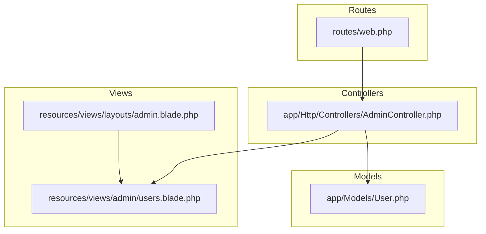
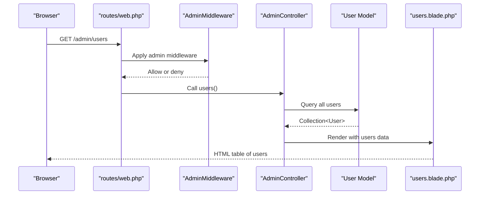
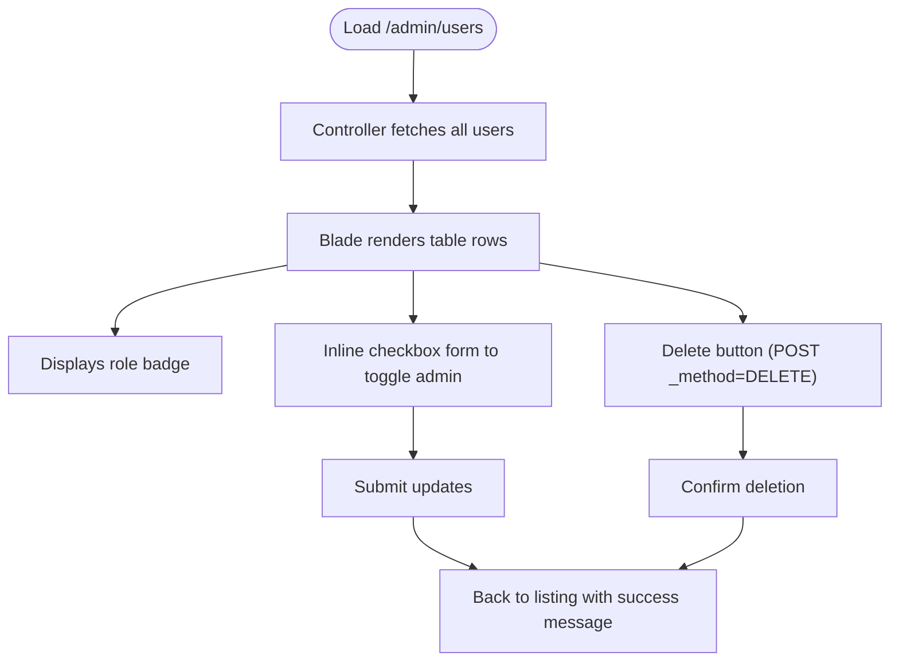
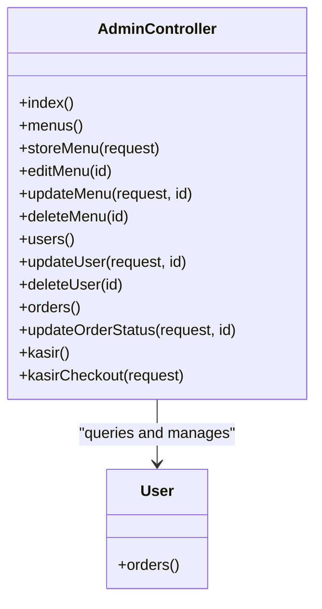
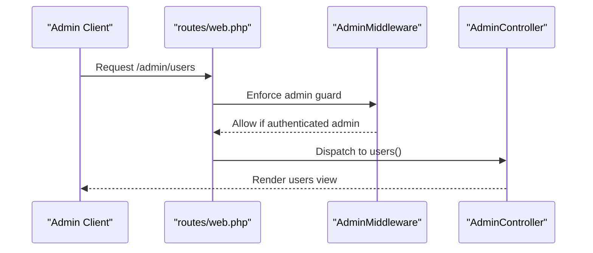
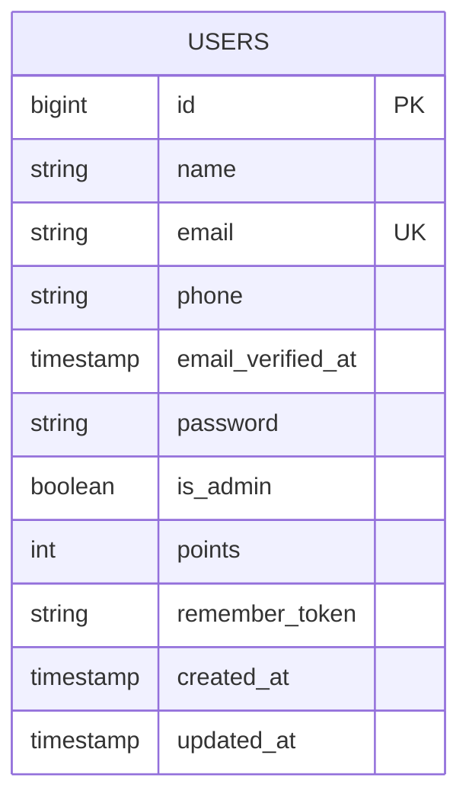
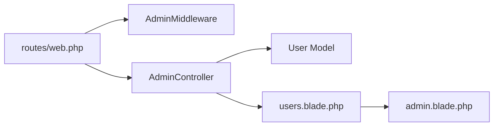

# User Listing & Search

<cite>
**Referenced Files in This Document**
- [AdminController.php](file://app/Http/Controllers/AdminController.php)
- [web.php](file://routes/web.php)
- [AdminMiddleware.php](file://app/Http/Middleware/AdminMiddleware.php)
- [users.blade.php](file://resources/views/admin/users.blade.php)
- [admin.blade.php](file://resources/views/layouts/admin.blade.php)
- [User.php](file://app/Models/User.php)
- [create_users_table.php](file://database/migrations/0001_01_01_000000_create_users_table.php)
</cite>

## Table of Contents
1. [Introduction](#introduction)
2. [Project Structure](#project-structure)
3. [Core Components](#core-components)
4. [Architecture Overview](#architecture-overview)
5. [Detailed Component Analysis](#detailed-component-analysis)
6. [Dependency Analysis](#dependency-analysis)
7. [Performance Considerations](#performance-considerations)
8. [Troubleshooting Guide](#troubleshooting-guide)
9. [Conclusion](#conclusion)

## Introduction
This document explains how administrators can view, filter, and manage users in the admin panel. It focuses on the user listing page, the underlying controller logic, routing, and the Blade template that renders the user table. It also clarifies current capabilities and highlights areas for enhancement such as search, sorting, pagination, and bulk actions.

## Project Structure
The user listing feature spans three primary areas:
- Routes define the admin-only endpoints for user management.
- The AdminController handles requests and passes user data to the view.
- The users.blade.php template renders the user table and provides inline editing for roles and deletion controls.

**Diagram sources**
- [web.php:52-62](file://routes/web.php#L52-L62)
- [AdminController.php:77-95](file://app/Http/Controllers/AdminController.php#L77-L95)
- [admin.blade.php:36-38](file://resources/views/layouts/admin.blade.php#L36-L38)
- [users.blade.php:1-57](file://resources/views/admin/users.blade.php#L1-L57)
- [User.php:10-55](file://app/Models/User.php#L10-L55)

**Section sources**
- [web.php:52-62](file://routes/web.php#L52-L62)
- [AdminController.php:77-95](file://app/Http/Controllers/AdminController.php#L77-L95)
- [users.blade.php:1-57](file://resources/views/admin/users.blade.php#L1-L57)
- [admin.blade.php:36-38](file://resources/views/layouts/admin.blade.php#L36-L38)

## Core Components
- Admin routes for users:
  - GET /admin/users lists all users.
  - POST /admin/users/{id} toggles a user’s admin role.
  - DELETE /admin/users/{id} deletes a user.
- AdminController methods:
  - users(): fetches all users and passes them to the view.
  - updateUser(): updates the is_admin flag.
  - deleteUser(): removes a user.
- Middleware:
  - AdminMiddleware ensures only authenticated admins can access admin routes.
- View:
  - users.blade.php displays a table with ID, name, email, role badge, and action buttons.

Practical outcomes:
- Administrators can view all registered users.
- Administrators can toggle a user’s admin role via an inline checkbox form.
- Administrators can delete users (excluding themselves).
- No built-in search, sorting, pagination, or bulk selection features exist yet.

**Section sources**
- [web.php:60-62](file://routes/web.php#L60-L62)
- [AdminController.php:77-95](file://app/Http/Controllers/AdminController.php#L77-L95)
- [AdminMiddleware.php:17-24](file://app/Http/Middleware/AdminMiddleware.php#L17-L24)
- [users.blade.php:11-54](file://resources/views/admin/users.blade.php#L11-L54)

## Architecture Overview
The user listing flow follows a standard MVC pattern: a route triggers a controller action, which queries the model, and the view renders the data.

**Diagram sources**
- [web.php:60](file://routes/web.php#L60)
- [AdminMiddleware.php:17-24](file://app/Http/Middleware/AdminMiddleware.php#L17-L24)
- [AdminController.php:77-81](file://app/Http/Controllers/AdminController.php#L77-L81)
- [User.php:10-55](file://app/Models/User.php#L10-L55)
- [users.blade.php:11-54](file://resources/views/admin/users.blade.php#L11-L54)

## Detailed Component Analysis

### User Listing Page (users.blade.php)
- Renders a responsive table with columns: ID, Name, Email, Role, Actions.
- Role badges indicate whether a user is admin or regular user.
- Inline edit form toggles the is_admin checkbox per user.
- Delete button submits a DELETE request to remove a user.
- Self-protection: prevents deleting the currently logged-in admin user.

**Diagram sources**
- [users.blade.php:11-54](file://resources/views/admin/users.blade.php#L11-L54)
- [AdminController.php:77-95](file://app/Http/Controllers/AdminController.php#L77-L95)

**Section sources**
- [users.blade.php:11-54](file://resources/views/admin/users.blade.php#L11-L54)

### AdminController Methods for Users
- users(): returns all users to the view.
- updateUser($id): toggles the is_admin flag based on checkbox presence.
- deleteUser($id): removes the user.

**Diagram sources**
- [AdminController.php:77-95](file://app/Http/Controllers/AdminController.php#L77-L95)
- [User.php:50-53](file://app/Models/User.php#L50-L53)

**Section sources**
- [AdminController.php:77-95](file://app/Http/Controllers/AdminController.php#L77-L95)

### Routing and Access Control
- Routes under /admin are guarded by AdminMiddleware.
- GET /admin/users serves the listing page.
- POST /admin/users/{id} updates a user’s role.
- DELETE /admin/users/{id} deletes a user.

**Diagram sources**
- [web.php:52-62](file://routes/web.php#L52-L62)
- [AdminMiddleware.php:17-24](file://app/Http/Middleware/AdminMiddleware.php#L17-L24)
- [AdminController.php:77-81](file://app/Http/Controllers/AdminController.php#L77-L81)

**Section sources**
- [web.php:52-62](file://routes/web.php#L52-L62)
- [AdminMiddleware.php:17-24](file://app/Http/Middleware/AdminMiddleware.php#L17-L24)

### Data Model and Schema
- User model defines fillable attributes including name, email, password, phone, and is_admin.
- Database migration creates the users table with unique email, timestamps, and additional fields.

**Diagram sources**
- [User.php:19-25](file://app/Models/User.php#L19-L25)
- [create_users_table.php:14-25](file://database/migrations/0001_01_01_000000_create_users_table.php#L14-L25)

**Section sources**
- [User.php:19-25](file://app/Models/User.php#L19-L25)
- [create_users_table.php:14-25](file://database/migrations/0001_01_01_000000_create_users_table.php#L14-L25)

## Dependency Analysis
- routes/web.php depends on AdminMiddleware to protect admin routes.
- AdminController depends on the User model for data retrieval and mutations.
- users.blade.php depends on the layout and the users collection passed by the controller.

**Diagram sources**
- [web.php:52-62](file://routes/web.php#L52-L62)
- [AdminMiddleware.php:17-24](file://app/Http/Middleware/AdminMiddleware.php#L17-L24)
- [AdminController.php:77-95](file://app/Http/Controllers/AdminController.php#L77-L95)
- [users.blade.php:11-54](file://resources/views/admin/users.blade.php#L11-L54)
- [admin.blade.php:36-38](file://resources/views/layouts/admin.blade.php#L36-L38)

**Section sources**
- [web.php:52-62](file://routes/web.php#L52-L62)
- [AdminController.php:77-95](file://app/Http/Controllers/AdminController.php#L77-L95)
- [users.blade.php:11-54](file://resources/views/admin/users.blade.php#L11-L54)
- [admin.blade.php:36-38](file://resources/views/layouts/admin.blade.php#L36-L38)

## Performance Considerations
- Current implementation loads all users into memory at once. For large datasets, consider:
  - Pagination to limit rows per page.
  - Indexing on frequently filtered columns (e.g., email, is_admin).
  - Eager loading where appropriate (already used in related order listings).
- Rendering 100+ rows in a single table can impact responsiveness; pagination would improve UX.

[No sources needed since this section provides general guidance]

## Troubleshooting Guide
- Access denied:
  - Symptom: 403 error when visiting /admin routes.
  - Cause: Non-admin user or unauthenticated session.
  - Resolution: Log in as an admin user; verify the is_admin flag in the database.
- Cannot toggle admin role:
  - Symptom: Checkbox change does not persist.
  - Cause: Missing CSRF token or incorrect route binding.
  - Resolution: Ensure the inline form posts to the correct route with CSRF protection.
- Cannot delete a user:
  - Symptom: Delete action fails silently.
  - Cause: Incorrect HTTP method or missing route binding.
  - Resolution: Confirm DELETE route exists and the form uses proper method spoofing.
- Self-deletion protection:
  - Behavior: Delete button is hidden when attempting to delete the current user.
  - Purpose: Prevent accidental self-removal.

**Section sources**
- [AdminMiddleware.php:17-24](file://app/Http/Middleware/AdminMiddleware.php#L17-L24)
- [users.blade.php:42-48](file://resources/views/admin/users.blade.php#L42-L48)
- [web.php:60-62](file://routes/web.php#L60-L62)

## Conclusion
The admin panel currently provides a straightforward user listing with role toggling and per-user deletion. Administrators can view all users and interpret role status via visual badges. To enhance usability for larger datasets and improve operational efficiency, consider adding:
- Search by name/email.
- Sorting by column (name, email, role).
- Pagination.
- Bulk selection and batch actions.

These enhancements would align with typical admin panel expectations while maintaining the existing security model enforced by AdminMiddleware.