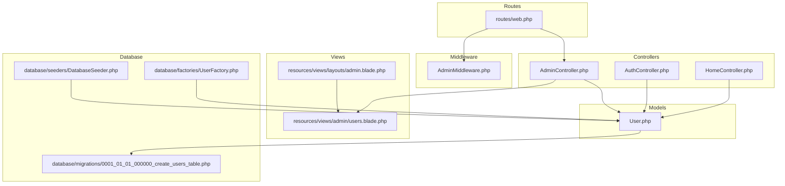
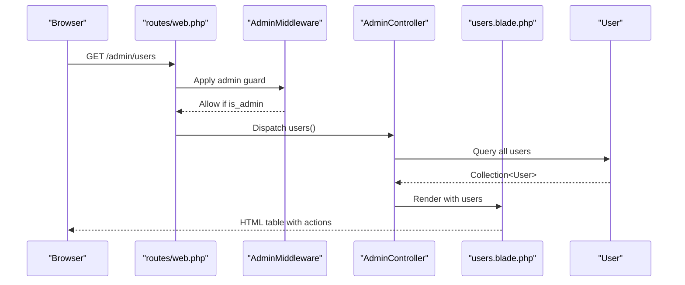
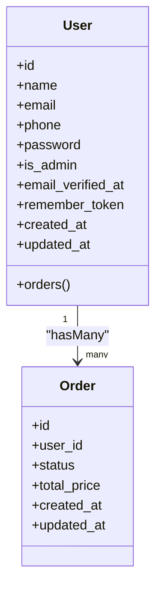
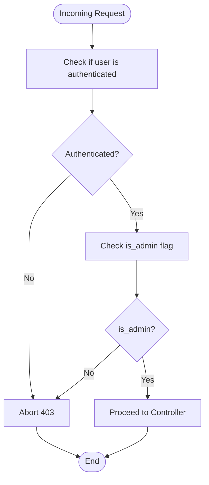
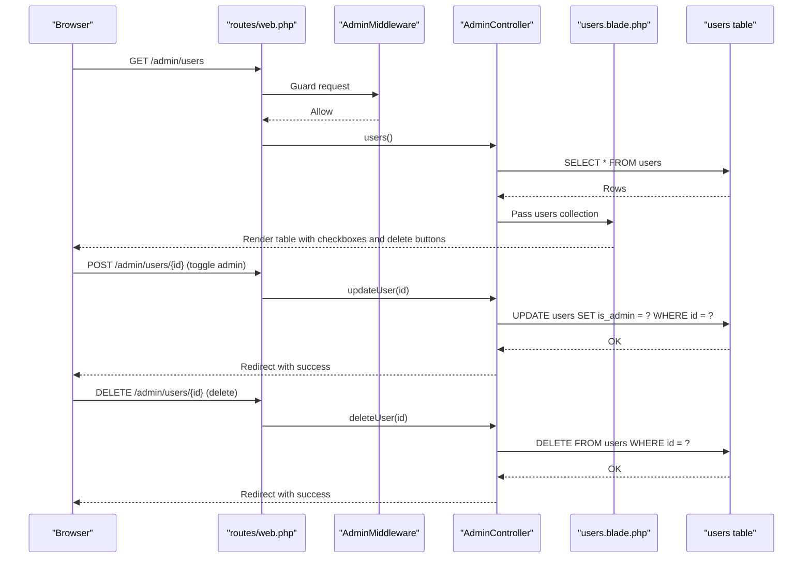
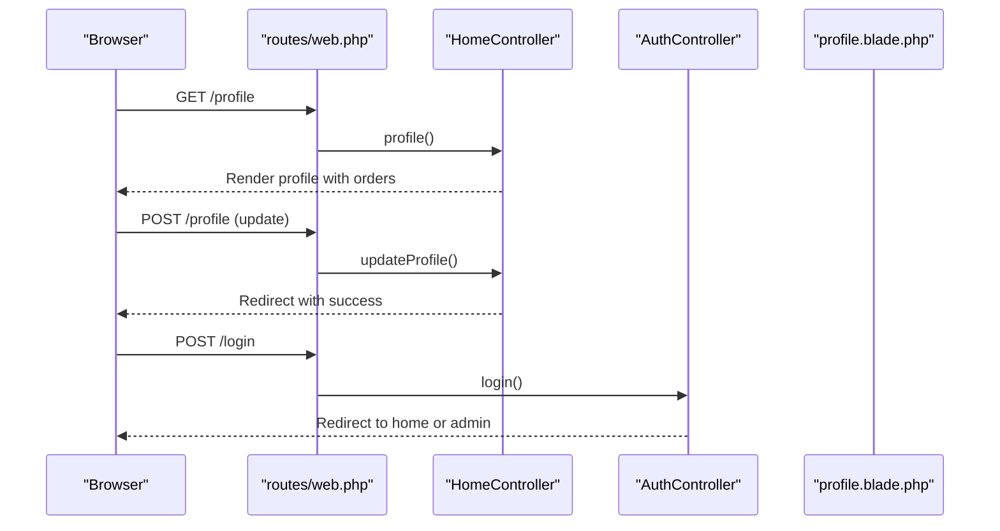
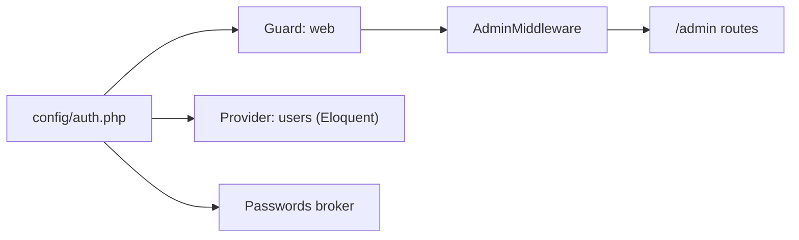
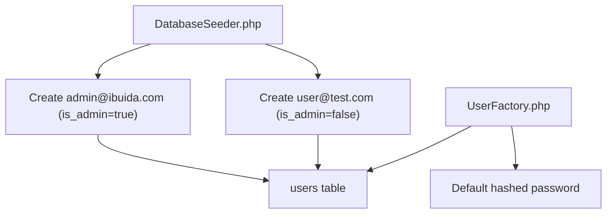
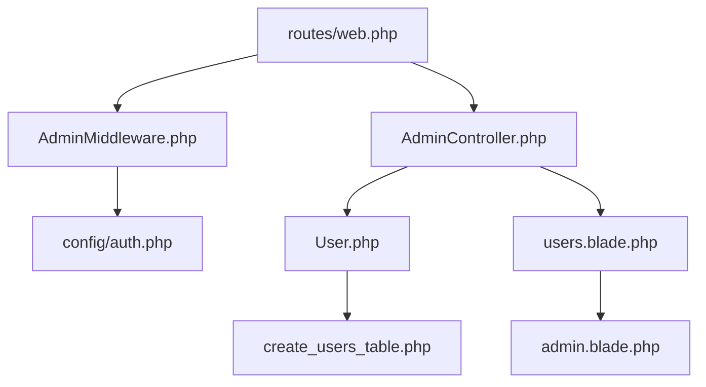

# User Management

<cite>
**Referenced Files in This Document**
- [User.php](file://app/Models/User.php)
- [users.blade.php](file://resources/views/admin/users.blade.php)
- [AdminController.php](file://app/Http/Controllers/AdminController.php)
- [AdminMiddleware.php](file://app/Http/Middleware/AdminMiddleware.php)
- [web.php](file://routes/web.php)
- [AuthController.php](file://app/Http/Controllers/AuthController.php)
- [HomeController.php](file://app/Http/Controllers/HomeController.php)
- [create_users_table.php](file://database/migrations/0001_01_01_000000_create_users_table.php)
- [admin.blade.php](file://resources/views/layouts/admin.blade.php)
- [auth.php](file://config/auth.php)
- [DatabaseSeeder.php](file://database/seeders/DatabaseSeeder.php)
- [UserFactory.php](file://database/factories/UserFactory.php)
</cite>

## Table of Contents
1. [Introduction](#introduction)
2. [Project Structure](#project-structure)
3. [Core Components](#core-components)
4. [Architecture Overview](#architecture-overview)
5. [Detailed Component Analysis](#detailed-component-analysis)
6. [Dependency Analysis](#dependency-analysis)
7. [Performance Considerations](#performance-considerations)
8. [Troubleshooting Guide](#troubleshooting-guide)
9. [Conclusion](#conclusion)
10. [Appendices](#appendices)

## Introduction
This document explains user management operations in the admin panel, covering user listing, profile viewing, role assignment, and account administration. It details the user modification workflow including admin privilege toggling, user deletion, and bulk operations. Practical examples demonstrate permission assignments, user activity monitoring, privacy considerations, security measures, and audit trail functionality. Guidance is also provided for managing customer accounts versus admin accounts and handling user-related support requests.

## Project Structure
The user management functionality spans models, controllers, middleware, routes, Blade templates, and database schema. Admin-only routes are protected by middleware, while authentication and authorization are handled centrally.

**Diagram sources**
- [web.php:52-70](file://routes/web.php#L52-L70)
- [AdminController.php:77-95](file://app/Http/Controllers/AdminController.php#L77-L95)
- [AdminMiddleware.php:17-24](file://app/Http/Middleware/AdminMiddleware.php#L17-L24)
- [User.php:10-54](file://app/Models/User.php#L10-L54)
- [users.blade.php:1-57](file://resources/views/admin/users.blade.php#L1-L57)
- [admin.blade.php:22-50](file://resources/views/layouts/admin.blade.php#L22-L50)
- [create_users_table.php:14-25](file://database/migrations/0001_01_01_000000_create_users_table.php#L14-L25)
- [DatabaseSeeder.php:20-38](file://database/seeders/DatabaseSeeder.php#L20-L38)
- [UserFactory.php:24-32](file://database/factories/UserFactory.php#L24-L32)

**Section sources**
- [web.php:52-70](file://routes/web.php#L52-L70)
- [AdminController.php:77-95](file://app/Http/Controllers/AdminController.php#L77-L95)
- [User.php:10-54](file://app/Models/User.php#L10-L54)
- [users.blade.php:1-57](file://resources/views/admin/users.blade.php#L1-L57)
- [admin.blade.php:22-50](file://resources/views/layouts/admin.blade.php#L22-L50)
- [create_users_table.php:14-25](file://database/migrations/0001_01_01_000000_create_users_table.php#L14-L25)
- [DatabaseSeeder.php:20-38](file://database/seeders/DatabaseSeeder.php#L20-L38)
- [UserFactory.php:24-32](file://database/factories/UserFactory.php#L24-L32)

## Core Components
- User model with admin flag and relations
- Admin controller actions for listing, updating, and deleting users
- Admin-only routes guarded by middleware
- Admin layout and user listing view
- Authentication and authorization configuration
- Database schema supporting user roles and sessions

Key capabilities:
- List all users with role badges
- Toggle admin privileges per user
- Delete users (self-protection prevents self-deletion)
- Bulk operations via batch updates (conceptual guidance)
- Profile viewing and editing for authenticated users
- Audit-friendly operations with success messages

**Section sources**
- [User.php:19-25](file://app/Models/User.php#L19-L25)
- [User.php:50-53](file://app/Models/User.php#L50-L53)
- [AdminController.php:77-95](file://app/Http/Controllers/AdminController.php#L77-L95)
- [users.blade.php:28-48](file://resources/views/admin/users.blade.php#L28-L48)
- [admin.blade.php:36-38](file://resources/views/layouts/admin.blade.php#L36-L38)
- [auth.php:38-72](file://config/auth.php#L38-L72)

## Architecture Overview
The admin user management flow is routed through the AdminController, validated by AdminMiddleware, and rendered via Blade templates. Authentication is handled by AuthController and configured in the auth config.

**Diagram sources**
- [web.php:60-62](file://routes/web.php#L60-L62)
- [AdminMiddleware.php:17-24](file://app/Http/Middleware/AdminMiddleware.php#L17-L24)
- [AdminController.php:77-81](file://app/Http/Controllers/AdminController.php#L77-L81)
- [users.blade.php:23-51](file://resources/views/admin/users.blade.php#L23-L51)

## Detailed Component Analysis

### User Model and Schema
The User model defines fillable attributes including an admin flag and hidden sensitive fields. The migration creates the users table with unique email, optional phone, timestamps, and admin flag.

**Diagram sources**
- [User.php:19-25](file://app/Models/User.php#L19-L25)
- [User.php:42-48](file://app/Models/User.php#L42-L48)
- [User.php:50-53](file://app/Models/User.php#L50-L53)
- [create_users_table.php:14-25](file://database/migrations/0001_01_01_000000_create_users_table.php#L14-L25)

**Section sources**
- [User.php:19-25](file://app/Models/User.php#L19-L25)
- [User.php:42-48](file://app/Models/User.php#L42-L48)
- [User.php:50-53](file://app/Models/User.php#L50-L53)
- [create_users_table.php:14-25](file://database/migrations/0001_01_01_000000_create_users_table.php#L14-L25)

### Admin Panel Access Control
Admin-only routes are grouped under /admin and protected by AdminMiddleware. The middleware checks authentication and admin status, returning a 403 for unauthorized access.

**Diagram sources**
- [AdminMiddleware.php:17-24](file://app/Http/Middleware/AdminMiddleware.php#L17-L24)
- [web.php:52-70](file://routes/web.php#L52-L70)

**Section sources**
- [AdminMiddleware.php:17-24](file://app/Http/Middleware/AdminMiddleware.php#L17-L24)
- [web.php:52-70](file://routes/web.php#L52-L70)

### User Listing and Role Assignment
The admin user listing page displays users with role badges and inline forms to toggle admin privileges and delete users. Self-deletion is prevented by checking against the current authenticated user ID.

**Diagram sources**
- [web.php:60-62](file://routes/web.php#L60-L62)
- [users.blade.php:34-48](file://resources/views/admin/users.blade.php#L34-L48)
- [AdminController.php:83-95](file://app/Http/Controllers/AdminController.php#L83-L95)

**Section sources**
- [users.blade.php:28-48](file://resources/views/admin/users.blade.php#L28-L48)
- [users.blade.php:42-48](file://resources/views/admin/users.blade.php#L42-L48)
- [AdminController.php:83-95](file://app/Http/Controllers/AdminController.php#L83-L95)

### Profile Viewing and Editing
Authenticated users can view and update their profiles, including optional password changes. Admins can manage users, while regular users manage themselves.

**Diagram sources**
- [web.php:33-47](file://routes/web.php#L33-L47)
- [HomeController.php:31-55](file://app/Http/Controllers/HomeController.php#L31-L55)
- [AuthController.php:17-44](file://app/Http/Controllers/AuthController.php#L17-L44)
- [profile.blade.php:58-96](file://resources/views/profile.blade.php#L58-L96)

**Section sources**
- [HomeController.php:31-55](file://app/Http/Controllers/HomeController.php#L31-L55)
- [AuthController.php:17-44](file://app/Http/Controllers/AuthController.php#L17-L44)
- [profile.blade.php:58-96](file://resources/views/profile.blade.php#L58-L96)

### Authentication and Authorization Configuration
Authentication uses the session driver with the Eloquent user provider. Password reset tokens are stored in a dedicated table. AdminMiddleware ensures only admin users can access admin routes.

**Diagram sources**
- [auth.php:38-72](file://config/auth.php#L38-L72)
- [AdminMiddleware.php:17-24](file://app/Http/Middleware/AdminMiddleware.php#L17-L24)
- [web.php:52-70](file://routes/web.php#L52-L70)

**Section sources**
- [auth.php:38-72](file://config/auth.php#L38-L72)
- [AdminMiddleware.php:17-24](file://app/Http/Middleware/AdminMiddleware.php#L17-L24)
- [web.php:52-70](file://routes/web.php#L52-L70)

### User Data Initialization and Seeding
Sample users are created during seeding, including an admin and a regular user. Factories provide default hashed passwords for generated users.

**Diagram sources**
- [DatabaseSeeder.php:20-38](file://database/seeders/DatabaseSeeder.php#L20-L38)
- [UserFactory.php:24-32](file://database/factories/UserFactory.php#L24-L32)
- [create_users_table.php:14-25](file://database/migrations/0001_01_01_000000_create_users_table.php#L14-L25)

**Section sources**
- [DatabaseSeeder.php:20-38](file://database/seeders/DatabaseSeeder.php#L20-L38)
- [UserFactory.php:24-32](file://database/factories/UserFactory.php#L24-L32)
- [create_users_table.php:14-25](file://database/migrations/0001_01_01_000000_create_users_table.php#L14-L25)

## Dependency Analysis
Admin routes depend on AdminMiddleware, which depends on authentication and the User model’s admin flag. The AdminController depends on the User model and renders the users view. The users view depends on the admin layout.

**Diagram sources**
- [web.php:52-70](file://routes/web.php#L52-L70)
- [AdminMiddleware.php:17-24](file://app/Http/Middleware/AdminMiddleware.php#L17-L24)
- [auth.php:38-72](file://config/auth.php#L38-L72)
- [AdminController.php:77-95](file://app/Http/Controllers/AdminController.php#L77-L95)
- [User.php:10-54](file://app/Models/User.php#L10-L54)
- [users.blade.php:1-57](file://resources/views/admin/users.blade.php#L1-L57)
- [admin.blade.php:22-50](file://resources/views/layouts/admin.blade.php#L22-L50)
- [create_users_table.php:14-25](file://database/migrations/0001_01_01_000000_create_users_table.php#L14-L25)

**Section sources**
- [web.php:52-70](file://routes/web.php#L52-L70)
- [AdminMiddleware.php:17-24](file://app/Http/Middleware/AdminMiddleware.php#L17-L24)
- [auth.php:38-72](file://config/auth.php#L38-L72)
- [AdminController.php:77-95](file://app/Http/Controllers/AdminController.php#L77-L95)
- [User.php:10-54](file://app/Models/User.php#L10-L54)
- [users.blade.php:1-57](file://resources/views/admin/users.blade.php#L1-L57)
- [admin.blade.php:22-50](file://resources/views/layouts/admin.blade.php#L22-L50)
- [create_users_table.php:14-25](file://database/migrations/0001_01_01_000000_create_users_table.php#L14-L25)

## Performance Considerations
- Minimize N+1 queries: The user listing controller fetches all users in a single query. Consider pagination for large datasets.
- Efficient toggles: Admin privilege updates are single-row updates; ensure indexes on frequently filtered columns if extended.
- View rendering: Blade loops are efficient; avoid heavy computations inside loops.
- Middleware overhead: AdminMiddleware performs minimal checks; keep guard logic lean.

## Troubleshooting Guide
Common issues and resolutions:
- Unauthorized access to admin routes: Verify AdminMiddleware is applied and user is authenticated and admin.
- Toggle not persisting: Confirm the updateUser action updates the is_admin field and redirects with success.
- Self-deletion protection: The view prevents deleting the currently logged-in user; ensure this logic remains intact.
- Authentication failures: Validate credentials and password hashing via AuthController.
- Session and provider configuration: Ensure the session guard and Eloquent provider are correctly configured.

**Section sources**
- [AdminMiddleware.php:17-24](file://app/Http/Middleware/AdminMiddleware.php#L17-L24)
- [AdminController.php:83-95](file://app/Http/Controllers/AdminController.php#L83-L95)
- [users.blade.php:42-48](file://resources/views/admin/users.blade.php#L42-L48)
- [AuthController.php:17-44](file://app/Http/Controllers/AuthController.php#L17-L44)
- [auth.php:38-72](file://config/auth.php#L38-L72)

## Conclusion
The admin user management system provides a focused set of capabilities: listing users, viewing roles, toggling admin privileges, and deleting users with safety checks. It leverages Laravel’s routing, middleware, authentication, and Eloquent ORM to deliver secure and maintainable operations. Extending to bulk operations and audit trails is straightforward given the existing patterns.

## Appendices

### Practical Examples

- Assign admin role to a user
  - Navigate to the admin user listing.
  - Toggle the “Admin” checkbox for the target user.
  - Submit the form to save changes.

- Remove admin role from a user
  - Navigate to the admin user listing.
  - Uncheck the “Admin” checkbox for the target user.
  - Submit the form to save changes.

- Delete a user account
  - Navigate to the admin user listing.
  - Click the trash icon next to the target user.
  - Confirm deletion when prompted.

- Monitor user activity
  - Use the admin dashboard to review recent orders and totals.
  - Cross-reference user orders via the user’s profile page.

- Manage customer vs admin accounts
  - Customer accounts: Non-admin users with standard permissions.
  - Admin accounts: Users with is_admin enabled; restricted to admin routes.

- Handle user-related support requests
  - Review user profile details and order history.
  - Use the admin navigation to access relevant sections.

### Security and Privacy Notes
- Passwords are hashed at rest; avoid exposing raw hashes.
- Hidden fields prevent accidental disclosure of sensitive data in forms.
- AdminMiddleware protects administrative routes.
- Sessions are supported by the sessions table; ensure secure cookie configuration in production.

### Audit Trail Guidance
- Current implementation provides success notifications after updates/deletes.
- To implement explicit audit logs, add a dedicated audit log table and record changes in the updateUser and deleteUser actions.