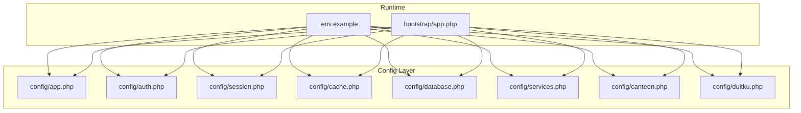
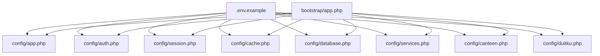
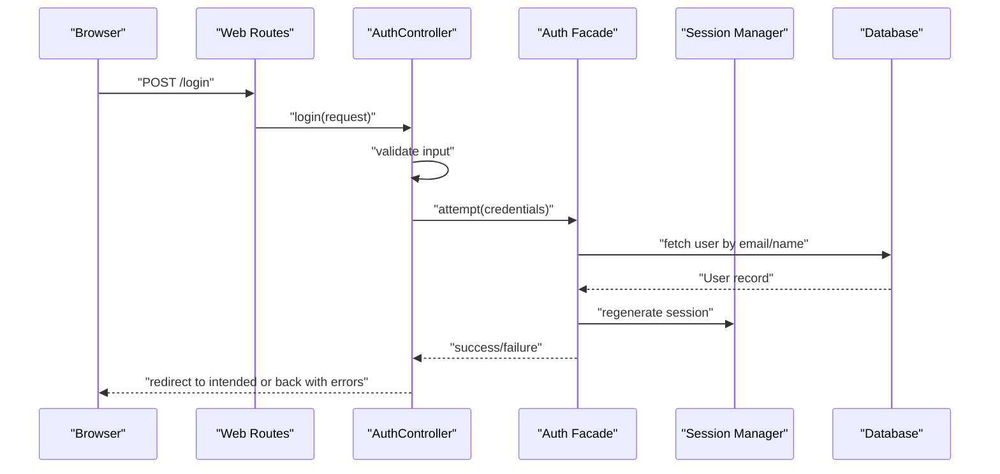
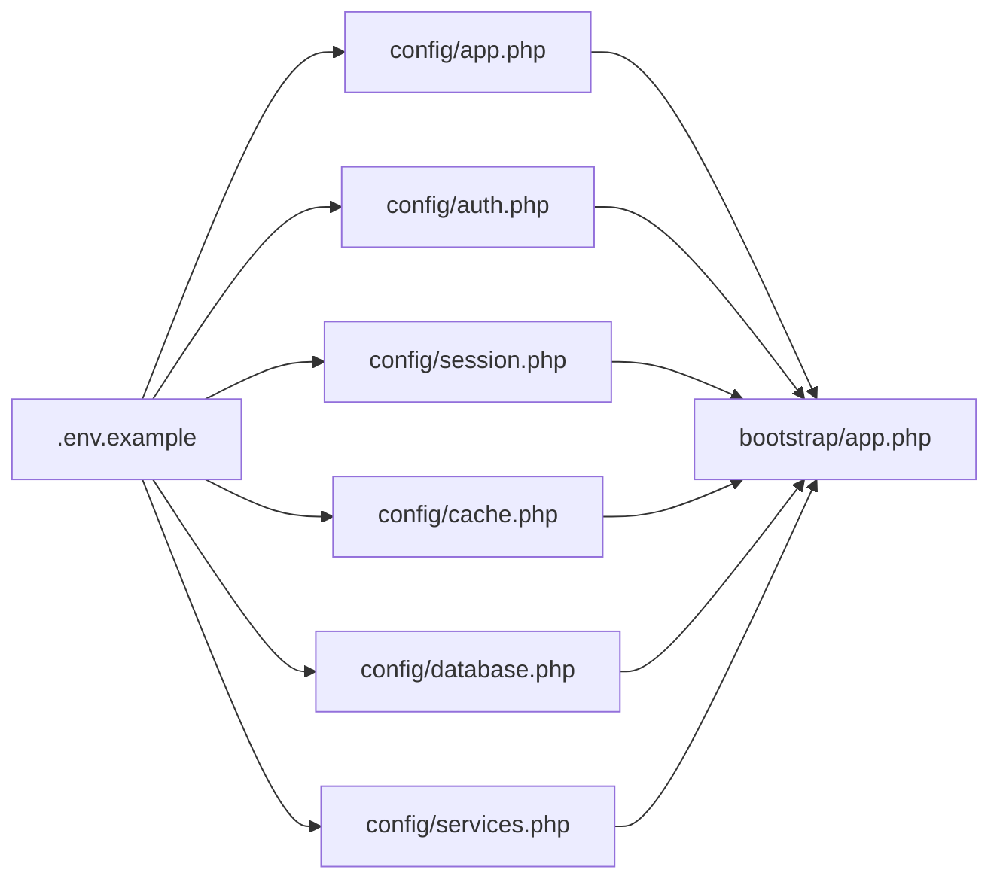

# Application Configuration

<cite>
**Referenced Files in This Document**
- [config/app.php](file://config/app.php)
- [config/auth.php](file://config/auth.php)
- [config/session.php](file://config/session.php)
- [config/cache.php](file://config/cache.php)
- [.env.example](file://.env.example)
- [config/database.php](file://config/database.php)
- [config/services.php](file://config/services.php)
- [bootstrap/app.php](file://bootstrap/app.php)
- [config/canteen.php](file://config/canteen.php)
- [config/duitku.php](file://config/duitku.php)
- [app/Http/Middleware/AdminMiddleware.php](file://app/Http/Middleware/AdminMiddleware.php)
- [app/Http/Controllers/AuthController.php](file://app/Http/Controllers/AuthController.php)
- [app/Models/User.php](file://app/Models/User.php)
</cite>

## Table of Contents
1. [Introduction](#introduction)
2. [Project Structure](#project-structure)
3. [Core Components](#core-components)
4. [Architecture Overview](#architecture-overview)
5. [Detailed Component Analysis](#detailed-component-analysis)
6. [Dependency Analysis](#dependency-analysis)
7. [Performance Considerations](#performance-considerations)
8. [Troubleshooting Guide](#troubleshooting-guide)
9. [Conclusion](#conclusion)
10. [Appendices](#appendices)

## Introduction
This document explains the application configuration for the Kantin Ibu Ida system. It focuses on the main application settings (timezone, locale, debug, URL), authentication configuration (guards, password resets, user providers), session management (driver, lifetime, security), cache configuration (drivers and key prefixes), environment-specific settings, and practical configuration scenarios. It also provides troubleshooting guidance for common configuration issues.

## Project Structure
The configuration is primarily managed through dedicated files under the config directory, environment variables in .env.example, and runtime bootstrap configuration. The key areas covered are:
- Application identity and environment behavior
- Authentication and user provider configuration
- Session storage and security
- Cache stores and key prefixes
- Database and third-party service integrations
- Environment-specific overrides and feature toggles

**Diagram sources**
- [config/app.php:1-127](file://config/app.php#L1-L127)
- [config/auth.php:1-116](file://config/auth.php#L1-L116)
- [config/session.php:1-219](file://config/session.php#L1-L219)
- [config/cache.php:1-108](file://config/cache.php#L1-L108)
- [config/database.php:1-171](file://config/database.php#L1-L171)
- [config/services.php:1-35](file://config/services.php#L1-L35)
- [config/canteen.php:1-9](file://config/canteen.php#L1-L9)
- [config/duitku.php:1-12](file://config/duitku.php#L1-L12)
- [bootstrap/app.php:1-24](file://bootstrap/app.php#L1-L24)
- [.env.example:1-68](file://.env.example#L1-L68)

**Section sources**
- [config/app.php:1-127](file://config/app.php#L1-L127)
- [config/auth.php:1-116](file://config/auth.php#L1-L116)
- [config/session.php:1-219](file://config/session.php#L1-L219)
- [config/cache.php:1-108](file://config/cache.php#L1-L108)
- [config/database.php:1-171](file://config/database.php#L1-L171)
- [config/services.php:1-35](file://config/services.php#L1-L35)
- [config/canteen.php:1-9](file://config/canteen.php#L1-L9)
- [config/duitku.php:1-12](file://config/duitku.php#L1-L12)
- [bootstrap/app.php:1-24](file://bootstrap/app.php#L1-L24)
- [.env.example:1-68](file://.env.example#L1-L68)

## Core Components
- Application settings: name, environment, debug flag, base URL, timezone, locale, fallback locale, faker locale, encryption key, maintenance driver/store.
- Authentication defaults, guards, providers, password reset policy, and password confirmation timeout.
- Session driver, lifetime, encryption, cookie settings, and security flags.
- Cache default store, available stores, and cache key prefix.
- Environment-specific overrides and feature toggles via .env.example.

Practical highlights:
- Timezone is configured to Asia/Jakarta in the example environment.
- Locale is set to Indonesian (id) with fallback to id.
- Debug is disabled by default in production.
- Session driver is file in the example; cache store is file.
- Maintenance mode uses file driver by default.

**Section sources**
- [config/app.php:15-124](file://config/app.php#L15-L124)
- [config/auth.php:16-113](file://config/auth.php#L16-L113)
- [config/session.php:21-216](file://config/session.php#L21-L216)
- [config/cache.php:18-105](file://config/cache.php#L18-L105)
- [.env.example:1-68](file://.env.example#L1-L68)

## Architecture Overview
The configuration architecture ties environment variables to configuration arrays, which are consumed by Laravel’s runtime. Bootstrap wires routing and middleware, while controllers and middleware rely on authentication and session configuration.

**Diagram sources**
- [.env.example:1-68](file://.env.example#L1-L68)
- [config/app.php:1-127](file://config/app.php#L1-L127)
- [config/auth.php:1-116](file://config/auth.php#L1-L116)
- [config/session.php:1-219](file://config/session.php#L1-L219)
- [config/cache.php:1-108](file://config/cache.php#L1-L108)
- [config/database.php:1-171](file://config/database.php#L1-L171)
- [config/services.php:1-35](file://config/services.php#L1-L35)
- [config/canteen.php:1-9](file://config/canteen.php#L1-L9)
- [config/duitku.php:1-12](file://config/duitku.php#L1-L12)
- [bootstrap/app.php:1-24](file://bootstrap/app.php#L1-L24)

## Detailed Component Analysis

### Application Settings (config/app.php)
Key areas:
- Application name and environment
- Debug mode
- Base URL for CLI-generated URLs
- Timezone and locales (default, fallback, faker)
- Encryption cipher and key management
- Maintenance mode driver and store

Common configuration scenarios:
- Switching debug off for production and enabling for development.
- Updating APP_URL to match the deployed domain.
- Aligning APP_TIMEZONE with regional operations.
- Setting APP_LOCALE and APP_FALLBACK_LOCALE to Indonesian (id) for local users.

Operational notes:
- APP_KEY must be set for encryption and signed URLs.
- APP_MAINTENANCE_DRIVER supports file or cache; cache enables multi-node maintenance control.

**Section sources**
- [config/app.php:15-124](file://config/app.php#L15-L124)
- [.env.example:1-13](file://.env.example#L1-L13)

### Authentication Configuration (config/auth.php)
Key areas:
- Defaults for guard and password broker
- Guard definition (session-based)
- User provider (Eloquent model)
- Password reset policy (table, expiry, throttle)
- Password confirmation timeout

How it integrates:
- The default guard uses the session driver and Eloquent user provider.
- The password reset broker references a token table and applies expiry and throttling.
- The user provider points to the application User model.

Practical examples:
- Change AUTH_GUARD to a custom guard if needed.
- Adjust AUTH_PASSWORD_BROKER to a different reset table if using multi-tenant or separate reset storage.
- Modify AUTH_MODEL to point to a different user entity if applicable.

**Section sources**
- [config/auth.php:16-113](file://config/auth.php#L16-L113)
- [app/Http/Controllers/AuthController.php:17-44](file://app/Http/Controllers/AuthController.php#L17-L44)
- [app/Models/User.php:10-54](file://app/Models/User.php#L10-L54)

### Session Management (config/session.php)
Key areas:
- Driver selection (file, database, redis, etc.)
- Lifetime and close-on-exit behavior
- Encryption toggle
- File location, database connection/table, cache store
- Cookie name, path, domain, secure, http-only, same-site, partitioned

Security options:
- SESSION_SECURE_COOKIE restricts cookies to HTTPS.
- SESSION_HTTP_ONLY prevents client-side script access.
- SESSION_SAME_SITE mitigates CSRF risks.
- SESSION_PARTITIONED_COOKIE requires secure and same-site none for cross-site partitioning.

Operational notes:
- DATABASE driver requires a sessions table; ensure migration is applied.
- REDIS driver requires a cache connection; ensure Redis availability.
- COOKIE naming derives from APP_NAME for uniqueness.

**Section sources**
- [config/session.php:21-216](file://config/session.php#L21-L216)
- [.env.example:29-34](file://.env.example#L29-L34)

### Cache Configuration (config/cache.php)
Key areas:
- Default store selection
- Available stores: array, database, file, memcached, redis, dynamodb, octane
- Database store table/connection/lock connection
- File store path and lock path
- Memcached servers, SASL credentials, options
- Redis connection and lock connection
- DynamoDB region, table, endpoint
- Octane store for in-memory caching during hot reloads
- Cache key prefix derived from APP_NAME

Operational notes:
- CACHE_PREFIX avoids key collisions across applications sharing the same cache backend.
- DATABASE cache requires a cache table; ensure migration is applied.
- REDIS cache requires a cache connection; ensure Redis availability.

**Section sources**
- [config/cache.php:18-105](file://config/cache.php#L18-L105)
- [.env.example:39-40](file://.env.example#L39-L40)

### Environment-Specific Settings and Feature Toggles
Environment variables in .env.example demonstrate:
- Application identity, environment, debug, URL, timezone, and locales
- Maintenance mode driver/store
- Database connectivity
- Session driver and lifetime
- Broadcast, filesystem, and queue connections
- Cache store and prefix
- Redis client, host, port, and password
- Mailer settings
- Duitku payment integration credentials and endpoints
- Canteen metadata (name, coordinates, delivery radius)

Feature toggles:
- APP_DEBUG toggles verbose error reporting.
- APP_MAINTENANCE_DRIVER toggles maintenance mode across nodes.
- QUEUE_CONNECTION toggles synchronous vs. queued job processing.
- LOG_LEVEL controls verbosity of logs.

**Section sources**
- [.env.example:1-68](file://.env.example#L1-L68)
- [config/database.php:19-166](file://config/database.php#L19-L166)
- [config/services.php:17-32](file://config/services.php#L17-L32)
- [config/duitku.php:4-11](file://config/duitku.php#L4-L11)
- [config/canteen.php:4-8](file://config/canteen.php#L4-L8)

### Integration Points and Runtime Behavior
- Bootstrap configures routing and middleware, including CSRF validation exemptions for specific endpoints.
- AdminMiddleware enforces admin-only access by checking authentication and user role.
- AuthController demonstrates authentication flow using session-backed guard and Eloquent user provider.

**Diagram sources**
- [bootstrap/app.php:16-20](file://bootstrap/app.php#L16-L20)
- [app/Http/Controllers/AuthController.php:17-44](file://app/Http/Controllers/AuthController.php#L17-L44)
- [config/auth.php:38-43](file://config/auth.php#L38-L43)
- [app/Models/User.php:10-54](file://app/Models/User.php#L10-L54)

**Section sources**
- [bootstrap/app.php:16-20](file://bootstrap/app.php#L16-L20)
- [app/Http/Middleware/AdminMiddleware.php:17-24](file://app/Http/Middleware/AdminMiddleware.php#L17-L24)
- [app/Http/Controllers/AuthController.php:17-44](file://app/Http/Controllers/AuthController.php#L17-L44)
- [config/auth.php:38-43](file://config/auth.php#L38-L43)
- [app/Models/User.php:10-54](file://app/Models/User.php#L10-L54)

## Dependency Analysis
Configuration dependencies and coupling:
- config/app.php depends on .env for name, environment, debug, URL, timezone, locale, key, and maintenance settings.
- config/auth.php depends on .env for guard, broker, model, reset token table, and timeout.
- config/session.php depends on .env for driver, lifetime, encryption, cookie settings, and store.
- config/cache.php depends on .env for default store and per-store credentials/connections.
- config/database.php depends on .env for connection defaults and Redis prefixes.
- config/services.php depends on .env for third-party credentials.
- bootstrap/app.php depends on config/app.php for routing and middleware configuration.

**Diagram sources**
- [.env.example:1-68](file://.env.example#L1-L68)
- [config/app.php:1-127](file://config/app.php#L1-L127)
- [config/auth.php:1-116](file://config/auth.php#L1-L116)
- [config/session.php:1-219](file://config/session.php#L1-L219)
- [config/cache.php:1-108](file://config/cache.php#L1-L108)
- [config/database.php:1-171](file://config/database.php#L1-L171)
- [config/services.php:1-35](file://config/services.php#L1-L35)
- [bootstrap/app.php:1-24](file://bootstrap/app.php#L1-L24)

**Section sources**
- [config/app.php:15-124](file://config/app.php#L15-L124)
- [config/auth.php:16-113](file://config/auth.php#L16-L113)
- [config/session.php:21-216](file://config/session.php#L21-L216)
- [config/cache.php:18-105](file://config/cache.php#L18-L105)
- [config/database.php:19-166](file://config/database.php#L19-L166)
- [config/services.php:17-32](file://config/services.php#L17-L32)
- [bootstrap/app.php:10-23](file://bootstrap/app.php#L10-L23)
- [.env.example:1-68](file://.env.example#L1-L68)

## Performance Considerations
- Choose cache and session drivers suited to deployment scale (e.g., Redis or DynamoDB for distributed environments).
- Tune session lifetime to balance user experience and resource usage.
- Use cache key prefixes to avoid collisions in shared cache systems.
- Enable encryption for sessions only when required; it adds CPU overhead.
- Keep debug disabled in production to reduce overhead and exposure.

## Troubleshooting Guide
Common configuration issues and resolutions:
- Application URL mismatch
  - Symptom: Incorrect asset or route URLs in production.
  - Resolution: Set APP_URL to the actual domain; ensure trailing slash matches deployment expectations.
  - Section sources
    - [config/app.php:55-55](file://config/app.php#L55-L55)
    - [.env.example:6-6](file://.env.example#L6-L6)

- Timezone inconsistencies
  - Symptom: Incorrect timestamps or scheduled tasks behavior.
  - Resolution: Set APP_TIMEZONE to the correct zone (e.g., Asia/Jakarta).
  - Section sources
    - [config/app.php:68-68](file://config/app.php#L68-L68)
    - [.env.example:5-5](file://.env.example#L5-L5)

- Locale and fallback locale
  - Symptom: Missing translations or fallback to wrong language.
  - Resolution: Set APP_LOCALE and APP_FALLBACK_LOCALE to Indonesian (id).
  - Section sources
    - [config/app.php:81-85](file://config/app.php#L81-L85)
    - [.env.example:8-10](file://.env.example#L8-L10)

- Debug mode visibility
  - Symptom: Excessive error details in production.
  - Resolution: Keep APP_DEBUG disabled in production; enable temporarily for diagnostics.
  - Section sources
    - [config/app.php:42-42](file://config/app.php#L42-L42)
    - [.env.example:4-4](file://.env.example#L4-L4)

- Session driver and persistence
  - Symptom: Users logged out unexpectedly or session not persisting.
  - Resolution: Verify SESSION_DRIVER and related settings; ensure database or Redis availability; confirm SESSION_LIFETIME and SESSION_EXPIRE_ON_CLOSE.
  - Section sources
    - [config/session.php:21-37](file://config/session.php#L21-L37)
    - [.env.example:29-34](file://.env.example#L29-L34)

- Cache store and key collisions
  - Symptom: Stale cache or key conflicts across apps.
  - Resolution: Set CACHE_STORE appropriately and configure CACHE_PREFIX to a unique value.
  - Section sources
    - [config/cache.php:18-105](file://config/cache.php#L18-L105)
    - [.env.example:39-40](file://.env.example#L39-L40)

- Authentication failures
  - Symptom: Login attempts fail or redirects incorrect.
  - Resolution: Confirm AUTH_GUARD, AUTH_MODEL, and guard provider; ensure APP_KEY is set; verify user credentials and roles.
  - Section sources
    - [config/auth.php:16-66](file://config/auth.php#L16-L66)
    - [app/Http/Controllers/AuthController.php:17-44](file://app/Http/Controllers/AuthController.php#L17-L44)
    - [app/Models/User.php:10-54](file://app/Models/User.php#L10-L54)

- Maintenance mode behavior
  - Symptom: Application appears down or not updating.
  - Resolution: Check APP_MAINTENANCE_DRIVER and store; switch to cache for multi-node deployments.
  - Section sources
    - [config/app.php:121-124](file://config/app.php#L121-L124)
    - [.env.example:12-13](file://.env.example#L12-L13)

- CSRF validation exceptions
  - Symptom: Form submissions blocked on callback endpoints.
  - Resolution: Confirm CSRF validation exclusion for /callback in bootstrap middleware configuration.
  - Section sources
    - [bootstrap/app.php:17-19](file://bootstrap/app.php#L17-L19)

## Conclusion
The Kantin Ibu Ida application relies on a clean separation of environment variables and configuration arrays. Correctly setting timezone, locale, debug, URL, authentication guards, session drivers, and cache stores ensures predictable behavior, strong security, and maintainable operations. Use the environment-specific settings and feature toggles to adapt behavior across development, staging, and production environments.

## Appendices
- Practical configuration scenarios:
  - Development: Enable debug, use file-based session and cache, set APP_URL to localhost.
  - Production: Disable debug, use database or Redis for sessions and cache, set HTTPS APP_URL, configure secure cookies, and set maintenance driver to cache.
  - Multi-node deployment: Use cache-based maintenance and distributed cache/session stores (Redis/DynamoDB).
- Security checklist:
  - Set APP_KEY and rotate previous keys.
  - Configure SESSION_SECURE_COOKIE, SESSION_HTTP_ONLY, and appropriate SESSION_SAME_SITE.
  - Use cache key prefixes in shared environments.
  - Validate database and Redis credentials for cache/session stores.