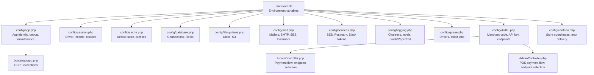
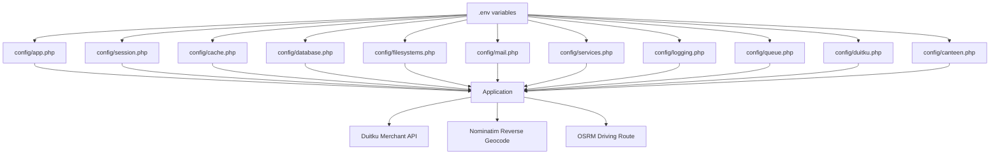
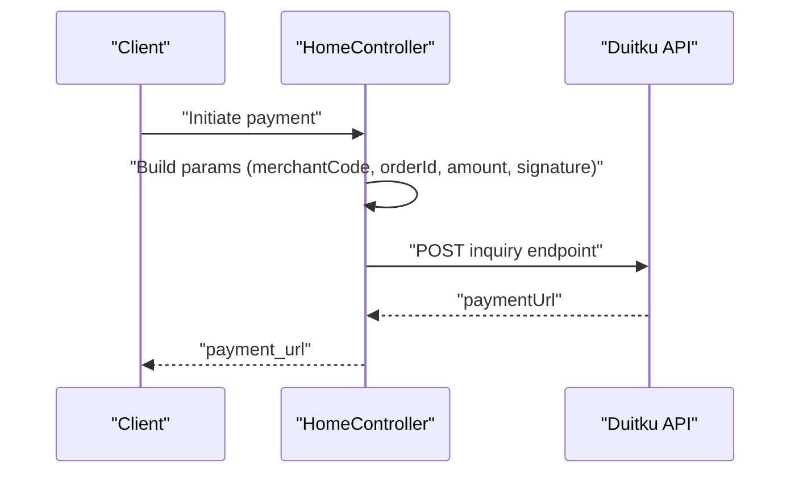
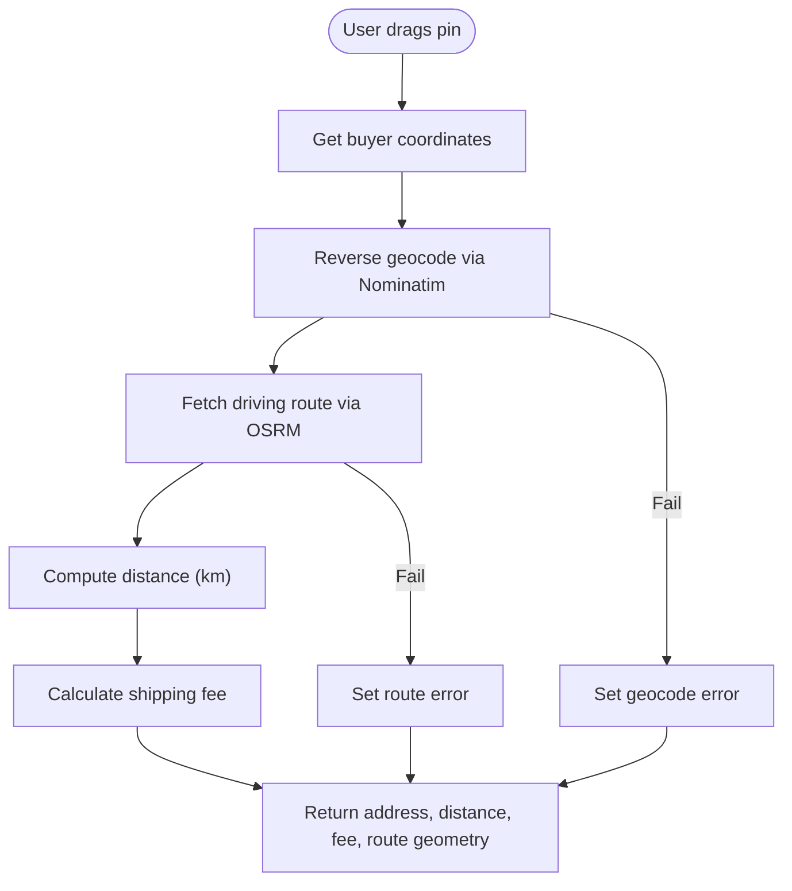
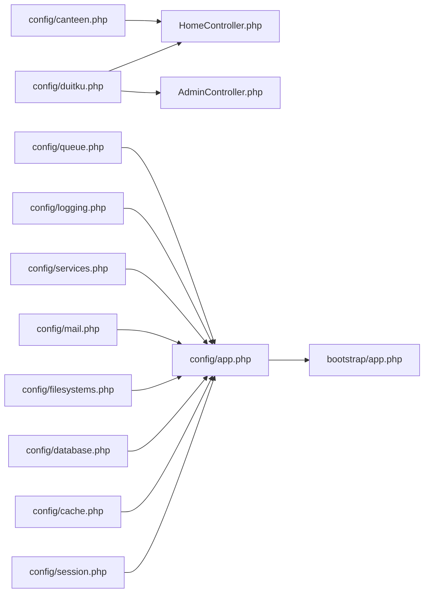

# Configuration & Environment

<cite>
**Referenced Files in This Document**
- [.env.example](file://.env.example)
- [config/app.php](file://config/app.php)
- [config/session.php](file://config/session.php)
- [config/cache.php](file://config/cache.php)
- [config/database.php](file://config/database.php)
- [config/filesystems.php](file://config/filesystems.php)
- [config/mail.php](file://config/mail.php)
- [config/services.php](file://config/services.php)
- [config/logging.php](file://config/logging.php)
- [config/queue.php](file://config/queue.php)
- [config/duitku.php](file://config/duitku.php)
- [config/canteen.php](file://config/canteen.php)
- [bootstrap/app.php](file://bootstrap/app.php)
- [app/Http/Controllers/HomeController.php](file://app/Http/Controllers/HomeController.php)
- [app/Http/Controllers/AdminController.php](file://app/Http/Controllers/AdminController.php)
</cite>

## Table of Contents
1. [Introduction](#introduction)
2. [Project Structure](#project-structure)
3. [Core Components](#core-components)
4. [Architecture Overview](#architecture-overview)
5. [Detailed Component Analysis](#detailed-component-analysis)
6. [Dependency Analysis](#dependency-analysis)
7. [Performance Considerations](#performance-considerations)
8. [Troubleshooting Guide](#troubleshooting-guide)
9. [Conclusion](#conclusion)
10. [Appendices](#appendices)

## Introduction
This section documents how to configure and prepare the environment for the Kantin Ibu Ida system. It explains environment variable configuration, feature toggles, system parameterization, and environment-specific settings for development, staging, and production. It covers payment gateway configuration for Duitku (API keys, callback/return URLs, sandbox/production modes), location services for geocoding and routing, database connectivity, caching, queues, filesystems, email/SMS notifications, logging, and security hardening. Guidance is provided for deployment preparation and operational tuning.

## Project Structure
Configuration is organized per subsystem under the config directory and supplemented by environment variables in .env. Key areas include application identity and behavior, session and cache stores, database and Redis, filesystems, mail and third-party services, logging, queues, and payment integrations. Environment variables are loaded via env() helpers and consumed by configuration arrays.

**Diagram sources**
- [.env.example](file://.env.example)
- [config/app.php](file://config/app.php)
- [config/session.php](file://config/session.php)
- [config/cache.php](file://config/cache.php)
- [config/database.php](file://config/database.php)
- [config/filesystems.php](file://config/filesystems.php)
- [config/mail.php](file://config/mail.php)
- [config/services.php](file://config/services.php)
- [config/logging.php](file://config/logging.php)
- [config/queue.php](file://config/queue.php)
- [config/duitku.php](file://config/duitku.php)
- [config/canteen.php](file://config/canteen.php)
- [bootstrap/app.php](file://bootstrap/app.php)
- [app/Http/Controllers/HomeController.php](file://app/Http/Controllers/HomeController.php)
- [app/Http/Controllers/AdminController.php](file://app/Http/Controllers/AdminController.php)

**Section sources**
- [.env.example](file://.env.example)
- [config/app.php](file://config/app.php)
- [config/session.php](file://config/session.php)
- [config/cache.php](file://config/cache.php)
- [config/database.php](file://config/database.php)
- [config/filesystems.php](file://config/filesystems.php)
- [config/mail.php](file://config/mail.php)
- [config/services.php](file://config/services.php)
- [config/logging.php](file://config/logging.php)
- [config/queue.php](file://config/queue.php)
- [config/duitku.php](file://config/duitku.php)
- [config/canteen.php](file://config/canteen.php)
- [bootstrap/app.php](file://bootstrap/app.php)

## Core Components
- Application identity and behavior: name, environment, debug, URL, timezone, locales, encryption key, maintenance mode.
- Sessions: driver, lifetime, encryption, cookie policy, domain/path/security attributes.
- Cache: default store, database-backed cache table/connection, Redis cache connection, key prefix.
- Database and Redis: connection drivers, host/port/database/credentials, charset/collation, SSL CA, Redis client/prefixes.
- Filesystems: local/public disks, S3 credentials and endpoint configuration.
- Mail and third-party services: mailer transports (SMTP, SES, Postmark, Sendmail, Log, Array, Failover), global From address, AWS SES credentials, Postmark token, Slack bot tokens.
- Logging: default channel, deprecation channel/trace, stack channels, daily rotation, Slack webhook, Papertrail, stderr, syslog, errorlog.
- Queues: default driver, database/Beanstalkd/SQS/Redis connections, retry timing, failed job storage.
- Payment (Duitku): merchant code, API key, environment (sandbox/production), callback/return URLs, endpoints.
- Location services: canteen coordinates and max delivery radius; runtime geocoding and routing via external services.

**Section sources**
- [config/app.php](file://config/app.php)
- [config/session.php](file://config/session.php)
- [config/cache.php](file://config/cache.php)
- [config/database.php](file://config/database.php)
- [config/filesystems.php](file://config/filesystems.php)
- [config/mail.php](file://config/mail.php)
- [config/services.php](file://config/services.php)
- [config/logging.php](file://config/logging.php)
- [config/queue.php](file://config/queue.php)
- [config/duitku.php](file://config/duitku.php)
- [config/canteen.php](file://config/canteen.php)

## Architecture Overview
The configuration architecture centers on environment variables and configuration arrays. Controllers consume configuration to integrate with external services (Duitku, OpenStreetMap/Nominatim, OSRM router) and internal subsystems (database, cache, queue, mail).

**Diagram sources**
- [config/app.php](file://config/app.php)
- [config/session.php](file://config/session.php)
- [config/cache.php](file://config/cache.php)
- [config/database.php](file://config/database.php)
- [config/filesystems.php](file://config/filesystems.php)
- [config/mail.php](file://config/mail.php)
- [config/services.php](file://config/services.php)
- [config/logging.php](file://config/logging.php)
- [config/queue.php](file://config/queue.php)
- [config/duitku.php](file://config/duitku.php)
- [config/canteen.php](file://config/canteen.php)
- [app/Http/Controllers/HomeController.php](file://app/Http/Controllers/HomeController.php)

## Detailed Component Analysis

### Environment Variables and .env Preparation
- Copy the example environment file to .env and fill in values per environment.
- Critical variables include application identity, debug flag, URL, timezone, locales, encryption key, maintenance mode, database credentials, cache/store settings, queue driver, filesystem disk, mail transport, third-party tokens, logging channels, and Duitku credentials and endpoints.
- Recommended practice: regenerate APP_KEY for production, set APP_DEBUG=false, and ensure HTTPS APP_URL for secure cookies and callbacks.

**Section sources**
- [.env.example](file://.env.example)

### Application Identity and Behavior (config/app.php)
- Purpose: centralize application-wide settings such as name, environment, debug mode, base URL, timezone, locales, encryption key, and maintenance driver/store.
- Key options:
  - name, env, debug, url, timezone, locale/fallback/faker_locale, cipher/key/previous_keys, maintenance driver/store.
- Security and stability:
  - Keep debug off in production.
  - Set APP_KEY and rotate previous keys periodically.
  - Choose maintenance driver/store appropriate for your infrastructure.

**Section sources**
- [config/app.php](file://config/app.php)

### Session Configuration (config/session.php)
- Purpose: define session storage driver, lifetime, encryption, cookie attributes, domain/path/security, and store for cache-backed drivers.
- Options:
  - driver, lifetime, expire_on_close, encrypt, files path, connection/table for database driver, store for cache-backed drivers, cookie name/path/domain/secure/http_only/same_site/partitioned.
- Recommendations:
  - Use database or Redis for multi-node deployments.
  - Enable secure and http_only cookies in production behind HTTPS.
  - Configure same_site per deployment needs (strict for sensitive apps, lax otherwise).

**Section sources**
- [config/session.php](file://config/session.php)

### Cache Configuration (config/cache.php)
- Purpose: select default cache store and configure drivers (database, file, memcached, redis, dynamodb, octane).
- Options:
  - default store, database table/connection/lock connection, file path/lock path, memcached servers/sasl, redis connection/lock connection, dynamodb key/secret/region/table/endpoint, octane.
  - prefix derived from APP_NAME.
- Recommendations:
  - Use Redis for high-throughput scenarios.
  - Set CACHE_PREFIX to avoid collisions across apps.
  - For database cache, ensure cache and lock connections are configured.

**Section sources**
- [config/cache.php](file://config/cache.php)

### Database and Redis (config/database.php)
- Purpose: configure primary database connections (sqlite/mysql/mariadb/pgsql/sqlsrv) and Redis clients/options.
- Options:
  - default connection, per-connection host/port/socket/database/username/password/charset/collation/strict/engine/options, migration table, Redis client, cluster/prefix, default/cache databases with URL/host/username/password/port/database.
- Recommendations:
  - Use MariaDB or MySQL for production; configure strict mode and proper charset/collation.
  - Provide SSL CA path via MYSQL_ATTR_SSL_CA for secure connections.
  - For Redis, set REDIS_CLIENT, REDIS_PREFIX, and choose separate databases for default vs cache.

**Section sources**
- [config/database.php](file://config/database.php)

### Filesystems (config/filesystems.php)
- Purpose: define default disk and storage backends (local, public, S3).
- Options:
  - default disk, local root, public visibility and URL, S3 key/secret/region/bucket/url/endpoint/path-style.
- Recommendations:
  - Use local for dev, S3 for production with correct region and endpoint.
  - Ensure APP_URL aligns with public disk URL for asset serving.

**Section sources**
- [config/filesystems.php](file://config/filesystems.php)

### Email and Notification Configuration (config/mail.php, config/services.php)
- Purpose: configure mailers (SMTP, SES, Postmark, Sendmail, Log, Array, Failover) and global From address; third-party service credentials.
- Options:
  - default mailer, mailers transports and settings, global from address/name.
  - services: Postmark token, SES key/secret/region, Slack bot user oauth token and default channel.
- Recommendations:
  - Use SES or Postmark in production; configure encryption and credentials.
  - For development, use log mailer to capture messages in storage/logs.
  - Set MAIL_FROM_ADDRESS and MAIL_FROM_NAME consistently.

**Section sources**
- [config/mail.php](file://config/mail.php)
- [config/services.php](file://config/services.php)

### Logging (config/logging.php)
- Purpose: define default channel, deprecation logging, and multiple drivers (single, daily, slack, syslog, stderr, papertrail, errorlog, stack).
- Options:
  - default channel, deprecations channel/trace, stack channels, daily retention days, Slack webhook, Papertrail host/port, stderr formatter, syslog facility.
- Recommendations:
  - Use daily or stack in production; set LOG_LEVEL to error or warning for reduced noise.
  - Integrate Slack/Papertrail for alerting in staging/production.

**Section sources**
- [config/logging.php](file://config/logging.php)

### Queues (config/queue.php)
- Purpose: configure queue backends and failed job storage.
- Options:
  - default connection, sync/database/beanstalkd/sqs/redis, retry_after, block_for, batch database/table, failed job driver/database/table.
- Recommendations:
  - Use database or Redis queues in production; monitor failed_jobs.
  - Tune retry_after and block_for based on workload.

**Section sources**
- [config/queue.php](file://config/queue.php)

### Payment Gateway: Duitku Integration (config/duitku.php, controllers)
- Purpose: configure Duitku merchant credentials, environment, and endpoints; integrate with controllers for payment initiation and callback verification.
- Options:
  - merchant_code, api_key, env (sandbox/production), callback_url, return_url, sandbox_endpoint, production_endpoint.
- Runtime behavior:
  - Endpoint selection depends on env.
  - Signature generation uses merchant code, order ID, amount, and API key.
  - Callback signature verification validates authenticity.
- Security:
  - Ensure DUITKU_API_KEY is set; otherwise, controllers return a configuration error message.
  - Whitelist callback path in CSRF validation to accept Duitku callbacks.

**Diagram sources**
- [config/duitku.php](file://config/duitku.php)
- [app/Http/Controllers/HomeController.php](file://app/Http/Controllers/HomeController.php)

**Section sources**
- [config/duitku.php](file://config/duitku.php)
- [app/Http/Controllers/HomeController.php](file://app/Http/Controllers/HomeController.php)
- [app/Http/Controllers/AdminController.php](file://app/Http/Controllers/AdminController.php)
- [bootstrap/app.php](file://bootstrap/app.php)

### Location Services: Geocoding and Routing (runtime integration)
- Purpose: compute delivery distance, route geometry, and shipping fee using external services.
- Runtime behavior:
  - Reverse geocoding via Nominatim to derive address from coordinates.
  - Driving route via OSRM using canteen coordinates from config.
  - Distance-based shipping fee calculation.
- Configuration:
  - Canteen coordinates and max delivery radius come from config/canteen.php.
- Resilience:
  - Graceful fallback when geocoding or routing fail; controller returns structured errors.

**Diagram sources**
- [app/Http/Controllers/HomeController.php](file://app/Http/Controllers/HomeController.php)
- [config/canteen.php](file://config/canteen.php)

**Section sources**
- [app/Http/Controllers/HomeController.php](file://app/Http/Controllers/HomeController.php)
- [config/canteen.php](file://config/canteen.php)

### Security Configuration
- CSRF handling:
  - CSRF validation is bypassed for the callback route to accept Duitku notifications.
- Cookies:
  - Secure, httpOnly, and SameSite policies should be enabled in production; configure SESSION_DOMAIN and SESSION_SECURE_COOKIE accordingly.
- Encryption:
  - APP_KEY must be set and rotated; previous keys supported for seamless rotation.
- Debugging:
  - APP_DEBUG should be false in production to avoid leaking sensitive information.

**Section sources**
- [bootstrap/app.php](file://bootstrap/app.php)
- [config/session.php](file://config/session.php)
- [config/app.php](file://config/app.php)

### Environment-Specific Settings
- Development:
  - APP_ENV=development, APP_DEBUG=true, LOG_LEVEL=debug, MAIL_MAILER=log, QUEUE_CONNECTION=sync, CACHE_STORE=array or file, SESSION_DRIVER=file or database, DB_CONNECTION=mysql or sqlite.
- Staging:
  - APP_ENV=staging, APP_DEBUG=false, LOG_LEVEL=warning or error, LOG_CHANNEL=daily or stack, MAIL_MAILER=ses/postmark, QUEUE_CONNECTION=database or redis, CACHE_STORE=redis, SESSION_DRIVER=database or redis.
- Production:
  - APP_ENV=production, APP_DEBUG=false, LOG_LEVEL=error, LOG_CHANNEL=daily or stack/slack/papertrail, MAIL_MAILER=ses/postmark, QUEUE_CONNECTION=database or redis, CACHE_STORE=redis, SESSION_DRIVER=database or redis, HTTPS APP_URL, secure cookies enabled.

[No sources needed since this section provides general guidance]

### Deployment Preparation Steps
- Generate and set APP_KEY; rotate previous keys if needed.
- Set environment to production; disable debug; configure HTTPS URL.
- Provision database and Redis; set DB_* and REDIS_* variables.
- Configure mailer (SES/Postmark) and credentials; set MAIL_* variables.
- Configure Duitku merchant code, API key, callback/return URLs; set DUITKU_* variables.
- Set filesystem disk (local or S3); configure S3_* variables if applicable.
- Configure logging channels (daily, slack, papertrail) for observability.
- Prepare queues (database or redis) and monitor failed_jobs.
- Validate reverse geocoding and routing endpoints are reachable from the deployment environment.

[No sources needed since this section provides general guidance]

## Dependency Analysis
Configuration dependencies across components:

**Diagram sources**
- [config/duitku.php](file://config/duitku.php)
- [app/Http/Controllers/HomeController.php](file://app/Http/Controllers/HomeController.php)
- [app/Http/Controllers/AdminController.php](file://app/Http/Controllers/AdminController.php)
- [config/app.php](file://config/app.php)
- [config/session.php](file://config/session.php)
- [config/cache.php](file://config/cache.php)
- [config/database.php](file://config/database.php)
- [config/filesystems.php](file://config/filesystems.php)
- [config/mail.php](file://config/mail.php)
- [config/services.php](file://config/services.php)
- [config/logging.php](file://config/logging.php)
- [config/queue.php](file://config/queue.php)
- [config/canteen.php](file://config/canteen.php)
- [bootstrap/app.php](file://bootstrap/app.php)

**Section sources**
- [config/duitku.php](file://config/duitku.php)
- [app/Http/Controllers/HomeController.php](file://app/Http/Controllers/HomeController.php)
- [app/Http/Controllers/AdminController.php](file://app/Http/Controllers/AdminController.php)
- [config/app.php](file://config/app.php)
- [config/session.php](file://config/session.php)
- [config/cache.php](file://config/cache.php)
- [config/database.php](file://config/database.php)
- [config/filesystems.php](file://config/filesystems.php)
- [config/mail.php](file://config/mail.php)
- [config/services.php](file://config/services.php)
- [config/logging.php](file://config/logging.php)
- [config/queue.php](file://config/queue.php)
- [config/canteen.php](file://config/canteen.php)
- [bootstrap/app.php](file://bootstrap/app.php)

## Performance Considerations
- Database:
  - Use MariaDB/MySQL with strict mode and UTF-8mb4; enable SSL CA for secure connections.
  - Optimize charset/collation for text-heavy content.
- Cache:
  - Prefer Redis for low-latency cache; tune key prefix and connection pools.
  - Use database cache for shared state; ensure dedicated tables and connections.
- Queues:
  - Use Redis or database queues; adjust retry_after and block_for based on payload size and latency.
- Logging:
  - Use daily rotation and lower log levels in production; offload to external systems (Papertrail/Slack) for cost control.
- Location services:
  - Apply timeouts and retries for geocoding/routing; cache frequently accessed route geometries if feasible.

[No sources needed since this section provides general guidance]

## Troubleshooting Guide
- Duitku configuration missing:
  - Symptom: controllers return a configuration error indicating missing merchant code or API key.
  - Action: set DUITKU_MERCHANT_CODE and DUITKU_API_KEY; clear config cache after changes.
- Callback not received:
  - Verify DUITKU_CALLBACK_URL is publicly accessible and matches the route.
  - Confirm CSRF exception for /callback is still configured.
- Geocoding or routing failures:
  - Check external service reachability (Nominatim and OSRM).
  - Inspect returned error messages and adjust timeout/retry logic.
- Session/cookies issues:
  - Ensure HTTPS APP_URL and secure cookie flags are set in production.
  - Validate SESSION_DOMAIN and SameSite policy.
- Logging anomalies:
  - Adjust LOG_LEVEL and channel stacking; verify Slack/Papertrail credentials and endpoints.

**Section sources**
- [app/Http/Controllers/HomeController.php](file://app/Http/Controllers/HomeController.php)
- [app/Http/Controllers/AdminController.php](file://app/Http/Controllers/AdminController.php)
- [bootstrap/app.php](file://bootstrap/app.php)

## Conclusion
The Kantin Ibu Ida system relies on a layered configuration model driven by environment variables and configuration arrays. Correctly setting up environment variables, selecting appropriate drivers for sessions, cache, database, queues, and mail, and integrating Duitku and location services are essential for reliable operation. Adopt environment-specific settings, enforce security hardening, and prepare robust logging and monitoring to ensure smooth development, staging, and production deployments.

## Appendices
- Environment variable reference summary:
  - Application: APP_NAME, APP_ENV, APP_KEY, APP_DEBUG, APP_URL, APP_TIMEZONE, APP_LOCALE, APP_FALLBACK_LOCALE, APP_FAKER_LOCALE, APP_MAINTENANCE_DRIVER, APP_MAINTENANCE_STORE.
  - Database: DB_CONNECTION, DB_HOST, DB_PORT, DB_DATABASE, DB_USERNAME, DB_PASSWORD, DB_URL, DB_CHARSET, DB_COLLATION, MYSQL_ATTR_SSL_CA.
  - Redis: REDIS_CLIENT, REDIS_PREFIX, REDIS_HOST, REDIS_PASSWORD, REDIS_PORT, REDIS_DB, REDIS_CACHE_DB, REDIS_URL, REDIS_USERNAME.
  - Cache: CACHE_STORE, DB_CACHE_TABLE, DB_CACHE_CONNECTION, DB_CACHE_LOCK_CONNECTION, CACHE_PREFIX.
  - Session: SESSION_DRIVER, SESSION_LIFETIME, SESSION_ENCRYPT, SESSION_CONNECTION, SESSION_TABLE, SESSION_STORE, SESSION_COOKIE, SESSION_PATH, SESSION_DOMAIN, SESSION_SECURE_COOKIE, SESSION_HTTP_ONLY, SESSION_SAME_SITE, SESSION_PARTITIONED_COOKIE.
  - Filesystems: FILESYSTEM_DISK, AWS_ACCESS_KEY_ID, AWS_SECRET_ACCESS_KEY, AWS_DEFAULT_REGION, AWS_BUCKET, AWS_URL, AWS_ENDPOINT, AWS_USE_PATH_STYLE_ENDPOINT.
  - Mail: MAIL_MAILER, MAIL_HOST, MAIL_PORT, MAIL_USERNAME, MAIL_PASSWORD, MAIL_ENCRYPTION, MAIL_FROM_ADDRESS, MAIL_FROM_NAME, MAIL_URL, MAIL_EHLO_DOMAIN, MAIL_SENDMAIL_PATH, MAIL_LOG_CHANNEL.
  - Services: AWS_ACCESS_KEY_ID, AWS_SECRET_ACCESS_KEY, AWS_DEFAULT_REGION, POSTMARK_TOKEN, SLACK_BOT_USER_OAUTH_TOKEN, SLACK_BOT_USER_DEFAULT_CHANNEL.
  - Logging: LOG_CHANNEL, LOG_STACK, LOG_DEPRECATIONS_CHANNEL, LOG_LEVEL, LOG_DAILY_DAYS, LOG_SLACK_WEBHOOK_URL, LOG_SLACK_USERNAME, LOG_SLACK_EMOJI, PAPERTRAIL_URL, PAPERTRAIL_PORT, LOG_STDERR_FORMATTER, LOG_SYSLOG_FACILITY.
  - Queue: QUEUE_CONNECTION, DB_QUEUE_CONNECTION, DB_QUEUE_TABLE, DB_QUEUE, DB_QUEUE_RETRY_AFTER, BEANSTALKD_QUEUE_HOST, SQS_PREFIX, SQS_QUEUE, SQS_SUFFIX, AWS_DEFAULT_REGION, REDIS_QUEUE_CONNECTION, REDIS_QUEUE, REDIS_QUEUE_RETRY_AFTER, QUEUE_FAILED_DRIVER, DB_CONNECTION for failed jobs.
  - Duitku: DUITKU_MERCHANT_CODE, DUITKU_API_KEY, DUITKU_ENV, DUITKU_CALLBACK_URL, DUITKU_RETURN_URL.
  - Canteen: CANTEEN_NAME, CANTEEN_LATITUDE, CANTEEN_LONGITUDE, CANTEEN_MAX_DELIVERY_KM.

[No sources needed since this section lists variables without analyzing specific files]