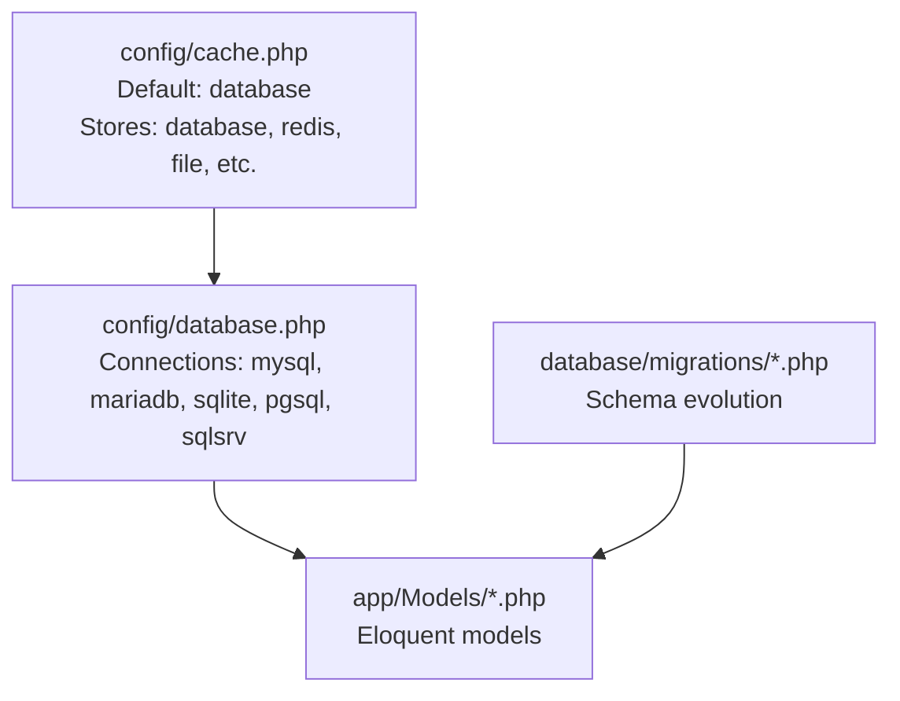
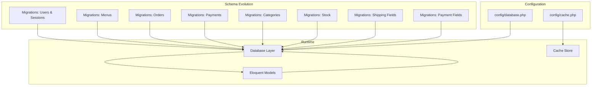
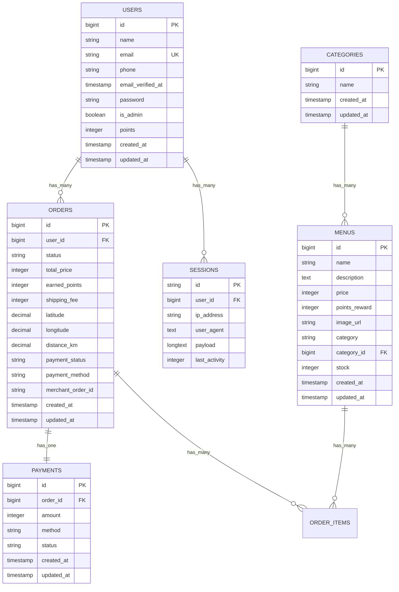
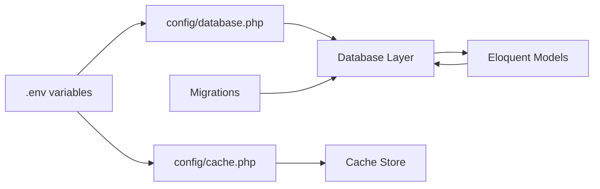

# Database Configuration

<cite>
**Referenced Files in This Document**
- [config/database.php](file://config/database.php)
- [config/cache.php](file://config/cache.php)
- [config/app.php](file://config/app.php)
- [database/migrations/0001_01_01_000000_create_users_table.php](file://database/migrations/0001_01_01_000000_create_users_table.php)
- [database/migrations/2026_04_21_011703_create_menus_table.php](file://database/migrations/2026_04_21_011703_create_menus_table.php)
- [database/migrations/2026_04_21_011703_create_orders_table.php](file://database/migrations/2026_04_21_011703_create_orders_table.php)
- [database/migrations/2026_04_27_021524_add_stock_to_menus_table.php](file://database/migrations/2026_04_27_021524_add_stock_to_menus_table.php)
- [database/migrations/2026_05_15_072236_create_categories_table.php](file://database/migrations/2026_05_15_072236_create_categories_table.php)
- [database/migrations/2026_05_15_072246_create_payments_table.php](file://database/migrations/2026_05_15_072246_create_payments_table.php)
- [database/migrations/2026_05_15_072320_add_category_id_to_menus_table.php](file://database/migrations/2026_05_15_072320_add_category_id_to_menus_table.php)
- [database/migrations/2026_05_18_020058_add_shipping_fields_to_orders_table.php](file://database/migrations/2026_05_18_020058_add_shipping_fields_to_orders_table.php)
- [database/migrations/2026_05_24_000000_add_payment_fields_to_orders_table.php](file://database/migrations/2026_05_24_000000_add_payment_fields_to_orders_table.php)
- [app/Models/User.php](file://app/Models/User.php)
- [app/Models/Menu.php](file://app/Models/Menu.php)
- [app/Models/Order.php](file://app/Models/Order.php)
</cite>

## Table of Contents
1. [Introduction](#introduction)
2. [Project Structure](#project-structure)
3. [Core Components](#core-components)
4. [Architecture Overview](#architecture-overview)
5. [Detailed Component Analysis](#detailed-component-analysis)
6. [Dependency Analysis](#dependency-analysis)
7. [Performance Considerations](#performance-considerations)
8. [Troubleshooting Guide](#troubleshooting-guide)
9. [Conclusion](#conclusion)
10. [Appendices](#appendices)

## Introduction
This document explains the database configuration and connection management for the Kantin Ibu Ida Laravel application. It covers connection parameters for MySQL and MariaDB, charset and collation settings, migration and schema evolution management, environment-specific configuration, and practical guidance for timeouts, retries, health checks, caching, indexing, performance tuning, backup, replication, disaster recovery, and security.

## Project Structure
The database configuration is primarily defined in the framework’s configuration files and applied across Eloquent models and migrations. Key areas:
- Database connections and defaults are configured centrally.
- Cache storage can use the database backend with configurable table/connection.
- Migrations define schema evolution and relationships.
- Eloquent models map to database tables and define relationships.

**Diagram sources**
- [config/database.php:19](file://config/database.php#L19)
- [config/cache.php:18](file://config/cache.php#L18)
- [database/migrations/0001_01_01_000000_create_users_table.php:14](file://database/migrations/0001_01_01_000000_create_users_table.php#L14)
- [app/Models/User.php:10](file://app/Models/User.php#L10)

**Section sources**
- [config/database.php:19](file://config/database.php#L19)
- [config/cache.php:18](file://config/cache.php#L18)

## Core Components
- Default connection: The application selects the default database connection via an environment variable. The default is MySQL when the environment variable is not set.
- MySQL connection: Includes host, port, database name, username, password, unix socket, charset, collation, strict mode, and SSL CA configuration via PDO options.
- MariaDB connection: Mirrors MySQL with MariaDB-specific collation and driver.
- SQLite connection: Local file-based database with foreign key constraint toggle.
- PostgreSQL and SQL Server connections: Included for completeness and environment flexibility.
- Migration repository: Tracks executed migrations and supports publishing with update-on-publish behavior.
- Cache database store: Uses a database-backed cache with configurable table and optional dedicated connection and lock connection.

Practical implications:
- Use environment variables to switch between environments and databases without changing code.
- Charset and collation are set per-driver; ensure client and server compatibility.
- SSL CA setting enables TLS verification for MySQL/MariaDB connections when configured.

**Section sources**
- [config/database.php:19](file://config/database.php#L19)
- [config/database.php:42-60](file://config/database.php#L42-L60)
- [config/database.php:62-80](file://config/database.php#L62-L80)
- [config/database.php:125-128](file://config/database.php#L125-L128)
- [config/cache.php:41-46](file://config/cache.php#L41-L46)

## Architecture Overview
The database layer integrates configuration, migrations, and models. The cache subsystem can leverage the database for persistence, enabling shared state across instances.

**Diagram sources**
- [config/database.php:19](file://config/database.php#L19)
- [config/cache.php:18](file://config/cache.php#L18)
- [database/migrations/0001_01_01_000000_create_users_table.php:14](file://database/migrations/0001_01_01_000000_create_users_table.php#L14)
- [database/migrations/2026_04_21_011703_create_menus_table.php:14](file://database/migrations/2026_04_21_011703_create_menus_table.php#L14)
- [database/migrations/2026_04_21_011703_create_orders_table.php:14](file://database/migrations/2026_04_21_011703_create_orders_table.php#L14)
- [database/migrations/2026_05_15_072246_create_payments_table.php:14](file://database/migrations/2026_05_15_072246_create_payments_table.php#L14)
- [database/migrations/2026_05_15_072236_create_categories_table.php:14](file://database/migrations/2026_05_15_072236_create_categories_table.php#L14)
- [database/migrations/2026_04_27_021524_add_stock_to_menus_table.php:14](file://database/migrations/2026_04_27_021524_add_stock_to_menus_table.php#L14)
- [database/migrations/2026_05_18_020058_add_shipping_fields_to_orders_table.php:14](file://database/migrations/2026_05_18_020058_add_shipping_fields_to_orders_table.php#L14)
- [database/migrations/2026_05_24_000000_add_payment_fields_to_orders_table.php:11](file://database/migrations/2026_05_24_000000_add_payment_fields_to_orders_table.php#L11)

## Detailed Component Analysis

### Database Connection Configuration
- Default connection selection is environment-driven.
- MySQL/MariaDB sections define:
  - Host, port, database, username, password, unix socket
  - Charset and collation tailored to the driver
  - Strict mode enabled
  - Optional SSL CA via PDO options
- SQLite connection supports local file path and foreign key constraints toggle.
- PostgreSQL and SQL Server entries are present for multi-database support.

Operational guidance:
- Use environment variables to override defaults for development, staging, and production.
- For MySQL/MariaDB TLS, set the SSL CA path via the appropriate environment variable to enable certificate verification.

**Section sources**
- [config/database.php:19](file://config/database.php#L19)
- [config/database.php:42-60](file://config/database.php#L42-L60)
- [config/database.php:62-80](file://config/database.php#L62-L80)
- [config/database.php:34-40](file://config/database.php#L34-L40)

### Migration Setup and Schema Evolution
The migration system tracks executed migrations and defines evolving schemas:
- Initial users and sessions tables with indexes and constraints.
- Menus table with identifiers, pricing, rewards, image URL, and category.
- Orders table with user relationship, status, totals, and points.
- Payments table linked to orders with amount, method, and status.
- Categories table for menu categorization.
- Stock column addition to menus.
- Shipping fields added to orders (fee, latitude, longitude, distance).
- Payment metadata added to orders (status, method, merchant order ID).

Key observations:
- Foreign keys and cascading behavior are explicitly defined in migrations.
- Indexes are created on foreign keys and frequently queried columns (e.g., user_id in sessions).
- Column additions preserve existing data while extending functionality.

**Diagram sources**
- [database/migrations/0001_01_01_000000_create_users_table.php:14-40](file://database/migrations/0001_01_01_000000_create_users_table.php#L14-L40)
- [database/migrations/2026_04_21_011703_create_menus_table.php:14-23](file://database/migrations/2026_04_21_011703_create_menus_table.php#L14-L23)
- [database/migrations/2026_04_21_011703_create_orders_table.php:14-21](file://database/migrations/2026_04_21_011703_create_orders_table.php#L14-L21)
- [database/migrations/2026_05_15_072246_create_payments_table.php:14-21](file://database/migrations/2026_05_15_072246_create_payments_table.php#L14-L21)
- [database/migrations/2026_05_15_072236_create_categories_table.php:14-18](file://database/migrations/2026_05_15_072236_create_categories_table.php#L14-L18)
- [database/migrations/2026_04_27_021524_add_stock_to_menus_table.php:14-16](file://database/migrations/2026_04_27_021524_add_stock_to_menus_table.php#L14-L16)
- [database/migrations/2026_05_18_020058_add_shipping_fields_to_orders_table.php:14-19](file://database/migrations/2026_05_18_020058_add_shipping_fields_to_orders_table.php#L14-L19)
- [database/migrations/2026_05_24_000000_add_payment_fields_to_orders_table.php:11-15](file://database/migrations/2026_05_24_000000_add_payment_fields_to_orders_table.php#L11-L15)

**Section sources**
- [database/migrations/0001_01_01_000000_create_users_table.php:14-40](file://database/migrations/0001_01_01_000000_create_users_table.php#L14-L40)
- [database/migrations/2026_04_21_011703_create_menus_table.php:14-23](file://database/migrations/2026_04_21_011703_create_menus_table.php#L14-L23)
- [database/migrations/2026_04_21_011703_create_orders_table.php:14-21](file://database/migrations/2026_04_21_011703_create_orders_table.php#L14-L21)
- [database/migrations/2026_05_15_072246_create_payments_table.php:14-21](file://database/migrations/2026_05_15_072246_create_payments_table.php#L14-L21)
- [database/migrations/2026_05_15_072236_create_categories_table.php:14-18](file://database/migrations/2026_05_15_072236_create_categories_table.php#L14-L18)
- [database/migrations/2026_04_27_021524_add_stock_to_menus_table.php:14-16](file://database/migrations/2026_04_27_021524_add_stock_to_menus_table.php#L14-L16)
- [database/migrations/2026_05_18_020058_add_shipping_fields_to_orders_table.php:14-19](file://database/migrations/2026_05_18_020058_add_shipping_fields_to_orders_table.php#L14-L19)
- [database/migrations/2026_05_24_000000_add_payment_fields_to_orders_table.php:11-15](file://database/migrations/2026_05_24_000000_add_payment_fields_to_orders_table.php#L11-L15)

### Environment-Specific Settings
Environment variables drive database connectivity and behavior:
- Connection type, host, port, database name, username, password, unix socket, charset, collation, and SSL CA.
- Cache table name and optional dedicated cache/connection/lock connections.
- Migration table name and update-on-publish behavior.

Recommendations:
- Define environment-specific variables per deployment target.
- Keep secrets out of version control; rely on environment variables for credentials and sensitive paths.

**Section sources**
- [config/database.php:42-60](file://config/database.php#L42-L60)
- [config/database.php:62-80](file://config/database.php#L62-L80)
- [config/cache.php:41-46](file://config/cache.php#L41-L46)
- [config/database.php:125-128](file://config/database.php#L125-L128)

### Connection Timeouts, Retries, and Health Checks
- The configuration does not expose explicit connection timeout or retry parameters in the database configuration file.
- Health checks are not implemented in the configuration; they can be added at runtime or via external monitoring.

Guidance:
- For production, implement application-level retry logic around database operations with exponential backoff.
- Add periodic health probes to verify connectivity and basic query execution.
- Consider connection pooling at the infrastructure level (e.g., proxy or driver-managed pools) if applicable.

**Section sources**
- [config/database.php:42-60](file://config/database.php#L42-L60)
- [config/database.php:62-80](file://config/database.php#L62-L80)

### Query Caching, Indexing, and Performance Tuning
- Database cache store: The cache subsystem can persist to the database using a configurable table and optional dedicated connection and lock connection.
- Indexing: Migrations create indexes on foreign keys and frequently accessed columns (e.g., user_id in sessions).
- Performance tuning parameters: Charset and collation are set per driver; strict mode is enabled for MySQL/MariaDB.

Recommendations:
- Enable database cache store for distributed deployments requiring shared cache state.
- Add composite indexes for frequent join and filter patterns observed in queries.
- Monitor slow query logs and query execution plans; adjust indexes and queries accordingly.
- Tune MySQL/MariaDB server-side parameters (buffer sizes, innodb settings) outside this configuration as needed.

**Section sources**
- [config/cache.php:41-46](file://config/cache.php#L41-L46)
- [database/migrations/0001_01_01_000000_create_users_table.php:33-40](file://database/migrations/0001_01_01_000000_create_users_table.php#L33-L40)

### Backup, Replication, and Disaster Recovery
- The configuration does not define backup, replication, or DR settings.
- Implement offloading backups to external systems and maintain point-in-time recovery procedures.
- For high availability, deploy read replicas and route reads/writes accordingly at the application level or via infrastructure.

[No sources needed since this section provides general guidance]

### Security: Encryption, Credential Management, and Access Control
- TLS for MySQL/MariaDB: SSL CA can be configured via environment variable to enable certificate verification.
- Credential management: Credentials are sourced from environment variables; ensure secure secret management in your deployment platform.
- Access control: Restrict database user privileges to least-privilege requirements; separate accounts for migrations, application reads/writes, and administrative tasks.

**Section sources**
- [config/database.php:57-59](file://config/database.php#L57-L59)
- [config/database.php:77-79](file://config/database.php#L77-L79)

## Dependency Analysis
The application’s database dependencies center on configuration, migrations, and models. The cache subsystem optionally depends on the database for persistence.

**Diagram sources**
- [config/database.php:19](file://config/database.php#L19)
- [config/cache.php:18](file://config/cache.php#L18)

**Section sources**
- [config/database.php:19](file://config/database.php#L19)
- [config/cache.php:18](file://config/cache.php#L18)

## Performance Considerations
- Use the database-backed cache store to reduce load and enable shared state across instances.
- Ensure charset and collation match client expectations to avoid conversion overhead.
- Apply strict mode for MySQL/MariaDB to enforce data integrity.
- Monitor and optimize queries using indexes derived from migration patterns and application usage.

[No sources needed since this section provides general guidance]

## Troubleshooting Guide
Common issues and remedies:
- Connection failures:
  - Verify host, port, database name, username, and password environment variables.
  - Confirm network reachability and firewall rules.
- Charset/collation mismatches:
  - Align client charset and collation with server configuration.
  - For MySQL/MariaDB, ensure the selected collation is supported by the server version.
- TLS handshake errors:
  - Provide a valid SSL CA path via the environment variable and ensure the certificate chain is complete.
- Slow queries:
  - Review migration indexes and add missing indexes for joins and filters.
  - Use EXPLAIN to analyze query plans and optimize accordingly.
- Cache inconsistencies:
  - Confirm cache table exists and is writable.
  - Verify cache store configuration and optional dedicated connections.

**Section sources**
- [config/database.php:42-60](file://config/database.php#L42-L60)
- [config/database.php:62-80](file://config/database.php#L62-L80)
- [config/cache.php:41-46](file://config/cache.php#L41-L46)

## Conclusion
The Kantin Ibu Ida application’s database configuration is environment-driven and supports multiple database engines. MySQL and MariaDB are configured with charset, collation, strict mode, and optional TLS verification. Migrations define a clear schema evolution path with indexes and foreign keys. The cache subsystem can persist to the database for shared state. For production, complement this configuration with operational practices for timeouts, retries, health checks, backups, replication, and robust security measures.

[No sources needed since this section summarizes without analyzing specific files]

## Appendices

### Appendix A: Environment Variables Reference
- Database connection and credentials:
  - DB_CONNECTION, DB_URL, DB_HOST, DB_PORT, DB_DATABASE, DB_USERNAME, DB_PASSWORD, DB_SOCKET
  - DB_CHARSET, DB_COLLATION
  - MYSQL_ATTR_SSL_CA (for MySQL/MariaDB TLS)
- Cache store:
  - CACHE_STORE, DB_CACHE_TABLE, DB_CACHE_CONNECTION, DB_CACHE_LOCK_CONNECTION
- Migration repository:
  - MIGRATIONS_TABLE (via configuration key)
- Application maintenance:
  - APP_MAINTENANCE_DRIVER, APP_MAINTENANCE_STORE

**Section sources**
- [config/database.php:19](file://config/database.php#L19)
- [config/database.php:42-60](file://config/database.php#L42-L60)
- [config/database.php:62-80](file://config/database.php#L62-L80)
- [config/cache.php:18](file://config/cache.php#L18)
- [config/cache.php:41-46](file://config/cache.php#L41-L46)
- [config/database.php:125-128](file://config/database.php#L125-L128)