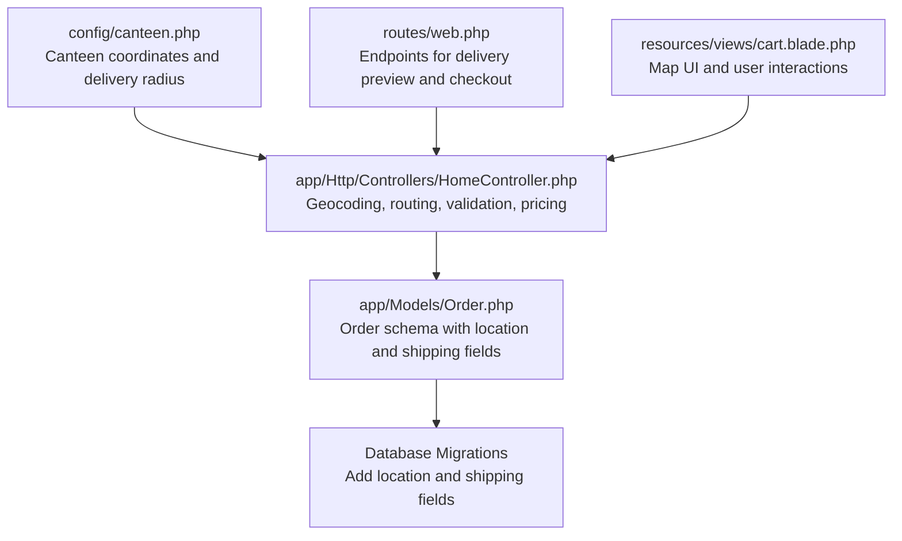
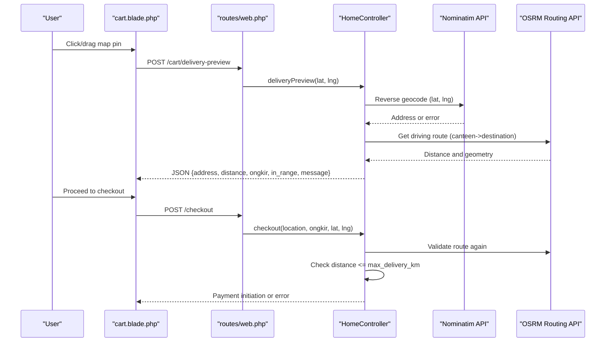
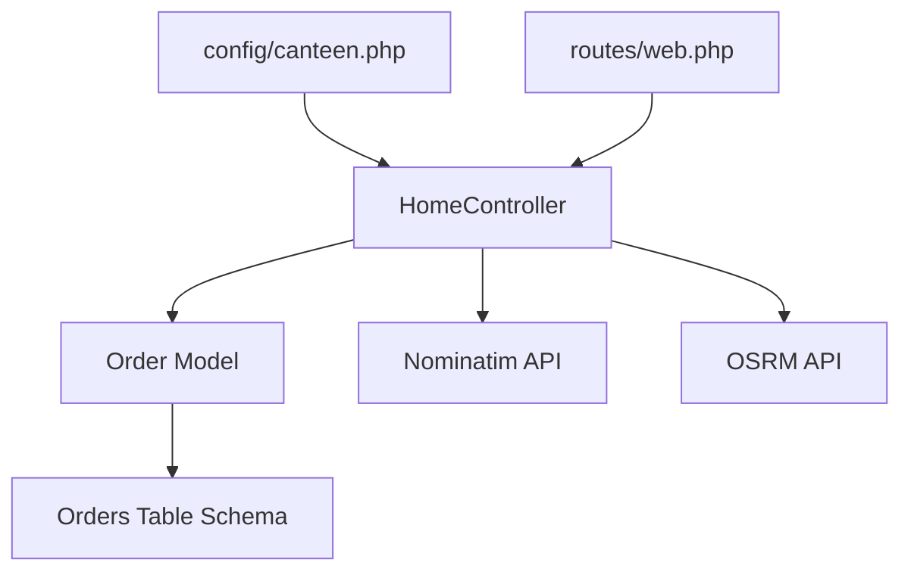

# Location Services Configuration

<cite>
**Referenced Files in This Document**
- [canteen.php](file://config/canteen.php)
- [HomeController.php](file://app/Http/Controllers/HomeController.php)
- [Order.php](file://app/Models/Order.php)
- [web.php](file://routes/web.php)
- [cart.blade.php](file://resources/views/cart.blade.php)
- [2026_05_18_020058_add_shipping_fields_to_orders_table.php](file://database/migrations/2026_05_18_020058_add_shipping_fields_to_orders_table.php)
- [2026_04_27_022651_add_location_to_orders_table.php](file://database/migrations/2026_04_27_022651_add_location_to_orders_table.php)
- [app.php](file://bootstrap/app.php)
</cite>

## Table of Contents
1. [Introduction](#introduction)
2. [Project Structure](#project-structure)
3. [Core Components](#core-components)
4. [Architecture Overview](#architecture-overview)
5. [Detailed Component Analysis](#detailed-component-analysis)
6. [Dependency Analysis](#dependency-analysis)
7. [Performance Considerations](#performance-considerations)
8. [Troubleshooting Guide](#troubleshooting-guide)
9. [Conclusion](#conclusion)

## Introduction
This document provides comprehensive guidance for configuring and operating the location-based services in the Kantin Ibu Ida system. It focuses on canteen configuration, geocoding integration with OpenStreetMap Nominatim, routing via OSRM, delivery area validation, pricing calculations, and operational boundaries. The implementation centers around the Home Controller's delivery preview and checkout flows, with supporting configuration files and database schema.

## Project Structure
The location services span configuration, controller logic, frontend views, and database schema:
- Configuration: canteen.php defines canteen coordinates and delivery radius
- Controller: HomeController orchestrates geocoding, routing, validation, and pricing
- Frontend: cart.blade.php renders the map and handles user interactions
- Routes: web.php exposes delivery preview and checkout endpoints
- Database: migrations add location and shipping fields to orders

**Diagram sources**
- [canteen.php:1-8](file://config/canteen.php#L1-L8)
- [HomeController.php:127-190](file://app/Http/Controllers/HomeController.php#L127-L190)
- [cart.blade.php:63-104](file://resources/views/cart.blade.php#L63-L104)
- [web.php:39-42](file://routes/web.php#L39-L42)
- [Order.php:12-24](file://app/Models/Order.php#L12-L24)
- [2026_05_18_020058_add_shipping_fields_to_orders_table.php:14-18](file://database/migrations/2026_05_18_020058_add_shipping_fields_to_orders_table.php#L14-L18)

**Section sources**
- [canteen.php:1-8](file://config/canteen.php#L1-L8)
- [HomeController.php:127-190](file://app/Http/Controllers/HomeController.php#L127-L190)
- [cart.blade.php:63-104](file://resources/views/cart.blade.php#L63-L104)
- [web.php:39-42](file://routes/web.php#L39-L42)
- [Order.php:12-24](file://app/Models/Order.php#L12-L24)
- [2026_05_18_020058_add_shipping_fields_to_orders_table.php:14-18](file://database/migrations/2026_05_18_020058_add_shipping_fields_to_orders_table.php#L14-L18)

## Core Components
- Canteen configuration: name, latitude, longitude, and maximum delivery radius
- Delivery preview: reverse geocoding with Nominatim and driving route calculation via OSRM
- Validation: distance checks against configured maximum delivery radius
- Pricing: distance-based shipping fee calculation
- Persistence: order model extended with location, coordinates, distance, and shipping fee

Key configuration and implementation points:
- Canteen coordinates and delivery radius are loaded from config/canteen.php
- Delivery preview endpoint validates coordinates and requests geocoding and routing
- Checkout endpoint revalidates distance and persists order metadata

**Section sources**
- [canteen.php:3-8](file://config/canteen.php#L3-L8)
- [HomeController.php:127-190](file://app/Http/Controllers/HomeController.php#L127-L190)
- [HomeController.php:275-301](file://app/Http/Controllers/HomeController.php#L275-L301)
- [Order.php:12-24](file://app/Models/Order.php#L12-L24)

## Architecture Overview
The location services architecture integrates frontend map interactions, backend validation, and external APIs for geocoding and routing.

**Diagram sources**
- [cart.blade.php:144-153](file://resources/views/cart.blade.php#L144-L153)
- [web.php:39-42](file://routes/web.php#L39-L42)
- [HomeController.php:127-190](file://app/Http/Controllers/HomeController.php#L127-L190)
- [HomeController.php:275-301](file://app/Http/Controllers/HomeController.php#L275-L301)

## Detailed Component Analysis

### Canteen Configuration
The canteen configuration defines the central pickup location and delivery constraints:
- Name: configurable via environment variable
- Latitude and Longitude: used as the origin for routing
- Maximum delivery radius in kilometers: used to validate delivery feasibility

Operational implications:
- Changing coordinates affects all distance calculations and route determinations
- Adjusting the maximum delivery radius impacts order acceptance during checkout

**Section sources**
- [canteen.php:3-8](file://config/canteen.php#L3-L8)

### Geocoding Service Integration (OpenStreetMap Nominatim)
Reverse geocoding is performed to derive human-readable addresses from coordinates:
- Endpoint: https://nominatim.openstreetmap.org/reverse
- Request includes: format=json, lat, lon, zoom, addressdetails
- Headers include: User-Agent and Accept
- Timeout: 5 seconds
- Error handling: captures exceptions and sets a default geocode error message when address retrieval fails

Validation rules:
- Coordinates are validated server-side for range and numeric format
- If geocoding fails, the system still computes distance and shipping fee but marks address as unavailable

**Section sources**
- [HomeController.php:140-163](file://app/Http/Controllers/HomeController.php#L140-L163)

### Routing Service Configuration (OSRM)
Driving route calculation determines distance and geometry for the selected destination:
- Endpoint: https://router.project-osrm.org/route/v1/driving/{fromLon},{fromLat};{toLon},{toLat}
- Parameters: overview=full, geometries=geojson, alternatives=false, steps=false
- Timeout: 6 seconds with retry delay of 300ms
- Response parsing: extracts distance (meters) and geometry; converts distance to kilometers

Validation:
- Route must be successful and contain distance and geometry
- Distance is rounded for display and compared against maximum delivery radius

**Section sources**
- [HomeController.php:514-545](file://app/Http/Controllers/HomeController.php#L514-L545)

### Address Validation and Delivery Area Restrictions
Address validation and delivery area checks occur in two stages:
- Delivery preview: validates coordinates, attempts geocoding, calculates distance, and checks against max delivery radius
- Checkout: recalculates route, verifies distance does not exceed max delivery radius, and persists order metadata

Rules:
- Coordinates must be within valid ranges
- Delivery is accepted only if distance <= configured maximum
- If geocoding fails but routing succeeds, the system prompts manual address entry

**Section sources**
- [HomeController.php:127-190](file://app/Http/Controllers/HomeController.php#L127-L190)
- [HomeController.php:275-301](file://app/Http/Controllers/HomeController.php#L275-L301)

### Location-Based Pricing Calculations
Shipping fee is calculated based on distance:
- Formula: ceil(distance_km × 2) × 5000
- The result is cast to integer and applied to the order
- Display rounding: distances are rounded to two decimal places for user feedback

Integration:
- Used in delivery preview to estimate shipping cost
- Applied during checkout to set order shipping fee and total price

**Section sources**
- [HomeController.php:547-550](file://app/Http/Controllers/HomeController.php#L547-L550)

### Fallback Locations, Service Area Expansion, and Geographic Boundaries
Current implementation supports:
- Fallback behavior when geocoding fails: user can manually enter address; distance-based shipping remains functional
- Service area controlled by max delivery radius; expansion requires adjusting configuration
- Geographic boundaries enforced by coordinate validation and distance checks

Recommendations:
- To expand service areas, increase CANTEEN_MAX_DELIVERY_KM
- For fallback scenarios, ensure manual address entry remains supported post-delivery preview
- Monitor external API availability and adjust timeouts accordingly

**Section sources**
- [HomeController.php:161-178](file://app/Http/Controllers/HomeController.php#L161-L178)
- [canteen.php:7](file://config/canteen.php#L7)

### Frontend Map Interaction and Delivery Preview
The frontend map initializes at the canteen coordinates and allows users to select delivery locations:
- Map tiles from OpenStreetMap
- Red marker for canteen, blue draggable marker for buyer
- On drag or click, updates delivery preview via AJAX
- Draws route geometry returned by backend

User experience:
- Real-time feedback on distance, shipping cost, and in-range status
- Clear messaging for out-of-range or preview errors

**Section sources**
- [cart.blade.php:63-104](file://resources/views/cart.blade.php#L63-L104)
- [cart.blade.php:114-200](file://resources/views/cart.blade.php#L114-L200)
- [cart.blade.php:201-214](file://resources/views/cart.blade.php#L201-L214)

### Order Data Model and Persistence
The order model stores location metadata and shipping details:
- Fields: location (text), shipping_fee (integer), latitude (decimal), longitude (decimal), distance_km (decimal)
- Migrations add these fields to the orders table

Persistence behavior:
- During checkout, location, coordinates, distance_km, and shipping_fee are saved
- Total price reflects base item cost plus shipping fee

**Section sources**
- [Order.php:12-24](file://app/Models/Order.php#L12-L24)
- [2026_05_18_020058_add_shipping_fields_to_orders_table.php:14-18](file://database/migrations/2026_05_18_020058_add_shipping_fields_to_orders_table.php#L14-L18)

## Dependency Analysis
The location services depend on configuration, controller logic, routes, and database schema. External dependencies include Nominatim and OSRM.

**Diagram sources**
- [canteen.php:3-8](file://config/canteen.php#L3-L8)
- [HomeController.php:127-190](file://app/Http/Controllers/HomeController.php#L127-L190)
- [web.php:39-42](file://routes/web.php#L39-L42)
- [Order.php:12-24](file://app/Models/Order.php#L12-L24)

**Section sources**
- [canteen.php:3-8](file://config/canteen.php#L3-L8)
- [HomeController.php:127-190](file://app/Http/Controllers/HomeController.php#L127-L190)
- [web.php:39-42](file://routes/web.php#L39-L42)
- [Order.php:12-24](file://app/Models/Order.php#L12-L24)

## Performance Considerations
- API timeouts: Nominatim uses a 5-second timeout; OSRM uses a 6-second timeout with retry
- Route caching: Consider caching frequent route queries per destination to reduce external API calls
- Coordinate precision: Decimal field sizes balance accuracy and storage efficiency
- Frontend responsiveness: Debounce map interactions to avoid excessive AJAX requests

## Troubleshooting Guide
Common issues and resolutions:
- Geocoding failures: Verify Nominatim endpoint accessibility and network connectivity; check User-Agent header requirements
- Route calculation failures: Confirm OSRM endpoint availability; ensure coordinates are valid and on road network
- Out-of-range deliveries: Increase CANTEEN_MAX_DELIVERY_KM in configuration; validate coordinate selection near roads
- Manual address fallback: Encourage users to enter address manually when automatic geocoding fails
- CSRF validation: Ensure CSRF token is included in AJAX requests; CSRF validation is disabled for the callback endpoint

**Section sources**
- [HomeController.php:140-163](file://app/Http/Controllers/HomeController.php#L140-L163)
- [HomeController.php:514-545](file://app/Http/Controllers/HomeController.php#L514-L545)
- [HomeController.php:295-301](file://app/Http/Controllers/HomeController.php#L295-L301)
- [app.php:17-19](file://bootstrap/app.php#L17-L19)

## Conclusion
The Kantin Ibu Ida location services leverage configuration-driven canteen settings, robust geocoding with Nominatim, reliable routing via OSRM, and strict delivery validation against a configurable maximum radius. The system balances automation with user-friendly fallbacks, ensuring reliable delivery previews and checkout experiences. Administrators can expand service areas by adjusting configuration while maintaining strong validation and clear user feedback.