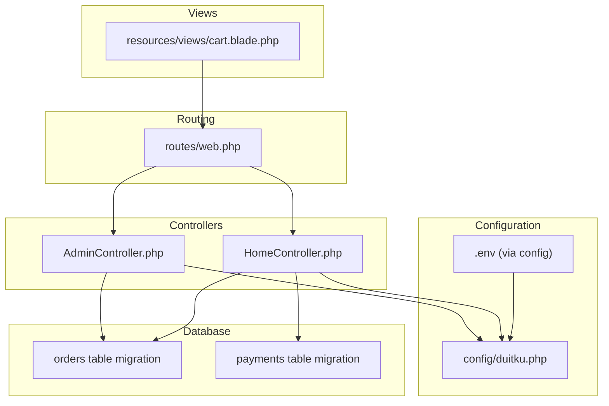
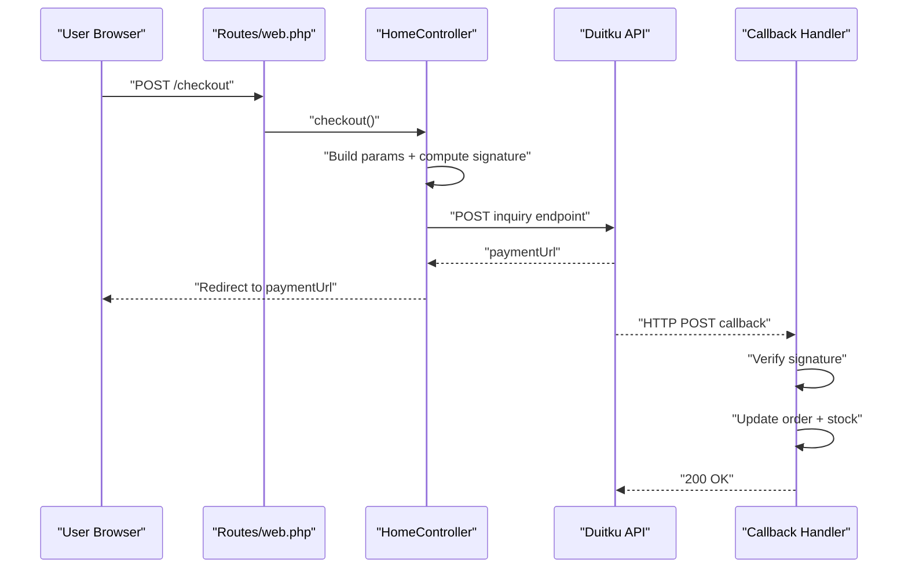
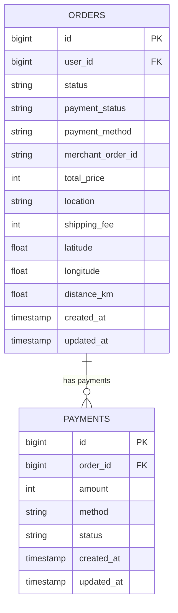
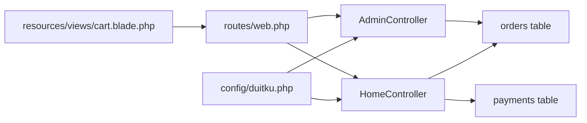

# Payment Configuration

<cite>
**Referenced Files in This Document**
- [config/duitku.php](file://config/duitku.php)
- [routes/web.php](file://routes/web.php)
- [app/Http/Controllers/HomeController.php](file://app/Http/Controllers/HomeController.php)
- [app/Http/Controllers/AdminController.php](file://app/Http/Controllers/AdminController.php)
- [database/migrations/2026_05_15_072246_create_payments_table.php](file://database/migrations/2026_05_15_072246_create_payments_table.php)
- [database/migrations/2026_05_24_000000_add_payment_fields_to_orders_table.php](file://database/migrations/2026_05_24_000000_add_payment_fields_to_orders_table.php)
- [app/Models/Order.php](file://app/Models/Order.php)
- [resources/views/cart.blade.php](file://resources/views/cart.blade.php)
- [config/canteen.php](file://config/canteen.php)
</cite>

## Table of Contents
1. [Introduction](#introduction)
2. [Project Structure](#project-structure)
3. [Core Components](#core-components)
4. [Architecture Overview](#architecture-overview)
5. [Detailed Component Analysis](#detailed-component-analysis)
6. [Dependency Analysis](#dependency-analysis)
7. [Performance Considerations](#performance-considerations)
8. [Troubleshooting Guide](#troubleshooting-guide)
9. [Conclusion](#conclusion)
10. [Appendices](#appendices)

## Introduction
This document explains how the Kantin Ibu Ida system integrates with the Duitku payment gateway. It covers configuration of the Duitku SDK in the Laravel application, endpoint selection for sandbox versus production, callback and return URL handling, payment method and currency behavior, transaction timeouts, and security measures such as signature verification. It also documents the payment-related database schema and the end-to-end transaction lifecycle.

## Project Structure
The payment integration spans configuration, routing, controllers, views, and database migrations. The most relevant parts are:
- Duitku configuration loaded from environment variables
- Web routes for checkout, callback, and success redirection
- Controllers orchestrating payment requests and callbacks
- Blade view initiating checkout and rendering payment options
- Database schema supporting payments and order payment metadata

**Diagram sources**
- [config/duitku.php:1-12](file://config/duitku.php#L1-L12)
- [routes/web.php:1-71](file://routes/web.php#L1-L71)
- [app/Http/Controllers/HomeController.php:340-408](file://app/Http/Controllers/HomeController.php#L340-L408)
- [app/Http/Controllers/AdminController.php:177-246](file://app/Http/Controllers/AdminController.php#L177-L246)
- [resources/views/cart.blade.php:266-317](file://resources/views/cart.blade.php#L266-L317)
- [database/migrations/2026_05_15_072246_create_payments_table.php:14-21](file://database/migrations/2026_05_15_072246_create_payments_table.php#L14-L21)
- [database/migrations/2026_05_24_000000_add_payment_fields_to_orders_table.php:11-15](file://database/migrations/2026_05_24_000000_add_payment_fields_to_orders_table.php#L11-L15)

**Section sources**
- [config/duitku.php:1-12](file://config/duitku.php#L1-L12)
- [routes/web.php:1-71](file://routes/web.php#L1-L71)
- [app/Http/Controllers/HomeController.php:340-408](file://app/Http/Controllers/HomeController.php#L340-L408)
- [app/Http/Controllers/AdminController.php:177-246](file://app/Http/Controllers/AdminController.php#L177-L246)
- [resources/views/cart.blade.php:266-317](file://resources/views/cart.blade.php#L266-L317)
- [database/migrations/2026_05_15_072246_create_payments_table.php:14-21](file://database/migrations/2026_05_15_072246_create_payments_table.php#L14-L21)
- [database/migrations/2026_05_24_000000_add_payment_fields_to_orders_table.php:11-15](file://database/migrations/2026_05_24_000000_add_payment_fields_to_orders_table.php#L11-L15)

## Core Components
- Duitku configuration provider: merchant code, API key, environment, callback and return URLs, and endpoints for sandbox and production.
- Checkout controller: prepares payment parameters, computes signatures, posts to Duitku, and returns a payment URL.
- Callback handler: verifies signatures, updates order state, and adjusts inventory.
- Routes: expose checkout, callback, and success endpoints.
- View: collects payment method and location, triggers checkout, and opens the Duitku payment page.
- Database schema: supports payment records and order payment metadata.

Key configuration keys and behaviors:
- Merchant code and API key are required for all requests.
- Environment selects sandbox or production endpoints.
- Callback and return URLs are resolved from configuration or named routes.
- Signature verification ensures authenticity of incoming notifications.
- Expiry period is set to 60 minutes for transactions.

**Section sources**
- [config/duitku.php:3-11](file://config/duitku.php#L3-L11)
- [app/Http/Controllers/HomeController.php:343-381](file://app/Http/Controllers/HomeController.php#L343-L381)
- [app/Http/Controllers/HomeController.php:410-452](file://app/Http/Controllers/HomeController.php#L410-L452)
- [routes/web.php:43-50](file://routes/web.php#L43-L50)
- [resources/views/cart.blade.php:409-422](file://resources/views/cart.blade.php#L409-L422)
- [database/migrations/2026_05_24_000000_add_payment_fields_to_orders_table.php:11-15](file://database/migrations/2026_05_24_000000_add_payment_fields_to_orders_table.php#L11-L15)

## Architecture Overview
The payment flow involves the client browser, the Laravel backend, and the Duitku API. The frontend initiates checkout, the backend constructs a signed request to Duitku, receives a payment URL, and redirects the user. Duitku calls the configured callback URL upon completion, and the backend validates the signature and updates the order.

**Diagram sources**
- [routes/web.php:42-50](file://routes/web.php#L42-L50)
- [app/Http/Controllers/HomeController.php:340-408](file://app/Http/Controllers/HomeController.php#L340-L408)
- [app/Http/Controllers/HomeController.php:410-452](file://app/Http/Controllers/HomeController.php#L410-L452)

## Detailed Component Analysis

### Duitku Configuration
- Merchant code and API key are loaded from environment variables via the configuration array.
- Environment defaults to sandbox but switches to production when explicitly set.
- Callback and return URLs are optional; if unset, fallback routes are used.
- Endpoints are defined for sandbox and production modes.

Operational notes:
- Ensure both merchant code and API key are present; otherwise, checkout returns a configuration error.
- Environment selection determines which endpoint is used for the inquiry request.

**Section sources**
- [config/duitku.php:3-11](file://config/duitku.php#L3-L11)
- [app/Http/Controllers/HomeController.php:559-566](file://app/Http/Controllers/HomeController.php#L559-L566)
- [app/Http/Controllers/AdminController.php:248-255](file://app/Http/Controllers/AdminController.php#L248-L255)

### Checkout Flow (Customer)
- The view presents payment method selection (QRIS and Virtual Account).
- On submit, the frontend calls the checkout endpoint with payment method, location, and shipping details.
- The controller builds the payload, computes the signature, posts to the selected Duitku endpoint, and returns the payment URL.
- The browser is redirected to the Duitku payment page.

Parameters and behavior:
- Payment amount is derived from the order total price.
- Merchant order ID is constructed from the order ID and timestamp.
- Expiry period is set to 60 minutes.
- Payment method is taken from the order or request.
- Item details are prepared but intentionally omitted to avoid mismatch errors.

**Section sources**
- [resources/views/cart.blade.php:409-422](file://resources/views/cart.blade.php#L409-L422)
- [app/Http/Controllers/HomeController.php:340-408](file://app/Http/Controllers/HomeController.php#L340-L408)

### POS Checkout Flow (Admin)
- Admin creates an order for walk-in customers, sets payment method, and triggers Duitku checkout.
- The process mirrors customer checkout with signature computation and endpoint selection.
- Return URL defaults to the admin cashier page.

**Section sources**
- [app/Http/Controllers/AdminController.php:177-246](file://app/Http/Controllers/AdminController.php#L177-L246)

### Callback and Signature Verification
- Duitku calls the configured callback URL with payment details.
- The handler reconstructs the expected signature and compares it with the received signature.
- On successful verification and a successful result code, the order is marked paid, status updated, and inventory decremented.
- If the order location exceeds the maximum delivery range, the callback rejects the notification.

Security considerations:
- Signature verification prevents spoofed notifications.
- The callback checks the result code and order existence/status before updating.

**Section sources**
- [routes/web.php:50](file://routes/web.php#L50)
- [app/Http/Controllers/HomeController.php:410-452](file://app/Http/Controllers/HomeController.php#L410-L452)

### Payment Methods and Currency
- Payment methods supported by the view include QRIS and Virtual Account.
- The system does not explicitly set a currency; amounts are sent as integer values representing local currency units.

**Section sources**
- [resources/views/cart.blade.php:410-421](file://resources/views/cart.blade.php#L410-L421)
- [app/Http/Controllers/HomeController.php:365-381](file://app/Http/Controllers/HomeController.php#L365-L381)

### Transaction Timeout
- Expiry period is set to 60 minutes for all checkout requests.

**Section sources**
- [app/Http/Controllers/HomeController.php:352](file://app/Http/Controllers/HomeController.php#L352)
- [app/Http/Controllers/AdminController.php:190](file://app/Http/Controllers/AdminController.php#L190)

### Success Redirect
- The success route redirects to the home page with a success message.
- The view also includes a hidden form targeting the success route for convenience.

**Section sources**
- [routes/web.php:43-47](file://routes/web.php#L43-L47)
- [resources/views/cart.blade.php:434-436](file://resources/views/cart.blade.php#L434-L436)

### Database Schema and Lifecycle
- Orders table extended with payment_status, payment_method, and merchant_order_id to track payment lifecycle.
- A separate payments table exists for payment records, though checkout primarily updates order payment metadata.
- Inventory is decremented after successful payment callbacks.

**Diagram sources**
- [database/migrations/2026_05_24_000000_add_payment_fields_to_orders_table.php:11-15](file://database/migrations/2026_05_24_000000_add_payment_fields_to_orders_table.php#L11-L15)
- [database/migrations/2026_05_15_072246_create_payments_table.php:14-21](file://database/migrations/2026_05_15_072246_create_payments_table.php#L14-L21)
- [app/Models/Order.php:12-24](file://app/Models/Order.php#L12-L24)

**Section sources**
- [database/migrations/2026_05_24_000000_add_payment_fields_to_orders_table.php:11-15](file://database/migrations/2026_05_24_000000_add_payment_fields_to_orders_table.php#L11-L15)
- [database/migrations/2026_05_15_072246_create_payments_table.php:14-21](file://database/migrations/2026_05_15_072246_create_payments_table.php#L14-L21)
- [app/Models/Order.php:12-24](file://app/Models/Order.php#L12-L24)

## Dependency Analysis
- Controllers depend on the Duitku configuration for credentials and endpoints.
- Routes connect frontend actions to controller methods.
- Views depend on routes for AJAX endpoints and success redirection.
- Database migrations define the schema used by controllers to persist payment state.

**Diagram sources**
- [config/duitku.php:3-11](file://config/duitku.php#L3-L11)
- [routes/web.php:42-50](file://routes/web.php#L42-L50)
- [app/Http/Controllers/HomeController.php:340-408](file://app/Http/Controllers/HomeController.php#L340-L408)
- [app/Http/Controllers/AdminController.php:177-246](file://app/Http/Controllers/AdminController.php#L177-L246)
- [resources/views/cart.blade.php:289-317](file://resources/views/cart.blade.php#L289-L317)
- [database/migrations/2026_05_24_000000_add_payment_fields_to_orders_table.php:11-15](file://database/migrations/2026_05_24_000000_add_payment_fields_to_orders_table.php#L11-L15)
- [database/migrations/2026_05_15_072246_create_payments_table.php:14-21](file://database/migrations/2026_05_15_072246_create_payments_table.php#L14-L21)

**Section sources**
- [config/duitku.php:3-11](file://config/duitku.php#L3-L11)
- [routes/web.php:42-50](file://routes/web.php#L42-L50)
- [app/Http/Controllers/HomeController.php:340-408](file://app/Http/Controllers/HomeController.php#L340-L408)
- [app/Http/Controllers/AdminController.php:177-246](file://app/Http/Controllers/AdminController.php#L177-L246)
- [resources/views/cart.blade.php:289-317](file://resources/views/cart.blade.php#L289-L317)
- [database/migrations/2026_05_24_000000_add_payment_fields_to_orders_table.php:11-15](file://database/migrations/2026_05_24_000000_add_payment_fields_to_orders_table.php#L11-L15)
- [database/migrations/2026_05_15_072246_create_payments_table.php:14-21](file://database/migrations/2026_05_15_072246_create_payments_table.php#L14-L21)

## Performance Considerations
- Signature computation is lightweight and occurs synchronously during checkout and callback handling.
- HTTP requests to Duitku are synchronous; consider asynchronous processing for high-volume scenarios.
- Callback rejection for out-of-range orders avoids unnecessary updates and maintains data consistency.

## Troubleshooting Guide
Common issues and resolutions:
- Missing configuration: If merchant code or API key is empty, checkout returns a configuration error. Set both values and clear configuration cache.
- Invalid signature: Ensure the signature calculation matches the documented algorithm and that the API key is correct.
- Out-of-range orders: Callback rejects notifications if the order distance exceeds the maximum delivery threshold.
- Endpoint confusion: Verify environment setting to ensure sandbox or production endpoints are used appropriately.
- Callback URL accessibility: Ensure the callback route is reachable from the internet and whitelisted by Duitku if required by your deployment.

**Section sources**
- [app/Http/Controllers/HomeController.php:559-566](file://app/Http/Controllers/HomeController.php#L559-L566)
- [app/Http/Controllers/HomeController.php:424-451](file://app/Http/Controllers/HomeController.php#L424-L451)
- [app/Http/Controllers/HomeController.php:430-432](file://app/Http/Controllers/HomeController.php#L430-L432)
- [config/duitku.php:6](file://config/duitku.php#L6)
- [config/canteen.php:7](file://config/canteen.php#L7)

## Conclusion
The Duitku integration in Kantin Ibu Ida is configured through environment-driven settings, with robust signature verification and clear callback handling. The checkout and callback flows are consistent between customer and POS scenarios, and the database schema supports payment tracking alongside order management. Following the setup steps below will enable secure and reliable payments in both development and production environments.

## Appendices

### Step-by-Step Setup

- Development environment
  1. Set DUITKU_MERCHANT_CODE and DUITKU_API_KEY in your environment.
  2. Leave DUITKU_ENV unset or set to sandbox to use sandbox endpoints.
  3. Optionally set DUITKU_CALLBACK_URL and DUITKU_RETURN_URL; otherwise, fallback routes are used.
  4. Clear configuration cache to apply changes.
  5. Test checkout and callback locally; ensure the callback URL is reachable.

- Production environment
  1. Obtain production credentials from Duitku.
  2. Set DUITKU_MERCHANT_CODE, DUITKU_API_KEY, and DUITKU_ENV=production.
  3. Configure DUITKU_CALLBACK_URL and DUITKU_RETURN_URL to HTTPS URLs.
  4. Ensure firewall/security groups allow inbound traffic to the callback endpoint.
  5. Validate signature verification and order updates in staging before enabling live traffic.

- Testing procedures
  - Use sandbox mode to simulate payments and verify callback behavior.
  - Confirm that successful callbacks update order status and reduce inventory.
  - Verify that failed or invalid signatures are rejected.
  - Test expiry behavior by attempting payments after the 60-minute window.

- Security checklist
  - Keep API keys secret and never log them.
  - Validate signatures on all incoming callbacks.
  - Restrict callback access if your hosting platform allows IP whitelisting.
  - Monitor callback logs for unexpected result codes or malformed requests.