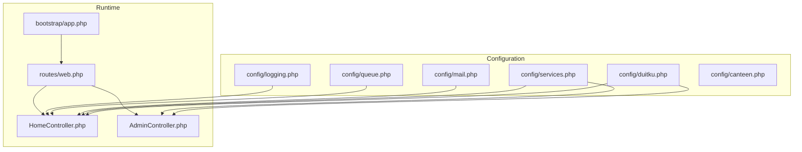
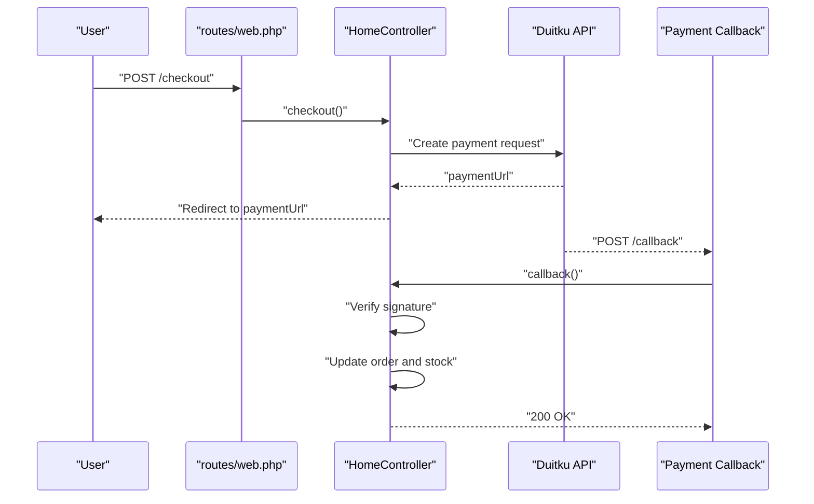
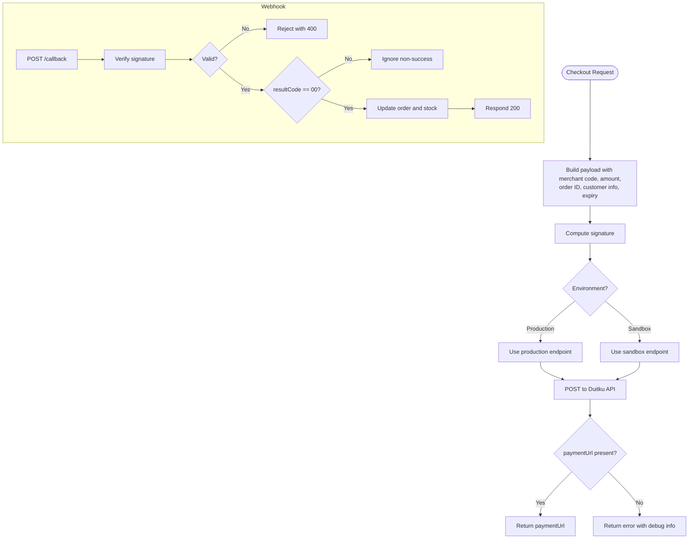
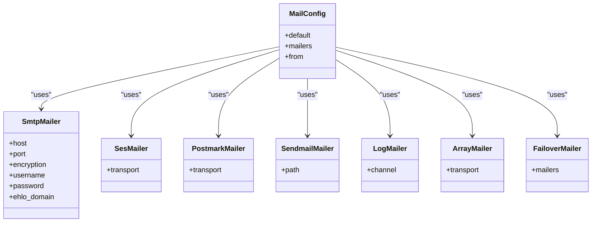
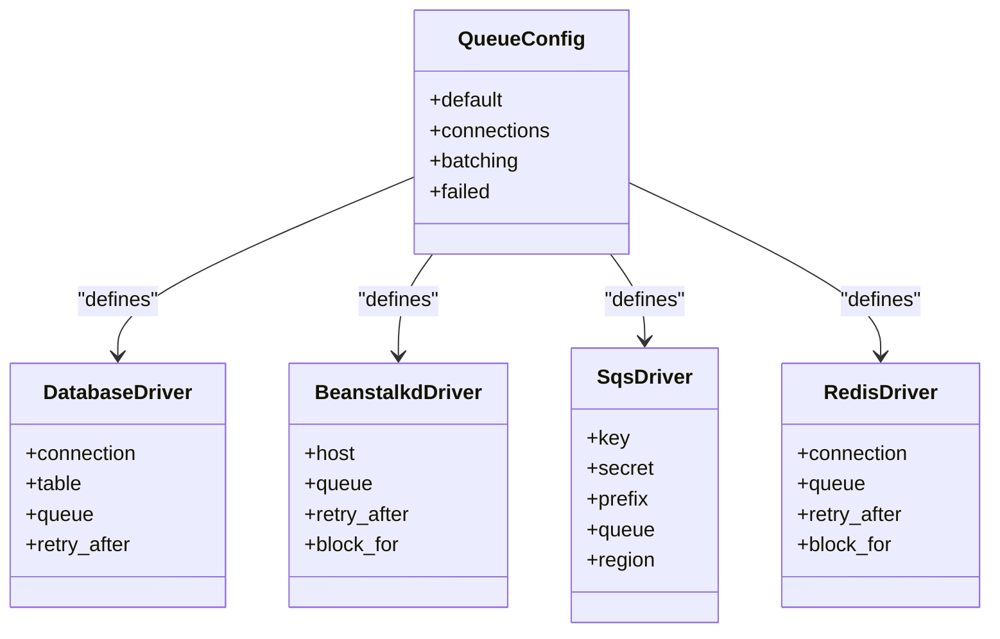
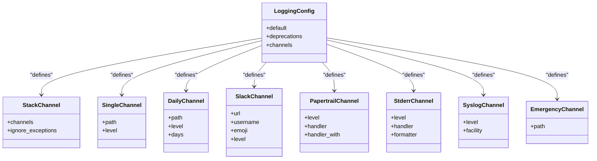
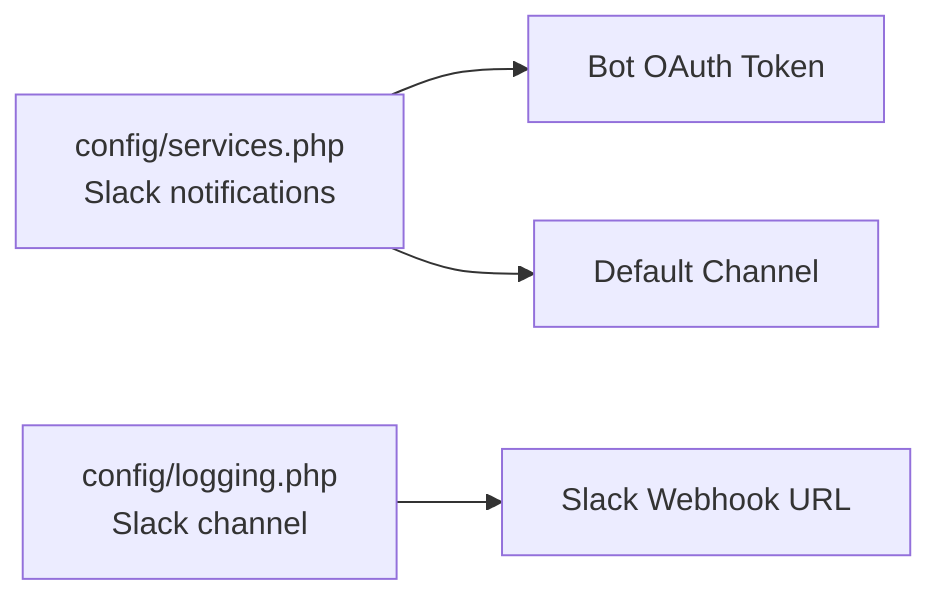
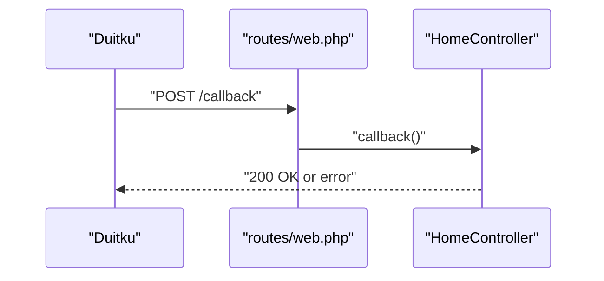
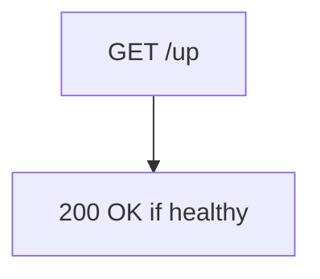
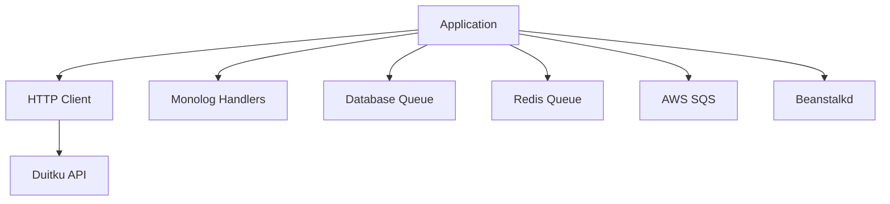

# Service Integrations

<cite>
**Referenced Files in This Document**
- [config/services.php](file://config/services.php)
- [config/mail.php](file://config/mail.php)
- [config/queue.php](file://config/queue.php)
- [config/logging.php](file://config/logging.php)
- [config/duitku.php](file://config/duitku.php)
- [config/canteen.php](file://config/canteen.php)
- [routes/web.php](file://routes/web.php)
- [app/Http/Controllers/HomeController.php](file://app/Http/Controllers/HomeController.php)
- [app/Http/Controllers/AdminController.php](file://app/Http/Controllers/AdminController.php)
- [bootstrap/app.php](file://bootstrap/app.php)
- [composer.json](file://composer.json)
</cite>

## Table of Contents
1. [Introduction](#introduction)
2. [Project Structure](#project-structure)
3. [Core Components](#core-components)
4. [Architecture Overview](#architecture-overview)
5. [Detailed Component Analysis](#detailed-component-analysis)
6. [Dependency Analysis](#dependency-analysis)
7. [Performance Considerations](#performance-considerations)
8. [Troubleshooting Guide](#troubleshooting-guide)
9. [Conclusion](#conclusion)
10. [Appendices](#appendices)

## Introduction
This document explains external service integrations and third-party configurations in the Kantin Ibu Ida system. It focuses on:
- Payment provider integration with Duitku and its webhook callback
- Email service configuration via multiple drivers
- Queue service configuration for background job processing
- Logging configuration including local and external integrations
- Notification service configuration for Slack
- Security considerations for API keys and monitoring via health checks

## Project Structure
The service integrations are primarily configured through dedicated configuration files under the config directory and enforced by controller actions and routing.

**Diagram sources**
- [config/duitku.php:1-12](file://config/duitku.php#L1-L12)
- [config/services.php:1-35](file://config/services.php#L1-L35)
- [config/mail.php:1-104](file://config/mail.php#L1-L104)
- [config/queue.php:1-113](file://config/queue.php#L1-L113)
- [config/logging.php:1-133](file://config/logging.php#L1-L133)
- [routes/web.php:1-71](file://routes/web.php#L1-L71)
- [app/Http/Controllers/HomeController.php:340-457](file://app/Http/Controllers/HomeController.php#L340-L457)
- [app/Http/Controllers/AdminController.php:177-256](file://app/Http/Controllers/AdminController.php#L177-L256)
- [bootstrap/app.php:10-24](file://bootstrap/app.php#L10-L24)

**Section sources**
- [config/services.php:1-35](file://config/services.php#L1-L35)
- [config/mail.php:1-104](file://config/mail.php#L1-L104)
- [config/queue.php:1-113](file://config/queue.php#L1-L113)
- [config/logging.php:1-133](file://config/logging.php#L1-L133)
- [config/duitku.php:1-12](file://config/duitku.php#L1-L12)
- [config/canteen.php:1-9](file://config/canteen.php#L1-L9)
- [routes/web.php:1-71](file://routes/web.php#L1-L71)
- [bootstrap/app.php:10-24](file://bootstrap/app.php#L10-L24)

## Core Components
- Payment provider integration (Duitku): Merchant credentials, endpoints, signature verification, and webhook callback handling.
- Email service: Driver selection, SMTP settings, and global sender identity.
- Queue service: Default connection, backend drivers, failed job handling, and retry policies.
- Logging: Default channel, level, rotation, and external integrations (Slack, syslog, Papertrail).
- Notifications: Slack bot OAuth token and channel for operational alerts.
- Webhooks: Callback endpoint for payment provider events.
- Monitoring: Health check route exposed by the framework.

**Section sources**
- [config/duitku.php:1-12](file://config/duitku.php#L1-L12)
- [config/mail.php:17-101](file://config/mail.php#L17-L101)
- [config/queue.php:16-110](file://config/queue.php#L16-L110)
- [config/logging.php:21-130](file://config/logging.php#L21-L130)
- [config/services.php:17-32](file://config/services.php#L17-L32)
- [routes/web.php:50-50](file://routes/web.php#L50-L50)
- [bootstrap/app.php:14-14](file://bootstrap/app.php#L14-L14)

## Architecture Overview
The system integrates external services through configuration-driven components and controller actions. Payment requests are initiated by controllers, which call the Duitku API and rely on a webhook endpoint to finalize transactions. Email, queues, logging, and notifications are configured centrally and consumed by controllers and middleware.

**Diagram sources**
- [routes/web.php:42-43](file://routes/web.php#L42-L43)
- [app/Http/Controllers/HomeController.php:340-408](file://app/Http/Controllers/HomeController.php#L340-L408)
- [routes/web.php:50-50](file://routes/web.php#L50-L50)
- [app/Http/Controllers/HomeController.php:410-452](file://app/Http/Controllers/HomeController.php#L410-L452)

## Detailed Component Analysis

### Payment Provider Integration (Duitku)
- Configuration
  - Merchant code and API key are loaded from environment variables via the Duitku config file.
  - Environment flag selects sandbox or production endpoints.
  - Callback and return URLs are configurable; defaults fall back to named routes.
- Request Flow
  - The checkout action constructs the payload, computes the signature, posts to the selected endpoint, and returns a payment URL.
- Webhook Callback
  - The callback endpoint validates the signature, updates order status and payment info, enforces delivery range limits, and decrements menu stock.
- Security
  - Signature verification prevents tampering.
  - Delivery range enforcement protects logistics feasibility.

**Diagram sources**
- [app/Http/Controllers/HomeController.php:340-408](file://app/Http/Controllers/HomeController.php#L340-L408)
- [app/Http/Controllers/HomeController.php:410-452](file://app/Http/Controllers/HomeController.php#L410-L452)
- [config/duitku.php:1-12](file://config/duitku.php#L1-L12)
- [routes/web.php:50-50](file://routes/web.php#L50-L50)

**Section sources**
- [config/duitku.php:1-12](file://config/duitku.php#L1-L12)
- [app/Http/Controllers/HomeController.php:340-408](file://app/Http/Controllers/HomeController.php#L340-L408)
- [app/Http/Controllers/HomeController.php:410-452](file://app/Http/Controllers/HomeController.php#L410-L452)
- [routes/web.php:50-50](file://routes/web.php#L50-L50)

### Email Service Configuration
- Default mailer selection via environment variable.
- Supported drivers include SMTP, SES, Postmark, Sendmail, Log, Array, Failover, Round-robin.
- SMTP settings are configurable via environment variables for host, port, encryption, credentials, and EHLO domain.
- Global sender identity is controlled via MAIL_FROM_ADDRESS and MAIL_FROM_NAME.
- Failover mailer can be used to provide resilience.

**Diagram sources**
- [config/mail.php:17-101](file://config/mail.php#L17-L101)

**Section sources**
- [config/mail.php:17-101](file://config/mail.php#L17-L101)

### Queue Service Configuration
- Default queue connection is configurable.
- Supported drivers include sync, database, beanstalkd, SQS, Redis.
- Database driver supports custom connection, table, queue name, and retry_after.
- SQS driver supports key/secret, region, queue name, and region.
- Redis driver supports connection, queue name, retry_after, and block_for.
- Failed job driver and table are configurable.

**Diagram sources**
- [config/queue.php:16-110](file://config/queue.php#L16-L110)

**Section sources**
- [config/queue.php:16-110](file://config/queue.php#L16-L110)

### Logging Configuration
- Default channel selection via environment variable.
- Stack channel aggregates multiple channels.
- Single and daily channels support level and retention (days).
- Slack channel supports webhook URL, username, emoji, and level.
- Papertrail monolog handler supports TLS and host/port.
- Stderr and syslog channels provide platform-native logging.
- Emergency channel defines a fallback log path.

**Diagram sources**
- [config/logging.php:21-130](file://config/logging.php#L21-L130)

**Section sources**
- [config/logging.php:21-130](file://config/logging.php#L21-L130)

### Notification Service Configuration (Slack)
- Slack notifications are configured under the services configuration with bot OAuth token and default channel.
- Logging can also integrate with Slack via the logging configuration.

**Diagram sources**
- [config/services.php:27-32](file://config/services.php#L27-L32)
- [config/logging.php:76-83](file://config/logging.php#L76-L83)

**Section sources**
- [config/services.php:27-32](file://config/services.php#L27-L32)
- [config/logging.php:76-83](file://config/logging.php#L76-L83)

### Webhook Endpoints
- Payment callback endpoint is registered to receive Duitku events.
- CSRF validation is intentionally bypassed for this endpoint to accept third-party callbacks.

**Diagram sources**
- [routes/web.php:50-50](file://routes/web.php#L50-L50)
- [app/Http/Controllers/HomeController.php:410-452](file://app/Http/Controllers/HomeController.php#L410-L452)

**Section sources**
- [routes/web.php:50-50](file://routes/web.php#L50-L50)
- [bootstrap/app.php:17-20](file://bootstrap/app.php#L17-L20)

### Monitoring Configuration
- Health check route is exposed by the framework for service health verification.

**Diagram sources**
- [bootstrap/app.php:14-14](file://bootstrap/app.php#L14-L14)

**Section sources**
- [bootstrap/app.php:14-14](file://bootstrap/app.php#L14-L14)

## Dependency Analysis
External dependencies and integrations:
- Payment provider SDKs and HTTP client are used implicitly via the framework’s HTTP client.
- Logging leverages Monolog handlers.
- Queue backends depend on external systems (database, Redis, SQS, Beanstalkd).

**Diagram sources**
- [composer.json:7-11](file://composer.json#L7-L11)
- [config/queue.php:31-75](file://config/queue.php#L31-L75)
- [config/logging.php:53-130](file://config/logging.php#L53-L130)

**Section sources**
- [composer.json:7-11](file://composer.json#L7-L11)
- [config/queue.php:31-75](file://config/queue.php#L31-L75)
- [config/logging.php:53-130](file://config/logging.php#L53-L130)

## Performance Considerations
- Queue backends: Prefer Redis or SQS for high throughput and reliability; database backend is simpler but may bottleneck under load.
- Retry policies: Tune retry_after per driver to balance latency and resource usage.
- Logging: Use daily rotation and appropriate levels to avoid disk pressure; external integrations like Slack should be rate-limited.
- Payment callbacks: Keep callback logic minimal and idempotent; verify signatures early to fail fast.

## Troubleshooting Guide
- Payment callback signature mismatch
  - Ensure merchant code and API key are correctly set and environment matches intended mode.
  - Verify callback URL in Duitku matches the application route.
- Order out of delivery range
  - The callback enforces a maximum delivery distance; adjust canteen configuration if needed.
- Email delivery failures
  - Confirm mailer driver and credentials; test with log mailer for development.
- Queue workers not processing jobs
  - Verify default connection and backend availability; check failed job storage configuration.
- Slack notifications not received
  - Validate bot OAuth token and channel; confirm logging Slack channel webhook URL.

**Section sources**
- [app/Http/Controllers/HomeController.php:424-432](file://app/Http/Controllers/HomeController.php#L424-L432)
- [config/duitku.php:1-12](file://config/duitku.php#L1-L12)
- [config/mail.php:17-101](file://config/mail.php#L17-L101)
- [config/queue.php:16-110](file://config/queue.php#L16-L110)
- [config/logging.php:76-83](file://config/logging.php#L76-L83)

## Conclusion
The Kantin Ibu Ida system integrates external services through centralized configuration and controller-driven flows. Payment processing relies on Duitku with robust signature verification and webhook handling. Email, queue, logging, and Slack notification services are configurable for diverse environments. Proper environment variable management, security hardening, and monitoring enable reliable operations.

## Appendices

### Setup Instructions

- Payment (Duitku)
  - Set merchant code and API key in environment variables.
  - Configure environment mode (sandbox/production) and endpoints.
  - Define callback and return URLs; ensure they resolve to application routes.
  - Verify webhook URL in Duitku dashboard points to the application callback route.

- Email (Mail)
  - Select a mailer via environment variable.
  - For SMTP, set host, port, encryption, username, and password.
  - Configure global sender identity for outgoing messages.

- Queue
  - Choose a queue backend via environment variable.
  - For database, define table and retry_after.
  - For Redis/SQS/Beanstalkd, set credentials and endpoints.
  - Configure failed job driver and table.

- Logging
  - Set default channel and log level.
  - For daily rotation, configure retention days.
  - For Slack, provide webhook URL and optional username/emoji.
  - For Papertrail, set host, port, and handler.

- Notifications (Slack)
  - Provide bot OAuth token and default channel in services configuration.

- Monitoring
  - Use the health check route to verify service availability.

**Section sources**
- [config/duitku.php:1-12](file://config/duitku.php#L1-L12)
- [config/mail.php:17-101](file://config/mail.php#L17-L101)
- [config/queue.php:16-110](file://config/queue.php#L16-L110)
- [config/logging.php:21-130](file://config/logging.php#L21-L130)
- [config/services.php:27-32](file://config/services.php#L27-L32)
- [bootstrap/app.php:14-14](file://bootstrap/app.php#L14-L14)

### Security Considerations
- Store API keys and secrets in environment variables; avoid committing them to version control.
- Enforce HTTPS in production to protect credentials in transit.
- Validate webhook signatures rigorously and reject invalid payloads.
- Limit webhook endpoints and restrict access where possible.
- Rotate secrets periodically and monitor for unauthorized usage.

**Section sources**
- [app/Http/Controllers/HomeController.php:424-452](file://app/Http/Controllers/HomeController.php#L424-L452)
- [app/Providers/AppServiceProvider.php:22-24](file://app/Providers/AppServiceProvider.php#L22-L24)