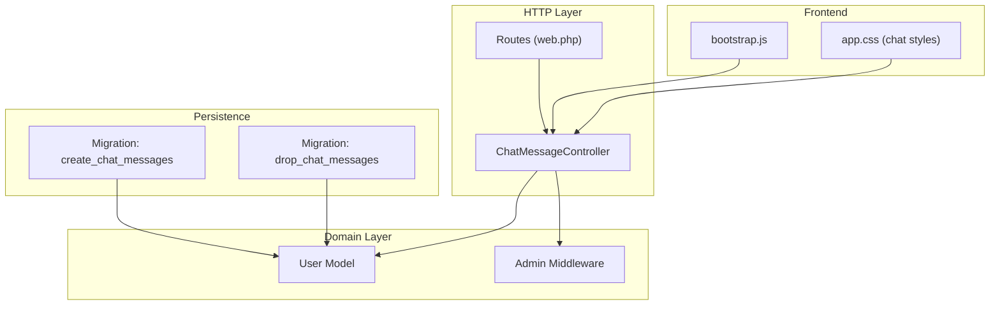
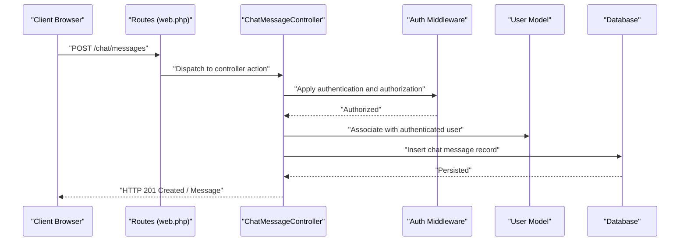
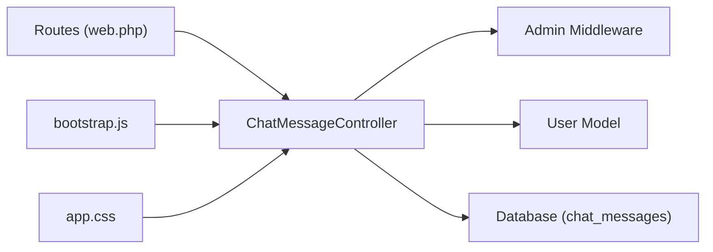

# Chat & Message Functionality

<cite>
**Referenced Files in This Document**
- [ChatMessageController.php](file://app/Http/Controllers/ChatMessageController.php)
- [2026_04_21_011704_create_chat_messages_table.php](file://database/migrations/2026_04_21_011704_create_chat_messages_table.php)
- [2026_04_27_021914_drop_chat_messages_table.php](file://database/migrations/2026_04_27_021914_drop_chat_messages_table.php)
- [User.php](file://app/Models/User.php)
- [web.php](file://routes/web.php)
- [AdminMiddleware.php](file://app/Http/Middleware/AdminMiddleware.php)
- [bootstrap.js](file://resources/js/bootstrap.js)
- [app.css](file://resources/css/app.css)
</cite>

## Table of Contents
1. [Introduction](#introduction)
2. [Project Structure](#project-structure)
3. [Core Components](#core-components)
4. [Architecture Overview](#architecture-overview)
5. [Detailed Component Analysis](#detailed-component-analysis)
6. [Dependency Analysis](#dependency-analysis)
7. [Performance Considerations](#performance-considerations)
8. [Troubleshooting Guide](#troubleshooting-guide)
9. [Conclusion](#conclusion)

## Introduction
This document explains the chat and messaging functionality within the system. It covers the intended architecture, message handling, persistence, and user-to-user communication flows as defined by the existing schema and controller skeleton. It also documents the integration with user authentication, message security, and privacy considerations, along with performance optimization strategies for message retrieval, real-time updates, and scalability.

## Project Structure
The chat functionality is structured around:
- A controller skeleton for chat message operations
- A database migration that defines the chat message schema
- A second migration that removes the chat messages table
- Authentication middleware ensuring secure access
- Frontend assets supporting a chat widget interface

**Diagram sources**
- [web.php:1-71](file://routes/web.php#L1-L71)
- [ChatMessageController.php:1-11](file://app/Http/Controllers/ChatMessageController.php#L1-L11)
- [User.php:1-55](file://app/Models/User.php#L1-L55)
- [AdminMiddleware.php:1-26](file://app/Http/Middleware/AdminMiddleware.php#L1-L26)
- [2026_04_21_011704_create_chat_messages_table.php:1-32](file://database/migrations/2026_04_21_011704_create_chat_messages_table.php#L1-L32)
- [2026_04_27_021914_drop_chat_messages_table.php:1-25](file://database/migrations/2026_04_27_021914_drop_chat_messages_table.php#L1-L25)
- [bootstrap.js:1-5](file://resources/js/bootstrap.js#L1-L5)
- [app.css:757-888](file://resources/css/app.css#L757-L888)

**Section sources**
- [web.php:1-71](file://routes/web.php#L1-L71)
- [ChatMessageController.php:1-11](file://app/Http/Controllers/ChatMessageController.php#L1-L11)
- [2026_04_21_011704_create_chat_messages_table.php:1-32](file://database/migrations/2026_04_21_011704_create_chat_messages_table.php#L1-L32)
- [2026_04_27_021914_drop_chat_messages_table.php:1-25](file://database/migrations/2026_04_27_021914_drop_chat_messages_table.php#L1-L25)
- [User.php:1-55](file://app/Models/User.php#L1-L55)
- [AdminMiddleware.php:1-26](file://app/Http/Middleware/AdminMiddleware.php#L1-L26)
- [bootstrap.js:1-5](file://resources/js/bootstrap.js#L1-L5)
- [app.css:757-888](file://resources/css/app.css#L757-L888)

## Core Components
- ChatMessageController: HTTP entry point for chat operations (currently empty, awaiting implementation)
- Chat Messages Schema: Defines message persistence with user association, admin flag, read status, and timestamps
- User Model: Provides user identity and relationship to orders; integrates with authentication
- Authentication and Authorization: Middleware ensures access control for sensitive operations
- Frontend Chat Widget: CSS styles define the chat UI layout and message presentation

Key implementation notes:
- The controller currently does not expose any actions; endpoints and methods need to be added to support message creation, retrieval, and management.
- The schema supports per-message ownership via user_id, admin differentiation via is_admin, read tracking via is_read, and temporal ordering via timestamps.

**Section sources**
- [ChatMessageController.php:1-11](file://app/Http/Controllers/ChatMessageController.php#L1-L11)
- [2026_04_21_011704_create_chat_messages_table.php:14-21](file://database/migrations/2026_04_21_011704_create_chat_messages_table.php#L14-L21)
- [User.php:50-53](file://app/Models/User.php#L50-L53)
- [AdminMiddleware.php:17-24](file://app/Http/Middleware/AdminMiddleware.php#L17-L24)
- [app.css:761-824](file://resources/css/app.css#L761-L824)

## Architecture Overview
The chat system follows a layered architecture:
- HTTP layer: Routes bind to controller actions
- Domain layer: Controller interacts with models and middleware
- Persistence layer: Eloquent ORM maps to the chat_messages table
- Frontend layer: Axios configured in bootstrap.js enables AJAX requests to backend endpoints

**Diagram sources**
- [web.php:1-71](file://routes/web.php#L1-L71)
- [ChatMessageController.php:1-11](file://app/Http/Controllers/ChatMessageController.php#L1-L11)
- [User.php:19-25](file://app/Models/User.php#L19-L25)
- [2026_04_21_011704_create_chat_messages_table.php:14-21](file://database/migrations/2026_04_21_011704_create_chat_messages_table.php#L14-L21)

## Detailed Component Analysis

### ChatMessageController
Purpose:
- Serve as the HTTP endpoint handler for chat-related operations
- Enforce authentication and authorization policies
- Coordinate message persistence and retrieval

Current state:
- Empty controller class; requires methods for creation, listing, and management

Recommended methods (conceptual):
- Store(message payload): Validates input, associates with authenticated user, persists message, returns created resource
- Index(userId?, limit?): Lists messages for a user or conversation thread with pagination
- MarkAsRead(messageId?): Updates is_read flag for a message
- Destroy(messageId?): Deletes a message owned by the authenticated user

Authorization:
- Use the auth middleware to protect endpoints
- Optionally apply AdminMiddleware for admin-only operations

Security considerations:
- Validate message length and sanitize content
- Enforce rate limiting to prevent spam
- Scope queries by authenticated user ID

**Section sources**
- [ChatMessageController.php:7-10](file://app/Http/Controllers/ChatMessageController.php#L7-L10)
- [web.php:33-48](file://routes/web.php#L33-L48)
- [AdminMiddleware.php:17-24](file://app/Http/Middleware/AdminMiddleware.php#L17-L24)

### Chat Messages Schema
Fields and relationships:
- id: Auto-incrementing primary key
- user_id: Foreign key to users table with cascade delete
- is_admin: Boolean flag indicating admin-sent messages
- message: Text content of the message
- is_read: Boolean flag for read/unread state
- timestamps: Created at and updated at

Constraints and indexes:
- Cascade delete on user removal
- Recommended indexes: user_id, created_at, is_read for efficient querying

Data integrity:
- Use database-level constraints to maintain referential integrity
- Apply Laravel model casting and fillable arrays for consistent hydration

**Section sources**
- [2026_04_21_011704_create_chat_messages_table.php:14-21](file://database/migrations/2026_04_21_011704_create_chat_messages_table.php#L14-L21)

### User Model and Authentication Integration
Role:
- Provides user identity and relationships
- Integrates with authentication guard and middleware

Integration points:
- ChatMessageController actions should resolve the current user via the auth guard
- Admin-only operations should leverage AdminMiddleware
- User-to-message relationship: One-to-many from User to ChatMessage

Privacy:
- Enforce ownership checks before allowing message retrieval or deletion
- Hide sensitive user attributes in API responses

**Section sources**
- [User.php:19-25](file://app/Models/User.php#L19-L25)
- [User.php:50-53](file://app/Models/User.php#L50-L53)
- [AdminMiddleware.php:19-21](file://app/Http/Middleware/AdminMiddleware.php#L19-L21)

### Frontend Chat Widget
Styles:
- Chat window, header, messages container, and input area are styled
- Message bubbles differentiate user/admin messages
- Toggle and visibility states managed via CSS classes

AJAX integration:
- Axios is globally configured in bootstrap.js for HTTP requests
- Frontend can trigger POST requests to controller endpoints and render responses

**Section sources**
- [app.css:761-824](file://resources/css/app.css#L761-L824)
- [bootstrap.js:1-5](file://resources/js/bootstrap.js#L1-L5)

### Message Threading and Timestamp Handling
Threading:
- Messages can be grouped by user_id for user-to-user conversations
- For multi-user threads, introduce a thread_id field and join table if needed

Timestamps:
- Laravel automatically manages created_at and updated_at
- Use timezone-aware timestamps for accurate ordering and display

**Section sources**
- [2026_04_21_011704_create_chat_messages_table.php:20](file://database/migrations/2026_04_21_011704_create_chat_messages_table.php#L20)
- [2026_04_27_021914_drop_chat_messages_table.php:14](file://database/migrations/2026_04_27_021914_drop_chat_messages_table.php#L14)

### Message Validation Processes
Validation strategy:
- Length limits for message content
- Sanitization to prevent XSS
- Rate limiting per user per time window
- Optional moderation queue for flagged content

Implementation location:
- Add validation rules in controller methods or dedicated form request classes

**Section sources**
- [ChatMessageController.php:7-10](file://app/Http/Controllers/ChatMessageController.php#L7-L10)

### Practical Examples

#### Chat Initialization
- Load chat widget UI via frontend styles
- Initialize Axios for AJAX requests
- On page load, fetch recent messages for the authenticated user

#### Message Sending
- Client composes message and submits via POST to controller endpoint
- Controller validates, associates with user, persists, and returns success

#### Message Retrieval
- Fetch messages with pagination and filter by user_id
- Support unread count and mark as read on retrieval

#### Conversation Management
- Group messages by user_id
- Provide last message preview and unread indicators

Note: These examples describe conceptual flows. Implementation details depend on the controller methods and routes added to the application.

**Section sources**
- [bootstrap.js:1-5](file://resources/js/bootstrap.js#L1-L5)
- [app.css:761-824](file://resources/css/app.css#L761-L824)
- [web.php:33-48](file://routes/web.php#L33-L48)

## Dependency Analysis
The system exhibits clear separation of concerns:
- Routes depend on controllers
- Controllers depend on models and middleware
- Models define domain relationships
- Frontend depends on Axios configuration and CSS styles

**Diagram sources**
- [web.php:1-71](file://routes/web.php#L1-L71)
- [ChatMessageController.php:1-11](file://app/Http/Controllers/ChatMessageController.php#L1-L11)
- [User.php:1-55](file://app/Models/User.php#L1-L55)
- [AdminMiddleware.php:1-26](file://app/Http/Middleware/AdminMiddleware.php#L1-L26)
- [bootstrap.js:1-5](file://resources/js/bootstrap.js#L1-L5)
- [app.css:757-888](file://resources/css/app.css#L757-L888)

**Section sources**
- [web.php:1-71](file://routes/web.php#L1-L71)
- [ChatMessageController.php:1-11](file://app/Http/Controllers/ChatMessageController.php#L1-L11)
- [User.php:1-55](file://app/Models/User.php#L1-L55)
- [AdminMiddleware.php:1-26](file://app/Http/Middleware/AdminMiddleware.php#L1-L26)
- [bootstrap.js:1-5](file://resources/js/bootstrap.js#L1-L5)
- [app.css:757-888](file://resources/css/app.css#L757-L888)

## Performance Considerations
- Database indexing
  - Index user_id, created_at, and is_read for efficient filtering and sorting
- Pagination
  - Limit messages per page and use cursor-based pagination for large histories
- Caching
  - Cache recent messages per user with invalidation on new writes
- Background jobs
  - Offload non-critical tasks (e.g., analytics, moderation) to queues
- Real-time updates
  - Use server-sent events or WebSockets for live updates; avoid polling
- Scalability
  - Sharding by user_id or thread_id for high-volume scenarios
  - CDN for static assets; database read replicas for heavy reads

[No sources needed since this section provides general guidance]

## Troubleshooting Guide
Common issues and resolutions:
- Missing controller actions
  - Ensure routes are mapped to implemented controller methods
- Authorization failures
  - Verify auth middleware is applied and AdminMiddleware is used for admin-only endpoints
- Database schema inconsistencies
  - Confirm chat_messages table exists; if dropped, re-run the create migration
- Frontend AJAX errors
  - Check CSRF token configuration and Axios defaults in bootstrap.js

**Section sources**
- [web.php:33-48](file://routes/web.php#L33-L48)
- [AdminMiddleware.php:19-21](file://app/Http/Middleware/AdminMiddleware.php#L19-L21)
- [2026_04_21_011704_create_chat_messages_table.php:14-21](file://database/migrations/2026_04_21_011704_create_chat_messages_table.php#L14-L21)
- [2026_04_27_021914_drop_chat_messages_table.php:14](file://database/migrations/2026_04_27_021914_drop_chat_messages_table.php#L14)
- [bootstrap.js:1-5](file://resources/js/bootstrap.js#L1-L5)

## Conclusion
The chat and messaging system is defined by a clear schema and controller foundation. To enable full functionality, implement controller actions for message creation, retrieval, and management, add appropriate routes, enforce authentication and authorization, and integrate frontend components with Axios. Apply performance optimizations and scalability strategies to support real-time updates and high-volume messaging scenarios.