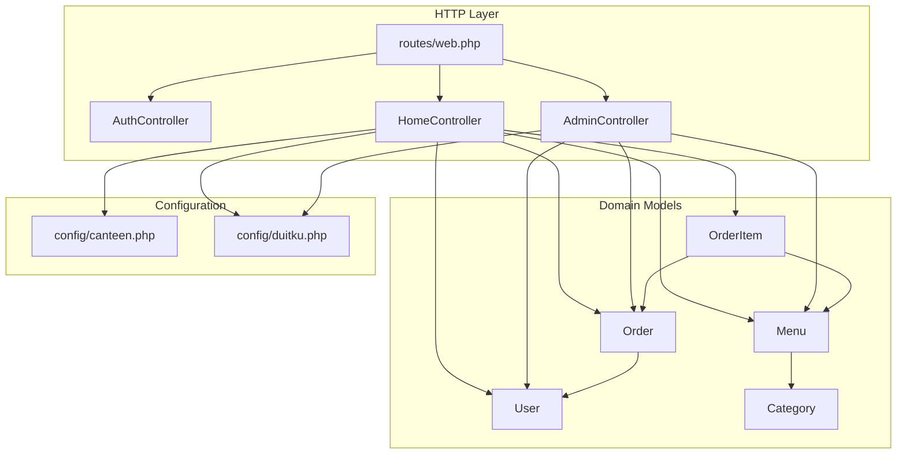
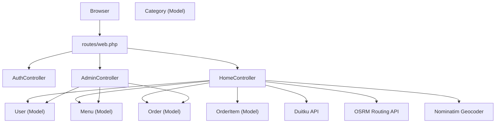
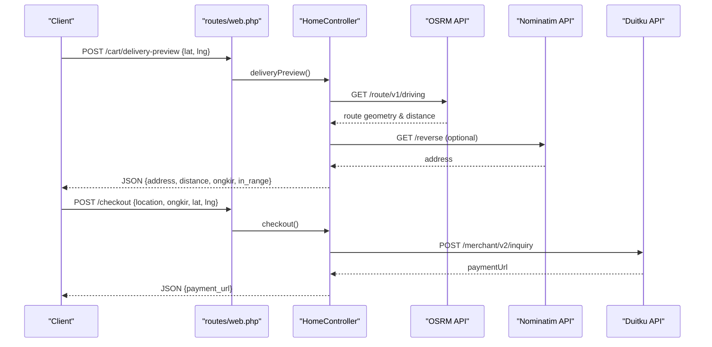
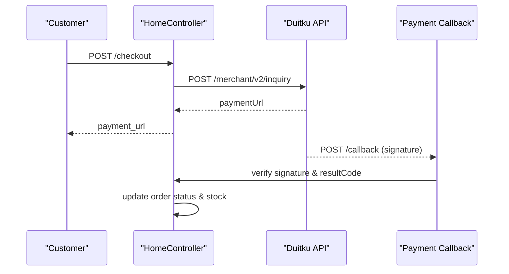
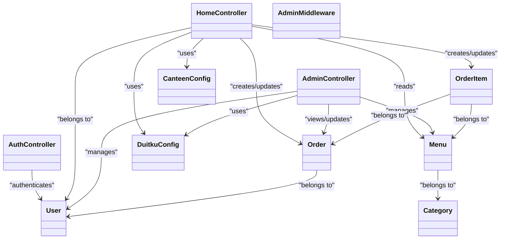

# Core Features

<cite>
**Referenced Files in This Document**
- [AuthController.php](file://app/Http/Controllers/AuthController.php)
- [HomeController.php](file://app/Http/Controllers/HomeController.php)
- [AdminController.php](file://app/Http/Controllers/AdminController.php)
- [web.php](file://routes/web.php)
- [AdminMiddleware.php](file://app/Http/Middleware/AdminMiddleware.php)
- [User.php](file://app/Models/User.php)
- [Menu.php](file://app/Models/Menu.php)
- [Order.php](file://app/Models/Order.php)
- [OrderItem.php](file://app/Models/OrderItem.php)
- [Category.php](file://app/Models/Category.php)
- [canteen.php](file://config/canteen.php)
- [duitku.php](file://config/duitku.php)
</cite>

## Table of Contents
1. [Introduction](#introduction)
2. [Project Structure](#project-structure)
3. [Core Components](#core-components)
4. [Architecture Overview](#architecture-overview)
5. [Detailed Component Analysis](#detailed-component-analysis)
6. [Dependency Analysis](#dependency-analysis)
7. [Performance Considerations](#performance-considerations)
8. [Troubleshooting Guide](#troubleshooting-guide)
9. [Conclusion](#conclusion)

## Introduction
This document explains the core functional modules of the Kantin Ibu Ida system with a focus on:
- User authentication and authorization
- Menu management
- Order processing workflow
- Payment integration via Duitku
- Chat/message functionality

It describes architectural patterns, component interactions, and data flow across controllers, models, and views. It also provides practical usage examples, configuration options, customization possibilities, and guidance on performance, scalability, and extensibility.

## Project Structure
The system follows a classic MVC pattern with Laravel:
- Controllers under app/Http/Controllers orchestrate requests and coordinate models/views
- Models under app/Models define Eloquent relationships and persistence
- Routes under routes/web.php bind URLs to controller actions
- Views under resources/views render the UI
- Configuration under config/* centralizes environment-specific settings

**Diagram sources**
- [web.php:1-71](file://routes/web.php#L1-L71)
- [AuthController.php:1-78](file://app/Http/Controllers/AuthController.php#L1-L78)
- [HomeController.php:1-568](file://app/Http/Controllers/HomeController.php#L1-L568)
- [AdminController.php:1-257](file://app/Http/Controllers/AdminController.php#L1-L257)
- [User.php:1-55](file://app/Models/User.php#L1-L55)
- [Menu.php:1-32](file://app/Models/Menu.php#L1-L32)
- [Order.php:1-36](file://app/Models/Order.php#L1-L36)
- [OrderItem.php:1-29](file://app/Models/OrderItem.php#L1-L29)
- [Category.php:1-16](file://app/Models/Category.php#L1-L16)
- [canteen.php:1-9](file://config/canteen.php#L1-L9)
- [duitku.php:1-12](file://config/duitku.php#L1-L12)

**Section sources**
- [web.php:1-71](file://routes/web.php#L1-L71)

## Core Components
- Authentication and Authorization: Handles login, registration, logout, and admin-only access control
- Menu Management: CRUD operations for menu items and categories
- Order Processing: Shopping cart, checkout, delivery estimation, order lifecycle, and invoice generation
- Payment Integration: Duitku API integration for payment initiation and callbacks
- Chat/Message Functionality: Placeholder present but not implemented in current codebase

**Section sources**
- [AuthController.php:1-78](file://app/Http/Controllers/AuthController.php#L1-L78)
- [HomeController.php:1-568](file://app/Http/Controllers/HomeController.php#L1-L568)
- [AdminController.php:1-257](file://app/Http/Controllers/AdminController.php#L1-L257)
- [web.php:1-71](file://routes/web.php#L1-L71)

## Architecture Overview
The system uses a layered architecture:
- Presentation: Blade templates under resources/views
- Application: Controllers handle HTTP requests and delegate to models
- Domain: Eloquent models encapsulate business entities and relationships
- Infrastructure: External integrations (Duitku, OpenStreetMap/OSRM) via HTTP client

**Diagram sources**
- [web.php:1-71](file://routes/web.php#L1-L71)
- [AuthController.php:1-78](file://app/Http/Controllers/AuthController.php#L1-L78)
- [HomeController.php:1-568](file://app/Http/Controllers/HomeController.php#L1-L568)
- [AdminController.php:1-257](file://app/Http/Controllers/AdminController.php#L1-L257)
- [Order.php:1-36](file://app/Models/Order.php#L1-L36)
- [OrderItem.php:1-29](file://app/Models/OrderItem.php#L1-L29)
- [Menu.php:1-32](file://app/Models/Menu.php#L1-L32)
- [User.php:1-55](file://app/Models/User.php#L1-L55)
- [Category.php:1-16](file://app/Models/Category.php#L1-L16)

## Detailed Component Analysis

### User Authentication and Authorization
Purpose:
- Secure user access and enforce role-based permissions

Key functionalities:
- Login with email or username, password validation, session regeneration
- Registration with password confirmation and hashing
- Logout with session invalidation
- Admin middleware to restrict admin panel access

Integration points:
- Uses Laravel’s built-in Auth facade and session management
- AdminMiddleware checks is_admin flag on the authenticated user
- Routes grouped under auth and admin middleware

Practical examples:
- Access login page at GET /
- Submit credentials to POST /login
- Register via GET /register and POST /register
- Admin panel access requires GET /admin with admin privileges

Configuration options:
- Session and guard defaults managed by Laravel; no custom guards in this codebase

Customization possibilities:
- Add two-factor authentication, password policies, or social login
- Extend User model with additional fields and relationships

Performance considerations:
- Password hashing is handled server-side; keep bcrypt cost factor balanced
- Middleware adds minimal overhead per request

Scalability aspects:
- Stateless session strategy suitable for load-balanced deployments
- Centralized admin check reduces duplication

Extensibility opportunities:
- Introduce roles beyond admin (e.g., cashier)
- Add API tokens for mobile clients

**Section sources**
- [AuthController.php:1-78](file://app/Http/Controllers/AuthController.php#L1-L78)
- [web.php:27-31](file://routes/web.php#L27-L31)
- [web.php:52-70](file://routes/web.php#L52-L70)
- [AdminMiddleware.php:1-26](file://app/Http/Middleware/AdminMiddleware.php#L1-L26)
- [User.php:1-55](file://app/Models/User.php#L1-L55)

### Menu Management System
Purpose:
- Manage menu items, categories, and stock levels for ordering

Key functionalities:
- Admin CRUD for menus (create, read, update, delete)
- Image upload handling for menu items
- Category association for menus
- Stock validation during order placement

Integration points:
- Admin routes under /admin prefix
- AdminController handles all menu operations
- Menu model belongs to Category and has many OrderItem

Practical examples:
- View menus at GET /admin/menus
- Add a menu item via POST /admin/menus
- Edit menu at GET /admin/menus/{id}/edit and update via POST /admin/menus/{id}
- Delete menu via DELETE /admin/menus/{id}

Configuration options:
- Store images under storage/app/public with generated URLs
- Category association optional; fallback behavior supported

Customization possibilities:
- Add filters/sorting by category, price range, stock status
- Enable bulk operations for menu updates
- Introduce menu availability windows

Performance considerations:
- Image storage and retrieval via local filesystem; consider CDN for production
- Efficient listing with eager loading of related data

Scalability aspects:
- Separate category and menu tables support growth
- Index category_id for faster queries

Extensibility opportunities:
- Add menu tags, allergens, popularity metrics
- Support menu bundles or combo pricing

**Section sources**
- [web.php:52-69](file://routes/web.php#L52-L69)
- [AdminController.php:21-75](file://app/Http/Controllers/AdminController.php#L21-L75)
- [Menu.php:1-32](file://app/Models/Menu.php#L1-L32)
- [Category.php:1-16](file://app/Models/Category.php#L1-L16)

### Order Processing Workflow
Purpose:
- Facilitate customer shopping, cart management, checkout, and order lifecycle

Key functionalities:
- Browse menus and view details
- Add items to cart with stock validation
- Adjust quantities and remove items
- Delivery preview with geocoding and routing
- Checkout with shipping fee calculation and payment initiation
- Order history, status transitions, and invoice generation
- Automatic completion of “arrived” orders after 24 hours

Integration points:
- HomeController orchestrates cart, checkout, and order lifecycle
- Order and OrderItem models manage order lines
- External services: OSRM for driving distance, Nominatim for reverse geocoding
- Payment callback endpoint for Duitku

Practical examples:
- View menu catalog at GET /menu
- Add item to cart via POST /order
- Preview delivery at POST /cart/delivery-preview with lat/lng
- Proceed to checkout via POST /checkout
- Confirm receipt at POST /orders/{id}/confirm

Configuration options:
- Maximum delivery radius configurable via CANTEEN_MAX_DELIVERY_KM
- Base shipping fee calculation based on distance

Customization possibilities:
- Introduce order notes, special instructions
- Add promotional discounts or coupon codes
- Support split payments or partial cancellations

Performance considerations:
- Recalculation of order totals after each cart change
- External API calls for routing and geocoding with timeouts and retries

Scalability aspects:
- Pending orders per user with location filtering prevents mixed pickup/delivery contexts
- Auto-completion reduces manual admin work

Extensibility opportunities:
- Real-time order status notifications
- Queue workers for payment callbacks and order updates

**Diagram sources**
- [web.php:37-50](file://routes/web.php#L37-L50)
- [HomeController.php:127-190](file://app/Http/Controllers/HomeController.php#L127-L190)
- [HomeController.php:275-408](file://app/Http/Controllers/HomeController.php#L275-L408)

**Section sources**
- [web.php:33-48](file://routes/web.php#L33-L48)
- [HomeController.php:14-114](file://app/Http/Controllers/HomeController.php#L14-L114)
- [HomeController.php:116-263](file://app/Http/Controllers/HomeController.php#L116-L263)
- [HomeController.php:275-408](file://app/Http/Controllers/HomeController.php#L275-L408)
- [HomeController.php:459-468](file://app/Http/Controllers/HomeController.php#L459-L468)
- [Order.php:1-36](file://app/Models/Order.php#L1-L36)
- [OrderItem.php:1-29](file://app/Models/OrderItem.php#L1-L29)

### Payment Integration (Duitku)
Purpose:
- Initiate and finalize payments via Duitku with secure signatures and callbacks

Key functionalities:
- Build merchant order ID and signature
- Request payment URL from Duitku sandbox or production
- Handle payment callback to update order status and reduce stock
- Validate signature and payment result code

Integration points:
- HomeController and AdminController both call Duitku endpoints
- Payment callback endpoint at POST /callback
- Configurable endpoints and credentials via config/duitku.php

Practical examples:
- Customer checkout triggers payment initiation and redirects to paymentUrl
- Duitku posts to /callback with signature verification
- Admin POS mode supports cashless payments for walk-in customers

Configuration options:
- Merchant code and API key from environment variables
- Environment selection (sandbox vs production)
- Callback and return URLs

Customization possibilities:
- Support additional payment methods via Duitku
- Add payment failure handling and retry logic
- Introduce asynchronous payment status polling

Performance considerations:
- HTTP client calls with timeouts and retries
- Signature computation and validation occur server-side

Scalability aspects:
- Stateless payment initiation and callback handling
- Centralized signature verification reduces risk

Extensibility opportunities:
- Multi-provider payment gateway abstraction
- Webhook subscriptions for real-time status updates

**Diagram sources**
- [HomeController.php:323-408](file://app/Http/Controllers/HomeController.php#L323-L408)
- [HomeController.php:410-452](file://app/Http/Controllers/HomeController.php#L410-L452)
- [duitku.php:1-12](file://config/duitku.php#L1-L12)

**Section sources**
- [HomeController.php:323-452](file://app/Http/Controllers/HomeController.php#L323-L452)
- [AdminController.php:129-246](file://app/Http/Controllers/AdminController.php#L129-L246)
- [web.php](file://routes/web.php#L50)
- [duitku.php:1-12](file://config/duitku.php#L1-L12)

### Chat/Message Functionality
Current status:
- A ChatMessageController exists but is a placeholder with no implemented actions
- No chat-related routes, models, or views are present in the current codebase

Practical examples:
- None implemented yet

Configuration options:
- None applicable until implemented

Customization possibilities:
- Introduce real-time messaging with WebSocket or AJAX long-polling
- Add message types (text, image), read receipts, and typing indicators
- Implement chat rooms or one-on-one conversations

Performance considerations:
- Message persistence and retrieval should leverage indexing
- Consider message threading and pagination

Scalability aspects:
- Decouple chat from order lifecycle to avoid tight coupling
- Use queues for async message delivery

Extensibility opportunities:
- Integrate with third-party chat SDKs
- Add moderation and spam detection

**Section sources**
- [ChatMessageController.php:1-11](file://app/Http/Controllers/ChatMessageController.php#L1-L11)
- [web.php:1-71](file://routes/web.php#L1-L71)

## Dependency Analysis
Relationships among controllers, models, and configuration:

**Diagram sources**
- [AuthController.php:1-78](file://app/Http/Controllers/AuthController.php#L1-L78)
- [HomeController.php:1-568](file://app/Http/Controllers/HomeController.php#L1-L568)
- [AdminController.php:1-257](file://app/Http/Controllers/AdminController.php#L1-L257)
- [AdminMiddleware.php:1-26](file://app/Http/Middleware/AdminMiddleware.php#L1-L26)
- [User.php:1-55](file://app/Models/User.php#L1-L55)
- [Menu.php:1-32](file://app/Models/Menu.php#L1-L32)
- [Order.php:1-36](file://app/Models/Order.php#L1-L36)
- [OrderItem.php:1-29](file://app/Models/OrderItem.php#L1-L29)
- [Category.php:1-16](file://app/Models/Category.php#L1-L16)
- [canteen.php:1-9](file://config/canteen.php#L1-L9)
- [duitku.php:1-12](file://config/duitku.php#L1-L12)

**Section sources**
- [web.php:1-71](file://routes/web.php#L1-L71)

## Performance Considerations
- Database queries
  - Use eager loading (with) for relations like items.menu to prevent N+1 queries
  - Add indexes on frequently filtered columns (user_id, status, category_id)
- External APIs
  - Apply timeouts and retry policies for OSRM and Nominatim
  - Cache geocoding results where appropriate
- Payment processing
  - Keep signature computations lightweight
  - Offload callback processing to queued jobs if needed
- Views and rendering
  - Minimize heavy loops in Blade; precompute totals and summaries
- Sessions and middleware
  - AdminMiddleware adds negligible overhead; ensure session store is reliable

[No sources needed since this section provides general guidance]

## Troubleshooting Guide
Common issues and resolutions:
- Authentication failures
  - Verify credentials and ensure users are not admins when accessing admin routes
  - Check session regeneration and CSRF protection
- Payment errors
  - Confirm DUITKU_MERCHANT_CODE and DUITKU_API_KEY are set and environment matches
  - Inspect callback URL and signature verification logic
- Delivery preview failures
  - Validate lat/lng ranges and network connectivity to external APIs
  - Ensure CANTEEN_MAX_DELIVERY_KM is reasonable
- Stock discrepancies
  - Verify stock decrement occurs only after successful payment
  - Check concurrent order handling and race conditions

**Section sources**
- [AuthController.php:31-44](file://app/Http/Controllers/AuthController.php#L31-L44)
- [HomeController.php:316-321](file://app/Http/Controllers/HomeController.php#L316-L321)
- [HomeController.php:410-452](file://app/Http/Controllers/HomeController.php#L410-L452)
- [HomeController.php:559-566](file://app/Http/Controllers/HomeController.php#L559-L566)
- [HomeController.php:82-92](file://app/Http/Controllers/HomeController.php#L82-L92)
- [HomeController.php:440-446](file://app/Http/Controllers/HomeController.php#L440-L446)

## Conclusion
Kantin Ibu Ida implements a clean MVC architecture with robust foundations for authentication, menu management, order processing, and payment integration. While the chat/message module is currently a placeholder, the existing components provide strong extensibility points for future enhancements. By leveraging configuration-driven settings, external service integrations, and Eloquent relationships, the system balances maintainability with scalability.

[No sources needed since this section summarizes without analyzing specific files]