# Menu Management System

<cite>
**Referenced Files in This Document**
- [Menu.php](file://app/Models/Menu.php)
- [Category.php](file://app/Models/Category.php)
- [OrderItem.php](file://app/Models/OrderItem.php)
- [AdminController.php](file://app/Http/Controllers/AdminController.php)
- [MenuController.php](file://app/Http/Controllers/MenuController.php)
- [2026_04_21_011703_create_menus_table.php](file://database/migrations/2026_04_21_011703_create_menus_table.php)
- [2026_05_15_072236_create_categories_table.php](file://database/migrations/2026_05_15_072236_create_categories_table.php)
- [2026_05_15_072320_add_category_id_to_menus_table.php](file://database/migrations/2026_05_15_072320_add_category_id_to_menus_table.php)
- [2026_04_27_021524_add_stock_to_menus_table.php](file://database/migrations/2026_04_27_021524_add_stock_to_menus_table.php)
- [web.php](file://routes/web.php)
- [menus.blade.php](file://resources/views/admin/menus.blade.php)
- [menus_edit.blade.php](file://resources/views/admin/menus_edit.blade.php)
- [admin.blade.php](file://resources/views/layouts/admin.blade.php)
</cite>

## Table of Contents
1. [Introduction](#introduction)
2. [Project Structure](#project-structure)
3. [Core Components](#core-components)
4. [Architecture Overview](#architecture-overview)
5. [Detailed Component Analysis](#detailed-component-analysis)
6. [Database Schema Design](#database-schema-design)
7. [CRUD Operations Implementation](#crud-operations-implementation)
8. [Image Upload and Management](#image-upload-and-management)
9. [Category Management](#category-management)
10. [Stock Tracking System](#stock-tracking-system)
11. [Performance Optimization](#performance-optimization)
12. [Frontend Integration](#frontend-integration)
13. [Validation and Error Handling](#validation-and-error-handling)
14. [Troubleshooting Guide](#troubleshooting-guide)
15. [Conclusion](#conclusion)

## Introduction

The Menu Management System is a comprehensive Laravel-based solution for managing restaurant menu items, including full CRUD operations, category associations, stock tracking, and image management. This system provides administrative capabilities for menu item lifecycle management, from creation and modification to deletion and categorization.

The system integrates seamlessly with the broader canteen management platform, offering both administrative interfaces and integration points for ordering and payment processing. It supports real-time stock updates, category-based filtering, and efficient inventory management workflows.

## Project Structure

The menu management system follows Laravel's MVC architecture pattern with clear separation of concerns:

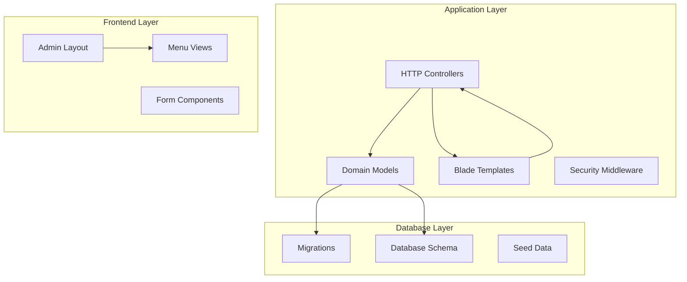

**Diagram sources**
- [AdminController.php:1-257](file://app/Http/Controllers/AdminController.php#L1-L257)
- [Menu.php:1-32](file://app/Models/Menu.php#L1-L32)
- [Category.php:1-16](file://app/Models/Category.php#L1-L16)

**Section sources**
- [web.php:52-71](file://routes/web.php#L52-L71)
- [admin.blade.php:22-32](file://resources/views/layouts/admin.blade.php#L22-L32)

## Core Components

The menu management system consists of several interconnected components that work together to provide comprehensive menu administration capabilities:

### Domain Models

The system utilizes three primary Eloquent models that define the core domain entities:

- **Menu Model**: Represents individual menu items with pricing, descriptions, and stock information
- **Category Model**: Manages menu categorization (Food, Beverage, etc.)
- **OrderItem Model**: Links menu items to order transactions

### HTTP Controllers

The administrative interface is handled through the AdminController, which provides methods for:
- Menu listing and management
- CRUD operations for menu items
- Stock updates and inventory management
- Integration with the cash register system

### Frontend Views

The system includes dedicated Blade templates for:
- Menu creation and editing forms
- Administrative dashboard for menu management
- Real-time stock monitoring interface

**Section sources**
- [Menu.php:8-31](file://app/Models/Menu.php#L8-L31)
- [Category.php:7-15](file://app/Models/Category.php#L7-L15)
- [OrderItem.php:8-28](file://app/Models/OrderItem.php#L8-L28)

## Architecture Overview

The menu management system follows a layered architecture pattern with clear separation between presentation, business logic, and data access layers:

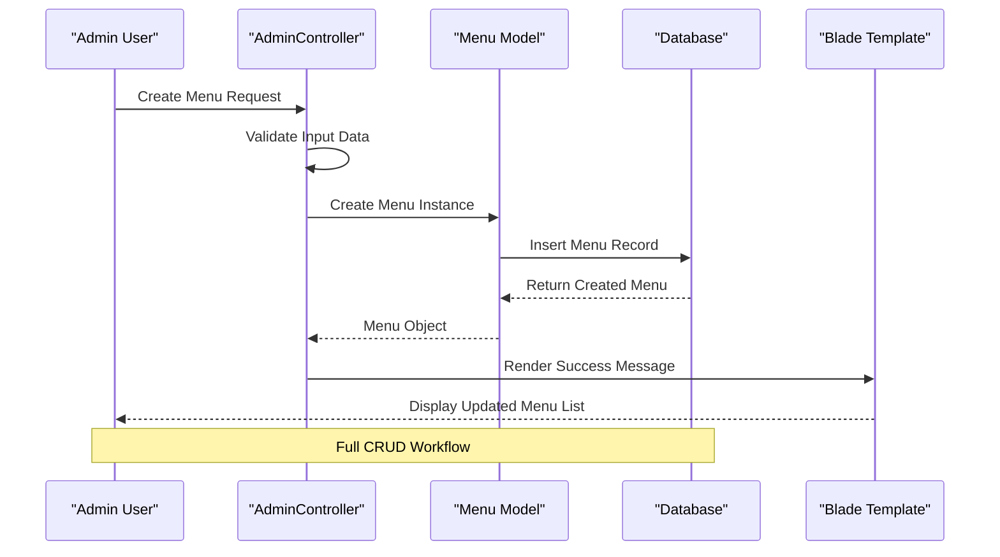

**Diagram sources**
- [AdminController.php:27-44](file://app/Http/Controllers/AdminController.php#L27-L44)
- [Menu.php:12-20](file://app/Models/Menu.php#L12-L20)

The architecture ensures loose coupling between components while maintaining clear data flow and responsibility segregation.

## Detailed Component Analysis

### Menu Model Implementation

The Menu model serves as the central entity for menu item management, implementing relationships with categories and order items:

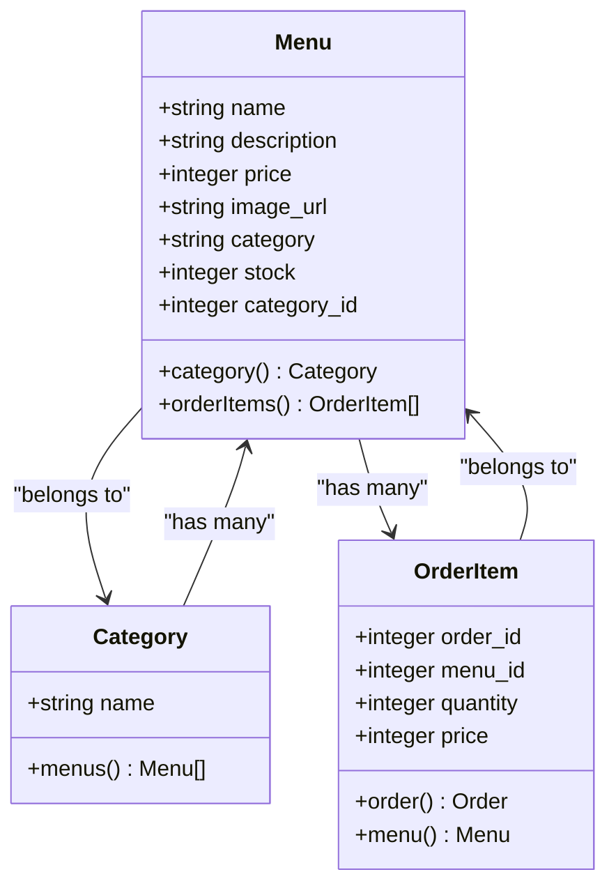

**Diagram sources**
- [Menu.php:22-30](file://app/Models/Menu.php#L22-L30)
- [Category.php:11-13](file://app/Models/Category.php#L11-L13)
- [OrderItem.php:19-27](file://app/Models/OrderItem.php#L19-L27)

**Section sources**
- [Menu.php:12-31](file://app/Models/Menu.php#L12-L31)

### Category Model Relationships

The Category model provides hierarchical organization for menu items:

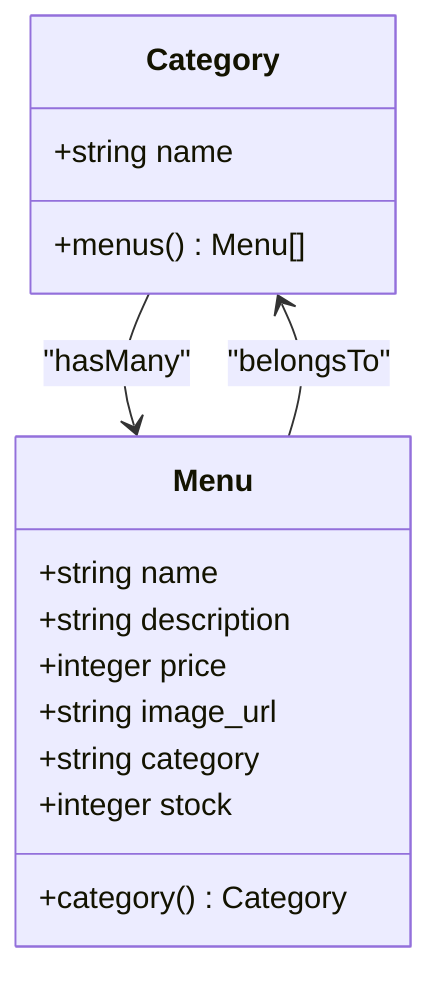

**Diagram sources**
- [Category.php:11-14](file://app/Models/Category.php#L11-L14)
- [Menu.php:22-25](file://app/Models/Menu.php#L22-L25)

**Section sources**
- [Category.php:8-15](file://app/Models/Category.php#L8-L15)

### OrderItem Integration

The OrderItem model bridges menu items with transaction processing:

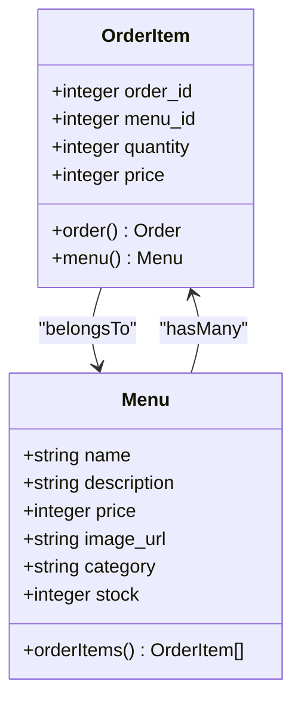

**Diagram sources**
- [OrderItem.php:12-27](file://app/Models/OrderItem.php#L12-L27)
- [Menu.php:27-30](file://app/Models/Menu.php#L27-L30)

**Section sources**
- [OrderItem.php:8-28](file://app/Models/OrderItem.php#L8-L28)

## Database Schema Design

The database schema for the menu management system is designed to support efficient querying, proper relationships, and scalability:

### Core Tables Structure

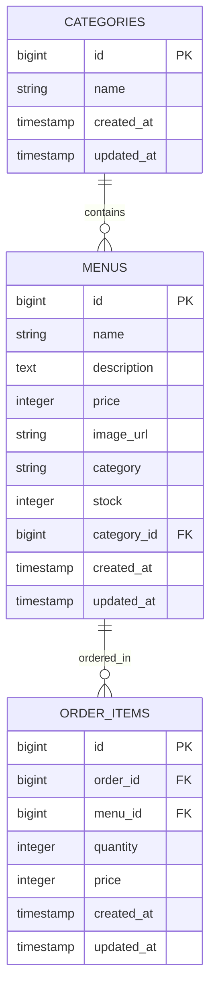

**Diagram sources**
- [2026_04_21_011703_create_menus_table.php:14-23](file://database/migrations/2026_04_21_011703_create_menus_table.php#L14-L23)
- [2026_05_15_072236_create_categories_table.php:14-18](file://database/migrations/2026_05_15_072236_create_categories_table.php#L14-L18)
- [2026_05_15_072320_add_category_id_to_menus_table.php:14-16](file://database/migrations/2026_05_15_072320_add_category_id_to_menus_table.php#L14-L16)

### Foreign Key Relationships

The schema implements proper referential integrity through foreign key constraints:

- **Menus.category_id** → **Categories.id** (ON DELETE SET NULL)
- **OrderItems.menu_id** → **Menus.id** (CASCADE DELETE)

### Indexing Strategy

The current schema includes implicit indexes on primary keys and foreign keys. Recommended additional indexes for performance optimization:

- **Menus.name** (FULLTEXT or TEXT INDEX for search)
- **Menus.category_id** (B-TREE INDEX)
- **Menus.stock** (B-TREE INDEX for inventory queries)
- **Categories.name** (B-TREE INDEX for category filtering)

**Section sources**
- [2026_04_27_021524_add_stock_to_menus_table.php:14-16](file://database/migrations/2026_04_27_021524_add_stock_to_menus_table.php#L14-L16)
- [2026_05_15_072320_add_category_id_to_menus_table.php:14-16](file://database/migrations/2026_05_15_072320_add_category_id_to_menus_table.php#L14-L16)

## CRUD Operations Implementation

The AdminController provides comprehensive CRUD operations for menu management through dedicated methods:

### Create Operation

The `storeMenu` method handles menu creation with validation and image processing:

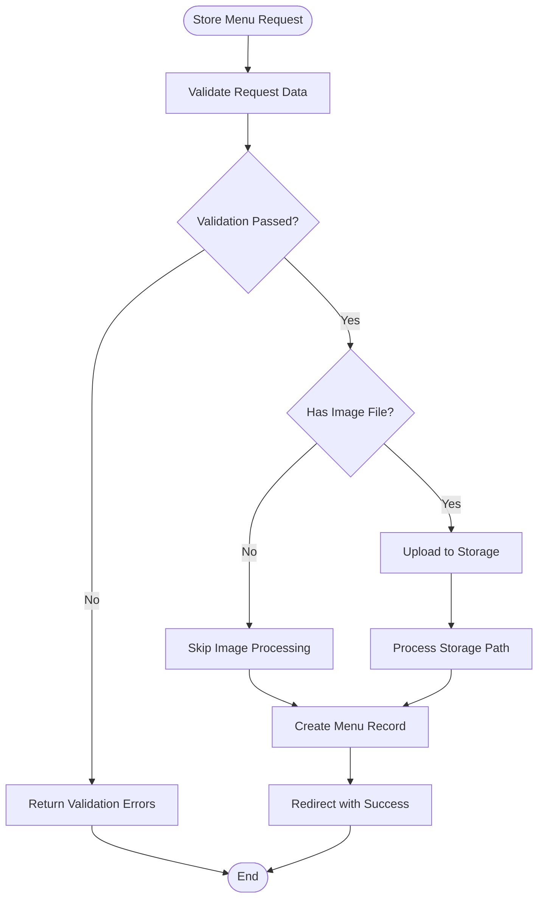

**Diagram sources**
- [AdminController.php:27-44](file://app/Http/Controllers/AdminController.php#L27-L44)

### Read Operation

The `menus` method provides menu listing functionality:

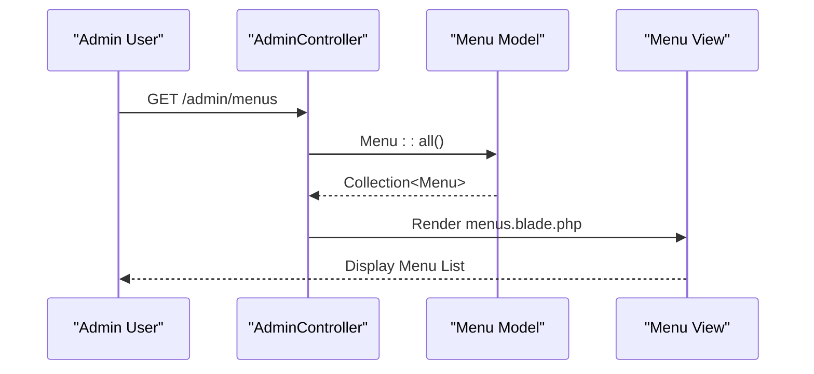

**Diagram sources**
- [AdminController.php:21-25](file://app/Http/Controllers/AdminController.php#L21-L25)
- [web.php:54](file://routes/web.php#L54)

### Update Operation

The `updateMenu` method handles menu modifications with optional image replacement:

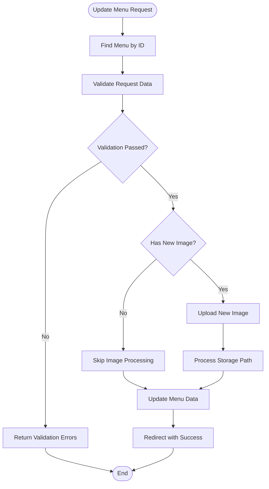

**Diagram sources**
- [AdminController.php:52-69](file://app/Http/Controllers/AdminController.php#L52-L69)

### Delete Operation

The `deleteMenu` method provides menu removal functionality:

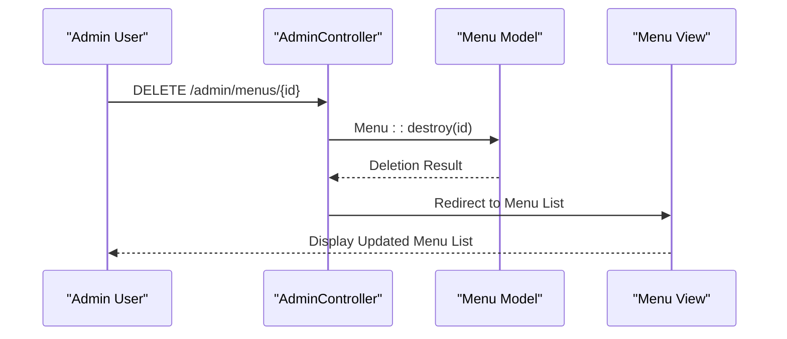

**Diagram sources**
- [AdminController.php:71-75](file://app/Http/Controllers/AdminController.php#L71-L75)

**Section sources**
- [AdminController.php:27-75](file://app/Http/Controllers/AdminController.php#L27-L75)

## Image Upload and Management

The system provides flexible image handling through multiple input methods:

### Image Input Methods

The menu management interface supports two primary image input approaches:

1. **URL-based Images**: Direct URL input for external images
2. **Local File Uploads**: File upload functionality for local storage

### Storage Integration

Images are processed and stored using Laravel's filesystem abstraction:

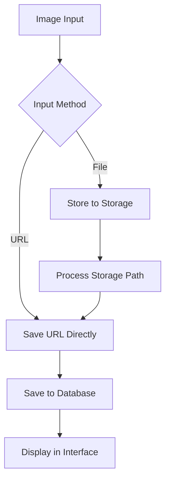

**Diagram sources**
- [AdminController.php:37-40](file://app/Http/Controllers/AdminController.php#L37-L40)
- [menus.blade.php:43-47](file://resources/views/admin/menus.blade.php#L43-L47)

### Image Processing Workflow

The image processing pipeline ensures proper storage and retrieval:

1. **Validation**: Verify image file format and size limits
2. **Storage**: Upload to designated storage location
3. **Path Processing**: Convert storage path to accessible URL
4. **Database Update**: Store processed image URL
5. **Display**: Render image in admin interface

**Section sources**
- [AdminController.php:37-40](file://app/Http/Controllers/AdminController.php#L37-L40)
- [menus.blade.php:43-59](file://resources/views/admin/menus.blade.php#L43-L59)

## Category Management

The system supports category-based organization of menu items through a dedicated relationship:

### Category Creation and Association

Categories are managed separately from menu items but provide essential organizational structure:

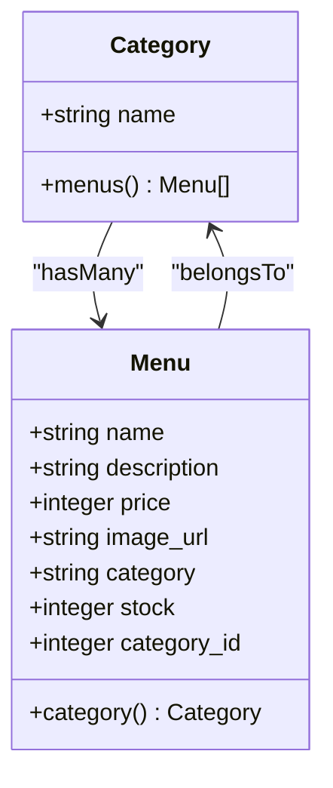

**Diagram sources**
- [Category.php:11-14](file://app/Models/Category.php#L11-L14)
- [Menu.php:22-25](file://app/Models/Menu.php#L22-L25)

### Category-Based Filtering

The current implementation supports category association through both string fields and foreign key relationships, enabling flexible categorization strategies.

**Section sources**
- [Category.php:8-15](file://app/Models/Category.php#L8-L15)
- [2026_05_15_072320_add_category_id_to_menus_table.php:14-16](file://database/migrations/2026_05_15_072320_add_category_id_to_menus_table.php#L14-L16)

## Stock Tracking System

The stock tracking system provides real-time inventory management capabilities:

### Stock Management Features

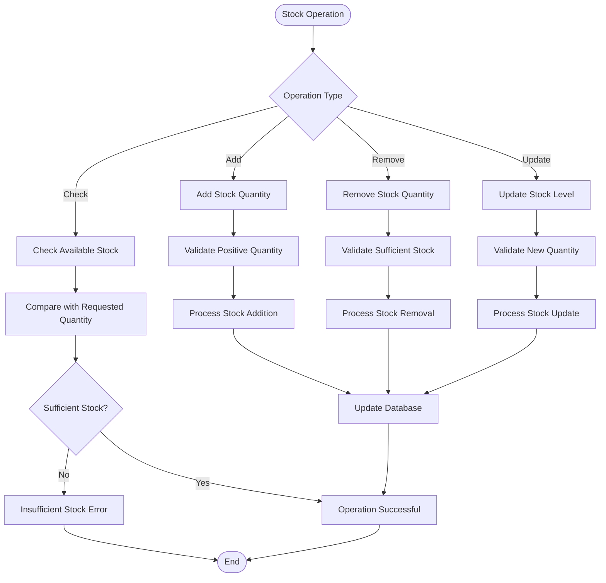

**Diagram sources**
- [2026_04_27_021524_add_stock_to_menus_table.php:14-16](file://database/migrations/2026_04_27_021524_add_stock_to_menus_table.php#L14-L16)
- [AdminController.php:158-163](file://app/Http/Controllers/AdminController.php#L158-L163)

### Stock Integration with Ordering

The stock system integrates with the ordering process to prevent overselling:

1. **Pre-order Validation**: Check stock availability before order processing
2. **Real-time Updates**: Immediately reduce stock upon successful order placement
3. **Error Handling**: Prevent orders exceeding available quantities
4. **Inventory Alerts**: Support for low-stock notifications

**Section sources**
- [AdminController.php:158-172](file://app/Http/Controllers/AdminController.php#L158-L172)

## Performance Optimization

Several optimization strategies can enhance the menu management system's performance:

### Database Query Optimization

- **Eager Loading**: Use `with()` methods to prevent N+1 query problems
- **Indexing**: Implement appropriate indexes on frequently queried columns
- **Pagination**: Apply pagination for large menu collections
- **Selectivity**: Use selective column retrieval for list views

### Caching Strategies

- **Menu Collections**: Cache frequently accessed menu lists
- **Category Data**: Cache category hierarchies
- **Stock Levels**: Cache real-time stock information
- **Image URLs**: Cache processed image URLs

### Frontend Performance

- **Lazy Loading**: Implement lazy loading for menu images
- **Virtual Scrolling**: Use virtual scrolling for large menu lists
- **Optimized Queries**: Minimize database round trips
- **CDN Integration**: Use CDN for static assets

## Frontend Integration

The menu management system provides comprehensive frontend integration through Blade templates:

### Administrative Interface

The admin layout provides a cohesive interface for menu management:

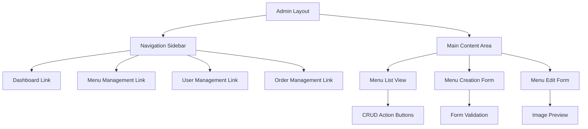

**Diagram sources**
- [admin.blade.php:22-32](file://resources/views/layouts/admin.blade.php#L22-L32)
- [menus.blade.php:6-94](file://resources/views/admin/menus.blade.php#L6-L94)

### Form Validation and User Experience

The frontend forms implement comprehensive validation and user feedback mechanisms:

- **Real-time Validation**: Client-side form validation
- **Server-side Validation**: Comprehensive backend validation
- **Error Display**: Clear error messaging
- **Success Feedback**: Confirmation messages for operations
- **Image Preview**: Live image preview during uploads

**Section sources**
- [menus.blade.php:15-50](file://resources/views/admin/menus.blade.php#L15-L50)
- [menus_edit.blade.php:20-62](file://resources/views/admin/menus_edit.blade.php#L20-L62)

## Validation and Error Handling

The system implements comprehensive validation and error handling mechanisms:

### Input Validation

The AdminController implements strict validation rules for menu operations:

- **Required Fields**: Name, price, and stock are mandatory
- **Type Validation**: Price and stock must be numeric
- **Range Validation**: Stock cannot be negative
- **File Validation**: Image uploads must meet size and format requirements

### Error Handling Strategies

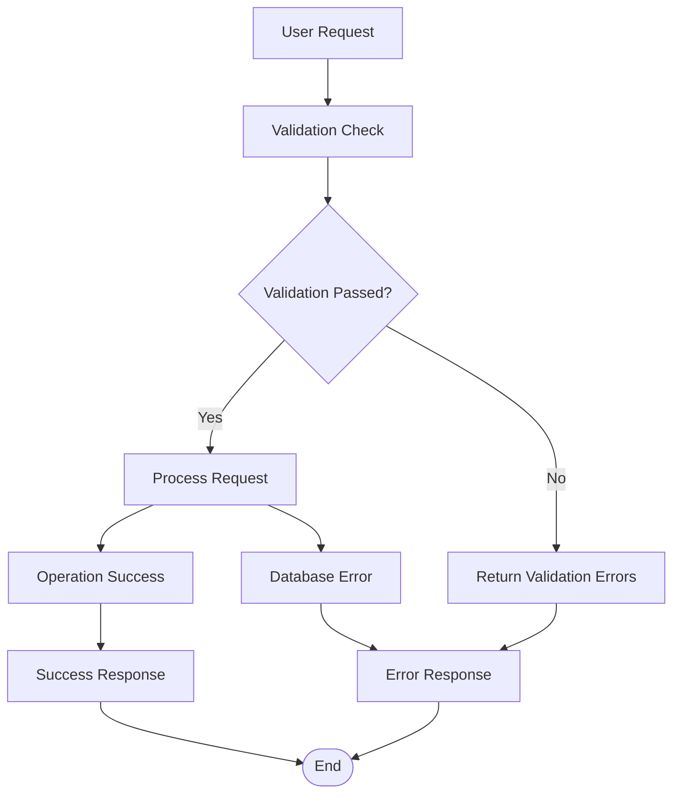

**Diagram sources**
- [AdminController.php:29-33](file://app/Http/Controllers/AdminController.php#L29-L33)
- [AdminController.php:55-59](file://app/Http/Controllers/AdminController.php#L55-L59)

### Session-Based Feedback

The system uses Laravel's session mechanism for user feedback:

- **Success Messages**: Confirmation of successful operations
- **Error Messages**: Display of validation and processing errors
- **CSRF Protection**: Automatic CSRF token validation
- **Method Spoofing**: Support for DELETE requests via form methods

**Section sources**
- [AdminController.php:43](file://app/Http/Controllers/AdminController.php#L43)
- [AdminController.php:68](file://app/Http/Controllers/AdminController.php#L68)

## Troubleshooting Guide

Common issues and their solutions in the menu management system:

### Database Migration Issues

**Problem**: Category ID migration fails during deployment
**Solution**: Ensure proper migration order and check foreign key constraints

**Problem**: Stock column addition fails
**Solution**: Verify database permissions and connection settings

### Image Upload Problems

**Problem**: Images not displaying after upload
**Solution**: Check storage permissions and symbolic link creation

**Problem**: Large image files causing timeouts
**Solution**: Implement file size validation and optimize image processing

### Performance Issues

**Problem**: Slow menu listing performance
**Solution**: Implement pagination and optimize database queries

**Problem**: Memory usage spikes during bulk operations
**Solution**: Use chunked processing for bulk operations

### Validation Errors

**Problem**: Form validation failing unexpectedly
**Solution**: Check validation rules and ensure proper CSRF token handling

**Section sources**
- [2026_05_15_072320_add_category_id_to_menus_table.php:14-16](file://database/migrations/2026_05_15_072320_add_category_id_to_menus_table.php#L14-L16)
- [AdminController.php:37-40](file://app/Http/Controllers/AdminController.php#L37-L40)

## Conclusion

The Menu Management System provides a robust, scalable solution for restaurant menu administration with comprehensive CRUD operations, category management, stock tracking, and image handling capabilities. The system's architecture supports future enhancements while maintaining clean separation of concerns and efficient data management.

Key strengths of the system include:

- **Complete CRUD Functionality**: Full lifecycle management of menu items
- **Flexible Category System**: Support for hierarchical menu organization
- **Real-time Stock Management**: Integrated inventory tracking with order processing
- **Robust Image Handling**: Multiple input methods with proper storage management
- **Admin-Friendly Interface**: Intuitive administrative controls with validation feedback
- **Performance Considerations**: Built-in optimization opportunities for scaling

The system provides a solid foundation for restaurant management operations and can be extended with additional features such as advanced reporting, bulk operations, and enhanced search capabilities as business requirements evolve.