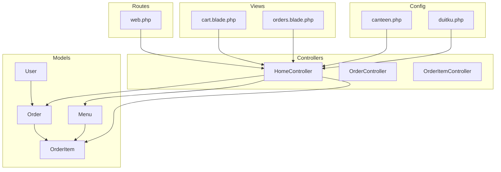
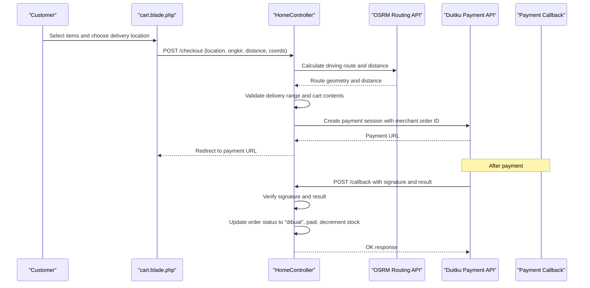
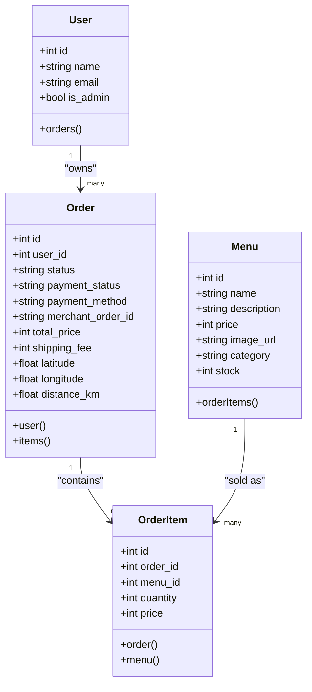
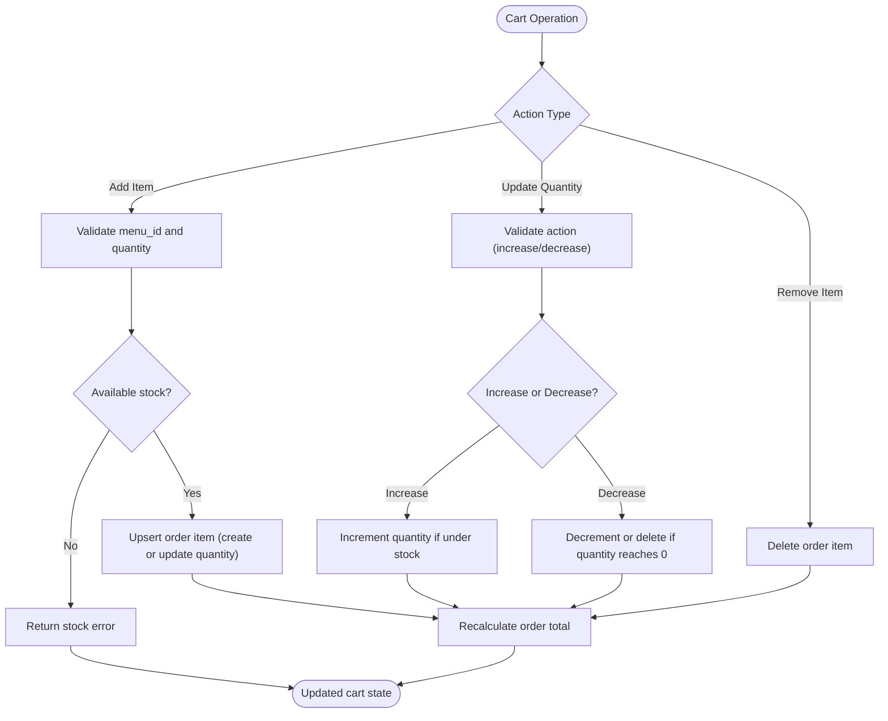
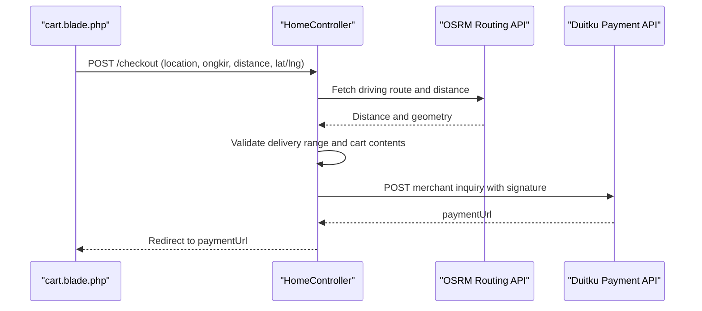
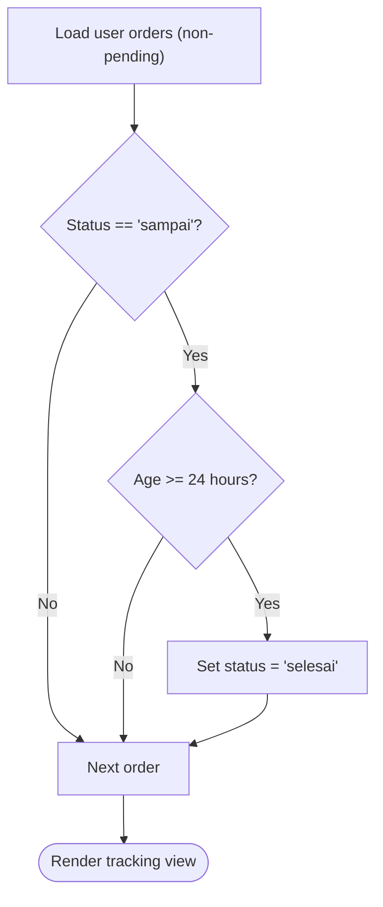
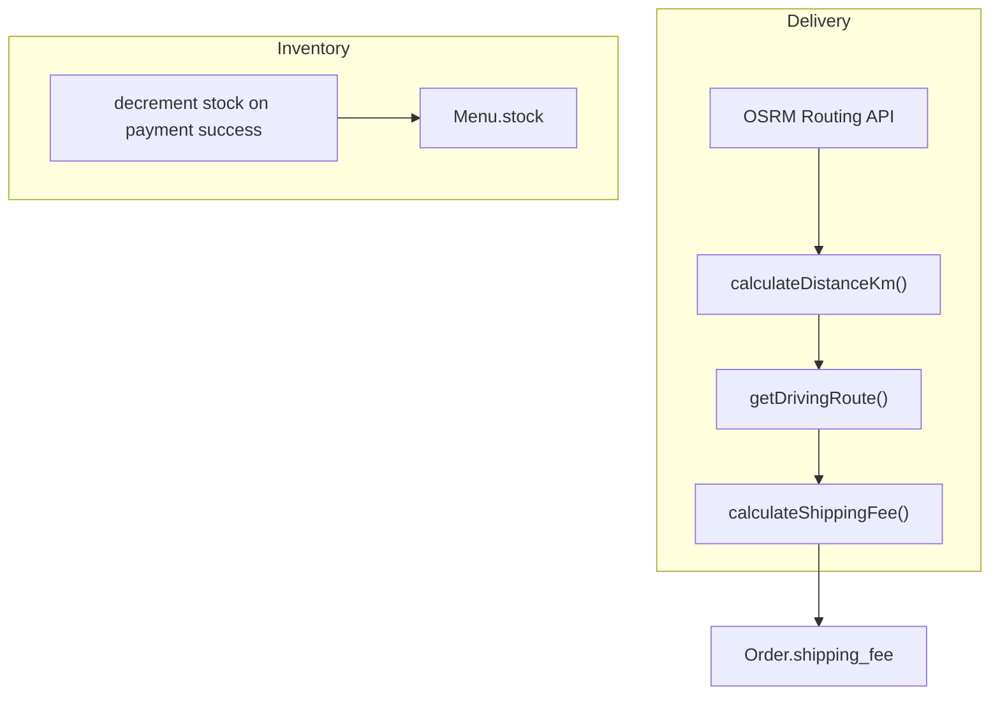
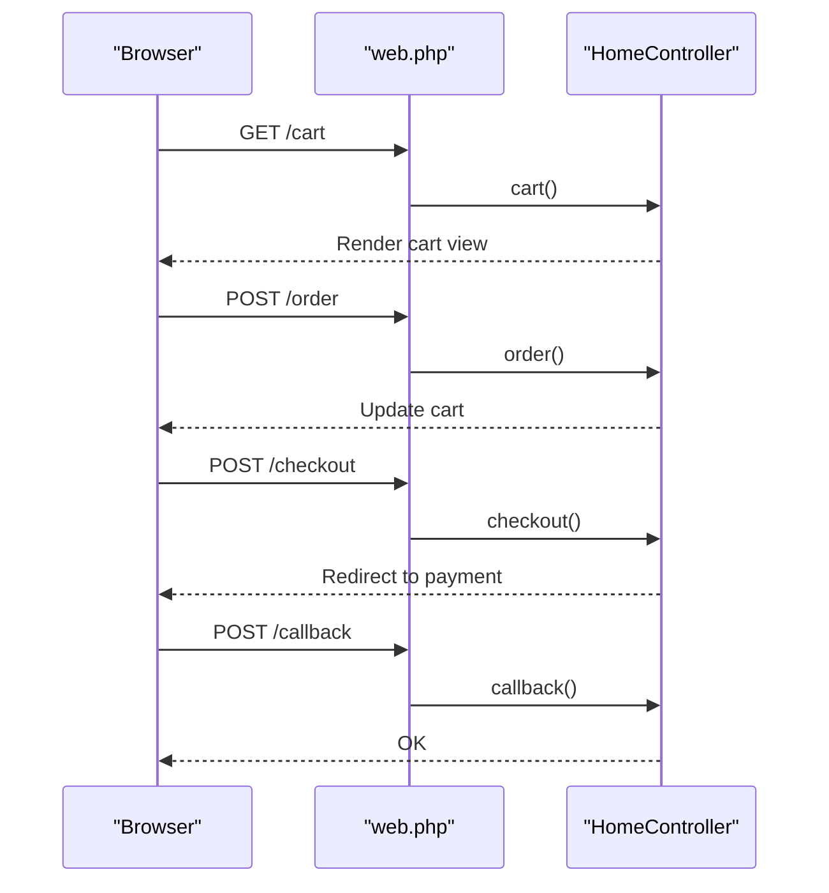
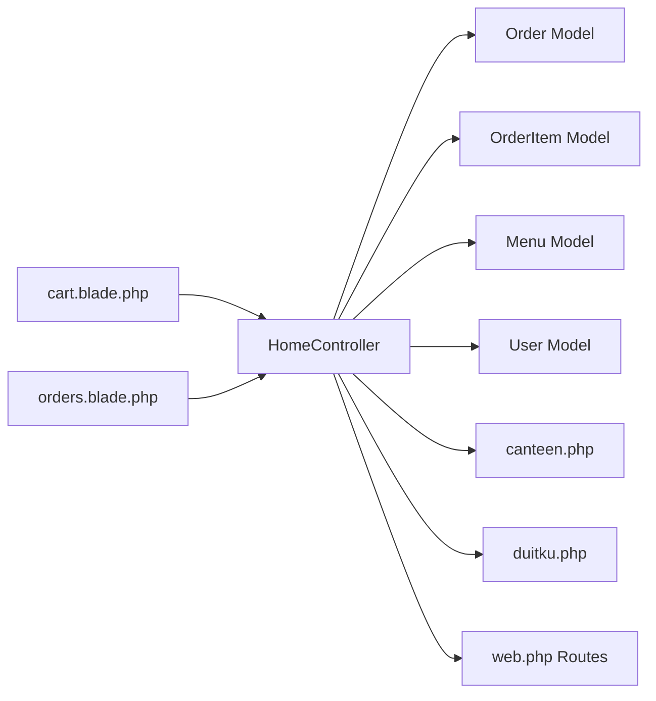

# Order Processing Workflow

<cite>
**Referenced Files in This Document**
- [Order.php](file://app/Models/Order.php)
- [OrderItem.php](file://app/Models/OrderItem.php)
- [Menu.php](file://app/Models/Menu.php)
- [User.php](file://app/Models/User.php)
- [HomeController.php](file://app/Http/Controllers/HomeController.php)
- [OrderController.php](file://app/Http/Controllers/OrderController.php)
- [OrderItemController.php](file://app/Http/Controllers/OrderItemController.php)
- [web.php](file://routes/web.php)
- [2026_04_21_011703_create_orders_table.php](file://database/migrations/2026_04_21_011703_create_orders_table.php)
- [2026_04_21_011704_create_order_items_table.php](file://database/migrations/2026_04_21_011704_create_order_items_table.php)
- [2026_05_18_020058_add_shipping_fields_to_orders_table.php](file://database/migrations/2026_05_18_020058_add_shipping_fields_to_orders_table.php)
- [2026_05_24_000000_add_payment_fields_to_orders_table.php](file://database/migrations/2026_05_24_000000_add_payment_fields_to_orders_table.php)
- [cart.blade.php](file://resources/views/cart.blade.php)
- [orders.blade.php](file://resources/views/orders.blade.php)
- [canteen.php](file://config/canteen.php)
- [duitku.php](file://config/duitku.php)
</cite>

## Table of Contents
1. [Introduction](#introduction)
2. [Project Structure](#project-structure)
3. [Core Components](#core-components)
4. [Architecture Overview](#architecture-overview)
5. [Detailed Component Analysis](#detailed-component-analysis)
6. [Dependency Analysis](#dependency-analysis)
7. [Performance Considerations](#performance-considerations)
8. [Troubleshooting Guide](#troubleshooting-guide)
9. [Conclusion](#conclusion)
10. [Appendices](#appendices)

## Introduction
This document describes the complete order processing workflow system for the canteen ordering platform. It covers the end-to-end lifecycle from cart creation through order completion, including order creation, modification, cancellation, and status tracking. It explains the Order and OrderItem model relationships, foreign key constraints, and data integrity measures. It also documents the controllers responsible for managing order data, item quantities, and order status updates, along with cart functionality, order validation, and inventory management integration. Practical examples illustrate order creation, status transitions, order history management, and bulk order operations. Finally, it details integrations with payment processing, delivery management, and notification systems, and addresses workflow automation, status triggers, and audit trail functionality.

## Project Structure
The order processing system spans models, controllers, routes, views, and configuration files. The key components are:
- Models: Order, OrderItem, Menu, User
- Controllers: HomeController (primary order workflow), OrderController, OrderItemController
- Routes: Web routes for cart, checkout, payment callbacks, and order management
- Views: Cart page, order tracking page
- Configurations: Canteen delivery settings and Duitku payment gateway settings

**Diagram sources**
- [Order.php:8-35](file://app/Models/Order.php#L8-L35)
- [OrderItem.php:8-28](file://app/Models/OrderItem.php#L8-L28)
- [Menu.php:8-31](file://app/Models/Menu.php#L8-L31)
- [User.php:10-54](file://app/Models/User.php#L10-L54)
- [HomeController.php:12-568](file://app/Http/Controllers/HomeController.php#L12-L568)
- [OrderController.php:7-10](file://app/Http/Controllers/OrderController.php#L7-L10)
- [OrderItemController.php:7-10](file://app/Http/Controllers/OrderItemController.php#L7-L10)
- [web.php:33-71](file://routes/web.php#L33-L71)
- [cart.blade.php:1-452](file://resources/views/cart.blade.php#L1-L452)
- [orders.blade.php:1-186](file://resources/views/orders.blade.php#L1-L186)
- [canteen.php:1-9](file://config/canteen.php#L1-L9)
- [duitku.php:1-12](file://config/duitku.php#L1-L12)

**Section sources**
- [web.php:33-71](file://routes/web.php#L33-L71)
- [HomeController.php:12-568](file://app/Http/Controllers/HomeController.php#L12-L568)

## Core Components
This section outlines the primary components involved in the order lifecycle.

- Order model: Represents customer orders with status, payment status, total price, shipping fee, and location metadata. It belongs to a User and has many OrderItems.
- OrderItem model: Represents individual items within an order, linking to Order and Menu, storing quantity and price at time of purchase.
- Menu model: Contains menu details including stock, used to validate availability during cart operations.
- User model: Associates orders with users and supports order history retrieval.
- HomeController: Implements the complete order workflow including cart management, delivery estimation, checkout, payment initiation, callback handling, and order confirmation.
- OrderController and OrderItemController: Currently minimal placeholders; intended for future dedicated order management APIs.

Key relationships and constraints:
- Order.user_id references users.id with cascade delete.
- OrderItem.order_id references orders.id with cascade delete.
- OrderItem.menu_id references menus.id with cascade delete.
- Order status defaults to pending; payment_status defaults to pending; payment_method and merchant_order_id are added later.

**Section sources**
- [Order.php:8-35](file://app/Models/Order.php#L8-L35)
- [OrderItem.php:8-28](file://app/Models/OrderItem.php#L8-L28)
- [Menu.php:8-31](file://app/Models/Menu.php#L8-L31)
- [User.php:10-54](file://app/Models/User.php#L10-L54)
- [2026_04_21_011703_create_orders_table.php:14-21](file://database/migrations/2026_04_21_011703_create_orders_table.php#L14-L21)
- [2026_04_21_011704_create_order_items_table.php:14-21](file://database/migrations/2026_04_21_011704_create_order_items_table.php#L14-L21)
- [2026_05_18_020058_add_shipping_fields_to_orders_table.php:14-19](file://database/migrations/2026_05_18_020058_add_shipping_fields_to_orders_table.php#L14-L19)
- [2026_05_24_000000_add_payment_fields_to_orders_table.php:11-15](file://database/migrations/2026_05_24_000000_add_payment_fields_to_orders_table.php#L11-L15)

## Architecture Overview
The order processing architecture integrates frontend views, backend controllers, and external services. The flow begins at the cart view, proceeds through checkout and payment initiation, and concludes with payment callbacks that update order status and inventory.

**Diagram sources**
- [cart.blade.php:266-317](file://resources/views/cart.blade.php#L266-L317)
- [HomeController.php:275-408](file://app/Http/Controllers/HomeController.php#L275-L408)
- [HomeController.php:514-545](file://app/Http/Controllers/HomeController.php#L514-L545)
- [HomeController.php:410-452](file://app/Http/Controllers/HomeController.php#L410-L452)

## Detailed Component Analysis

### Order and OrderItem Models
The Order and OrderItem models define the core domain entities for the order processing workflow.

**Diagram sources**
- [Order.php:8-35](file://app/Models/Order.php#L8-L35)
- [OrderItem.php:8-28](file://app/Models/OrderItem.php#L8-L28)
- [Menu.php:8-31](file://app/Models/Menu.php#L8-L31)
- [User.php:10-54](file://app/Models/User.php#L10-L54)

Data integrity and constraints:
- Orders and order items are linked via foreign keys with cascade deletes to maintain referential integrity.
- Status and payment fields are initialized with sensible defaults to ensure consistent state transitions.
- Stock is decremented upon successful payment to prevent overselling.

**Section sources**
- [2026_04_21_011703_create_orders_table.php:14-21](file://database/migrations/2026_04_21_011703_create_orders_table.php#L14-L21)
- [2026_04_21_011704_create_order_items_table.php:14-21](file://database/migrations/2026_04_21_011704_create_order_items_table.php#L14-L21)
- [2026_05_18_020058_add_shipping_fields_to_orders_table.php:14-19](file://database/migrations/2026_05_18_020058_add_shipping_fields_to_orders_table.php#L14-L19)
- [2026_05_24_000000_add_payment_fields_to_orders_table.php:11-15](file://database/migrations/2026_05_24_000000_add_payment_fields_to_orders_table.php#L11-L15)

### Cart Functionality and Validation
The cart functionality allows customers to add items, adjust quantities, remove items, and estimate shipping costs based on delivery location.

**Diagram sources**
- [HomeController.php:57-114](file://app/Http/Controllers/HomeController.php#L57-L114)
- [HomeController.php:192-263](file://app/Http/Controllers/HomeController.php#L192-L263)
- [HomeController.php:265-273](file://app/Http/Controllers/HomeController.php#L265-L273)

Key validations:
- Stock checks prevent overselling during add and update operations.
- Pending order scoping ensures cart operations target the active order for the logged-in user.
- JSON responses support AJAX-driven cart updates.

**Section sources**
- [HomeController.php:57-114](file://app/Http/Controllers/HomeController.php#L57-L114)
- [HomeController.php:192-263](file://app/Http/Controllers/HomeController.php#L192-L263)

### Checkout and Payment Integration
The checkout process validates delivery location, calculates shipping fees, constructs a payment session via Duitku, and redirects the customer to the payment URL.

**Diagram sources**
- [cart.blade.php:289-304](file://resources/views/cart.blade.php#L289-L304)
- [HomeController.php:275-408](file://app/Http/Controllers/HomeController.php#L275-L408)
- [HomeController.php:514-545](file://app/Http/Controllers/HomeController.php#L514-L545)
- [HomeController.php:552-557](file://app/Http/Controllers/HomeController.php#L552-L557)

Payment handling:
- Merchant order ID is generated and stored on the order.
- Signature verification ensures payment authenticity.
- On success, order status transitions to "dibuat", payment_status to "paid", and stock is decremented.

**Section sources**
- [HomeController.php:275-408](file://app/Http/Controllers/HomeController.php#L275-L408)
- [HomeController.php:410-452](file://app/Http/Controllers/HomeController.php#L410-L452)

### Order Status Tracking and Automation
The order tracking view displays a progress timeline and summary, while automated logic completes "sampai" orders after 24 hours.

**Diagram sources**
- [orders.blade.php:44-51](file://resources/views/orders.blade.php#L44-L51)
- [HomeController.php:470-489](file://app/Http/Controllers/HomeController.php#L470-L489)

**Section sources**
- [orders.blade.php:44-51](file://resources/views/orders.blade.php#L44-L51)
- [HomeController.php:470-489](file://app/Http/Controllers/HomeController.php#L470-L489)

### Delivery Management and Inventory Integration
Delivery management integrates with OSRM for route calculation and distance computation, and with Duitku for payment processing. Inventory is managed by decrementing menu stock upon successful payment.

**Diagram sources**
- [HomeController.php:502-550](file://app/Http/Controllers/HomeController.php#L502-L550)
- [HomeController.php:440-446](file://app/Http/Controllers/HomeController.php#L440-L446)

**Section sources**
- [HomeController.php:502-550](file://app/Http/Controllers/HomeController.php#L502-L550)
- [HomeController.php:440-446](file://app/Http/Controllers/HomeController.php#L440-L446)

### Controllers and Routes
The routing layer connects frontend actions to controller methods, enabling cart operations, checkout, payment callbacks, and order management.

**Diagram sources**
- [web.php:37-47](file://routes/web.php#L37-L47)
- [HomeController.php:116-125](file://app/Http/Controllers/HomeController.php#L116-L125)
- [HomeController.php:57-114](file://app/Http/Controllers/HomeController.php#L57-L114)
- [HomeController.php:275-408](file://app/Http/Controllers/HomeController.php#L275-L408)
- [HomeController.php:410-452](file://app/Http/Controllers/HomeController.php#L410-L452)

**Section sources**
- [web.php:37-47](file://routes/web.php#L37-L47)
- [HomeController.php:116-125](file://app/Http/Controllers/HomeController.php#L116-L125)
- [HomeController.php:57-114](file://app/Http/Controllers/HomeController.php#L57-L114)
- [HomeController.php:275-408](file://app/Http/Controllers/HomeController.php#L275-L408)
- [HomeController.php:410-452](file://app/Http/Controllers/HomeController.php#L410-L452)

## Dependency Analysis
The system exhibits clear separation of concerns with tight coupling between models and controllers, and loose coupling with external services.

**Diagram sources**
- [HomeController.php:12-568](file://app/Http/Controllers/HomeController.php#L12-L568)
- [Order.php:8-35](file://app/Models/Order.php#L8-L35)
- [OrderItem.php:8-28](file://app/Models/OrderItem.php#L8-L28)
- [Menu.php:8-31](file://app/Models/Menu.php#L8-L31)
- [User.php:10-54](file://app/Models/User.php#L10-L54)
- [web.php:33-71](file://routes/web.php#L33-L71)
- [cart.blade.php:1-452](file://resources/views/cart.blade.php#L1-L452)
- [orders.blade.php:1-186](file://resources/views/orders.blade.php#L1-L186)
- [canteen.php:1-9](file://config/canteen.php#L1-L9)
- [duitku.php:1-12](file://config/duitku.php#L1-L12)

**Section sources**
- [HomeController.php:12-568](file://app/Http/Controllers/HomeController.php#L12-L568)
- [web.php:33-71](file://routes/web.php#L33-L71)

## Performance Considerations
- Minimize database queries by eager-loading relations (e.g., items.menu) when rendering cart and order views.
- Cache frequently accessed configuration values (e.g., canteen coordinates) to reduce repeated reads.
- Batch stock updates during payment success to avoid multiple write operations.
- Use asynchronous callbacks for payment verification to prevent blocking requests.
- Limit route calculation retries and timeouts to maintain responsiveness.

## Troubleshooting Guide
Common issues and resolutions:
- Payment configuration errors: Ensure DUITKU_MERCHANT_CODE and DUITKU_API_KEY are set; otherwise, checkout returns a configuration error.
- Delivery range exceeded: If distance exceeds the configured maximum, checkout rejects the request.
- Stock validation failures: When adding or updating items, ensure quantity does not exceed available stock.
- Route calculation failures: If OSRM route is unavailable, checkout cannot compute shipping cost; prompt user to select a nearby road.
- Callback signature mismatch: Payment callbacks verify signatures; mismatches return invalid signature responses.

**Section sources**
- [HomeController.php:316-321](file://app/Http/Controllers/HomeController.php#L316-L321)
- [HomeController.php:295-301](file://app/Http/Controllers/HomeController.php#L295-L301)
- [HomeController.php:82-92](file://app/Http/Controllers/HomeController.php#L82-L92)
- [HomeController.php:514-545](file://app/Http/Controllers/HomeController.php#L514-L545)
- [HomeController.php:424-451](file://app/Http/Controllers/HomeController.php#L424-L451)

## Conclusion
The order processing workflow integrates cart management, delivery estimation, payment processing, and order status automation. The model relationships and migrations enforce data integrity, while the controller logic handles validation, inventory updates, and external service integrations. The views provide a seamless user experience for managing orders and tracking deliveries. Future enhancements could include dedicated OrderController and OrderItemController methods for API-first operations, expanded status triggers, and richer audit trails.

## Appendices

### Practical Examples

- Creating an order:
  - Add items to cart via POST /order with menu_id and quantity.
  - Proceed to checkout via POST /checkout with location, ongkir, distance, and coordinates.
  - Receive payment URL and complete payment via Duitku.

- Updating order status:
  - Payment callback updates order to "dibuat" and "paid".
  - Automated logic sets "sampai" orders to "selesai" after 24 hours.

- Managing order history:
  - Access /orders to view tracked orders and summaries.
  - Confirm receipt for "sampai" orders to mark as "selesai".

- Bulk operations:
  - Adjust quantities via POST /cart/update/{id} (increase/decrease).
  - Remove items via DELETE /cart/remove/{id}.
  - Recalculation occurs automatically after each change.

**Section sources**
- [web.php:37-47](file://routes/web.php#L37-L47)
- [HomeController.php:57-114](file://app/Http/Controllers/HomeController.php#L57-L114)
- [HomeController.php:192-263](file://app/Http/Controllers/HomeController.php#L192-L263)
- [HomeController.php:275-408](file://app/Http/Controllers/HomeController.php#L275-L408)
- [HomeController.php:410-452](file://app/Http/Controllers/HomeController.php#L410-L452)
- [HomeController.php:470-489](file://app/Http/Controllers/HomeController.php#L470-L489)