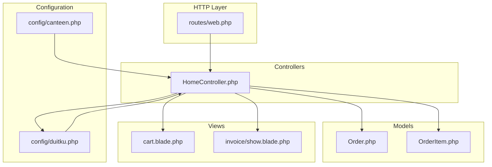
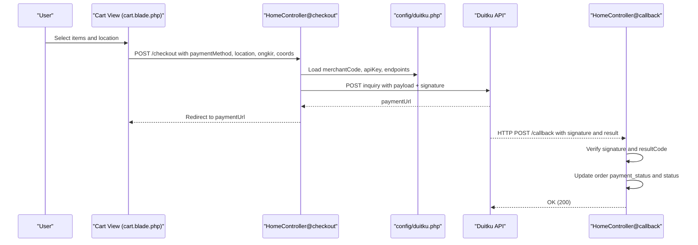
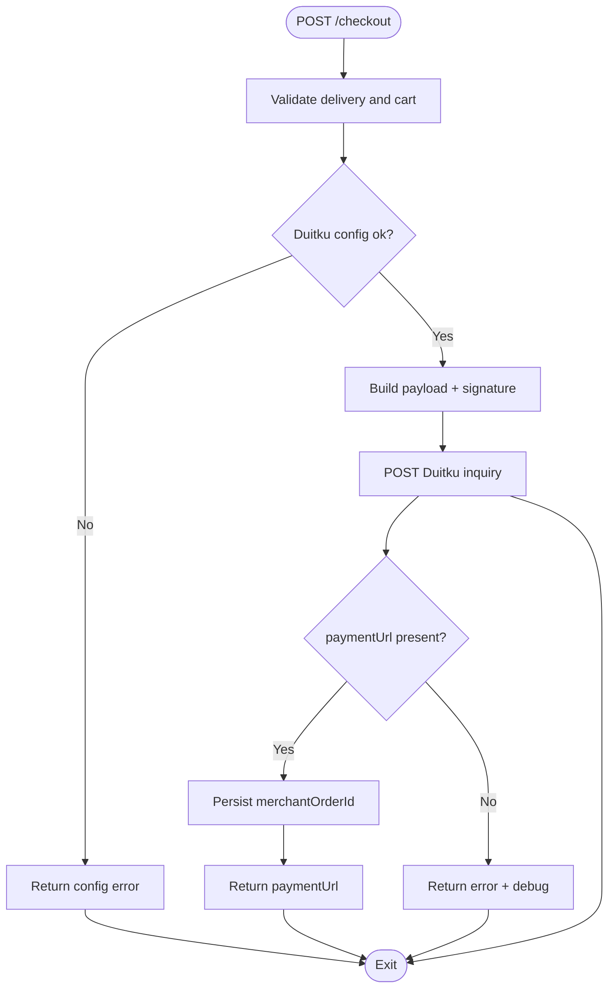
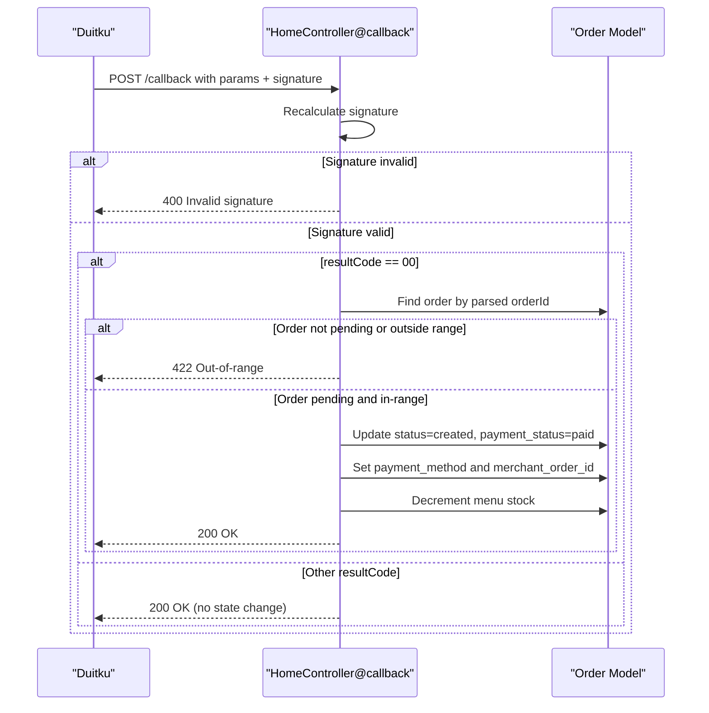
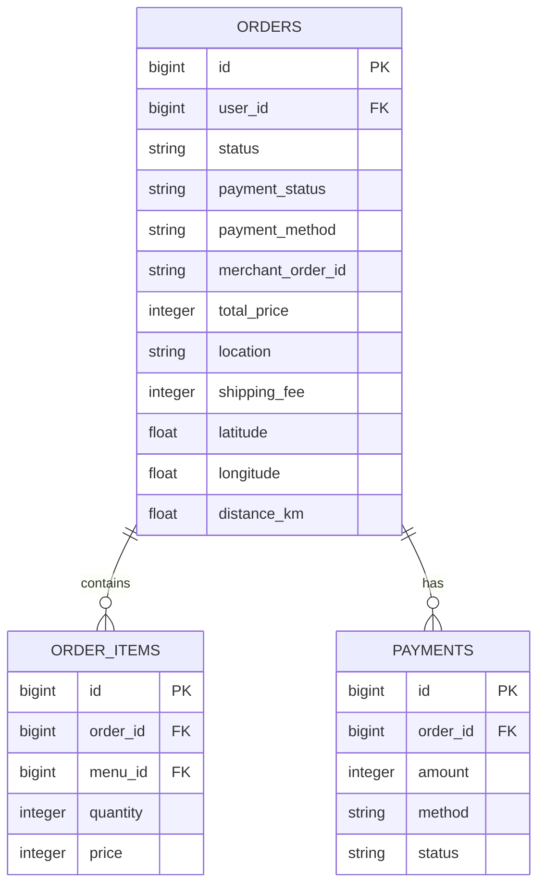
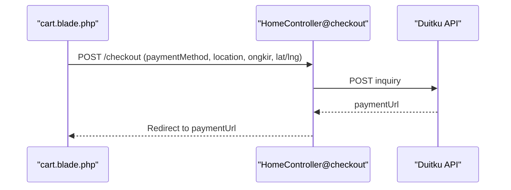
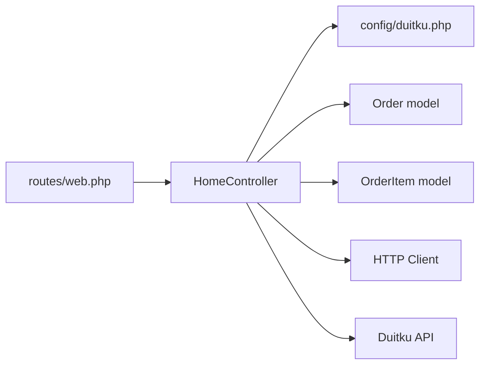

# Payment Integration

<cite>
**Referenced Files in This Document**
- [HomeController.php](file://app/Http/Controllers/HomeController.php)
- [web.php](file://routes/web.php)
- [duitku.php](file://config/duitku.php)
- [Order.php](file://app/Models/Order.php)
- [OrderItem.php](file://app/Models/OrderItem.php)
- [2026_05_15_072246_create_payments_table.php](file://database/migrations/2026_05_15_072246_create_payments_table.php)
- [2026_05_24_000000_add_payment_fields_to_orders_table.php](file://database/migrations/2026_05_24_000000_add_payment_fields_to_orders_table.php)
- [cart.blade.php](file://resources/views/cart.blade.php)
- [show.blade.php](file://resources/views/invoice/show.blade.php)
- [canteen.php](file://config/canteen.php)
</cite>

## Table of Contents
1. [Introduction](#introduction)
2. [Project Structure](#project-structure)
3. [Core Components](#core-components)
4. [Architecture Overview](#architecture-overview)
5. [Detailed Component Analysis](#detailed-component-analysis)
6. [Dependency Analysis](#dependency-analysis)
7. [Performance Considerations](#performance-considerations)
8. [Troubleshooting Guide](#troubleshooting-guide)
9. [Conclusion](#conclusion)
10. [Appendices](#appendices)

## Introduction
This document explains the payment integration system using the Duitku payment gateway. It covers the complete payment lifecycle: initiating payments, handling callbacks, verifying transactions, updating statuses, and integrating with order processing. It also documents configuration, security practices, sandbox testing, and production deployment requirements.

## Project Structure
The payment integration spans several layers:
- Routes define endpoints for checkout, callback, and success redirection.
- HomeController orchestrates payment initiation, callback handling, and status updates.
- Configuration files provide Duitku credentials and endpoints.
- Models represent orders, order items, and payments.
- Views render the cart and invoice pages, including payment initiation UI.

**Diagram sources**
- [web.php:33-50](file://routes/web.php#L33-L50)
- [HomeController.php:343-381](file://app/Http/Controllers/HomeController.php#L343-L381)
- [duitku.php:3-11](file://config/duitku.php#L3-L11)
- [Order.php:12-24](file://app/Models/Order.php#L12-L24)
- [OrderItem.php:12-17](file://app/Models/OrderItem.php#L12-L17)
- [cart.blade.php:289-317](file://resources/views/cart.blade.php#L289-L317)
- [show.blade.php:1-125](file://resources/views/invoice/show.blade.php#L1-L125)

**Section sources**
- [web.php:33-50](file://routes/web.php#L33-L50)
- [HomeController.php:343-381](file://app/Http/Controllers/HomeController.php#L343-L381)
- [duitku.php:3-11](file://config/duitku.php#L3-L11)
- [Order.php:12-24](file://app/Models/Order.php#L12-L24)
- [OrderItem.php:12-17](file://app/Models/OrderItem.php#L12-L17)
- [cart.blade.php:289-317](file://resources/views/cart.blade.php#L289-L317)
- [show.blade.php:1-125](file://resources/views/invoice/show.blade.php#L1-L125)

## Core Components
- HomeController: Implements payment initiation, callback verification, and status updates.
- Routes: Define checkout, callback, and success endpoints.
- Configuration: Duitku merchant credentials, endpoints, and environment selection.
- Models: Order, OrderItem, and Payments table for persistence.
- Views: Cart page initiates checkout; invoice displays payment status.

Key responsibilities:
- Build Duitku payload with signature and expiry.
- Call Duitku inquiry endpoint and receive paymentUrl.
- Verify callback signatures and update order/payment status.
- Decrement stock upon successful payment.
- Track payment_status and payment_method on orders.

**Section sources**
- [HomeController.php:343-408](file://app/Http/Controllers/HomeController.php#L343-L408)
- [HomeController.php:410-452](file://app/Http/Controllers/HomeController.php#L410-L452)
- [web.php:42-50](file://routes/web.php#L42-L50)
- [duitku.php:3-11](file://config/duitku.php#L3-L11)
- [Order.php:12-24](file://app/Models/Order.php#L12-L24)
- [OrderItem.php:12-17](file://app/Models/OrderItem.php#L12-L17)
- [2026_05_15_072246_create_payments_table.php:14-21](file://database/migrations/2026_05_15_072246_create_payments_table.php#L14-L21)
- [2026_05_24_000000_add_payment_fields_to_orders_table.php:11-15](file://database/migrations/2026_05_24_000000_add_payment_fields_to_orders_table.php#L11-L15)

## Architecture Overview
The payment flow integrates frontend UI, backend controller actions, configuration, and external Duitku API.

**Diagram sources**
- [cart.blade.php:289-317](file://resources/views/cart.blade.php#L289-L317)
- [HomeController.php:275-408](file://app/Http/Controllers/HomeController.php#L275-L408)
- [HomeController.php:410-452](file://app/Http/Controllers/HomeController.php#L410-L452)
- [duitku.php:3-11](file://config/duitku.php#L3-L11)
- [web.php:42-50](file://routes/web.php#L42-L50)

## Detailed Component Analysis

### Payment Initiation Workflow (HomeController@checkout)
- Validates delivery range and cart contents.
- Loads Duitku configuration and constructs payload:
  - merchantCode, merchantOrderId, paymentAmount, productDetails, customer info, callbackUrl, returnUrl, signature, expiryPeriod, paymentMethod.
- Calls Duitku inquiry endpoint based on environment (sandbox vs production).
- On success, persists merchantOrderId and returns paymentUrl; on failure, returns structured error with debug data.

**Diagram sources**
- [HomeController.php:316-408](file://app/Http/Controllers/HomeController.php#L316-L408)
- [HomeController.php:552-557](file://app/Http/Controllers/HomeController.php#L552-L557)
- [HomeController.php:559-566](file://app/Http/Controllers/HomeController.php#L559-L566)

**Section sources**
- [HomeController.php:275-408](file://app/Http/Controllers/HomeController.php#L275-L408)
- [HomeController.php:552-566](file://app/Http/Controllers/HomeController.php#L552-L566)
- [cart.blade.php:289-317](file://resources/views/cart.blade.php#L289-L317)

### Callback Handling and Transaction Verification (HomeController@callback)
- Extracts Duitku parameters and recalculates signature.
- Compares signatures; rejects invalid.
- If signature valid and resultCode indicates success:
  - Parse orderId from merchantOrderId.
  - Ensure order exists and is pending.
  - Enforce delivery range policy.
  - Set order status to created, payment_status to paid, capture paymentCode, persist merchantOrderId.
  - Decrement menu stock for each order item.

**Diagram sources**
- [HomeController.php:410-452](file://app/Http/Controllers/HomeController.php#L410-L452)
- [Order.php:12-24](file://app/Models/Order.php#L12-L24)

**Section sources**
- [HomeController.php:410-452](file://app/Http/Controllers/HomeController.php#L410-L452)
- [Order.php:12-24](file://app/Models/Order.php#L12-L24)

### Payment Status Tracking and Order Fields
- Orders track payment_status, payment_method, and merchant_order_id.
- These fields are updated during checkout and callback processing.
- Invoice view derives payment status and method for display.

**Diagram sources**
- [Order.php:12-24](file://app/Models/Order.php#L12-L24)
- [OrderItem.php:12-17](file://app/Models/OrderItem.php#L12-L17)
- [2026_05_15_072246_create_payments_table.php:14-21](file://database/migrations/2026_05_15_072246_create_payments_table.php#L14-L21)
- [2026_05_24_000000_add_payment_fields_to_orders_table.php:11-15](file://database/migrations/2026_05_24_000000_add_payment_fields_to_orders_table.php#L11-L15)

**Section sources**
- [Order.php:12-24](file://app/Models/Order.php#L12-L24)
- [OrderItem.php:12-17](file://app/Models/OrderItem.php#L12-L17)
- [2026_05_15_072246_create_payments_table.php:14-21](file://database/migrations/2026_05_15_072246_create_payments_table.php#L14-L21)
- [2026_05_24_000000_add_payment_fields_to_orders_table.php:11-15](file://database/migrations/2026_05_24_000000_add_payment_fields_to_orders_table.php#L11-L15)

### Frontend Integration for Checkout
- The cart view constructs a checkout request including paymentMethod, location, ongkir, distance, and coordinates.
- On success, redirects to Duitku’s paymentUrl returned by the backend.

**Diagram sources**
- [cart.blade.php:289-317](file://resources/views/cart.blade.php#L289-L317)
- [HomeController.php:275-408](file://app/Http/Controllers/HomeController.php#L275-L408)

**Section sources**
- [cart.blade.php:289-317](file://resources/views/cart.blade.php#L289-L317)
- [HomeController.php:275-408](file://app/Http/Controllers/HomeController.php#L275-L408)

## Dependency Analysis
- HomeController depends on:
  - config/duitku.php for credentials and endpoints.
  - Order and OrderItem models for persistence and stock updates.
  - External HTTP client to call Duitku API.
- Routes bind:
  - POST /checkout to HomeController@checkout.
  - POST /callback to HomeController@callback.
- Views depend on routes and models for rendering and submission.

**Diagram sources**
- [web.php:42-50](file://routes/web.php#L42-L50)
- [HomeController.php:343-381](file://app/Http/Controllers/HomeController.php#L343-L381)
- [Order.php:12-24](file://app/Models/Order.php#L12-L24)
- [OrderItem.php:12-17](file://app/Models/OrderItem.php#L12-L17)

**Section sources**
- [web.php:42-50](file://routes/web.php#L42-L50)
- [HomeController.php:343-381](file://app/Http/Controllers/HomeController.php#L343-L381)
- [Order.php:12-24](file://app/Models/Order.php#L12-L24)
- [OrderItem.php:12-17](file://app/Models/OrderItem.php#L12-L17)

## Performance Considerations
- Minimize external API calls: batch operations where possible.
- Use caching for static configuration values loaded via config().
- Validate early: reject out-of-range deliveries before constructing payloads.
- Asynchronous notifications: consider queuing order completion tasks after callback verification.

## Troubleshooting Guide
Common issues and resolutions:
- Missing Duitku configuration:
  - Symptom: Checkout returns a configuration error.
  - Resolution: Set DUITKU_MERCHANT_CODE, DUITKU_API_KEY, and optionally DUITKU_CALLBACK_URL and DUITKU_RETURN_URL; clear config cache.
- Invalid signature on callback:
  - Symptom: 400 response indicating invalid signature.
  - Resolution: Verify signature calculation matches Duitku specification; ensure apiKey correctness and parameter ordering.
- Delivery range exceeded:
  - Symptom: 422 response when callback arrives.
  - Resolution: Ensure delivery distance does not exceed configured maximum.
- PaymentUrl missing:
  - Symptom: Checkout returns an error with debug data.
  - Resolution: Inspect Duitku API response and environment endpoint selection.

Operational checks:
- Environment selection: Confirm DUITKU_ENV is set to sandbox or production as appropriate.
- Endpoint URLs: Verify sandbox_endpoint and production_endpoint in configuration.
- Routes: Confirm /callback and /checkout routes are registered.

**Section sources**
- [HomeController.php:559-566](file://app/Http/Controllers/HomeController.php#L559-L566)
- [HomeController.php:410-452](file://app/Http/Controllers/HomeController.php#L410-L452)
- [HomeController.php:316-408](file://app/Http/Controllers/HomeController.php#L316-L408)
- [duitku.php:3-11](file://config/duitku.php#L3-L11)
- [web.php:42-50](file://routes/web.php#L42-L50)

## Conclusion
The system integrates Duitku securely by validating signatures, enforcing delivery policies, and atomically updating order state. Configuration is centralized, and the frontend cleanly triggers checkout and redirects to Duitku. Extending to include a dedicated Payments model and asynchronous notifications would further improve auditability and scalability.

## Appendices

### Practical Examples

- Payment initiation
  - Endpoint: POST /checkout
  - Request includes: paymentMethod, location, ongkir, distance, lat, lng
  - Response: paymentUrl for redirect
  - Reference: [HomeController@checkout:275-408](file://app/Http/Controllers/HomeController.php#L275-L408), [cart.blade.php:289-317](file://resources/views/cart.blade.php#L289-L317)

- Callback URL configuration
  - Route: POST /callback mapped to HomeController@callback
  - Optional override: DUITKU_CALLBACK_URL in environment
  - Reference: [web.php](file://routes/web.php#L50), [duitku.php](file://config/duitku.php#L7)

- Payment status checking
  - Order fields: payment_status, payment_method, merchant_order_id
  - Invoice view displays derived status and method
  - Reference: [Order.php:12-24](file://app/Models/Order.php#L12-L24), [show.blade.php:6-12](file://resources/views/invoice/show.blade.php#L6-L12)

- Error handling
  - Configuration errors: [HomeController config check:559-566](file://app/Http/Controllers/HomeController.php#L559-L566)
  - Signature mismatch: [HomeController callback:449-451](file://app/Http/Controllers/HomeController.php#L449-L451)
  - Range exceeded: [HomeController callback:430-432](file://app/Http/Controllers/HomeController.php#L430-L432)

### Security Considerations
- Signature verification: Always recompute and compare signatures before trusting callback results.
- Parameter ordering: Match Duitku’s specification precisely.
- Environment separation: Use sandbox for development/testing; production endpoint only in production.
- API keys: Store in environment variables; avoid logging sensitive values.
- CSRF protection: Forms and AJAX include CSRF tokens in views and controllers.

### API Key Management
- Required keys: DUITKU_MERCHANT_CODE, DUITKU_API_KEY
- Optional overrides: DUITKU_CALLBACK_URL, DUITKU_RETURN_URL
- Clear caches after changes: php artisan config:clear

### Sandbox Testing and Production Deployment
- Sandbox: DUITKU_ENV=sandbox; endpoints configured accordingly.
- Production: DUITKU_ENV=production; ensure HTTPS and valid domain for callback/return URLs.
- Routes: Confirm /callback and /checkout are reachable from Duitku.