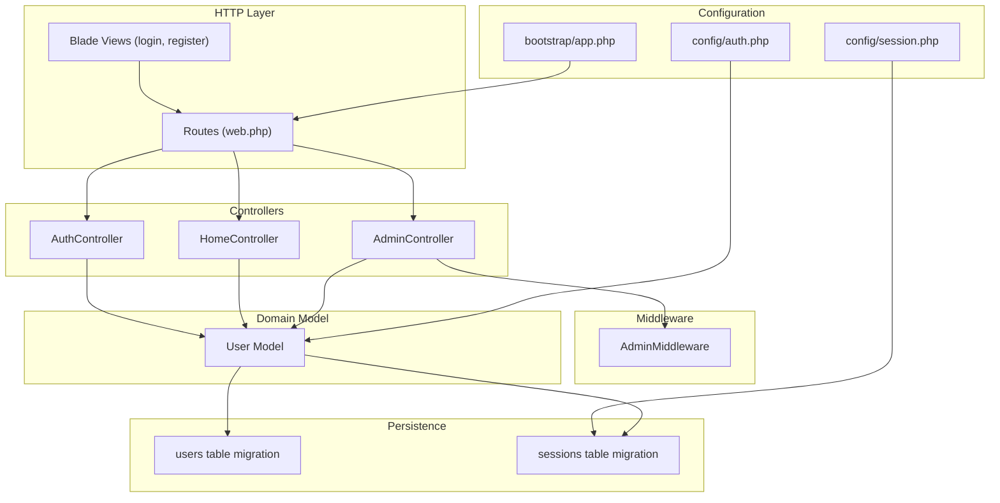
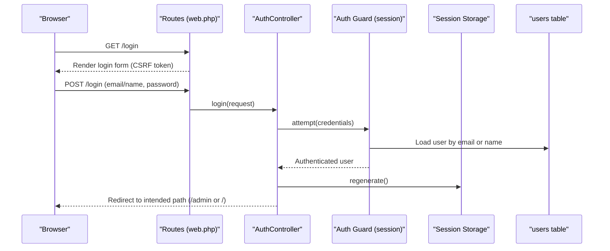
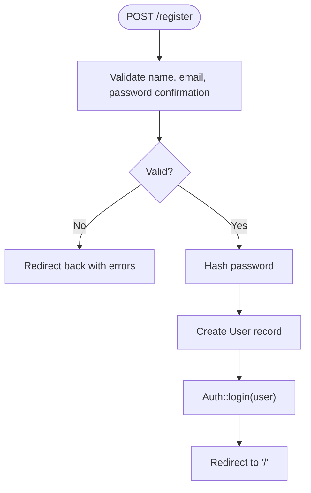
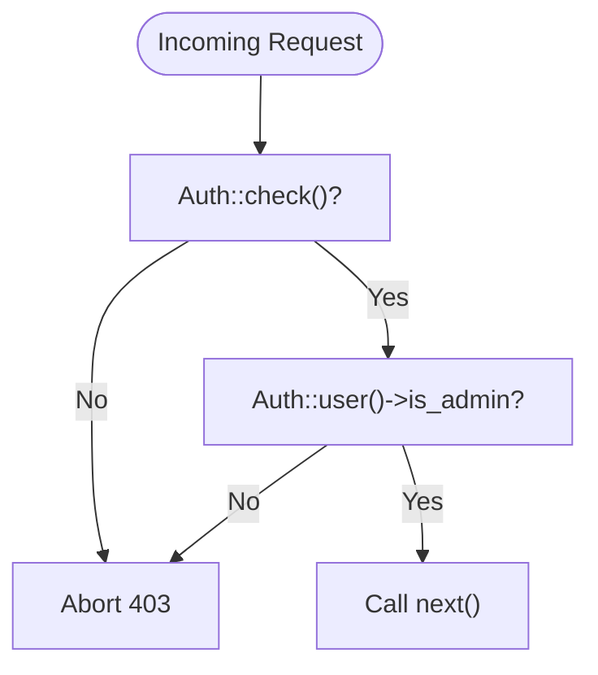
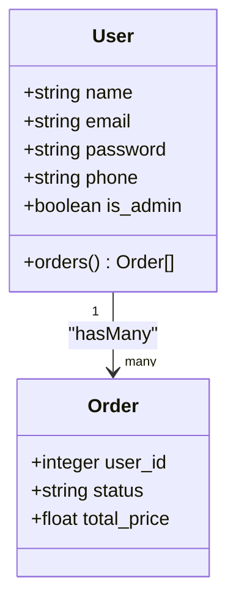
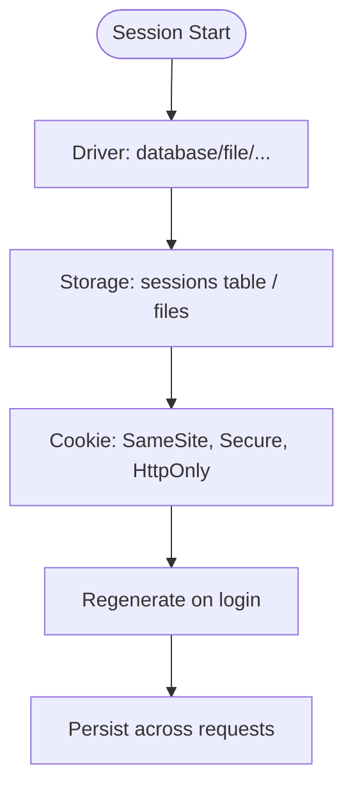
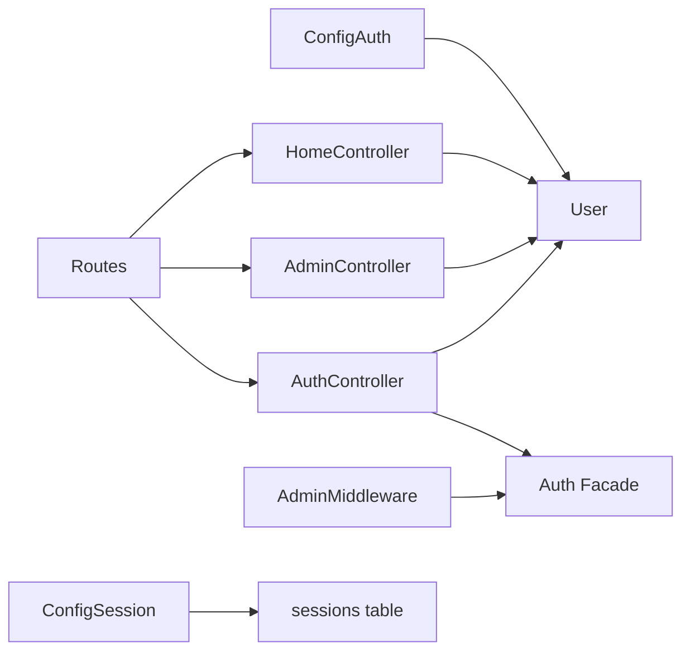

# User Authentication & Authorization

<cite>
**Referenced Files in This Document**
- [AuthController.php](file://app/Http/Controllers/AuthController.php)
- [HomeController.php](file://app/Http/Controllers/HomeController.php)
- [AdminController.php](file://app/Http/Controllers/AdminController.php)
- [AdminMiddleware.php](file://app/Http/Middleware/AdminMiddleware.php)
- [User.php](file://app/Models/User.php)
- [auth.php](file://config/auth.php)
- [session.php](file://config/session.php)
- [web.php](file://routes/web.php)
- [login.blade.php](file://resources/views/auth/login.blade.php)
- [register.blade.php](file://resources/views/auth/register.blade.php)
- [app.php](file://bootstrap/app.php)
- [0001_01_01_000000_create_users_table.php](file://database/migrations/0001_01_01_000000_create_users_table.php)
- [passwords.php (en)](file://lang/en/passwords.php)
- [passwords.php (id)](file://lang/id/passwords.php)
- [validation.php (en)](file://lang/en/validation.php)
- [validation.php (id)](file://lang/id/validation.php)
</cite>

## Table of Contents
1. [Introduction](#introduction)
2. [Project Structure](#project-structure)
3. [Core Components](#core-components)
4. [Architecture Overview](#architecture-overview)
5. [Detailed Component Analysis](#detailed-component-analysis)
6. [Dependency Analysis](#dependency-analysis)
7. [Performance Considerations](#performance-considerations)
8. [Security Measures](#security-measures)
9. [Troubleshooting Guide](#troubleshooting-guide)
10. [Conclusion](#conclusion)

## Introduction
This document explains the user authentication and authorization system implemented in the application. It covers the complete authentication flow (login, registration, logout), session management, role-based access control (RBAC) with admin middleware, and integration with Laravel’s built-in authentication mechanisms. It also documents validation rules, password hashing, and security best practices such as CSRF protection and session security.

## Project Structure
The authentication system spans several key areas:
- Controllers: AuthController handles login/logout/register; HomeController and AdminController expose protected routes.
- Middleware: AdminMiddleware enforces admin-only access.
- Models: User integrates with Laravel’s Eloquent authentication.
- Routes: Web routes define authentication endpoints and protected groups.
- Configuration: auth.php and session.php define guards, providers, and session behavior.
- Views: Blade templates render login and registration forms with CSRF tokens.
- Migrations: Users table schema includes password hashing and sessions table for session storage.

**Diagram sources**
- [web.php:1-71](file://routes/web.php#L1-L71)
- [AuthController.php:10-78](file://app/Http/Controllers/AuthController.php#L10-L78)
- [HomeController.php:12-568](file://app/Http/Controllers/HomeController.php#L12-L568)
- [AdminController.php:10-257](file://app/Http/Controllers/AdminController.php#L10-L257)
- [AdminMiddleware.php:10-26](file://app/Http/Middleware/AdminMiddleware.php#L10-L26)
- [User.php:10-55](file://app/Models/User.php#L10-L55)
- [auth.php:16-115](file://config/auth.php#L16-L115)
- [session.php:21-218](file://config/session.php#L21-L218)
- [app.php:16-20](file://bootstrap/app.php#L16-L20)
- [0001_01_01_000000_create_users_table.php:14-41](file://database/migrations/0001_01_01_000000_create_users_table.php#L14-L41)

**Section sources**
- [web.php:1-71](file://routes/web.php#L1-L71)
- [AuthController.php:10-78](file://app/Http/Controllers/AuthController.php#L10-L78)
- [User.php:10-55](file://app/Models/User.php#L10-L55)
- [auth.php:16-115](file://config/auth.php#L16-L115)
- [session.php:21-218](file://config/session.php#L21-L218)
- [app.php:16-20](file://bootstrap/app.php#L16-L20)
- [0001_01_01_000000_create_users_table.php:14-41](file://database/migrations/0001_01_01_000000_create_users_table.php#L14-L41)

## Core Components
- AuthController: Implements login, registration, and logout with credential validation, session regeneration, and role-aware redirection.
- User Model: Extends Laravel’s authenticatable base, defines fillable/hidden attributes, and casts password to hashed.
- AdminMiddleware: Enforces admin-only access by checking authentication and is_admin flag.
- HomeController: Provides user-centric routes protected by the auth middleware.
- AdminController: Provides admin-only routes protected by both auth and AdminMiddleware.
- Configuration: auth.php defines the session guard and password reset broker; session.php controls session storage, lifetime, and cookie policies.
- CSRF Protection: Enabled globally except for the payment callback endpoint.

**Section sources**
- [AuthController.php:10-78](file://app/Http/Controllers/AuthController.php#L10-L78)
- [User.php:10-55](file://app/Models/User.php#L10-L55)
- [AdminMiddleware.php:10-26](file://app/Http/Middleware/AdminMiddleware.php#L10-L26)
- [HomeController.php:12-568](file://app/Http/Controllers/HomeController.php#L12-L568)
- [AdminController.php:10-257](file://app/Http/Controllers/AdminController.php#L10-L257)
- [auth.php:16-115](file://config/auth.php#L16-L115)
- [session.php:21-218](file://config/session.php#L21-L218)
- [app.php:16-20](file://bootstrap/app.php#L16-L20)

## Architecture Overview
The system uses Laravel’s default session-based guard with an Eloquent user provider. Authentication events trigger session regeneration and role-aware redirection. Protected routes are grouped under the auth middleware, while admin-only routes are additionally protected by AdminMiddleware.

**Diagram sources**
- [web.php:27-31](file://routes/web.php#L27-L31)
- [AuthController.php:17-44](file://app/Http/Controllers/AuthController.php#L17-L44)
- [auth.php:38-43](file://config/auth.php#L38-L43)
- [0001_01_01_000000_create_users_table.php:14-25](file://database/migrations/0001_01_01_000000_create_users_table.php#L14-L25)

## Detailed Component Analysis

### AuthController Methods and Validation
- showLogin: Returns the login view.
- login: Validates input, infers login type (email vs name), attempts authentication, regenerates session, and redirects based on is_admin.
- showRegister: Returns the registration view.
- register: Validates inputs (name, email, password confirmation), hashes password, creates user, and logs them in.
- logout: Logs out, invalidates session, regenerates CSRF token, and redirects home.

Validation rules:
- Login requires email and password.
- Registration requires name, unique email, and confirmed password (minimum length enforced by language validation).
- Profile update accepts optional new password with minimum length and confirmation.

**Diagram sources**
- [AuthController.php:51-68](file://app/Http/Controllers/AuthController.php#L51-L68)
- [validation.php (en):139-164](file://lang/en/validation.php#L139-L164)
- [validation.php (id):141-166](file://lang/id/validation.php#L141-L166)

**Section sources**
- [AuthController.php:12-78](file://app/Http/Controllers/AuthController.php#L12-L78)
- [login.blade.php:40-62](file://resources/views/auth/login.blade.php#L40-L62)
- [register.blade.php:40-78](file://resources/views/auth/register.blade.php#L40-L78)
- [validation.php (en):139-164](file://lang/en/validation.php#L139-L164)
- [validation.php (id):141-166](file://lang/id/validation.php#L141-L166)

### Role-Based Access Control and Admin Middleware
- AdminMiddleware checks if the current user is authenticated and has is_admin=true; otherwise aborts with 403.
- Admin routes are grouped under both auth and AdminMiddleware, ensuring only admins can access admin endpoints.

**Diagram sources**
- [AdminMiddleware.php:17-24](file://app/Http/Middleware/AdminMiddleware.php#L17-L24)
- [web.php:52-70](file://routes/web.php#L52-L70)

**Section sources**
- [AdminMiddleware.php:10-26](file://app/Http/Middleware/AdminMiddleware.php#L10-L26)
- [web.php:52-70](file://routes/web.php#L52-L70)

### Protected Routes and Grouping
- Public routes: home, menu, login, register, logout.
- Auth-protected group: profile, cart, checkout, orders, invoice.
- Admin-protected group: admin dashboards, user management, order management, cashier checkout.

**Section sources**
- [web.php:9-71](file://routes/web.php#L9-L71)

### User Model Relationships and Password Handling
- User extends the framework’s Authenticatable and Notifiable traits.
- Fillable attributes include name, email, password, phone, is_admin.
- Hidden attributes include password and remember_token.
- Password casting uses hashed to leverage framework-level hashing.
- User hasMany orders relationship.

**Diagram sources**
- [User.php:19-55](file://app/Models/User.php#L19-L55)
- [0001_01_01_000000_create_users_table.php:14-25](file://database/migrations/0001_01_01_000000_create_users_table.php#L14-L25)

**Section sources**
- [User.php:10-55](file://app/Models/User.php#L10-L55)
- [0001_01_01_000000_create_users_table.php:14-25](file://database/migrations/0001_01_01_000000_create_users_table.php#L14-L25)

### Session Management and Persistence
- Session driver is configured via SESSION_DRIVER (default database).
- Session lifetime is configurable; sessions are stored in the sessions table.
- CSRF protection is enabled globally except for the payment callback endpoint.

**Diagram sources**
- [session.php:21-218](file://config/session.php#L21-L218)
- [0001_01_01_000000_create_users_table.php:33-40](file://database/migrations/0001_01_01_000000_create_users_table.php#L33-L40)
- [app.php:16-20](file://bootstrap/app.php#L16-L20)

**Section sources**
- [session.php:21-218](file://config/session.php#L21-L218)
- [0001_01_01_000000_create_users_table.php:33-40](file://database/migrations/0001_01_01_000000_create_users_table.php#L33-L40)
- [app.php:16-20](file://bootstrap/app.php#L16-L20)

### Password Reset Integration
- Password reset configuration uses the users provider and password_reset_tokens table.
- Expiration and throttling are defined for security.
- Language files provide localized messages for reset outcomes.

**Section sources**
- [auth.php:93-100](file://config/auth.php#L93-L100)
- [0001_01_01_000000_create_users_table.php:27-31](file://database/migrations/0001_01_01_000000_create_users_table.php#L27-L31)
- [passwords.php (en):16-21](file://lang/en/passwords.php#L16-L21)
- [passwords.php (id):16-21](file://lang/id/passwords.php#L16-L21)

## Dependency Analysis
- AuthController depends on Auth facade, Hash facade, and User model.
- AdminMiddleware depends on Auth facade for user checks.
- Controllers depend on User model for relationships and identity.
- Routes depend on controllers for handlers.
- Configuration files define guard/provider/session behavior.

**Diagram sources**
- [AuthController.php:5-8](file://app/Http/Controllers/AuthController.php#L5-L8)
- [AdminMiddleware.php:8](file://app/Http/Middleware/AdminMiddleware.php#L8)
- [web.php:4-6](file://routes/web.php#L4-L6)
- [auth.php:62-66](file://config/auth.php#L62-L66)
- [session.php:89](file://config/session.php#L89)
- [0001_01_01_000000_create_users_table.php:33-40](file://database/migrations/0001_01_01_000000_create_users_table.php#L33-L40)

**Section sources**
- [AuthController.php:5-8](file://app/Http/Controllers/AuthController.php#L5-L8)
- [AdminMiddleware.php:8](file://app/Http/Middleware/AdminMiddleware.php#L8)
- [web.php:4-6](file://routes/web.php#L4-L6)
- [auth.php:62-66](file://config/auth.php#L62-L66)
- [session.php:89](file://config/session.php#L89)

## Performance Considerations
- Session storage: Using database-backed sessions scales well; ensure proper indexing on sessions table.
- Password hashing: Built-in hashed casting ensures efficient hashing; avoid excessive re-hashing.
- Middleware overhead: Keep middleware chains minimal; combine auth and admin checks where appropriate.
- Route grouping: Grouping routes under middleware reduces repeated checks.

## Security Measures
- CSRF Protection: Enabled globally; exceptions are explicitly declared for the payment callback endpoint.
- Session Security: Cookie flags include SameSite, Secure, and HttpOnly; session lifetime is configurable.
- Authentication Guard: Uses session driver with Eloquent provider.
- Password Handling: Passwords are hashed via framework mechanisms; validation enforces strong passwords.
- Admin Access: AdminMiddleware ensures only administrators can access admin routes.

**Section sources**
- [app.php:16-20](file://bootstrap/app.php#L16-L20)
- [session.php:131-203](file://config/session.php#L131-L203)
- [auth.php:38-43](file://config/auth.php#L38-L43)
- [validation.php (en):120-126](file://lang/en/validation.php#L120-L126)
- [AdminMiddleware.php:17-21](file://app/Http/Middleware/AdminMiddleware.php#L17-L21)

## Troubleshooting Guide
- Login fails: Verify credentials and ensure the user exists. Check validation errors returned by the controller.
- Redirect loop or wrong redirect: Confirm is_admin flag and intended path logic.
- Registration errors: Validate unique email and password confirmation rules.
- Admin access denied: Ensure the user is authenticated and has is_admin=true.
- Session issues: Confirm session driver configuration and database connectivity.
- CSRF errors: Ensure @csrf is present in forms and verify exceptions for callback routes.

**Section sources**
- [AuthController.php:17-44](file://app/Http/Controllers/AuthController.php#L17-L44)
- [login.blade.php:40-62](file://resources/views/auth/login.blade.php#L40-L62)
- [register.blade.php:40-78](file://resources/views/auth/register.blade.php#L40-L78)
- [AdminMiddleware.php:17-21](file://app/Http/Middleware/AdminMiddleware.php#L17-L21)
- [app.php:16-20](file://bootstrap/app.php#L16-L20)

## Conclusion
The authentication and authorization system leverages Laravel’s built-in session guard and Eloquent provider to deliver secure, role-aware access control. AuthController manages the core authentication lifecycle, while AdminMiddleware enforces admin-only access. Session and CSRF configurations are tuned for security and reliability. Protected routes and middleware grouping ensure consistent access control across user and admin functionalities.