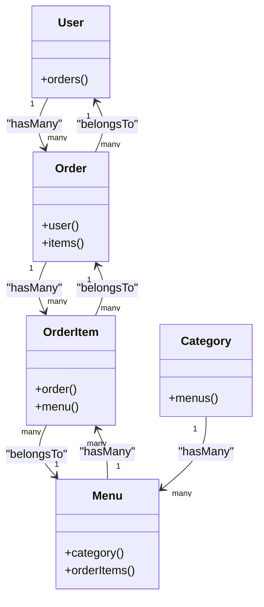
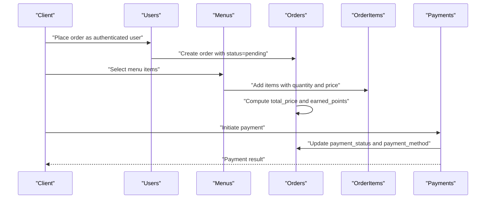

# Database Design

<cite>
**Referenced Files in This Document**
- [0001_01_01_000000_create_users_table.php](file://database/migrations/0001_01_01_000000_create_users_table.php)
- [2026_04_21_011703_create_menus_table.php](file://database/migrations/2026_04_21_011703_create_menus_table.php)
- [2026_04_21_011703_create_orders_table.php](file://database/migrations/2026_04_21_011703_create_orders_table.php)
- [2026_04_21_011704_create_order_items_table.php](file://database/migrations/2026_04_21_011704_create_order_items_table.php)
- [2026_05_15_072236_create_categories_table.php](file://database/migrations/2026_05_15_072236_create_categories_table.php)
- [2026_05_15_072240_create_reviews_table.php](file://database/migrations/2026_05_15_072240_create_reviews_table.php)
- [2026_05_15_072246_create_payments_table.php](file://database/migrations/2026_05_15_072246_create_payments_table.php)
- [2026_05_15_072332_create_point_transactions_table.php](file://database/migrations/2026_05_15_072332_create_point_transactions_table.php)
- [2026_04_27_021524_add_stock_to_menus_table.php](file://database/migrations/2026_04_27_021524_add_stock_to_menus_table.php)
- [2026_05_18_020058_add_shipping_fields_to_orders_table.php](file://database/migrations/2026_05_18_020058_add_shipping_fields_to_orders_table.php)
- [2026_05_24_000000_add_payment_fields_to_orders_table.php](file://database/migrations/2026_05_24_000000_add_payment_fields_to_orders_table.php)
- [User.php](file://app/Models/User.php)
- [Menu.php](file://app/Models/Menu.php)
- [Order.php](file://app/Models/Order.php)
- [OrderItem.php](file://app/Models/OrderItem.php)
- [Category.php](file://app/Models/Category.php)
</cite>

## Table of Contents
1. [Introduction](#introduction)
2. [Project Structure](#project-structure)
3. [Core Components](#core-components)
4. [Architecture Overview](#architecture-overview)
5. [Detailed Component Analysis](#detailed-component-analysis)
6. [Dependency Analysis](#dependency-analysis)
7. [Performance Considerations](#performance-considerations)
8. [Troubleshooting Guide](#troubleshooting-guide)
9. [Conclusion](#conclusion)
10. [Appendices](#appendices)

## Introduction
This section documents the database schema and data model design of the Kantin Ibu Ida system. It explains the entity-relationship structure, table definitions, foreign key relationships, and data integrity constraints. It also covers the migration system, schema evolution patterns, and data seeding strategies, along with indexing and performance considerations. The focus is on how business entities (users, menus, orders, payments) are represented in the database and how their relationships drive data flow across the application.

## Project Structure
The database design is primarily defined by Laravel migrations under the database/migrations directory and Eloquent models under app/Models. Migrations create and evolve tables over time, while models define relationships and guarded/fillable attributes used by the application.

```mermaid
graph TB
subgraph "Migrations"
MU["0001_01_01_000000_create_users_table.php"]
MM["2026_04_21_011703_create_menus_table.php"]
MO["2026_04_21_011703_create_orders_table.php"]
MOI["2026_04_21_011704_create_order_items_table.php"]
MCAT["2026_05_15_072236_create_categories_table.php"]
MR["2026_05_15_072240_create_reviews_table.php"]
MP["2026_05_15_072246_create_payments_table.php"]
PM["2026_05_15_072332_create_point_transactions_table.php"]
ASM["2026_04_27_021524_add_stock_to_menus_table.php"]
ASO["2026_05_18_020058_add_shipping_fields_to_orders_table.php"]
APO["2026_05_24_000000_add_payment_fields_to_orders_table.php"]
end
subgraph "Models"
U["User.php"]
M["Menu.php"]
O["Order.php"]
OI["OrderItem.php"]
CAT["Category.php"]
end
MU --> U
MM --> M
MO --> O
MOI --> OI
MCAT --> M
MR --> M
MP --> O
PM --> U
ASM --> M
ASO --> O
APO --> O
```



**Diagram sources**
- [0001_01_01_000000_create_users_table.php:1-53](file://database/migrations/0001_01_01_000000_create_users_table.php#L1-L53)
- [2026_04_21_011703_create_menus_table.php:1-34](file://database/migrations/2026_04_21_011703_create_menus_table.php#L1-L34)
- [2026_04_21_011703_create_orders_table.php:1-32](file://database/migrations/2026_04_21_011703_create_orders_table.php#L1-L32)
- [2026_04_21_011704_create_order_items_table.php:1-32](file://database/migrations/2026_04_21_011704_create_order_items_table.php#L1-L32)
- [2026_05_15_072236_create_categories_table.php:1-29](file://database/migrations/2026_05_15_072236_create_categories_table.php#L1-L29)
- [2026_05_15_072240_create_reviews_table.php:1-32](file://database/migrations/2026_05_15_072240_create_reviews_table.php#L1-L32)
- [2026_05_15_072246_create_payments_table.php:1-32](file://database/migrations/2026_05_15_072246_create_payments_table.php#L1-L32)
- [2026_05_15_072332_create_point_transactions_table.php:1-32](file://database/migrations/2026_05_15_072332_create_point_transactions_table.php#L1-L32)
- [2026_04_27_021524_add_stock_to_menus_table.php:1-29](file://database/migrations/2026_04_27_021524_add_stock_to_menus_table.php#L1-L29)
- [2026_05_18_020058_add_shipping_fields_to_orders_table.php:1-32](file://database/migrations/2026_05_18_020058_add_shipping_fields_to_orders_table.php#L1-L32)
- [2026_05_24_000000_add_payment_fields_to_orders_table.php:1-25](file://database/migrations/2026_05_24_000000_add_payment_fields_to_orders_table.php#L1-L25)
- [User.php:1-55](file://app/Models/User.php#L1-L55)
- [Menu.php:1-32](file://app/Models/Menu.php#L1-L32)
- [Order.php:1-36](file://app/Models/Order.php#L1-L36)
- [OrderItem.php:1-29](file://app/Models/OrderItem.php#L1-L29)
- [Category.php:1-16](file://app/Models/Category.php#L1-L16)

**Section sources**
- [0001_01_01_000000_create_users_table.php:1-53](file://database/migrations/0001_01_01_000000_create_users_table.php#L1-L53)
- [2026_04_21_011703_create_menus_table.php:1-34](file://database/migrations/2026_04_21_011703_create_menus_table.php#L1-L34)
- [2026_04_21_011703_create_orders_table.php:1-32](file://database/migrations/2026_04_21_011703_create_orders_table.php#L1-L32)
- [2026_04_21_011704_create_order_items_table.php:1-32](file://database/migrations/2026_04_21_011704_create_order_items_table.php#L1-L32)
- [2026_05_15_072236_create_categories_table.php:1-29](file://database/migrations/2026_05_15_072236_create_categories_table.php#L1-L29)
- [2026_05_15_072240_create_reviews_table.php:1-32](file://database/migrations/2026_05_15_072240_create_reviews_table.php#L1-L32)
- [2026_05_15_072246_create_payments_table.php:1-32](file://database/migrations/2026_05_15_072246_create_payments_table.php#L1-L32)
- [2026_05_15_072332_create_point_transactions_table.php:1-32](file://database/migrations/2026_05_15_072332_create_point_transactions_table.php#L1-L32)
- [2026_04_27_021524_add_stock_to_menus_table.php:1-29](file://database/migrations/2026_04_27_021524_add_stock_to_menus_table.php#L1-L29)
- [2026_05_18_020058_add_shipping_fields_to_orders_table.php:1-32](file://database/migrations/2026_05_18_020058_add_shipping_fields_to_orders_table.php#L1-L32)
- [2026_05_24_000000_add_payment_fields_to_orders_table.php:1-25](file://database/migrations/2026_05_24_000000_add_payment_fields_to_orders_table.php#L1-L25)
- [User.php:1-55](file://app/Models/User.php#L1-L55)
- [Menu.php:1-32](file://app/Models/Menu.php#L1-L32)
- [Order.php:1-36](file://app/Models/Order.php#L1-L36)
- [OrderItem.php:1-29](file://app/Models/OrderItem.php#L1-L29)
- [Category.php:1-16](file://app/Models/Category.php#L1-L16)

## Core Components
This section describes each table’s purpose, fields, data types, constraints, and relationships. It also outlines how the models reflect these definitions and how migrations enforce schema evolution.

- Users
  - Purpose: Stores user accounts, authentication credentials, roles, and loyalty points.
  - Key fields: id, name, email (unique), phone, email_verified_at, password, is_admin, points, remember_token, timestamps.
  - Integrity: Unique constraint on email; boolean flag for admin; default points zero; hashed password via model casting.
  - Relationships: One-to-many with Orders.
  - Indexes: Auto-increment primary key; optional indexes may be inferred by ORM usage.

- Menus
  - Purpose: Defines food items available for ordering, including pricing and stock.
  - Key fields: id, name, description, price, points_reward, image_url, category, stock, timestamps.
  - Integrity: Non-negative price and stock; default reward zero; optional category string initially; later normalized via Category association.
  - Relationships: Belongs to Category; has many OrderItems.
  - Indexes: Auto-increment primary key; consider adding indexes on price, stock, and category for filtering/searching.

- Categories
  - Purpose: Normalized classification for Menus.
  - Key fields: id, name, timestamps.
  - Integrity: Name uniqueness recommended at application level; cascade delete handled by migration.
  - Relationships: One-to-many with Menus.
  - Indexes: Auto-increment primary key.

- Orders
  - Purpose: Represents customer purchase requests with status, totals, and payment metadata.
  - Key fields: id, user_id (FK), status, total_price, earned_points, shipping_fee, location, latitude, longitude, distance_km, payment_status, payment_method, merchant_order_id, timestamps.
  - Integrity: Defaults for status and payment_status; shipping fee defaults to zero; nullable geolocation/distance for optional delivery tracking.
  - Relationships: Belongs to User; has many OrderItems; belongs to Payments (via FK in payments).
  - Indexes: user_id indexed by FK; consider composite indexes on (user_id, status) and (payment_status, created_at).

- Order Items
  - Purpose: Line items linking Orders to specific Menus with quantity and price snapshot.
  - Key fields: id, order_id (FK), menu_id (FK), quantity, price, timestamps.
  - Integrity: Quantity default 1; price default 0; cascading deletes maintain referential integrity.
  - Relationships: Belongs to Order and Menu.
  - Indexes: Composite index on (order_id, menu_id) can optimize joins and deduplication.

- Payments
  - Purpose: Records payment transactions associated with Orders.
  - Key fields: id, order_id (FK), amount, method, status, timestamps.
  - Integrity: Amount and method required; status defaults to pending; cascading delete ensures cleanup.
  - Relationships: Belongs to Order.
  - Indexes: order_id indexed by FK; consider method and status for reporting.

- Reviews
  - Purpose: Captures user feedback per Menu.
  - Key fields: id, user_id (FK), menu_id (FK), rating, comment, timestamps.
  - Integrity: Rating integer; comment optional; cascading deletes.
  - Relationships: Belongs to User and Menu.
  - Indexes: Composite index on (user_id, menu_id) prevents duplicate reviews.

- Point Transactions
  - Purpose: Tracks user point changes (earnings and redemptions) linked to Orders.
  - Key fields: id, user_id (FK), order_id (nullable FK), amount, description, timestamps.
  - Integrity: Amount signed integer; order_id nullable to support non-order events; cascading delete for user, set null for order.
  - Relationships: Belongs to User; belongs to Order (optional).
  - Indexes: user_id indexed by FK; consider order_id index if frequently queried.

**Section sources**
- [0001_01_01_000000_create_users_table.php:14-25](file://database/migrations/0001_01_01_000000_create_users_table.php#L14-L25)
- [2026_04_21_011703_create_menus_table.php:14-23](file://database/migrations/2026_04_21_011703_create_menus_table.php#L14-L23)
- [2026_05_15_072236_create_categories_table.php:14-18](file://database/migrations/2026_05_15_072236_create_categories_table.php#L14-L18)
- [2026_04_21_011703_create_orders_table.php:14-21](file://database/migrations/2026_04_21_011703_create_orders_table.php#L14-L21)
- [2026_04_21_011704_create_order_items_table.php:14-21](file://database/migrations/2026_04_21_011704_create_order_items_table.php#L14-L21)
- [2026_05_15_072246_create_payments_table.php:14-21](file://database/migrations/2026_05_15_072246_create_payments_table.php#L14-L21)
- [2026_05_15_072240_create_reviews_table.php:14-21](file://database/migrations/2026_05_15_072240_create_reviews_table.php#L14-L21)
- [2026_05_15_072332_create_point_transactions_table.php:14-21](file://database/migrations/2026_05_15_072332_create_point_transactions_table.php#L14-L21)
- [2026_04_27_021524_add_stock_to_menus_table.php:14-16](file://database/migrations/2026_04_27_021524_add_stock_to_menus_table.php#L14-L16)
- [2026_05_18_020058_add_shipping_fields_to_orders_table.php:14-19](file://database/migrations/2026_05_18_020058_add_shipping_fields_to_orders_table.php#L14-L19)
- [2026_05_24_000000_add_payment_fields_to_orders_table.php:11-15](file://database/migrations/2026_05_24_000000_add_payment_fields_to_orders_table.php#L11-L15)
- [User.php:19-25](file://app/Models/User.php#L19-L25)
- [Menu.php:12-20](file://app/Models/Menu.php#L12-L20)
- [Order.php:12-24](file://app/Models/Order.php#L12-L24)
- [OrderItem.php:12-17](file://app/Models/OrderItem.php#L12-L17)
- [Category.php:9-14](file://app/Models/Category.php#L9-L14)

## Architecture Overview
The database follows a normalized relational design with explicit foreign keys and cascading rules. The central business entities are Users, Menus, Orders, and Payments, connected through OrderItems as a junction table. Categories normalize menu classification, Reviews capture ratings/comments, and PointTransactions track user points.

```mermaid
erDiagram
USERS {
bigint id PK
string name
string email UK
string phone
timestamp email_verified_at
string password
boolean is_admin
integer points
string remember_token
timestamps
}
CATEGORIES {
bigint id PK
string name
timestamps
}
MENUS {
bigint id PK
string name
text description
integer price
integer points_reward
string image_url
string category
integer stock
bigint category_id FK
timestamps
}
ORDERS {
bigint id PK
bigint user_id FK
string status
integer total_price
integer earned_points
integer shipping_fee
string location
decimal latitude
decimal longitude
decimal distance_km
string payment_status
string payment_method
string merchant_order_id
timestamps
}
ORDER_ITEMS {
bigint id PK
bigint order_id FK
bigint menu_id FK
integer quantity
integer price
timestamps
}
PAYMENTS {
bigint id PK
bigint order_id FK
integer amount
string method
string status
timestamps
}
REVIEWS {
bigint id PK
bigint user_id FK
bigint menu_id FK
integer rating
text comment
timestamps
}
POINT_TRANSACTIONS {
bigint id PK
bigint user_id FK
bigint order_id FK
integer amount
string description
timestamps
}
USERS ||--o{ ORDERS : "has many"
USERS ||--o{ REVIEWS : "writes"
USERS ||--o{ POINT_TRANSACTIONS : "accumulates"
CATEGORIES ||--o{ MENUS : "classifies"
MENUS ||--o{ ORDER_ITEMS : "included in"
ORDERS ||--o{ ORDER_ITEMS : "contains"
ORDERS ||--|| PAYMENTS : "associated with"
MENUS ||--o{ REVIEWS : "rated by"
```

**Diagram sources**
- [0001_01_01_000000_create_users_table.php:14-25](file://database/migrations/0001_01_01_000000_create_users_table.php#L14-L25)
- [2026_05_15_072236_create_categories_table.php:14-18](file://database/migrations/2026_05_15_072236_create_categories_table.php#L14-L18)
- [2026_04_21_011703_create_menus_table.php:14-23](file://database/migrations/2026_04_21_011703_create_menus_table.php#L14-L23)
- [2026_04_21_011703_create_orders_table.php:14-21](file://database/migrations/2026_04_21_011703_create_orders_table.php#L14-L21)
- [2026_04_21_011704_create_order_items_table.php:14-21](file://database/migrations/2026_04_21_011704_create_order_items_table.php#L14-L21)
- [2026_05_15_072246_create_payments_table.php:14-21](file://database/migrations/2026_05_15_072246_create_payments_table.php#L14-L21)
- [2026_05_15_072240_create_reviews_table.php:14-21](file://database/migrations/2026_05_15_072240_create_reviews_table.php#L14-L21)
- [2026_05_15_072332_create_point_transactions_table.php:14-21](file://database/migrations/2026_05_15_072332_create_point_transactions_table.php#L14-L21)
- [2026_04_27_021524_add_stock_to_menus_table.php:14-16](file://database/migrations/2026_04_27_021524_add_stock_to_menus_table.php#L14-L16)
- [2026_05_18_020058_add_shipping_fields_to_orders_table.php:14-19](file://database/migrations/2026_05_18_020058_add_shipping_fields_to_orders_table.php#L14-L19)
- [2026_05_24_000000_add_payment_fields_to_orders_table.php:11-15](file://database/migrations/2026_05_24_000000_add_payment_fields_to_orders_table.php#L11-L15)

## Detailed Component Analysis

### Users and Sessions
- Purpose: Authentication and session management.
- Fields: id, name, email (unique), phone, email_verified_at, password, is_admin, points, remember_token, timestamps.
- Constraints: Unique email; boolean admin flag; default points zero; hashed password via model casting.
- Relationships: One-to-many with Orders.
- Notes: Sessions table supports Laravel session storage with user_id foreign key and last_activity index.

**Section sources**
- [0001_01_01_000000_create_users_table.php:14-40](file://database/migrations/0001_01_01_000000_create_users_table.php#L14-L40)
- [User.php:19-25](file://app/Models/User.php#L19-L25)
- [User.php:50-53](file://app/Models/User.php#L50-L53)

### Menus and Categories
- Purpose: Food catalog and classification.
- Fields: Menus include id, name, description, price, points_reward, image_url, category, stock; Categories include id, name.
- Constraints: Price and stock non-negative; default reward zero; stock column added later.
- Relationships: Menus belong to Category; Menus have many OrderItems; Reviews link users to menus.
- Evolution: Menus initially had category as string; later migrated to category_id FK via Category table.

**Section sources**
- [2026_04_21_011703_create_menus_table.php:14-23](file://database/migrations/2026_04_21_011703_create_menus_table.php#L14-L23)
- [2026_04_27_021524_add_stock_to_menus_table.php:14-16](file://database/migrations/2026_04_27_021524_add_stock_to_menus_table.php#L14-L16)
- [2026_05_15_072236_create_categories_table.php:14-18](file://database/migrations/2026_05_15_072236_create_categories_table.php#L14-L18)
- [Menu.php:12-20](file://app/Models/Menu.php#L12-L20)
- [Menu.php:22-25](file://app/Models/Menu.php#L22-L25)
- [Category.php:9-14](file://app/Models/Category.php#L9-L14)

### Orders, Order Items, and Payments
- Purpose: Order lifecycle and payment tracking.
- Fields: Orders include user_id, status, total_price, earned_points, shipping_fee, location, lat/lon/distance_km, payment_status, payment_method, merchant_order_id; Order Items include order_id, menu_id, quantity, price; Payments include order_id, amount, method, status.
- Constraints: Cascading deletes on FKs; defaults for statuses and fees; nullable payment metadata.
- Relationships: Orders have many OrderItems; Orders belong to Payments; OrderItems link Orders and Menus.

**Section sources**
- [2026_04_21_011703_create_orders_table.php:14-21](file://database/migrations/2026_04_21_011703_create_orders_table.php#L14-L21)
- [2026_04_21_011704_create_order_items_table.php:14-21](file://database/migrations/2026_04_21_011704_create_order_items_table.php#L14-L21)
- [2026_05_15_072246_create_payments_table.php:14-21](file://database/migrations/2026_05_15_072246_create_payments_table.php#L14-L21)
- [2026_05_18_020058_add_shipping_fields_to_orders_table.php:14-19](file://database/migrations/2026_05_18_020058_add_shipping_fields_to_orders_table.php#L14-L19)
- [2026_05_24_000000_add_payment_fields_to_orders_table.php:11-15](file://database/migrations/2026_05_24_000000_add_payment_fields_to_orders_table.php#L11-L15)
- [Order.php:12-24](file://app/Models/Order.php#L12-L24)
- [OrderItem.php:12-17](file://app/Models/OrderItem.php#L12-L17)
- [Order.php:26-34](file://app/Models/Order.php#L26-L34)

### Reviews and Point Transactions
- Purpose: Feedback and loyalty tracking.
- Fields: Reviews include user_id, menu_id, rating, comment; Point Transactions include user_id, order_id (nullable), amount, description.
- Constraints: Cascading deletes for user; set null for order on deletion; amount indicates +/- points.
- Relationships: Reviews link User and Menu; Point Transactions link User and optional Order.

**Section sources**
- [2026_05_15_072240_create_reviews_table.php:14-21](file://database/migrations/2026_05_15_072240_create_reviews_table.php#L14-L21)
- [2026_05_15_072332_create_point_transactions_table.php:14-21](file://database/migrations/2026_05_15_072332_create_point_transactions_table.php#L14-L21)
- [User.php:50-53](file://app/Models/User.php#L50-L53)

### Migration System and Schema Evolution
- Pattern: Feature-based migrations grouped by datestamps; additive changes via Schema::table; controlled removals via down().
- Examples:
  - Menus stock addition: Add integer stock with default zero.
  - Orders shipping fields: Add shipping_fee, latitude, longitude, distance_km after existing columns.
  - Orders payment metadata: Add payment_status, payment_method, merchant_order_id after status.
- Best practices observed: Cascade deletes on related records; nullable fields for optional data; defaults for consistent states.

**Section sources**
- [2026_04_27_021524_add_stock_to_menus_table.php:12-27](file://database/migrations/2026_04_27_021524_add_stock_to_menus_table.php#L12-L27)
- [2026_05_18_020058_add_shipping_fields_to_orders_table.php:12-30](file://database/migrations/2026_05_18_020058_add_shipping_fields_to_orders_table.php#L12-L30)
- [2026_05_24_000000_add_payment_fields_to_orders_table.php:9-23](file://database/migrations/2026_05_24_000000_add_payment_fields_to_orders_table.php#L9-L23)

### Data Seeding Strategies
- Current state: No dedicated seeders are present in the provided structure. Seeding would typically involve:
  - Factories for Users, Menus, Categories, Orders, and OrderItems.
  - Seeders to populate base categories and initial users.
  - Controlled creation of Orders and OrderItems to reflect realistic datasets.
- Recommendation: Introduce DatabaseSeeder and model factories to bootstrap development and testing environments.

[No sources needed since this section provides general guidance]

## Dependency Analysis
The models define Eloquent relationships that mirror migration foreign keys. This tight coupling ensures referential integrity and simplifies queries.



**Diagram sources**
- [User.php:50-53](file://app/Models/User.php#L50-L53)
- [Order.php:26-34](file://app/Models/Order.php#L26-L34)
- [OrderItem.php:19-27](file://app/Models/OrderItem.php#L19-L27)
- [Menu.php:22-30](file://app/Models/Menu.php#L22-L30)
- [Category.php:11-14](file://app/Models/Category.php#L11-L14)

**Section sources**
- [User.php:1-55](file://app/Models/User.php#L1-L55)
- [Order.php:1-36](file://app/Models/Order.php#L1-L36)
- [OrderItem.php:1-29](file://app/Models/OrderItem.php#L1-L29)
- [Menu.php:1-32](file://app/Models/Menu.php#L1-L32)
- [Category.php:1-16](file://app/Models/Category.php#L1-L16)

## Performance Considerations
- Indexing strategy:
  - Foreign keys: user_id in orders; order_id and menu_id in order_items; order_id in payments; user_id and menu_id in reviews; user_id and order_id in point_transactions.
  - Composite indexes: (user_id, status) on orders; (order_id, menu_id) on order_items; (user_id, menu_id) on reviews.
- Data types:
  - Use integers for counts/prices; decimals for precise coordinates and distances.
  - Store amounts in minimal units (cents/pennies) to avoid floating-point errors.
- Query patterns:
  - Denormalized totals (total_price, earned_points) reduce runtime aggregation.
  - Nullable shipping fields enable flexible delivery scenarios.
- Caching:
  - Frequently accessed menus and categories can be cached to reduce DB load.

[No sources needed since this section provides general guidance]

## Troubleshooting Guide
- Common issues:
  - Duplicate email on Users: Unique constraint violation; ensure registration validation.
  - Orphaned OrderItems: Verify cascading delete behavior on Orders/Menus.
  - Missing Payment records: Confirm payment_status transitions and payment_method population.
- Validation tips:
  - Enforce non-negative price and stock in application logic.
  - Validate rating range in Reviews.
  - Ensure PointTransactions balance against Order totals.
- Recovery steps:
  - Re-run failed migrations selectively.
  - Use database backups before destructive schema changes.
  - Monitor FK constraint violations during bulk inserts.

[No sources needed since this section provides general guidance]

## Conclusion
The Kantin Ibu Ida database design emphasizes normalization, explicit foreign keys, and controlled evolution via migrations. Business entities are cleanly mapped to relational tables with clear relationships and integrity constraints. By adopting recommended indexing and validation strategies, the system can achieve reliable performance and maintainable schema evolution.

[No sources needed since this section summarizes without analyzing specific files]

## Appendices

### Appendix A: Migration Timeline and Changes
- Initial tables: users, menus, orders, order_items, categories, reviews, payments, point_transactions.
- Additions:
  - Menus: stock column.
  - Orders: shipping_fee, latitude, longitude, distance_km, payment_status, payment_method, merchant_order_id.
- Impact: Enhanced delivery tracking, payment metadata, and inventory control.

**Section sources**
- [2026_04_27_021524_add_stock_to_menus_table.php:12-27](file://database/migrations/2026_04_27_021524_add_stock_to_menus_table.php#L12-L27)
- [2026_05_18_020058_add_shipping_fields_to_orders_table.php:12-30](file://database/migrations/2026_05_18_020058_add_shipping_fields_to_orders_table.php#L12-L30)
- [2026_05_24_000000_add_payment_fields_to_orders_table.php:9-23](file://database/migrations/2026_05_24_000000_add_payment_fields_to_orders_table.php#L9-L23)

### Appendix B: Data Flow Illustration


[No sources needed since this diagram shows conceptual workflow, not actual code structure]