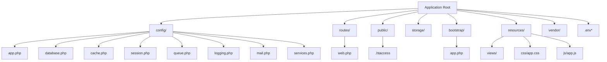
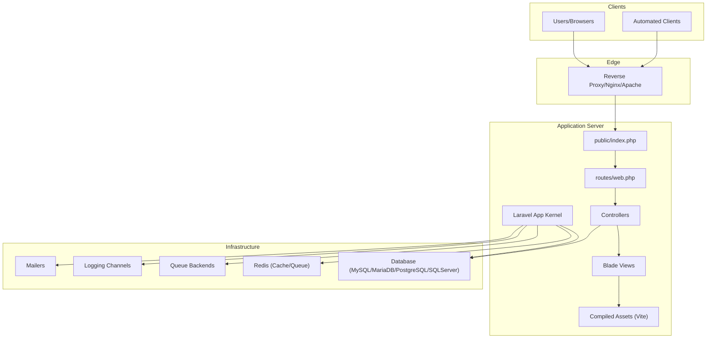
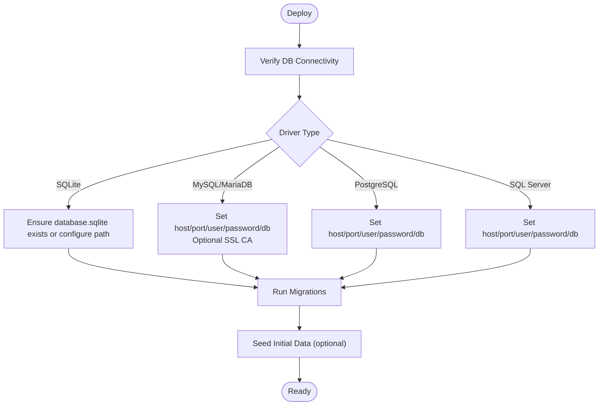
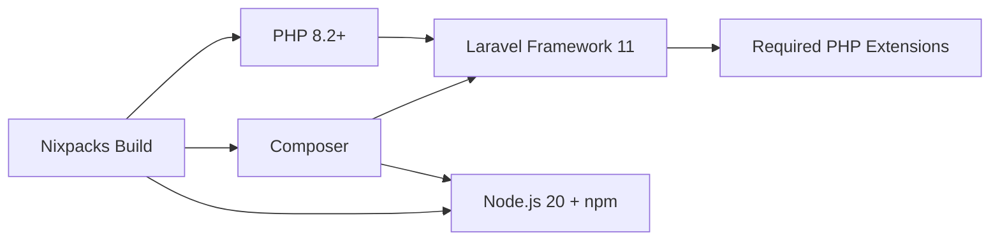

# Deployment & Operations

<cite>
**Referenced Files in This Document**
- [composer.json](file://composer.json)
- [nixpacks.toml](file://nixpacks.toml)
- [vite.config.js](file://vite.config.js)
- [package.json](file://package.json)
- [public/.htaccess](file://public/.htaccess)
- [bootstrap/app.php](file://bootstrap/app.php)
- [config/app.php](file://config/app.php)
- [config/database.php](file://config/database.php)
- [config/cache.php](file://config/cache.php)
- [config/session.php](file://config/session.php)
- [config/queue.php](file://config/queue.php)
- [config/logging.php](file://config/logging.php)
- [config/mail.php](file://config/mail.php)
- [config/services.php](file://config/services.php)
- [routes/web.php](file://routes/web.php)
</cite>

## Table of Contents
1. [Introduction](#introduction)
2. [Project Structure](#project-structure)
3. [Core Components](#core-components)
4. [Architecture Overview](#architecture-overview)
5. [Detailed Component Analysis](#detailed-component-analysis)
6. [Dependency Analysis](#dependency-analysis)
7. [Performance Considerations](#performance-considerations)
8. [Troubleshooting Guide](#troubleshooting-guide)
9. [Conclusion](#conclusion)
10. [Appendices](#appendices)

## Introduction
This document provides comprehensive deployment and operations guidance for the Kantin Ibu Ida Laravel application. It covers production deployment strategies, environment configuration, infrastructure requirements, server and database setup, reverse proxy configuration, platform-specific deployment approaches (shared hosting, containerized, and cloud), performance optimization, caching, asset compilation, monitoring and logging, error tracking, health checks, backup and disaster recovery, maintenance schedules, and troubleshooting.

## Project Structure
The application follows a standard Laravel 11 structure with configuration under config/, routes defined in routes/, compiled assets managed via Vite, and runtime configuration controlled by environment variables. Key deployment-relevant files include Composer configuration, Nixpacks build script, Vite asset pipeline, Apache rewrite rules, and Laravel’s bootstrap/app.php routing and middleware configuration.

**Diagram sources**
- [config/app.php:1-127](file://config/app.php#L1-L127)
- [config/database.php:1-171](file://config/database.php#L1-L171)
- [config/cache.php:1-108](file://config/cache.php#L1-L108)
- [config/session.php:1-219](file://config/session.php#L1-L219)
- [config/queue.php:1-113](file://config/queue.php#L1-L113)
- [config/logging.php:1-133](file://config/logging.php#L1-L133)
- [config/mail.php:1-104](file://config/mail.php#L1-L104)
- [config/services.php:1-35](file://config/services.php#L1-L35)
- [routes/web.php:1-71](file://routes/web.php#L1-L71)
- [public/.htaccess:1-22](file://public/.htaccess#L1-L22)
- [bootstrap/app.php:1-24](file://bootstrap/app.php#L1-L24)
- [resources/views](file://resources/views)
- [resources/css/app.css](file://resources/css/app.css)
- [resources/js/app.js](file://resources/js/app.js)

**Section sources**
- [composer.json:1-75](file://composer.json#L1-L75)
- [nixpacks.toml:1-34](file://nixpacks.toml#L1-L34)
- [vite.config.js:1-12](file://vite.config.js#L1-L12)
- [package.json:1-14](file://package.json#L1-L14)
- [public/.htaccess:1-22](file://public/.htaccess#L1-L22)
- [bootstrap/app.php:10-23](file://bootstrap/app.php#L10-L23)
- [config/app.php:16-124](file://config/app.php#L16-L124)

## Core Components
- Application configuration: environment-driven settings for name, environment, debug, URL, timezone, locale, encryption key, and maintenance mode.
- Database connectivity: support for SQLite, MySQL/MariaDB, PostgreSQL, and SQL Server with Redis cache and queue backends.
- Caching: multiple drivers including database, file, memcached, redis, dynamodb, and octane.
- Sessions: database-backed sessions by default with configurable lifetime, encryption, and cookie attributes.
- Queues: database, redis, SQS, and beanstalkd backends with failed job handling.
- Logging: stack-based channels supporting single, daily rotation, Slack, syslog, stderr, and papertrail integrations.
- Asset pipeline: Vite-managed frontend assets with Laravel plugin.
- Reverse proxy and routing: Apache .htaccess rewrite rules and Laravel’s front controller.

**Section sources**
- [config/app.php:16-124](file://config/app.php#L16-L124)
- [config/database.php:19-168](file://config/database.php#L19-L168)
- [config/cache.php:18-105](file://config/cache.php#L18-L105)
- [config/session.php:21-218](file://config/session.php#L21-L218)
- [config/queue.php:16-110](file://config/queue.php#L16-L110)
- [config/logging.php:21-132](file://config/logging.php#L21-L132)
- [vite.config.js:1-12](file://vite.config.js#L1-L12)
- [public/.htaccess:1-22](file://public/.htaccess#L1-L22)

## Architecture Overview
The runtime architecture centers on the Laravel application server receiving HTTP requests, routing through web.php, and serving views and controllers. Assets are served via the public/index.php front controller and compiled assets. Database and cache/queue backends are configured via environment variables. Health checks are exposed via the /up endpoint.

**Diagram sources**
- [routes/web.php:1-71](file://routes/web.php#L1-L71)
- [bootstrap/app.php:10-23](file://bootstrap/app.php#L10-L23)
- [config/database.php:32-168](file://config/database.php#L32-L168)
- [config/cache.php:34-92](file://config/cache.php#L34-L92)
- [config/queue.php:31-75](file://config/queue.php#L31-L75)
- [config/logging.php:53-132](file://config/logging.php#L53-L132)
- [config/mail.php:17-85](file://config/mail.php#L17-L85)

## Detailed Component Analysis

### Environment Configuration and Secrets Management
- Critical environment variables include application name, environment, debug flag, URL, timezone, locale, encryption key, maintenance driver/store, database connection details, Redis settings, cache store, session driver/lifetime, queue connection, logging channel/level, mailer transport, and third-party service tokens.
- Ensure APP_KEY is generated and unique per environment.
- Keep secrets out of version control; use CI/CD secret managers or OS-level key management.

**Section sources**
- [config/app.php:16-124](file://config/app.php#L16-L124)
- [config/database.php:19-168](file://config/database.php#L19-L168)
- [config/cache.php:18-105](file://config/cache.php#L18-L105)
- [config/session.php:21-218](file://config/session.php#L21-L218)
- [config/queue.php:16-110](file://config/queue.php#L16-L110)
- [config/logging.php:21-132](file://config/logging.php#L21-L132)
- [config/mail.php:17-85](file://config/mail.php#L17-L85)
- [config/services.php:17-32](file://config/services.php#L17-L32)

### Database Configuration and Setup
- Default connection is environment-driven; supported drivers include sqlite, mysql/mariadb, pgsql, and sqlsrv.
- Configure charset/collation, SSL CA for MySQL/MariaDB, and connection pooling considerations.
- Redis is configured for default and cache connections with optional lock connections.
- Migrations and seeds are executed during deployment lifecycle.

**Diagram sources**
- [config/database.php:34-110](file://config/database.php#L34-L110)
- [config/database.php:141-168](file://config/database.php#L141-L168)

**Section sources**
- [config/database.php:19-168](file://config/database.php#L19-L168)

### Caching and Sessions
- Default cache store is database; alternatives include file, memcached, redis, dynamodb, and octane.
- Redis client and cluster settings are configurable; prefix helps isolate environments.
- Sessions default to database with configurable lifetime, encryption, cookie attributes, and domain/path/security flags.

**Section sources**
- [config/cache.php:18-105](file://config/cache.php#L18-L105)
- [config/session.php:21-218](file://config/session.php#L21-L218)

### Queues and Background Jobs
- Default queue connection is database; redis, SQS, and beanstalkd are supported.
- Retry timing and failed job storage are configurable.
- Use supervisor or systemd to run queue workers in production.

**Section sources**
- [config/queue.php:16-110](file://config/queue.php#L16-L110)

### Logging and Monitoring
- Default channel is stack; single and daily rotate channels are available.
- Slack, syslog, stderr, and papertrail integrations are supported.
- Configure log level per environment and retention days for daily logs.

**Section sources**
- [config/logging.php:21-132](file://config/logging.php#L21-L132)

### Asset Compilation and Delivery
- Vite compiles CSS/JS; development uses hot-module reloading; production builds are optimized.
- public/.htaccess rewrites to index.php and handles Authorization header propagation.
- Ensure storage symlink is created and permissions allow writing to storage and bootstrap/cache.

**Section sources**
- [vite.config.js:1-12](file://vite.config.js#L1-L12)
- [package.json:4-6](file://package.json#L4-L6)
- [public/.htaccess:1-22](file://public/.htaccess#L1-L22)

### Reverse Proxy and Web Server
- Apache .htaccess enables URL rewriting and Authorization header passthrough.
- For Nginx, configure try_files $uri $uri/ /index.php and pass Authorization header.
- Set APP_URL to the external URL; ensure HTTPS enforcement in production.

**Section sources**
- [public/.htaccess:8-20](file://public/.htaccess#L8-L20)
- [config/app.php:55-56](file://config/app.php#L55-L56)

### Health Checks and Maintenance Mode
- Health endpoint is exposed at /up for load balancer probes.
- Maintenance mode can be controlled via cache or file driver; configure store/connection accordingly.

**Section sources**
- [bootstrap/app.php:14-15](file://bootstrap/app.php#L14-L15)
- [config/app.php:121-124](file://config/app.php#L121-L124)

### Payment Callback and CSRF Exceptions
- CSRF validation is bypassed for the payment callback endpoint to accept off-site notifications.
- Ensure webhook endpoints validate signatures and origin.

**Section sources**
- [bootstrap/app.php:17-19](file://bootstrap/app.php#L17-L19)
- [routes/web.php:50-50](file://routes/web.php#L50-L50)

## Dependency Analysis
The application depends on PHP 8.2+, Laravel Framework 11, and optional dev dependencies for local development. Composer scripts automate key tasks like key generation, migration, and asset publishing. Nixpacks defines a reproducible build environment with PHP extensions and Node.js.

**Diagram sources**
- [composer.json:7-11](file://composer.json#L7-L11)
- [composer.json:63-70](file://composer.json#L63-L70)
- [nixpacks.toml:1-19](file://nixpacks.toml#L1-L19)

**Section sources**
- [composer.json:7-11](file://composer.json#L7-L11)
- [composer.json:33-49](file://composer.json#L33-L49)
- [nixpacks.toml:1-34](file://nixpacks.toml#L1-L34)

## Performance Considerations
- Optimize autoloader and pre-warm OPcache on boot.
- Use Redis for cache and queues; enable prefix isolation per environment.
- Prefer database-backed sessions for horizontal scaling.
- Enable production logging levels and rotation; avoid verbose logs in high volume.
- Precompile assets and cache routes/config for production.
- Use CDN for static assets; leverage browser caching headers.
- Tune queue worker concurrency and retry policies.

[No sources needed since this section provides general guidance]

## Troubleshooting Guide
Common deployment issues and resolutions:
- Missing APP_KEY: regenerate and redeploy.
- Storage permissions: ensure storage/* and bootstrap/cache are writable.
- Database connectivity: verify host/port/user/password and SSL CA settings.
- Reverse proxy rewrites: confirm .htaccess or Nginx/Apache rules forward to index.php.
- CSRF failures on callbacks: ensure exceptions are configured for callback endpoints.
- Asset build failures: check Node/npm versions and run production build locally.
- Health probe failures: verify /up endpoint and underlying services.

**Section sources**
- [config/app.php:100-106](file://config/app.php#L100-L106)
- [bootstrap/app.php:17-19](file://bootstrap/app.php#L17-L19)
- [public/.htaccess:17-21](file://public/.htaccess#L17-L21)
- [nixpacks.toml:21-30](file://nixpacks.toml#L21-L30)

## Conclusion
Deploying Kantin Ibu Ida involves configuring environment variables, preparing databases and Redis, compiling assets, and securing reverse proxies. Production readiness requires robust logging, queue workers, health checks, and maintenance mode handling. Regular backups, monitoring, and scheduled maintenance ensure reliability and uptime.

[No sources needed since this section summarizes without analyzing specific files]

## Appendices

### A. Production Deployment Checklist
- Generate and deploy APP_KEY.
- Provision database and Redis instances.
- Set APP_ENV=production and APP_DEBUG=false.
- Configure APP_URL and enforce HTTPS.
- Run migrations and seed initial data.
- Compile assets for production.
- Configure reverse proxy and health checks.
- Set up logging and monitoring.
- Deploy queue workers and supervisors.

**Section sources**
- [config/app.php:29-42](file://config/app.php#L29-L42)
- [config/app.php:55-56](file://config/app.php#L55-L56)
- [config/database.php:19-168](file://config/database.php#L19-L168)
- [config/cache.php:18-105](file://config/cache.php#L18-L105)
- [config/session.php:21-218](file://config/session.php#L21-L218)
- [config/queue.php:16-110](file://config/queue.php#L16-L110)
- [config/logging.php:21-132](file://config/logging.php#L21-L132)
- [vite.config.js:1-12](file://vite.config.js#L1-L12)
- [public/.htaccess:1-22](file://public/.htaccess#L1-L22)
- [bootstrap/app.php:14-15](file://bootstrap/app.php#L14-L15)

### B. Environment Variables Reference
- Application: APP_NAME, APP_ENV, APP_DEBUG, APP_URL, APP_TIMEZONE, APP_LOCALE, APP_KEY, APP_MAINTENANCE_DRIVER, APP_MAINTENANCE_STORE
- Database: DB_CONNECTION, DB_HOST, DB_PORT, DB_DATABASE, DB_USERNAME, DB_PASSWORD, DB_URL, DB_CHARSET, DB_COLLATION, MYSQL_ATTR_SSL_CA
- Redis: REDIS_CLIENT, REDIS_PREFIX, REDIS_URL, REDIS_HOST, REDIS_USERNAME, REDIS_PASSWORD, REDIS_PORT, REDIS_DB, REDIS_CACHE_DB
- Cache: CACHE_STORE, DB_CACHE_TABLE, DB_CACHE_CONNECTION, CACHE_PREFIX
- Session: SESSION_DRIVER, SESSION_LIFETIME, SESSION_ENCRYPT, SESSION_CONNECTION, SESSION_TABLE, SESSION_STORE, SESSION_COOKIE, SESSION_PATH, SESSION_DOMAIN, SESSION_SECURE_COOKIE, SESSION_HTTP_ONLY, SESSION_SAME_SITE, SESSION_PARTITIONED_COOKIE
- Queue: QUEUE_CONNECTION, DB_QUEUE_CONNECTION, DB_QUEUE_TABLE, DB_QUEUE, DB_QUEUE_RETRY_AFTER, REDIS_QUEUE_CONNECTION, REDIS_QUEUE, REDIS_QUEUE_RETRY_AFTER, SQS_PREFIX, SQS_QUEUE, SQS_SUFFIX, AWS_ACCESS_KEY_ID, AWS_SECRET_ACCESS_KEY, AWS_DEFAULT_REGION
- Logging: LOG_CHANNEL, LOG_DEPRECATIONS_CHANNEL, LOG_LEVEL, LOG_STACK, LOG_DAILY_DAYS, LOG_SLACK_WEBHOOK_URL, PAPERTRAIL_URL, PAPERTRAIL_PORT, LOG_STDERR_FORMATTER
- Mail: MAIL_MAILER, MAIL_HOST, MAIL_PORT, MAIL_ENCRYPTION, MAIL_USERNAME, MAIL_PASSWORD, MAIL_FROM_ADDRESS, MAIL_FROM_NAME, MAIL_LOG_CHANNEL, AWS_ACCESS_KEY_ID, AWS_SECRET_ACCESS_KEY, AWS_DEFAULT_REGION, POSTMARK_TOKEN
- Services: SLACK_BOT_USER_OAUTH_TOKEN, SLACK_BOT_USER_DEFAULT_CHANNEL

**Section sources**
- [config/app.php:16-124](file://config/app.php#L16-L124)
- [config/database.php:19-168](file://config/database.php#L19-L168)
- [config/cache.php:18-105](file://config/cache.php#L18-L105)
- [config/session.php:21-218](file://config/session.php#L21-L218)
- [config/queue.php:16-110](file://config/queue.php#L16-L110)
- [config/logging.php:21-132](file://config/logging.php#L21-L132)
- [config/mail.php:17-103](file://config/mail.php#L17-L103)
- [config/services.php:17-32](file://config/services.php#L17-L32)

### C. Platform Deployment Notes
- Shared Hosting: Use public/index.php with Apache .htaccess; ensure PHP 8.2+ and required extensions; enable OPcache; configure database and Redis via environment variables.
- Containerized (Docker): Base image on PHP 8.2-apache or PHP 8.2-fpm; install pdo_mysql, mbstring, xml, curl, zip, gd, tokenizer, bcmath, fileinfo, openssl, intl; mount storage volumes; expose port 80; run Composer install --no-dev and npm ci/build.
- Cloud (Heroku/Nixpacks): Leverage nixpacks.toml for reproducible builds; ensure PORT is honored; run storage symlink, migrations, and seed steps in start command; scale dynos and workers as needed.

**Section sources**
- [nixpacks.toml:1-34](file://nixpacks.toml#L1-L34)
- [public/.htaccess:1-22](file://public/.htaccess#L1-L22)
- [composer.json:7-11](file://composer.json#L7-L11)
- [package.json:4-6](file://package.json#L4-L6)

### D. Backup and Disaster Recovery
- Database: Schedule regular logical backups (mysqldump/pg_dump) and test restore procedures.
- Storage: Back up storage/app/public and storage/framework/cache/sessions/logs.
- Configuration: Version control .env.example and infrastructure-as-code; maintain separate secrets vaults.
- DR Plan: Automate restore verification; document RTO/RPO targets; conduct quarterly drills.

[No sources needed since this section provides general guidance]

### E. Monitoring and Health Checks
- Health Endpoint: Use /up for load balancers and orchestrators.
- Logs: Ship application logs to centralized systems; set appropriate log levels.
- Metrics: Track response times, error rates, queue backlog, and cache hit ratios.
- Alerts: Configure thresholds for downtime, errors, and resource exhaustion.

**Section sources**
- [bootstrap/app.php:14-15](file://bootstrap/app.php#L14-L15)
- [config/logging.php:21-132](file://config/logging.php#L21-L132)