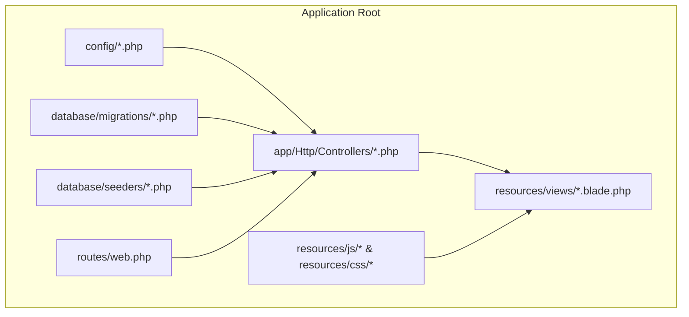
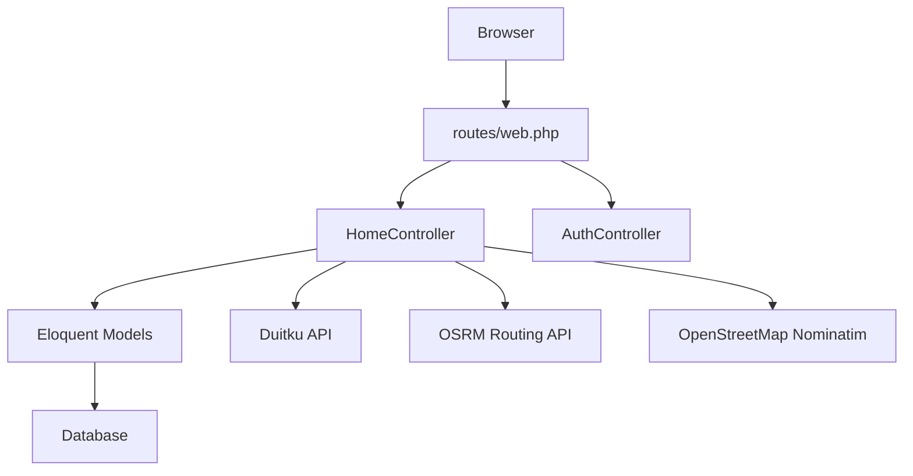
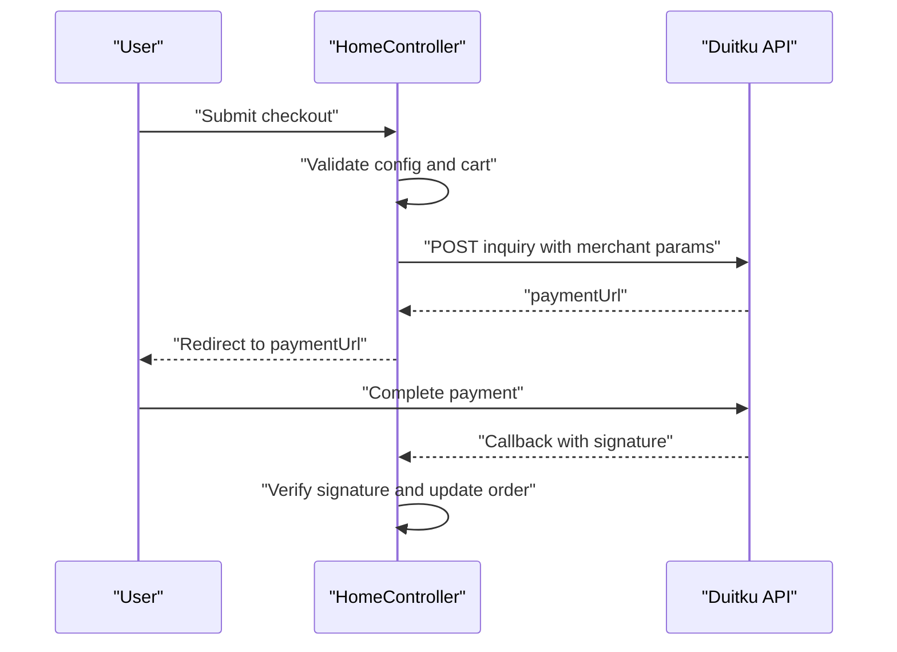
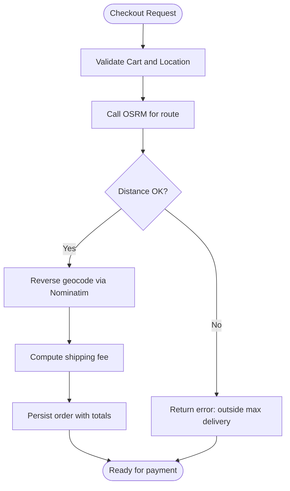
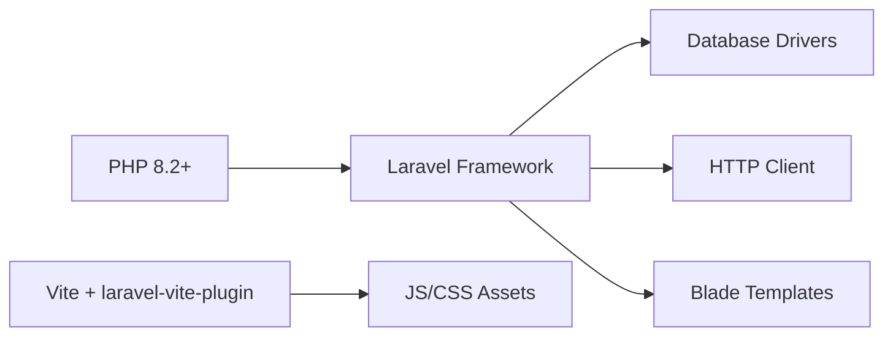

# Getting Started

<cite>
**Referenced Files in This Document**
- [README.md](file://README.md)
- [composer.json](file://composer.json)
- [package.json](file://package.json)
- [.env.example](file://.env.example)
- [config/app.php](file://config/app.php)
- [config/database.php](file://config/database.php)
- [config/duitku.php](file://config/duitku.php)
- [config/canteen.php](file://config/canteen.php)
- [database/migrations/0001_01_01_000000_create_users_table.php](file://database/migrations/0001_01_01_000000_create_users_table.php)
- [database/migrations/2026_04_21_011703_create_menus_table.php](file://database/migrations/2026_04_21_011703_create_menus_table.php)
- [database/migrations/2026_04_21_011703_create_orders_table.php](file://database/migrations/2026_04_21_011703_create_orders_table.php)
- [database/seeders/DatabaseSeeder.php](file://database/seeders/DatabaseSeeder.php)
- [app/Http/Controllers/HomeController.php](file://app/Http/Controllers/HomeController.php)
- [app/Http/Controllers/AuthController.php](file://app/Http/Controllers/AuthController.php)
- [routes/web.php](file://routes/web.php)
- [resources/views/welcome.blade.php](file://resources/views/welcome.blade.php)
</cite>

## Table of Contents
1. [Introduction](#introduction)
2. [Project Structure](#project-structure)
3. [Core Components](#core-components)
4. [Architecture Overview](#architecture-overview)
5. [Detailed Component Analysis](#detailed-component-analysis)
6. [Dependency Analysis](#dependency-analysis)
7. [Performance Considerations](#performance-considerations)
8. [Troubleshooting Guide](#troubleshooting-guide)
9. [Conclusion](#conclusion)
10. [Appendices](#appendices)

## Introduction
This guide helps you set up and run the Kantin Ibu Ida Laravel application locally. It covers prerequisites, environment setup, dependency installation, database configuration, payment gateway setup, and initial data seeding. You will also learn how to verify the system works and troubleshoot common issues.

## Project Structure
The application follows Laravel’s standard MVC structure with configuration under config/, database migrations and seeders under database/, frontend assets managed via Vite, and Blade templates under resources/views/.

**Diagram sources**
- [config/app.php:1-127](file://config/app.php#L1-L127)
- [config/database.php:1-171](file://config/database.php#L1-L171)
- [routes/web.php:1-71](file://routes/web.php#L1-L71)
- [app/Http/Controllers/HomeController.php:1-568](file://app/Http/Controllers/HomeController.php#L1-L568)

**Section sources**
- [README.md:1-67](file://README.md#L1-L67)
- [composer.json:1-75](file://composer.json#L1-L75)
- [package.json:1-14](file://package.json#L1-L14)

## Core Components
- Application server: Laravel 11 with PHP 8.2+ as required by composer.json.
- Frontend tooling: Vite for asset compilation.
- Database: MySQL/MariaDB/PostgreSQL/SQL Server/SQLite supported via config/database.php.
- Payment gateway: Duitku integration configured via config/duitku.php and .env variables.
- Location services: Delivery distance calculation and reverse geocoding via OpenStreetMap and OSRM routing.

Key configuration files:
- Environment variables: .env.example defines defaults for database, mail, cache, and Duitku.
- App configuration: config/app.php controls application name, environment, URL, timezone, and locale.
- Database connections: config/database.php supports sqlite/mysql/mariadb/pgsql/sqlsrv.
- Payment gateway: config/duitku.php reads merchant code, API key, environment, and endpoints.
- Canteen settings: config/canteen.php holds name, coordinates, and max delivery radius.

**Section sources**
- [composer.json:7-11](file://composer.json#L7-L11)
- [composer.json:69-70](file://composer.json#L69-L70)
- [package.json:1-14](file://package.json#L1-L14)
- [.env.example:1-68](file://.env.example#L1-L68)
- [config/app.php:16-127](file://config/app.php#L16-L127)
- [config/database.php:19-112](file://config/database.php#L19-L112)
- [config/duitku.php:1-12](file://config/duitku.php#L1-L12)
- [config/canteen.php:1-9](file://config/canteen.php#L1-L9)

## Architecture Overview
High-level runtime flow for local development:
- Web requests enter via routes/web.php and are handled by controllers.
- Controllers interact with Eloquent models and configuration to process orders, payments, and user actions.
- Payment callbacks integrate with Duitku endpoints based on environment.
- Delivery logic uses OSRM for routing and OpenStreetMap for reverse geocoding.

**Diagram sources**
- [routes/web.php:1-71](file://routes/web.php#L1-L71)
- [app/Http/Controllers/HomeController.php:1-568](file://app/Http/Controllers/HomeController.php#L1-L568)
- [app/Http/Controllers/AuthController.php:1-78](file://app/Http/Controllers/AuthController.php#L1-L78)
- [config/duitku.php:1-12](file://config/duitku.php#L1-L12)

## Detailed Component Analysis

### Prerequisites and System Requirements
- PHP: Version 8.2+ is required by composer.json.
- Composer: Used to install PHP dependencies.
- Node.js and npm: Required for frontend asset compilation via Vite.
- Database: MySQL/MariaDB/PostgreSQL/SQL Server/SQLite supported. Defaults in .env.example use MySQL.
- Optional: Redis for cache/session if enabled.

Verification steps:
- Confirm PHP version meets the requirement.
- Install Composer globally.
- Install Node.js LTS and npm.
- Ensure a database server is installed and accessible.

**Section sources**
- [composer.json:7-11](file://composer.json#L7-L11)
- [composer.json:69-70](file://composer.json#L69-L70)
- [package.json:1-14](file://package.json#L1-L14)
- [.env.example:22-27](file://.env.example#L22-L27)

### Step-by-Step Installation

1. Clone the repository
- Use your preferred Git client to clone the repository to your local machine.

2. Install PHP dependencies with Composer
- Navigate to the project root and run:
  - composer install

3. Install frontend dependencies with npm
- From the project root, run:
  - npm install

4. Create and configure the environment file
- Copy the example environment file:
  - cp .env.example .env
- Generate the application key:
  - php artisan key:generate

5. Configure the database
- Edit .env to set:
  - DB_CONNECTION, DB_HOST, DB_PORT, DB_DATABASE, DB_USERNAME, DB_PASSWORD
- Ensure the database exists and credentials are valid.

6. Run database migrations
- Execute:
  - php artisan migrate

7. Seed initial data
- Option A: Use the built-in route to seed (development only):
  - Visit http://localhost/seed-db in your browser
- Option B: Use Artisan command:
  - php artisan db:seed

8. Build frontend assets
- Compile assets for development:
  - npm run dev
- Or for production:
  - npm run build

9. Start the local development server
- Laravel Valet, Sail, or PHP built-in server:
  - php artisan serve

10. Access the application
- Open http://localhost in your browser.

**Section sources**
- [composer.json:42-49](file://composer.json#L42-L49)
- [.env.example:1-68](file://.env.example#L1-L68)
- [config/database.php:19-112](file://config/database.php#L19-L112)
- [routes/web.php:17-26](file://routes/web.php#L17-L26)

### Environment Configuration

- Database connections
  - Default connection is mysql. Adjust DB_* variables in .env.
  - Additional drivers (sqlite, mariadb, pgsql, sqlsrv) are supported via config/database.php.

- Application settings
  - APP_NAME, APP_ENV, APP_URL, APP_TIMEZONE, APP_LOCALE, APP_FAKER_LOCALE in config/app.php and .env.

- Duitku payment gateway
  - Merchant code, API key, environment, callback/return URLs are defined in .env and loaded by config/duitku.php.
  - Ensure DUITKU_MERCHANT_CODE and DUITKU_API_KEY are set for sandbox or production.

- Canteen location services
  - CANTEEN_NAME, CANTEEN_LATITUDE, CANTEEN_LONGITUDE, CANTEEN_MAX_DELIVERY_KM in .env and config/canteen.php.

- Mail, cache, queue, broadcast, and session settings
  - Defined in .env and config/*.php files.

**Section sources**
- [.env.example:22-68](file://.env.example#L22-L68)
- [config/database.php:19-112](file://config/database.php#L19-L112)
- [config/app.php:16-127](file://config/app.php#L16-L127)
- [config/duitku.php:1-12](file://config/duitku.php#L1-L12)
- [config/canteen.php:1-9](file://config/canteen.php#L1-L9)

### Payment Gateway Setup (Duitku)

- Sandbox vs Production
  - DUITKU_ENV controls endpoint selection in config/duitku.php.
  - Callback and return URLs are configurable in .env and used during checkout.

- Checkout flow
  - HomeController validates configuration, calculates shipping fee, and posts to Duitku endpoint.
  - Callback endpoint updates order status upon successful payment.

- Verification
  - Ensure DUITKU_MERCHANT_CODE and DUITKU_API_KEY are set.
  - Clear config cache after changes:
    - php artisan config:clear

**Diagram sources**
- [app/Http/Controllers/HomeController.php:275-408](file://app/Http/Controllers/HomeController.php#L275-L408)
- [config/duitku.php:1-12](file://config/duitku.php#L1-L12)

**Section sources**
- [config/duitku.php:1-12](file://config/duitku.php#L1-L12)
- [app/Http/Controllers/HomeController.php:552-566](file://app/Http/Controllers/HomeController.php#L552-L566)

### Location Service Configuration

- Delivery preview and shipping fee
  - HomeController uses OSRM to compute driving distance between canteen coordinates and customer location.
  - Reverse geocoding uses OpenStreetMap Nominatim to derive address from lat/lng.

- Canteen coordinates and max delivery radius
  - Configured via CANTEEN_LATITUDE, CANTEEN_LONGITUDE, and CANTEEN_MAX_DELIVERY_KM in .env and config/canteen.php.

**Diagram sources**
- [app/Http/Controllers/HomeController.php:275-338](file://app/Http/Controllers/HomeController.php#L275-L338)
- [app/Http/Controllers/HomeController.php:514-550](file://app/Http/Controllers/HomeController.php#L514-L550)
- [config/canteen.php:1-9](file://config/canteen.php#L1-L9)

**Section sources**
- [app/Http/Controllers/HomeController.php:127-190](file://app/Http/Controllers/HomeController.php#L127-L190)
- [app/Http/Controllers/HomeController.php:514-550](file://app/Http/Controllers/HomeController.php#L514-L550)
- [config/canteen.php:1-9](file://config/canteen.php#L1-L9)

### Initial User Accounts and Basic Functionality

- Seeded users
  - Admin account: admin@ibuida.com with password “password”.
  - Regular user: user@test.com with password “password”.
  - Additional test user: test@kantin.test with password “password”.

- Sample menus and orders
  - The seeder creates categories and sample menu items.
  - A test order is generated for the Railway test user with sample items and shipping fee.

- Basic checks
  - Login via /login with seeded credentials.
  - Browse menu at /menu and add items to cart.
  - Use delivery preview to check distance and shipping cost.
  - Proceed to checkout and simulate payment via Duitku sandbox.

**Section sources**
- [database/seeders/DatabaseSeeder.php:20-47](file://database/seeders/DatabaseSeeder.php#L20-L47)
- [database/seeders/DatabaseSeeder.php:54-97](file://database/seeders/DatabaseSeeder.php#L54-L97)
- [database/seeders/DatabaseSeeder.php:101-140](file://database/seeders/DatabaseSeeder.php#L101-L140)
- [routes/web.php:27-31](file://routes/web.php#L27-L31)
- [resources/views/welcome.blade.php:103-125](file://resources/views/welcome.blade.php#L103-L125)

## Dependency Analysis
Runtime dependencies and their roles:
- PHP 8.2+: Laravel 11 requirement.
- Laravel framework: Core application and services.
- Vite + laravel-vite-plugin: Asset pipeline for JS/CSS.
- PDO extensions: Required for selected database drivers.
- Optional: Redis client for cache/session if enabled.

**Diagram sources**
- [composer.json:7-11](file://composer.json#L7-L11)
- [package.json:1-14](file://package.json#L1-L14)

**Section sources**
- [composer.json:7-11](file://composer.json#L7-L11)
- [composer.json:69-70](file://composer.json#L69-L70)
- [package.json:1-14](file://package.json#L1-L14)

## Performance Considerations
- Keep APP_ENV=production for optimized caching in production deployments.
- Use php artisan config:clear and cache:clear when changing environment variables or configuration.
- For development, use npm run dev for hot-reload; for production, use npm run build.
- Ensure database indexes exist for frequently queried columns (e.g., users.email, orders.user_id).

[No sources needed since this section provides general guidance]

## Troubleshooting Guide

Common setup issues and resolutions:
- PHP version mismatch
  - Symptom: Composer errors indicating unsupported PHP version.
  - Fix: Upgrade to PHP 8.2+ as required by composer.json.

- Missing APP_KEY
  - Symptom: Exceptions related to encryption or session.
  - Fix: Run php artisan key:generate and ensure APP_KEY is present in .env.

- Database connection failures
  - Symptom: SQLSTATE errors when running migrations.
  - Fix: Verify DB_CONNECTION, DB_HOST, DB_PORT, DB_DATABASE, DB_USERNAME, DB_PASSWORD in .env; ensure the database exists and is reachable.

- Duitku configuration errors
  - Symptom: Error message about missing merchant code or API key during checkout.
  - Fix: Set DUITKU_MERCHANT_CODE and DUITKU_API_KEY in .env; clear config cache with php artisan config:clear.

- Frontend assets not loading
  - Symptom: Blank pages or missing styles/scripts.
  - Fix: Install dependencies with npm install and compile assets with npm run dev or npm run build.

- OSRM/Nominatim timeouts during delivery preview
  - Symptom: “Failed to calculate route” or “Address not found.”
  - Fix: Retry later or adjust coordinates; ensure outbound HTTP access is permitted.

- Seeding fails or inconsistent
  - Symptom: Missing users or menus after seeding.
  - Fix: Use the /seed-db route or php artisan db:seed with --force; verify database connectivity.

**Section sources**
- [composer.json:69-70](file://composer.json#L69-L70)
- [app/Http/Controllers/HomeController.php:559-566](file://app/Http/Controllers/HomeController.php#L559-L566)
- [routes/web.php:17-26](file://routes/web.php#L17-L26)

## Conclusion
You now have the prerequisites, configuration, and steps to run Kantin Ibu Ida locally. After completing the setup, log in with the seeded credentials, browse the menu, simulate a delivery preview, and test the payment flow using Duitku sandbox. Use the troubleshooting section to resolve common issues quickly.

[No sources needed since this section summarizes without analyzing specific files]

## Appendices

### Quick Reference: Essential Commands
- Install dependencies: composer install
- Install frontend deps: npm install
- Generate key: php artisan key:generate
- Run migrations: php artisan migrate
- Seed data: php artisan db:seed
- Serve app: php artisan serve
- Build assets: npm run build
- Clear config cache: php artisan config:clear

**Section sources**
- [composer.json:42-49](file://composer.json#L42-L49)
- [routes/web.php:17-26](file://routes/web.php#L17-L26)