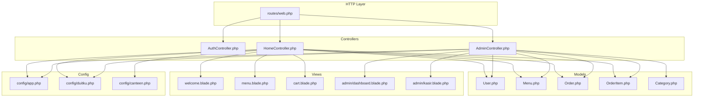
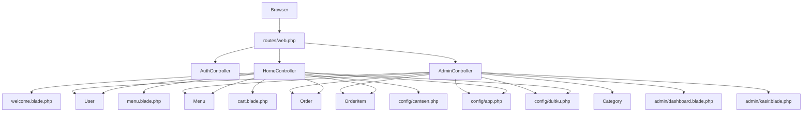
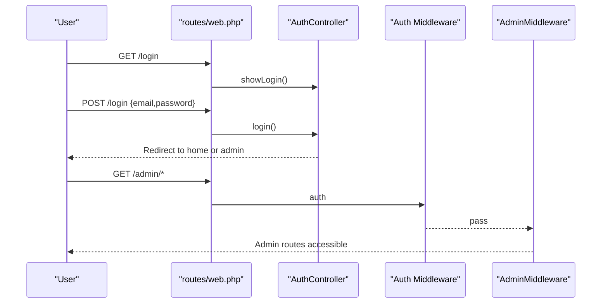
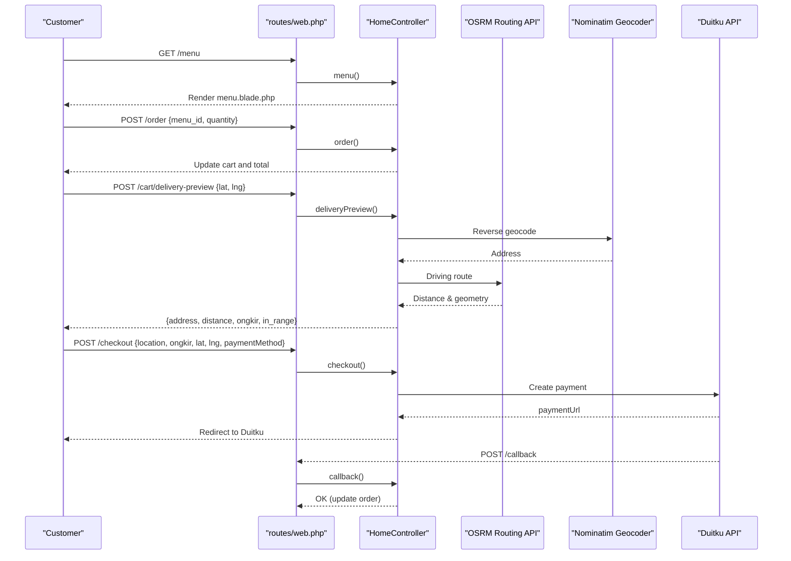
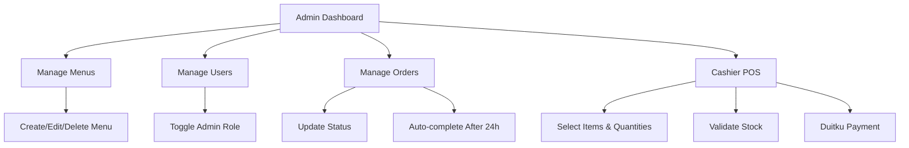
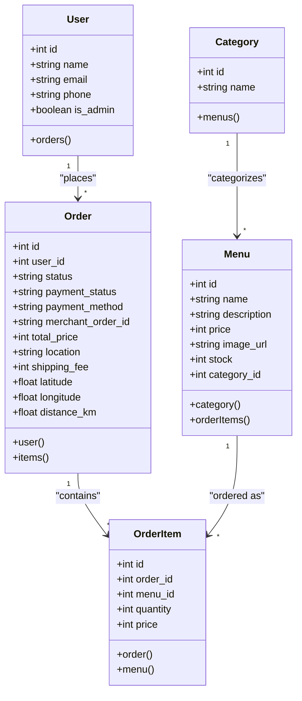
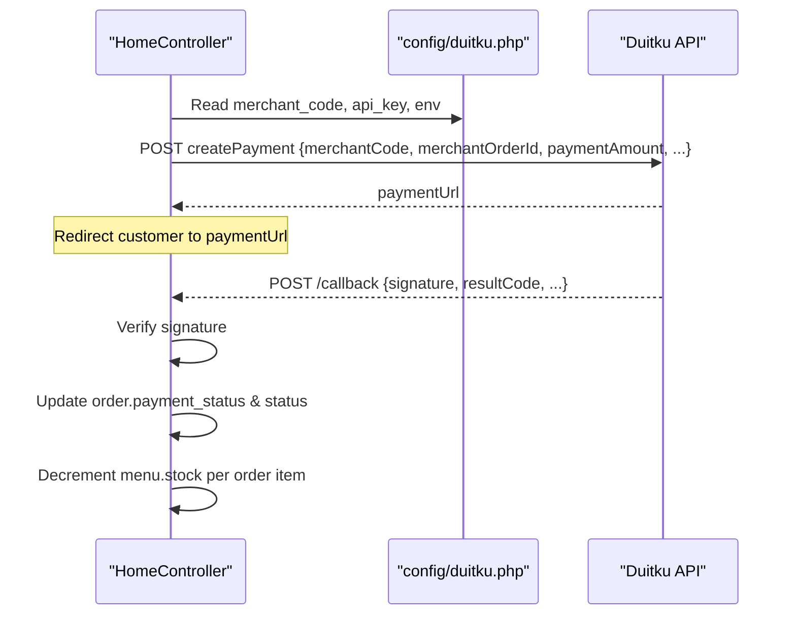
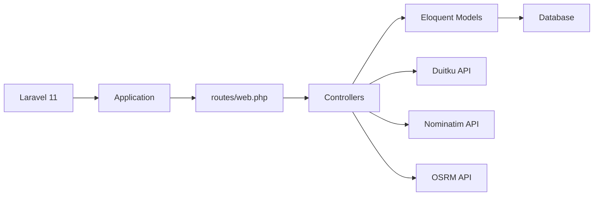

# Project Overview

<cite>
**Referenced Files in This Document**
- [README.md](file://README.md)
- [composer.json](file://composer.json)
- [routes/web.php](file://routes/web.php)
- [app/Http/Controllers/Controller.php](file://app/Http/Controllers/Controller.php)
- [app/Http/Controllers/AuthController.php](file://app/Http/Controllers/AuthController.php)
- [app/Http/Controllers/HomeController.php](file://app/Http/Controllers/HomeController.php)
- [app/Http/Controllers/AdminController.php](file://app/Http/Controllers/AdminController.php)
- [app/Http/Middleware/AdminMiddleware.php](file://app/Http/Middleware/AdminMiddleware.php)
- [app/Models/User.php](file://app/Models/User.php)
- [app/Models/Menu.php](file://app/Models/Menu.php)
- [app/Models/Order.php](file://app/Models/Order.php)
- [app/Models/OrderItem.php](file://app/Models/OrderItem.php)
- [app/Models/Category.php](file://app/Models/Category.php)
- [config/app.php](file://config/app.php)
- [config/duitku.php](file://config/duitku.php)
- [config/canteen.php](file://config/canteen.php)
- [database/migrations/..._create_menus_table.php](file://database/migrations/2026_04_21_011703_create_menus_table.php)
- [database/migrations/..._create_orders_table.php](file://database/migrations/2026_04_21_011703_create_orders_table.php)
- [database/migrations/..._create_order_items_table.php](file://database/migrations/2026_04_21_011704_create_order_items_table.php)
- [database/migrations/..._add_stock_to_menus_table.php](file://database/migrations/2026_04_27_021524_add_stock_to_menus_table.php)
- [database/migrations/..._add_location_to_orders_table.php](file://database/migrations/2026_04_27_022651_add_location_to_orders_table.php)
- [database/migrations/..._create_categories_table.php](file://database/migrations/2026_05_15_072236_create_categories_table.php)
- [database/migrations/..._create_payments_table.php](file://database/migrations/2026_05_15_072246_create_payments_table.php)
- [database/migrations/..._add_category_id_to_menus_table.php](file://database/migrations/2026_05_15_072332_create_point_transactions_table.php](file://database/migrations/2026_05_15_072332_create_point_transactions_table.php)
- [database/migrations/..._cleanup_unused_columns.php](file://database/migrations/2026_05_18_020058_add_shipping_fields_to_orders_table.php](file://database/migrations/2026_05_18_020058_add_shipping_fields_to_orders_table.php)
- [database/migrations/..._add_payment_fields_to_orders_table.php](file://database/migrations/2026_05_24_000000_add_payment_fields_to_orders_table.php)
- [resources/views/welcome.blade.php](file://resources/views/welcome.blade.php)
- [resources/views/menu.blade.php](file://resources/views/menu.blade.php)
- [resources/views/cart.blade.php](file://resources/views/cart.blade.php)
- [resources/views/admin/dashboard.blade.php](file://resources/views/admin/dashboard.blade.php)
- [resources/views/admin/kasir.blade.php](file://resources/views/admin/kasir.blade.php)
</cite>

## Table of Contents
1. [Introduction](#introduction)
2. [Project Structure](#project-structure)
3. [Core Components](#core-components)
4. [Architecture Overview](#architecture-overview)
5. [Detailed Component Analysis](#detailed-component-analysis)
6. [Dependency Analysis](#dependency-analysis)
7. [Performance Considerations](#performance-considerations)
8. [Troubleshooting Guide](#troubleshooting-guide)
9. [Conclusion](#conclusion)
10. [Appendices](#appendices)

## Introduction
Kantin Ibu Ida is a full-stack web application built with Laravel 11 to streamline food ordering and delivery management for a canteen environment. It supports customer-facing features such as browsing menus, adding items to a cart, checkout with delivery location preview, and payment processing via Duitku. Administrators can manage menus, users, and orders, while cashiers operate a point-of-sale (POS) checkout integrated with Duitku payments. The system leverages Laravel’s MVC architecture, Eloquent ORM, Blade templating, and middleware for role-based access control.

## Project Structure
The project follows Laravel’s conventional structure with clear separation of concerns:
- app/Http/Controllers: Request handlers implementing business logic for authentication, home/customer workflows, admin operations, and cashier POS.
- app/Http/Middleware: Access control for administrative routes.
- app/Models: Eloquent models representing Users, Menus, Orders, OrderItems, and Categories.
- config/: Application configuration including app settings, Duitku payment gateway, and canteen-specific parameters.
- database/migrations: Schema definitions for Menus, Orders, OrderItems, Categories, Payments, and related fields.
- resources/views: Blade templates for frontend pages and admin dashboards.
- routes/web.php: Web routes grouped by authentication and role-based middleware.

**Diagram sources**
- [routes/web.php:1-71](file://routes/web.php#L1-L71)
- [app/Http/Controllers/AuthController.php:1-78](file://app/Http/Controllers/AuthController.php#L1-L78)
- [app/Http/Controllers/HomeController.php:1-568](file://app/Http/Controllers/HomeController.php#L1-L568)
- [app/Http/Controllers/AdminController.php:1-257](file://app/Http/Controllers/AdminController.php#L1-L257)
- [app/Models/User.php:1-55](file://app/Models/User.php#L1-L55)
- [app/Models/Menu.php:1-32](file://app/Models/Menu.php#L1-L32)
- [app/Models/Order.php:1-36](file://app/Models/Order.php#L1-L36)
- [app/Models/OrderItem.php:1-29](file://app/Models/OrderItem.php#L1-L29)
- [app/Models/Category.php:1-16](file://app/Models/Category.php#L1-L16)
- [config/app.php:1-127](file://config/app.php#L1-L127)
- [config/duitku.php](file://config/duitku.php)
- [config/canteen.php](file://config/canteen.php)
- [resources/views/welcome.blade.php](file://resources/views/welcome.blade.php)
- [resources/views/menu.blade.php](file://resources/views/menu.blade.php)
- [resources/views/cart.blade.php](file://resources/views/cart.blade.php)
- [resources/views/admin/dashboard.blade.php](file://resources/views/admin/dashboard.blade.php)
- [resources/views/admin/kasir.blade.php](file://resources/views/admin/kasir.blade.php)

**Section sources**
- [routes/web.php:1-71](file://routes/web.php#L1-L71)
- [composer.json:1-75](file://composer.json#L1-L75)
- [config/app.php:1-127](file://config/app.php#L1-L127)

## Core Components
- Authentication and Authorization
  - Login/registration/logout handled by AuthController with support for email or username login.
  - Middleware ensures admin-only access to administrative routes.
- Customer Ordering Workflow
  - Browse menus, add items to cart, adjust quantities, and preview delivery cost and address using geocoding and routing APIs.
  - Checkout integrates with Duitku for payment initiation and callback verification.
- Admin Dashboard
  - Manage menus (CRUD), users, and orders; auto-completes orders after 24 hours when marked “arrived.”
- Cashier POS
  - Manual POS checkout for walk-in customers with stock validation and Duitku payment processing.
- Data Models
  - User, Menu, Order, OrderItem, Category define the domain model and relationships.

**Section sources**
- [app/Http/Controllers/AuthController.php:1-78](file://app/Http/Controllers/AuthController.php#L1-L78)
- [app/Http/Controllers/HomeController.php:1-568](file://app/Http/Controllers/HomeController.php#L1-L568)
- [app/Http/Controllers/AdminController.php:1-257](file://app/Http/Controllers/AdminController.php#L1-L257)
- [app/Models/User.php:1-55](file://app/Models/User.php#L1-L55)
- [app/Models/Menu.php:1-32](file://app/Models/Menu.php#L1-L32)
- [app/Models/Order.php:1-36](file://app/Models/Order.php#L1-L36)
- [app/Models/OrderItem.php:1-29](file://app/Models/OrderItem.php#L1-L29)
- [app/Models/Category.php:1-16](file://app/Models/Category.php#L1-L16)

## Architecture Overview
Kantin Ibu Ida follows Laravel MVC:
- Routes define entry points and groupings by authentication and role.
- Controllers orchestrate requests, interact with models, and render views or JSON responses.
- Models encapsulate data and relationships; migrations define schema.
- Views render HTML using Blade templates.
- Configuration files centralize app settings, Duitku credentials, and canteen parameters.

**Diagram sources**
- [routes/web.php:1-71](file://routes/web.php#L1-L71)
- [app/Http/Controllers/AuthController.php:1-78](file://app/Http/Controllers/AuthController.php#L1-L78)
- [app/Http/Controllers/HomeController.php:1-568](file://app/Http/Controllers/HomeController.php#L1-L568)
- [app/Http/Controllers/AdminController.php:1-257](file://app/Http/Controllers/AdminController.php#L1-L257)
- [app/Models/User.php:1-55](file://app/Models/User.php#L1-L55)
- [app/Models/Menu.php:1-32](file://app/Models/Menu.php#L1-L32)
- [app/Models/Order.php:1-36](file://app/Models/Order.php#L1-L36)
- [app/Models/OrderItem.php:1-29](file://app/Models/OrderItem.php#L1-L29)
- [app/Models/Category.php:1-16](file://app/Models/Category.php#L1-L16)
- [config/app.php:1-127](file://config/app.php#L1-L127)
- [config/duitku.php](file://config/duitku.php)
- [config/canteen.php](file://config/canteen.php)
- [resources/views/welcome.blade.php](file://resources/views/welcome.blade.php)
- [resources/views/menu.blade.php](file://resources/views/menu.blade.php)
- [resources/views/cart.blade.php](file://resources/views/cart.blade.php)
- [resources/views/admin/dashboard.blade.php](file://resources/views/admin/dashboard.blade.php)
- [resources/views/admin/kasir.blade.php](file://resources/views/admin/kasir.blade.php)

## Detailed Component Analysis

### Authentication and Authorization
- Login supports email or username and redirects admins to the admin dashboard.
- Registration creates a new user and logs them in automatically.
- Logout invalidates the session and regenerates tokens.
- AdminMiddleware protects admin routes under /admin.

**Diagram sources**
- [routes/web.php:27-31](file://routes/web.php#L27-L31)
- [app/Http/Controllers/AuthController.php:17-44](file://app/Http/Controllers/AuthController.php#L17-L44)
- [app/Http/Middleware/AdminMiddleware.php](file://app/Http/Middleware/AdminMiddleware.php)

**Section sources**
- [app/Http/Controllers/AuthController.php:1-78](file://app/Http/Controllers/AuthController.php#L1-L78)
- [routes/web.php:27-31](file://routes/web.php#L27-L31)

### Customer Ordering Workflow
- Browse menus and view details.
- Add items to a pending order; stock validation prevents overselling.
- Adjust item quantities or remove items; cart recalculates totals.
- Delivery preview uses geocoding and routing APIs to compute distance and shipping fee.
- Checkout initiates Duitku payment; callback verifies signature and updates order/payment status; stock decremented upon successful payment.

**Diagram sources**
- [routes/web.php:10-48](file://routes/web.php#L10-L48)
- [app/Http/Controllers/HomeController.php:57-408](file://app/Http/Controllers/HomeController.php#L57-L408)
- [app/Http/Controllers/HomeController.php:410-452](file://app/Http/Controllers/HomeController.php#L410-L452)

**Section sources**
- [routes/web.php:10-48](file://routes/web.php#L10-L48)
- [app/Http/Controllers/HomeController.php:57-408](file://app/Http/Controllers/HomeController.php#L57-L408)

### Admin Dashboard and Operations
- Dashboard metrics: total orders, revenue, and users; recent orders list.
- Menu management: create, edit, delete with optional image upload.
- User management: toggle admin roles.
- Order management: view, update status, and auto-completion of “arrived” orders after 24 hours.
- POS checkout for walk-in customers with stock validation and Duitku payment.

**Diagram sources**
- [routes/web.php:52-70](file://routes/web.php#L52-L70)
- [app/Http/Controllers/AdminController.php:12-257](file://app/Http/Controllers/AdminController.php#L12-L257)

**Section sources**
- [routes/web.php:52-70](file://routes/web.php#L52-L70)
- [app/Http/Controllers/AdminController.php:12-257](file://app/Http/Controllers/AdminController.php#L12-L257)

### Data Models and Relationships

**Diagram sources**
- [app/Models/User.php:1-55](file://app/Models/User.php#L1-L55)
- [app/Models/Menu.php:1-32](file://app/Models/Menu.php#L1-L32)
- [app/Models/Order.php:1-36](file://app/Models/Order.php#L1-L36)
- [app/Models/OrderItem.php:1-29](file://app/Models/OrderItem.php#L1-L29)
- [app/Models/Category.php:1-16](file://app/Models/Category.php#L1-L16)

**Section sources**
- [app/Models/User.php:1-55](file://app/Models/User.php#L1-L55)
- [app/Models/Menu.php:1-32](file://app/Models/Menu.php#L1-L32)
- [app/Models/Order.php:1-36](file://app/Models/Order.php#L1-L36)
- [app/Models/OrderItem.php:1-29](file://app/Models/OrderItem.php#L1-L29)
- [app/Models/Category.php:1-16](file://app/Models/Category.php#L1-L16)

### Payment Integration with Duitku
- Configuration keys for merchant code and API key are validated before initiating payments.
- Payment creation uses either sandbox or production endpoint based on environment.
- Signature calculation and verification ensure transaction integrity.
- Callback endpoint updates order status and payment method, and decrements menu stock on successful payment.

**Diagram sources**
- [app/Http/Controllers/HomeController.php:343-408](file://app/Http/Controllers/HomeController.php#L343-L408)
- [app/Http/Controllers/HomeController.php:410-452](file://app/Http/Controllers/HomeController.php#L410-L452)
- [config/duitku.php](file://config/duitku.php)

**Section sources**
- [app/Http/Controllers/HomeController.php:343-408](file://app/Http/Controllers/HomeController.php#L343-L408)
- [app/Http/Controllers/HomeController.php:410-452](file://app/Http/Controllers/HomeController.php#L410-L452)
- [config/duitku.php](file://config/duitku.php)

### Practical Examples

#### Customer Ordering Workflow
- Browse menus and select items.
- Add to cart and adjust quantities.
- Preview delivery cost and address using geolocation.
- Proceed to checkout and pay via Duitku.
- Receive invoice and confirm completion after delivery.

**Section sources**
- [routes/web.php:10-48](file://routes/web.php#L10-L48)
- [app/Http/Controllers/HomeController.php:57-408](file://app/Http/Controllers/HomeController.php#L57-L408)

#### Admin Operations
- Log in to admin panel and navigate to dashboard.
- Manage menus (add/edit/delete) and categories.
- View and update user roles.
- Monitor and update order statuses.

**Section sources**
- [routes/web.php:52-70](file://routes/web.php#L52-L70)
- [app/Http/Controllers/AdminController.php:12-257](file://app/Http/Controllers/AdminController.php#L12-L257)

#### Cashier Functions
- Open POS interface and select items with quantities.
- Validate stock availability and process payment via Duitku.
- On successful payment, order is finalized and stock is reduced.

**Section sources**
- [routes/web.php:67-69](file://routes/web.php#L67-L69)
- [app/Http/Controllers/AdminController.php:129-246](file://app/Http/Controllers/AdminController.php#L129-L246)

## Dependency Analysis
- Framework and Runtime
  - Laravel 11 core and Tinker for REPL.
- Routing and Controllers
  - Routes delegate to AuthController, HomeController, and AdminController.
- Models and Database
  - Eloquent models define relationships; migrations establish schema and constraints.
- External Services
  - Duitku for payment processing.
  - OpenStreetMap Nominatim for reverse geocoding.
  - OSRM for driving route calculation.

**Diagram sources**
- [composer.json:7-11](file://composer.json#L7-L11)
- [routes/web.php:1-71](file://routes/web.php#L1-L71)
- [app/Http/Controllers/HomeController.php:10,141,519](file://app/Http/Controllers/HomeController.php#L10,L141,L519)
- [config/duitku.php](file://config/duitku.php)

**Section sources**
- [composer.json:1-75](file://composer.json#L1-L75)
- [routes/web.php:1-71](file://routes/web.php#L1-L71)
- [app/Http/Controllers/HomeController.php:10,141,519](file://app/Http/Controllers/HomeController.php#L10,L141,L519)

## Performance Considerations
- Use eager loading (with relations) when rendering lists to avoid N+1 queries.
- Cache frequently accessed menu/category data where appropriate.
- Validate inputs early in controllers to reduce unnecessary downstream work.
- Minimize external API calls by caching geocoding and routing results when feasible.

## Troubleshooting Guide
- Duitku Configuration Errors
  - Ensure merchant code and API key are configured; otherwise, payment initiation will fail with a configuration error message.
- Payment Callback Verification
  - Signature mismatch leads to rejection; verify shared secret and parameter ordering.
- Location and Delivery Range
  - If the destination is outside the configured maximum delivery radius, checkout will be rejected.
- Stock Validation Failures
  - Adding items beyond available stock or during POS checkout triggers errors; ensure stock updates occur only after successful payment.

**Section sources**
- [app/Http/Controllers/HomeController.php:560-566](file://app/Http/Controllers/HomeController.php#L560-L566)
- [app/Http/Controllers/HomeController.php:424-451](file://app/Http/Controllers/HomeController.php#L424-L451)
- [app/Http/Controllers/HomeController.php:295-301](file://app/Http/Controllers/HomeController.php#L295-L301)
- [app/Http/Controllers/AdminController.php:139-144](file://app/Http/Controllers/AdminController.php#L139-L144)

## Conclusion
Kantin Ibu Ida demonstrates a clean Laravel implementation for canteen operations, integrating user-friendly ordering, admin controls, and cashier workflows with robust payment processing via Duitku. Its modular structure and explicit middleware usage facilitate maintainability and scalability.

## Appendices

### Technology Stack
- Backend: Laravel 11, PHP 8.2+, Eloquent ORM, Blade templating.
- Frontend: Blade templates, minimal JS where needed.
- Payments: Duitku (sandbox/production environments).
- Geolocation: OpenStreetMap Nominatim and OSRM routing.

**Section sources**
- [composer.json:7-11](file://composer.json#L7-L11)
- [config/duitku.php](file://config/duitku.php)
- [app/Http/Controllers/HomeController.php:141,519](file://app/Http/Controllers/HomeController.php#L141,L519)