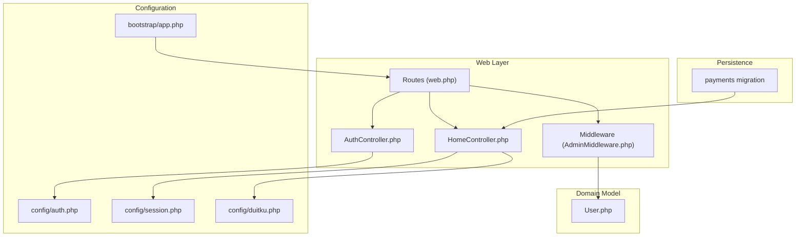
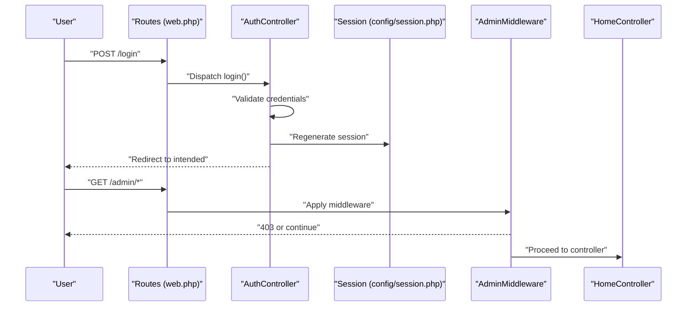
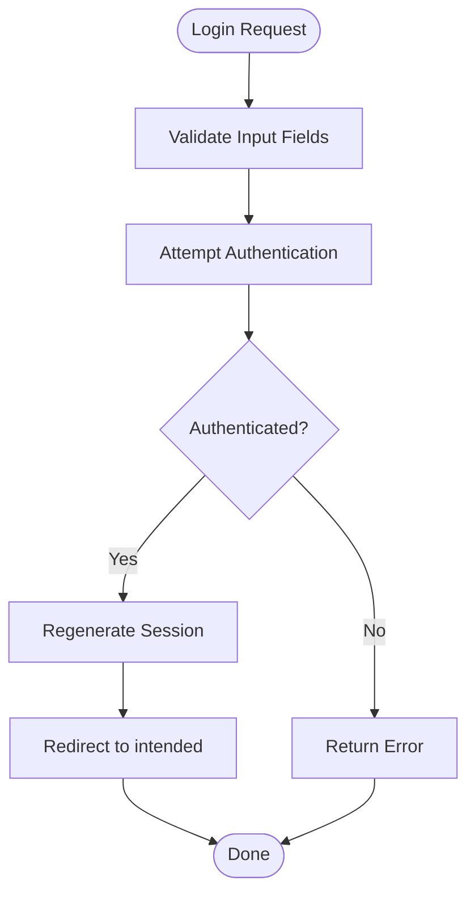
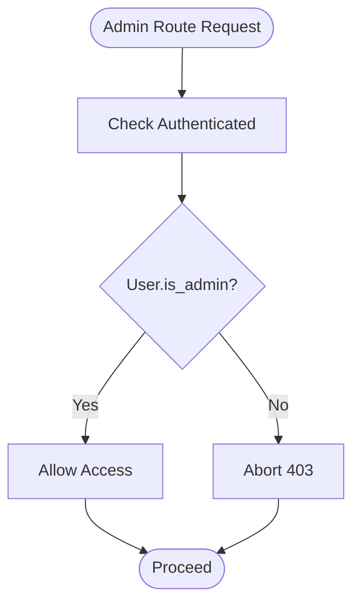
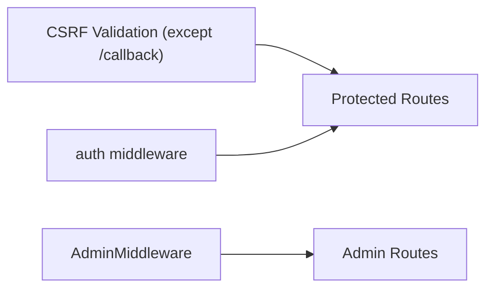
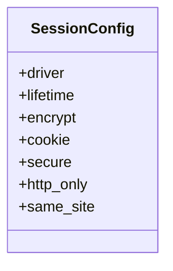
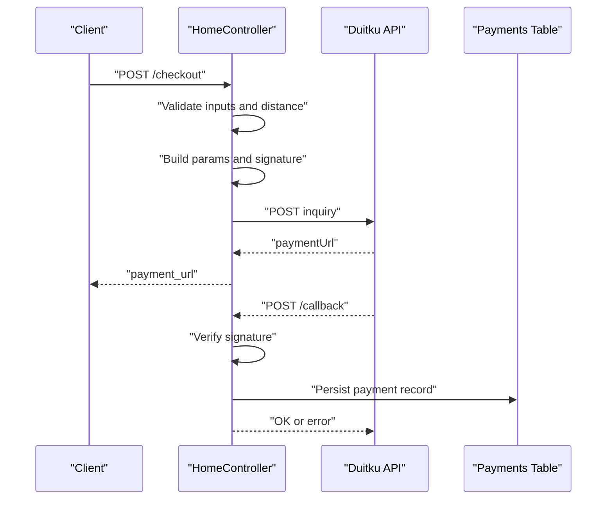
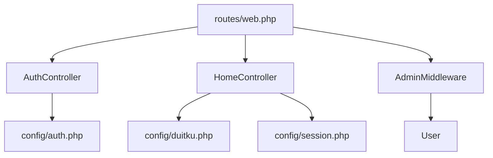

# Security Implementation

<cite>
**Referenced Files in This Document**
- [AdminMiddleware.php](file://app/Http/Middleware/AdminMiddleware.php)
- [AuthController.php](file://app/Http/Controllers/AuthController.php)
- [HomeController.php](file://app/Http/Controllers/HomeController.php)
- [web.php](file://routes/web.php)
- [auth.php](file://config/auth.php)
- [session.php](file://config/session.php)
- [User.php](file://app/Models/User.php)
- [app.php](file://bootstrap/app.php)
- [duitku.php](file://config/duitku.php)
- [2026_05_15_072246_create_payments_table.php](file://database/migrations/2026_05_15_072246_create_payments_table.php)
</cite>

## Table of Contents
1. [Introduction](#introduction)
2. [Project Structure](#project-structure)
3. [Core Components](#core-components)
4. [Architecture Overview](#architecture-overview)
5. [Detailed Component Analysis](#detailed-component-analysis)
6. [Dependency Analysis](#dependency-analysis)
7. [Performance Considerations](#performance-considerations)
8. [Troubleshooting Guide](#troubleshooting-guide)
9. [Conclusion](#conclusion)
10. [Appendices](#appendices)

## Introduction
This document details the security implementation and best practices in the Kantin Ibu Ida system. It covers authentication and authorization, session security, CSRF protection, input validation, role-based access control, payment security, and operational security practices such as audits, penetration testing, and incident response.

## Project Structure
Security-relevant components are organized across controllers, middleware, configuration, models, routes, and migrations:
- Authentication and authorization logic in controllers and middleware
- Session and CSRF configuration in dedicated config files
- Role-based access control enforced via middleware and route groups
- Payment security handled in the home controller and configured via environment variables
- Database schema supporting payments and related constraints

**Diagram sources**
- [web.php:1-71](file://routes/web.php#L1-L71)
- [AdminMiddleware.php:1-26](file://app/Http/Middleware/AdminMiddleware.php#L1-L26)
- [AuthController.php:1-78](file://app/Http/Controllers/AuthController.php#L1-L78)
- [HomeController.php:1-568](file://app/Http/Controllers/HomeController.php#L1-L568)
- [auth.php:1-116](file://config/auth.php#L1-L116)
- [session.php:1-219](file://config/session.php#L1-L219)
- [app.php:16-20](file://bootstrap/app.php#L16-L20)
- [duitku.php:1-12](file://config/duitku.php#L1-L12)
- [User.php:1-55](file://app/Models/User.php#L1-L55)
- [2026_05_15_072246_create_payments_table.php:1-32](file://database/migrations/2026_05_15_072246_create_payments_table.php#L1-L32)

**Section sources**
- [web.php:1-71](file://routes/web.php#L1-L71)
- [auth.php:1-116](file://config/auth.php#L1-L116)
- [session.php:1-219](file://config/session.php#L1-L219)
- [app.php:16-20](file://bootstrap/app.php#L16-L20)

## Core Components
- Authentication and Authorization
  - Login and registration with credential validation and secure password hashing
  - Session regeneration after successful login
  - Logout with session invalidation and CSRF token regeneration
  - Role-based access control using an admin flag and middleware enforcement
- Session Security
  - Centralized session configuration for driver, lifetime, encryption, cookie attributes, and SameSite policy
  - CSRF token validation with exceptions for payment callbacks
- Input Validation
  - Strict validation rules for login, registration, cart updates, checkout, and geolocation inputs
- Payment Security
  - API key and merchant code managed via environment variables
  - Signature verification for payment callbacks
  - Controlled exposure of sensitive data and endpoint selection by environment

**Section sources**
- [AuthController.php:17-76](file://app/Http/Controllers/AuthController.php#L17-L76)
- [User.php:42-48](file://app/Models/User.php#L42-L48)
- [session.php:21-218](file://config/session.php#L21-L218)
- [app.php:16-20](file://bootstrap/app.php#L16-L20)
- [HomeController.php:57-321](file://app/Http/Controllers/HomeController.php#L57-L321)
- [web.php:33-70](file://routes/web.php#L33-L70)

## Architecture Overview
The system enforces authentication at the route level and augments it with middleware for admin-only access. Payment flows are isolated and secured with environment-driven configuration and signature verification.

**Diagram sources**
- [web.php:27-31](file://routes/web.php#L27-L31)
- [web.php:52-70](file://routes/web.php#L52-L70)
- [AuthController.php:17-44](file://app/Http/Controllers/AuthController.php#L17-L44)
- [AdminMiddleware.php:17-24](file://app/Http/Middleware/AdminMiddleware.php#L17-L24)
- [session.php:35-50](file://config/session.php#L35-L50)

## Detailed Component Analysis

### Authentication Mechanisms
- Credential validation ensures presence of email and password during login; registration validates name, email uniqueness, and password strength.
- Secure password hashing is applied during registration and optional password updates.
- Session lifecycle includes regeneration after login and invalidation on logout with CSRF token regeneration.

**Diagram sources**
- [AuthController.php:19-43](file://app/Http/Controllers/AuthController.php#L19-L43)
- [AuthController.php:31-39](file://app/Http/Controllers/AuthController.php#L31-L39)

**Section sources**
- [AuthController.php:17-76](file://app/Http/Controllers/AuthController.php#L17-L76)
- [User.php:42-48](file://app/Models/User.php#L42-L48)

### Authorization Controls and Access Management
- Admin-only routes are grouped under a middleware that checks authentication and the admin flag.
- Non-admin users are redirected appropriately after login.
- Invoice access is restricted to owners or admins.

**Diagram sources**
- [web.php:52-70](file://routes/web.php#L52-L70)
- [AdminMiddleware.php:17-21](file://app/Http/Middleware/AdminMiddleware.php#L17-L21)

**Section sources**
- [web.php:52-70](file://routes/web.php#L52-L70)
- [AdminMiddleware.php:17-24](file://app/Http/Middleware/AdminMiddleware.php#L17-L24)
- [HomeController.php:459-468](file://app/Http/Controllers/HomeController.php#L459-L468)

### Middleware Implementation for Route Protection
- Global CSRF validation is enabled with an exception for the payment callback endpoint.
- Authentication middleware protects user-centric routes such as profile, cart, checkout, and orders.

**Diagram sources**
- [app.php:16-20](file://bootstrap/app.php#L16-L20)
- [web.php:33-48](file://routes/web.php#L33-L48)
- [web.php:52-70](file://routes/web.php#L52-L70)

**Section sources**
- [app.php:16-20](file://bootstrap/app.php#L16-L20)
- [web.php:33-48](file://routes/web.php#L33-L48)
- [web.php:52-70](file://routes/web.php#L52-L70)

### Session Security Measures
- Session lifetime and cookie policies are centrally configured, including secure, httpOnly, and SameSite attributes.
- Session encryption can be toggled via configuration.
- Session driver is configurable and defaults to database storage.

**Diagram sources**
- [session.php:21-218](file://config/session.php#L21-L218)

**Section sources**
- [session.php:21-218](file://config/session.php#L21-L218)

### CSRF Protection
- CSRF tokens are validated globally except for the payment callback endpoint, preventing unauthorized mutations while allowing third-party payment notifications.

**Section sources**
- [app.php:16-20](file://bootstrap/app.php#L16-L20)
- [web.php:50](file://routes/web.php#L50)

### Password Hashing Strategies
- Passwords are hashed during registration and optional profile password updates.
- The User model applies a hashed cast for the password field, ensuring consistent handling.

**Section sources**
- [AuthController.php:59-67](file://app/Http/Controllers/AuthController.php#L59-L67)
- [AuthController.php:48-51](file://app/Http/Controllers/AuthController.php#L48-L51)
- [User.php:42-48](file://app/Models/User.php#L42-L48)

### Secure Session Management
- After login, the session is regenerated to prevent fixation.
- On logout, the session is invalidated and a new CSRF token is generated.

**Section sources**
- [AuthController.php:31-39](file://app/Http/Controllers/AuthController.php#L31-L39)
- [AuthController.php:70-76](file://app/Http/Controllers/AuthController.php#L70-L76)

### Input Validation Approaches
- Comprehensive validation for login, registration, cart operations, checkout, and geolocation inputs.
- Stock availability checks and quantity adjustments prevent overconsumption of inventory.
- Distance and delivery range validation ensure orders fall within allowed limits.

**Section sources**
- [AuthController.php:19-22](file://app/Http/Controllers/AuthController.php#L19-L22)
- [AuthController.php:53-57](file://app/Http/Controllers/AuthController.php#L53-L57)
- [HomeController.php:57-114](file://app/Http/Controllers/HomeController.php#L57-L114)
- [HomeController.php:127-190](file://app/Http/Controllers/HomeController.php#L127-L190)
- [HomeController.php:275-321](file://app/Http/Controllers/HomeController.php#L275-L321)

### Role-Based Access Control and Permission Systems
- Users have an admin flag; middleware enforces admin-only access to administrative routes.
- Ownership checks restrict invoice viewing to the order owner or administrators.

**Section sources**
- [User.php:19-25](file://app/Models/User.php#L19-L25)
- [AdminMiddleware.php:17-21](file://app/Http/Middleware/AdminMiddleware.php#L17-L21)
- [HomeController.php:459-468](file://app/Http/Controllers/HomeController.php#L459-L468)

### Payment Security Considerations
- API key and merchant code are loaded from environment variables and used to construct signatures.
- Signature verification compares calculated MD5 signatures against received values.
- Endpoint selection switches between sandbox and production based on environment.
- Payment records are persisted with amounts, methods, and statuses for auditability.

**Diagram sources**
- [HomeController.php:275-408](file://app/Http/Controllers/HomeController.php#L275-L408)
- [HomeController.php:410-452](file://app/Http/Controllers/HomeController.php#L410-L452)
- [duitku.php:1-12](file://config/duitku.php#L1-L12)
- [2026_05_15_072246_create_payments_table.php:14-21](file://database/migrations/2026_05_15_072246_create_payments_table.php#L14-L21)

**Section sources**
- [HomeController.php:343-381](file://app/Http/Controllers/HomeController.php#L343-L381)
- [HomeController.php:410-452](file://app/Http/Controllers/HomeController.php#L410-L452)
- [HomeController.php:552-557](file://app/Http/Controllers/HomeController.php#L552-L557)
- [2026_05_15_072246_create_payments_table.php:14-21](file://database/migrations/2026_05_15_072246_create_payments_table.php#L14-L21)

## Dependency Analysis
- Controllers depend on configuration for session behavior, authentication guards, and payment endpoints.
- Middleware depends on authentication state and user roles.
- Routes group endpoints by protection needs and attach appropriate middleware.

**Diagram sources**
- [AuthController.php:1-78](file://app/Http/Controllers/AuthController.php#L1-L78)
- [HomeController.php:1-568](file://app/Http/Controllers/HomeController.php#L1-L568)
- [User.php:1-55](file://app/Models/User.php#L1-L55)
- [web.php:1-71](file://routes/web.php#L1-L71)
- [auth.php:1-116](file://config/auth.php#L1-L116)
- [session.php:1-219](file://config/session.php#L1-L219)
- [duitku.php:1-12](file://config/duitku.php#L1-L12)

**Section sources**
- [web.php:1-71](file://routes/web.php#L1-L71)
- [auth.php:1-116](file://config/auth.php#L1-L116)
- [session.php:1-219](file://config/session.php#L1-L219)
- [User.php:1-55](file://app/Models/User.php#L1-L55)

## Performance Considerations
- Session driver selection impacts scalability; database-backed sessions are durable but require indexing and maintenance.
- CSRF validation overhead is minimal and essential for security; exceptions should be limited to trusted endpoints.
- Payment API calls should use timeouts and retries judiciously to avoid blocking requests.

## Troubleshooting Guide
- Authentication failures
  - Verify credential validation rules and that the user exists with the correct password hash.
  - Confirm session regeneration occurs after login and that cookies reflect secure and SameSite settings.
- Authorization errors
  - Ensure the admin middleware is attached to admin routes and that the user’s admin flag is set.
  - Check ownership checks for invoices and order actions.
- Payment issues
  - Confirm merchant code and API key are present in configuration and environment.
  - Validate signature calculation and endpoint selection based on environment.
  - Inspect payment records for amounts, methods, and statuses to support reconciliation.
- Session and CSRF problems
  - Review session lifetime, secure flags, and SameSite policy.
  - Verify CSRF exceptions are only granted to callback endpoints.

**Section sources**
- [AuthController.php:17-76](file://app/Http/Controllers/AuthController.php#L17-L76)
- [web.php:52-70](file://routes/web.php#L52-L70)
- [HomeController.php:316-321](file://app/Http/Controllers/HomeController.php#L316-L321)
- [HomeController.php:410-452](file://app/Http/Controllers/HomeController.php#L410-L452)
- [session.php:131-203](file://config/session.php#L131-L203)
- [app.php:16-20](file://bootstrap/app.php#L16-L20)

## Conclusion
The Kantin Ibu Ida system implements layered security through robust authentication, strict input validation, centralized session configuration, targeted middleware enforcement, and secure payment handling with signature verification. Adhering to the recommended best practices and operational guidelines will further strengthen resilience against common threats.

## Appendices
- Security Audit Guidelines
  - Review authentication flows for proper validation and error handling.
  - Validate session configuration for secure, httpOnly, and SameSite attributes.
  - Confirm middleware coverage for all sensitive routes.
  - Audit payment endpoints for signature verification and environment-driven configuration.
- Penetration Testing Recommendations
  - Test CSRF protections and verify exceptions are limited to trusted endpoints.
  - Probe authentication bypass attempts and validate rate-limiting for login attempts.
  - Assess payment callback handlers for tampering and replay attacks.
- Incident Response Procedures
  - Immediately rotate API keys and invalidate compromised sessions upon detection.
  - Monitor payment callbacks for signature mismatches and investigate anomalies.
  - Maintain logs for authentication events, payment transactions, and access denials.