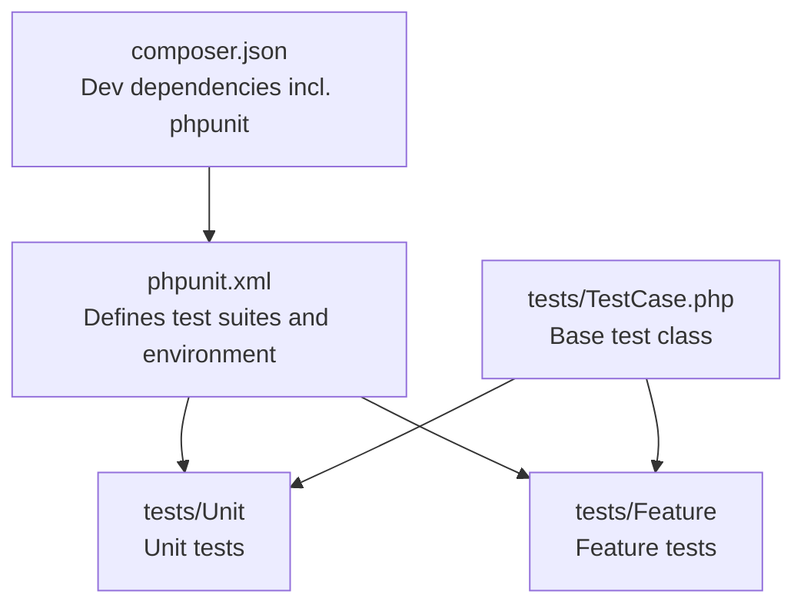
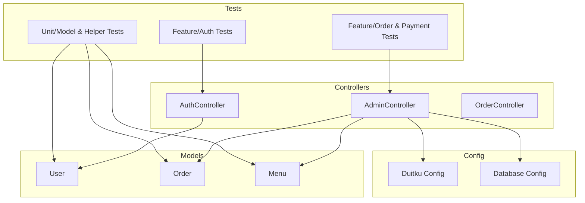
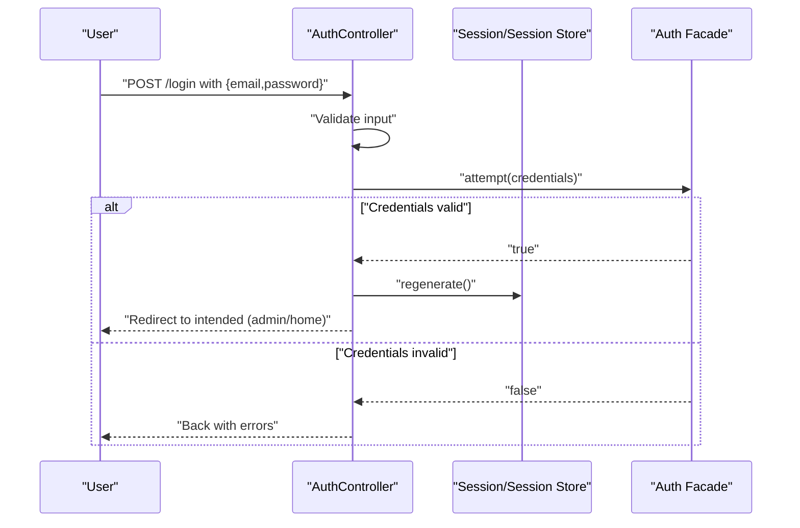
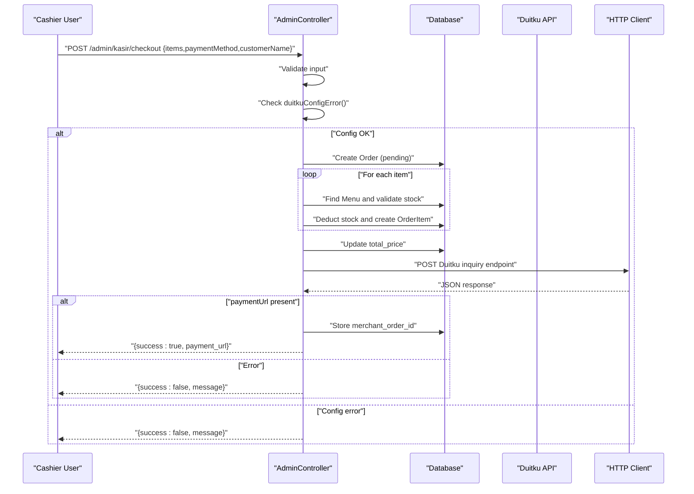
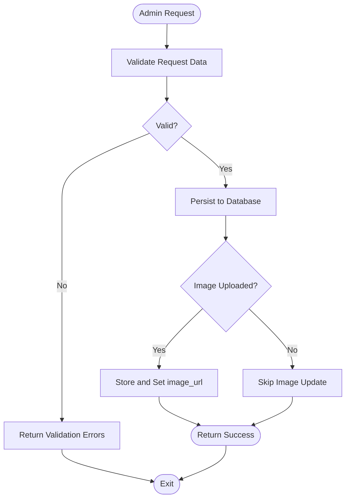
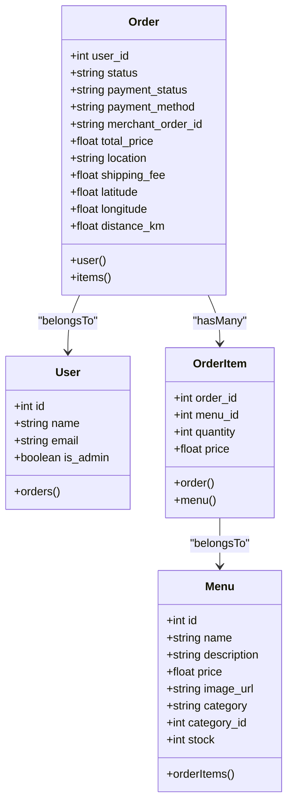
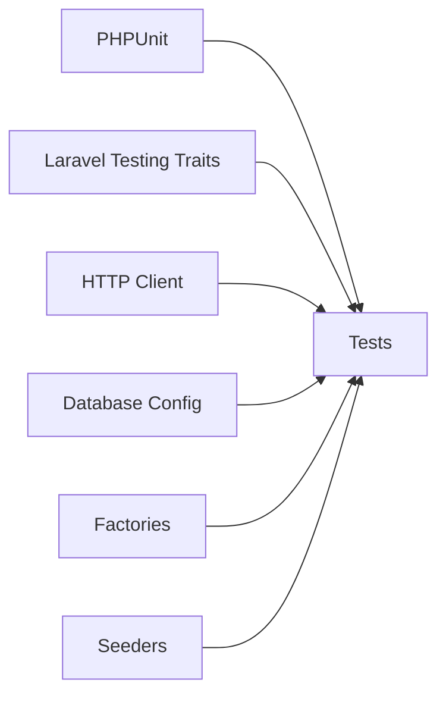

# Testing Strategy

<cite>
**Referenced Files in This Document**
- [phpunit.xml](file://phpunit.xml)
- [composer.json](file://composer.json)
- [tests/TestCase.php](file://tests/TestCase.php)
- [tests/Feature/ExampleTest.php](file://tests/Feature/ExampleTest.php)
- [tests/Unit/ExampleTest.php](file://tests/Unit/ExampleTest.php)
- [app/Http/Controllers/AuthController.php](file://app/Http/Controllers/AuthController.php)
- [app/Http/Controllers/AdminController.php](file://app/Http/Controllers/AdminController.php)
- [app/Http/Controllers/OrderController.php](file://app/Http/Controllers/OrderController.php)
- [app/Models/User.php](file://app/Models/User.php)
- [app/Models/Order.php](file://app/Models/Order.php)
- [app/Models/Menu.php](file://app/Models/Menu.php)
- [config/duitku.php](file://config/duitku.php)
- [config/database.php](file://config/database.php)
- [database/factories/UserFactory.php](file://database/factories/UserFactory.php)
- [database/seeders/DatabaseSeeder.php](file://database/seeders/DatabaseSeeder.php)
</cite>

## Table of Contents
1. [Introduction](#introduction)
2. [Project Structure](#project-structure)
3. [Core Components](#core-components)
4. [Architecture Overview](#architecture-overview)
5. [Detailed Component Analysis](#detailed-component-analysis)
6. [Dependency Analysis](#dependency-analysis)
7. [Performance Considerations](#performance-considerations)
8. [Troubleshooting Guide](#troubleshooting-guide)
9. [Conclusion](#conclusion)
10. [Appendices](#appendices)

## Introduction
This document outlines the testing methodology and quality assurance strategy for the Kantin Ibu Ida system. It covers unit testing, feature testing, and integration testing approaches tailored to the Laravel application’s controllers, models, configuration, and e-commerce workflows. It documents PHPUnit configuration, test case organization, best practices, and practical examples for user authentication, payment processing via Duitku, admin operations, and order management. Guidance is included for mocking external services, managing test data, continuous integration readiness, and performance testing.

## Project Structure
The testing setup follows Laravel conventions:
- Unit tests live under tests/Unit
- Feature tests live under tests/Feature
- A shared base TestCase extends Laravel’s base test case
- PHPUnit configuration defines test suites, environment overrides for testing, and source inclusion

**Diagram sources**
- [phpunit.xml:1-34](file://phpunit.xml#L1-L34)
- [tests/TestCase.php:1-11](file://tests/TestCase.php#L1-L11)
- [composer.json:12-19](file://composer.json#L12-L19)

**Section sources**
- [phpunit.xml:1-34](file://phpunit.xml#L1-L34)
- [tests/TestCase.php:1-11](file://tests/TestCase.php#L1-L11)
- [composer.json:12-19](file://composer.json#L12-L19)

## Core Components
- PHPUnit configuration
  - Test suites: Unit and Feature
  - Environment overrides for testing (cache, session, queue, mail, telescope, pulse)
  - Source include path for coverage
- Base test case
  - Extends Laravel’s base test case to enable HTTP, database, and session helpers
- Example tests
  - Feature example validates a successful response from the homepage
  - Unit example demonstrates a trivial assertion

Recommended improvements:
- Enable database refresh per test suite using Laravel’s RefreshDatabase trait
- Add a dedicated Integration suite for controller and service-level interactions
- Configure SQLite in-memory database for faster integration tests

**Section sources**
- [phpunit.xml:7-19](file://phpunit.xml#L7-L19)
- [phpunit.xml:20-32](file://phpunit.xml#L20-L32)
- [tests/TestCase.php:1-11](file://tests/TestCase.php#L1-L11)
- [tests/Feature/ExampleTest.php:1-20](file://tests/Feature/ExampleTest.php#L1-L20)
- [tests/Unit/ExampleTest.php:1-17](file://tests/Unit/ExampleTest.php#L1-L17)

## Architecture Overview
The testing architecture aligns with Laravel’s MVC and configuration-driven design. Controllers orchestrate requests, models encapsulate persistence, and configuration files (e.g., Duitku) govern third-party integrations. Tests target these layers to validate behavior, data integrity, and external service interactions.

**Diagram sources**
- [app/Http/Controllers/AuthController.php:1-78](file://app/Http/Controllers/AuthController.php#L1-L78)
- [app/Http/Controllers/AdminController.php:1-257](file://app/Http/Controllers/AdminController.php#L1-L257)
- [app/Http/Controllers/OrderController.php:1-11](file://app/Http/Controllers/OrderController.php#L1-L11)
- [app/Models/User.php:1-55](file://app/Models/User.php#L1-L55)
- [app/Models/Order.php:1-36](file://app/Models/Order.php#L1-L36)
- [app/Models/Menu.php:1-32](file://app/Models/Menu.php#L1-L32)
- [config/duitku.php:1-12](file://config/duitku.php#L1-L12)
- [config/database.php:1-171](file://config/database.php#L1-L171)

## Detailed Component Analysis

### Authentication Testing Strategy
Focus areas:
- Login validation and credential attempts
- Registration validation and hashing
- Logout and session invalidation
- Admin redirection logic

Recommended tests:
- Successful login with email and name-based credentials
- Validation failures for missing fields
- Authentication failure messages
- Registration with valid and invalid inputs
- Session lifecycle after logout

**Diagram sources**
- [app/Http/Controllers/AuthController.php:17-44](file://app/Http/Controllers/AuthController.php#L17-L44)

**Section sources**
- [app/Http/Controllers/AuthController.php:12-77](file://app/Http/Controllers/AuthController.php#L12-L77)

### Payment Processing Testing Strategy (Duitku Integration)
Focus areas:
- Merchant configuration validation
- Order creation and stock deduction
- Item assembly and total price calculation
- Duitku API call and response handling
- Error handling for network exceptions and invalid responses

Recommended tests:
- Missing merchant credentials return appropriate error
- Insufficient stock triggers item-specific error
- Successful checkout returns payment URL
- Network exception handled gracefully
- Payment method selection validated

**Diagram sources**
- [app/Http/Controllers/AdminController.php:129-246](file://app/Http/Controllers/AdminController.php#L129-L246)
- [config/duitku.php:1-12](file://config/duitku.php#L1-L12)

**Section sources**
- [app/Http/Controllers/AdminController.php:129-256](file://app/Http/Controllers/AdminController.php#L129-L256)
- [config/duitku.php:1-12](file://config/duitku.php#L1-L12)

### Admin Functionality Testing Strategy
Focus areas:
- Dashboard analytics (orders, revenue, users)
- Menu CRUD operations (validation, image upload, persistence)
- User management (toggle admin role, deletion)
- Order management (status updates, auto-completion logic)

Recommended tests:
- Dashboard aggregates computed correctly
- Menu creation validates inputs and persists image URL
- Menu update modifies stock and image when provided
- Order status transitions and auto-completion after threshold
- User admin flag toggled and deleted successfully

**Diagram sources**
- [app/Http/Controllers/AdminController.php:27-75](file://app/Http/Controllers/AdminController.php#L27-L75)

**Section sources**
- [app/Http/Controllers/AdminController.php:12-121](file://app/Http/Controllers/AdminController.php#L12-L121)

### Order Management Testing Strategy
Focus areas:
- Order creation from cashier checkout
- Order-item linkage and pricing
- Total price aggregation
- Order retrieval with relations

Recommended tests:
- Order created with pending status and payment fields
- Order items created with correct quantities/prices
- Total price equals sum of items
- Retrieval includes user and items with menu details

**Diagram sources**
- [app/Models/Order.php:1-36](file://app/Models/Order.php#L1-L36)
- [app/Models/User.php:1-55](file://app/Models/User.php#L1-L55)
- [app/Models/Menu.php:1-32](file://app/Models/Menu.php#L1-L32)

**Section sources**
- [app/Http/Controllers/AdminController.php:146-178](file://app/Http/Controllers/AdminController.php#L146-L178)
- [app/Models/Order.php:12-35](file://app/Models/Order.php#L12-L35)
- [app/Models/User.php:50-53](file://app/Models/User.php#L50-L53)
- [app/Models/Menu.php:27-30](file://app/Models/Menu.php#L27-L30)

### Test Case Organization and Best Practices
- Unit tests
  - Target pure functions, model behaviors, and small units
  - Use factories for deterministic data
- Feature tests
  - Simulate HTTP requests and validate responses
  - Use database transactions or refresh per test
- Integration tests
  - Validate controller-to-model interactions and external service calls
  - Mock third-party APIs (e.g., Duitku) to avoid flakiness

Best practices:
- Keep tests isolated and deterministic
- Use factories and seeders for test data
- Mock external services and time-dependent logic
- Assert both success paths and error conditions
- Prefer descriptive test names and clear assertions

**Section sources**
- [tests/Feature/ExampleTest.php:13-18](file://tests/Feature/ExampleTest.php#L13-L18)
- [tests/Unit/ExampleTest.php:12-15](file://tests/Unit/ExampleTest.php#L12-L15)
- [database/factories/UserFactory.php:24-32](file://database/factories/UserFactory.php#L24-L32)
- [database/seeders/DatabaseSeeder.php:18-141](file://database/seeders/DatabaseSeeder.php#L18-L141)

### Testing External Services (Duitku)
Approach:
- Mock HTTP client responses to simulate success and failure scenarios
- Verify signature generation and payload construction
- Validate error propagation for missing configuration or API failures

Guidelines:
- Use Laravel’s HTTP testing helpers or Mockery to stub external calls
- Parameterize endpoints by environment (sandbox vs production)
- Assert JSON responses and HTTP status codes returned by controllers

**Section sources**
- [app/Http/Controllers/AdminController.php:180-246](file://app/Http/Controllers/AdminController.php#L180-L246)
- [config/duitku.php:1-12](file://config/duitku.php#L1-L12)

### Testing Database Interactions
Approach:
- Use database transactions or refresh database per test
- Leverage factories and seeders for realistic datasets
- Validate model relationships and aggregations

Guidelines:
- Seed initial data for admin, users, categories, and menus
- Assert counts, sums, and relations in feature tests
- Use model factories for controlled test data

**Section sources**
- [config/database.php:34-40](file://config/database.php#L34-L40)
- [database/factories/UserFactory.php:24-32](file://database/factories/UserFactory.php#L24-L32)
- [database/seeders/DatabaseSeeder.php:18-141](file://database/seeders/DatabaseSeeder.php#L18-L141)

### Continuous Integration and Automated Pipelines
Recommendations:
- Run phpunit with coverage reporting
- Use environment variables for DUITKU credentials (masked in CI)
- Cache Composer dependencies and optimize autoloaders
- Parallelize tests where safe (avoid shared state)

CI checklist:
- Install dependencies
- Prepare database (migrate and seed)
- Execute phpunit suites
- Collect coverage and artifacts

**Section sources**
- [phpunit.xml:20-32](file://phpunit.xml#L20-L32)
- [composer.json:33-49](file://composer.json#L33-L49)

### Quality Metrics and Reporting
- Code coverage thresholds for critical paths (controllers, models, payment logic)
- Fail builds on coverage drops beyond acceptable limits
- Track flaky tests and external service timeouts separately

[No sources needed since this section provides general guidance]

## Dependency Analysis
Key dependencies for testing:
- PHPUnit and Laravel testing traits
- HTTP client for external API simulation
- Database configuration for in-memory or separate test databases
- Factories and seeders for deterministic data

**Diagram sources**
- [composer.json:12-19](file://composer.json#L12-L19)
- [phpunit.xml:20-32](file://phpunit.xml#L20-L32)
- [config/database.php:34-40](file://config/database.php#L34-L40)
- [database/factories/UserFactory.php:24-32](file://database/factories/UserFactory.php#L24-L32)
- [database/seeders/DatabaseSeeder.php:18-141](file://database/seeders/DatabaseSeeder.php#L18-L141)

**Section sources**
- [composer.json:12-19](file://composer.json#L12-L19)
- [phpunit.xml:20-32](file://phpunit.xml#L20-L32)
- [config/database.php:34-40](file://config/database.php#L34-L40)
- [database/factories/UserFactory.php:24-32](file://database/factories/UserFactory.php#L24-L32)
- [database/seeders/DatabaseSeeder.php:18-141](file://database/seeders/DatabaseSeeder.php#L18-L141)

## Performance Considerations
- Use SQLite in-memory database for faster integration tests
- Minimize external API calls; mock where possible
- Batch database operations in tests to reduce overhead
- Profile slow tests and refactor heavy fixtures

[No sources needed since this section provides general guidance]

## Troubleshooting Guide
Common issues and resolutions:
- Authentication failures
  - Validate input fields and credential formats
  - Confirm hashed passwords and session regeneration
- Payment processing errors
  - Check Duitku configuration keys and environment
  - Mock API responses to reproduce and verify error handling
- Database inconsistencies
  - Use transactions or refresh database per test
  - Verify foreign key constraints and model fillable attributes
- External service flakiness
  - Stub HTTP client responses
  - Add retry logic or circuit breaker in production; assert timeouts in tests

**Section sources**
- [app/Http/Controllers/AuthController.php:17-44](file://app/Http/Controllers/AuthController.php#L17-L44)
- [app/Http/Controllers/AdminController.php:248-255](file://app/Http/Controllers/AdminController.php#L248-L255)
- [config/duitku.php:1-12](file://config/duitku.php#L1-L12)

## Conclusion
The Kantin Ibu Ida testing strategy emphasizes layered validation across unit, feature, and integration domains. By leveraging Laravel’s testing facilities, factories, and seeders, and by carefully mocking external services, the system can achieve reliable, maintainable, and fast tests. Prioritizing authentication, payment processing, and admin workflows ensures robust coverage of e-commerce functionality while maintaining high-quality standards.

## Appendices

### Example Test Scenarios Index
- Authentication
  - Successful login with email and name-based credentials
  - Validation errors for missing inputs
  - Authentication failure messaging
  - Registration with valid and invalid inputs
  - Logout and session invalidation
- Payment Processing
  - Checkout with insufficient stock
  - Checkout with valid items and payment method
  - Duitku configuration validation
  - Network exception handling
- Admin Functionality
  - Dashboard analytics computation
  - Menu CRUD with image upload
  - User admin toggle and deletion
  - Order status updates and auto-completion
- Order Management
  - Order creation and item linkage
  - Total price aggregation
  - Retrieval with relations

[No sources needed since this section indexes scenarios conceptually]