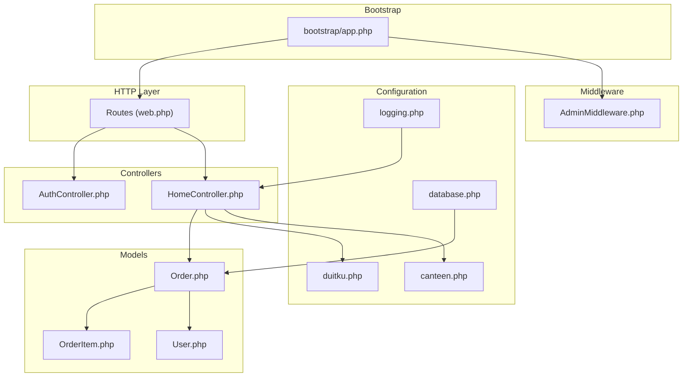
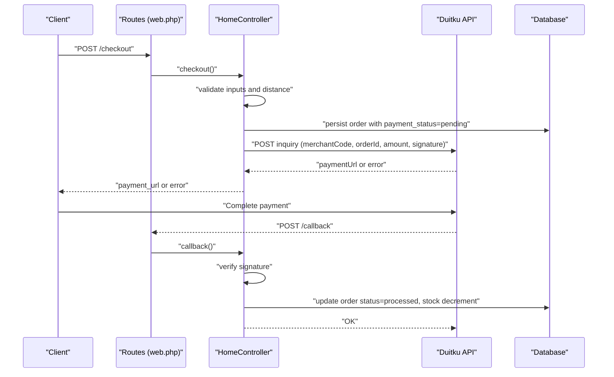
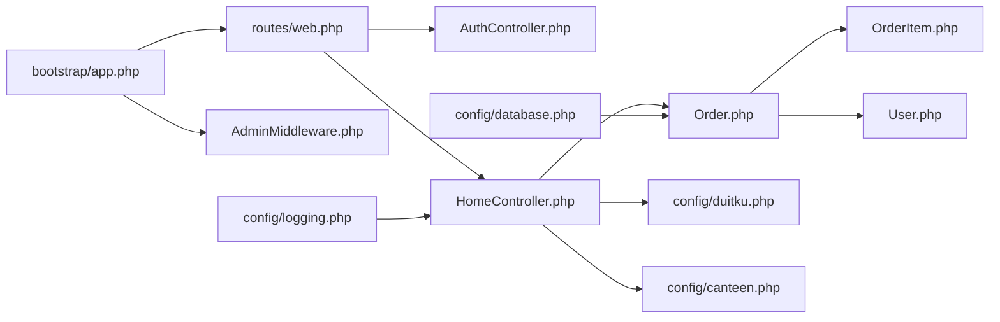

# Troubleshooting & FAQ

<cite>
**Referenced Files in This Document**
- [AuthController.php](file://app/Http/Controllers/AuthController.php)
- [HomeController.php](file://app/Http/Controllers/HomeController.php)
- [web.php](file://routes/web.php)
- [database.php](file://config/database.php)
- [logging.php](file://config/logging.php)
- [duitku.php](file://config/duitku.php)
- [canteen.php](file://config/canteen.php)
- [AdminMiddleware.php](file://app/Http/Middleware/AdminMiddleware.php)
- [app.php](file://bootstrap/app.php)
- [composer.json](file://composer.json)
- [Order.php](file://app/Models/Order.php)
- [OrderItem.php](file://app/Models/OrderItem.php)
- [User.php](file://app/Models/User.php)
- [2026_05_15_072246_create_payments_table.php](file://database/migrations/2026_05_15_072246_create_payments_table.php)
- [2026_05_24_000000_add_payment_fields_to_orders_table.php](file://database/migrations/2026_05_24_000000_add_payment_fields_to_orders_table.php)
</cite>

## Table of Contents
1. [Introduction](#introduction)
2. [Project Structure](#project-structure)
3. [Core Components](#core-components)
4. [Architecture Overview](#architecture-overview)
5. [Detailed Component Analysis](#detailed-component-analysis)
6. [Dependency Analysis](#dependency-analysis)
7. [Performance Considerations](#performance-considerations)
8. [Troubleshooting Guide](#troubleshooting-guide)
9. [Conclusion](#conclusion)
10. [Appendices](#appendices)

## Introduction
This section provides a comprehensive troubleshooting and FAQ guide for the Kantin Ibu Ida system. It focuses on diagnosing and resolving common issues such as payment processing problems, order status synchronization, authentication failures, and performance issues. It also covers debugging techniques, log analysis, payment gateway integration diagnostics, location service failures, and database connectivity issues. Finally, it includes frequently asked questions, preventive measures, monitoring approaches, and escalation procedures for critical issues.

## Project Structure
The system follows a standard Laravel MVC structure with controllers, models, routes, configuration, and middleware. Key areas relevant to troubleshooting include:
- Controllers for authentication and checkout/payment flows
- Routes defining endpoints for payment callbacks and checkout
- Configuration files for payment gateway, database, logging, and canteen parameters
- Middleware enforcing admin access
- Models representing orders, order items, and users

**Diagram sources**
- [web.php:1-71](file://routes/web.php#L1-L71)
- [AuthController.php:10-78](file://app/Http/Controllers/AuthController.php#L10-L78)
- [HomeController.php:12-568](file://app/Http/Controllers/HomeController.php#L12-L568)
- [Order.php:8-36](file://app/Models/Order.php#L8-L36)
- [OrderItem.php:8-29](file://app/Models/OrderItem.php#L8-L29)
- [User.php:10-55](file://app/Models/User.php#L10-L55)
- [database.php:32-112](file://config/database.php#L32-L112)
- [logging.php:53-131](file://config/logging.php#L53-L131)
- [duitku.php:3-11](file://config/duitku.php#L3-L11)
- [canteen.php:3-9](file://config/canteen.php#L3-L9)
- [AdminMiddleware.php:10-26](file://app/Http/Middleware/AdminMiddleware.php#L10-L26)
- [app.php:10-24](file://bootstrap/app.php#L10-L24)

**Section sources**
- [web.php:1-71](file://routes/web.php#L1-L71)
- [composer.json:1-75](file://composer.json#L1-L75)

## Core Components
- Authentication controller handles login, registration, and logout with credential validation and session regeneration.
- Home controller orchestrates cart operations, checkout, payment initiation via Duitku, callback verification, and order status updates.
- Routes define endpoints for checkout, payment success, and payment callback.
- Configuration files set payment gateway parameters, database connections, logging channels, and canteen operational limits.
- Middleware restricts admin routes to administrators only.
- Models encapsulate order lifecycle, itemization, and user associations.

**Section sources**
- [AuthController.php:10-78](file://app/Http/Controllers/AuthController.php#L10-L78)
- [HomeController.php:12-568](file://app/Http/Controllers/HomeController.php#L12-L568)
- [web.php:27-50](file://routes/web.php#L27-L50)
- [Order.php:8-36](file://app/Models/Order.php#L8-L36)
- [OrderItem.php:8-29](file://app/Models/OrderItem.php#L8-L29)
- [User.php:10-55](file://app/Models/User.php#L10-L55)
- [AdminMiddleware.php:10-26](file://app/Http/Middleware/AdminMiddleware.php#L10-L26)

## Architecture Overview
The payment flow integrates local checkout with external payment processing and callback verification. The checkout endpoint validates delivery range and shipping fee, constructs a Duitku request, and redirects to a payment URL. The callback endpoint verifies signatures and updates order status accordingly.

**Diagram sources**
- [web.php:43-50](file://routes/web.php#L43-L50)
- [HomeController.php:275-408](file://app/Http/Controllers/HomeController.php#L275-L408)
- [HomeController.php:410-452](file://app/Http/Controllers/HomeController.php#L410-L452)
- [Order.php:12-24](file://app/Models/Order.php#L12-L24)

## Detailed Component Analysis

### Authentication Failures
Common symptoms:
- Login fails with invalid credentials message
- Registration validation errors
- Session regeneration issues after login

Root causes and resolutions:
- Incorrect email or password format: Ensure the login type detection matches stored user credentials. Validate presence of required fields before attempting authentication.
- Duplicate email during registration: Confirm uniqueness constraint and adjust input validation.
- CSRF protection blocking callback: CSRF tokens are exempted for the callback endpoint, ensuring payment callbacks are not blocked.

Debugging steps:
- Verify credentials against the User model fillable attributes.
- Check session regeneration and intended redirection logic.
- Review CSRF exemptions for payment callback endpoint.

**Section sources**
- [AuthController.php:17-44](file://app/Http/Controllers/AuthController.php#L17-L44)
- [AuthController.php:51-68](file://app/Http/Controllers/AuthController.php#L51-L68)
- [AuthController.php:70-76](file://app/Http/Controllers/AuthController.php#L70-L76)
- [app.php:17-20](file://bootstrap/app.php#L17-L20)

### Payment Processing Problems
Symptoms:
- Checkout returns configuration error about missing merchant code or API key
- Payment initiation fails with generic error or debug data
- Callback signature mismatch leads to rejection
- Order remains pending despite successful payment

Root causes and resolutions:
- Missing Duitku configuration: Ensure merchant code and API key are set in environment variables and clear config cache.
- Signature mismatch: Verify MD5 signature calculation using the correct parameters and order.
- Distance out of range: Enforce canteen max delivery limit and prevent checkout beyond allowed radius.
- Stock decrement: Ensure stock is decremented only upon successful payment and valid distance.

Debugging steps:
- Validate configuration keys and environment variables.
- Inspect payment initiation payload and response structure.
- Verify callback signature calculation and result code handling.
- Trace order updates and stock adjustments.

**Section sources**
- [HomeController.php:316-321](file://app/Http/Controllers/HomeController.php#L316-L321)
- [HomeController.php:343-407](file://app/Http/Controllers/HomeController.php#L343-L407)
- [HomeController.php:410-452](file://app/Http/Controllers/HomeController.php#L410-L452)
- [HomeController.php:559-566](file://app/Http/Controllers/HomeController.php#L559-L566)
- [Order.php:12-24](file://app/Models/Order.php#L12-L24)

### Order Status Synchronization
Symptoms:
- Orders stuck in pending or inconsistent payment status
- Auto-completion not triggering after delivery arrival
- Stock not updated post-payment

Root causes and resolutions:
- Callback not invoked or signature invalid: Confirm callback URL configuration and signature verification logic.
- Distance threshold exceeded: Prevent order processing if delivery distance exceeds configured maximum.
- Auto-completion logic: Orders marked as “arrived” are auto-completed after 24 hours.

Debugging steps:
- Monitor callback endpoint logs and response codes.
- Validate order status transitions and timestamps.
- Confirm stock decrement occurs only for valid orders.

**Section sources**
- [HomeController.php:410-452](file://app/Http/Controllers/HomeController.php#L410-L452)
- [HomeController.php:477-486](file://app/Http/Controllers/HomeController.php#L477-L486)
- [Order.php:12-24](file://app/Models/Order.php#L12-L24)

### Location Service Failures
Symptoms:
- Delivery preview fails with geocoding errors
- Route calculation returns null
- Shipping fee not computed

Root causes and resolutions:
- External service timeouts or failures: Nominatim reverse geocoding and OSRM routing are called with timeouts and retries; failures return meaningful messages.
- Invalid coordinates: Validate lat/lng ranges before calling external APIs.
- Range checks: Ensure delivery distance does not exceed configured maximum.

Debugging steps:
- Inspect timeout and retry configurations for external services.
- Validate coordinate ranges and address details availability.
- Confirm route geometry and distance are present before computing fees.

**Section sources**
- [HomeController.php:127-190](file://app/Http/Controllers/HomeController.php#L127-L190)
- [HomeController.php:514-545](file://app/Http/Controllers/HomeController.php#L514-L545)
- [HomeController.php:547-550](file://app/Http/Controllers/HomeController.php#L547-L550)
- [canteen.php:3-9](file://config/canteen.php#L3-L9)

### Database Connectivity Issues
Symptoms:
- Application throws database connection errors
- Migrations fail or cache issues occur

Root causes and resolutions:
- Incorrect database credentials or driver configuration: Verify environment variables for host, port, database, username, and password.
- SSL/TLS settings: Ensure proper SSL CA configuration for MySQL/MariaDB when enabled.
- Redis configuration: Validate Redis client, host, port, and database indices.

Debugging steps:
- Confirm default connection and driver selection.
- Test connectivity using configured credentials.
- Clear configuration cache after environment changes.

**Section sources**
- [database.php:32-112](file://config/database.php#L32-L112)
- [database.php:141-167](file://config/database.php#L141-L167)

### Logging and Monitoring
Symptoms:
- No logs for payment callbacks or checkout errors
- Excessive or insufficient log verbosity

Root causes and resolutions:
- Default channel and level: Configure stack/single/daily channels and appropriate log levels.
- Slack/Papertrail integrations: Set webhook URLs and credentials for external log aggregation.
- Placeholders and processor usage: Ensure placeholders are replaced and processors are applied consistently.

Debugging steps:
- Adjust LOG_CHANNEL and LOG_LEVEL in environment variables.
- Tail logs and correlate with request IDs.
- Integrate with centralized logging for production environments.

**Section sources**
- [logging.php:21](file://config/logging.php#L21)
- [logging.php:53-131](file://config/logging.php#L53-L131)

## Dependency Analysis
Key dependencies and their roles:
- Routes depend on controllers for handling requests.
- Controllers depend on models for persistence and relationships.
- Controllers depend on configuration for payment gateway and canteen parameters.
- Middleware depends on authentication state for access control.
- Bootstrap configures CSRF exemptions and global middleware.

**Diagram sources**
- [web.php:1-71](file://routes/web.php#L1-L71)
- [AuthController.php:10-78](file://app/Http/Controllers/AuthController.php#L10-L78)
- [HomeController.php:12-568](file://app/Http/Controllers/HomeController.php#L12-L568)
- [Order.php:8-36](file://app/Models/Order.php#L8-L36)
- [OrderItem.php:8-29](file://app/Models/OrderItem.php#L8-L29)
- [User.php:10-55](file://app/Models/User.php#L10-L55)
- [duitku.php:3-11](file://config/duitku.php#L3-L11)
- [canteen.php:3-9](file://config/canteen.php#L3-L9)
- [AdminMiddleware.php:10-26](file://app/Http/Middleware/AdminMiddleware.php#L10-L26)
- [app.php:10-24](file://bootstrap/app.php#L10-L24)
- [database.php:32-112](file://config/database.php#L32-L112)
- [logging.php:53-131](file://config/logging.php#L53-L131)

**Section sources**
- [web.php:1-71](file://routes/web.php#L1-L71)
- [app.php:10-24](file://bootstrap/app.php#L10-L24)

## Performance Considerations
- External API calls: Nominatim and OSRM calls are timed out and retried; ensure network stability and consider caching results where appropriate.
- Database queries: Eager load relations (e.g., items.menu) to avoid N+1 queries.
- Logging overhead: Use daily rotation and appropriate levels to balance observability and performance.
- Payment gateway latency: Minimize payload size and avoid unnecessary fields to reduce response times.

[No sources needed since this section provides general guidance]

## Troubleshooting Guide

### Payment Gateway Integration (Duitku)
Common issues and resolutions:
- Configuration errors: Missing merchant code or API key cause immediate failure. Set environment variables and clear config cache.
- Signature mismatch: Ensure MD5 signature is calculated with merchantCode, merchantOrderId, amount, and API key in the exact order.
- Callback not received: Verify callback URL in Duitku settings matches the configured route and that CSRF is exempted for the callback endpoint.
- Amount mismatch: Avoid sending itemDetails to prevent price mismatches; the implementation intentionally excludes itemDetails.

Step-by-step:
1. Confirm DUITKU_MERCHANT_CODE and DUITKU_API_KEY are set and cleared from cache.
2. Validate signature generation logic in checkout and callback.
3. Check callback endpoint accessibility and CORS/SSL settings.
4. Review paymentUrl presence and error messages returned by Duitku.

**Section sources**
- [HomeController.php:316-321](file://app/Http/Controllers/HomeController.php#L316-L321)
- [HomeController.php:343-407](file://app/Http/Controllers/HomeController.php#L343-L407)
- [HomeController.php:410-452](file://app/Http/Controllers/HomeController.php#L410-L452)
- [app.php:17-20](file://bootstrap/app.php#L17-L20)

### Location Service Failures
Common issues and resolutions:
- Geocoding errors: Reverse geocoding may fail due to timeouts or invalid coordinates. Retry and provide fallback messages.
- Route calculation failures: OSRM route endpoint may be unreachable or return invalid data. Validate coordinates and check service availability.
- Range violations: If distance exceeds max delivery, block checkout and inform the user.

Step-by-step:
1. Validate lat/lng ranges and zoom parameters for geocoding.
2. Confirm OSRM endpoint reachability and response structure.
3. Enforce max delivery limit and compute shipping fee accordingly.

**Section sources**
- [HomeController.php:127-190](file://app/Http/Controllers/HomeController.php#L127-L190)
- [HomeController.php:514-545](file://app/Http/Controllers/HomeController.php#L514-L545)
- [canteen.php:3-9](file://config/canteen.php#L3-L9)

### Database Connectivity Issues
Common issues and resolutions:
- Wrong credentials or driver: Verify DB_CONNECTION, DB_HOST, DB_PORT, DB_DATABASE, DB_USERNAME, DB_PASSWORD.
- SSL/TLS misconfiguration: Provide SSL CA path when using encrypted connections.
- Redis connectivity: Ensure Redis host, port, and database indices are correct.

Step-by-step:
1. Test connection using configured credentials.
2. Clear configuration cache after environment changes.
3. Validate Redis client settings and prefixes.

**Section sources**
- [database.php:32-112](file://config/database.php#L32-L112)
- [database.php:141-167](file://config/database.php#L141-L167)

### Authentication Failures
Common issues and resolutions:
- Invalid credentials: Ensure email/password validation and correct login type detection.
- Registration conflicts: Enforce unique email and strong password policies.
- Session issues: Regenerate session and CSRF tokens after login.

Step-by-step:
1. Validate input fields and credential matching.
2. Confirm session regeneration and intended redirection.
3. Check CSRF exemptions for callback endpoint.

**Section sources**
- [AuthController.php:17-44](file://app/Http/Controllers/AuthController.php#L17-L44)
- [AuthController.php:51-68](file://app/Http/Controllers/AuthController.php#L51-L68)
- [AuthController.php:70-76](file://app/Http/Controllers/AuthController.php#L70-L76)
- [app.php:17-20](file://bootstrap/app.php#L17-L20)

### Order Status Synchronization
Common issues and resolutions:
- Stuck orders: Verify callback signature and result code handling.
- Auto-completion not triggered: Ensure “arrived” orders older than 24 hours are auto-completed.
- Stock not updated: Confirm stock decrement occurs only for paid orders within range.

Step-by-step:
1. Inspect callback logs and response codes.
2. Validate order status transitions and timestamps.
3. Confirm stock decrement logic.

**Section sources**
- [HomeController.php:410-452](file://app/Http/Controllers/HomeController.php#L410-L452)
- [HomeController.php:477-486](file://app/Http/Controllers/HomeController.php#L477-L486)

### Logging and Debugging
Common issues and resolutions:
- Missing logs: Set LOG_CHANNEL and LOG_LEVEL appropriately.
- Excess logs: Use daily rotation and lower verbosity in production.
- Centralized logging: Configure Slack or Papertrail for alerts.

Step-by-step:
1. Adjust LOG_CHANNEL and LOG_LEVEL in environment variables.
2. Tail logs and correlate with request IDs.
3. Integrate external logging systems for production.

**Section sources**
- [logging.php:21](file://config/logging.php#L21)
- [logging.php:53-131](file://config/logging.php#L53-L131)

### Preventive Measures and Monitoring
- Environment hygiene: Keep configuration cache clear after environment changes.
- Health checks: Use Laravel’s built-in health endpoint for uptime monitoring.
- Alerts: Configure Slack or Papertrail for critical logs.
- Load testing: Simulate payment and checkout under load to identify bottlenecks.

**Section sources**
- [app.php:10-15](file://bootstrap/app.php#L10-L15)
- [logging.php:76-95](file://config/logging.php#L76-L95)

### Escalation Procedures for Critical Issues
- Payment failures: Escalate to payment provider support with request IDs and callback logs.
- Location service outages: Notify ops team and temporarily disable delivery preview until service is restored.
- Database outages: Initiate failover procedures and restore from backups if necessary.
- Authentication storms: Lock accounts with brute-force protections and notify security.

**Section sources**
- [HomeController.php:385-407](file://app/Http/Controllers/HomeController.php#L385-L407)
- [HomeController.php:140-159](file://app/Http/Controllers/HomeController.php#L140-L159)
- [database.php:32-112](file://config/database.php#L32-L112)

## Conclusion
This guide consolidates actionable diagnostics and resolutions for the most frequent issues in the Kantin Ibu Ida system. By validating configurations, inspecting logs, and following the step-by-step procedures outlined above, teams can quickly identify root causes and apply targeted fixes. Establishing preventive measures and robust monitoring ensures long-term reliability and smooth operations.

[No sources needed since this section summarizes without analyzing specific files]

## Appendices

### Frequently Asked Questions
- Why does checkout fail with a configuration error?
  - Ensure DUITKU_MERCHANT_CODE and DUITKU_API_KEY are set and clear config cache.
- Why does the callback return invalid signature?
  - Verify signature calculation order and parameters match the payment initiation.
- Why is my order still pending after payment?
  - Confirm callback was processed successfully and distance is within limits.
- Why does delivery preview fail?
  - Check coordinate validity and external service availability.
- How do I enable production mode for Duitku?
  - Set DUITKU_ENV to production and ensure production endpoints are reachable.

**Section sources**
- [HomeController.php:316-321](file://app/Http/Controllers/HomeController.php#L316-L321)
- [HomeController.php:410-452](file://app/Http/Controllers/HomeController.php#L410-L452)
- [HomeController.php:127-190](file://app/Http/Controllers/HomeController.php#L127-L190)
- [duitku.php:3-11](file://config/duitku.php#L3-L11)

### Database Schema Notes
- Payments table stores per-order payment metadata.
- Orders table extended with payment_status, payment_method, and merchant_order_id.
- These fields support payment reconciliation and audit trails.

**Section sources**
- [2026_05_15_072246_create_payments_table.php:14-21](file://database/migrations/2026_05_15_072246_create_payments_table.php#L14-L21)
- [2026_05_24_000000_add_payment_fields_to_orders_table.php:11-15](file://database/migrations/2026_05_24_000000_add_payment_fields_to_orders_table.php#L11-L15)