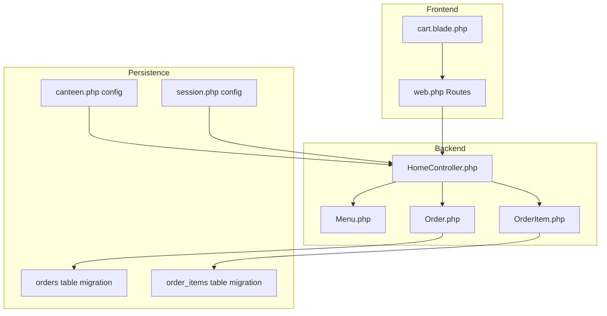
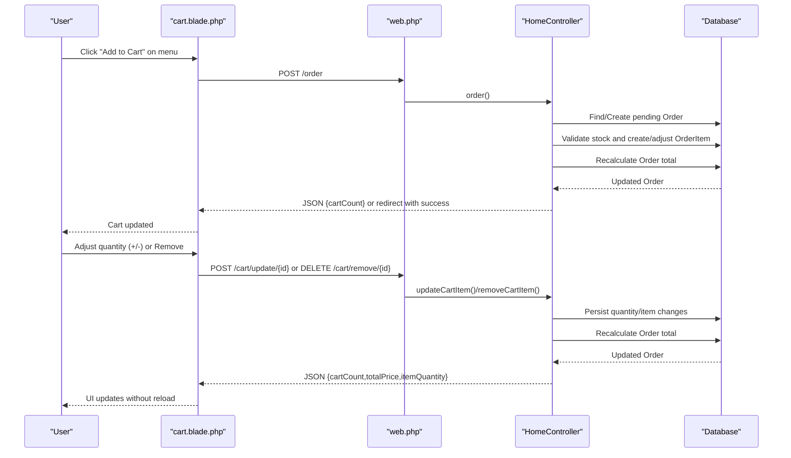
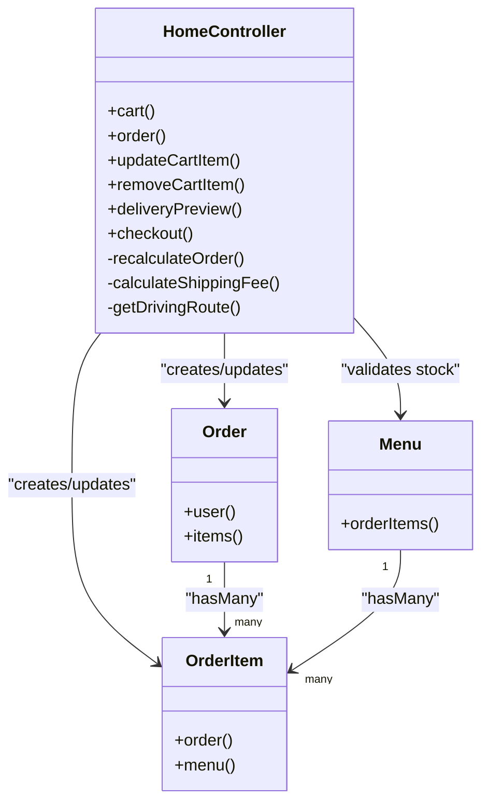

# Cart Management

<cite>
**Referenced Files in This Document**
- [cart.blade.php](file://resources/views/cart.blade.php)
- [web.php](file://routes/web.php)
- [HomeController.php](file://app/Http/Controllers/HomeController.php)
- [Menu.php](file://app/Models/Menu.php)
- [Order.php](file://app/Models/Order.php)
- [OrderItem.php](file://app/Models/OrderItem.php)
- [canteen.php](file://config/canteen.php)
- [session.php](file://config/session.php)
- [2026_04_21_011703_create_orders_table.php](file://database/migrations/2026_04_21_011703_create_orders_table.php)
- [2026_04_21_011704_create_order_items_table.php](file://database/migrations/2026_04_21_011704_create_order_items_table.php)
- [2026_04_27_021524_add_stock_to_menus_table.php](file://database/migrations/2026_04_27_021524_add_stock_to_menus_table.php)
</cite>

## Table of Contents
1. [Introduction](#introduction)
2. [Project Structure](#project-structure)
3. [Core Components](#core-components)
4. [Architecture Overview](#architecture-overview)
5. [Detailed Component Analysis](#detailed-component-analysis)
6. [Dependency Analysis](#dependency-analysis)
7. [Performance Considerations](#performance-considerations)
8. [Troubleshooting Guide](#troubleshooting-guide)
9. [Conclusion](#conclusion)
10. [Appendices](#appendices)

## Introduction
This document explains the shopping cart functionality and management in the Kantin Ibu Ida system. It covers end-to-end cart operations: adding items, adjusting quantities, removing items, calculating totals, validating stock, and persisting the cart across sessions. It also documents the cart UI components, quantity adjustment workflows, cart summary behavior, and checkout integration with the Duitku payment gateway. Guidance is included for handling stock limitations, invalid quantities, cart synchronization, mobile responsiveness, and accessibility for users with motor disabilities.

## Project Structure
The cart system spans Blade templates, routing, controller logic, Eloquent models, and database migrations. The cart page renders the current user’s pending order and exposes interactive controls for quantity adjustments and removal. AJAX endpoints handle cart updates and deletions, while the checkout process integrates with the Duitku payment provider.

**Diagram sources**
- [cart.blade.php:1-452](file://resources/views/cart.blade.php#L1-L452)
- [web.php:37-48](file://routes/web.php#L37-L48)
- [HomeController.php:116-125](file://app/Http/Controllers/HomeController.php#L116-L125)
- [Menu.php:1-32](file://app/Models/Menu.php#L1-L32)
- [Order.php:1-36](file://app/Models/Order.php#L1-L36)
- [OrderItem.php:1-29](file://app/Models/OrderItem.php#L1-L29)
- [2026_04_21_011703_create_orders_table.php:14-21](file://database/migrations/2026_04_21_011703_create_orders_table.php#L14-L21)
- [2026_04_21_011704_create_order_items_table.php:14-21](file://database/migrations/2026_04_21_011704_create_order_items_table.php#L14-L21)
- [canteen.php:1-9](file://config/canteen.php#L1-L9)
- [session.php:21-37](file://config/session.php#L21-L37)

**Section sources**
- [cart.blade.php:1-452](file://resources/views/cart.blade.php#L1-L452)
- [web.php:37-48](file://routes/web.php#L37-L48)
- [HomeController.php:116-125](file://app/Http/Controllers/HomeController.php#L116-L125)

## Core Components
- Cart page template: Renders the cart items, quantity controls, remove actions, live cart totals, shipping fee estimation, and checkout form.
- Routing: Exposes endpoints for cart display, item addition, quantity updates, item removal, delivery preview, and checkout.
- Controller logic: Manages cart creation, stock validation, quantity adjustments, item removal, order recalculation, and checkout initiation with Duitku.
- Models: Define relationships between users, orders, order items, and menus, including stock constraints.
- Persistence: Orders and order items are persisted in the database; sessions are managed via the configured driver.

Key responsibilities:
- Add items to the cart with stock validation.
- Increase/decrease item quantities with stock checks.
- Remove items from the cart.
- Recalculate order totals after modifications.
- Estimate shipping cost and validate delivery range.
- Initiate payment via Duitku and finalize order upon successful payment.

**Section sources**
- [cart.blade.php:329-351](file://resources/views/cart.blade.php#L329-L351)
- [web.php:37-48](file://routes/web.php#L37-L48)
- [HomeController.php:57-114](file://app/Http/Controllers/HomeController.php#L57-L114)
- [HomeController.php:192-263](file://app/Http/Controllers/HomeController.php#L192-L263)
- [Order.php:31-34](file://app/Models/Order.php#L31-L34)
- [OrderItem.php:19-27](file://app/Models/OrderItem.php#L19-L27)
- [Menu.php:27-30](file://app/Models/Menu.php#L27-L30)

## Architecture Overview
The cart lifecycle is initiated from the menu pages, adds items to a pending order, and continues through quantity adjustments, shipping estimation, and checkout.

**Diagram sources**
- [cart.blade.php:329-351](file://resources/views/cart.blade.php#L329-L351)
- [web.php:38-42](file://routes/web.php#L38-L42)
- [HomeController.php:57-114](file://app/Http/Controllers/HomeController.php#L57-L114)
- [HomeController.php:192-263](file://app/Http/Controllers/HomeController.php#L192-L263)

## Detailed Component Analysis

### Cart Page UI and Controls
The cart page displays:
- Items list with image, category, name, and price.
- Quantity controls (+ and - buttons) and a remove button per item.
- Live cart summary: subtotal, shipping fee, total amount.
- Interactive map for delivery location selection with real-time distance and shipping fee calculation.
- Checkout form with payment method selection and submission.

User interactions:
- Quantity increase/decrease triggers AJAX updates.
- Remove item triggers AJAX deletion.
- Delivery pin drag or map click updates location and recalculates shipping.
- Checkout validates shipping readiness and payment method before initiating payment.

Accessibility and mobile behavior:
- Buttons use semantic markup and aria-labels for screen readers.
- Quantity controls are keyboard accessible.
- Map is responsive and touch-friendly; pin dragging and click-to-place support mobile gestures.
- Form inputs are properly labeled for assistive technologies.

**Section sources**
- [cart.blade.php:329-351](file://resources/views/cart.blade.php#L329-L351)
- [cart.blade.php:340-349](file://resources/views/cart.blade.php#L340-L349)
- [cart.blade.php:363-389](file://resources/views/cart.blade.php#L363-L389)
- [cart.blade.php:391-406](file://resources/views/cart.blade.php#L391-L406)
- [cart.blade.php:408-422](file://resources/views/cart.blade.php#L408-L422)
- [cart.blade.php:429-437](file://resources/views/cart.blade.php#L429-L437)

### Adding Items to Cart
Behavior:
- Validates menu existence and quantity constraints.
- Creates a pending order for the user if none exists.
- Checks stock availability against current cart quantity.
- Creates or updates an order item and recalculates the order total.
- Returns JSON with cart count for AJAX updates or redirects with success messages.

Stock validation:
- Prevents adding beyond available stock.
- Provides contextual error messages indicating remaining capacity when applicable.

**Section sources**
- [HomeController.php:57-114](file://app/Http/Controllers/HomeController.php#L57-L114)
- [web.php:38-38](file://routes/web.php#L38-L38)

### Adjusting Quantities
Behavior:
- Accepts "increase" or "decrease" actions.
- Enforces stock limits for "increase".
- Decrease reduces quantity or removes item if it reaches zero.
- Recalculates order total and returns updated counts and prices for UI refresh.

AJAX flow:
- Sends POST to update endpoint with action payload.
- Updates cart count, item quantity display, and total price.
- Removes item row from DOM when quantity hits zero.

**Section sources**
- [HomeController.php:192-236](file://app/Http/Controllers/HomeController.php#L192-L236)
- [cart.blade.php:222-246](file://resources/views/cart.blade.php#L222-L246)
- [web.php:40-40](file://routes/web.php#L40-L40)

### Removing Items
Behavior:
- Confirms removal via client-side dialog.
- Sends DELETE request to remove endpoint.
- Removes item from DOM and recalculates totals.
- Reloads page if cart becomes empty.

**Section sources**
- [HomeController.php:238-263](file://app/Http/Controllers/HomeController.php#L238-L263)
- [cart.blade.php:247-264](file://resources/views/cart.blade.php#L247-L264)
- [web.php:41-41](file://routes/web.php#L41-L41)

### Cart Total Calculations
Behavior:
- Subtotal is computed as sum of (price × quantity) for all items.
- Shipping fee is calculated based on distance and capped by maximum delivery range.
- Total equals subtotal plus shipping fee.
- UI reflects live updates after each cart operation.

Validation:
- Ensures order exists and has items before checkout.
- Rejects checkout when outside delivery range or shipping is not calculable.

**Section sources**
- [HomeController.php:265-273](file://app/Http/Controllers/HomeController.php#L265-L273)
- [HomeController.php:547-550](file://app/Http/Controllers/HomeController.php#L547-L550)
- [HomeController.php:275-301](file://app/Http/Controllers/HomeController.php#L275-L301)
- [cart.blade.php:363-389](file://resources/views/cart.blade.php#L363-L389)

### Stock Validation During Cart Updates
Behavior:
- On add: prevents exceeding menu stock considering existing cart quantity.
- On increase: prevents exceeding menu stock.
- On decrease: removes item when quantity drops below 1.
- Returns appropriate error messages for both JSON and form contexts.

**Section sources**
- [HomeController.php:82-92](file://app/Http/Controllers/HomeController.php#L82-L92)
- [HomeController.php:203-219](file://app/Http/Controllers/HomeController.php#L203-L219)

### Cart Persistence Between Sessions
Behavior:
- Cart is bound to the authenticated user’s pending order.
- Session configuration controls lifetime and storage; cart remains valid as long as the session is active.
- No separate guest cart; logged-in users maintain continuity across navigation.

**Section sources**
- [HomeController.php:66-77](file://app/Http/Controllers/HomeController.php#L66-L77)
- [HomeController.php:116-125](file://app/Http/Controllers/HomeController.php#L116-L125)
- [session.php:21-37](file://config/session.php#L21-L37)

### Checkout and Payment Integration
Behavior:
- Validates shipping readiness and payment method selection.
- Calculates shipping fee and constructs order totals.
- Calls Duitku payment endpoint and redirects to payment URL on success.
- On payment callback, updates order status and decrements menu stock.

**Section sources**
- [cart.blade.php:266-317](file://resources/views/cart.blade.php#L266-L317)
- [HomeController.php:275-408](file://app/Http/Controllers/HomeController.php#L275-L408)
- [HomeController.php:410-452](file://app/Http/Controllers/HomeController.php#L410-L452)
- [web.php:42-47](file://routes/web.php#L42-L47)

### Practical Scenarios and Workflows
- Increasing item quantity:
  - Click "+" next to an item; stock is validated; quantity updates; totals refresh.
- Decreasing item quantity:
  - Click "-" next to an item; if quantity reaches 1, clicking "-" removes the item.
- Removing unwanted items:
  - Click trash icon; confirm deletion; item removed; totals update.
- Emptying the cart:
  - Remove all items; page reloads to reflect empty state.
- Maintaining cart state during navigation:
  - Cart persists via pending order; navigation does not reset items until checkout or explicit removal.

**Section sources**
- [cart.blade.php:340-349](file://resources/views/cart.blade.php#L340-L349)
- [HomeController.php:192-236](file://app/Http/Controllers/HomeController.php#L192-L236)
- [HomeController.php:238-263](file://app/Http/Controllers/HomeController.php#L238-L263)

### Mobile-Responsive Behavior and Accessibility
- Mobile:
  - Touch-friendly map with draggable pin and click-to-place.
  - Responsive layout for cart items and summary panels.
- Accessibility:
  - Buttons include aria-labels for screen readers.
  - Proper labels and placeholders for form inputs.
  - Keyboard navigable quantity controls and remove buttons.

**Section sources**
- [cart.blade.php:391-406](file://resources/views/cart.blade.php#L391-L406)
- [cart.blade.php:340-349](file://resources/views/cart.blade.php#L340-L349)

## Dependency Analysis
The cart system depends on:
- Routes for cart operations and checkout.
- Controller methods implementing business logic for cart and checkout.
- Models defining relationships and constraints (stock, order items).
- Database migrations establishing schema for orders and order items.
- Configuration for canteen location and delivery range.
- Session configuration for persistence.

**Diagram sources**
- [HomeController.php:116-125](file://app/Http/Controllers/HomeController.php#L116-L125)
- [Order.php:26-34](file://app/Models/Order.php#L26-L34)
- [OrderItem.php:19-27](file://app/Models/OrderItem.php#L19-L27)
- [Menu.php:27-30](file://app/Models/Menu.php#L27-L30)

**Section sources**
- [web.php:37-48](file://routes/web.php#L37-L48)
- [HomeController.php:116-125](file://app/Http/Controllers/HomeController.php#L116-L125)
- [Order.php:26-34](file://app/Models/Order.php#L26-L34)
- [OrderItem.php:19-27](file://app/Models/OrderItem.php#L19-L27)
- [Menu.php:27-30](file://app/Models/Menu.php#L27-L30)

## Performance Considerations
- Minimize database queries by recalculating totals in memory and persisting once per operation.
- Use AJAX for quantity and removal operations to avoid full page reloads.
- Cache frequently accessed menu stock and pricing where appropriate.
- Keep shipping fee calculations efficient; leverage precomputed route geometry only when necessary.

## Troubleshooting Guide
Common issues and resolutions:
- Stock limitation errors:
  - Occur when attempting to exceed available stock. The system returns contextual messages indicating remaining capacity or maximum stock. Reduce quantity or choose another item.
- Invalid quantities:
  - Ensure quantities are positive integers. The system rejects non-positive values.
- Cart synchronization problems:
  - If items disappear unexpectedly, verify that the user remains logged in and the session is active. Pending orders persist across navigation.
- Cart synchronization problems:
  - If totals appear inconsistent after updates, ensure the page is not caching stale responses. The frontend updates totals via AJAX and re-renders affected elements.
- Delivery range errors:
  - If shipping is unavailable, move the delivery pin closer to the canteen or select a location within the maximum delivery radius.
- Payment failures:
  - Confirm Duitku configuration is correct and network connectivity is available. Review callback and error responses for details.

**Section sources**
- [HomeController.php:82-92](file://app/Http/Controllers/HomeController.php#L82-L92)
- [HomeController.php:203-219](file://app/Http/Controllers/HomeController.php#L203-L219)
- [HomeController.php:275-301](file://app/Http/Controllers/HomeController.php#L275-L301)
- [HomeController.php:316-321](file://app/Http/Controllers/HomeController.php#L316-L321)
- [HomeController.php:410-452](file://app/Http/Controllers/HomeController.php#L410-L452)

## Conclusion
The cart system in Kantin Ibu Ida provides a robust, user-friendly experience for managing orders. It enforces stock validation, offers immediate feedback via AJAX, and integrates seamlessly with the Duitku payment gateway. The design emphasizes accessibility and mobile usability, ensuring inclusive experiences for diverse users.

## Appendices

### Database Schema Notes
- Orders table stores user associations, status, and total price.
- Order items table links orders to menus, tracks quantity and price, and cascades deletions.
- Menus table includes stock field enabling accurate stock validation.

**Section sources**
- [2026_04_21_011703_create_orders_table.php:14-21](file://database/migrations/2026_04_21_011703_create_orders_table.php#L14-L21)
- [2026_04_21_011704_create_order_items_table.php:14-21](file://database/migrations/2026_04_21_011704_create_order_items_table.php#L14-L21)
- [2026_04_27_021524_add_stock_to_menus_table.php](file://database/migrations/2026_04_27_021524_add_stock_to_menus_table.php)