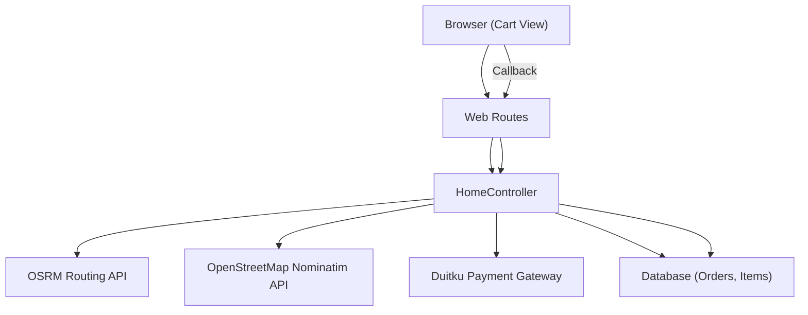
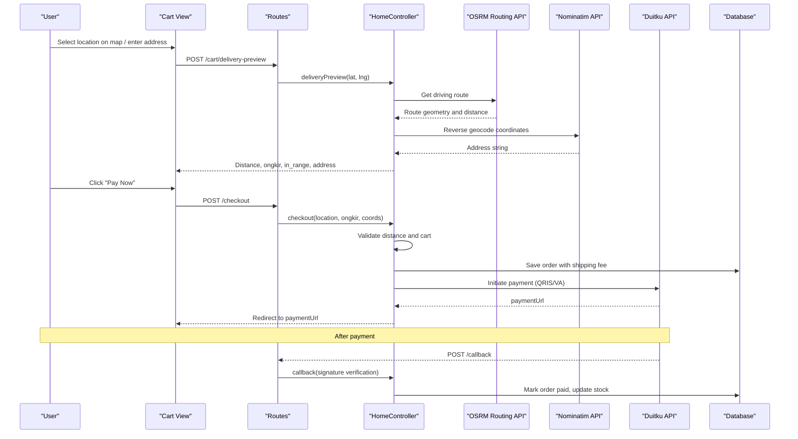
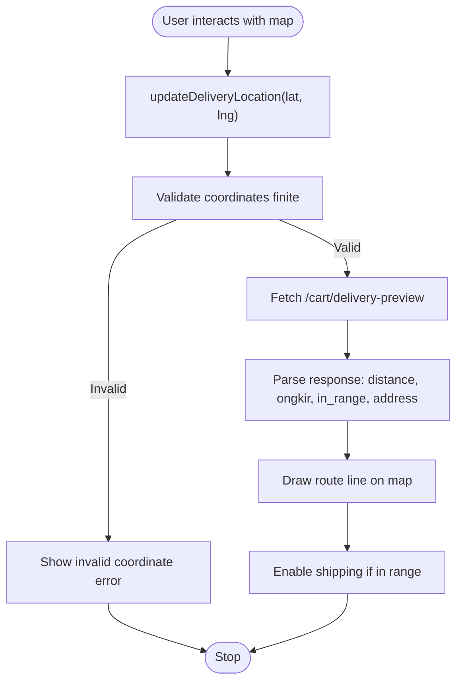
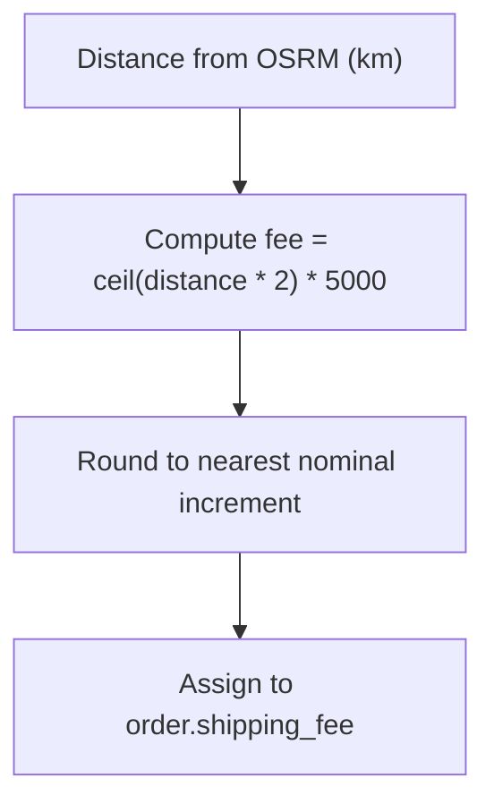
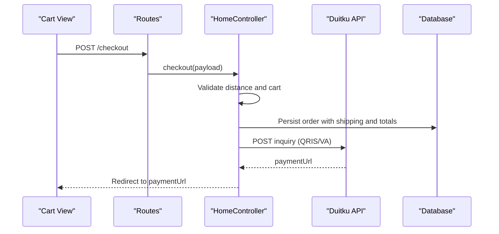
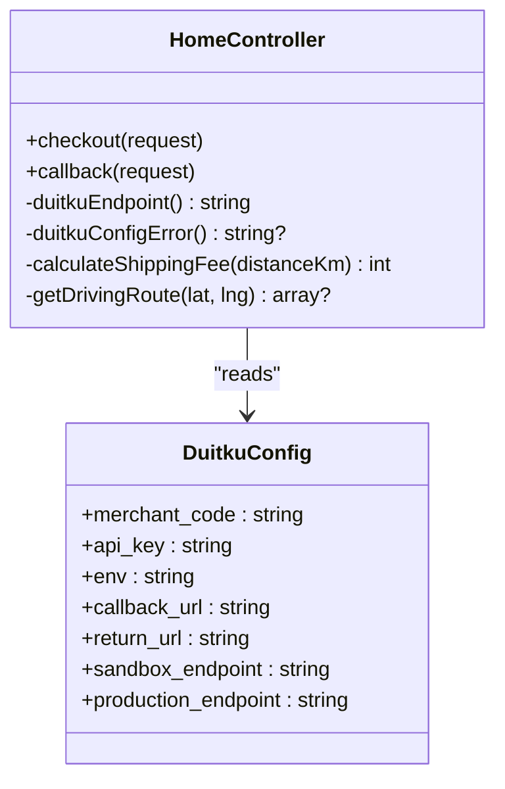
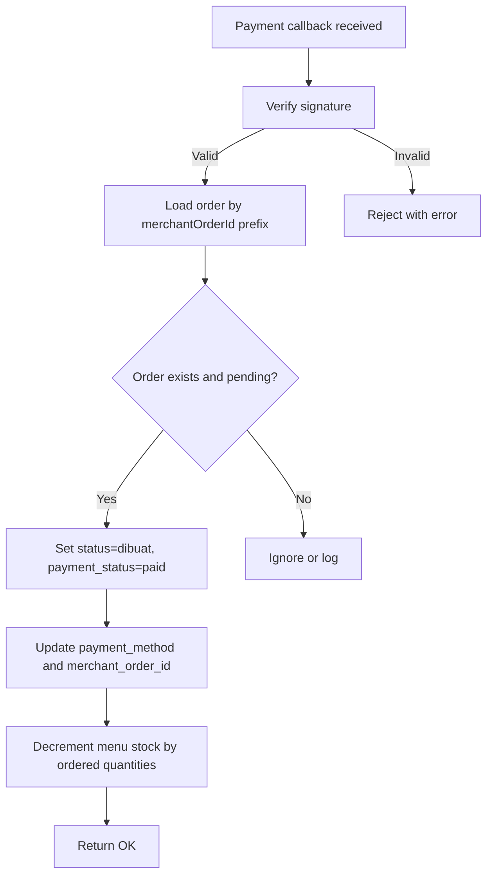
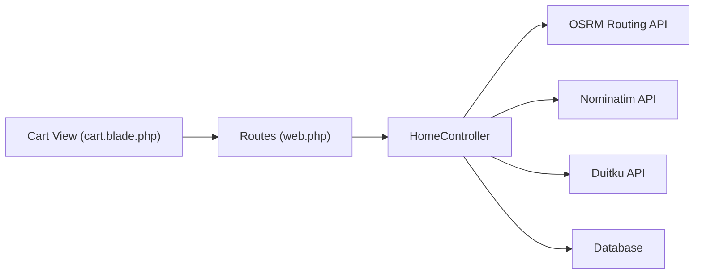

# Checkout & Payment Process

<cite>
**Referenced Files in This Document**
- [HomeController.php](file://app/Http/Controllers/HomeController.php)
- [web.php](file://routes/web.php)
- [cart.blade.php](file://resources/views/cart.blade.php)
- [Order.php](file://app/Models/Order.php)
- [duitku.php](file://config/duitku.php)
- [canteen.php](file://config/canteen.php)
</cite>

## Table of Contents
1. [Introduction](#introduction)
2. [Project Structure](#project-structure)
3. [Core Components](#core-components)
4. [Architecture Overview](#architecture-overview)
5. [Detailed Component Analysis](#detailed-component-analysis)
6. [Dependency Analysis](#dependency-analysis)
7. [Performance Considerations](#performance-considerations)
8. [Troubleshooting Guide](#troubleshooting-guide)
9. [Conclusion](#conclusion)

## Introduction
This document explains the complete checkout and payment processing workflow in the Kantin Ibu Ida system. It covers location selection via an interactive map, delivery distance calculation using OSRM routing, shipping fee computation, and payment initiation through the Duitku gateway. It also documents the frontend components for address input, map-based location selection, delivery estimation, and payment method selection, along with practical scenarios and troubleshooting guidance for common issues such as location validation failures, payment processing errors, distance calculation problems, and gateway connectivity issues.

## Project Structure
The checkout and payment flow spans the web routes, the home controller, the cart view, and supporting configuration files:
- Routes define endpoints for cart, checkout, delivery preview, payment callbacks, and success redirection.
- The home controller implements order creation, delivery estimation, shipping fee calculation, Duitku payment initiation, and callback verification.
- The cart view provides the interactive map, live delivery estimation, and payment method selection.
- Configuration files supply canteen coordinates, maximum delivery range, and Duitku credentials.

**Diagram sources**
- [web.php:33-50](file://routes/web.php#L33-L50)
- [HomeController.php:127-190](file://app/Http/Controllers/HomeController.php#L127-L190)
- [HomeController.php:275-408](file://app/Http/Controllers/HomeController.php#L275-L408)
- [HomeController.php:410-452](file://app/Http/Controllers/HomeController.php#L410-L452)

**Section sources**
- [web.php:33-50](file://routes/web.php#L33-L50)
- [cart.blade.php:65-121](file://resources/views/cart.blade.php#L65-L121)
- [canteen.php:1-9](file://config/canteen.php#L1-L9)

## Core Components
- Web Routes: Expose endpoints for cart, checkout, delivery preview, payment callback, and success page.
- Home Controller: Implements order lifecycle, delivery estimation, shipping fee calculation, Duitku integration, and callback verification.
- Cart View: Provides map-based location selection, live delivery estimation, and payment method selection.
- Models: Order model persists order metadata including location, shipping fee, latitude/longitude, and distance.
- Configurations: Duitku configuration and canteen settings for coordinates and delivery range.

Key implementation references:
- Delivery preview and routing: [HomeController.php:127-190](file://app/Http/Controllers/HomeController.php#L127-L190), [HomeController.php:514-545](file://app/Http/Controllers/HomeController.php#L514-L545)
- Shipping fee calculation: [HomeController.php:547-550](file://app/Http/Controllers/HomeController.php#L547-L550)
- Checkout and Duitku initiation: [HomeController.php:275-408](file://app/Http/Controllers/HomeController.php#L275-L408)
- Callback verification and stock updates: [HomeController.php:410-452](file://app/Http/Controllers/HomeController.php#L410-L452)
- Frontend map and checkout UI: [cart.blade.php:65-121](file://resources/views/cart.blade.php#L65-L121), [cart.blade.php:266-317](file://resources/views/cart.blade.php#L266-L317)

**Section sources**
- [web.php:33-50](file://routes/web.php#L33-L50)
- [HomeController.php:127-190](file://app/Http/Controllers/HomeController.php#L127-L190)
- [HomeController.php:275-408](file://app/Http/Controllers/HomeController.php#L275-L408)
- [HomeController.php:410-452](file://app/Http/Controllers/HomeController.php#L410-L452)
- [cart.blade.php:65-121](file://resources/views/cart.blade.php#L65-L121)
- [Order.php:12-24](file://app/Models/Order.php#L12-L24)
- [canteen.php:1-9](file://config/canteen.php#L1-L9)

## Architecture Overview
The checkout and payment workflow integrates frontend interactivity with backend processing and external services:

**Diagram sources**
- [web.php:39-43](file://routes/web.php#L39-L43)
- [HomeController.php:127-190](file://app/Http/Controllers/HomeController.php#L127-L190)
- [HomeController.php:275-408](file://app/Http/Controllers/HomeController.php#L275-L408)
- [HomeController.php:410-452](file://app/Http/Controllers/HomeController.php#L410-L452)

## Detailed Component Analysis

### Location Selection and Delivery Estimation
Users select their delivery location either by dragging the blue marker on the map or clicking on the map. The frontend emits asynchronous requests to compute distance, estimate shipping, and reverse geocode the coordinates.

**Diagram sources**
- [cart.blade.php:122-200](file://resources/views/cart.blade.php#L122-L200)
- [HomeController.php:127-190](file://app/Http/Controllers/HomeController.php#L127-L190)

Implementation highlights:
- Map initialization and markers: [cart.blade.php:65-121](file://resources/views/cart.blade.php#L65-L121)
- Delivery preview endpoint and logic: [HomeController.php:127-190](file://app/Http/Controllers/HomeController.php#L127-L190)
- OSRM routing and geometry rendering: [HomeController.php:514-545](file://app/Http/Controllers/HomeController.php#L514-L545), [cart.blade.php:201-220](file://resources/views/cart.blade.php#L201-L220)

Practical scenario examples:
- Placing the pin on a road intersection near the canteen: distance and ongkir computed, address auto-filled.
- Moving the pin to a residential area outside the max delivery radius: in_range false, ongkir zero, message indicates out-of-range.
- Clicking far off-road: route unavailable, fallback message instructs moving to nearest road.

**Section sources**
- [cart.blade.php:122-200](file://resources/views/cart.blade.php#L122-L200)
- [HomeController.php:127-190](file://app/Http/Controllers/HomeController.php#L127-L190)
- [HomeController.php:514-545](file://app/Http/Controllers/HomeController.php#L514-L545)

### Shipping Fee Determination
Shipping fee is calculated based on the driving distance returned by OSRM. The formula scales distance to a monetary amount and rounds up to the nearest unit for consistent billing.

**Diagram sources**
- [HomeController.php:547-550](file://app/Http/Controllers/HomeController.php#L547-L550)
- [HomeController.php:328-338](file://app/Http/Controllers/HomeController.php#L328-L338)

Validation and constraints:
- Maximum delivery distance enforced from configuration: [HomeController.php:295-301](file://app/Http/Controllers/HomeController.php#L295-L301), [canteen.php:7](file://config/canteen.php#L7)

**Section sources**
- [HomeController.php:547-550](file://app/Http/Controllers/HomeController.php#L547-L550)
- [HomeController.php:328-338](file://app/Http/Controllers/HomeController.php#L328-L338)
- [canteen.php:7](file://config/canteen.php#L7)

### Payment Method Selection and Checkout Initiation
The cart view allows users to choose between QRIS and Virtual Account. On checkout, the system validates the cart, computes total price, saves order metadata, and initiates a payment via Duitku.

**Diagram sources**
- [web.php:42-43](file://routes/web.php#L42-L43)
- [cart.blade.php:409-422](file://resources/views/cart.blade.php#L409-L422)
- [HomeController.php:275-408](file://app/Http/Controllers/HomeController.php#L275-L408)

Key validations and behaviors:
- Distance validation against max delivery: [HomeController.php:295-301](file://app/Http/Controllers/HomeController.php#L295-L301)
- Cart emptiness check: [HomeController.php:310-314](file://app/Http/Controllers/HomeController.php#L310-L314)
- Duitku configuration readiness: [HomeController.php:316-321](file://app/Http/Controllers/HomeController.php#L316-L321)
- Signature generation and endpoint selection: [HomeController.php:343-381](file://app/Http/Controllers/HomeController.php#L343-L381), [HomeController.php:552-557](file://app/Http/Controllers/HomeController.php#L552-L557)

**Section sources**
- [cart.blade.php:409-422](file://resources/views/cart.blade.php#L409-L422)
- [HomeController.php:275-408](file://app/Http/Controllers/HomeController.php#L275-L408)
- [HomeController.php:552-557](file://app/Http/Controllers/HomeController.php#L552-L557)

### Duitku Payment Gateway Integration
The system integrates with Duitku for payment initiation and verification:
- Configuration: merchant code, API key, environment, endpoints, and URLs.
- Request signing and payload assembly.
- Callback verification with signature validation and status handling.
- Stock updates upon successful payment.

**Diagram sources**
- [HomeController.php:275-408](file://app/Http/Controllers/HomeController.php#L275-L408)
- [HomeController.php:410-452](file://app/Http/Controllers/HomeController.php#L410-L452)
- [duitku.php:1-12](file://config/duitku.php#L1-L12)

Operational flow:
- Payment initiation: [HomeController.php:343-381](file://app/Http/Controllers/HomeController.php#L343-L381)
- Payment URL retrieval and order persistence: [HomeController.php:385-407](file://app/Http/Controllers/HomeController.php#L385-L407)
- Callback verification and order state transitions: [HomeController.php:410-452](file://app/Http/Controllers/HomeController.php#L410-L452)

**Section sources**
- [HomeController.php:275-408](file://app/Http/Controllers/HomeController.php#L275-L408)
- [HomeController.php:410-452](file://app/Http/Controllers/HomeController.php#L410-L452)
- [duitku.php:1-12](file://config/duitku.php#L1-L12)

### Transaction Completion and Order State Management
After successful payment, the system updates order status and reduces menu stock. Orders older than 24 hours with status “arrived” are auto-completed.

**Diagram sources**
- [HomeController.php:410-452](file://app/Http/Controllers/HomeController.php#L410-L452)

Additional automation:
- Auto-complete “arrived” orders after 24 hours: [HomeController.php:477-486](file://app/Http/Controllers/HomeController.php#L477-L486)

**Section sources**
- [HomeController.php:410-452](file://app/Http/Controllers/HomeController.php#L410-L452)
- [HomeController.php:477-486](file://app/Http/Controllers/HomeController.php#L477-L486)

## Dependency Analysis
The checkout pipeline depends on:
- Frontend map libraries (Leaflet) and user interactions.
- Backend routing and controller actions.
- External APIs: OSRM for routing and Nominatim for geocoding.
- Payment gateway: Duitku with environment-specific endpoints.
- Database persistence for orders and items.

**Diagram sources**
- [cart.blade.php:65-121](file://resources/views/cart.blade.php#L65-L121)
- [web.php:39-43](file://routes/web.php#L39-L43)
- [HomeController.php:127-190](file://app/Http/Controllers/HomeController.php#L127-L190)
- [HomeController.php:275-408](file://app/Http/Controllers/HomeController.php#L275-L408)
- [HomeController.php:410-452](file://app/Http/Controllers/HomeController.php#L410-L452)

**Section sources**
- [cart.blade.php:65-121](file://resources/views/cart.blade.php#L65-L121)
- [web.php:39-43](file://routes/web.php#L39-L43)
- [HomeController.php:127-190](file://app/Http/Controllers/HomeController.php#L127-L190)
- [HomeController.php:275-408](file://app/Http/Controllers/HomeController.php#L275-L408)
- [HomeController.php:410-452](file://app/Http/Controllers/HomeController.php#L410-L452)

## Performance Considerations
- External API timeouts and retries:
  - Geocoding timeout configured to limit latency: [HomeController.php:141-145](file://app/Http/Controllers/HomeController.php#L141-L145)
  - OSRM request with retry and timeout to improve reliability: [HomeController.php:519-527](file://app/Http/Controllers/HomeController.php#L519-L527)
- Frontend debouncing of delivery preview requests using request IDs to avoid race conditions: [cart.blade.php:133-159](file://resources/views/cart.blade.php#L133-L159)
- Efficient distance calculation using spherical law of cosines: [HomeController.php:502-512](file://app/Http/Controllers/HomeController.php#L502-L512)
- Minimal payload to Duitku to reduce signature mismatches: [HomeController.php:375](file://app/Http/Controllers/HomeController.php#L375)

[No sources needed since this section provides general guidance]

## Troubleshooting Guide
Common issues and resolutions:
- Location validation failures
  - Symptom: “Outside 2 KM range” or route calculation failure.
  - Causes: Coordinates off-road, OSRM unreachable, or exceeding max delivery.
  - Resolution: Move pin to nearest road, ensure canteen coordinates are correct, verify max delivery setting.
  - References: [HomeController.php:295-301](file://app/Http/Controllers/HomeController.php#L295-L301), [HomeController.php:519-544](file://app/Http/Controllers/HomeController.php#L519-L544), [canteen.php:7](file://config/canteen.php#L7)

- Payment processing errors
  - Symptom: Duitku inquiry fails or returns error message.
  - Causes: Missing merchant code/API key, signature mismatch, gateway downtime.
  - Resolution: Verify Duitku configuration, ensure environment matches intended mode, check callback/return URLs.
  - References: [HomeController.php:316-321](file://app/Http/Controllers/HomeController.php#L316-L321), [HomeController.php:385-407](file://app/Http/Controllers/HomeController.php#L385-L407), [duitku.php:1-12](file://config/duitku.php#L1-L12)

- Distance calculation problems
  - Symptom: No route found or zero distance.
  - Causes: Incorrect canteen coordinates, network issues, invalid destination.
  - Resolution: Confirm canteen coordinates, test OSRM endpoint availability, validate user input.
  - References: [HomeController.php:519-544](file://app/Http/Controllers/HomeController.php#L519-L544), [canteen.php:5-6](file://config/canteen.php#L5-L6)

- Payment gateway connectivity issues
  - Symptom: Callback not received or rejected signature.
  - Causes: Misconfigured callback URL, signature mismatch, incorrect API key.
  - Resolution: Align callback/return URLs with routes, verify signature generation logic, confirm API key correctness.
  - References: [HomeController.php:410-452](file://app/Http/Controllers/HomeController.php#L410-L452), [web.php:50](file://routes/web.php#L50), [duitku.php:7-11](file://config/duitku.php#L7-L11)

- Order stock discrepancies after payment
  - Symptom: Stock not reduced despite successful payment.
  - Causes: Callback not processed or order not found by merchantOrderId prefix.
  - Resolution: Verify callback reached controller, ensure merchantOrderId format is preserved, check order existence.
  - References: [HomeController.php:440-446](file://app/Http/Controllers/HomeController.php#L440-L446)

**Section sources**
- [HomeController.php:295-301](file://app/Http/Controllers/HomeController.php#L295-L301)
- [HomeController.php:316-321](file://app/Http/Controllers/HomeController.php#L316-L321)
- [HomeController.php:385-407](file://app/Http/Controllers/HomeController.php#L385-L407)
- [HomeController.php:519-544](file://app/Http/Controllers/HomeController.php#L519-L544)
- [HomeController.php:410-452](file://app/Http/Controllers/HomeController.php#L410-L452)
- [web.php:50](file://routes/web.php#L50)
- [canteen.php:5-6](file://config/canteen.php#L5-L6)
- [canteen.php:7](file://config/canteen.php#L7)
- [duitku.php:1-12](file://config/duitku.php#L1-L12)

## Conclusion
The checkout and payment workflow in Kantin Ibu Ida combines an intuitive map-based location selection with robust backend validation and external service integrations. Users benefit from immediate delivery estimation and a secure payment process via Duitku. The system’s design emphasizes reliability through timeouts, retries, and signature verification, while frontend interactivity ensures a smooth user experience. Proper configuration of canteen coordinates, delivery limits, and Duitku credentials is essential for reliable operation.