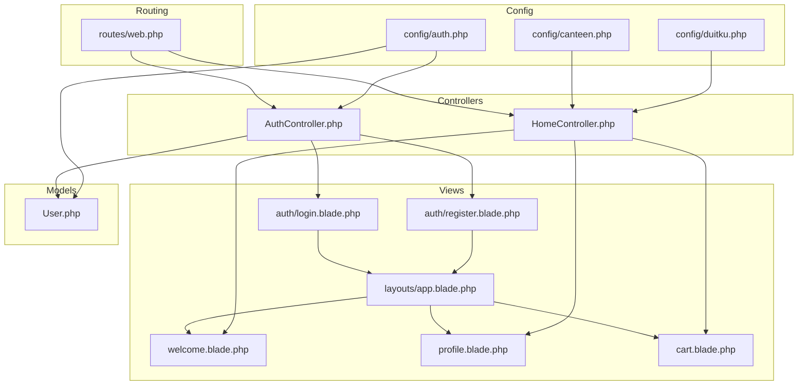
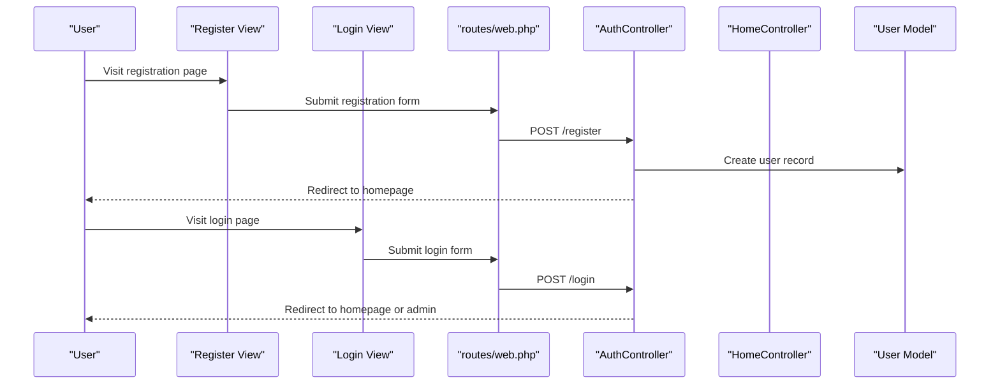
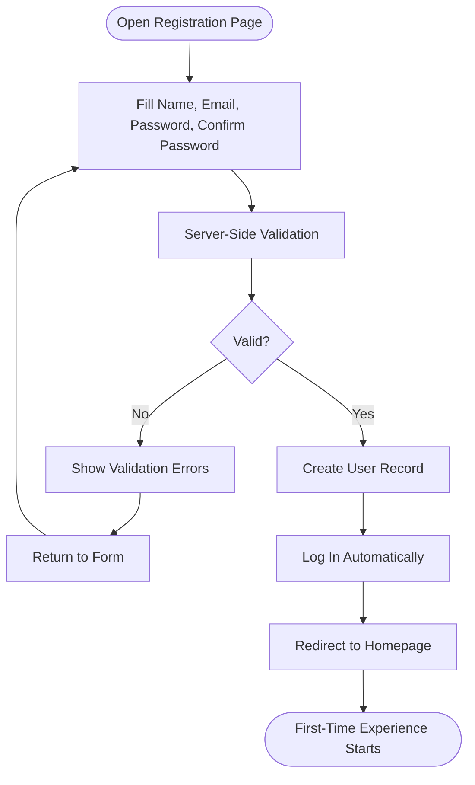
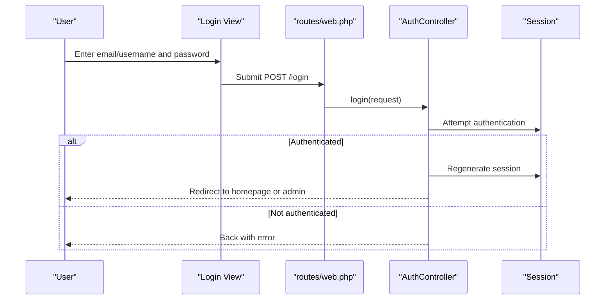
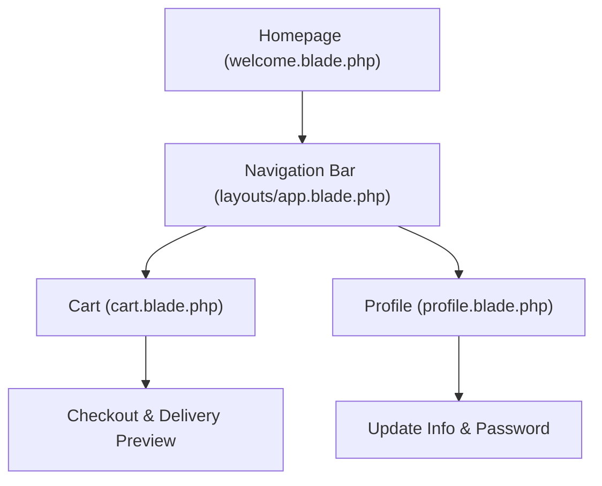
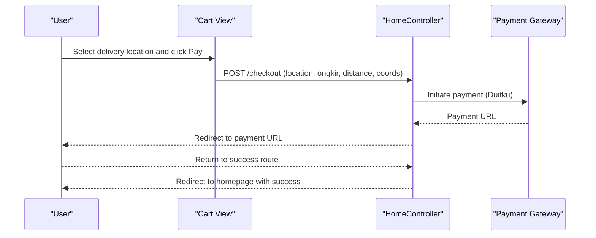
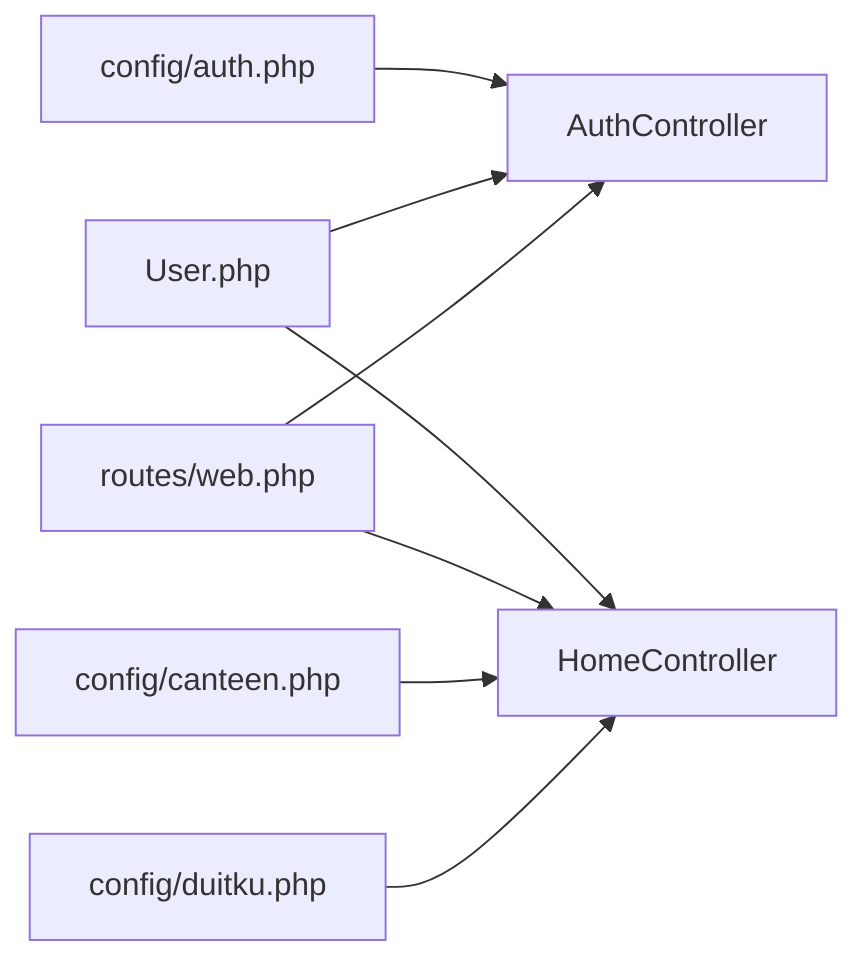

# Getting Started

<cite>
**Referenced Files in This Document**
- [AuthController.php](file://app/Http/Controllers/AuthController.php)
- [HomeController.php](file://app/Http/Controllers/HomeController.php)
- [User.php](file://app/Models/User.php)
- [web.php](file://routes/web.php)
- [register.blade.php](file://resources/views/auth/register.blade.php)
- [login.blade.php](file://resources/views/auth/login.blade.php)
- [app.blade.php](file://resources/views/layouts/app.blade.php)
- [welcome.blade.php](file://resources/views/welcome.blade.php)
- [profile.blade.php](file://resources/views/profile.blade.php)
- [cart.blade.php](file://resources/views/cart.blade.php)
- [auth.php](file://config/auth.php)
- [0001_01_01_000000_create_users_table.php](file://database/migrations/0001_01_01_000000_create_users_table.php)
- [canteen.php](file://config/canteen.php)
- [duitku.php](file://config/duitku.php)
- [AdminMiddleware.php](file://app/Http/Middleware/AdminMiddleware.php)
</cite>

## Table of Contents
1. [Introduction](#introduction)
2. [Project Structure](#project-structure)
3. [Core Components](#core-components)
4. [Architecture Overview](#architecture-overview)
5. [Detailed Component Analysis](#detailed-component-analysis)
6. [Dependency Analysis](#dependency-analysis)
7. [Performance Considerations](#performance-considerations)
8. [Troubleshooting Guide](#troubleshooting-guide)
9. [Conclusion](#conclusion)
10. [Appendices](#appendices)

## Introduction
This guide explains how new users sign up, log in, and complete their first-time experience in the Kantin Ibu Ida system. It covers the end-to-end onboarding flow: visiting the site, registering an account, logging in, updating profile details, and placing their first order. It also documents the current authentication behavior, navigation, and how to troubleshoot common onboarding issues such as login errors and checkout limitations.

## Project Structure
The onboarding experience spans several key areas:
- Routes define the entry points for login, registration, and authenticated pages.
- Blade templates render the registration and login forms and the main application layout.
- Controllers manage authentication actions and user-facing pages after login.
- Models define the user entity and its attributes.
- Configuration files govern authentication defaults, payment integration, and delivery constraints.

**Diagram sources**
- [web.php:27-31](file://routes/web.php#L27-L31)
- [AuthController.php:12-68](file://app/Http/Controllers/AuthController.php#L12-L68)
- [HomeController.php:14-55](file://app/Http/Controllers/HomeController.php#L14-L55)
- [register.blade.php:40-78](file://resources/views/auth/register.blade.php#L40-L78)
- [login.blade.php:40-62](file://resources/views/auth/login.blade.php#L40-L62)
- [app.blade.php:84-124](file://resources/views/layouts/app.blade.php#L84-L124)
- [welcome.blade.php:6-45](file://resources/views/welcome.blade.php#L6-L45)
- [profile.blade.php:58-96](file://resources/views/profile.blade.php#L58-L96)
- [cart.blade.php:32-439](file://resources/views/cart.blade.php#L32-L439)
- [User.php:19-25](file://app/Models/User.php#L19-L25)
- [auth.php:16-19](file://config/auth.php#L16-L19)
- [canteen.php:4-8](file://config/canteen.php#L4-L8)
- [duitku.php:3-11](file://config/duitku.php#L3-L11)

**Section sources**
- [web.php:27-31](file://routes/web.php#L27-L31)
- [AuthController.php:12-68](file://app/Http/Controllers/AuthController.php#L12-L68)
- [HomeController.php:14-55](file://app/Http/Controllers/HomeController.php#L14-L55)
- [register.blade.php:40-78](file://resources/views/auth/register.blade.php#L40-L78)
- [login.blade.php:40-62](file://resources/views/auth/login.blade.php#L40-L62)
- [app.blade.php:84-124](file://resources/views/layouts/app.blade.php#L84-L124)
- [welcome.blade.php:6-45](file://resources/views/welcome.blade.php#L6-L45)
- [profile.blade.php:58-96](file://resources/views/profile.blade.php#L58-L96)
- [cart.blade.php:32-439](file://resources/views/cart.blade.php#L32-L439)
- [User.php:19-25](file://app/Models/User.php#L19-L25)
- [auth.php:16-19](file://config/auth.php#L16-L19)
- [canteen.php:4-8](file://config/canteen.php#L4-L8)
- [duitku.php:3-11](file://config/duitku.php#L3-L11)

## Core Components
- Authentication routes and controllers: handle login, registration, and logout.
- Registration and login views: present forms and validation feedback.
- Layout and navigation: expose links to login, profile, orders, and cart.
- Post-login pages: welcome landing, profile, and cart/checkout.
- User model: defines attributes and hidden fields.
- Configuration: authentication defaults, delivery limits, and payment gateway settings.

Key onboarding touchpoints:
- Registration form collects name, email, and password.
- Login form accepts email or username alias and password.
- After login, users land on the homepage and can navigate to profile and cart.
- Profile page allows updating name, phone, and password.
- Cart page enables selecting delivery location, simulating shipping cost, and initiating checkout.

**Section sources**
- [AuthController.php:12-68](file://app/Http/Controllers/AuthController.php#L12-L68)
- [register.blade.php:40-78](file://resources/views/auth/register.blade.php#L40-L78)
- [login.blade.php:40-62](file://resources/views/auth/login.blade.php#L40-L62)
- [app.blade.php:84-124](file://resources/views/layouts/app.blade.php#L84-L124)
- [welcome.blade.php:6-45](file://resources/views/welcome.blade.php#L6-L45)
- [profile.blade.php:58-96](file://resources/views/profile.blade.php#L58-L96)
- [cart.blade.php:32-439](file://resources/views/cart.blade.php#L32-L439)
- [User.php:19-25](file://app/Models/User.php#L19-L25)
- [auth.php:16-19](file://config/auth.php#L16-L19)
- [canteen.php:4-8](file://config/canteen.php#L4-L8)
- [duitku.php:3-11](file://config/duitku.php#L3-L11)

## Architecture Overview
The onboarding flow connects user actions to backend logic and views. Authentication is handled via session-based guards and the Eloquent user provider. After successful login, users gain access to authenticated routes and pages.

**Diagram sources**
- [web.php:27-31](file://routes/web.php#L27-L31)
- [AuthController.php:46-68](file://app/Http/Controllers/AuthController.php#L46-L68)
- [AuthController.php:17-44](file://app/Http/Controllers/AuthController.php#L17-L44)
- [User.php:19-25](file://app/Models/User.php#L19-L25)

## Detailed Component Analysis

### Registration Workflow
- Form fields: name, email, password, and password confirmation.
- Validation ensures required fields, unique email, and minimum password length with confirmation.
- On success, a new user is created and automatically logged in, then redirected to the homepage.

**Diagram sources**
- [register.blade.php:40-78](file://resources/views/auth/register.blade.php#L40-L78)
- [AuthController.php:51-68](file://app/Http/Controllers/AuthController.php#L51-L68)
- [0001_01_01_000000_create_users_table.php:14-25](file://database/migrations/0001_01_01_000000_create_users_table.php#L14-L25)

**Section sources**
- [register.blade.php:40-78](file://resources/views/auth/register.blade.php#L40-L78)
- [AuthController.php:51-68](file://app/Http/Controllers/AuthController.php#L51-L68)
- [0001_01_01_01_000000_create_users_table.php:14-25](file://database/migrations/0001_01_01_000000_create_users_table.php#L14-L25)

### Login and Authentication
- Accepts either email or username-like identifiers.
- Uses session-based guard with Eloquent user provider.
- On success, regenerates session and redirects to homepage for regular users or admin panel for admins.
- On failure, returns back with an authentication error message.

**Diagram sources**
- [login.blade.php:40-62](file://resources/views/auth/login.blade.php#L40-L62)
- [web.php:27-31](file://routes/web.php#L27-L31)
- [AuthController.php:17-44](file://app/Http/Controllers/AuthController.php#L17-L44)
- [auth.php:38-43](file://config/auth.php#L38-L43)

**Section sources**
- [login.blade.php:40-62](file://resources/views/auth/login.blade.php#L40-L62)
- [AuthController.php:17-44](file://app/Http/Controllers/AuthController.php#L17-L44)
- [auth.php:38-43](file://config/auth.php#L38-L43)

### First-Time User Experience
- Homepage welcomes users and provides quick navigation to menu, cart, and profile.
- Navigation bar shows “Cart” with a badge indicating pending order quantity and “Profile” and “Orders” links when authenticated.
- Users can update profile details (name, phone, optional password change) and adjust display preferences.

**Diagram sources**
- [welcome.blade.php:6-45](file://resources/views/welcome.blade.php#L6-L45)
- [app.blade.php:84-124](file://resources/views/layouts/app.blade.php#L84-L124)
- [profile.blade.php:58-96](file://resources/views/profile.blade.php#L58-L96)
- [cart.blade.php:32-439](file://resources/views/cart.blade.php#L32-L439)

**Section sources**
- [welcome.blade.php:6-45](file://resources/views/welcome.blade.php#L6-L45)
- [app.blade.php:84-124](file://resources/views/layouts/app.blade.php#L84-L124)
- [profile.blade.php:58-96](file://resources/views/profile.blade.php#L58-L96)
- [cart.blade.php:32-439](file://resources/views/cart.blade.php#L32-L439)

### Checkout and Payment Integration
- Cart page simulates shipping cost calculation based on distance and displays an estimated total.
- Checkout triggers a payment initiation via the configured payment gateway, with a success redirect back to the homepage.

**Diagram sources**
- [cart.blade.php:266-317](file://resources/views/cart.blade.php#L266-L317)
- [HomeController.php:275-408](file://app/Http/Controllers/HomeController.php#L275-L408)
- [duitku.php:3-11](file://config/duitku.php#L3-L11)

**Section sources**
- [cart.blade.php:266-317](file://resources/views/cart.blade.php#L266-L317)
- [HomeController.php:275-408](file://app/Http/Controllers/HomeController.php#L275-L408)
- [duitku.php:3-11](file://config/duitku.php#L3-L11)

## Dependency Analysis
- Authentication depends on the session guard and Eloquent user provider.
- The User model defines fillable attributes and hidden fields.
- Routes bind URLs to controllers for registration, login, logout, and authenticated pages.
- Delivery and payment logic depend on configuration values for canteen location and payment gateway endpoints.

**Diagram sources**
- [auth.php:16-19](file://config/auth.php#L16-L19)
- [AuthController.php:12-68](file://app/Http/Controllers/AuthController.php#L12-L68)
- [User.php:19-25](file://app/Models/User.php#L19-L25)
- [web.php:27-31](file://routes/web.php#L27-L31)
- [HomeController.php:14-55](file://app/Http/Controllers/HomeController.php#L14-L55)
- [canteen.php:4-8](file://config/canteen.php#L4-L8)
- [duitku.php:3-11](file://config/duitku.php#L3-L11)

**Section sources**
- [auth.php:16-19](file://config/auth.php#L16-L19)
- [AuthController.php:12-68](file://app/Http/Controllers/AuthController.php#L12-L68)
- [User.php:19-25](file://app/Models/User.php#L19-L25)
- [web.php:27-31](file://routes/web.php#L27-L31)
- [HomeController.php:14-55](file://app/Http/Controllers/HomeController.php#L14-L55)
- [canteen.php:4-8](file://config/canteen.php#L4-L8)
- [duitku.php:3-11](file://config/duitku.php#L3-L11)

## Performance Considerations
- Session regeneration on login helps prevent session fixation.
- Cart updates and checkout rely on client-side calculations and API calls; ensure network reliability for geocoding and route estimation.
- Payment initiation is asynchronous; avoid repeated submissions during processing.

[No sources needed since this section provides general guidance]

## Troubleshooting Guide
Common onboarding issues and resolutions:
- Login fails with invalid credentials
  - Cause: Incorrect email/username or password.
  - Resolution: Verify credentials; ensure caps lock is off and spelling is correct.
  - Evidence: Authentication controller returns an error and reloads the login page.
  - Section sources
    - [AuthController.php:41-43](file://app/Http/Controllers/AuthController.php#L41-L43)

- Cannot access profile or cart after login
  - Cause: Missing authentication middleware on routes.
  - Resolution: Ensure routes are under the authenticated group; verify session state.
  - Section sources
    - [web.php:33-48](file://routes/web.php#L33-L48)

- Checkout disabled or shows “calculating”
  - Cause: Ongoing shipping cost calculation or invalid location selection.
  - Resolution: Wait for calculation to finish, select a valid location on the map, and ensure distance is within the configured limit.
  - Section sources
    - [cart.blade.php:122-200](file://resources/views/cart.blade.php#L122-L200)
    - [canteen.php:7](file://config/canteen.php#L7)

- Payment initiation errors
  - Cause: Missing or incomplete payment gateway configuration.
  - Resolution: Set merchant code and API key; clear configuration cache; retry.
  - Section sources
    - [HomeController.php:559-566](file://app/Http/Controllers/HomeController.php#L559-L566)
    - [duitku.php:3-11](file://config/duitku.php#L3-L11)

- Admin access denied
  - Cause: Non-admin user attempting admin routes.
  - Resolution: Log in as an admin user or remove admin middleware from the route.
  - Section sources
    - [AdminMiddleware.php:19-21](file://app/Http/Middleware/AdminMiddleware.php#L19-L21)

## Conclusion
The Kantin Ibu Ida onboarding path is streamlined: register, log in, update profile, and explore the menu. The system leverages Laravel’s session-based authentication and Eloquent models, with a responsive layout and interactive cart checkout. Following the steps and troubleshooting tips here will help new users complete their first-time setup and start ordering confidently.

[No sources needed since this section summarizes without analyzing specific files]

## Appendices

### Step-by-Step Onboarding Checklist
- Visit the homepage and click “Login.”
- If you do not have an account, click “Register” and fill in the form.
- After registration or login, you will be taken to the homepage.
- Navigate to “Profile” to update your name, phone number, and optionally change your password.
- Browse the menu and add items to your cart.
- Select your delivery location on the map and confirm the estimated shipping fee.
- Proceed to checkout and complete the payment via the integrated gateway.
- Review your order history and invoices from your profile.

**Section sources**
- [login.blade.php:64-67](file://resources/views/auth/login.blade.php#L64-L67)
- [register.blade.php:80-83](file://resources/views/auth/register.blade.php#L80-L83)
- [welcome.blade.php:24-32](file://resources/views/welcome.blade.php#L24-L32)
- [profile.blade.php:58-96](file://resources/views/profile.blade.php#L58-L96)
- [cart.blade.php:32-439](file://resources/views/cart.blade.php#L32-L439)

### Accessibility and Mobile Responsiveness Notes
- The layout adapts to viewport size and includes navigation links for login, cart, and profile.
- Interactive elements use icons and labels; ensure sufficient contrast and focus indicators.
- Cart page integrates a map for location selection; test with assistive technologies and ensure keyboard navigation support.

**Section sources**
- [app.blade.php:5-6](file://resources/views/layouts/app.blade.php#L5-L6)
- [app.blade.php:84-124](file://resources/views/layouts/app.blade.php#L84-L124)
- [cart.blade.php:6-9](file://resources/views/cart.blade.php#L6-L9)