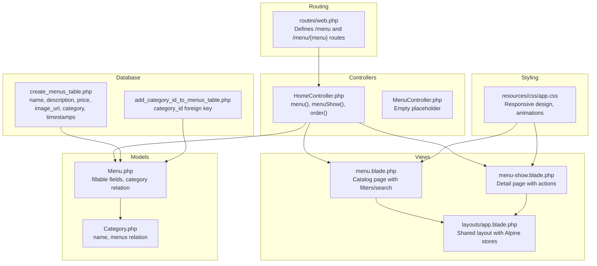
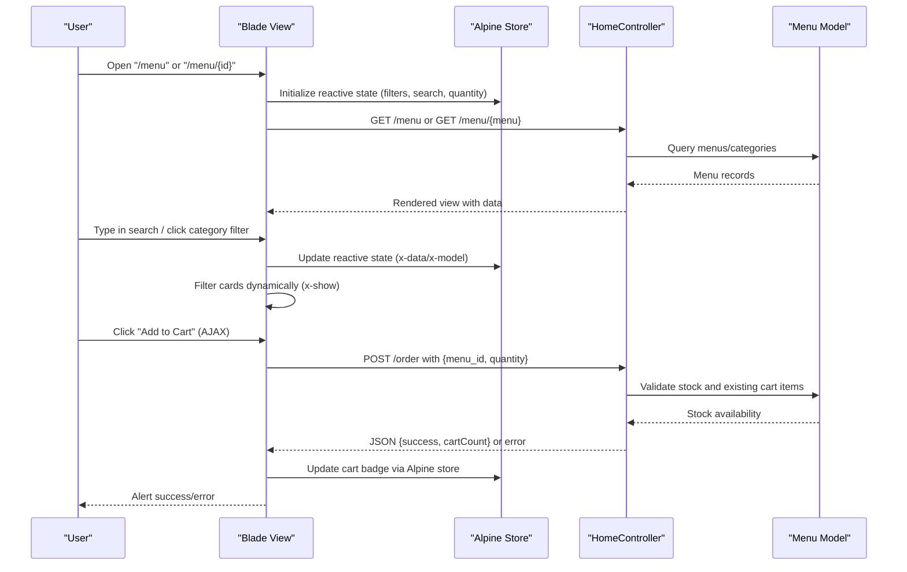
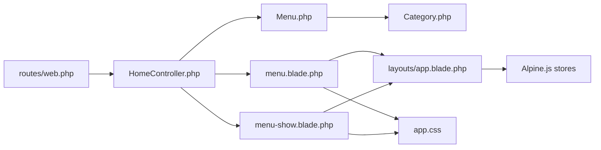

# Menu Browsing & Selection

<cite>
**Referenced Files in This Document**
- [web.php](file://routes/web.php)
- [HomeController.php](file://app/Http/Controllers/HomeController.php)
- [MenuController.php](file://app/Http/Controllers/MenuController.php)
- [Menu.php](file://app/Models/Menu.php)
- [Category.php](file://app/Models/Category.php)
- [menu.blade.php](file://resources/views/menu.blade.php)
- [menu-show.blade.php](file://resources/views/menu-show.blade.php)
- [app.blade.php](file://resources/views/layouts/app.blade.php)
- [app.css](file://resources/css/app.css)
- [create_menus_table.php](file://database/migrations/2026_04_21_011703_create_menus_table.php)
- [add_category_id_to_menus_table.php](file://database/migrations/2026_05_15_072320_add_category_id_to_menus_table.php)
</cite>

## Table of Contents
1. [Introduction](#introduction)
2. [Project Structure](#project-structure)
3. [Core Components](#core-components)
4. [Architecture Overview](#architecture-overview)
5. [Detailed Component Analysis](#detailed-component-analysis)
6. [Dependency Analysis](#dependency-analysis)
7. [Performance Considerations](#performance-considerations)
8. [Troubleshooting Guide](#troubleshooting-guide)
9. [Conclusion](#conclusion)

## Introduction
This document explains the complete menu browsing and selection experience in the Kantin Ibu Ida system. It covers how users discover menu items, filter by category, search for specific dishes, view detailed information, adjust quantities, and add items to the shopping cart. It also documents the user interface components, stock availability indicators, mobile responsiveness, and accessibility considerations for users with disabilities.

## Project Structure
The menu browsing feature spans routing, controllers, Blade templates, models, and styling. Routes define the entry points for menu listing and detail pages. Controllers handle data retrieval and cart operations. Blade templates render the UI with Alpine.js reactive behavior. Models define the data schema for menus and categories. CSS provides responsive design and animations.

**Diagram sources**
- [web.php:10-11](file://routes/web.php#L10-L11)
- [HomeController.php:20-29](file://app/Http/Controllers/HomeController.php#L20-L29)
- [menu.blade.php:6](file://resources/views/menu.blade.php#L6)
- [menu-show.blade.php:6](file://resources/views/menu-show.blade.php#L6)
- [app.blade.php:82](file://resources/views/layouts/app.blade.php#L82)
- [Menu.php:12-25](file://app/Models/Menu.php#L12-L25)
- [Category.php:9-14](file://app/Models/Category.php#L9-L14)
- [create_menus_table.php:14-23](file://database/migrations/2026_04_21_011703_create_menus_table.php#L14-L23)
- [add_category_id_to_menus_table.php:14-16](file://database/migrations/2026_05_15_072320_add_category_id_to_menus_table.php#L14-L16)
- [app.css:26](file://resources/css/app.css#L26)

**Section sources**
- [web.php:10-11](file://routes/web.php#L10-L11)
- [HomeController.php:20-29](file://app/Http/Controllers/HomeController.php#L20-L29)
- [menu.blade.php:6](file://resources/views/menu.blade.php#L6)
- [menu-show.blade.php:6](file://resources/views/menu-show.blade.php#L6)
- [app.blade.php:82](file://resources/views/layouts/app.blade.php#L82)
- [Menu.php:12-25](file://app/Models/Menu.php#L12-L25)
- [Category.php:9-14](file://app/Models/Category.php#L9-L14)
- [create_menus_table.php:14-23](file://database/migrations/2026_04_21_011703_create_menus_table.php#L14-L23)
- [add_category_id_to_menus_table.php:14-16](file://database/migrations/2026_05_15_072320_add_category_id_to_menus_table.php#L14-L16)
- [app.css:26](file://resources/css/app.css#L26)

## Core Components
- Menu catalog page: Displays all menu items with category filters ("All", "Food", "Drinks"), live search, and stock indicators. Users can view details or add items to the cart.
- Menu detail page: Presents a comprehensive view of a single menu item, including media, description, nutritional/profile info, stock, and quantity controls.
- Cart integration: Adds items to the pending order via AJAX, validates stock, and updates the cart badge reactively.
- Reactive UI: Uses Alpine.js for client-side filtering, search, quantity adjustments, and cart updates.
- Data model: Menu and Category models define attributes and relationships used across views and controllers.

Key UI components:
- Hero banner with search input
- Filter bar with category buttons
- Menu cards with image, name, price, description, stock label, and action controls
- Detail media overlay with category and price
- Detail copy with metadata, description, info grid, and quantity controls
- Action buttons for adding to cart or login prompt

Stock availability indicators:
- Stock shown on cards and detail pages
- Disabled add-to-cart button when out of stock
- Validation prevents adding more than available stock

Filtering and search:
- Category filter toggles visibility of menu cards
- Live search filters by name and description
- Both filters work together to narrow results

Sorting:
- No explicit server-side sorting is implemented; items are rendered as returned by the controller.

Accessibility and mobile responsiveness:
- Semantic HTML and ARIA labels for search and buttons
- Responsive breakpoints and fluid typography in CSS
- Reduced motion preference support via Alpine store

**Section sources**
- [menu.blade.php:6](file://resources/views/menu.blade.php#L6)
- [menu.blade.php:32-101](file://resources/views/menu.blade.php#L32-L101)
- [menu-show.blade.php:6](file://resources/views/menu-show.blade.php#L6)
- [menu-show.blade.php:36-112](file://resources/views/menu-show.blade.php#L36-L112)
- [HomeController.php:57-114](file://app/Http/Controllers/HomeController.php#L57-L114)
- [app.blade.php:31-79](file://resources/views/layouts/app.blade.php#L31-L79)
- [app.css:26](file://resources/css/app.css#L26)

## Architecture Overview
The menu browsing flow connects user interactions to backend processing and state updates.

**Diagram sources**
- [web.php:10-11](file://routes/web.php#L10-L11)
- [HomeController.php:20-29](file://app/Http/Controllers/HomeController.php#L20-L29)
- [HomeController.php:57-114](file://app/Http/Controllers/HomeController.php#L57-L114)
- [menu.blade.php:55-96](file://resources/views/menu.blade.php#L55-L96)
- [menu-show.blade.php:8-35](file://resources/views/menu-show.blade.php#L8-L35)
- [app.blade.php:61-79](file://resources/views/layouts/app.blade.php#L61-L79)

## Detailed Component Analysis

### Menu Catalog Page (menu.blade.php)
Responsibilities:
- Renders hero section with search input
- Provides category filter buttons
- Iterates through menus and renders cards
- Implements client-side filtering and search
- Handles quantity selection and add-to-cart via AJAX
- Shows stock indicators and login prompts for guests

UI components:
- Search label/input bound to reactive variable
- Filter buttons toggling active state
- Menu cards with image, title, price, description, stock, and controls
- Quantity input and add-to-cart button when in stock
- Login prompt for guests attempting to order
- Detail link to menu-show page

Stock and validation:
- Client-side check prevents adding more than stock
- Server-side validation ensures correctness and updates cart totals

Practical examples:
- Filtering: Click "Food" to show only food items
- Searching: Type "rendang" to match name/description
- Adding to cart: Select quantity 1, click Add, observe cart badge increment

Accessibility:
- Proper labels for search and buttons
- Alt text for images
- Keyboard navigable controls

**Section sources**
- [menu.blade.php:6](file://resources/views/menu.blade.php#L6)
- [menu.blade.php:32-101](file://resources/views/menu.blade.php#L32-L101)
- [menu.blade.php:55-96](file://resources/views/menu.blade.php#L55-L96)

### Menu Detail Page (menu-show.blade.php)
Responsibilities:
- Displays detailed media and overlay with category/price
- Shows metadata, description, and info grid (category, stock, price)
- Provides quantity controls and add-to-cart action
- Handles guest login prompts

UI components:
- Media shell with overlay containing category and price
- Copy section with metadata, description, and info grid
- Quantity controls with decrement/increment buttons
- Add-to-cart button with price display
- Login prompt for unauthenticated users

Stock and validation:
- Client-side check prevents exceeding stock
- Server-side validation during cart addition

Practical examples:
- Viewing details: Navigate to "/menu/{id}" to see full info
- Comparing prices: Check the overlay and info grid for pricing
- Adjusting quantity: Use +/- buttons to change amount

**Section sources**
- [menu-show.blade.php:6](file://resources/views/menu-show.blade.php#L6)
- [menu-show.blade.php:36-112](file://resources/views/menu-show.blade.php#L36-L112)

### Controller Logic (HomeController)
Responsibilities:
- menu(): Returns all menus for the catalog page
- menuShow(Menu $menu): Returns a single menu for the detail page
- order(Request $request): Validates and adds items to the user's pending order, checks stock, and updates cart count

Processing logic:
- Retrieves menus from the Menu model
- Creates or finds a pending order for the current user
- Validates requested quantity against stock and existing cart items
- Updates order total and returns cart count for UI updates

Error handling:
- Returns JSON errors for AJAX requests
- Redirects with error messages for web requests
- Prevents adding more than available stock

**Section sources**
- [HomeController.php:20-29](file://app/Http/Controllers/HomeController.php#L20-L29)
- [HomeController.php:57-114](file://app/Http/Controllers/HomeController.php#L57-L114)

### Data Models (Menu and Category)
Responsibilities:
- Define fillable attributes for menus
- Establish relationships: Menu belongs to Category, Category has many Menus
- Support order item associations

Data structures:
- Menu: name, description, price, image_url, category, category_id, timestamps
- Category: name, menus relationship

Complexity:
- Queries are straightforward Eloquent relationships
- No complex joins or aggregations in this module

**Section sources**
- [Menu.php:12-25](file://app/Models/Menu.php#L12-L25)
- [Category.php:9-14](file://app/Models/Category.php#L9-L14)
- [create_menus_table.php:14-23](file://database/migrations/2026_04_21_011703_create_menus_table.php#L14-L23)
- [add_category_id_to_menus_table.php:14-16](file://database/migrations/2026_05_15_072320_add_category_id_to_menus_table.php#L14-L16)

### Routing (web.php)
Responsibilities:
- Defines routes for home, menu listing, and menu detail
- Exposes POST route for adding items to the cart
- Secures checkout and cart endpoints behind auth middleware

**Section sources**
- [web.php:10-11](file://routes/web.php#L10-L11)
- [web.php:38](file://routes/web.php#L38)

### Layout and Reactive Stores (app.blade.php)
Responsibilities:
- Provides shared layout with navigation and footer
- Initializes Alpine.js stores for preferences and cart
- Applies theme and motion preferences
- Displays cart badge synchronized with Alpine store

**Section sources**
- [app.blade.php:31-79](file://resources/views/layouts/app.blade.php#L31-L79)

### Styling and Responsiveness (app.css)
Responsibilities:
- Defines global variables, typography, and animations
- Provides responsive container and card styles
- Supports reduced motion preferences
- Ensures readable text and accessible contrast

**Section sources**
- [app.css:26](file://resources/css/app.css#L26)

## Dependency Analysis
The menu browsing feature depends on:
- Routes to controllers for data retrieval and cart operations
- Controllers to models for data access and business logic
- Views to present data and manage user interactions
- Alpine.js stores for reactive UI updates
- CSS for responsive design and accessibility

**Diagram sources**
- [web.php:10-11](file://routes/web.php#L10-L11)
- [HomeController.php:20-29](file://app/Http/Controllers/HomeController.php#L20-L29)
- [Menu.php:12-25](file://app/Models/Menu.php#L12-L25)
- [Category.php:9-14](file://app/Models/Category.php#L9-L14)
- [menu.blade.php:6](file://resources/views/menu.blade.php#L6)
- [menu-show.blade.php:6](file://resources/views/menu-show.blade.php#L6)
- [app.blade.php:31-79](file://resources/views/layouts/app.blade.php#L31-L79)
- [app.css:26](file://resources/css/app.css#L26)

**Section sources**
- [web.php:10-11](file://routes/web.php#L10-L11)
- [HomeController.php:20-29](file://app/Http/Controllers/HomeController.php#L20-L29)
- [Menu.php:12-25](file://app/Models/Menu.php#L12-L25)
- [Category.php:9-14](file://app/Models/Category.php#L9-L14)
- [menu.blade.php:6](file://resources/views/menu.blade.php#L6)
- [menu-show.blade.php:6](file://resources/views/menu-show.blade.php#L6)
- [app.blade.php:31-79](file://resources/views/layouts/app.blade.php#L31-L79)
- [app.css:26](file://resources/css/app.css#L26)

## Performance Considerations
- Client-side filtering reduces server load for small to medium datasets; consider server-side pagination for very large catalogs.
- Stock validation occurs on both client and server; keep client logic aligned with server logic to avoid unnecessary requests.
- Alpine.js reactive updates are efficient for small to medium cart sizes; monitor DOM updates for heavy interactions.
- Image URLs should be optimized; fallback images are used when missing to prevent broken assets.

## Troubleshooting Guide
Common issues and resolutions:
- Items not appearing after filtering: Verify category values match "All", "Food", "Drinks".
- Search yields unexpected results: Confirm search term matches name or description; note case-insensitive matching.
- "Out of stock" message persists: Ensure server-side stock updates occur after successful payments.
- Cart does not update: Check that the Alpine cart store initializes with the correct count and that AJAX responses include cartCount.
- Guest users cannot add items: They are redirected to login; prompt them to sign in first.

Validation and error handling:
- Server-side validation prevents adding more than available stock and handles existing cart items.
- AJAX endpoints return structured JSON for success/failure, enabling smooth feedback.

**Section sources**
- [HomeController.php:57-114](file://app/Http/Controllers/HomeController.php#L57-L114)
- [menu.blade.php:55-96](file://resources/views/menu.blade.php#L55-L96)
- [menu-show.blade.php:8-35](file://resources/views/menu-show.blade.php#L8-L35)

## Conclusion
The menu browsing and selection feature delivers a responsive, accessible, and reactive experience. Users can easily navigate, filter, search, and compare menu items, while stock indicators and validation ensure accurate ordering. The integration of Alpine.js, Laravel controllers, and Blade templates provides a seamless journey from discovery to cart addition, with clear feedback and robust error handling.