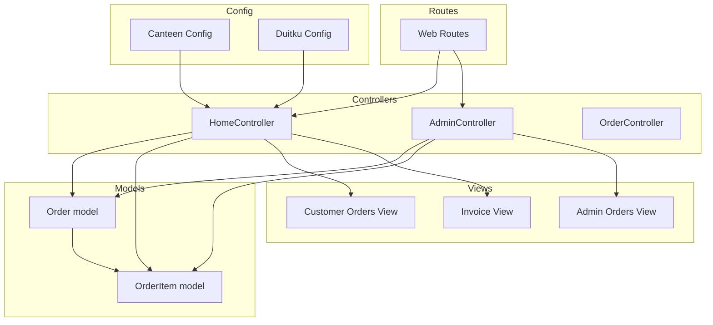
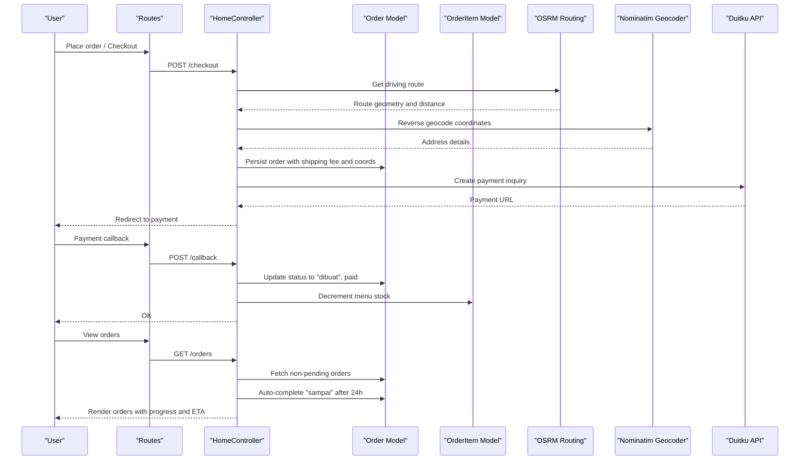
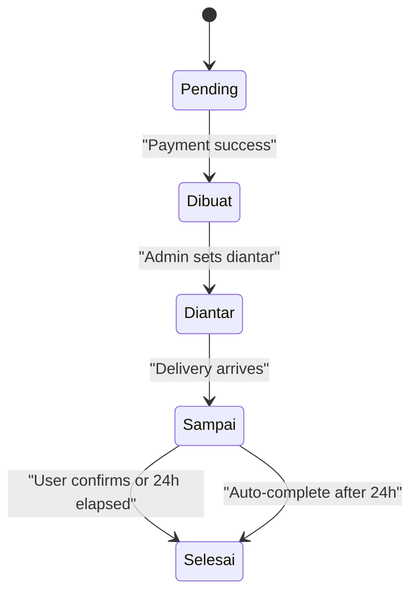
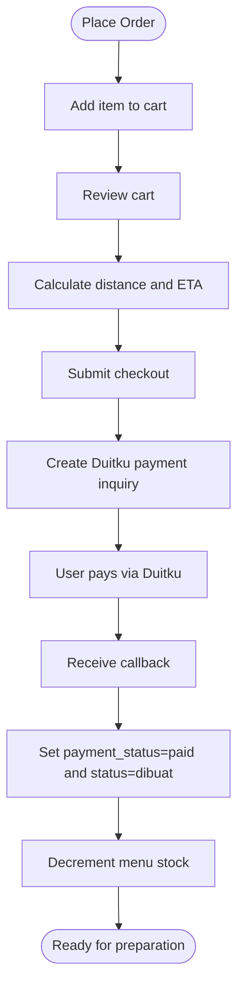
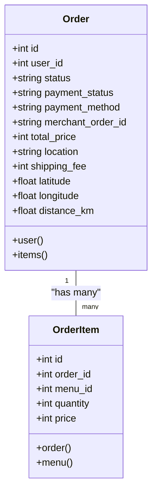
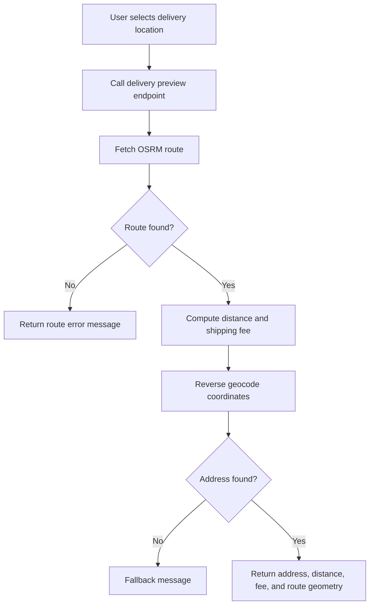
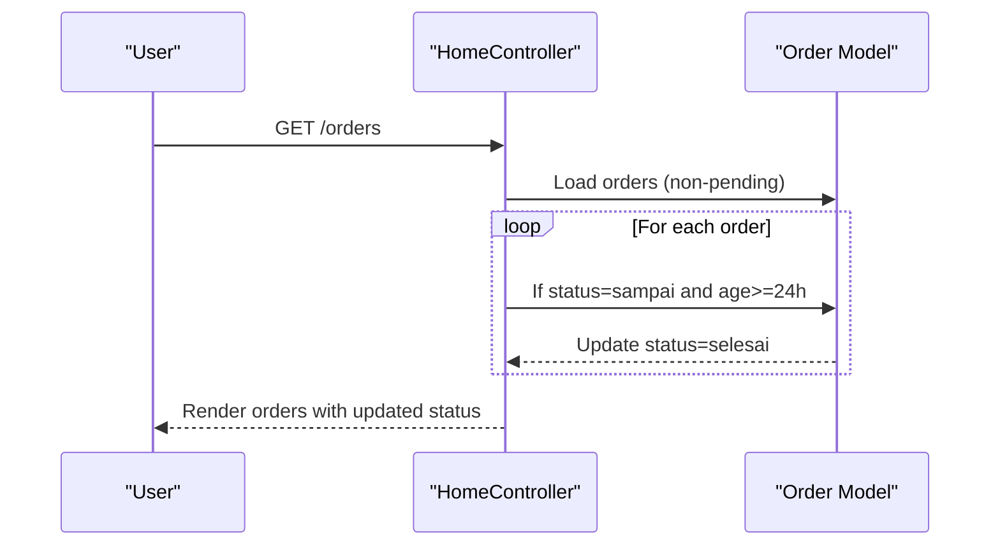
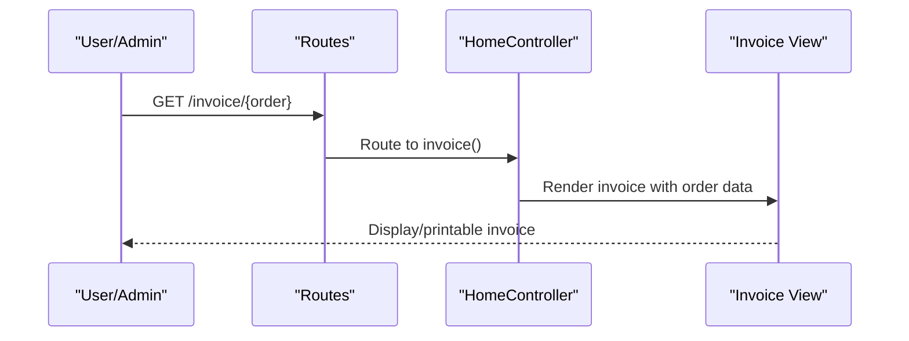
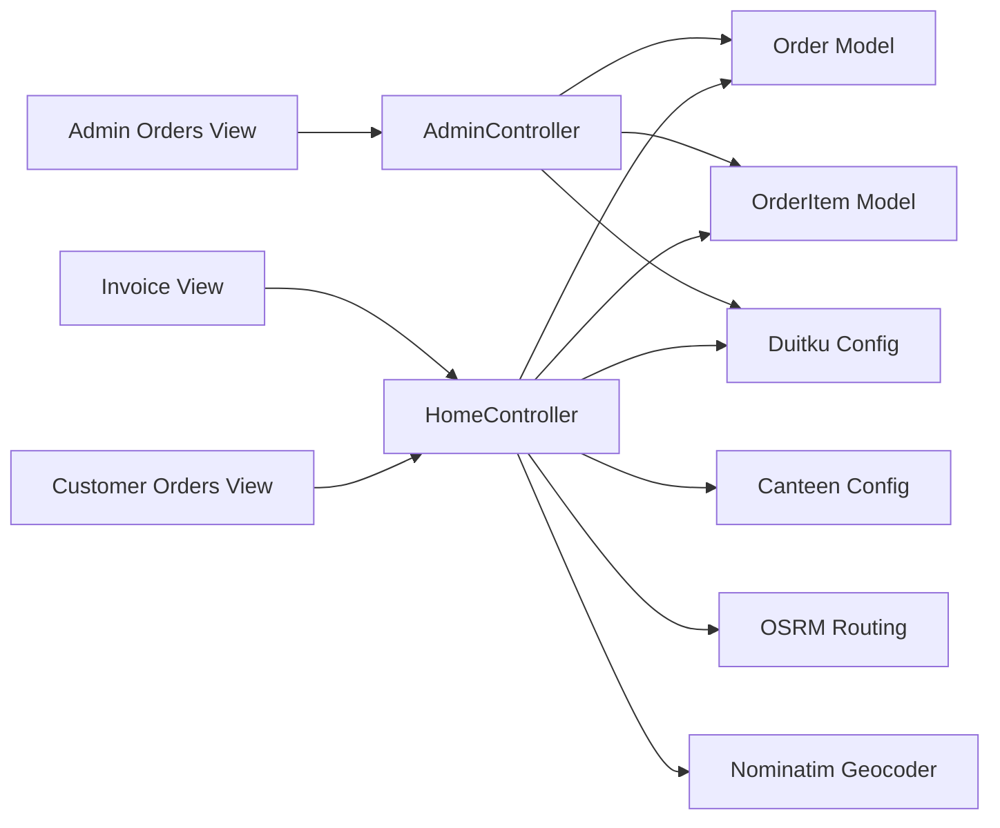

# Order Tracking & Management

<cite>
**Referenced Files in This Document**
- [OrderController.php](file://app/Http/Controllers/OrderController.php)
- [HomeController.php](file://app/Http/Controllers/HomeController.php)
- [AdminController.php](file://app/Http/Controllers/AdminController.php)
- [Order.php](file://app/Models/Order.php)
- [OrderItem.php](file://app/Models/OrderItem.php)
- [web.php](file://routes/web.php)
- [orders.blade.php](file://resources/views/orders.blade.php)
- [orders.blade.php (admin)](file://resources/views/admin/orders.blade.php)
- [show.blade.php](file://resources/views/invoice/show.blade.php)
- [2026_04_21_011703_create_orders_table.php](file://database/migrations/2026_04_21_011703_create_orders_table.php)
- [2026_05_18_020058_add_shipping_fields_to_orders_table.php](file://database/migrations/2026_05_18_020058_add_shipping_fields_to_orders_table.php)
- [2026_05_24_000000_add_payment_fields_to_orders_table.php](file://database/migrations/2026_05_24_000000_add_payment_fields_to_orders_table.php)
- [canteen.php](file://config/canteen.php)
- [duitku.php](file://config/duitku.php)
</cite>

## Table of Contents
1. [Introduction](#introduction)
2. [Project Structure](#project-structure)
3. [Core Components](#core-components)
4. [Architecture Overview](#architecture-overview)
5. [Detailed Component Analysis](#detailed-component-analysis)
6. [Dependency Analysis](#dependency-analysis)
7. [Performance Considerations](#performance-considerations)
8. [Troubleshooting Guide](#troubleshooting-guide)
9. [Conclusion](#conclusion)

## Introduction
This document explains the order tracking and management functionality in the Kantin Ibu Ida system. It covers the complete order lifecycle from placement and confirmation, through status tracking and delivery monitoring, to order completion. It documents the user interface components for viewing order history, inspecting individual order details, understanding status indicators, and accessing delivery information. Guidance is provided on order status meanings, timeline expectations, and delivery tracking mechanisms. Practical scenarios demonstrate how to view order history, check current order status, confirm delivery receipt, and access invoices. Known issues such as status update delays, delivery tracking problems, order modification limitations, and invoice generation issues are addressed along with automated workflows for status transitions and completion.

## Project Structure
The order management system spans controllers, models, Blade templates, routes, and configuration files. The key areas are:
- Controllers: Home, Admin, and a placeholder Order controller
- Models: Order and OrderItem with relationships
- Views: Customer order list, admin order list, and invoice
- Routes: Public and admin endpoints for order actions
- Configurations: Canteen location and delivery range, Duitku payment integration

**Diagram sources**
- [HomeController.php:12-568](file://app/Http/Controllers/HomeController.php#L12-L568)
- [AdminController.php:10-257](file://app/Http/Controllers/AdminController.php#L10-L257)
- [OrderController.php:7-10](file://app/Http/Controllers/OrderController.php#L7-L10)
- [Order.php:8-35](file://app/Models/Order.php#L8-L35)
- [OrderItem.php:8-28](file://app/Models/OrderItem.php#L8-L28)
- [orders.blade.php:1-186](file://resources/views/orders.blade.php#L1-L186)
- [orders.blade.php (admin):1-118](file://resources/views/admin/orders.blade.php#L1-L118)
- [show.blade.php:1-125](file://resources/views/invoice/show.blade.php#L1-L125)
- [web.php:1-71](file://routes/web.php#L1-L71)
- [canteen.php:1-9](file://config/canteen.php#L1-L9)
- [duitku.php:1-12](file://config/duitku.php#L1-L12)

**Section sources**
- [web.php:33-48](file://routes/web.php#L33-L48)
- [web.php:52-70](file://routes/web.php#L52-L70)

## Core Components
- Order model: Stores order metadata, status, pricing, and delivery coordinates; defines relationships to User and OrderItem.
- OrderItem model: Links orders to menu items with quantity and price; belongs to Order and Menu.
- HomeController: Implements order placement, cart updates, checkout, payment callbacks, order history retrieval, delivery tracking, and automatic completion logic.
- AdminController: Provides admin order listing, status updates, and POS checkout with payment processing.
- Blade views: Present order history, progress steps, delivery info, and invoices.
- Routes: Define endpoints for customer and admin order workflows.
- Configurations: Canteen location and max delivery distance; Duitku merchant credentials and endpoints.

**Section sources**
- [Order.php:12-35](file://app/Models/Order.php#L12-L35)
- [OrderItem.php:12-28](file://app/Models/OrderItem.php#L12-L28)
- [HomeController.php:34-568](file://app/Http/Controllers/HomeController.php#L34-L568)
- [AdminController.php:97-257](file://app/Http/Controllers/AdminController.php#L97-L257)
- [orders.blade.php:6-26](file://resources/views/orders.blade.php#L6-L26)
- [orders.blade.php (admin):7-10](file://resources/views/admin/orders.blade.php#L7-L10)
- [show.blade.php:6-12](file://resources/views/invoice/show.blade.php#L6-L12)
- [web.php:33-70](file://routes/web.php#L33-L70)
- [canteen.php:4-8](file://config/canteen.php#L4-L8)
- [duitku.php:3-11](file://config/duitku.php#L3-L11)

## Architecture Overview
The order lifecycle integrates frontend views, backend controllers, Eloquent models, routing, and external payment APIs. Payments are processed via Duitku; delivery tracking uses OSRM routing and reverse geocoding; order status progresses automatically upon payment confirmation and time-based completion.

**Diagram sources**
- [web.php:37-47](file://routes/web.php#L37-L47)
- [HomeController.php:275-452](file://app/Http/Controllers/HomeController.php#L275-L452)
- [HomeController.php:502-545](file://app/Http/Controllers/HomeController.php#L502-L545)
- [HomeController.php:470-500](file://app/Http/Controllers/HomeController.php#L470-L500)
- [Order.php:12-35](file://app/Models/Order.php#L12-L35)
- [OrderItem.php:12-28](file://app/Models/OrderItem.php#L12-L28)
- [canteen.php:4-8](file://config/canteen.php#L4-L8)
- [duitku.php:3-11](file://config/duitku.php#L3-L11)

## Detailed Component Analysis

### Order Lifecycle and Status Transitions
- Status values: pending, dibuat, diantar, sampai, selesai.
- Automatic transitions:
  - Payment success callback sets status to dibuat and payment_status to paid.
  - After 24 hours in sampai status, orders are automatically completed to selesai.
- Manual transitions (admin):
  - Admin can set dibuat, diantar, sampai, selesai from the admin panel.

**Diagram sources**
- [HomeController.php:424-447](file://app/Http/Controllers/HomeController.php#L424-L447)
- [HomeController.php:477-486](file://app/Http/Controllers/HomeController.php#L477-L486)
- [AdminController.php:115-121](file://app/Http/Controllers/AdminController.php#L115-L121)
- [orders.blade.php:8-25](file://resources/views/orders.blade.php#L8-L25)
- [orders.blade.php (admin):7-9](file://resources/views/admin/orders.blade.php#L7-L9)

**Section sources**
- [HomeController.php:424-447](file://app/Http/Controllers/HomeController.php#L424-L447)
- [HomeController.php:477-486](file://app/Http/Controllers/HomeController.php#L477-L486)
- [AdminController.php:115-121](file://app/Http/Controllers/AdminController.php#L115-L121)
- [orders.blade.php:8-25](file://resources/views/orders.blade.php#L8-L25)
- [orders.blade.php (admin):7-9](file://resources/views/admin/orders.blade.php#L7-L9)

### Order Placement and Confirmation
- Add to cart: Validates menu existence and stock availability, updates order totals.
- Cart review: Retrieves the active pending order and associated items.
- Delivery preview: Calculates distance, checks range, reverse geocodes address, and estimates shipping fee.
- Checkout: Finalizes order with location, shipping fee, coordinates, and initiates Duitku payment.
- Payment callback: Verifies signature, marks payment as paid, sets status to dibuat, decrements menu stock.

**Diagram sources**
- [HomeController.php:57-114](file://app/Http/Controllers/HomeController.php#L57-L114)
- [HomeController.php:127-190](file://app/Http/Controllers/HomeController.php#L127-L190)
- [HomeController.php:275-408](file://app/Http/Controllers/HomeController.php#L275-L408)
- [HomeController.php:410-452](file://app/Http/Controllers/HomeController.php#L410-L452)

**Section sources**
- [HomeController.php:57-114](file://app/Http/Controllers/HomeController.php#L57-L114)
- [HomeController.php:127-190](file://app/Http/Controllers/HomeController.php#L127-L190)
- [HomeController.php:275-408](file://app/Http/Controllers/HomeController.php#L275-L408)
- [HomeController.php:410-452](file://app/Http/Controllers/HomeController.php#L410-L452)

### Order History and Individual Order Details
- Customer view:
  - Lists recent non-pending orders with status progress, delivery map, ETA, and summary.
  - Includes actions: view invoice, confirm delivery when status is sampai.
- Admin view:
  - Lists all orders with user info, payment status, and editable status dropdown.
  - Shows compact status steps and itemized breakdown.

**Diagram sources**
- [Order.php:12-35](file://app/Models/Order.php#L12-L35)
- [OrderItem.php:12-28](file://app/Models/OrderItem.php#L12-L28)

**Section sources**
- [orders.blade.php:44-182](file://resources/views/orders.blade.php#L44-L182)
- [orders.blade.php (admin):24-116](file://resources/views/admin/orders.blade.php#L24-L116)
- [Order.php:12-35](file://app/Models/Order.php#L12-L35)
- [OrderItem.php:12-28](file://app/Models/OrderItem.php#L12-L28)

### Delivery Monitoring and ETA
- Distance calculation uses OSRM driving route service.
- Reverse geocoding via Nominatim provides human-readable address.
- ETA logic:
  - dibuat: kitchen preparation note
  - diantar: courier en route note
  - sampai: “tiba” and prompt for confirmation
  - selesai: “selesai”

**Diagram sources**
- [HomeController.php:127-190](file://app/Http/Controllers/HomeController.php#L127-L190)
- [HomeController.php:514-545](file://app/Http/Controllers/HomeController.php#L514-L545)

**Section sources**
- [HomeController.php:127-190](file://app/Http/Controllers/HomeController.php#L127-L190)
- [HomeController.php:514-545](file://app/Http/Controllers/HomeController.php#L514-L545)
- [orders.blade.php:100-114](file://resources/views/orders.blade.php#L100-L114)

### Order Completion Workflow
- Manual completion: User confirms receipt when status is sampai.
- Automatic completion: Orders in sampai status older than 24 hours are set to selesai.

**Diagram sources**
- [HomeController.php:470-499](file://app/Http/Controllers/HomeController.php#L470-L499)
- [HomeController.php:477-486](file://app/Http/Controllers/HomeController.php#L477-L486)

**Section sources**
- [HomeController.php:470-499](file://app/Http/Controllers/HomeController.php#L470-L499)
- [HomeController.php:477-486](file://app/Http/Controllers/HomeController.php#L477-L486)

### Invoice Generation and Access
- Accessible via dedicated route; supports printing or saving as PDF.
- Includes buyer/seller info, product details, quantities, unit prices, totals, shipping fee, payment method, and watermark for paid/unpaid.

**Diagram sources**
- [web.php:47](file://routes/web.php#L47)
- [HomeController.php:459-468](file://app/Http/Controllers/HomeController.php#L459-L468)
- [show.blade.php:14-124](file://resources/views/invoice/show.blade.php#L14-L124)

**Section sources**
- [web.php:47](file://routes/web.php#L47)
- [HomeController.php:459-468](file://app/Http/Controllers/HomeController.php#L459-L468)
- [show.blade.php:14-124](file://resources/views/invoice/show.blade.php#L14-L124)

## Dependency Analysis
- Controllers depend on models and configuration.
- Views depend on controller-provided data and routes.
- External services: OSRM for routing, Nominatim for geocoding, Duitku for payments.

**Diagram sources**
- [HomeController.php:502-568](file://app/Http/Controllers/HomeController.php#L502-L568)
- [AdminController.php:129-257](file://app/Http/Controllers/AdminController.php#L129-L257)
- [orders.blade.php:1-186](file://resources/views/orders.blade.php#L1-L186)
- [orders.blade.php (admin):1-118](file://resources/views/admin/orders.blade.php#L1-L118)
- [show.blade.php:1-125](file://resources/views/invoice/show.blade.php#L1-L125)
- [canteen.php:1-9](file://config/canteen.php#L1-L9)
- [duitku.php:1-12](file://config/duitku.php#L1-L12)

**Section sources**
- [HomeController.php:502-568](file://app/Http/Controllers/HomeController.php#L502-L568)
- [AdminController.php:129-257](file://app/Http/Controllers/AdminController.php#L129-L257)
- [orders.blade.php:1-186](file://resources/views/orders.blade.php#L1-L186)
- [orders.blade.php (admin):1-118](file://resources/views/admin/orders.blade.php#L1-L118)
- [show.blade.php:1-125](file://resources/views/invoice/show.blade.php#L1-L125)
- [canteen.php:1-9](file://config/canteen.php#L1-L9)
- [duitku.php:1-12](file://config/duitku.php#L1-L12)

## Performance Considerations
- Route and geocoding calls are retried and timeout-configured to improve reliability.
- Recalculation of order totals is performed after cart changes to keep pricing accurate.
- Admin and customer order lists load related data efficiently using eager loading.

[No sources needed since this section provides general guidance]

## Troubleshooting Guide
- Status update delays:
  - Ensure payment callback is reachable and signature verification passes; otherwise, status remains pending.
  - Verify Duitku configuration values and endpoints.
- Delivery tracking problems:
  - Confirm OSRM endpoint accessibility and that coordinates are valid.
  - If reverse geocoding fails, fallback messages guide users to reposition the pin or enter address manually.
- Order modification limitations:
  - Items can only be modified while status is pending and location is unset or not flagged as “Kasir”.
- Invoice generation issues:
  - Ensure the logged-in user has permission to view the invoice (owner or admin).
  - Confirm order data is loaded with user and items relations.

**Section sources**
- [HomeController.php:410-452](file://app/Http/Controllers/HomeController.php#L410-L452)
- [HomeController.php:559-566](file://app/Http/Controllers/HomeController.php#L559-L566)
- [HomeController.php:127-190](file://app/Http/Controllers/HomeController.php#L127-L190)
- [HomeController.php:502-545](file://app/Http/Controllers/HomeController.php#L502-L545)
- [HomeController.php:192-263](file://app/Http/Controllers/HomeController.php#L192-L263)
- [HomeController.php:459-468](file://app/Http/Controllers/HomeController.php#L459-L468)

## Conclusion
The Kantin Ibu Ida order tracking and management system provides a robust lifecycle from cart to completion. Users benefit from clear status indicators, delivery monitoring, and easy access to invoices. Admins can oversee and adjust order states. Automated transitions and safeguards (stock updates, 24-hour auto-completion) streamline operations. Integrations with Duitku, OSRM, and Nominatim offer reliable payment processing and logistics support.