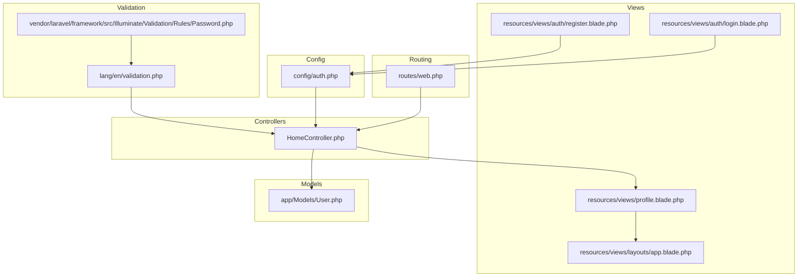
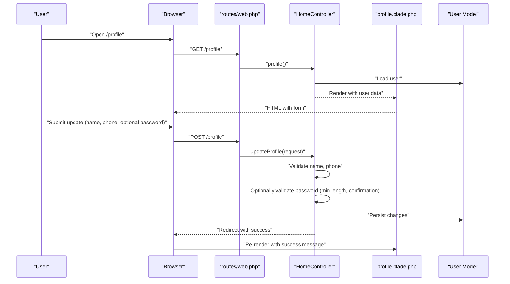
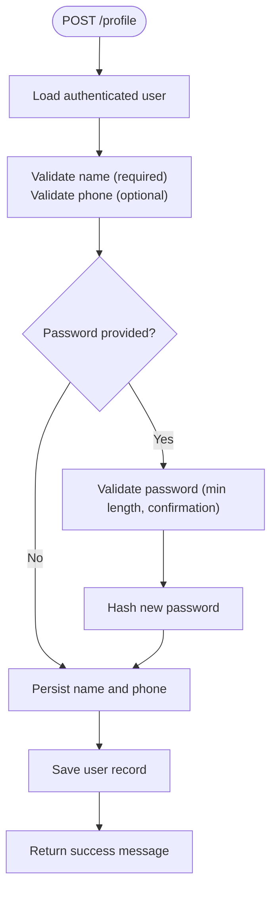
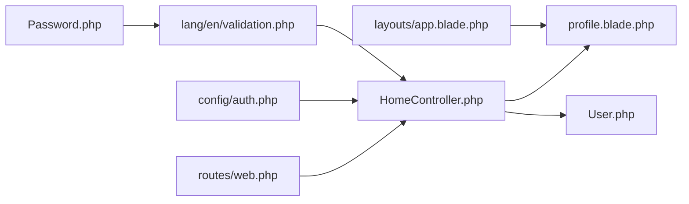

# Profile Management

<cite>
**Referenced Files in This Document**
- [profile.blade.php](file://resources/views/profile.blade.php)
- [HomeController.php](file://app/Http/Controllers/HomeController.php)
- [web.php](file://routes/web.php)
- [User.php](file://app/Models/User.php)
- [auth.php](file://config/auth.php)
- [app.blade.php](file://resources/views/layouts/app.blade.php)
- [login.blade.php](file://resources/views/auth/login.blade.php)
- [register.blade.php](file://resources/views/auth/register.blade.php)
- [validation.php](file://lang/en/validation.php)
- [Password.php](file://vendor/laravel/framework/src/Illuminate/Validation/Rules/Password.php)
</cite>

## Table of Contents
1. [Introduction](#introduction)
2. [Project Structure](#project-structure)
3. [Core Components](#core-components)
4. [Architecture Overview](#architecture-overview)
5. [Detailed Component Analysis](#detailed-component-analysis)
6. [Dependency Analysis](#dependency-analysis)
7. [Performance Considerations](#performance-considerations)
8. [Troubleshooting Guide](#troubleshooting-guide)
9. [Conclusion](#conclusion)
10. [Appendices](#appendices)

## Introduction
This document explains the user profile management and personal information maintenance capabilities in the Kantin Ibu Ida system. It covers the complete workflow for viewing and editing personal details, updating contact information, changing passwords, and managing profile preferences. It also documents the user interface components, validation feedback mechanisms, and security considerations for password changes. Practical scenarios and troubleshooting guidance are included to help users and administrators resolve common profile-related issues.

## Project Structure
Profile management spans several layers:
- Routes define the profile endpoints and access control.
- The HomeController handles profile rendering and updates.
- Blade templates render the profile page, including tabs for account and settings.
- The User model defines the persisted attributes and hidden fields.
- Authentication configuration governs session and password reset behavior.
- Validation language files provide localized error messages.
- The base layout integrates Alpine.js stores for theme and motion preferences.

**Diagram sources**
- [web.php:33-36](file://routes/web.php#L33-L36)
- [HomeController.php:31-55](file://app/Http/Controllers/HomeController.php#L31-L55)
- [profile.blade.php:1-161](file://resources/views/profile.blade.php#L1-L161)
- [app.blade.php:1-185](file://resources/views/layouts/app.blade.php#L1-L185)
- [login.blade.php:1-72](file://resources/views/auth/login.blade.php#L1-L72)
- [register.blade.php:1-89](file://resources/views/auth/register.blade.php#L1-L89)
- [User.php:1-55](file://app/Models/User.php#L1-L55)
- [auth.php:1-116](file://config/auth.php#L1-L116)
- [validation.php:1-197](file://lang/en/validation.php#L1-L197)
- [Password.php:1-200](file://vendor/laravel/framework/src/Illuminate/Validation/Rules/Password.php#L1-L200)

**Section sources**
- [web.php:33-36](file://routes/web.php#L33-L36)
- [HomeController.php:31-55](file://app/Http/Controllers/HomeController.php#L31-L55)
- [profile.blade.php:1-161](file://resources/views/profile.blade.php#L1-L161)
- [app.blade.php:1-185](file://resources/views/layouts/app.blade.php#L1-L185)
- [User.php:1-55](file://app/Models/User.php#L1-L55)
- [auth.php:1-116](file://config/auth.php#L1-L116)
- [validation.php:1-197](file://lang/en/validation.php#L1-L197)
- [Password.php:1-200](file://vendor/laravel/framework/src/Illuminate/Validation/Rules/Password.php#L1-L200)

## Core Components
- Profile page template: Presents account details, editable fields, password change inputs, and settings for theme and motion preferences. It displays success and first-error notifications and renders a last-updated timestamp.
- Profile controller actions: Serve the profile view and process updates, including name, phone, and optional password changes.
- Authentication and session: Enforced by middleware on profile routes; logout clears session and CSRF tokens.
- Validation and localization: Uses Laravel’s validation rules and language files for consistent error messaging.
- Theme and motion preferences: Managed client-side via Alpine.js stores and persisted in localStorage, applied through the base layout.

Key responsibilities:
- Render profile with current user data and navigation.
- Validate and persist personal details and optional password changes.
- Provide visual feedback for success and validation errors.
- Maintain user preferences independently of server-side persistence.

**Section sources**
- [profile.blade.php:58-96](file://resources/views/profile.blade.php#L58-L96)
- [HomeController.php:31-55](file://app/Http/Controllers/HomeController.php#L31-L55)
- [web.php:33-36](file://routes/web.php#L33-L36)
- [app.blade.php:32-59](file://resources/views/layouts/app.blade.php#L32-L59)
- [validation.php:1-197](file://lang/en/validation.php#L1-L197)

## Architecture Overview
The profile management flow connects routing, controller logic, and view rendering while leveraging authentication and validation.

**Diagram sources**
- [web.php:33-36](file://routes/web.php#L33-L36)
- [HomeController.php:31-55](file://app/Http/Controllers/HomeController.php#L31-L55)
- [profile.blade.php:58-96](file://resources/views/profile.blade.php#L58-L96)
- [User.php:19-25](file://app/Models/User.php#L19-L25)

## Detailed Component Analysis

### Profile View Template
The profile page is structured as a dashboard with:
- Sidebar with avatar initials, tier badge, and navigation between “Account” and “Settings.”
- Account tab containing:
  - Read-only email field.
  - Editable name and phone fields.
  - Optional password and confirmation fields.
  - Save button and success/error notifications.
  - Last-updated timestamp.
- Settings tab for:
  - Theme selection (light/dark).
  - Reduce motion toggle.
These preferences are stored client-side via Alpine.js stores and synchronized across sessions.

UI components and interactions:
- Form submission posts to the profile update endpoint.
- Validation errors are shown as a highlighted alert.
- Success messages appear after successful saves.

Security note:
- Email is read-only to prevent accidental duplication or unauthorized changes.

**Section sources**
- [profile.blade.php:6-40](file://resources/views/profile.blade.php#L6-L40)
- [profile.blade.php:58-96](file://resources/views/profile.blade.php#L58-L96)
- [profile.blade.php:99-139](file://resources/views/profile.blade.php#L99-L139)
- [app.blade.php:32-59](file://resources/views/layouts/app.blade.php#L32-L59)

### Profile Controller Actions
The controller exposes two primary actions:
- profile(): Returns the profile view with the authenticated user and order history.
- updateProfile(): Validates and persists:
  - Required name (string, max length).
  - Optional phone (string, max length).
  - Optional password: validated only if provided (minimum length and confirmation).
  - On success, persists changes and returns a success message.

Processing logic highlights:
- Conditional password validation ensures only provided passwords are validated.
- Hashing is handled internally by the controller when a new password is supplied.
- Redirect with success flash message communicates outcome.

**Diagram sources**
- [HomeController.php:38-55](file://app/Http/Controllers/HomeController.php#L38-L55)

**Section sources**
- [HomeController.php:31-55](file://app/Http/Controllers/HomeController.php#L31-L55)

### Routing and Access Control
Profile endpoints:
- GET /profile renders the profile page.
- POST /profile processes updates.

Access control:
- Profile routes are wrapped in an auth middleware group, ensuring only logged-in users can access profile pages and submit updates.

Logout behavior:
- POST /logout clears the session, invalidates the session, regenerates the CSRF token, and redirects to home.

**Section sources**
- [web.php:33-36](file://routes/web.php#L33-L36)
- [web.php:31-31](file://routes/web.php#L31-L31)

### User Model and Hidden Attributes
The User model defines:
- Fillable attributes: name, email, password, phone, is_admin.
- Hidden attributes: password, remember_token.
- Casts: email_verified_at as datetime; password as hashed.

Implications:
- Phone is mutable via profile updates.
- Email is intentionally not editable in the profile form (read-only).
- Password hashing is handled by the model’s casts.

**Section sources**
- [User.php:19-25](file://app/Models/User.php#L19-L25)
- [User.php:32-35](file://app/Models/User.php#L32-L35)
- [User.php:42-48](file://app/Models/User.php#L42-L48)

### Validation and Error Feedback
Validation rules enforced by the controller:
- Name: required, string, max length.
- Phone: nullable, string, max length.
- Password: validated only when provided; minimum length and confirmation required.

Localized error messages:
- The validation language file provides standardized messages for required fields, confirmation mismatches, and other constraints.

Client-side feedback:
- The profile view displays a success message when present and the first validation error otherwise.

**Section sources**
- [HomeController.php:41-44](file://app/Http/Controllers/HomeController.php#L41-L44)
- [HomeController.php:48-50](file://app/Http/Controllers/HomeController.php#L48-L50)
- [validation.php:16-164](file://lang/en/validation.php#L16-L164)
- [profile.blade.php:50-56](file://resources/views/profile.blade.php#L50-L56)

### Password Strength and Security Considerations
Current implementation:
- Passwords are validated for minimum length and confirmation when changed.
- The model’s password cast ensures secure hashing.

Recommended enhancements (best practice):
- Enforce stronger password policies (mixed case, numbers, symbols).
- Integrate a dedicated password rule with configurable complexity.
- Add rate limiting for password change attempts.
- Consider requiring current password confirmation before allowing changes.

Note: The project’s validation language supports advanced password rules, but the controller currently applies minimal checks for password changes.

**Section sources**
- [validation.php:120-126](file://lang/en/validation.php#L120-L126)
- [Password.php:147-154](file://vendor/laravel/framework/src/Illuminate/Validation/Rules/Password.php#L147-L154)
- [HomeController.php:48-50](file://app/Http/Controllers/HomeController.php#L48-L50)

### Profile Preferences (Theme and Motion)
Preferences are managed client-side:
- Theme: light or dark mode toggled via Alpine store and persisted in localStorage.
- Reduce motion: toggle to minimize animations.
- Applied globally through the base layout’s initialization script.

Effects:
- Changes take effect immediately without server round-trips.
- Preferences persist across sessions until manually changed.

**Section sources**
- [app.blade.php:32-59](file://resources/views/layouts/app.blade.php#L32-L59)
- [profile.blade.php:111-137](file://resources/views/profile.blade.php#L111-L137)

## Dependency Analysis
Profile management depends on:
- Routing: Defines endpoints and middleware grouping.
- Controller: Orchestrates data retrieval, validation, persistence, and response.
- View: Renders UI, collects user input, and presents feedback.
- Model: Persists user attributes and enforces hidden/security attributes.
- Config: Authentication guard and password reset configuration.
- Validation: Localized messages and rule enforcement.

**Diagram sources**
- [web.php:33-36](file://routes/web.php#L33-L36)
- [HomeController.php:31-55](file://app/Http/Controllers/HomeController.php#L31-L55)
- [profile.blade.php:1-161](file://resources/views/profile.blade.php#L1-L161)
- [User.php:1-55](file://app/Models/User.php#L1-L55)
- [auth.php:1-116](file://config/auth.php#L1-L116)
- [validation.php:1-197](file://lang/en/validation.php#L1-L197)
- [Password.php:1-200](file://vendor/laravel/framework/src/Illuminate/Validation/Rules/Password.php#L1-L200)
- [app.blade.php:1-185](file://resources/views/layouts/app.blade.php#L1-L185)

**Section sources**
- [web.php:33-36](file://routes/web.php#L33-L36)
- [HomeController.php:31-55](file://app/Http/Controllers/HomeController.php#L31-L55)
- [profile.blade.php:1-161](file://resources/views/profile.blade.php#L1-L161)
- [User.php:1-55](file://app/Models/User.php#L1-L55)
- [auth.php:1-116](file://config/auth.php#L1-L116)
- [validation.php:1-197](file://lang/en/validation.php#L1-L197)
- [Password.php:1-200](file://vendor/laravel/framework/src/Illuminate/Validation/Rules/Password.php#L1-L200)
- [app.blade.php:1-185](file://resources/views/layouts/app.blade.php#L1-L185)

## Performance Considerations
- Profile rendering: Minimal database queries; user loaded once per request.
- Validation: Lightweight server-side checks; client-side Alpine.js avoids unnecessary requests for preferences.
- Persistence: Single save operation for profile updates; password hashing adds negligible overhead.
- Recommendations:
  - Keep validation rules concise to avoid heavy computations.
  - Avoid frequent preference reads/writes; rely on localStorage for UI state.

[No sources needed since this section provides general guidance]

## Troubleshooting Guide
Common issues and resolutions:
- Validation errors:
  - Symptoms: Error message displayed on the profile page.
  - Causes: Missing name, invalid phone format, or mismatched password confirmation.
  - Resolution: Correct inputs according to validation rules; ensure password confirmation matches.
- Duplicate email address:
  - Note: Email is read-only in the profile form; registration form enforces uniqueness. If encountering email conflicts elsewhere, verify uniqueness constraints.
- Password change failures:
  - Symptoms: Failure to update password.
  - Causes: Password not provided, shorter than minimum length, or confirmation mismatch.
  - Resolution: Provide a new password meeting minimum length and confirmation requirements.
- Session and logout:
  - Symptoms: Stuck on profile after logout.
  - Resolution: Use the logout endpoint to clear session and CSRF token; refresh the page.
- Theme and motion preferences:
  - Symptoms: Preferences not sticking.
  - Resolution: Confirm Alpine.js store initialization and localStorage keys; clear browser cache if needed.

**Section sources**
- [profile.blade.php:50-56](file://resources/views/profile.blade.php#L50-L56)
- [HomeController.php:41-50](file://app/Http/Controllers/HomeController.php#L41-L50)
- [web.php:31-31](file://routes/web.php#L31-L31)
- [app.blade.php:32-59](file://resources/views/layouts/app.blade.php#L32-L59)

## Conclusion
The profile management system provides a straightforward workflow for updating personal details, optional password changes, and adjusting UI preferences. It leverages Laravel’s validation and authentication systems, with a clean separation between server-side persistence and client-side UI state. Enhancing password policies and adding confirmation for sensitive changes would further strengthen security.

[No sources needed since this section summarizes without analyzing specific files]

## Appendices

### Practical Scenarios and Procedures
- Updating personal details:
  - Navigate to the profile page, edit name and phone, optionally enter a new password and confirmation, then click save.
- Changing contact information:
  - Modify the phone number field; ensure it adheres to the maximum length constraint.
- Modifying account preferences:
  - Switch theme (light/dark) and toggle reduce motion in the settings tab; changes apply instantly.
- Resetting password:
  - Use the optional password fields to set a new password; ensure it meets minimum length and confirmation requirements.

[No sources needed since this section provides general guidance]