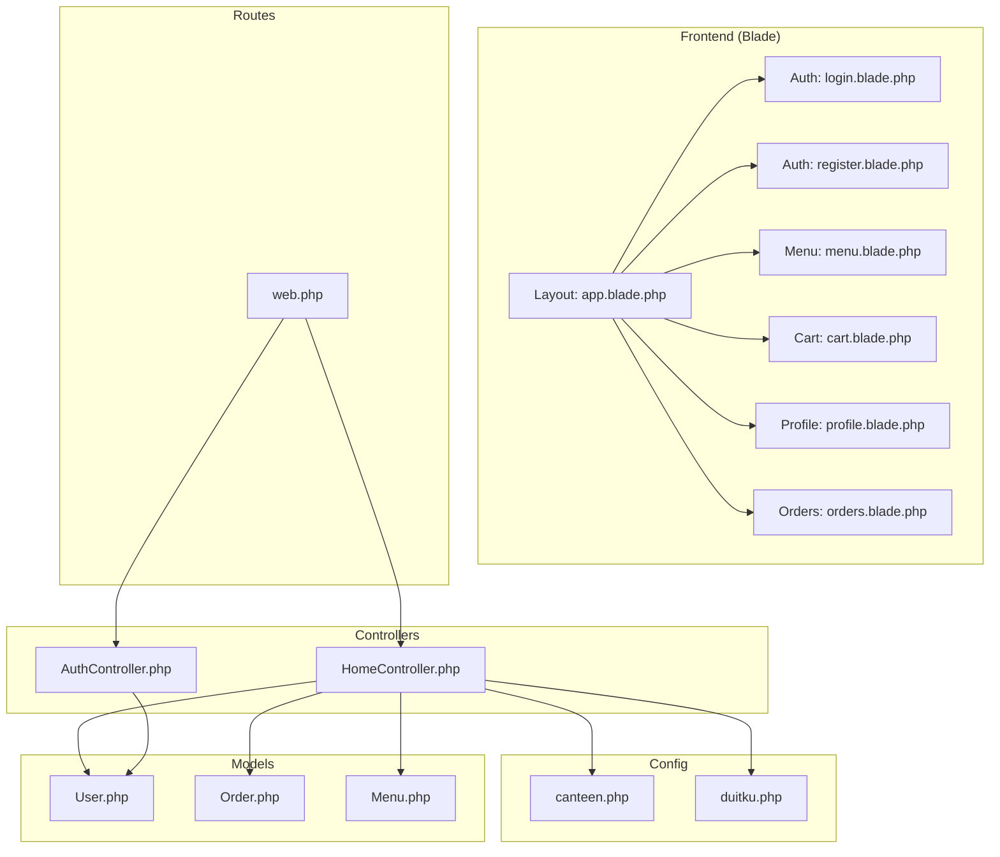
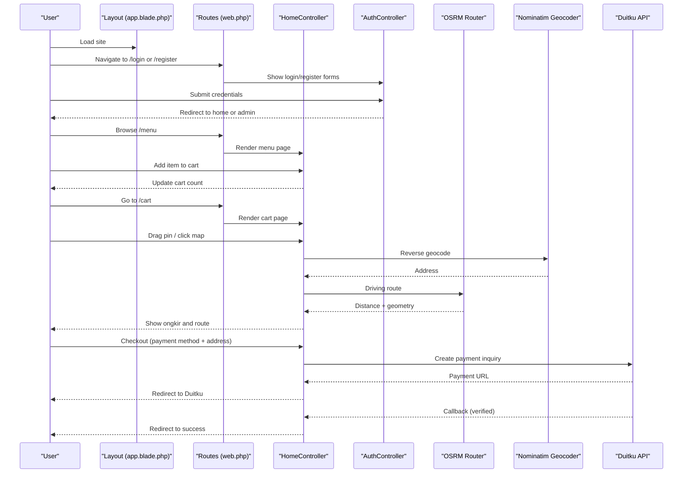
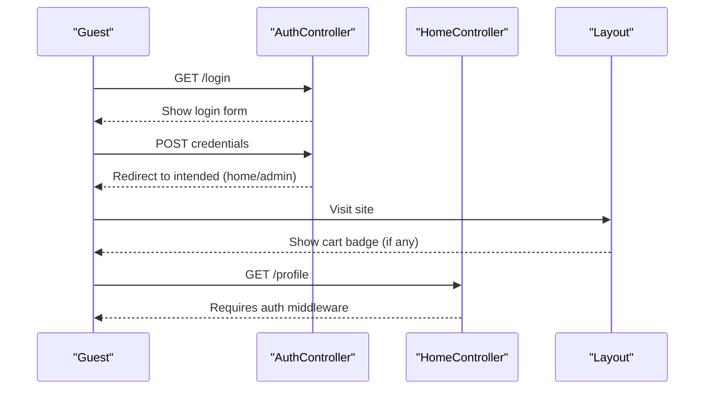
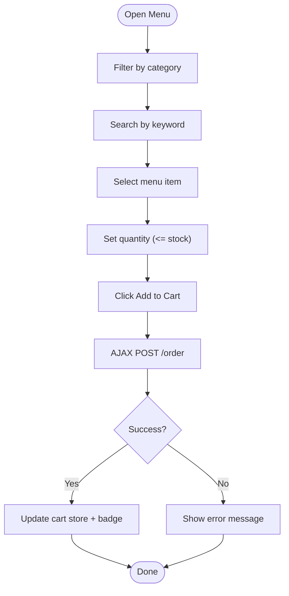
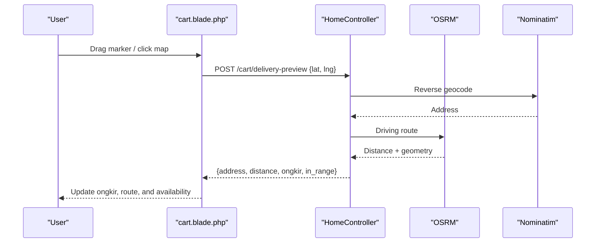
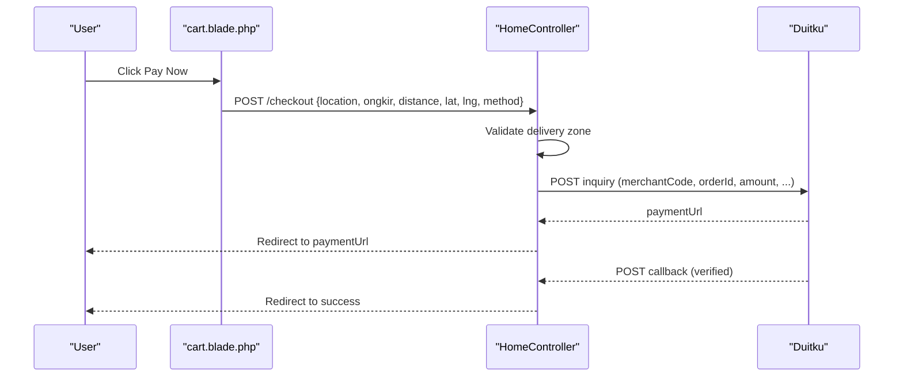
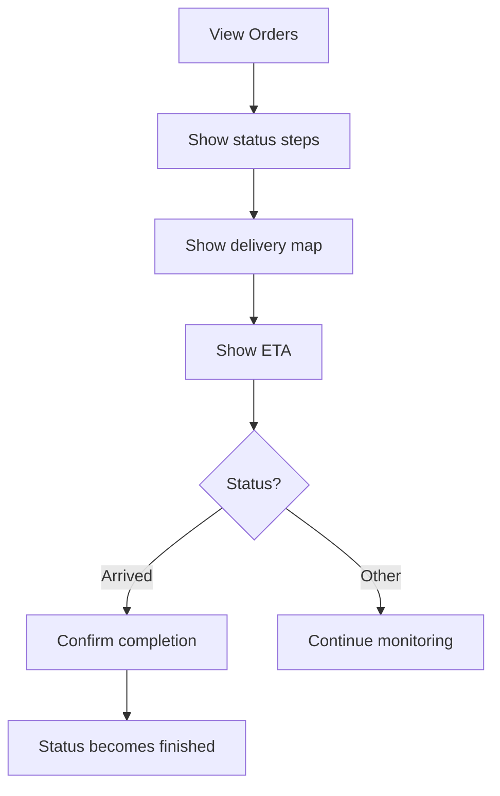
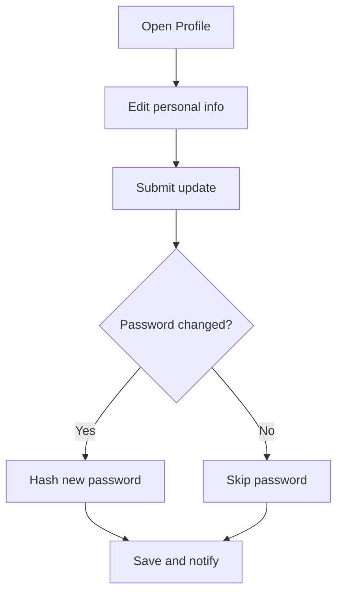
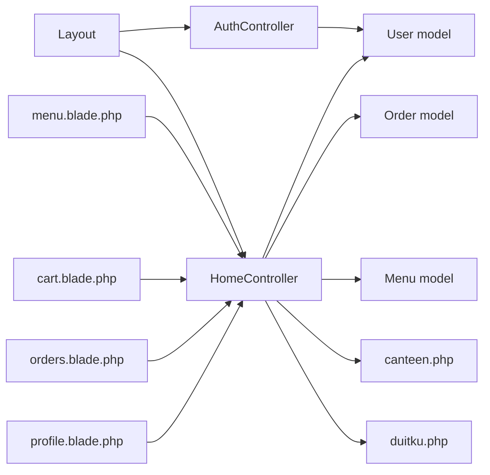

# User Guide

<cite>
**Referenced Files in This Document**
- [AuthController.php](file://app/Http/Controllers/AuthController.php)
- [HomeController.php](file://app/Http/Controllers/HomeController.php)
- [web.php](file://routes/web.php)
- [app.blade.php](file://resources/views/layouts/app.blade.php)
- [login.blade.php](file://resources/views/auth/login.blade.php)
- [register.blade.php](file://resources/views/auth/register.blade.php)
- [cart.blade.php](file://resources/views/cart.blade.php)
- [menu.blade.php](file://resources/views/menu.blade.php)
- [profile.blade.php](file://resources/views/profile.blade.php)
- [orders.blade.php](file://resources/views/orders.blade.php)
- [canteen.php](file://config/canteen.php)
- [duitku.php](file://config/duitku.php)
- [User.php](file://app/Models/User.php)
- [Order.php](file://app/Models/Order.php)
- [Menu.php](file://app/Models/Menu.php)
</cite>

## Table of Contents
1. [Introduction](#introduction)
2. [Project Structure](#project-structure)
3. [Core Components](#core-components)
4. [Architecture Overview](#architecture-overview)
5. [Detailed Component Analysis](#detailed-component-analysis)
6. [Dependency Analysis](#dependency-analysis)
7. [Performance Considerations](#performance-considerations)
8. [Troubleshooting Guide](#troubleshooting-guide)
9. [Conclusion](#conclusion)
10. [Appendices](#appendices)

## Introduction
This guide explains the end-user experience and workflows in the Kantin Ibu Ida system. It covers how customers register and log in, browse menus, manage their shopping cart, check out securely, and track orders. It also documents profile management, order history, and delivery tracking. Practical scenarios illustrate adding items, adjusting quantities, updating personal details, and confirming completed orders. Accessibility and mobile responsiveness are addressed, along with answers to common questions about ordering, payments, delivery zones, and order changes.

## Project Structure
The application follows a standard Laravel MVC pattern with Blade templates for the frontend and controller actions handling user journeys. Routes define the URLs for authentication, menu browsing, cart operations, checkout, and order tracking. Configuration files define canteen location, delivery range, and payment gateway integration.

**Diagram sources**
- [web.php:1-71](file://routes/web.php#L1-L71)
- [AuthController.php:10-78](file://app/Http/Controllers/AuthController.php#L10-L78)
- [HomeController.php:12-568](file://app/Http/Controllers/HomeController.php#L12-L568)
- [app.blade.php:1-185](file://resources/views/layouts/app.blade.php#L1-L185)
- [login.blade.php:1-72](file://resources/views/auth/login.blade.php#L1-L72)
- [register.blade.php:1-89](file://resources/views/auth/register.blade.php#L1-L89)
- [menu.blade.php:1-105](file://resources/views/menu.blade.php#L1-L105)
- [cart.blade.php:1-452](file://resources/views/cart.blade.php#L1-L452)
- [profile.blade.php:1-161](file://resources/views/profile.blade.php#L1-L161)
- [orders.blade.php:1-186](file://resources/views/orders.blade.php#L1-L186)
- [canteen.php:1-9](file://config/canteen.php#L1-L9)
- [duitku.php:1-12](file://config/duitku.php#L1-L12)
- [User.php:10-55](file://app/Models/User.php#L10-L55)
- [Order.php:8-36](file://app/Models/Order.php#L8-L36)
- [Menu.php:8-32](file://app/Models/Menu.php#L8-L32)

**Section sources**
- [web.php:1-71](file://routes/web.php#L1-L71)
- [app.blade.php:1-185](file://resources/views/layouts/app.blade.php#L1-L185)

## Core Components
- Authentication: Registration, login, logout handled by AuthController with email or username login and role-aware redirection.
- Menu browsing: Public menu catalog with filtering and search; authenticated users can add items to cart.
- Cart management: View current pending order, adjust quantities, remove items, preview delivery cost and route, and proceed to checkout.
- Checkout: Choose payment method, enter delivery address, validate location against configured range, and initiate secure payment via Duitku.
- Order tracking: View order history, progress steps, map, ETA, and confirm completion when delivered.
- Profile management: Update personal details and change password; configure display preferences.

**Section sources**
- [AuthController.php:10-78](file://app/Http/Controllers/AuthController.php#L10-L78)
- [HomeController.php:12-568](file://app/Http/Controllers/HomeController.php#L12-L568)
- [menu.blade.php:6-105](file://resources/views/menu.blade.php#L6-L105)
- [cart.blade.php:32-452](file://resources/views/cart.blade.php#L32-L452)
- [orders.blade.php:28-186](file://resources/views/orders.blade.php#L28-L186)
- [profile.blade.php:6-161](file://resources/views/profile.blade.php#L6-L161)

## Architecture Overview
The user interacts with Blade pages rendered by HomeController and AuthController. Routing groups protect authenticated routes. Delivery cost estimation integrates with OSRM and Nominatim. Payments integrate with Duitku inquiry endpoint and callback verification.

**Diagram sources**
- [web.php:27-48](file://routes/web.php#L27-L48)
- [AuthController.php:12-78](file://app/Http/Controllers/AuthController.php#L12-L78)
- [HomeController.php:116-408](file://app/Http/Controllers/HomeController.php#L116-L408)
- [cart.blade.php:122-318](file://resources/views/cart.blade.php#L122-L318)
- [canteen.php:3-9](file://config/canteen.php#L3-L9)
- [duitku.php:3-12](file://config/duitku.php#L3-L12)

## Detailed Component Analysis

### Authentication and Navigation
- Login supports email or username and redirects authenticated users to home; admins go to admin panel.
- Logout invalidates session and regenerates CSRF token.
- Navigation adapts for guests vs. authenticated users; cart badge reflects pending order quantity.

**Diagram sources**
- [web.php:27-31](file://routes/web.php#L27-L31)
- [AuthController.php:17-44](file://app/Http/Controllers/AuthController.php#L17-L44)
- [app.blade.php:95-122](file://resources/views/layouts/app.blade.php#L95-L122)

**Section sources**
- [AuthController.php:12-78](file://app/Http/Controllers/AuthController.php#L12-L78)
- [web.php:27-31](file://routes/web.php#L27-L31)
- [app.blade.php:95-122](file://resources/views/layouts/app.blade.php#L95-L122)

### Menu Browsing and Adding Items
- Users can filter by category and search by name/description.
- Add-to-cart uses AJAX to POST to the order endpoint; updates cart store immediately.
- Stock validation prevents overselling.

**Diagram sources**
- [menu.blade.php:32-100](file://resources/views/menu.blade.php#L32-L100)
- [HomeController.php:57-114](file://app/Http/Controllers/HomeController.php#L57-L114)

**Section sources**
- [menu.blade.php:6-105](file://resources/views/menu.blade.php#L6-L105)
- [HomeController.php:20-36](file://app/Http/Controllers/HomeController.php#L20-L36)

### Cart Management and Delivery Preview
- Cart displays items, allows increasing/decreasing quantities or removing items via AJAX.
- Delivery preview calculates distance and shipping fee using OSRM and Nominatim; shows route visualization.
- Location must be within configured max delivery radius.

**Diagram sources**
- [cart.blade.php:122-220](file://resources/views/cart.blade.php#L122-L220)
- [HomeController.php:127-190](file://app/Http/Controllers/HomeController.php#L127-L190)
- [canteen.php:3-9](file://config/canteen.php#L3-L9)

**Section sources**
- [cart.blade.php:32-452](file://resources/views/cart.blade.php#L32-L452)
- [HomeController.php:116-263](file://app/Http/Controllers/HomeController.php#L116-L263)

### Checkout and Payment
- Validates cart presence and non-empty items.
- Confirms delivery zone and computes shipping fee.
- Initiates Duitku payment inquiry and redirects to payment URL.
- Callback verifies signature and updates order/payment status; reduces menu stock.

**Diagram sources**
- [cart.blade.php:266-318](file://resources/views/cart.blade.php#L266-L318)
- [HomeController.php:275-408](file://app/Http/Controllers/HomeController.php#L275-L408)
- [HomeController.php:410-452](file://app/Http/Controllers/HomeController.php#L410-L452)
- [duitku.php:3-12](file://config/duitku.php#L3-L12)

**Section sources**
- [HomeController.php:275-408](file://app/Http/Controllers/HomeController.php#L275-L408)
- [cart.blade.php:429-438](file://resources/views/cart.blade.php#L429-L438)

### Order Tracking and Completion
- Orders list shows status steps, map, ETA, and summary.
- When delivered, users can confirm completion; after 24 hours, “arrived” orders auto-complete.

**Diagram sources**
- [orders.blade.php:44-182](file://resources/views/orders.blade.php#L44-L182)
- [HomeController.php:470-500](file://app/Http/Controllers/HomeController.php#L470-L500)

**Section sources**
- [orders.blade.php:28-186](file://resources/views/orders.blade.php#L28-L186)
- [HomeController.php:470-500](file://app/Http/Controllers/HomeController.php#L470-L500)

### Profile Management
- Update name, phone, and optionally change password.
- Configure theme and motion preferences via Alpine store persisted in localStorage.

**Diagram sources**
- [profile.blade.php:58-96](file://resources/views/profile.blade.php#L58-L96)
- [HomeController.php:38-55](file://app/Http/Controllers/HomeController.php#L38-L55)

**Section sources**
- [profile.blade.php:6-161](file://resources/views/profile.blade.php#L6-L161)
- [HomeController.php:31-55](file://app/Http/Controllers/HomeController.php#L31-L55)

## Dependency Analysis
- Controllers depend on models and configuration for user, order, menu, and canteen settings.
- Frontend relies on Alpine.js stores for cart and preferences, and Leaflet for map visualization.
- Payment depends on Duitku configuration and callbacks.

**Diagram sources**
- [AuthController.php:10-78](file://app/Http/Controllers/AuthController.php#L10-L78)
- [HomeController.php:12-568](file://app/Http/Controllers/HomeController.php#L12-L568)
- [User.php:10-55](file://app/Models/User.php#L10-L55)
- [Order.php:8-36](file://app/Models/Order.php#L8-L36)
- [Menu.php:8-32](file://app/Models/Menu.php#L8-L32)
- [canteen.php:1-9](file://config/canteen.php#L1-L9)
- [duitku.php:1-12](file://config/duitku.php#L1-L12)
- [app.blade.php:1-185](file://resources/views/layouts/app.blade.php#L1-L185)
- [menu.blade.php:1-105](file://resources/views/menu.blade.php#L1-L105)
- [cart.blade.php:1-452](file://resources/views/cart.blade.php#L1-L452)
- [orders.blade.php:1-186](file://resources/views/orders.blade.php#L1-L186)
- [profile.blade.php:1-161](file://resources/views/profile.blade.php#L1-L161)

**Section sources**
- [HomeController.php:12-568](file://app/Http/Controllers/HomeController.php#L12-L568)
- [User.php:10-55](file://app/Models/User.php#L10-L55)
- [Order.php:8-36](file://app/Models/Order.php#L8-L36)
- [Menu.php:8-32](file://app/Models/Menu.php#L8-L32)
- [canteen.php:1-9](file://config/canteen.php#L1-L9)
- [duitku.php:1-12](file://config/duitku.php#L1-L12)

## Performance Considerations
- Cart recalculations are immediate client-side updates with server-side recalculation on the fly to keep totals accurate.
- Delivery preview requests are debounced by request IDs to avoid race conditions.
- Map rendering initializes lazily and fits bounds after route calculation.
- Payment initiation is asynchronous and guarded by UI checks to prevent redundant submissions.

[No sources needed since this section provides general guidance]

## Troubleshooting Guide
- Login fails: Ensure email/username and password match existing records; guest users see credential errors.
- Cannot add item: Stock may be insufficient; the system shows remaining capacity.
- Cart empty on checkout: Ensure a pending order exists with items; otherwise, add items first.
- Outside delivery zone: Adjust pin closer to the canteen or choose another location within the configured radius.
- Payment errors: Verify Duitku merchant code and API key; ensure environment matches production or sandbox as configured.
- Callback not updating order: Signature verification failure indicates misconfiguration or tampering; check keys and endpoints.

**Section sources**
- [AuthController.php:31-44](file://app/Http/Controllers/AuthController.php#L31-L44)
- [HomeController.php:82-92](file://app/Http/Controllers/HomeController.php#L82-L92)
- [HomeController.php:303-314](file://app/Http/Controllers/HomeController.php#L303-L314)
- [HomeController.php:295-301](file://app/Http/Controllers/HomeController.php#L295-L301)
- [HomeController.php:316-321](file://app/Http/Controllers/HomeController.php#L316-L321)
- [HomeController.php:424-451](file://app/Http/Controllers/HomeController.php#L424-L451)

## Conclusion
Kantin Ibu Ida provides a streamlined, mobile-friendly ordering experience with robust cart management, precise delivery preview, and secure payment processing. Users can easily track orders, update profiles, and manage preferences. The system’s configuration-driven delivery zone and payment gateway enable flexible deployment and reliable operations.

[No sources needed since this section summarizes without analyzing specific files]

## Appendices

### Common User Scenarios
- Place an order
  - Browse menu, select items, set quantities, add to cart, review subtotal, choose delivery location, confirm ongkir, select payment method, and pay.
- Manage cart items
  - Increase/decrease quantities or remove items; cart badge updates instantly; stock limits enforced.
- Update personal information
  - Change name, phone, and password in profile; save updates.
- View order status
  - Access order history, see progress steps, map, ETA, and download invoice.

**Section sources**
- [menu.blade.php:54-96](file://resources/views/menu.blade.php#L54-L96)
- [cart.blade.php:222-264](file://resources/views/cart.blade.php#L222-L264)
- [profile.blade.php:58-96](file://resources/views/profile.blade.php#L58-L96)
- [orders.blade.php:44-182](file://resources/views/orders.blade.php#L44-L182)

### Mobile Responsiveness and Accessibility
- Responsive layout adapts to viewport; navigation collapses for smaller screens.
- Theme switching (light/dark) and reduced motion preference persist locally.
- Interactive elements use semantic markup and ARIA attributes (e.g., labels, roles) for assistive technologies.

**Section sources**
- [app.blade.php:5-29](file://resources/views/layouts/app.blade.php#L5-L29)
- [app.blade.php:106-122](file://resources/views/layouts/app.blade.php#L106-L122)
- [cart.blade.php:122-121](file://resources/views/cart.blade.php#L122-L121)

### Frequently Asked Questions
- How do I order?
  - Register or log in, browse the menu, add items to your cart, and proceed to checkout.
- What payment methods are supported?
  - Digital payment via Duitku (QRIS and Virtual Account).
- What is the delivery area?
  - Deliveries are supported within the configured maximum distance from the canteen.
- Can I modify my order after checkout?
  - Orders are processed immediately upon payment; contact support for exceptions.

**Section sources**
- [web.php:9-48](file://routes/web.php#L9-L48)
- [cart.blade.php:409-422](file://resources/views/cart.blade.php#L409-L422)
- [canteen.php:3-9](file://config/canteen.php#L3-L9)
- [duitku.php:3-12](file://config/duitku.php#L3-L12)